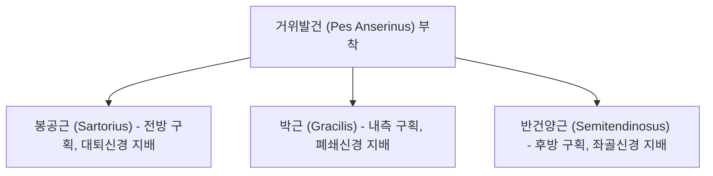

---
aliases:
  - Pes anserine bursitis
  - 거위발건염
  - 거위발점액낭염
tags:
  - 질환
  - 무릎통증
  - 점액낭염
  - 건병증
  - 근골격계
---

# 거위발 점액낭염 (Pes Anserine Bursitis)

> 핵심 요약 (Key Summary):
> 경골(Tibia) 근위 내측면에 부착하는 3개 근육([[봉공근]], [[박근]], [[반건양근]])의 공통 건(거위발건)과 경골 내측측부인대(MCL) 사이에 위치한 점액낭의 염증성 질환.
> 반복적인 무릎 굴곡·신전 마찰, 퇴행성 슬관절염, 비만, 외반슬(Genu valgum) 및 평발(Pes planus) 등의 생체역학적 과부하로 호발.
> 관절선(Joint line) 하방 2~5cm 부위의 명확한 국소 압통과 부종을 보이며, 내측 반월판 손상 및 MCL 손상과의 감별이 필수적.

---

## 1. 해부학적 구조 및 거위발건 (Pes Anserinus Anatomy)

거위발(Pes anserinus)은 거위의 물갈퀴 모양을 닮았다 하여 붙여진 명칭으로, 골반과 대퇴의 서로 다른 구획에서 기원하는 3개 근육이 경골 근위 내측면에 한데 모여 부착합니다:

* **부착부 및 점액낭 위치**:
  * 경골 조면(Tibial tuberosity) 내측 약 2~5cm 하방의 경골 내측과 전면에 부착.
  * **거위발 점액낭(Pes anserine bursa)**은 거위발건과 그 심부의 경골 내측측부인대(MCL) 사이에 위치하여 마찰을 완충합니다.

---

## 2. 병태생리 및 원인 인자 (Etiology & Pathophysiology)

1. **생체역학적 과부하**:
   * 달리기, 자전거 타기, 축구, 수영(평영 킥) 등 무릎의 반복적인 굴곡-신전 및 회전 스트레스.
2. **부정렬 및 구조적 요인**:
   * **외반슬 (Genu valgum, X자 다리)**: 무릎 내측에 가해지는 견인력(Tension) 증가.
   * **과도한 족부 회내 (Overpronation / 평발)**: 경골의 과도한 내회전을 유발하여 거위발건의 신장 스트레스 가중.
   * **Q-각(Q-angle) 증가**: 여성에게 호발하는 해부학적 요인.
3. **퇴행성 관절염(OA)과의 병발**:
   * 내측 슬관절 골관절염 환자의 약 20~30%에서 거위발 점액낭염이 동반되어 관절염 통증을 악화시키는 주요 인자로 작용.

---

## 3. 임상 증상 및 이학적 검사

* **주요 임상 증상**:
  * 경골 내측 상부의 둔탁한 통증 및 국소 부종, 온열감.
  * 계단을 오르내릴 때(특히 내려갈 때), 의자에서 일어날 때 통증 악화.
  * 야간에 무릎을 맞대고 옆으로 잘 때 내측 접촉 통증.
* **이학적 유발 검사**:
  * **국소 압통점 확인**: 관절열극(Joint line) 하방 2~5cm 지점을 압박했을 때 극심한 압통 확인 (관절선 압통과의 명확한 위치 감별).
  * **저항 무릎 굴곡 및 내회전 검사**: 무릎을 굴곡한 상태에서 검사자의 저항에 맞서 굴곡 및 내회전 시킬 때 통증 재현.

---

## 4. 감별 진단 (Differential Diagnosis)

| 질환명 | 핵심 병소 부위 | 통증 특징 및 감별 포인트 |
| :--- | :--- | :--- |
| **거위발 점액낭염** | **관절선 하방 2~5cm** 경골 내측 | 국소 표재성 압통, 계단 오르내리기 통증, McMurray 음성 |
| **내측 반월판 파열** | **내측 관절열극(Joint line)** | 무릎 걸림(Locking), 딸깍 소리(Clicking), McMurray 양성 |
| **내측측부인대(MCL) 염좌** | 대퇴골 내상과 ~ 경골 내측 연결부 | 외반 스트레스 검사(Valgus stress test) 시 통증 및 불안정성 |
| **퇴행성 골관절염** | 슬관절 전반 및 내측 관절선 | 관절 간격 협소, 골극 형성, 아침 기상 시 조조강직 |

---

## 5. 한의 임상 치료 프로토콜

* **침구 및 봉약침 치료**:
  * 경혈점: 음릉천(SP9), 곡천(LR8), 무릎 내측 아시혈(Ashixue).
  * **봉약침/소염약침**: 점액낭 주변에 직접 주입하여 강력한 소염, 삼출액 흡수 촉진 및 건 부착부 재생 유도.
* **근막 이완 및 3대 원인근 침 치료**:
  * [[봉공근]](ASIS 부근 및 대퇴 전내측), [[박근]](치골하지 및 대퇴 내측), [[반건양근]](좌골결절 및 대퇴 후면)의 트리거 포인트(Trigger point) 침자 및 장침 이완술.
* **추나 및 운동 재활**:
  * 족부 종아치 테이핑 및 인솔 적용(과도한 족부 회내 억제).
  * 햄스트링 및 고관절 내전근 스트레칭, 대퇴사두근(특히 내측광근) 강화 운동.

---

## 6. 📚 출처 및 학술 연구 요약 (References)

1. Helfenstein, M. Jr., & Kuromoto, J. (2010). "Anserine syndrome." *Revista Brasileira de Reumatologia*, 50(3), 313-327.
   - [연구 요약] 거위발 증후군의 해부학적 구성과 유병률, 특히 당뇨 및 비만을 동반한 무릎 골관절염 여성에서의 높은 발생률과 초음파 감별 가치를 체계화.
2. Mohseni, M., et al. (2021). "Pes Anserine Bursitis." *StatPearls Publishing*.
   - [연구 요약] 거위발 점액낭의 병태생리, 보존적 물리치료, 국소 소염 약침 및 스테로이드 주사의 효능과 생체역학적 교정 전략을 정리.
