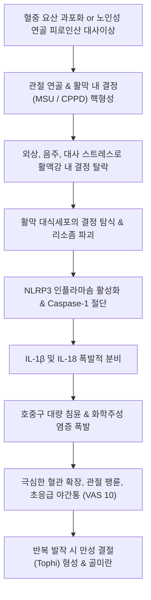

# 🩺 결정성 관절염 (Crystal-Induced Arthritis)

> **상위 분류**: [[근골격계 질환]] > [[하지 질환]] > [[대사성 및 염증성 관절염]]
> **핵심 3줄 요약 (Key Summary)**:
> - 📍 병소 부위 & 해부·병태생리: 관절강 및 관절 주변 연부조직에 미세 결정(요산염 MSU, 피로인산칼슘 CPPD, 염기성 인산칼슘 BCP)이 침착되어 대식세포의 **NLRP3 인플라마솜(Inflammasome)**을 자극하고 [[IL-1β]] 등 염증성 사이토카인의 폭발적 분비를 유발하는 대사성 결정 질환군.
> - 🚩 전형적 임상 양상: 야간에 돌발하는 극심한 맹렬통(VAS 9~10), 침범 관절의 급격한 발적·열감·팽륜, 제1 중족족지관절(1st MTP)의 전형적 [[통풍]](Podagra) 발작 및 노인 슬관절·수근관절의 [[가성통풍]](CPPD) 발작.
> - 🛠️ 핵심 검사 & 치료 전략: 관절강 천자액의 편광현미경 검사(MSU: 강한 음성 복굴절 바늘형 vs CPPD: 약한 양성 복굴절 능형), 급성기 소염 진통 한약([[사묘환]], [[대황목단피탕]]) 및 청열해독 약침, 양방 콜키신(Colchicine) 및 단기 NSAIDs/스테로이드 중재.
> - ⚠️ 응급 의뢰 레드플래그: 급성 화농성 관절염(Septic arthritis)과의 감별을 위해 전신 발열(>38.3℃), 심한 오한, 관절액 혼탁 시 즉시 관절 천자 및 그람염색·배양 의뢰 필수! 급성 통풍 발작 중 요산강하제(Allopurinol, Febuxostat) 신규 투여 절대 금기(혈중 농도 급변으로 발작 악화).

---

## 📌 목차
1. [질환 개요 & 해부학적 병태생리](#1-질환-개요--해부학적-병태생리)
2. [병태생리 메커니즘 & 생체역학적 악순환 네트워크](#2-병태생리-메커니즘--생체역학적-악순환-네트워크)
3. [임상 증상 & 이학적 검사(Physical Exam) 알고리즘](#3-임상-증상--이학적-검사physical-exam-알고리즘)
4. [감별 진단 매트릭스 (Differential Diagnosis)](#4-감별-진단-매트릭스--differential-diagnosis)
5. [한의 통합 치료 프로토콜 (침·약침·추나·한약)](#5-한의-통합-치료-프로토콜-침약침추나한약)
6. [양방 치료 & 병용·의뢰 기준 (Conventional Treatment & Referral)](#6-양방-치료--병용의뢰-기준-conventional-treatment--referral)
7. [재활 운동 & 생활습관 티칭 가이드](#7-재활-운동--생활습관-티칭-가이드)
8. [💡 사용자 진료실 핵심 필기 & 임상 노하우 (Melt-In 잔여 심화 집약)](#8--사용자-진료실-핵심-필기--임상-노하우-melt-in-잔여-심화-집약)
9. [출처 및 학술 참고 문헌 (References)](#9-출처-및-학술-참고-문헌-references)

---

## 1. 질환 개요 & 해부학적 병태생리

### 1.1 개요 및 3대 결정성 질환 분류
**결정성 관절염(Crystal-Induced Arthritis)**은 관절 활액강 및 관절 연골, 활막, 건 실질 내에 무기질 또는 대사산물 결정이 비정상적으로 침착되면서 급격한 화학적-면역학적 급성 관절염을 유발하는 질환군이다.
1. **요산일나트륨 결정 침착증 ([[통풍]], Gout)**:
   - 퓨린(Purine) 대사의 최종 산물인 요산의 과다 생성 또는 신장 배설 저하로 혈중 요산이 과포화(>6.8 mg/dL)되어 요산일나트륨(Monosodium Urate, MSU) 결정이 침착됨.
   - 40~60대 남성에서 호발하며, 제1 중족족지관절(1st MTP), 발목, 족근관절에 집중됨.
2. **피로인산칼슘 이수화물 침착 질환 ([[가성통풍]], CPPD / Pseudogout)**:
   - 관절 초자연골 및 섬유연골 내에 피로인산칼슘(Calcium Pyrophosphate Dihydrate, CPPD) 결정이 침착되어 연골석회화증(Chondrocalcinosis)을 유발함.
   - 65세 이상 고령층에서 호발하며, 주로 **슬관절(무릎), 수근관절(손목), 치골결합**을 침범함.
3. **염기성 인산칼슘 침착증 (BCP / [[석회성 건염]])**:
   - 수산화인회석(Hydroxyapatite) 결정이 회전근개 등 힘줄과 점액낭에 침착되어 급성 흡수기 극통을 초래함.

![[청강의감28_02_통풍_관절_요산염침착.jpg|400]]
> [그림 1: 통풍성 관절염에서의 요산염 결정 침착 및 관절 주변 활막 염증 병태도 — 청강의감 임상도해]

---

## 2. 병태생리 메커니즘 & 생체역학적 악순환 네트워크

### 2.1 분자생물학적 염증 기전: NLRP3 인플라마솜 축 (PMID 42656754)
결정성 관절염의 급성 발작은 단순한 기계적 마찰이 아닌 **선천면역계의 결정 탐식 반응**에 의해 발발한다.
1. **결정 침착 및 탈락**: 관절 연골이나 연부조직에 침착되어 있던 결정(MSU 또는 CPPD)이 외상, 알코올 섭취, 이뇨제 복용, 수술, 감염 등의 유발 요인에 의해 활액강 내로 떨어져 나온다(Crystal shedding).
2. **대식세포 포식작용**: 관절강 내 상주 대식세포와 활막세포가 결정을 이물질로 인식하여 식균 작용을 수행한다.
3. **NLRP3 인플라마솜 활성화**: 결정이 파고사이토시스된 후 리소좀 파괴가 일어나고, 세포 내 NLRP3 인플라마솜 복합체가 조립되어 Caspase-1을 활성화시킨다.
4. **IL-1β 대량 방출**: 비활성 Pro-IL-1β가 활성형 [[IL-1β]]로 전환되어 폭발적으로 분비되며, 이는 호중구(Neutrophil)를 관절강 내로 급격히 유인하여 극심한 혈관 확장, 모세혈관 누출, 조직 파괴를 초래한다.

![[화농성관절염_관절강천자_화농성_활액삼출물_임상사진.jpg|400]]
> [그림 2: 급성 결정성 관절염 및 화농성 감별을 위한 관절강 천자 활액 소견 — 임상 검체 실사]

### 2.2 결정성 관절염의 생체역학적 악순환

---

## 3. 임상 증상 & 이학적 검사(Physical Exam) 알고리즘

### 3.1 주요 증상 양상
- **초응급 야간 급통**: 대부분 환자가 깊이 잠든 새벽에 발가락이나 무릎이 칼로 베이거나 불에 타는 듯한 극통으로 비명을 지르며 깨어남. 이불 깃만 스쳐도 극심한 통증 호소.
- **국소 발적과 열감, 부종**: 관절 주변 피하 조직이 자줏빛 붉은색(Erythema)으로 변하고 터질 듯이 부어오름.
- **통풍 결절(Tophi)**: 만성 결절성 통풍 단계에 도달하면 이개(귓바퀴), 팔꿈치 주두점액낭, 아킬레스건, 수지 관절에 단단한 백색 결절이 만져지며 피부가 궤양화되어 분필가루 같은 요산염이 배출되기도 함.

![[화농성관절낭염_슬개전점액낭염_급성종창_임상사진.jpg|400]]
> [그림 3: 급성 결정성 관절염 발작 시의 극심한 국소 발적 및 활액낭 종창 — 임상사진]

![[화농성관절염_급성기_슬관절_Xray_수종소견.jpg|400]]
> [그림 4: 급성 결정성 관절염 및 화농성 관절염 감별을 위한 단순 방사선 관절강 수종 소견 — 임상 방사선 영상]

![[발허리뼈골절_05_술기실사_족부침치료.jpg|400]]
> [그림 5: 통풍 호발 부위인 제1 중족족지관절 주변 순환 개선 침구 치료 실사 — 한의 임상술기]

### 3.2 진단 및 편광현미경 검사 (Gold Standard)
1. **관절액 흡인 편광현미경 검사(Polarized Light Microscopy)**:
   - **통풍 (MSU)**: 바늘 모양(Needle-shaped) 결정, **강한 음성 복굴절(Strong Negative Birefringence)**. 보상판의 느린 축과 평행할 때 노란색(Yellow), 수직일 때 파란색(Blue)을 띰.
   - **가성통풍 (CPPD)**: 짧은 막대형 또는 능형(Rhomboid) 결정, **약한 양성 복굴절(Weak Positive Birefringence)**. 보상판과 평행할 때 파란색, 수직일 때 노란색을 띰.
2. **단순 방사선 검사 (X-ray)**:
   - 통풍: 초기에는 연부조직 종창만 관찰되나, 만성기에는 결절 주변 뼈가 파먹힌 듯한 **돌출된 골극 변연(Overhanging edge)을 동반한 펀치아웃(Punched-out) 골미란** 관찰.
   - 가성통풍: 슬관절 반월상연골, 관절 초자연골, 삼각섬유연골복합체(TFCC)에 하얗게 선형으로 침착된 **연골석회화증(Chondrocalcinosis)** 관찰.

---

## 4. 감별 진단 매트릭스 (Differential Diagnosis)

| 질환명 | 호발 부위 및 환자군 | 편광현미경 소견 | X-ray 특징 | 결정적 감별 포인트 |
| :--- | :--- | :--- | :--- | :--- |
| **[[통풍]](MSU)** | 중년 남성, 제1 중족족지관절(1st MTP) | **바늘형, 강한 음성 복굴절** | 펀치아웃 골미란(Overhanging edge) | 고요산혈증, 음주·고기 후 발작 |
| **[[가성통풍]](CPPD)** | 65세 이상 고령, 슬관절, 수근관절 | **능형, 약한 양성 복굴절** | 연골석회화증(Chondrocalcinosis) | 요산 수치 정상, 노인 슬관절 가성 패혈증 |
| **[[화농성 관절염]]** | 전 연령, 단관절(슬관절 다발) | 결정 음성, **백혈구 >50,000/μL** | 관절강 삼출, 골파괴 | **전신 고열, 오한, 그람염색 양성 (응급 배농)** |
| **봉와직염 (Cellulitis)** | 하지 피부 전반 | 관절액 없음 | 정상 연부조직 부종 | 피부 국한, 관절 수동 가동 시 통증 없음 |
| [[류마티스 관절염]] | 중년 여성, 양측 수부 대칭성 | 결정 음성, 림프구 침윤 | 골감소증, 대칭적 관절강 협착 | 조조강직 1시간 이상, RF/Anti-CCP 양성 |

---

## 5. 한의 통합 치료 프로토콜 (침·약침·추나·한약)

![[무릎염좌_05_술기실사_측부인대_자침치료.jpg|400]]
> [그림 6: 가성통풍 호발 슬관절 주변 경혈 자침 및 소염 침구 치료 실사 — 한의 임상술기]

![[수부질환_05_수부침치료실사_수지침.jpg|400]]
> [그림 7: 말초 소관절 통풍 결절 및 관절 활막염 순환 촉진을 위한 침술 실사 — 한의 임상술기]

### 5.1 급성기 침구 치료 (청열제습 및 국소 소종)
- **혈위 선정**:
  - 족부(통풍): 태충(LR3), 행간(LR2), 대돈(LR1), 공손(SP4), 삼음교(SP6), 족삼리(ST36).
  - 슬관절(가성통풍): 독비(ST35), 내슬안, 음릉천(SP9), 양릉천(GB34), 혈해(SP10).
- **자침 기법**:
  - 발적과 열감이 극심한 병소 중심부는 직접 강자극을 피하고, 원위 취혈 및 병소 변연부 사자(斜刺)를 통해 기혈 울체를 소통시킨다.
  - 급성기 충혈 완화를 위해 은백, 대돈, 소상 등 정혈(井穴)에 삼릉침을 이용한 점자출혈(사혈요법)을 적용하면 즉각적인 내압 감소와 진통 효과를 거둘 수 있다.

### 5.2 약침 치료 (Pharmacopuncture)
- **황련해독탕 약침 / 소염약침**: 급성기 국소 화학적 염증과 화열(火熱)을 가라앉히기 위해 관절 주변 연부조직에 1.0~2.0cc를 피내/피하 주입.
- **신바로약침**: 아급성기 및 관절 연골 보호를 위해 관절강 주변 지지 인대 부위에 1.0cc 시술.
- ⚠️ 급성기 고농도 봉약침(Bee venom)은 비만세포 탈과립을 자극하여 일시적으로 관절 팽륜을 악화시킬 수 있으므로, 급성 발작기에는 황련해독탕 약침을 우선하고 아급성기/만성기 관해기에 저농도(1:30,000)로 신중히 적용한다.

### 5.3 한약 처방 (변증 치료)
- **급성 습열비(濕熱痺) 단계 (발작기)**:
  - 관절이 붉게 붓고 불에 타는 듯하며 갈증과 황뇨가 동반된 경우.
  - 처방: [[사묘환]](황백, 창출, 우슬, 의이인) 합 [[당귀점통탕]] 가미. 또는 [[대황목단피탕]] 가감(대황, 망초, 도인, 목단피)으로 습열과 어혈을 장관을 통해 신속 배출시킨다.
- **만성 담어호결(痰瘀互結) 및 간신허(肝腎虛) 단계 (간헐기·만성기)**:
  - 관절 결절이 굳어지고 신기능 저하로 요산 배설이 원활하지 않은 경우.
  - 처방: [[오적산]] 합 [[독활기생탕]], [[소경활혈탕]] 가감 (토복령, 비해, 차전자, 백선피 배합). 요산 배설을 촉진하고 관절 인대 변형을 방지한다.

---

## 6. 양방 치료 & 병용·의뢰 기준 (Conventional Treatment & Referral)

### 6.1 급성 발작기 약물 치료
- **콜키신 (Colchicine)**: 미세소관 중합을 억제하여 호중구의 유주와 식균 작용을 차단. 발작 시작 24~36시간 이내 투여 시 가장 효과적 (초기 1.0~1.2mg 복용 후 1시간 뒤 0.5~0.6mg 추가).
- **NSAIDs**: 나프록센, 인도메타신 등 단기 고용량 투여.
- **경구/관절강 내 스테로이드**: 신기능 저하로 콜키신이나 NSAIDs를 복용할 수 없는 고령자에게 프레드니솔론 단기 요법 또는 관절 천자 후 트리암시놀론 주입.

### 6.2 만성기 요산강하요법 (ULT, Urate-Lowering Therapy) (PMID 42629330)
- **적응증**: 연 2회 이상 급성 발작, 통풍 결절 존재, X-ray상 골미란, 요로결석 동반.
- **약물**:
  - 알로푸리놀(Allopurinol): 잔틴 산화효소(Xanthine Oxidase) 억제제 (HLA-B*5801 유전자 보유 한국인에서 중증 약물피부반응 SCAR 위험 주의).
  - 페북소스타트(Febuxostat): 비퓨린계 선택적 XO 억제제.
  - 목표 혈중 요산 수치: **<6.0 mg/dL** (결절성 통풍은 <5.0 mg/dL).

---

## 7. 재활 운동 & 생활습관 티칭 가이드

### 7.1 식이요법 4대 수칙
1. **고퓨린 식품 제한**: 동물의 간·내장, 붉은 육류, 등푸른생선(고등어, 정어리), 진한 고기 국물 섭취 절제.
2. **알코올 절대 금기**: 맥주는 퓨린 함량이 매우 높으며, 소주나 위스키 등 모든 알코올은 신장에서 젖산을 생성하여 요산 배설을 경쟁적으로 억제함.
3. **과당(Fructose) 음료 차단**: 액상과당이 든 청량음료, 탄산음료는 간에서 ATP를 고갈시키며 요산 생성을 촉진함.
4. **일일 2L 이상 충분한 수분 섭취**: 소변을 희석하여 신장 내 요산염 결정 석출 및 요로결석 형성을 예방.

---

## 8. 💡 사용자 진료실 핵심 필기 & 임상 노하우 (Melt-In 잔여 심화 집약)

### 8.1 발작 중에 절대 요산강하제를 시작하지 마라 (가장 흔한 진료실 오류)
- 발가락이 퉁퉁 부어 극통을 호소하는 환자가 혈액검사상 요산이 9.0 mg/dL로 나왔다고 해서, 그 자리에서 자일로릭(Allopurinol)이나 페브릭(Febuxostat)을 처방하면 **의료 사고** 수준의 결과를 낳는다.
- 혈중 요산 농도가 급격히 떨어지면 관절 내에 안정되어 있던 요산염 결정이 깨져 나오면서(Crystal dissolution shedding) 2차성 맹렬 발작이 일어나 환자가 극심한 고통에 빠진다.
- **철칙: 급성기에는 오직 소염진통(사묘환, 콜키신, NSAIDs)으로 불부터 완전히 끄고, 통증이 완전히 사라진 2~4주 뒤에 요산강하제를 최저 용량부터 서서히 투여해야 한다.**

### 8.2 노인 무릎 물 찼을 때 가성통풍(CPPD)을 의심하는 감각
- 70~80대 할머니가 무릎이 갑자기 빨갛게 부어오르고 열이 펄펄 끓으며 걸을 수 없다고 내원했을 때, 젊은 의사들은 화농성 관절염으로 오인해 기겁하는 경우가 많다.
- 무릎 단순 방사선 사진을 찍어 관절 연골 틈새에 하얀 분필가루 같은 선형 석회화(Chondrocalcinosis)가 보인다면 90% 이상 가성통풍이다.
- 관절 천자로 혈성/혼탁 활액을 감압 배출시키고 소염약침 및 대황목단피탕·사묘환을 투여하면 2~3일 내에 극적으로 가라앉는다.

---

## 9. 출처 및 학술 참고 문헌 (References)

1. **Terkeltaub R et al. (2025)**. Follow the Molecule from Crystal Arthropathy to Comorbidities: The 2024 G-CAN Gold Medal Award Awardee Lecture. *Gout Urate Cryst Depos Dis*. 3:17. [PMID: 42676739](https://pubmed.ncbi.nlm.nih.gov/42676739/)
   - *[연구 요약]*: 요산염 및 피로인산칼슘 미세 결정이 유발하는 NLRP3 인플라마솜 활성화 분자 경로와 심혈관, 대사성 동반 질환 간의 상호작용 기전을 체계적으로 고찰함.

2. **Assabag Y et al. (2026)**. The Great Mimickers: Navigating Diagnostic Pitfalls in Modern Rheumatology. *Cureus*. 18:e113645. [PMID: 42668922](https://pubmed.ncbi.nlm.nih.gov/42668922/)
   - *[연구 요약]*: 결정성 관절염(가성통풍, 통풍)과 급성 패혈성 화농성 관절염, 봉와직염 간의 임상적 유사성과 감별 진단상의 주의점을 분석한 류마티스 임상 지침.

3. **Chen X et al. (2026)**. Trained immunity in gout: epigenetic and metabolic reprogramming of innate immune memory. *Front Immunol*. 17:1914001. [PMID: 42656754](https://pubmed.ncbi.nlm.nih.gov/42656754/)
   - *[연구 요약]*: 요산염 결정이 골수계 선천면역 세포의 후성유전학적 재프로그래밍과 훈련 면역(Trained immunity)을 유도하여 만성 재발성 염증을 영구화하는 메커니즘을 규명함.

4. **Wei Q et al. (2026)**. Time-varying cardiovascular risk of febuxostat vs. allopurinol in gout: a one-stage meta-analysis. *Rheumatology (Oxford)*. 65:. [PMID: 42629330](https://pubmed.ncbi.nlm.nih.gov/42629330/)
   - *[연구 요약]*: 만성 통풍 환자의 장기 요산강하요법에서 페북소스타트와 알로푸리놀 투여군 간의 심혈관계 안전성 및 시간 경과에 따른 심혈관 위험도를 비교 분석한 대규모 메타분석.
