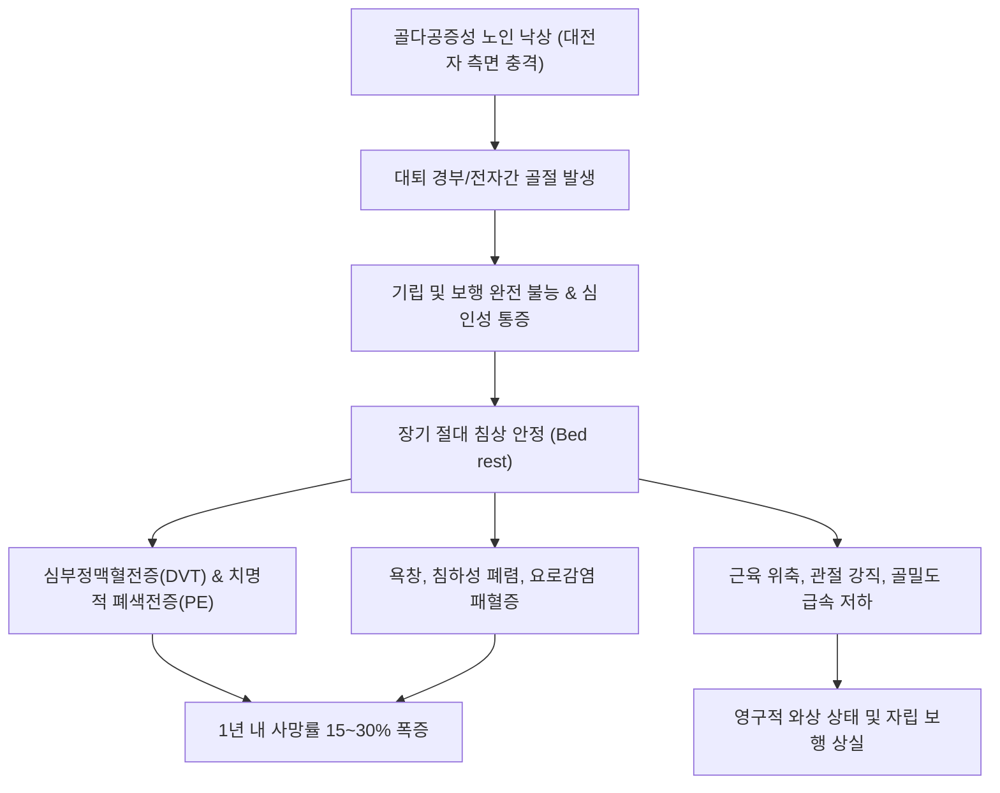

# 🩺 고관절 골절 (Hip Fractures)

> **핵심 3줄 요약 (Key Summary)**:
> - 📍 **병소 부위 & 해부·병태생리**: 고관절 골절은 대퇴골두 직하방의 경부(관절낭 내)부터 소전자 하방 5cm(관절낭 외)까지의 근위부 대퇴골 골절을 총칭하며, [[골다공증]](Osteoporosis)을 앓는 고령 환자에서 경미한 실내 낙상으로 다발한다.
> - 🚩 **전형적 임상 양상**: 낙상 후 서혜부 및 둔부의 극심한 통증, 기립 및 보행 불가, **환측 하지의 단축(Shortening)과 외회전(External rotation) 변형**. 고령층에서 장기 침상 안정 시 욕창, 폐렴, 심부정맥혈전증(DVT)으로 1년 내 사망률이 15~30%에 달한다.
> - 🛠️ **핵심 검사 & 치료 전략**: 골반 AP 및 고관절 측면(Cross-table lateral) X-ray, 잠재 골절 시 3D CT 및 MRI. 24~48시간 이내 조기 수술(경부 골절은 BHA/THA 인공관절 반치환술/전치환술, 전자간 골절은 골수내정 PFNA 고정술)로 조기 침상 이탈 유도. 수술 직후 기혈 보강([[십전대보탕]], [[보중익기탕]]) 및 조기 보행 재활 전침·약침 치료 병행.
> - ⚠️ **응급 의뢰 레드플래그**: 혈역학적 불안정(저혈압, 빈맥), 광범위한 대퇴 피하 혈종 급증, 하지 족배동맥 맥박 소실, 급성 섬망 및 폐색전증 의심 흉통/호흡곤란 발생 시 즉시 상급병원 응급실 전원.

---

## 📌 목차
1. [질환 개요 & 해부학적 병태생리](#1-질환-개요--해부학적-병태생리)
2. [병태생리 메커니즘 & 생체역학적 악순환 네트워크](#2-병태생리-메커니즘--생체역학적-악순환-네트워크)
3. [임상 증상 & 이학적 검사(Physical Exam) 알고리즘](#3-임상-증상--이학적-검사physical-exam-알고리즘)
4. [감별 진단 매트릭스 (Differential Diagnosis)](#4-감별-진단-매트릭스-differential-diagnosis)
5. [한의 통합 치료 프로토콜 (침·약침·추나·한약)](#5-한의-통합-치료-프로토콜-침약침추나한약)
6. [양방 치료 & 병용·의뢰 기준 (Conventional Treatment & Referral)](#6-양방-치료--병용의뢰-기준-conventional-treatment--referral)
7. [재활 운동 & 생활습관 티칭 가이드](#7-재활-운동--생활습관-티칭-가이드)
8. [💡 사용자 진료실 핵심 필기 & 임상 노하우 (Melt-In 잔여 심화 집약)](#8--사용자-진료실-핵심-필기--임상-노하우-melt-in-잔여-심화-집약)
9. [출처 및 학술 참고 문헌 (References)](#9-출처-및-학술-참고-문헌-references)

---

## 1. 질환 개요 & 해부학적 병태생리

고관절(Hip joint)은 비구(Acetabulum)와 대퇴골두(Femoral head)가 맞물리는 대표적인 구와 관절(Ball-and-socket joint)로, 직립 보행 시 체중의 3~5배에 달하는 하중을 지탱한다. 고관절 골절은 근위부 대퇴골(Proximal femur)에 발생하는 골절을 포괄하는 임상적 개념이며, 골절선의 해부학적 위치에 따라 크게 관절낭 내(Intracapsular) 골절과 관절낭 외(Extracapsular) 골절로 양분된다.

![[고관절골절_01_병태도해_고관절골절_유형별도해.png]]
> [그림 1: ① 병태생리·도해 — 근위부 대퇴골의 해부학적 분류: 대퇴골두하/경부(관절낭 내) 골절과 전자간/전자하(관절낭 외) 골절 모식도 (Wikimedia Commons)]

1. **관절낭 내 골절**:
   - **[[대퇴골 경부 골절]](Femoral neck fracture)**: 골두 직하방부터 전자간선(Intertrochanteric line) 사이.
   - 골막이 없어 신생 가골 형성이 불리하며, 관절낭 내 압력 상승 및 지대 동맥망(Retinacular vessels) 파열로 대퇴골두 [[무혈성 괴사]](Avascular necrosis, AVN)와 불유합 위험이 매우 높다.
2. **관절낭 외 골절**:
   - **대퇴 전자간 골절(Intertrochanteric fracture)**: 대전자와 소전자를 잇는 전자간 능선 부위.
   - 풍부한 해면골(Cancellous bone)과 두터운 골막, 양호한 혈류 공급 덕분에 골유합은 우수하나, 해면골 파쇄로 출혈량(500~1,000mL)이 많고 고령 환자의 기저 내과 질환을 급격히 악화시킨다.
   - **대퇴 전자하 골절(Subtrochanteric fracture)**: 소전자 하방 5cm 이내. 강력한 근육 견인력(장요근 굴곡, 중둔근 외전, 대퇴내전근 내전)으로 골편 정복 유지가 매우 어렵다.

![[고관절골절_01_영상의학_대퇴전자간골절_Xray.jpg]]
> [그림 2: ① 병태생리·영상 — 노인 낙상으로 발생한 대퇴 전자간 전위 골절 단순 방사선(X-ray) 소견 (Wikimedia Commons)]

---

## 2. 병태생리 메커니즘 & 생체역학적 악순환 네트워크

### 손상 생체역학 (Biomechanical Cascade)
고령층 고관절 골절의 90% 이상은 선 자세에서의 단순 낙상(Fall from standing height)에서 비롯된다. 대전자(Greater trochanter) 측면으로 직접 바닥에 충돌할 때 대퇴 경부 및 전자간부에 강력한 전단력(Shear force)과 굽힘 모멘트(Bending moment)가 집중되면서 취약해진 골소주(Trabeculae)가 파괴된다.

![[고관절골절_02_해부도해_대퇴골두혈류_회선동맥망.png]]
> [그림 3: ② 관련 해부 구조물 — 대퇴골두 혈류를 공급하는 내측 및 외측 대퇴회선동맥 분지 주행도 (Wikimedia Commons)]

대퇴골두의 주 혈류원은 심대퇴동맥에서 분지하는 **내측대퇴회선동맥(Medial circumflex femoral artery)**의 지대혈관(Retinacular arteries)이다. 관절낭 내 경부 골절 시 이 혈관망이 단절되어 골두 허혈이 초래된다.

골절 자체보다 **골절 후 침상 안정에 따른 전신 합병증(욕창, 폐렴, DVT, 섬망)**이 환자의 생명을 위협하므로, 현대 정형외과학에서는 수상 후 **24~48시간 이내 조기 수술**을 통한 조기 체중 부하 및 침상 이탈을 절대 원칙으로 삼는다 (Vadalà et al., 2026).

---

## 3. 임상 증상 & 이학적 검사(Physical Exam) 알고리즘

### 임상 증상
- **서혜부 및 둔부 격통**: 수상 직후 서혜부 전방 또는 대전자 부위의 극심한 압통 및 운동 시 격통.
- **보행 불능**: 다리에 힘을 줄 수 없으며 체중 부하가 전혀 불가능.
- **전형적 자세 변형**:
  - **하지 단축(Limb shortening)**: 대퇴골간부가 둔근 및 장요근의 견인에 의해 상방으로 전위.
  - **외회전 변형(External rotation deformity)**: 장골대퇴인대(Y-ligament)의 지지 작용과 중력, 외회전근의 장력에 의해 발끝이 바깥쪽으로 80~90도 회전되어 침상에 누움.
- **대퇴부 종창 및 반상출혈**: 특히 전자간 골절의 경우 수상 수일 내 광범위한 피하 혈종이 대퇴부 외측과 둔부에 출현.

### 이학적 검사 알고리즘
1. **변형 및 혈관 신경 평가**:
   - 양측 하지 길이 측정(ASIS에서 내과까지의 진성 하지 길이 비교).
   - 발등 동맥(족배동맥) 맥박 및 발가락 능동 운동, 감각 검사로 좌골신경 및 대퇴동맥 손상 배제.
2. **힐 스트라이크 타진 검사(Heel tap test)**: 발뒤꿈치를 가볍게 주먹으로 쳤을 때 고관절 심부로 방사되는 날카로운 통증 확인.
3. **영상 검사**:
   - **X-ray**: 골반 정면(Pelvis AP), 환측 고관절 AP 및 Cross-table lateral(하지를 회전시키지 않고 촬영하는 측면상).
   - **CT 및 MRI**: 전위가 없는 감입 골절(Impacted fx)이나 방사선 음성 골절의 경우 24시간 내 MRI 또는 3D CT로 잠재성 골절 확진.

---

## 4. 감별 진단 매트릭스 (Differential Diagnosis)

| 질환명 | 호발 연령/기전 | 특징적 신체 변형 | X-ray 소견 | 치료 접근법 |
| :--- | :--- | :--- | :--- | :--- |
| **[[대퇴골 경부 골절]]** | 고령 / 경미 낙상 | 하지 단축 + 중등도 외회전 | 관절낭 내 골절선, Shenton선 파열 | 연령에 따라 나사 고정 또는 인공관절(BHA/THA) |
| **대퇴 전자간 골절** | 고령 / 낙상 | 현저한 하지 단축 + 극심한 외회전(90°) | 전자간 해면골 분쇄, 광범위 혈종 | 골수내정(PFNA) 또는 압박고관절나사(DHS) |
| **[[골반 골절]](치골지 골절)** | 고령 낙상 또는 고에너지 | 하지 단축 없음, 서혜부 압통 | 치골 상하가지 골절, 골반환 유지 | 안정형의 경우 4~6주 보존적 침상안정 및 점진 보행 |
| **대퇴 전자부 점액낭염** | 중장년 과사용 | 자세 변형 없음, 보행 가능 | 골절선 없음, 골음영 정상 | 국소 약침, 스트레칭, 소염진통 |
| **고관절 후방 탈구** | 교통사고(대시보드 손상) | **하지 단축 + 내회전(Internal rotation)** | 대퇴골두가 비구 후상방으로 전위 | 6시간 이내 응급 비수술적 도수 정복 필수 |

---

## 5. 한의 통합 치료 프로토콜 (침·약침·추나·한약)

고관절 골절은 1차적으로 응급 수술이 필수적인 질환이다. 한의 치료는 **수술 직후 급성 회복기부터 진입하여 조기 보행 유도, 혈전증 예방, 전신 쇠약 방지, 골유합 촉진**을 목표로 한다.

![[고관절골절_05_술기실사_담경_환도혈_자침도해.jpg]]
> [그림 4: ③ 치료·시술점 — 고관절 수술 후 둔근 위축 방지 및 신경 재생을 위한 족소양담경(환도 GB30 등) 혈위 자침도 (Wellcome Collection)]

### 1) 침구 및 전침 치료
- **주요 취혈점**: [[환도]](GB30), [[거료]](GB29), [[비관]](ST31), [[복토]](ST32), [[족삼리]](ST36), [[양릉천]](GB34), [[현종]](GB39).
- **자침 기법**:
  - 수술 창상 감염 방지를 위해 절개 부위로부터 최소 3~5cm 떨어진 정상 피부에서 환도 및 거료혈 심자(2.0~2.5촌 직자).
  - 환도-양릉천 전침(2Hz, 연속파 20분) 적용: 대퇴사두근 및 둔근 위축 예방, 좌골신경 및 대퇴신경 흥분성 정상화.

### 2) 약침 및 봉약침 치료
- **[[자하거 약침]](Hominis Placenta)**: 고령 환자의 골대사 저하 및 연부조직 치유 지연을 극복하기 위해 비관 및 거료 부위에 주 2~3회 1.0cc 주입.
- **[[중성어혈약침]]**: 수술 부위 대퇴 외측 혈종 및 부종 흡수 촉진.

### 3) 한약 치료 (단계별 처방)
- **1단계 (수술 직후 1~2주, 활혈거어 & 기혈회복)**:
  - [[당귀수산]](當歸鬚散) 합 [[보중익기탕]](補中益氣湯): 수술 중 실혈(500~1000ml) 보충, 심부정맥혈전증 예방, 식욕 촉진 및 기력 회복.
  - **[[자연동]]**(自然銅, 醋淬) 1.5~2g/일 투여로 조기 골아세포 분화 촉진 (PMID 38256337).
- **2단계 (수술 2주 이후, 보신건골 & 와상 합병증 방지)**:
  - [[독활기생탕]](獨活寄生湯) 가감 또는 삼기음(三奇飮): 신양(腎陽) 허약으로 인한 골유합 지연 방지 및 대퇴골두 골밀도 유지.

---

## 6. 양방 치료 & 병용·의뢰 기준 (Conventional Treatment & Referral)

![[고관절골절_06_양방수술_인공고관절반치환술_방사선.jpg]]
> [그림 5: ③ 치료·시술점 — 대퇴골두 경부 전위 골절에서 시행된 양극성 인공고관절 반치환술(Bipolar Hemiarthroplasty) 방사선 소견 (Wikimedia Commons)]

### 수술적 치료 (Surgical Management)
- **수술 골든타임**: **내원 후 24~48시간 이내 조기 수술**이 1년 사망률을 30% 이상 유의하게 낮춘다 (Vadalà et al., 2026).
- **골절 부위별 수술법**:
  1. **대퇴 경부 골절**:
     - 고령 (>70세, 전위성): **양극성 인공고관절 반치환술(BHA)** 또는 전치환술(THA).
     - 젊은 층 (<65세): 골두 보존을 위한 다발성 유관 나사 고정술(Multiple Cannulated Screws) 또는 FNS.
  2. **대퇴 전자간 골절**:
     - **골수내정(Intramedullary nail, PFNA)**: 대퇴 전자부 골수강 내 네일을 삽입하고 경부에 래그 나사/나선익(helical blade)을 고정하여 조기 체중 부하 허용.
     - 압박고관절나사(Dynamic Hip Screw, DHS).

### 항응고제 복용 환자의 수술 전 관리 (DOACs)
- 와파린 또는 DOACs(Apixaban, Rivaroxaban) 복용 환자는 출혈 위험과 수술 지연 사이의 균형이 중요하며, 역전제 투여 또는 24~48시간 중단 후 신속 수술 진행 (Christoffel et al., 2026).

### 1차 진료실 의뢰 기준
- **응급 전원**: 낙상 후 일어나지 못하고 다리가 바깥으로 돌아가 있으며 서혜부 통증을 호소하는 모든 고령 환자는 즉시 119를 통해 정형외과 응급실로 전원.

---

## 7. 재활 운동 & 생활습관 티칭 가이드

![[고관절골절_07_재활운동_보행기_조기보행재활.jpg]]
> [그림 6: ③ 치료·시술점 — 고관절 수술 후 폐렴 및 혈전증 예방을 위한 워커(Walker) 보행 재활 (Wikimedia Commons)]

### 1) 수술 후 조기 재활 운동
- **수술 당일~1일째**:
  - 발목 펌프 운동(Ankle pumping): 시간당 30회 실시하여 종아리 정맥혈 정체 방지.
  - 침상 끝 걸터앉기(Dangling): 기립성 저혈압 예방.
- **수술 2~3일째**:
  - 워커(Walker)를 이용한 체중 부하 기립 및 조기 보행 훈련.
- **수술 2~6주**:
  - 대퇴사두근 등척성 운동(Quad set, 무릎 뒤 오금 누르기) 및 둔근 등척성 수축(Gluteal squeeze).
  - 고관절 외전 운동(Side-lying hip abduction).

### 2) 인공관절 수술 후 탈구 주의사항 (THA / BHA 공통)
- **후방 탈구 위험 동작 3대 금기 (수술 후 3개월간 엄수)**:
  1. 고관절 90도 이상 과도한 굴곡 금지 (바닥에 쪼그려 앉기, 양반다리 금지).
  2. 다리를 안쪽으로 꼬는 내전(Adduction) 동작 금지.
  3. 발끝을 안쪽으로 모으는 내회전(Internal rotation) 금지.
- **침상 안정 시 양다리 사이에 삼각 베개(Abduction pillow) 거치 필수**.

---

## 8. 💡 사용자 진료실 핵심 필기 & 임상 노하우 (Melt-In 잔여 심화 집약)

- **'허리 아프다'며 휠체어로 내원한 독거노인**: 고령 환자가 낙상 후 허리 통증을 주소증으로 내원하더라도, 침대에 눕혀 서혜부를 누르고 하지를 외회전시켰을 때 심한 통증을 호소한다면 요추 염좌가 아니라 고관절 골절이다. 고령층의 고관절 통증은 요추나 슬관절 통증으로 방사되어 오진되기 쉽다.
- **한약 복용 타이밍**: 수술 후 48시간이 지나 헤모글로빈 수치가 안정되고 장운동(가스 배출)이 확인되면 즉시 당귀수산 합 보중익기탕 계열을 투여하여 수술 후 섬망과 전신 무력증을 차단해야 한다.
- **자연동 사용 시 주의점**: 인공관절 치환술을 받은 환자는 골유합이 치료 목표가 아니므로 자연동보다는 연부조직 재생과 근력 강화를 위한 보기보혈(補氣補血) 및 건비(健脾) 약재에 집중하는 것이 효과적이다. 골수내정 고정술을 받은 전자간 골절 환자에게 자연동을 투여한다.

---

## 9. 출처 및 학술 참고 문헌 (References)

1. **Vadalà A et al. (2026)**. Surgical timing beyond the 48-h guideline in elderly hip fractures: a retrospective evaluation of clinical and functional outcomes in 314 cases. *Musculoskelet Surg*, . [PMID 42472414](https://pubmed.ncbi.nlm.nih.gov/42472414/)
   - [연구 요약]: 65세 이상 고령 고관절 골절 환자 314례 분석 결과, 48시간 이내 조기 수술군이 수술 지연군에 비해 1년 사망률 및 내과적 합병증 발생률이 현저히 낮음을 입증.

2. **Christoffel J et al. (2026)**. [Treatment of proximal femur fractures in patients on direct oral anticoagulants (DOACs) : Review of perioperative management]. *Unfallchirurgie (Heidelb)*, 129(10):666-674. [PMID 42455168](https://pubmed.ncbi.nlm.nih.gov/42455168/)
   - [연구 요약]: 직접 경구 항응고제(DOACs)를 복용 중인 근위부 대퇴골 골절 환자에서 출혈 위험을 최소화하며 조기 수술을 시행하기 위한 주술기 항응고제 조절 가이드라인 제시.

3. **Cara J et al. (2026)**. Outcomes after initial nonoperative management of undisplaced intracapsular femoral neck fractures: a five-year single-center cohort study with structured literature review. *Eur Geriatr Med*, . [PMID 42593606](https://pubmed.ncbi.nlm.nih.gov/42593606/)
   - [연구 요약]: 비전위 관절낭 내 대퇴경부 골절에서 보존적 비수술 치료의 실패율(후속 전위 및 불유합 30% 이상)과 예후를 분석하여 조기 내고정술의 우위성 확인.

4. **Nam EY et al. (2023)**. Therapeutic Efficacy of Chinese Patent Medicine Containing Pyrite for Fractures: A Systematic Review and Meta-Analysis. *Medicina (Kaunas)*, 60(1):164. [PMID 38256337](https://pubmed.ncbi.nlm.nih.gov/38256337/)
   - [연구 요약]: 사지 골절 환자에서 자연동(Pyrite) 함유 한약 복합 제제의 가골 형성 촉진, 골밀도 회복 및 유합 기간 단축에 대한 체계적 문헌고찰 및 메타분석.

---

## 관련 노트

- [[대퇴골 경부 골절]]
- [[골반 골절]]
- [[다리 골절]]
- [[골다공증]]
- [[무혈성 괴사]]
- [[자연동]]
- [[당귀수산]]
- [[보중익기탕]]
- [[독활기생탕]]
- [[환도]]
