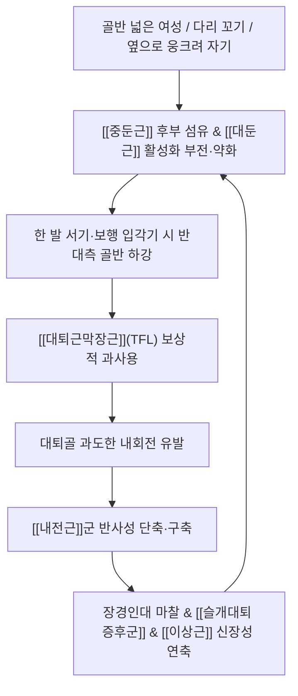

# 🩺 [[고관절 내전 증후군]] (Hip Adduction Syndrome / 股關節 內轉 症候群)

> **핵심 3줄 요약 (Key Summary)**:
> - 📍 병소 부위 & 해부·병태생리: 보행·착석 및 편측 지지 시 고관절이 과도한 내전(Adduction) 및 내회전(Medial rotation) 위치로 편위되는 운동손상증후군(MSI)으로, [[내전근]]군 및 [[대퇴근막장근]](TFL)의 단축과 [[중둔근]](특히 후부 섬유) 및 [[대둔근]]의 신장성 약화 불균형이 핵심 병태.
> - 🚩 전형적 임상 양상 & 3대 징후: 단하지 지지 시 반대측 골반 하강([[트렌델렌버그 테스트]]) 또는 환측 체간 기울임 보상, 대전자 외측 및 서혜부 통증, 2차적 장경인대 마찰·[[슬개대퇴 증후군]] 및 대퇴골 내회전에 의한 [[이상근 증후군]](좌골신경 견인통) 동반.
> - 🛠️ 핵심 감별 검사 & 한·양방 다각적 치료 전략: 단하지 기립 트렌델렌버그 검사, 오버 검사([[Ober test]]), FAIR 검사; 단축된 내전근·TFL 침도/약침 이완, 약화된 중둔근·대둔근 전침 강화 자극, 골반 및 고관절 외전-외회전 교정 추나, 클램쉘/외전 재활 운동.
> - ⚠️ 응급 의뢰 레드플래그 & 악화 요인: 편측 지지 시 고관절 서혜부 서전트 서혜탈장 및 비구관절순 파열 감별, 옆으로 누워 잘 때 환측 고관절이 내전·내회전되도록 방치하는 수면 습관 및 다리 꼬기 절대 금기.

---

## 📌 목차
1. [질환 개요 & 해부학적 병태생리](#1-질환-개요--해부학적-병태생리)
2. [병태생리 메커니즘 & 생체역학적 악순환 네트워크](#2-병태생리-메커니즘--생체역학적-악순환-네트워크)
3. [임상 증상 & 이학적 검사(Physical Exam) 알고리즘](#3-임상-증상--이학적-검사physical-exam-알고리즘)
4. [감별 진단 매트릭스 (Differential Diagnosis)](#4-감별-진단-매트릭스-differential-diagnosis)
5. [한의 통합 치료 프로토콜 (침·약침·추나·한약)](#5-한의-통합-치료-프로토콜-침약침추나한약)
6. [재활 운동 & 생활습관 티칭 가이드](#6-재활-운동--생활습관-티칭-가이드)
7. [💡 사용자 진료실 핵심 필기 & 임상 노하우 (Melt-In 잔여 심화 집약)](#7--사용자-진료실-핵심-필기--임상-노하우-melt-in-잔여-심화-집약)
8. [출처 및 학술 참고 문헌 (References)](#8-출처-및-학술-참고-문헌-references)

---

## 1. 질환 개요 & 해부학적 병태생리

![[Pasted image 20240227020410.png|450]]
> [그림 1: 중둔근 약화에 따른 트렌델렌버그 반응 — 비보상성 반대측 골반 하강(A: Uncompensated) 및 무게중심 이동을 위한 환측 상체 측굴 보상(B: Compensated)]

* **질환 정의 및 개념 (Shirley Sahrmann MSI 모델)**:
  * [[고관절 내전 증후군]](Hip Adduction Syndrome, 흔히 내회전 동반)은 셜리 샤먼(Shirley Sahrmann)의 운동계 손상(Movement System Impairment, MSI) 분류에 속하는 대표적 기능적 생체역학 질환입니다.
  * 보행의 입각기(Stance phase), 한 발 서기, 계단 오르내리기 등의 동작 시 대퇴골이 골반에 대해 과도하게 안쪽으로 모이거나(Adduction) 안쪽으로 비틀리는(Medial rotation) 비정상적 운동 패턴이 고착화되어 고관절, 둔부, 천장관절 및 슬관절에 과부하를 초래합니다.
* **관련 해부학적 구조물**:
  * **골격 및 관절 정렬**: 골반(관골), 비구(Acetabulum), 대퇴골두 및 대전자, 천장관절.
  * **단축·과활성 근육군 (Hypertonic / Shortened)**:
    * 고관절 내전근: [[장내전근]](Adductor longus), [[단내전근]], [[대내전근]], 치골근, 박근.
    * 보상적 외전근/내회전근: [[대퇴근막장근]](Tensor fasciae latae, TFL) — 장경인대(ITB) 긴장 동반.
  * **약화·신장 근육군 (Inhibited / Lengthened)**:
    * 주 외전근: [[중둔근]](Gluteus medius, 특히 후부 섬유), [[소둔근]].
    * 주 신전·외회전근: [[대둔근]](Gluteus maximus), [[이상근]](신장성 긴장 상태), [[대퇴이두근]], 외측광근.
  * **신경 및 혈관**:
    * 외전근 및 장경인대 신장 스트레스로 인한 [[비골신경]](Peroneal nerve) 포착 위험.
    * 천장관절 후면 인대 긴장에 따른 [[상둔피신경]](Superior cluneal nerve) 및 [[대퇴외측피신경]] 포착.

---

## 2. 병태생리 메커니즘 & 생체역학적 악순환 네트워크

![[Pasted image 20240227020359.png|450]]
> [그림 2: 단하지 지지 및 러닝 시 나타나는 과도한 고관절 내전과 골반 하강의 3D 모션 분석 실사 소견]

### 1) 악순환 생체역학: 중둔근 부전과 TFL의 보상적 폭주
* 정상적인 한 발 지지 시에는 [[중둔근]]의 후부 섬유가 수축하여 골반의 수평을 유지하고 대퇴골두를 비구 내에 안정화해야 합니다.
* 그러나 중둔근이 약화되면 인체는 고관절 외전력을 얻기 위해 보조 외전근인 [[대퇴근막장근]](TFL)을 과도하게 끌어다 씁니다(TFL Substitution).
* 문제는 TFL이 외전근이면서 동시에 강력한 **고관절 굴곡근이자 내회전근**이라는 점입니다. TFL을 쓰면 쓸수록 대퇴골은 안쪽으로 회전(내회전)되고, 이로 인해 길항근인 [[내전근]]이 단축된 상태로 굳어지며 내전-내회전이 영구적으로 심화되는 치명적인 악순환이 발생합니다.

![[Pasted image 20240227020428.png|350]]
> [그림 3: 대퇴골의 과도한 내회전과 내전에 의해 팽팽하게 신장되는 이상근(Piriformis) 및 하방을 관통하는 좌골신경(Sciatic nerve) 견인 손상 기전]

### 2) 연쇄 반응: 이상근 증후군, 천장관절 및 무릎 연쇄 손상
1. **[[이상근 증후군]] 연계**: 대퇴골이 안쪽으로 비틀리면(내회전) 천골에서 대퇴골 대전자로 이어지는 [[이상근]]은 과도하게 잡아당겨지는 신장성 긴장(Lengthened tension) 상태에 빠집니다. 팽팽해진 이상근 아래를 지나는 [[좌골신경]]이 끼이면서 둔부 통증과 하지 방사통이 유발됩니다.
2. **골반 전방경사와 요추 측굴**: 내전근의 단축은 장골을 앞으로 당겨 [[골반 전방경사]]와 [[요추 전만]]을 심화시키며, 편측 내전 구축 시 골반 비틀림(측굴)으로 인해 요추 측만 및 요통이 발생합니다.
3. **무릎 슬개대퇴 관절 과부하**: 대퇴골 내전은 무릎의 외반(Valgus) 스트레스를 증가시켜 Q-각(Q-angle)을 급격히 넓히며, 이는 슬개골 외측 편위로 인한 [[슬개대퇴 증후군]] 및 장경인대염을 필연적으로 동반합니다.

---

## 3. 임상 증상 & 이학적 검사(Physical Exam) 알고리즘

### 1) 주소증 및 환자 프로파일
* **호발 대상**: 골반 너비(Q각)가 상대적으로 넓은 여성, 복근 및 둔근력이 약화된 사무직, 다리를 꼬고 앉거나 수면 시 옆으로 웅크려 자는 습관을 가진 환자.
* **주요 증상**:
  - 오래 서 있거나 보행 시 고관절 외측(대전자 부위) 또는 엉치 뒤쪽의 뻐근한 통증.
  - 한 발로 계단을 오를 때 골반이 빠지는 듯한 불안정감과 무릎 전면부의 시린 통증.
  - 장시간 걷고 나면 대퇴 후외측 및 하퇴 외측으로 찌릿한 신경 견인성 저림 발현.

### 2) 필수 이학적 검사법 (Physical Examination)

| 검사명 | 검사 방법 | 양성 반응 및 임상적 의의 |
| :--- | :--- | :--- |
| **[[트렌델렌버그 테스트]]** | 환자에게 아픈 쪽 다리로 30초간 한 발 서기를 지시 | 지지하지 않는 반대측 골반이 아래로 떨어지거나, 골반을 수평으로 유지하기 위해 상체를 환측으로 기우는 보상 반응(Compensated sign) 관찰 |
| **오버 검사 ([[Ober test]])** | 건측으로 누운 측와위에서 환측 무릎을 90° 굴곡한 채 고관절을 외전·신전 후 천천히 침대 바닥으로 하강 | [[대퇴근막장근]](TFL)과 장경인대(ITB)의 단축으로 인해 다리가 침대 면으로 자연스럽게 떨어지지 않고 공중에 수평으로 뜸 |
| **측와위 이상근 신장 검사** | 환자를 옆으로 눕히고 고관절을 60° 굴곡시킨 뒤, 골반(관골)을 고정한 채 무릎을 아래로 강하게 내전 | 신장된 [[이상근]]의 심부 둔통 유발 (내전-내회전 변위에 의한 2차성 이상근 긴장 확인) |
| **단하지 스쿼트 검사 (Single Leg Squat)** | 한 다리로 서서 가볍게 스쿼트를 수행 | 무릎이 안쪽으로 꺾이며 내전(Knee valgus)되고 골반이 회전되는 동적 정렬 붕괴 확인 |

![[Pasted image 20240227020446.png|400]]
> [그림 4: 측와위 고관절 굴곡·내전 유발 검사 — 골반을 고정한 채 대퇴골을 내전시켜 신장성 긴장에 놓인 이상근의 압통을 확인하는 모습]

---

## 4. 감별 진단 매트릭스 (Differential Diagnosis)

| 감별 질환 | 호발 병소 및 원인 | 주소증 차이점 | 특이적 이학적 검사 소견 |
| :--- | :--- | :--- | :--- |
| **[[고관절 내전 증후군]]** (본 질환) | [[중둔근]] 약화 및 [[내전근]]·TFL 단축 구축 | 보행 입각기 시 골반 하강, 대퇴골 내회전 보행, 외측/후면 통증 | [[트렌델렌버그 테스트]] 양성, [[Ober test]] 양성 |
| **[[대전자점액낭염]]** | 대전자 외측 점액낭의 기계적 마찰 | 대전자 뼈 바로 위를 손가락으로 누를 때 극심한 국소 압통 | 대전자 골막 직접 압통, 보행 시 통증 심하나 정적 골반 안정성은 유지 |
| **[[고관절 충돌증후군]] (FAI)** | 비구순 및 대퇴골두 경부의 골성 충돌 | 고관절 굴곡 및 내회전 시 서혜부 앞쪽 깊은 찝힘 통증(C-sign) | FADIR 검사(굴곡-내전-내회전) 서혜부 통증 양성 |
| **[[천장관절 증후군]]** | 천장관절 인대 손상 및 골반 비틀림 | PSIS 부위의 명확한 편측 압통, 서혜부 및 둔부 방사통 | 패트릭 검사([[Patrick test]]) 양성, 질렛 검사 양성 |
| **단독 [[이상근 증후군]]** | 이상근의 원발성 비후 및 좌골신경 압박 | 둔부 심부 뻐근함 위주, 보행 시 골반 편위는 뚜렷하지 않음 | FAIR 검사 양성, 트렌델렌버그 음성 |

---

## 5. 한의 통합 치료 프로토콜 (침·약침·추나·한약)

![[Pasted image 20240227020548.png|450]]
> [그림 5: 천장관절 후면 인대 및 상둔피신경·후천골신경 포착 지점과 약침 및 침구 집중 자입 포인트 도해]

* **침구 치료 (Acupuncture & Muscle Balance)**:
  * **단축근 억제 및 이완 (Inhibition)**:
    * [[장내전근]], 대내전근 부착부: 음포, 음릉천, 족오리.
    * [[대퇴근막장근]](TFL) 및 장경인대 기시부: 풍시, 거료.
    * 0.30×60mm 호침으로 압통 트리거포인트에 직자하여 근방추 긴장을 완화.
  * **약화근 촉통 및 강화 (Facilitation)**:
    * [[중둔근]] 후부 섬유: 환도 외상방, 포황 상방.
    * [[대둔근]]: 질변, 승부.
    * 2Hz 저주파 전침을 20분간 적용하여 억제된 둔근의 운동단위 동원(Motor unit recruitment)을 강제 활성화.
* **약침 치료 (Pharmacopuncture)**:
  * **천장관절 후면 인대 및 상둔피신경 포착 지점**: 장골능 후면을 따라 주행하는 상둔피신경 분지부에 황련해독 약침 또는 신바로 약침 1~2cc 주입하여 인대성 염증 완화.
  * **중둔근 건 부착부**: 대전자 상외측면에 자하거 약침을 주입하여 만성 견인성 건염 및 퇴행성 변화 복구.
* **추나 치료 (Chuna Manipulation)**:
  * **고관절 외전-외회전 관절 가동 추나**: 환자를 앙와위로 두고 고관절을 외전·외회전 방향으로 서서히 가동하여 관절낭 내측의 단축된 관절낭을 신연.
  * **내전근 및 TFL 근막이완술(JS 수기)**: 대퇴 내측 내전근 다발과 대퇴 외측 TFL을 엄지 및 수근부로 가압하며 고관절의 수동적 외전을 유도하는 근막 이완(Myofascial release) 적용.
  * **골반 변위 교정 추나**: 내전근 단축으로 유발된 장골의 회전 변위 및 천장관절 아탈구를 드롭 테이블 또는 앙와위 골반 교정 기법으로 정렬.
* **한약 치료 (Herbal Medicine)**:
  * **근골 약화 및 만성 피로기**: 둔부 근육의 긴장도를 정상화하고 인대를 강화하는 [[독활기생탕]], 가미오적산.
  * **습열(濕熱) 정체성 건초염 동반 시**: [[대황목단피탕]] 가감방, 서경탕(관절 활주성 개선).

---

## 6. 재활 운동 & 생활습관 티칭 가이드

![[Pasted image 20240227020516.png|450]]
> [그림 6: 중둔근 및 대둔근 선택적 활성화 재활 운동 — 밴드를 활용한 클램쉘(Clamshell) 및 고관절 외전-외회전 복합 운동]

* **대둔근 및 중둔근 후부 활성화 운동 (Clamshell & Side-lying Abduction)**:
  * 측와위로 누워 양 무릎을 90° 굽히고 발뒤꿈치를 맞댄 상태에서 골반이 뒤로 넘어가지 않도록 고정합니다.
  * 숨을 내쉬며 위쪽 무릎을 조개껍질이 열리듯 천천히 들어 올려(외전 및 외회전) 엉덩이 뒤쪽 둔근을 수축하고 3초간 유지합니다 (15회 3세트).
* **스탠딩 밴드 외전 및 둔근 수축 (Standing Band Abduction)**:
  * 발목에 탄력 밴드를 걸고 똑바로 선 상태에서 한쪽 다리를 45° 후외측으로 뻗어 중둔근 후부와 대둔근을 동시에 활성화합니다.
* **폼롤러 내전근 및 TFL 자가 근막 이완**:
  * 엎드린 자세에서 한쪽 다리를 벌려 폼롤러를 허벅지 안쪽에 대고 내전근 전장을 부드럽게 롤링합니다.
* **생활습관 교정 (Ergonomics)**:
  * **수면 시 다리 사이 베개 착용 (필수)**: 옆으로 누워 잘 때 위쪽 다리가 침대 바닥으로 떨어지면 밤새 고관절이 내전·내회전되므로, 반드시 단단한 베개를 무릎과 발목 사이에 끼워 다리가 골반 너비 수평을 유지하도록 지도합니다.
  * **다리 꼬기 및 짝다리 절대 금지**: 한쪽 다리에 체중을 싣고 골반을 옆으로 빼는 짝다리 자세는 지지하는 쪽의 고관절 내전을 영구화합니다.
  * **지팡이(Cane) 활용 티칭**: 중둔근 약화가 심해 보행 시 골반이 크게 흔들리는 환자는 **건측(아프지 않은 쪽) 손에 지팡이**를 쥐어 지지하게 하면 환측 중둔근에 걸리는 부하를 50% 이상 즉각 경감시킬 수 있습니다.

---

## 7. 💡 사용자 진료실 핵심 필기 & 임상 노하우 (Melt-In 잔여 심화 집약)

> [!IMPORTANT]
> **🛡️ 원장님 실전 감별 직관 팁 (진료실 핵심 체크)**
> - 서 있는 환자를 뒤에서 보았을 때 한쪽 엉덩이가 아래로 처지거나, 보행 시 상체가 좌우로 뒤뚱거린다면(오리걸음/트렌델렌버그 보행) 거의 100% 고관절 내전 증후군이 기저에 깔려 있습니다.
> - 특히 대퇴골이 내회전되면서 엉덩이 뒤쪽에서는 [[이상근]]이 팽팽하게 당겨지고, 무릎에서는 [[슬개대퇴 증후군]]이, 골반에서는 [[천장관절 증후군]]이 '세트 메뉴'처럼 동반되므로, 무릎이나 허리만 보지 말고 반드시 고관절 외전-내전 밸런스를 먼저 잡아야 완치됩니다.

* **실전 문진 체크리스트**:
  1. "의자에 앉을 때 무의식적으로 항상 같은 쪽 다리를 위로 꼬고 앉으시나요?"
  2. "옆으로 누워 잘 때 다리를 가슴 쪽으로 웅크리고 위쪽 무릎이 바닥에 닿은 채로 주무시나요?" (내전-내회전 구축의 결정적 수면 습관)
  3. "오래 서 있거나 걸을 때 바지 봉제선 바깥쪽이나 엉치뼈 깊은 곳이 뻐근하게 당기나요?"
* **치료 손맛 노하우 (자침 순서 및 근육 밸런싱)**:
  * **치료 순서의 불변 원칙**: 반드시 **단축된 [[내전근]]과 [[대퇴근막장근]](TFL)을 먼저 침/약침으로 완벽히 풀어준 뒤**에 중둔근·대둔근 강화 운동 및 교정 추나를 들어가야 합니다. 내전근이 단단하게 굳어 있는 상태에서 둔근 강화 운동을 시키면 환자는 엉덩이가 아니라 허리 기립근을 꺾어 쓰는 잘못된 보상 패턴에 빠집니다.
  * **천장관절 상둔피신경 압통 확인**: 환자의 엉치 통증이 단순 근육통인지, 천장관절 후면 인대 부위에서 상둔피신경이 포착된 것인지 장골능 외측을 엄지로 튕기듯 촉진(Tinel sign)하여 저림이 방사되는 지점에 정확히 약침을 주입하십시오.
* **환자 설명 티칭 스크립트**:
  * *"환자분, 지금 골반과 엉덩이가 아픈 이유는 엉덩이 바깥쪽을 받쳐주는 '기둥 근육(중둔근)'이 힘을 잃어서, 걸을 때마다 골반이 밑으로 푹푹 꺼지고 안쪽 허벅지 근육만 비정상적으로 팽팽해졌기 때문입니다. 옆으로 누워 잘 때 다리 사이에 베개를 끼우지 않으면 밤새 엉덩이 근육이 늘어나서 치료 효과가 도로 묵이 되니, 오늘부터 반드시 베개를 끼고 주무세요."*

---

## 8. 출처 및 학술 참고 문헌 (References)

1. **Harris-Hayes, M., Sahrmann, S. A., & Van Dillen, L. R. (2018)**. Reduced Hip Adduction Is Associated With Improved Function After Movement-Pattern Training in Young People With Chronic Hip Joint Pain. *Journal of Orthopaedic & Sports Physical Therapy*, 48(4), 302-311.
   - [PubMed: PMID 29548270](https://pubmed.ncbi.nlm.nih.gov/29548270/) | DOI: 10.2519/jospt.2018.7810
   - **[연구 요약]**: 만성 고관절 통증 환자를 대상으로 고관절 내전(Hip adduction) 각도를 줄이는 운동 패턴 교정 훈련을 적용한 결과, 이상 운동학적 편위가 감소하고 통증 및 기능 점수가 유의미하게 개선됨을 입증한 샤먼(Sahrmann) 연구팀의 임상 연구.

2. **Harris-Hayes, M., Czuppon, S., Van Dillen, L. R., & Sahrmann, S. A. (2010)**. Classification and treatment of patients with hip joint pain: A movement system impairment approach. *International Journal of Sports Physical Therapy*, 5(5), 232-243.
   - [PubMed: PMID 21655385](https://pubmed.ncbi.nlm.nih.gov/21655385/)
   - **[연구 요약]**: 고관절 통증 환자의 운동계 손상(MSI) 분류 모델을 정립하고, 고관절 내전 및 신전 손상군에 대한 특이적 진단 이학적 검사법과 단계별 근육 불균형 교정 프로토콜을 제시한 핵심 논문.

3. **Powers, C. M. (2010)**. The influence of abnormal hip mechanics on knee injury: a biomechanical perspective. *Journal of Orthopaedic & Sports Physical Therapy*, 40(2), 42-51.
   - [PubMed: PMID 20118602](https://pubmed.ncbi.nlm.nih.gov/20118602/) | DOI: 10.2519/jospt.2010.3337
   - **[연구 요약]**: 고관절 외전근 및 외회전근 약화로 인한 과도한 대퇴골 내전·내회전이 슬관절 외반 스트레스(Dynamic valgus)를 증폭시켜 슬개대퇴 통증 증후군 및 전방십자인대 손상을 유발하는 키네틱 체인 생체역학을 규명한 랜드마크 리뷰.