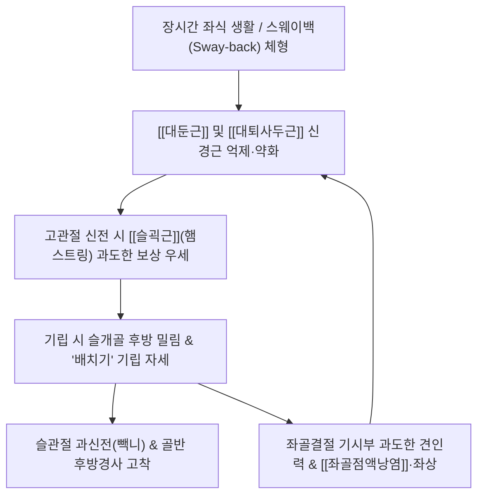

# 🩺 [[고관절 신전 증후군]] (Hip Extension Syndrome with Knee Extension)

> **핵심 3줄 요약 (Key Summary)**:
> - 📍 병소 부위 & 해부·병태생리: 보행·기립 및 계단 오르기 동작 시 주 신전근인 [[대둔근]](Gluteus maximus)의 활성화가 지연·약화되고 협력근인 [[슬괵근]](햄스트링) 및 [[대퇴근막장근]](TFL)이 과도하게 우세(Hamstring dominance)하게 동원되어 발생하는 운동손상증후군(MSI).
> - 🚩 전형적 임상 양상 & 3대 징후: 의자에서 일어나거나 계단을 오를 때 상체를 앞으로 숙이지 못하고 슬개골을 뒤로 튕기며 일어나는 '배치기 기립 자세', 좌골결절 부착부 만성 통증 및 햄스트링 좌상([[좌골점액낭염]] 동반), 슬관절 과신전(Genu recurvatum, 빽니) 및 스웨이백(Sway-back) 체형.
> - 🛠️ 핵심 감별 검사 & 한·양방 다각적 치료 전략: 복와위 고관절 신전 검사(대둔근 지연 및 햄스트링 우선 동원 확인), 슬괵근 저항 검사, 슬럼프 검사([[Slump test]]) 및 브라가드 검사([[Bragard test]]) 감별; 좌골결절 햄스트링 기시부 침도/소염약침, 슬관절 90° 굴곡 복와위 대둔근 선택적 활성화 재활 운동.
> - ⚠️ 응급 의뢰 레드플래그 & 악화 요인: 좌골결절 부위 햄스트링 건의 견열 골절(Avulsion fracture) 감별, 의자에서 일어날 때 슬개골을 뒤로 밀며 무릎을 튕기는 배치기 동작 및 과도한 무릎 펴기 스트레칭 절대 금기.

---

## 📌 목차
1. [질환 개요 & 해부학적 병태생리](#1-질환-개요--해부학적-병태생리)
2. [병태생리 메커니즘 & 생체역학적 악순환 네트워크](#2-병태생리-메커니즘--생체역학적-악순환-네트워크)
3. [임상 증상 & 이학적 검사(Physical Exam) 알고리즘](#3-임상-증상--이학적-검사physical-exam-알고리즘)
4. [감별 진단 매트릭스 (Differential Diagnosis)](#4-감별-진단-매트릭스-differential-diagnosis)
5. [한의 통합 치료 프로토콜 (침·약침·추나·한약)](#5-한의-통합-치료-프로토콜-침약침추나한약)
6. [재활 운동 & 생활습관 티칭 가이드](#6-재활-운동--생활습관-티칭-가이드)
7. [💡 사용자 진료실 핵심 필기 & 임상 노하우 (Melt-In 잔여 심화 집약)](#7--사용자-진료실-핵심-필기--임상-노하우-melt-in-잔여-심화-집약)
8. [출처 및 학술 참고 문헌 (References)](#8-출처-및-학술-참고-문헌-references)

---

## 1. 질환 개요 & 해부학적 병태생리

![[좌골결절_부착부_도해.png|350]]
> [그림 1: 좌골결절(Tuber Ischiadicum) 햄스트링 부착부 해부도 — 대둔근 절제 후 노출된 대퇴이두근 장두, 반건양근, 반막양근 기시부]

* **질환 정의 및 개요 (Shirley Sahrmann MSI 모델)**:
  * [[고관절 신전 증후군]](Hip Extension Syndrome, 흔히 슬관절 신전 동반)은 고관절을 신전할 때 일차 주동근인 [[대둔근]]이 제 역할을 하지 못하고, 협력근인 [[슬괵근]](햄스트링, Hamstrings)이 과도하게 지배적으로 수축(Hamstring dominance / Gluteal amnesia)하면서 대퇴골두와 골반에 비정상적인 전단력을 유발하는 기능적 운동계 손상 질환입니다.
  * 정상적으로는 의자에서 일어나거나 계단을 오를 때 [[대퇴사두근]]과 [[대둔근]]이 협응하여 대퇴골과 몸통이 대각선 전상방으로 전진해야 하지만, 이 증후군 환자는 대퇴사두근과 대둔근이 약화되어 슬개골을 뒤쪽으로 밀면서 슬관절을 락킹(Locking)시키는 보상 패턴을 사용합니다.
* **관련 해부학적 구조물**:
  * **골격 및 관절**: 골반(좌골결절), 고관절, 슬관절(대퇴경골관절, 슬개대퇴관절).
  * **과활성·단축 근육군 (Hyperactive / Dominant)**:
    * [[슬괵근]](Hamstrings): [[대퇴이두근]](장두/단두), [[반건양근]], [[반막양근]] — 고관절 신전 및 슬관절 굴곡 복합 작용.
    * 보조 신전/외전근: [[대퇴근막장근]](TFL).
  * **억제·약화 근육군 (Inhibited / Weak)**:
    * 고관절 신전 주동근: [[대둔근]](Gluteus maximus) — 둔근 건망증(Gluteal amnesia) 상태.
    * 슬관절 신전 주동근: [[대퇴사두근]](특히 내측광근 및 대퇴직근).

---

## 2. 병태생리 메커니즘 & 생체역학적 악순환 네트워크

![[Pasted image 20240227021024.png|300]]
> [그림 2: 의자에서 일어날 때의 정상 궤적(몸통 전상방 이동) vs 배치기 비정상 기립 궤적(슬개골 후방 이동 및 골반 밀기) 원장님 스케치 도해]

### 1) 햄스트링 우세(Hamstring Dominance)와 대둔근 건망증
* 고관절 신전 시 이상적인 근육 동원 순서는 **대둔근 $\rightarrow$ 대측 척추기립근 $\rightarrow$ 동측 햄스트링** 순서입니다.
* 그러나 좌식 생활로 대둔근이 이완성 마비 상태에 놓이면, 인체는 햄스트링을 먼저 수축시켜 고관절을 신전시킵니다.
* 햄스트링은 관절 중심축에서 거리가 먼 2-관절 근육(Bi-articular muscle)이기 때문에, 고관절을 뒤로 당길 때 대퇴골두를 비구 중심에 고정하지 못하고 대퇴골두를 앞쪽으로 밀어내는 **고관절 전방 활주(Anterior glide)** 전단력을 발생시킵니다.

![[Pasted image 20240227021016.png|300]]
> [그림 3: 계단 보행 시 슬개골의 정상 전방 회전 궤적 vs 슬개골 후방 편위 원장님 스케치 도해]

### 2) '배치기 기립'과 슬개골 후방 밀림의 생체역학
* 의자에서 일어날 때 정상 패턴: 상체를 전방으로 굴곡(Hip hinge)하여 무게중심을 발바닥 위에 두고, 대퇴사두근과 대둔근이 동시에 수축하여 몸통을 수직으로 밀어 올림.
* **고관절 신전 증후군의 보상 패턴**:
  1. 둔근과 사두근 근력이 부족하므로 상체를 앞으로 숙이지 못하고,
  2. 무릎을 뒤로 튕겨 슬관절을 과신전(Hyperextension)시키며 대퇴골을 후방으로 밀어냅니다.
  3. 그 반동으로 골반을 앞으로 불쑥 내밀며 배를 튕기는 '배치기 자세'로 기립합니다.
  4. 이 동작은 햄스트링에 심각한 원심성 수축(Eccentric contraction) 스트레스를 부과하여 좌골결절 부착부 건염 및 [[좌골점액낭염]]을 만성화시킵니다.

---

## 3. 임상 증상 & 이학적 검사(Physical Exam) 알고리즘

### 1) 주소증 및 환자 프로파일
* **스웨이백 체형 (Sway-back Posture)**: 골반이 전방으로 밀려나 있고 슬관절이 뒤로 꺾인 과신전(Genu recurvatum, 빽니) 체형.
* **핵심 통증 부위**:
  - 엉덩이 맨 아래 좌골결절(Ischial tuberosity) 뼈 부위의 만성 뻐근함 및 압통.
  - 허벅지 뒤쪽 햄스트링 근복부의 쥐나는 듯한 당김과 뻣뻣함.
  - 계단을 오르거나 의자에서 일어날 때 무릎 앞쪽이 덜컹거리거나 엉덩이 밑이 찢어질 듯한 통증.

### 2) 필수 이학적 검사법 (Physical Examination)

![[Pasted image 20240227021110.png|400]]
> [그림 4: 햄스트링 수축 시 통증 유발 검사 — 복와위 슬관절 신전 및 굴곡 저항 검사 원장님 스케치 도해]

* **슬괵근 저항 검사 (Hamstring Resisted Test)**:
  * 환자를 복와위로 눕히고 슬관절 90° 굴곡 상태에서 검사자가 무릎을 펴는 방향으로 외력을 가할 때 환자가 버티도록 저항.
  * 좌골결절 부착부나 햄스트링 근복부에 날카로운 통증이 유발되면 양성 (햄스트링 건염/좌상).

![[Pasted image 20240227021101.png|300]]
> [그림 5: 슬럼프 검사(Slump test)를 통한 신경 신장통 vs 햄스트링 단순 단축 감별 검사 원장님 도해]

* **슬럼프 검사 ([[Slump test]]) 감별**:
  * 환자를 걸터앉히고 흉요추 굴곡, 경추 굴곡 후 무릎을 펴고 발목을 족배굴곡시킴.
  * 신경근 병변이 동반된 경우 다리 전체로 찌릿한 방사통이 재현되며, 목을 들었을 때 통증이 즉각 완화되면 신경성 병변 확진.

![[Pasted image 20240227021151.png|400]]
> [그림 6: 브라가드 검사(Bragard's test) — 하지직거상 시 통증 각도에서 발목 족배굴곡을 더해 요추 신경근 이상(양성)과 햄스트링 단순 단축(음성)을 감별하는 도해]

* **브라가드 검사 ([[Bragard test]]) 감별**:
  * SLRT 수행 시 다리를 올렸을 때 당기는 증상이 요추 신경근 압박 때문인지 단순 햄스트링 단축 때문인지 감별.
  * 통증 발생 지점에서 다리를 5° 내린 후 발목을 족배굴곡시켰을 때 통증이 없으면 **신경 이상이 아닌 순수 햄스트링 단축**으로 판정.

---

## 4. 감별 진단 매트릭스 (Differential Diagnosis)

| 감별 질환 | 호발 병소 및 병태 기전 | 주소증 차이점 | 특이적 검사 소견 |
| :--- | :--- | :--- | :--- |
| **[[고관절 신전 증후군]]** (본 질환) | [[대둔근]] 약화 및 [[슬괵근]] 과우세 동원 | 기립 시 배치기, 보행 시 빽니, 햄스트링 좌상 | 복와위 신전 시 햄스트링 선행 수축, 브라가드 음성 |
| **[[좌골점액낭염]]** | 좌골결절 상부 점액낭의 마찰 염증 | 딱딱한 의자에 앉을 때 좌골 바로 위 통증 | 좌골결절 골막 직접 압통, 방사통 없음 |
| **[[좌골신경통]] (요추 디스크)** | L5/S1 신경근 탈출 및 물리적 압박 | 무릎 아래 발끝까지 찌릿한 방사통, 재채기 시 악화 | [[SLR test]] 양성, [[Bragard test]] 양성 |
| **햄스트링 근섬유 파열 (급성)** | 전력 질주 등 폭발적 원심성 수축 손상 | '뚝' 하는 파열음과 함께 멍, 극심한 보행 불가 | 단축부 결손 촉진, 능동 굴곡 완전 소실 |
| **[[대퇴 전방 활주 증후군]]** | 대둔근 부전으로 대퇴골두 전방 아탈구 | 서혜부 앞쪽 통증, 고관절 신전 시 앞쪽 찝힘 | 고관절 과신전 시 서혜부 통증 재현 |

---

## 5. 한의 통합 치료 프로토콜 (침·약침·추나·한약)

* **침구 치료 (Acupuncture & Neuromuscular Re-education)**:
  * **단축·과활성 햄스트링 이완 (Inhibition)**:
    * [[좌골결절]] 기시부: 승부, 은문.
    * 햄스트링 근복부 및 건 부착부: 위중, 위양, 부극.
    * 0.35×75mm 장침으로 과긴장된 햄스트링 트리거포인트에 직자하여 근방추 과흥분 억제.
  * **약화된 대둔근 및 대퇴사두근 활성화 (Facilitation)**:
    * [[대둔근]]: 질변, 포황, 환도.
    * [[대퇴사두근]](내측광근): 혈해, 양구.
    * 2Hz 저주파 전침을 적용하여 억제된 둔근의 신경근 연접부(NMJ) 감작 유도.
* **약침 치료 (Pharmacopuncture)**:
  * **좌골결절 햄스트링 기시부 건염**: 반복된 원심성 견인으로 인한 건부착부염에 신바로 약침 또는 중성어혈 약침 1.5cc 주입하여 염증 완화 및 미세 파열 유착 해제.
  * **대둔근 건 부착부 강화**: 대퇴골 둔근조면(Gluteal tuberosity) 부착부에 자하거 약침을 주입하여 만성적인 건병증 회복 촉진.
* **추나 치료 (Chuna Manipulation)**:
  * **슬관절 과신전(빽니) 교정 추나**: 후방으로 밀려난 경골 및 대퇴골의 시상면 정렬을 바로잡기 위해 경골 전방 가동 추나 기법 적용.
  * **햄스트링 근막이완술 (JS 수기)**: 복와위에서 햄스트링 섬유 방향을 따라 수근부로 압박하며 무릎의 수동적 신전을 유도하는 이완 수기 적용.
  * **골반 후방경사 교정 추나**: 햄스트링 단축으로 고정된 장골 후방 회전을 바로잡는 장골 전방 회전 기법 적용.
* **한약 치료 (Herbal Medicine)**:
  * **건골 손상 및 만성 좌상기**: 근육의 피로를 풀고 인대를 튼튼하게 하는 [[작약감초탕]](작약 대량 배합으로 햄스트링 연축 즉각 해소), [[독활기생탕]].
  * **기혈 순환 장애기**: 당귀수산, 서경탕(근육 미세 순환 개선).

---

## 6. 재활 운동 & 생활습관 티칭 가이드

![[Pasted image 20240227021240.png|450]]
> [그림 7: 대둔근 선택적 활성화 재활 운동 — 복와위에서 무릎을 90° 굴곡하여 햄스트링을 무력화시킨 채 고관절을 신전시키는 운동법 원장님 교재 도해]

* **복와위 무릎 굴곡 대둔근 분리 신전 운동 (Prone Bent-Knee Hip Extension)**:
  * 복와위로 엎드려 복부 아래에 베개를 받쳐 요추 전만을 방지합니다.
  * 환측 무릎을 90° 구부려 햄스트링을 능동 결손(Active insufficiency) 상태로 만들어 햄스트링의 개입을 차단합니다.
  * 대퇴골을 약간 외회전시킨 상태에서 발바닥이 천장을 향하도록 허벅지를 바닥에서 5~10cm만 들어 올려 **오직 대둔근만 수축**하도록 5초간 유지합니다 (15회 3세트). (최신 임상 입증: J Back Musculoskelet Rehabil 2026)
* **스탠딩 둔근 힌지 및 기립 재교육 (Hip Hinge Re-education)**:
  * 의자에서 일어날 때 무릎을 뒤로 펴지 않고, 상체를 고관절에서 접어 앞으로 기울인 뒤 발바닥 뒤꿈치로 바닥을 밀며 엉덩이 힘으로 똑바로 일어나는 패턴 훈련.
* **생활습관 교정 (Ergonomics)**:
  * **무릎 과신전 락킹(Locking) 금지**: 서 있을 때 무릎을 뒤로 꽉 펴서 뼈로 버티는 습관(빽니)을 버리고, 무릎에 1~2도 살짝 미세 굴곡(Soft knee)을 주는 자세를 유지합니다.
  * **계단 보행 지도**: 계단을 오를 때 발 앞꿈치만 디디지 말고 발바닥 전체를 디딘 후 무릎이 뒤로 밀리지 않도록 몸통을 전상방으로 전진시키며 오르도록 티칭합니다.

---

## 7. 💡 사용자 진료실 핵심 필기 & 임상 노하우 (Melt-In 잔여 심화 집약)

> [!IMPORTANT]
> **🛡️ 원장님 실전 관찰 팁 (기립 동작 하나로 간파하기)**
> - 환자에게 진료실 의자에서 일어나 보라고 하십시오. 손을 쓰지 않고 일어날 때 무릎이 뒤로 툭 튕겨지며 배를 앞으로 불쑥 내미는 '배치기 기립'을 한다면 100% 고관절 신전 증후군 환자입니다.
> - 이런 환자들은 햄스트링이 항상 뭉쳐있다고 호소하며 햄스트링 스트레칭(다리 찢기)을 과도하게 하다가 좌골결절 부착부가 찢어져서 내원합니다. **햄스트링은 늘려서 푸는 것이 아니라 대둔근을 깨워서 쉬게 해 주어야 낫습니다.**

* **실전 문진 체크리스트**:
  1. "의자에서 일어날 때 무릎이 뒤로 꺾이면서 배를 앞으로 내밀며 일어나시나요?"
  2. "서 있을 때 무릎이 뒤로 활처럼 휘어지는 빽니(Genu recurvatum)가 있나요?"
  3. "엉덩이 맨 아래 뼈(좌골결절) 부위가 뻐근하고, 허벅지 뒤쪽이 항상 쥐가 날 것처럼 당기나요?"
* **치료 손맛 노하우 (좌골결절 약침 & 대둔근 침 자극)**:
  * **좌골결절 약침 주입점**: 앙와위 또는 측와위에서 좌골결절 뼈 외하단 햄스트링 건 기시부에 골막 반응을 확인하며 직자하여 신바로 약침 1.5cc를 주입하면 만성적인 착석 시 좌골결절 뻐근함이 즉각적으로 완화됩니다.
  * **대둔근 촉통 순서**: 환자에게 엎드려서 다리를 들어 올리게 할 때 시술자의 손을 둔근과 햄스트링에 동시에 올려놓으십시오. 햄스트링이 먼저 딱딱해진다면 대둔근 경혈(환도, 질변)에 강한 전침 자극을 주어 둔근의 신경근 동원을 강제 재활성화해야 합니다.
* **환자 설명 티칭 스크립트**:
  * *"환자분, 지금 허벅지 뒤쪽이 아픈 이유는 햄스트링이 나빠서가 아니라, 엉덩이의 큰 형님 근육(대둔근)이 일을 안 하고 잠들어 있어서 허벅지 뒤쪽 근육이 혼자 과로하고 있기 때문입니다. 의자에서 일어날 때 무릎을 뒤로 튕기는 버릇을 고치고 엉덩이 근육을 깨우는 운동을 하셔야 찢어질 것 같은 허벅지 통증이 근본적으로 사라집니다."*

---

## 8. 출처 및 학술 참고 문헌 (References)

1. **Jang, S. H., Park, K. N., & Choi, B. R. (2026)**. Comparison of gluteus maximus, hamstring, and multifidus muscle activation during prone hip extension with reciprocal inhibition at different knee flexion angles: An experimental study. *Journal of Back and Musculoskeletal Rehabilitation*, 39(4), 815-824.
   - [PubMed: PMID 42249789](https://pubmed.ncbi.nlm.nih.gov/42249789/) | DOI: 10.3233/BMR-230245
   - **[연구 요약]**: 복와위 고관절 신전 시 슬관절 굴곡 각도(90°)를 적용하여 햄스트링의 동원을 억제하고 대둔근의 선택적 근활성도를 극대화할 수 있음을 정밀 근전도(EMG)로 입증한 최신 운동생체역학 연구.

2. **Lewis, C. L., Sahrmann, S. A., & Moran, D. W. (2007)**. Anterior hip joint pain in a young adult: a movement system impairment approach. *Physical Therapy*, 87(5), 636-646.
   - [PubMed: PMID 17321829](https://pubmed.ncbi.nlm.nih.gov/17321829/) | DOI: 10.2522/ptj.20060155
   - **[연구 요약]**: 고관절 신전 시 대둔근 결손 및 햄스트링 과우세가 대퇴골두의 전방 활주 전단력을 초래하여 고관절 전방 관절낭 및 연부조직 통증을 유발하는 생체역학 기전을 규명하고 MSI 보존 치료 모델을 제시한 샤먼 연구팀의 랜드마크 논문.

3. **Harris-Hayes, M., Czuppon, S., Van Dillen, L. R., & Sahrmann, S. A. (2010)**. Classification and treatment of patients with hip joint pain: A movement system impairment approach. *International Journal of Sports Physical Therapy*, 5(5), 232-243.
   - [PubMed: PMID 21655385](https://pubmed.ncbi.nlm.nih.gov/21655385/)
   - **[연구 요약]**: 고관절 통증 환자의 운동계 손상(MSI) 분류 모델을 정립하고, 고관절 내전 및 신전 손상군에 대한 특이적 진단 이학적 검사법과 단계별 근육 불균형 교정 프로토콜을 제시한 핵심 임상 가이드라인.