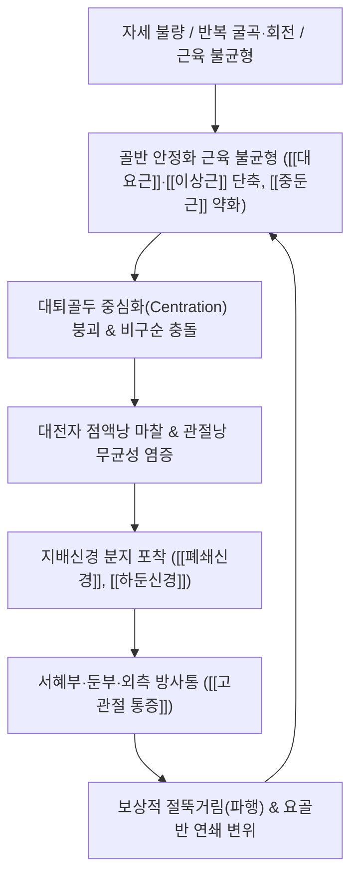

# 🩺 [[고관절 통증]] (Hip Pain / Coxalgia, M25.55)

> **핵심 3줄 요약 (Key Summary)**:
> - 📍 병소 부위 & 해부·병태생리: 고관절(구관절) 및 관절순·주위 활액낭·근건 복합체 손상으로, 앞면은 [[대퇴신경]], 뒷면은 [[좌골신경]], 내측면은 [[폐쇄신경]]이 삼중 지배하여 서혜부·둔부·대전자 외측으로 통증이 분화됨.
> - 🚩 전형적 임상 양상 & 3대 징후: 앞면 서혜부 찝힘(C-sign, [[대요근]]/[[폐쇄신경]]), 뒷면 둔부 심부 뻐근함([[이상근]]/[[하둔신경]]), 외측 대전자 압통 및 야간 배김([[대퇴근막장근]]/[[대전자 점액낭염]])의 3대 구획 분화.
> - 🛠️ 핵심 감별 검사 & 한·양방 다각적 치료 전략: [[FABER 검사]](Patrick), FADIR(충돌검사), [[토마스 검사]]로 감별 후, 관절강 감압 [[추나요법]], 장요근·이상근 침자극, 황련해독탕·신바로 [[약침 치료]], 보존적 재활 병용.
> - ⚠️ 응급 의뢰 레드플래그 & 악화 요인: 대퇴골두 무혈성 괴사(AVN), 대퇴경부 피로골절, 패혈성 관절염, 안정 시 극심한 야간통 및 체중부하 불능 시 즉시 상급병원 전원 의뢰.

---

## 📌 목차
1. [질환 개요 & 해부학적 병태생리](#1-질환-개요--해부학적-병태생리)
2. [병태생리 메커니즘 & 생체역학적 악순환 네트워크](#2-병태생리-메커니즘--생체역학적-악순환-네트워크)
3. [임상 증상 & 이학적 검사(Physical Exam) 알고리즘](#3-임상-증상--이학적-검사physical-exam-알고리즘)
4. [감별 진단 매트릭스 (Differential Diagnosis)](#4-감별-진단-매트릭스-differential-diagnosis)
5. [한의 통합 치료 프로토콜 (침·약침·추나·한약)](#5-한의-통합-치료-프로토콜-침약침추나한약)
6. [양방 치료 & 병용·의뢰 기준 (Conventional Treatment & Referral)](#6-양방-치료--병용의뢰-기준-conventional-treatment--referral)
7. [재활 운동 & 생활습관 티칭 가이드](#7-재활-운동--생활습관-티칭-가이드)
8. [💡 사용자 진료실 핵심 필기 & 임상 노하우 (Melt-In 잔여 심화 집약)](#8--사용자-진료실-핵심-필기--임상-노하우-melt-in-잔여-심화-집약)
9. [출처 및 학술 참고 문헌 (References)](#9-출처-및-학술-참고-문헌-references)

---

## 1. 질환 개요 & 해부학적 병태생리

![[고관절충돌증후군_비구관절순파열_병태도해.png|450]]
> [그림 1: ① 병태생리·외상 및 비구순 병변 도해 — 비구순 파열과 대퇴경부 골극(Cam) 충돌 병태 — 출처: Wikimedia Commons (CC BY-SA 4.0)]

![[퇴행성관절염_고관절_골관절염_골극_연골마모_Xray.jpg|450]]
> [그림 2: ② 고관절 관절염 및 골극 형성 X-ray 소견 — 관절간격 협착 및 연골하 경화 — 출처: Wikimedia Commons (CC BY 4.0)]

* **질환 정의 및 분류**:
  * 고관절 통증(Hip Pain 또는 Coxalgia)은 관골구(비구, Acetabulum)와 대퇴골두(Femoral head)로 이루어진 전형적인 구와관절(Ball-and-socket joint), 이를 감싸는 관절낭, 관절순(Labrum), 주위 점액낭 및 골반-대퇴 가교 근육군에서 기인하는 복합 통증 증후군이다.
* **삼중 감각 신경 지배 (Triple Innervation)**:
  * **고관절낭 앞면 (Anterior capsule)**: 주로 [[대퇴신경]](Femoral nerve, L2-L4)의 관절지가 지배한다.
  * **고관절낭 뒷면 (Posterior capsule)**: 주로 [[좌골신경]](Sciatic nerve) 및 대퇴방형근 신경(L4-S1) 관절지가 지배한다.
  * **고관절낭 내측면 (Medial capsule)**: 주로 [[폐쇄신경]](Obturator nerve, L2-L4)의 전지 및 관절지가 지배한다.
* **호발 역학**:
  * 젊은 운동선수층에서는 대퇴비구 충돌 증후군(FAI), 비구순 파열, 장요근 건병증이 흔하다. 중장년 여성에서는 대전자 통증 증후군(GTPS)과 중둔근 건염이 다발하며, 65세 이상 노년층에서는 퇴행성 [[골관절증(고관절)]] 및 골다공증성 대퇴골 골절의 위험이 급증한다.

---

## 2. 병태생리 메커니즘 & 생체역학적 악순환 네트워크

![[고관절_전방관절낭_해부도.png|450]]
> [그림 3: ③ 고관절 전방 관절낭 및 장골대퇴인대 주행 해부도 — 출처: Gray's Anatomy (Public Domain)]

### 1) 3대 해부학적 통증 구획과 신경근막 기전
1. **고관절 앞면 통증 (서혜부 외측 및 내측)**:
   * **서혜부 외측**: [[대요근]](Psoas major)과 [[장골근]](Iliacus)의 만성 단축으로 대퇴골 소전자(Lesser trochanter) 부착부에 견인성 골막염 및 건염이 발생한다.
   * **서혜부 내측**: 대요근 심부를 관통하는 요신경총 분지 중 [[폐쇄신경]](Obturator nerve)이 포착되면, [[대퇴내전근]](치골근, 장단내전근)의 연축과 치골 결합부 골막 견인통이 유발된다.
2. **고관절 뒷면 둔부 심부 통증**:
   * [[이상근]](Piriformis)이 경직되면 대좌골공을 통과하는 [[하둔신경]](Inferior gluteal nerve)을 압박한다. 이로 인해 신경 지배를 받는 [[대둔근]]의 미세혈류가 차단되어 허혈성 근육통(Ischemic myalgia)이 유발된다.
3. **고관절 외측 대전자 통증**:
   * [[대퇴근막장근]](TFL)에 힘줄견인점(Traction point)이 형성되면 장경인대(IT Band)가 팽팽해지며 대퇴골 대전자 위를 마찰하여 [[대전자 점액낭염]]을 일으킨다.

---

## 3. 임상 증상 & 이학적 검사(Physical Exam) 알고리즘

### 1) 임상적 특징
* **C-징후 (C-Sign)**: 환자가 엄지는 대전자 뒤쪽에, 검지는 서혜부 앞쪽에 올린 채 고관절 전체를 감싸 쥐며 통증을 표현함(비구순 파열 및 관절 내 병변 시사).
* **통증성 파행 (Antalgic Gait)**: 체중 부하 시간을 줄이기 위해 환측 디딤기를 짧게 가져가거나 발을 외회전시켜 보행함.

### 2) 필수 이학적 검사법

![[토마스검사_3단계_반대측대퇴부들림_장요근단축양성.jpg|420]]
> [그림 4: ④ 토마스 검사(Thomas test) — 장요근 구축 및 고관절 굴곡근 단축 평가 — 출처: Simbio Clinical Archive]

![[트렌델렌버그_2단계_양성반응_반대측골반하강_실사.jpg|420]]
> [그림 5: ⑤ 트렌델렌버그 검사(Trendelenburg test) — 중둔근 약화 및 외측 안정화 붕괴 평가 — 출처: Simbio Clinical Archive]

* **패트릭 검사 ([[FABER 검사]])**: 앙와위에서 고관절 굴곡·외전·외회전 후 슬관절을 하방 압박. 전방 서혜부 통증 시 고관절 관절 내 병변, 후방 통증 시 천장관절 병변 감별.
* **FADIR 충돌 검사 (Impingement Test)**: 굴곡 90° 상태에서 내전 및 내회전 압박 시 서혜부 날카로운 통증이나 딸깍거림(Clicking) 유발 시 비구순 파열 및 FAI 확진.
* **[[토마스 검사]] (Thomas Test)**: 반대측 무릎을 가슴으로 당길 때 검사측 다리가 베드에서 들리면 장요근 단축 양성.
* **트렌델렌버그 검사 (Trendelenburg Test)**: 한 발로 설 때 반대측 골반이 아래로 처지면 지지측 [[중둔근]] 마비 및 기능 부전 시사.

---

## 4. 감별 진단 매트릭스 (Differential Diagnosis)

| 감별 질환 | 주 통증 부위 | 호발 원인 및 유발 동작 | 핵심 이학적 검사 | 영상 및 진단 포인트 |
| :--- | :--- | :--- | :--- | :--- |
| **대퇴비구 충돌(FAI)** | 서혜부 심부 (C-sign) | 고관절 굴곡·내회전(양반다리) | **FADIR 양성** | X-ray상 Cam(대퇴경부) / Pincer(비구) 골극 |
| **대전자 통증 증후군** | 외측 대전자 부위 | 환측으로 누울 때, 계단 승강 | 대전자 국소 압통, Ober 양성 | 초음파상 점액낭 비후, 관절 가동역 정상 |
| **장요근 건염/점액낭염** | 전방 서혜부 외측 | 능동적 고관절 굴곡, 과신전 | **토마스 검사 양성** | 소전자 주행부 압통, 탄발음(Coxa saltans) |
| **대퇴골두 무혈성 괴사(AVN)** | 서혜부 및 둔부 심부 | 체중 부하 시 극심, 야간통 | 관절 전방향 가동 제한 | MRI T1 저신호대, 스테로이드/알코올력 |
| **요추 신경근병증(L2-L4)** | 대퇴 전면~슬관절 방사통 | 허리 굴신, 기침, 복압 상승 | 하지직거상(SLR), 건반사 저하 | 고관절 수동 회전 시 통증 없음, MRI 요추 병변 |

---

## 5. 한의 통합 치료 프로토콜 (침·약침·추나·한약)

![[이상근증후군_이상근_약침주입점_임상사진.png|400]]
> [그림 6: ⑥ 고관절 후면 둔부 심부 이상근·하둔신경 포착 해소를 위한 약침 시술 — 출처: Simbio Clinical Archive]

![[요골반 추나-20240926101424770.png|500]]
> [그림 7: ⑦ 고관절 견인-가동화 및 요골반 추나 교정 기법 — 출처: Simbio Clinical Archive]

* **침구 치료 (Acupuncture)**:
  * **앞면/내측 구획**: 비관(ST31), 충문(SP12), 급맥(LR12), 족오리(LR10)를 자침하여 단축된 장요근 및 치골근을 이완하고 폐쇄신경 포착을 해제.
  * **뒷면 둔부 구획**: 환도(GB30), 질변(BL54) 심자침(60~75mm 호침)으로 이상근을 관통 자극하여 하둔신경 감압 유도.
  * **외측 대전자 구획**: 거료(GB29), 풍시(GB31) 및 대전자 아시혈 자침으로 대퇴근막장근 긴장 해소.
* **약침 치료 (Pharmacopuncture)**:
  * **황련해독탕 / 신바로 약침**: 대전자 활액낭 및 전방 관절낭 압통점에 각 0.5~1.0cc 주입하여 국소 화학적 무균성 염증 차단.
  * **중성어혈 / 자하거 약침**: 비구순 부착부 및 대둔근 부착 건에 주입하여 미세손상 인대 재생 촉진.
* **추나요법 (Chuna Manipulation)**:
  * **고관절 견인-가동화 (Distraction Mobilization)**: 앙와위에서 대퇴 원위부를 파지하고 장축 방향 저강도 간헐적 견인을 가하여 관절강 내 음압 유도.
  * **근에너지기법 (MET)**: 장요근 신전 위치 등척성 수축-이완 기법 및 이상근 내회전 위치 이완 기법 적용.
* **한약 치료 (Herbal Medicine)**:
  * **독활기생탕(獨活寄生湯)**: 간신휴손형 노인성 만성 고관절염에 보간신, 강근골.
  * **소경활혈탕(疎經活血湯)**: 혈어와 풍습이 정체되어 둔부-대퇴로 쑤시는 통증 제어.
  * **작약감초탕(芍藥甘草湯)**: 장요근 및 내전근 급인(急攣)으로 인한 보행 장애에 진경 효과.

---

## 6. 양방 치료 & 병용·의뢰 기준 (Conventional Treatment & Referral)

### 1) 양방 약물 치료
* **1차 소염진통제**: 아세트아미노펜(1일 최대 3,000mg) 또는 경구 NSAIDs(Celecoxib 200mg 1일 1회, Meloxicam 7.5~15mg 1일 1회).
  * 고령자 및 소화성 궤양 병력 환자에게는 PPI 제제 병용 투약.
* **근이완제 병용**: Eperisone HCl 50mg tid (장요근·둔근 연축 완화).

### 2) 주사 및 수술적 처치
* **초음파 유도하 점액낭 주사**: 대전자 통증 증후군 및 장요근 점액낭염에 트리암시놀론(Triamcinolone 20~40mg) 국소 주입. (단, 1년 내 3회 이하 제한)
* **관절강 내 히알루론산 주사**: 퇴행성 고관절증 환자의 관절 윤활 및 연골 보호.
* **수술적 치료**:
  * **고관절 관절경술**: FAI 골극 절제(골성형술) 및 비구순 봉합술.
  * **인공고관절 전치환술(THA)**: 말기 퇴행성 관절염(Kellgren-Lawrence IV) 및 대퇴골두 무혈성 괴사로 인한 골두 함몰 시 시행.

### 3) 한·양방 병용 시 주의사항
* NSAIDs 복용 환자에게 어혈 한약 투약 시 위장관 출혈 위험을 모니터링하며 필요시 보위제(백출, 사인 등) 가미.
* 국소 스테로이드 주사를 맞은 환자는 감염 예방을 위해 주사 후 48~72시간 동안 동일 부위의 침/약침 침습 시술을 유예.

### 4) 응급 전원 및 상급병원 의뢰 기준 (레드플래그)
* **대퇴골두 무혈성 괴사(AVN)**: 야간 자발통 극심, X-ray상 골두 음영 변화 또는 Crescent sign 관찰 시 즉시 MRI 의뢰.
* **대퇴경부 피로골절/외상 골절**: 보행 불능, 외회전-단축 변형 관찰 시 즉시 정형외과 응급 전원.
* **패혈성 관절염**: 38°C 이상의 발열, 관절 국소 열감 및 부종, 전방향 능동/수동 운동 시 극심한 통증 호소.

---

## 7. 재활 운동 & 생활습관 티칭 가이드

* **고관절 외전근 및 둔근 강화**:
  * **클램셸(Clamshell) 운동**: 측와위에서 무릎을 굽히고 발을 붙인 채 상측 무릎을 외회전-외전하여 [[중둔근]] 후부 섬유 선택적 강화.
  * **브릿지(Bridge) 운동**: 앙와위에서 골반을 들어 올려 [[대둔근]] 활성화 및 전방 장요근 이완.
* **금기 자세 교육**:
  * **양반다리(가부좌) 및 W-자세 절대 금지**: 비구순 충돌을 악화시키므로 의자 생활 철저 지도.
  * **다리 꼬기 금지**: 골반 회전 변위 및 IT 밴드 긴장 유발 차단.

---

## 8. 💡 사용자 진료실 핵심 필기 & 임상 노하우 (Melt-In 잔여 심화 집약)

### 통증 부위별 원장실 즉각 처방 공식
* **"앞면과 안쪽이 아파요"** $\rightarrow$ 1순위 타겟은 [[장요근]]이다!
  * 장요근 소전자 부착부(서혜부 외측)와 요신경총-폐쇄신경 주행 경로(서혜부 내측 내전근)를 집중 자침하고 장요근 신전 MET를 적용한다.
* **"엉덩이 뒤쪽 깊은 곳이 뻐근해요"** $\rightarrow$ 1순위 타겟은 [[이상근]]이다!
  * 환도혈 심자침으로 이상근을 뚫고 지나가는 하둔신경 포착을 풀면 대둔근의 허혈성 통증이 즉각 경감된다.
* **"옆으로 누워 잘 때 배겨서 못 자요"** $\rightarrow$ 1순위 타겟은 [[대퇴근막장근]](TFL)과 대전자 점액낭이다!
  * TFL 발통점을 자침하여 IT 밴드의 장력을 떨어뜨리고, 대전자 점액낭 부위에 소염 약침을 주입한다.

---

## 9. 📚 출처 및 현대 학술 연구 요약 (References)

* **Heimann AF, Abel F, Schmaranzer F et al.** (2026). Hip: Traumatic and Overuse Injuries. *Semin Musculoskelet Radiol*, 30(2):142-155.
  * [PubMed 링크 (PMID: 41617172)](https://pubmed.ncbi.nlm.nih.gov/41617172/)
  * `[연구 요약]`: 고관절의 외상성 손상 및 과사용 증후군(대퇴비구 충돌, 관절순 파열, 전자부 통증 증후군)의 최신 영상의학적 진단 프로토콜과 임상 평가 가이드라인을 종합 제시함.
* **Abel F, Schmaranzer F, Sutter R et al.** (2025). Sports-related Hip Injuries. *Semin Musculoskelet Radiol*, 29(3):278-291.
  * [PubMed 링크 (PMID: 40393502)](https://pubmed.ncbi.nlm.nih.gov/40393502/)
  * `[연구 요약]`: 스포츠 활동 중 호발하는 고관절 관절 내 및 관절 외 손상 기전을 분석하고, 장요근 건병증 및 비구순 파열의 기능적 진단 알고리즘을 정립함.
* **Domb BG, Curley AJ et al.** (2023). Editorial Commentary: Treatment of Concomitant Intra-Articular Pathology in Patients With Greater Trochanteric Pain Syndrome Is Indicated by Provocative Impingement or Instability Physical Examination and Ultrasound-Guided Analgesic Injection Testing. *Arthroscopy*, 39(3):712-715.
  * [PubMed 링크 (PMID: 36740302)](https://pubmed.ncbi.nlm.nih.gov/36740302/)
  * `[연구 요약]`: 대전자 통증 증후군(GTPS) 환자에서 관절 외 점액낭염과 관절 내 비구순 충돌 병변이 동반되는 병태생리적 연관성을 규명하고 감별 주사 진단법을 제시함.