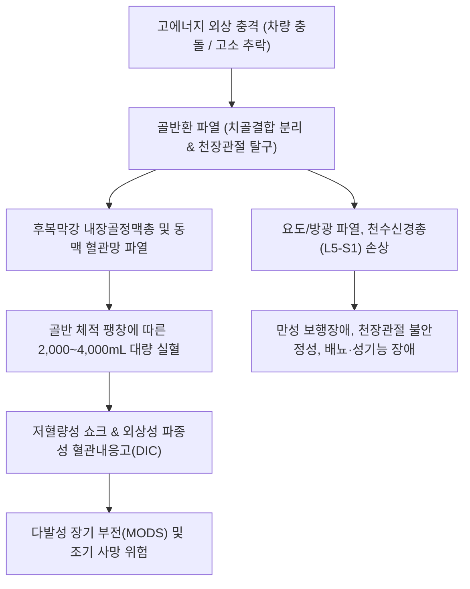

# 🩺 골반 골절 (Pelvic Ring Fractures)

> **핵심 3줄 요약 (Key Summary)**:
> - 📍 **병소 부위 & 해부·병태생리**: 골반환(Pelvic ring: 좌우 무명골과 천골, 치골결합 및 천장관절)의 구조적 연속성이 파열된 손상으로, 젊은 층에서는 교통사고·추락 등 고에너지 충격, 고령층에서는 [[골다공증]]에 기반한 단순 낙상으로 치골지 및 천골 익부 골절이 호발한다 (Tile 및 Young-Burgess 분류).
> - 🚩 **전형적 임상 양상**: 골반부의 극심한 자발통 및 보행 불가. 고에너지 불안정형 골절 시 후복막강(Retroperitoneal space) 내 정맥총 및 동맥 파열로 인한 **대량 출혈(2,000~4,000mL) 및 저혈량성 쇼크**, 요도·방광 파열, 신경총 손상 동반.
> - 🛠️ **핵심 검사 & 치료 전략**: 골반 AP, Inlet(입구상), Outlet(출구상) 방사선 및 3차원 조영증강 CT. 혈역학적 불안정 시 즉각적인 **골반 바인더(Pelvic binder)** 거치, 수액·수혈 및 혈관조영 색전술(Angio-embolization). 안정형 골절은 침상 안정 후 점진 보행, 불안정형은 경피적 장천골 나사 및 금속판 내고정술. 회복기 골유합 촉진([[자연동]]) 및 천장관절염 한의 침구·약침 치료.
> - ⚠️ **응급 의뢰 레드플래그**: 수축기 혈압 90mmHg 이하 쇼크, 요도구 출혈(Urethral bleeding), 회음부 광범위 혈종, 급성 복벽 강직, 하지 신경 마비 발생 시 119를 통한 권역외상센터 즉각 후송.

---

## 📌 목차
1. [질환 개요 & 해부학적 병태생리](#1-질환-개요--해부학적-병태생리)
2. [병태생리 메커니즘 & 생체역학적 악순환 네트워크](#2-병태생리-메커니즘--생체역학적-악순환-네트워크)
3. [임상 증상 & 이학적 검사(Physical Exam) 알고리즘](#3-임상-증상--이학적-검사physical-exam-알고리즘)
4. [감별 진단 매트릭스 (Differential Diagnosis)](#4-감별-진단-매트릭스-differential-diagnosis)
5. [한의 통합 치료 프로토콜 (침·약침·추나·한약)](#5-한의-통합-치료-프로토콜-침약침추나한약)
6. [양방 치료 & 병용·의뢰 기준 (Conventional Treatment & Referral)](#6-양방-치료--병용의뢰-기준-conventional-treatment--referral)
7. [재활 운동 & 생활습관 티칭 가이드](#7-재활-운동--생활습관-티칭-가이드)
8. [💡 사용자 진료실 핵심 필기 & 임상 노하우 (Melt-In 잔여 심화 집약)](#8--사용자-진료실-핵심-필기--임상-노하우-melt-in-잔여-심화-집약)
9. [출처 및 학술 참고 문헌 (References)](#9-출처-및-학술-참고-문헌-references)

---

## 1. 질환 개요 & 해부학적 병태생리

골반(Pelvis)은 척추와 하지를 연결하는 단단한 원형 폐쇄 고리(Closed ring) 구조물이다. 후방의 천골(Sacrum)과 양측 무명골(Innominate bone: 장골, 좌골, 치골)이 후방의 [[천장관절]](Sacroiliac joint)과 전방의 치골결합(Symphysis pubis)에 의해 견고하게 결합되어 있다.

![[골반골절_01_병태도해_영버제스_골반환골절분류.png]]
> [그림 1: ① 병태생리·도해 — 골반환 골절의 Young-Burgess 손상 기전별 분류: 전후방 압박(APC), 측방 압박(LC), 수직 전단(VS) 모식도 (Wikimedia Commons)]

골반환은 도자기 그릇(Pretzel)과 같아서, 고에너지 외상 시 한 곳만 부러지기보다는 전방과 후방의 **최소 두 개 이상의 지점에서 동시에 파열**되는 특성을 지닌다. 골반 골절은 전체 골절의 약 3%를 차지하지만, 다발성 중증 외상 환자에서는 사망률이 10~20%, 혈역학적 쇼크 동반 시 30~50%에 달하는 치명적인 손상이다.

![[골반골절_01_영상의학_골반입구촬영_좌골골절.jpg]]
> [그림 2: ① 병태생리·영상 — 골반환의 전후방 회전 전위를 평가하는 골반 입구 촬영(Inlet view) 상 좌골 골절 소견 (Wikimedia Commons)]

![[골반골절_01_영상의학_골반출구촬영_골반환전위.jpg]]
> [그림 3: ① 병태생리·영상 — 천골 골절 및 수직 변위를 평가하는 골반 출구 촬영(Outlet view) 소견 (Wikimedia Commons)]

골반 골절의 사망 원인 중 80% 이상은 **대량 출혈**이다. 골반강 후방에는 천골전정맥총(Presacral venous plexus)과 내장골동맥(Internal iliac artery) 분지들이 복잡한 그물망을 형성하고 있는데, 천장관절 인대와 골반환이 파열되면 혈관망이 찢어지며 후복막강(Retroperitoneal space)으로 2,000~4,000mL 이상의 혈액이 유출된다.

---

## 2. 병태생리 메커니즘 & 생체역학적 악순환 네트워크

### 손상 생체역학 및 분류
Young-Burgess 분류는 외력의 방향에 기반하여 손상 정도와 출혈 위험을 예측한다:

![[골반골절_02_해부도해_골반인대복합체_천장관절_Gray319.png]]
> [그림 4: ② 관련 해부 구조물 — 골반환의 수직 및 회전 안정성을 지탱하는 천장인대 및 천결절인대 해부도 (Henry Gray, Anatomy of the Human Body)]

1. **전후방 압박 손상 (Anteroposterior Compression, APC)**:
   - 정면 충돌 손상으로 치골결합이 벌어지는 **"개구 골반(Open-book)"** 손상.
   - APC II/III형은 후방 천장인대까지 파열되어 골반 체적이 급격히 팽창하고 대량 정맥혈관 파열 초래.
2. **측방 압박 손상 (Lateral Compression, LC)**:
   - 측면 충돌 손상으로 동측 치골지 골절 및 천골 압박 골절 발생 (Leite-Moreira et al., 2026).
3. **수직 전단 손상 (Vertical Shear, VS)**:
   - 높은 곳에서 한쪽 다리로 추락하여 천장관절과 골반환 전체가 상방으로 뜯겨 올라가는 완전 불안정 손상.

---

## 3. 임상 증상 & 이학적 검사(Physical Exam) 알고리즘

### 임상 증상
- **자발통 및 골반 압통**: 치골부, 서혜부, 천골부의 극심한 통증.
- **저혈량성 쇼크 징후**: 빈맥(HR > 100회/분), 저혈압(SBP < 90mmHg), 창백, 식은땀, 의식 저하.
- **비뇨생식기 및 회음부 이상**:
  - 요도구 출혈(Blood at urethral meatus): 요도 파열의 확진 징후 (도뇨관 삽입 금기!).
  - 회음부 나비 모양 반상출혈(Butterfly perineal hematoma).
  - 직장 및 질 출혈(개방성 골반 골절 가능성).
- **신경학적 증상**: L5 신경근 또는 천수신경총 손상으로 인한 족하수(Foot drop), 회음부 안장 감각 저하.

### 이학적 검사 알고리즘
1. **골반 안정성 검사(Pelvic stability test)**:
   - 양측 장골능(Iliac crest)을 양손으로 가볍게 내측 및 하방으로 압박(Gentle compression).
   - ⚠️ **주의**: 골반이 덜컹거리거나 불안정성이 감지되면 **추가적인 반복 압박을 절대 금지**한다 (혈전 파괴로 재출혈 유발).
2. **영상 검사**:
   - **X-ray 3종**: Pelvis AP, Inlet view(골반 입구상, 60도 미측 투시로 회전 전위 평가), Outlet view(골반 출구상, 45도 두측 투시로 수직 전위 평가).
   - **3차원 복부-골반 조영 CT**: 골절선 정밀 분석 및 활동성 동맥 출혈(Contrast extravasation, "Blush sign") 확인.

---

## 4. 감별 진단 매트릭스 (Differential Diagnosis)

| 질환명 | 손상 기전 | 골반환 안정성 | 출혈량 및 쇼크 위험 | 일차 치료 원칙 |
| :--- | :--- | :--- | :--- | :--- |
| **불안정형 골반 골절 (본 질환)** | 고에너지 교통사고/추락 | 완전 불안정 (회전/수직) | 대량 출혈 (2~4L), 쇼크 흔함 | 즉시 골반 바인더, 색전술, 수술적 내외고정 |
| **안정형 골반 골절 (치골지 단독)** | 고령 낙상 (저에너지) | 안정 (골반환 연속성 보존) | 소량 (<500mL), 쇼크 드묾 | 보존적 단기 침상안정, 1~2주 내 조기 보행 |
| **비구 골절 (Acetabular fx)** | 대퇴골두의 비구 타격 | 골반환 자체는 안정 가능 | 관절 내 출혈, 좌골신경 손상 | 비구 해부학적 정복 및 금속판 내고정 |
| **[[고관절 골절]](대퇴 전자간)** | 대전자 측면 낙상 | 골반환 무관 | 500~1,000mL 출혈, 하지 외회전 | 24~48시간 내 골수내정 PFNA 수술 |
| **요추 횡돌기 골절** | 허리 염전/타격 | 안정 | 후복막강 혈종 동반 가능 (Brodell et al., 2026) | 보존적 보조기 및 물리치료 |

---

## 5. 한의 통합 치료 프로토콜 (침·약침·추나·한약)

골반 골절 환자는 급성기 외상 처치(색전술/수술)가 완료된 후, 또는 고령층 안정형 치골지/천골 골절에서 침상 안정 후 만성 천장관절염 및 좌골신경통 후유증 관리를 위해 한의원에 내원한다.

![[골반골절_05_술기실사_방광경_팔료혈_골반자침도해.jpg]]
> [그림 5: ③ 치료·시술점 — 골반 골절 후 천장관절통 및 배뇨 신경 회복을 위한 족태양방광경 팔료혈(BL31-34) 자침도 (Wellcome Collection)]

### 1) 침구 및 전침 치료
- **주요 취혈점**: [[상료]](BL31), [[차료]](BL32), [[중료]](BL33), [[하료]](BL34, 팔료혈), [[환도]](GB30), [[질변]](BL54), [[위중]](BL40), [[음릉천]](SP9).
- **자침 기법**:
  - 팔료혈(천골공) 자침 시 0.30×60mm 장침으로 천골공 내로 1.5~2.0촌 직자하여 천수신경총 자극 및 골반저근 혈류 개선.
  - 차료-환도 간 전침(2Hz, 연속파 20분): 천장관절 주변 인대 연축 완화 및 좌골신경 포착 해소.

### 2) 약침 치료
- **[[신비약침]] / [[중성어혈약침]]**: 천골 후방 인대 결합부 및 좌골조면 주변에 0.5~1.0cc 주입하여 잔여 혈종 흡수 및 통증 조절.
- **[[자하거 약침]]**: 고령 골다공증성 치골지/천골 골절 환자의 조기 골유합 유도를 위해 환도 및 지변 부위에 주 2회 시술.

### 3) 추나 및 관절가동술 (골유합 완료 후 8~12주 이후)
- **금기**: 골반환이 불안정한 급성기 또는 미유합 상태에서의 골반 교정 추나(골반 쓰러스트)는 절대 금기.
- **유합 후 기법**: 천장관절 가동 기법(Sacroiliac joint mobilization), 요골반 근막 이완(Myofascial release), 장요근 및 이상근 근막 스트레칭.

### 4) 한약 치료
- **급성기 (수상 후 1~4주)**: [[당귀수산]](當歸鬚散) 가미방 + **[[자연동]]**(自然銅, 醋淬) 2g/일 (골반강 내 혈종 배출, 골모세포 증식 촉진, PMID 38256337).
- **아급성 회복기 (4주 이후)**: [[독활기생탕]](獨活寄生湯) 합 보양환오탕(補陽還五湯): 골반 혈액 순환 개선, 보행 지구력 증진 및 골다공증성 재골절 예방.

---

## 6. 양방 치료 & 병용·의뢰 기준 (Conventional Treatment & Referral)

![[골반골절_06_양방치료_골반골절_외고정장치.png]]
> [그림 6: ③ 치료·시술점 — 불안정성 골반환 골절의 체적 축소 및 출혈 제어를 위한 전방 골반 외고정기(External Fixator) 거치 (Wikimedia Commons)]

### 응급 소생 프로토콜 (Damage Control Resuscitation)
1. **골반 바인더(Pelvic binder) 착용**:
   - 대전자(Greater trochanter) 높이에 정확히 거치하여 벌어진 골반환을 오므려 골반 체적을 축소(Tamponade 효과로 정맥혈관 출혈 지혈).
2. **동맥 색전술(Angio-embolization)**:
   - 바인더 거치와 대량 수혈에도 혈압이 회복되지 않는 경우, 인터벤션 영상의학과에서 내장골동맥 분지(상둔동맥, 폐쇄동맥 등) 조기 색전술 시행.
3. **골반 C-clamp 또는 외고정기(External fixation)**:
   - 후방 천장관절을 압박하여 골반환의 즉각적 기계적 안정성 확보.

### 수술적 내고정술 (Definitive ORIF)
- 환자의 전신 상태가 안정된 후, 천장관절 경피적 나사 고정술(Percutaneous SI screw) 및 전방 치골결합 금속판 고정술 시행.

### 1차 진료실 의뢰 기준
- **권역외상센터 즉각 전원**: 고에너지 외상력, 저혈압 쇼크, 요도 출혈, 골반 불안정성 감지 시 즉시 119 구급대를 통해 전원.
- **정형외과 의뢰**: 고령 환자가 엉덩방아를 찧은 후 서혜부 통증으로 걸을 수 없으나 단순 X-ray 상 명확하지 않을 때, 천골/치골 불현성 골절 확인을 위해 정형외과 3D CT 의뢰.

---

## 7. 재활 운동 & 생활습관 티칭 가이드

### 1) 단계별 재활 운동
- **1단계 (안정형 골절 0~2주 / 수술 후 2~6주)**:
  - 침상 발목 펌프 운동 및 무릎 밑 베개 누르기(대퇴사두근 등척성 운동).
  - 침상 위 복식호흡 훈련.
- **2단계 (2~6주, 점진적 체중 부하)**:
  - 워커(Walker)를 이용한 발끝 딛기 보행(Touch-down weight bearing).
  - 바로 누운 자세에서 골반 틸팅(Pelvic tilting) 및 가벼운 둔근 브릿지(Gluteal bridge).
- **3단계 (6주 이후, 기능 회복)**:
  - 측와위 고관절 외전 운동(Clamshell exercise), 체중 부하 보행 훈련.

### 2) 생활습관 및 재낙상 방지
- **낙상 예방 환경 구축**: 실내 문턱 제거, 화장실 안전 손잡이 설치, 미끄럼 방지 매트 시공.
- **골다공증 치료 연계**: 비타민 D 및 칼슘 복용, 골흡수 억제제(비스포스포네이트) 처방 의뢰.

---

## 8. 💡 사용자 진료실 핵심 필기 & 임상 노하우 (Melt-In 잔여 심화 집약)

- **'허리 삐었다'는 할머니의 치골지 골절**: 빙판길이나 욕실에서 미끄러진 후 엉덩이와 서혜부가 아파 걷지 못하는 노인 환자는 척추 압박골절뿐 아니라 치골 상/하가지(Pubic rami) 골절을 반드시 확인해야 한다. 치골 결합부 양측을 누르면 극심한 압통이 유발된다.
- **치골지 골절 시 천골 골절 동반율 80%**: 단순 방사선에서 치골지만 부러진 것처럼 보여도, 골반환 구조상 후방 천골 익부(Sacral ala)에 불현성 압박 골절이 동반되어 있을 확률이 80%에 달한다. 환자가 천골부를 눌렀을 때 심한 통증을 호소하면 천골 피로골절을 염두에 두어야 한다.

---

## 9. 출처 및 학술 참고 문헌 (References)

1. **Leite-Moreira JP et al. (2026)**. Surgical Management of a Lateral Compression (LC)III Pelvic Ring Fracture With Type I Crescent Fracture-Dislocation: A Case Report. *Cureus*, 18(6):e111097. [PMID 42472149](https://pubmed.ncbi.nlm.nih.gov/42472149/)
   - [연구 요약]: 측방 압박형(LC-III) 골반환 골절 및 크레센트 골절-탈구 손상에서 후방 천장관절과 전방 골반환의 단계적 수술적 내고정 수기 및 기능 회복 증례 고찰.

2. **Brodell JD et al. (2026)**. Revisiting predictors of instability in pelvic ring injuries: are lumbar transverse process fractures significant?. *Eur J Orthop Surg Traumatol*, 36(1):120. [PMID 42234245](https://pubmed.ncbi.nlm.nih.gov/42234245/)
   - [연구 요약]: 골반환 손상 환자에서 요추 횡돌기 골절의 동반이 골반의 기계적 불안정성 및 후복막강 혈종 발생을 예측하는 독립적 위험 인자임을 규명.

3. **Rovere G et al. (2025)**. Return to sport after acetabular and pelvic ring fractures in amateur athletes: A retrospective study. *J Orthop Traumatol*, 26(1):71. [PMID 41171555](https://pubmed.ncbi.nlm.nih.gov/41171555/)
   - [연구 요약]: 비구 및 골반환 골절 환자의 수술적 치료 후 장기 운동 복귀율, 잔여 보행 장애 및 천장관절 통증 분석 후향적 코호트 연구.

4. **Nam EY et al. (2023)**. Therapeutic Efficacy of Chinese Patent Medicine Containing Pyrite for Fractures: A Systematic Review and Meta-Analysis. *Medicina (Kaunas)*, 60(1):164. [PMID 38256337](https://pubmed.ncbi.nlm.nih.gov/38256337/)
   - [연구 요약]: 골반 및 사지 골절 환자에서 자연동(Pyrite) 제제의 골유합 촉진, 부종 소퇴 및 가골 무기질화 효과에 대한 메타분석.

---

## 관련 노트

- [[고관절 골절]]
- [[대퇴골 경부 골절]]
- [[다리 골절]]
- [[천장관절]]
- [[골다공증]]
- [[자연동]]
- [[당귀수산]]
- [[독활기생탕]]
- [[환도]]
