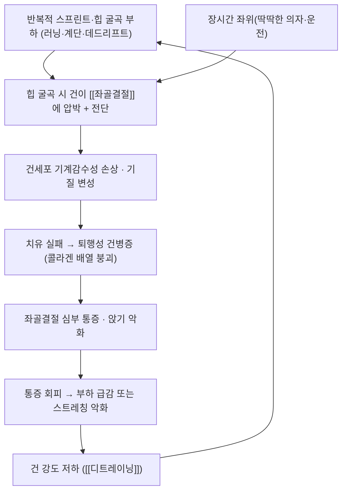

# 🩺 [[근위 햄스트링 건병증]] (Proximal Hamstring Tendinopathy / PHT)

> 🖼️ **이미지 미확보 항목** — 환부 실사·영상(MRI/초음파) 소견·이학적 검사 시연·한의 술기 실사는 이번 회차에 확보하지 못했다. 확보한 3장은 **골격 랜드마크·해부 도해·부착부 구역 도해**이며, 각 단독 블록에 출처와 라이선스를 표기했다(추후 회차에서 실사 보강 대상).

> **핵심 3줄 요약 (Key Summary)**:
> - 📍 병소 부위 & 해부·병태생리: [[대퇴이두근]](장두)·[[반건양근]]·[[반막양근]]의 기시부가 붙는 [[좌골결절]] 부착부의 만성 건병증. **힙 굴곡 시 건이 좌골결절에 압박**되는 압박성(compressive) 병태가 핵심이다.
> - 🚩 전형적 임상 양상 & 3대 징후: 좌골결절 부위의 **심부 둔부 통증**, 오래 앉기·운전 시 악화, 런지·데드리프트·계단 오르기·달리기(특히 오르막)에서 통증, **스트레칭에서 악화**.
> - 🛠️ 핵심 감별 검사 & 한·양방 다각적 치료 전략: 좌골결절 국소 압통 확인 + 부하·신장 유발 검사, [[힘줄병증]] 원칙에 따른 **점진적 부하 재활(힙 굴곡 제한 → 확장)**, 침·약침·도침으로 통증 역치를 올린 뒤 운동 진입.
> - ⚠️ 응급 의뢰 레드플래그 & 악화 요인: 급성 완전 파열(‘뚝’ 소리·함몰 촉지·보행 불능), [[좌골신경]] 증상 동반(저림·근력 저하), 12주 보존 치료 무반응, 야간통·체중감소 등 종양 의심 신호.

---

## 📌 목차
1. [질환 개요 & 해부학적 병태생리](#1-질환-개요--해부학적-병태생리)
2. [병태생리 메커니즘 & 생체역학적 악순환 네트워크](#2-병태생리-메커니즘--생체역학적-악순환-네트워크)
3. [임상 증상 & 이학적 검사(Physical Exam) 알고리즘](#3-임상-증상--이학적-검사physical-exam-알고리즘)
4. [감별 진단 매트릭스 (Differential Diagnosis)](#4-감별-진단-매트릭스-differential-diagnosis)
5. [한의 통합 치료 프로토콜 (침·약침·추나·한약)](#5-한의-통합-치료-프로토콜--침약침추나한약)
6. [양방 치료 & 병용·의뢰 기준 (Conventional Treatment & Referral)](#6-양방-치료--병용의뢰-기준-conventional-treatment--referral)
7. [재활 운동 & 생활습관 티칭 가이드](#7-재활-운동--생활습관-티칭-가이드)
8. [💡 진료실 핵심 필기 & 임상 노하우](#8--진료실-핵심-필기--임상-노하우)
9. [출처 및 학술 참고 문헌 (References)](#9-출처-및-학술-참고-문헌-references)

---

## 1. 질환 개요 & 해부학적 병태생리

![[근위 햄스트링 건병증_02_좌골결절_후면_골격도.png|450]]
> [그림 1: 좌골결절(ischial tuberosity) — 후면 골격도, 좌우 좌골결절을 적색으로 표시 — BodyParts3D(DBCLS), CC BY-SA 2.1 JP, Wikimedia Commons]

- **질환 정의 및 분류**:
  - 햄스트링 기시부가 붙는 [[좌골결절]] 부착부의 만성 과사용성 건병증이다. 급성 파열(avulsion·tear)과 구분해 **만성 건병증(PHT)** 으로 부른다.
  - 호발군: 장거리 러너·축구·하키 등 스프린트·방향 전환이 많은 선수, **오래 앉아 일하는 직업군**, 좌위 운전 시간이 긴 사람. 연령대는 30~50대에 많고 여성에서도 흔하다(통계 수치는 문헌별로 다르다).
  - ICD-10 청구 코드는 부착부 건병증 계열 코드를 쓰는 경우가 있으나, **PHT 전용 코드가 아니므로 청구 기준 확인이 필요하다**(제도 정보는 확인된 출처로만 다룬다).
- **관련 해부학적 구조물**:
  - **골격 및 관절**: [[좌골결절]] — 하지 쪽 돌출부로 좌위 시 체중이 실리는 지점이자 햄스트링 기시부. [[천골]]·[[장골]]과 함께 골반 후방을 이룬다.
  - **근육 및 근막**: [[대퇴이두근]](장두, 외측), [[반건양근]](내측 표층), [[반막양근]](내측 심층) — 세 근육이 **공통 기시건**을 이루고, 대내전근의 좌골결절부(ischiocondylar part)가 인접한다.
  - **신경 및 혈관**: [[좌골신경]]이 좌골결절 외측을 지나 대퇴 후면으로 내려간다. 천골신경총 분지 [[하둔신경]]·[[후대퇴표피신경]]이 둔부 심부를 주행한다.

---

## 2. 병태생리 메커니즘 & 생체역학적 악순환 네트워크

![[근위 햄스트링 건병증_03_좌골결절_조면_해부표시.png|450]]
> [그림 2: 둔부·대퇴 후면 근육군 도해 — 좌골결절 구역을 적색으로 표시. 대둔근·대퇴이두근·반건양근·반막양근·대내전근의 부착 관계를 확인할 수 있다 — Gray's Anatomy 계열(작업: Mikael Häggström), Public domain, Wikimedia Commons]

### 1) 압박·전단 기전 — PHT를 다른 건병증과 구분하는 핵심
- [[힘줄병증]] 노트의 원리를 그대로 따른다 — 병변은 **인장 부하(tensile)와 압박 부하(compressive)로 나뉜다**. PHT는 대표적 **압박성** 병변이다.
- 힙 굴곡(특히 굴곡 + 내전) 자세에서 기시건이 좌골결절과 대둔근 사이에서 눌린다 → 좌위·운전·딥 스쿼트·런지가 통증을 만들고, **스트레칭은 압박을 더해 악화시킨다**.
- 스프린트에서는 힙 굴곡 범위가 커지면서 **압박 + 전단 + 인장**이 함께 걸린다 — 그래서 '빠르게 뛸수록 아픈' 양상이 특징적이다.

### 2) 쿡 & 퍼담 연속체 모델의 적용
- 반응성 건병증 → 건 치유 실패 → 퇴행성 건병증의 3단계를 따른다. 장기화되면 부착부 골 변화(enthesophyte), 부분 파열, 좌골점액낭염 동반이 흔하다 → [[좌골점액낭염]]

![[근위 햄스트링 건병증_01_햄스트링_부착부_해부도.jpg|450]]
> [그림 3: 좌골결절 주변 부착부 구역을 색으로 구분한 도해 — 원본에 라벨은 없으며 초록·적색 구역으로 부착부를 구분한 도식이다(햄스트링 기시부·인접 구조물 위치 참고용) — Wikimedia Commons 'Hamstring Attachment Image', Fiterin, CC BY-SA 4.0]

---

## 3. 임상 증상 & 이학적 검사(Physical Exam) 알고리즘

### 1) 주소증
- **심부 둔부 통증**: "앉는 자리(좌골결절)가 아프다", "딱딱한 의자·운전이 힘들다"는 표현이 전형적이다.
- **부하 의존성**: 런지·데드리프트·계단 오르기·오르막 달리기·스프린트에서 악화, 평지 걷기는 비교적 견딘다.
- **스트레칭 악화**: 햄스트링 스트레칭을 하면 오히려 아프다는 문진 소견은 **PHT를 강하게 시사**한다(요추·신경성 통증과의 감별점).
- 신경 증상(저림·방사통·근력 저하)이 있으면 [[좌골신경]] 포착·요추 신경근병증을 먼저 감별한다.

### 2) 필수 이학적 검사법
- **국소 압통**: 복와위에서 좌골결절 부위를 정밀 촉진 — 좌골결절에 직접 압통이 재현되는지 확인한다(정량화는 [[압통역치(PPT)]]).
- **좌골결절 부하·신장 유발 검사**(문헌에서 쓰이는 계열): Puranen-Orave test(복와위 무릎 90도 굴곡 상태에서 저항 신전? 방식은 문헌별 차이가 있으므로 시술 전 원문 확인), bent-knee stretch test, modified bent-knee stretch test, supine plank test.
  - ⚠️ 검사별 민감도·특이도는 근거가 제한적이다 — **검사 하나로 확진하지 않고** 영상·병력과 함께 판단한다.
- **신경 감별**: 신경 긴장 검사(Slump test·[[SLR test]])로 좌골신경 기원 증상을 확인한다 → [[Slump test]]
- **영상**: 초음파(건 비후·저에코·도플러 신생혈관, 좌골결절 주위 활액낭액)와 MRI(건 부착부 신호 변화·부분 파열·골 부종). 근위 햄스트링의 초음파 평가는 부위별 해부 landmark를 정확히 잡는 것이 관건이다 → 출처 3번

---

## 4. 감별 진단 매트릭스 (Differential Diagnosis)

| 감별 질환 | 호발 병소 및 원인 | 주소증 차이점 | 특이적 이학적 검사 소견 |
| :--- | :--- | :--- | :--- |
| [[근위 햄스트링 건병증]] (본 질환) | 좌골결절 부착부, 압박·전단 | 앉기·힙 굴곡 시 심부 통증, 스트레칭 악화 | 좌골결절 직접 압통, 부하 검사 재현 |
| [[좌골점액낭염]] | 좌골결절–대둔근 사이 활액낭 | 앉기 통증이 더 국소적, 부종감 | 압통 위치·초음파 활액낭액 |
| 근위 햄스트링 부분/완전 파열 | 급성 외상·과신전 | 급성 ‘뚝’, 함몰·광범위 멍, 보행 불능 | 파열부 결손 촉지, 근력 저하 |
| [[좌골신경통]] · 요추 신경근병증 | 요추 신경근·신경 포착 | 저림·방사통, 하지 근력 저하 | 신경 긴장 검사 양성, 피부분절 분포 |
| [[좌골대퇴충돌증후군]] | 소둔근–대퇴골 소전자 사이 | 둔부 심부 통증, 걷기·계단 | 충돌 유발 검사, MRI |
| [[천장관절 증후군]] | 천장관절 기능부전 | 골반 후방 통증, 체위 전환 시 | 골반 검사·추나 정렬 소견 |
| 근막통증증후군([[통증유발점]]) | 둔근·심부외회전근 발통점 | 연관통, 압통점 자극 시 재현 | 발통점 압박 시 연관통 재현 |

---

## 5. 한의 통합 치료 프로토콜 (침·약침·추나·한약)

- **침구 치료 (Acupuncture)**:
  - 좌골결절 주변 **아시혈**과 둔부 압통점, 원위 취혈로 위중(BL40)·승부(BL39)·곤륜(BL60)·곤륜 인근을 병용한다.
  - 자극은 **건 실질을 직접 겨냥하지 않고** 부착부 주위 근막·근육에 두며, 유침 15~20분·주 2회 × 4~6주를 기본으로 반응에 따라 조정한다 → [[침 자극 강도와 용량]] · [[득기]]
- **약침 치료 (Pharmacopuncture)**:
  - 둔부 심부이므로 **초음파 유도 또는 해부 landmark 확인 후** 주입한다. 자하거약침·신바로약침 계열이 재생·소염 축으로 쓰이고, 급성 염증기에는 봉약침 고농도를 피한다 → [[자하거약침]] · [[신바로약침]] · [[봉약침]] · [[약침]]
- **도침·건침 (Acupotomy · Dry Needling)**:
  - 만성 퇴행 구역의 섬유성 유착 박리 목적으로 사용하되, 좌골신경 주행과 좌골결절 위치를 확인해야 한다. 시술 후 24~48시간 통증 증가를 환자에게 예고한다 → [[건침]] · [[심부 횡마찰 마사지]]
- **추나·수기 치료**:
  - 골반 정렬·천장관절 기능 회복, 둔부 심부 근막 이완을 목표로 한다. **햄스트링 강한 스트레칭은 금지**, 대신 근막이완·견인 계열로 둔부 긴장을 낮춘다 → [[도수치료]] · [[근막이완술]] · [[천장관절 증후군]]
- **한약 치료 (Herbal Medicine)**:
  - 급성 악화기: 활혈거어·행기止痛 계열([[순기활혈탕]]·[[서경탕]] 운용)
  - 만성기: 强筋骨·補肝腎 계열([[독활기생탕]]·[[오적산]] 운용)
  - ⚠️ 처방 선택은 변증(어혈·습체·기허·음허)에 따른다 — 건병증 자체를 적응증으로 삼는 처방은 없다.

---

## 6. 양방 치료 & 병용·의뢰 기준 (Conventional Treatment & Referral)

> 🎯 **이 섹션의 목적**: 환자가 이미 정형외과·통증의학과 치료를 받고 오는 경우가 많다. 병용 가능·주의·금기를 구분하고 의뢰 시점을 정한다.

- **약물 치료 (Medication)**:
  - 경구 [[NSAIDs]]·[[아세트아미노펜]]은 **단기 통증 조절** 목적이며, 건 치유를 앞당긴다는 근거는 없다. 장기 복용은 위장관·신장 부담을 확인한다.
  - 국소 [[국소 NSAID]]는 전신 부담을 줄이는 대안 → [[디클로페낙]]
- **비약물 시술 (Procedures)**:
  - **[[체외충격파]](ESWT)**: 2026-09-30 리뷰 2번에서 **주 1회 4회·1회 2000회 충격·최대 견딜 수 있는 강도**가 개별 물리치료와 **동등한 1년 결과**를 냈다. 운동을 매일 소화하기 어려운 환자에게는 합리적 대안이다.
  - **국소 스테로이드 주사**: 단기 통증은 줄지만 **건 파열 위험·재발을 높이는 방향**이라 반복 주사는 피한다(정형외과·통증의학과 판단 영역) → [[트리암시놀론]]
  - 국소 주사·PRP 등은 적응증과 근거 수준이 다르므로 환자에게 '시술 종류별 근거 차이'를 분리해 설명한다 → [[PRP]]
- **수술·시술 적응증 (Surgical Indication)**:
  - 급성 완전 파열, 근위건의 심한 파열(2개 이상 건 파열·좌골신경 증상 동반), 6개월 이상 보존 치료에도 기능 제한이 지속되는 만성 파열이 대상이다. 만성 건병증 단독은 수술 적응이 아니다.
- **한의 병용 판단 (Combination Therapy)**:
  - **병용 가능**: 침·약침·도침 + 하루 20분 자가 운동 + 좌위 압박 관리
  - **주의**: 항응고제 복용자(도침·충격파 출혈 위험), 국소 스테로이드 주사 직후 1~2주(조직 취약 — 강한 도침·고부하 운동 보류)
  - **금기**: 급성 완전 파열 부위 직접 자극, 좌골신경 증상이 진행하는 경우의 심부 강자극 시술
- **전문과 의뢰 기준 (Referral Criteria)**:
  - 응급: 급성 완전 파열(보행 불능·함몰), 좌골신경 마비 증상 진행 → 정형외과 즉시 의뢰
  - 일반: 12주 보존 치료에도 VISA-H·통증이 개선되지 않을 때, 진단이 불확실할 때(영상 필요) → 정형외과·영상의학과

---

## 7. 재활 운동 & 생활습관 티칭 가이드

- **4단계 부하 진행(전 단계 공통 규칙: 운동 중 통증 4/10 이하, 활동 후 12~24시간 내 2점 초과 증가 없음)**
  1. **등척성 단계(힙 굴곡 0도에 가깝게)**: 복와위 무릎 굴곡 저항(프론 레그컬) 등척성 30~45초 × 3~5회, 하루 2~3회. 급성 민감기에 진입 문을 여는 단계 → [[등척성 운동]]
  2. **제한 굴곡 등장성**: 프론 레그컬(무릎 중심) → 숏 레버 브리지. 3초 동심–3초 편심 템포, 3~4세트 × 8~15회 격일 → [[편심성 운동]]
  3. **굴곡 확장 등장성**: 롱 레버 브리지 → 힙 쓰러스트 → 스텝업 → 데드리프트. 힙 굴곡 범위를 **점진적으로** 늘린다 → [[점진적 과부하]]
  4. **에너지 저장·플라이오메트릭(선택)**: 포고 → 스프린트·점프. 러닝 복귀 목표가 있을 때만, 최소 8~12주 이후 → [[에너지 저장·방출 운동]]
- **좌위 압박 관리(즉시 지도 가능)**:
  - 딱딱한 의자 대신 **웨지 쿠션**(좌골결절 앞쪽으로 하중을 옮기는 형태), **후방 골반 경사**로 앉기, 의자 높이를 올려 힙 굴곡 각도를 줄인다.
  - 운전 시 시트 등받이를 세우고 엉덩이를 앞으로 — 30분마다 하차·기립 스트레칭.
- **금지 목록**: 햄스트링 강한 정적 스트레칭, 딥 스쿼트·깊은 런지 초기 도입, 계단 아래로 체중을 싣는 변형 → [[힘줄병증]]
- **루틴 예시**: 격일 부하 운동 + 주 2~3회 둔부·코어 보조([[코어 안정화 운동]]) + 매일 좌위 관리.

---

## 8. 💡 진료실 핵심 필기 & 임상 노하우

- **문진 체크리스트**: ① 앉을 때 아픈가(딱딱한 의자·운전) ② 스트레칭이 아픈가 ③ 계단·오르막에서 아픈가 ④ 런지·데드리프트에서 아픈가 — 네 개 중 셋 이상이면 PHT를 감별 축에 반드시 넣는다.
- **요통 오진 방지**: 둔부 심부 통증으로 내원한 환자를 '요추 디스크·좌골신경통'으로만 접근하면 치료 반응이 떨어진다. 좌골결절 직접 압통과 신경 긴장 검사를 **같은 세션에** 확인한다.
- **치료 순서**: ① 좌골결절 주변 침·약침으로 통증 역치 상승(시술 직후 저항 검사로 즉시 변화 확인) → ② 같은 자리에서 1단계 등척성 시연 → ③ 앉기 자세·쿠션·자가 운동 처방전을 손에 쥐여 준다.
- **환자 설명 스크립트**: "이 부위는 앉을 때 힘줄이 뼈에 눌리는 자리입니다. 그래서 스트레칭을 세게 하면 오히려 더 아픕니다. 치료는 ① 눌림을 줄이고 ② 힘줄이 견딜 수 있는 부하를 조금씩 올리는 것입니다. 운동 중 통증이 4점(10점 만점)을 넘거나 다음날까지 2점 이상 더 아프면 부하를 낮춥니다."
- **시술 상담 포인트**: "매일 20분씩 집에서 운동하실 수 있으면 운동치료가, 시간이 어려우면 주 1회 충격파 4회가 대안입니다. 1년 뒤 결과는 두 방법이 비슷했습니다" — 2026-09-30 리뷰 2번의 '동등 대안' 결론을 그대로 쓴다.

---

## 9. 출처 및 학술 참고 문헌 (References)

1. **Randomized Controlled Trial (2025)**. Physiotherapy Compared With Shockwave Therapy for the Treatment of Proximal Hamstring Tendinopathy. *The American Journal of Sports Medicine*, 53(14):3396-3407. [PMID: 41243328](https://pubmed.ncbi.nlm.nih.gov/41243328/)
   - **[연구 요약]** PHT 성인 100명, 12주 개별 물리치료 대 ESWT. 4·12·26·52주 모든 시점에서 [[VISA-H]]·[[GRoC]] 군간 차이가 없었고, 두 군 모두 26주에 신체활동 최고점에 도달, 부작용 보고 없음.
2. **Case report (2024)**. Clinical Progression and Load Management For Proximal Hamstring Tendinopathy In A Long-Distance Runner. *International Journal of Sports Physical Therapy*. [PMID: 38707848](https://pubmed.ncbi.nlm.nih.gov/38707848/) · [PMC11065772](https://pmc.ncbi.nlm.nih.gov/articles/PMC11065772/)
   - **[연구 요약]** 4단계(등척성 → 제한 굴곡 등장성 → 굴곡 확장 등장성 → 에너지 저장) 진행을 **VAS 4 이하가 2일 연속**일 때 다음 단계로 올리는 규칙으로 운용한 12주 증례. 단계 진행의 임상 운용 예를 제공한다.
3. **Diagnostic Musculoskeletal Ultrasound in the Evaluation of the Proximal Hamstrings at the Ischial Tuberosity (2026)**. *International Journal of Sports Physical Therapy*. [PMID: 41939957](https://pubmed.ncbi.nlm.nih.gov/41939957/)
   - **[연구 요약]** 좌골결절 주위 근위 햄스트링 초음파 평가의 해부 landmark와 스캔 방법을 정리했다 — 시술 전 구조 확인에 유용하다.
4. **Radial Pressure Wave and Focused Shockwave Therapy for Proximal Hamstring Tendinopathy (2026)**. *International Journal of Sports Physical Therapy*. [PMID: 41939955](https://pubmed.ncbi.nlm.nih.gov/41939955/)
   - **[연구 요약]** 방사형 압력파와 초점형 충격파에서 **환자 체위·조사 위치**가 전달 에너지와 결과에 영향을 줄 수 있음을 다룬다 → [[체외충격파]]
5. **VISA-H: Development and validation of a new VISA questionnaire for patients with proximal hamstring tendinopathy (2014)**. *British Journal of Sports Medicine*, 48(16). [PMID: 23470447](https://pubmed.ncbi.nlm.nih.gov/23470447/)
   - **[연구 요약]** PHT 환자용 VISA-H 설문의 개발·검증 논문. 추적 도구로 [[VISA-H]] 노트 참조.
6. **이미지 출처**: Wikimedia Commons — [Ischial tuberosity 01 posterior view.png](https://commons.wikimedia.org/wiki/File:Ischial_tuberosity_01_posterior_view.png)(BodyParts3D/DBCLS, CC BY-SA 2.1 JP), [Tuberosity of the ischium.PNG](https://commons.wikimedia.org/wiki/File:Tuberosity_of_the_ischium.PNG)(Mikael Häggström, Public domain), [Hamstring Attachment Image.jpg](https://commons.wikimedia.org/wiki/File:Hamstring_Attachment_Image.jpg)(Fiterin, CC BY-SA 4.0)
   - **[이미지 요약]** 세 장 모두 시각 확인 후 캡션을 작성했다(Blind Linking 금지). 환부·시술 실사는 미확보로 상단에 명시했다.

## 관련 노트
- [[힘줄병증]] · [[좌골결절]] · [[대퇴이두근]] · [[반건양근]] · [[반막양근]] · [[좌골점액낭염]] · [[좌골신경통]] · [[좌골대퇴충돌증후군]] · [[천장관절 증후군]] · [[체외충격파]] · [[편심성 운동]] · [[등척성 운동]] · [[VISA-H]] · [[GRoC]] · [[2026-09-30_재활운동의학_심층리뷰]]

<!-- 보관 태그(1회용·링크오류, 필요시 복원): PHT, 좌골결절, 햄스트링, 압박성건병증 -->
