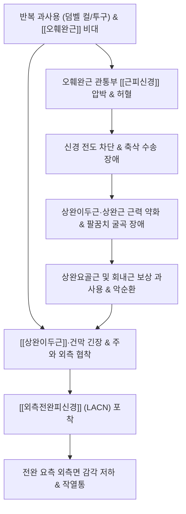

# 🩺 근피신경 포착 증후군 (Musculocutaneous Nerve Entrapment, G56.8)

> **핵심 3줄 요약 (Key Summary)**:
> - 📍 병소 부위 & 해부·병태생리: [[완신경총]] 외측삭(C5~C7) 기원의 [[근피신경]]이 [[오훼완근]] 관통부 및 주관절 원위부 상완이두근 건막 외측에서 물리적으로 포착·견인.
> - 🚩 전형적 임상 양상 & 3대 징후: [[상완이두근]]·[[상완근]] 약화로 인한 주관절 굴곡력 저하(전완 회외 시), 종말지인 [[외측전완피신경]] 영역(전완 요측 외측면) 저림 및 작열통 (손바닥/손가락 감각 정상).
> - 🛠️ 핵심 감별 검사 & 한·양방 다각적 치료 전략: [[오훼완근]] 압박 티넬 검사, LACN 신장 검사, 천천/곡지 취혈 및 오훼돌기 외하방 안전 약침, [[서경탕]]·[[활락효령단]].
> - <font color="#fa7e7e">⚠️ 응급 의뢰 레드플래그 & 악화 요인: 오훼돌기 내측 심부 자침 시 액와동정맥 및 신경총 손상 절대 주의, 영구적 상완이두근 근위축 진행 시 수술적 감압 의뢰.</font>

---

## 📌 목차
1. [질환 개요 & 해부학적 병태생리](#1-질환-개요--해부학적-병태생리)
2. [병태생리 메커니즘 & 생체역학적 악순환 네트워크](#2-병태생리-메커니즘--생체역학적-악순환-네트워크)
3. [임상 증상 & 이학적 검사(Physical Exam) 알고리즘](#3-임상-증상--이학적-검사physical-exam-알고리즘)
4. [감별 진단 매트릭스 (Differential Diagnosis)](#4-감별-진단-매트릭스-differential-diagnosis)
5. [한의 통합 치료 프로토콜 (침·약침·추나·한약)](#5-한의-통합-치료-프로토콜-침약침추나한약)
6. [양방 치료 & 병용·의뢰 기준 (Conventional Treatment & Referral)](#6-양방-치료--병용의뢰-기준-conventional-treatment--referral)
7. [재활 운동 & 생활습관 티칭 가이드](#6-재활-운동--생활습관-티칭-가이드)
8. [💡 사용자 진료실 핵심 필기 & 임상 노하우 (Melt-In 잔여 심화 집약)](#7--사용자-진료실-핵심-필기--임상-노하우-melt-in-잔여-심화-집약)
9. [출처 및 학술 참고 문헌 (References)](#8-출처-및-학술-참고-문헌-references)

---

## 1. 질환 개요 & 해부학적 병태생리

![[근피신경-20240918011340659.png|450]]
> [그림 1: ① 병태생리·영상 — 완신경총 외측삭 기원 근피신경의 오훼완근 관통 및 전완 외측 주행 해부도]

### (1) 질환 정의 및 역학적 특성
* **정의**: [[근피신경 포착 증후군]](Musculocutaneous Nerve Entrapment)은 [[완신경총]](Brachial plexus) 외측삭(Lateral cord, C5~C7)에서 분지한 [[근피신경]](Musculocutaneous nerve)이 상완 근위부의 [[오훼완근]](Coracobrachialis) 근복을 관통하는 부위나, 주관절 원위부에서 근막을 뚫고 피하로 이행하는 [[외측전완피신경]](Lateral antebrachial cutaneous nerve, LACN) 터널에서 포착(Entrapment)되어 운동 마비 및 감각 이상을 초래하는 질환이다.
* **호발 대상**: 반복적으로 주관절 굴곡 및 전완 회외 운동을 수행하는 보디빌더, 야구 투수, 테니스 선수, 무거운 배낭이나 도구를 운반하는 군인 및 건설 노동자에게 호발한다.
* **발생 빈도**: 상지 말초신경 포착 증후군(수근관, 주관절 터널 등) 전체 중 발생률이 1% 미만으로 비교적 드물며, 이로 인해 상완이두근건염, 외측상과염, 경추 디스크(C5/C6 신경근병증)로 오진되어 장기간 방치되는 경우가 흔하다.
* **해부학적 변이**: 근피신경이 오훼완근을 관통하지 않고 주행하거나, 정중신경과 교통지(Communicating branch)를 형성하는 변이가 인구의 약 10~20%에서 관찰된다.

### (2) 2대 호발 포착 협착 터널
```
                     완신경총 외측삭 (Lateral Cord, C5~C7)
                                      │
       ┌──────────────────────────────┴──────────────────────────────┐
       ▼ [제1 포착 협착부: 상완 근위부]                              ▼
 [[오훼완근]](Coracobrachialis) 근복 관통 터널               [[오훼돌기]] 직하방 견인대
   - 근육 비대, 과도한 외전·외회전 시 압박                  - 상완골두 전방 변위 시 신장
       │
       ├─────────────────────────────────────────────────────────────┐
       ▼ (운동 신경 지배)                                            │
 [[오훼완근]], [[상완이두근]](Biceps), [[상완근]](Brachialis)        │
       │                                                             │
       ▼ [제2 포착 협착부: 주관절 원위부]                            │
 상완이두근 외측 건막(Aponeurosis) 통과                              │
 심부 상완근막(Deep brachial fascia) 천공 피하 이행                  │
       │                                                             │
 ★ 종말지: [[외측전완피신경]] (Lateral Antebrachial Cutaneous Nerve) ★ ──┘
   - 전완 전외측(Radial border) 및 배외측 피부 감각 지배
```

---

## 2. 병태생리 메커니즘 & 생체역학적 악순환 네트워크



### (1) 병태생리 메커니즘
![[Coracobrachialis_TriggerPoints.jpg|420]]
> [그림 2: ② 관련 해부 구조물 — 오훼완근(Coracobrachialis) 발통점 및 근피신경 압박 연관통 도해]

* **상완 근위부 포착 기전**:
  * [[오훼완근]]의 근복 중앙을 비스듬히 관통(오훼돌기 하방 5~8cm)할 때, 던지기 동작이나 웨이트 트레이닝으로 오훼완근이 비대해지거나 과긴장되면 신경 섬유의 축삭 수송 장애와 허혈성 신경병증이 유발된다.
* **주관절 원위부 포착 기전 (외측전완피신경염)**:
  * 상완이두근 외연과 상완근 사이를 지나 주와(Cubital fossa) 외측에서 상완근막을 관통하여 피하로 주행할 때, 과도한 전완 회내 및 신전 반복 동작에 의해 상완이두근 건막 외측 가장자리에 신경이 마찰·압박을 받는다.

---

## 3. 임상 증상 & 이학적 검사(Physical Exam) 알고리즘

### (1) 주요 증상 삼징 (Triad) 및 단계별 진행
1. **운동 결손 (Motor Deficit)**:
   * 전완 회외(Supination) 상태에서 팔꿈치를 굽힐 때 주관절 굴곡력이 뚜렷하게 저하된다.
   * 상완이두근 반사(Biceps tendon reflex)의 감퇴 또는 소실이 나타난다.
   * 만성화 시 상완 전면의 근육 위축(Atrophy)이 육안으로 관찰된다.
2. **감각 결손 및 신경병증성 통증 (Sensory Deficit & Neuropathic Pain)**:
   * 전완 요측(엄지손가락 쪽 앞팔 외측) 피부에 저림, 감각 저하, 타는 듯한 작열통(Burning sensation) 발생.
   * 손바닥 및 손가락(수부) 감각은 완전히 정상으로 유지된다 (정중신경 및 요골신경 천지 보존).
3. **국소 압통 및 방사통 (Local Tenderness & Radiation)**:
   * 오훼돌기 내하측 2~3cm 지점 촉진 시 극심한 압통과 함께 전완 외측으로 찌릿한 방사통 재현.
* **단계별 진행**:
   * 초기: 무거운 물건을 들거나 팔을 강하게 굽힐 때 일시적인 전완 외측 찌릿함과 피로감.
   * 중기: 일상 동작(문손잡이 돌리기, 숟가락질)에서도 주관절 굴곡력 약화 및 야간 작열통.
   * 말기: 상완이두근의 영구적 근위축, 팔꿈치 굴곡 마비, 전완 외측 감각 탈실.

### (2) 필수 이학적 검사법 (Physical Examination)
1. **오훼완근 압박 및 티넬 검사 (Tinel's Sign at Coracoid)**:
   * 환자의 견관절을 약 30도 외전한 상태에서 검사자가 오훼돌기 내하측 2~3cm 지점을 가볍게 타진하거나 엄지손가락으로 압박.
   * 양성: 전완 외측 피부로 즉각적인 방사통 또는 찌릿한 전기 통증 재현.
2. **외측전완피신경 신장 검사 (LACN Tension Test)**:
   * 주관절을 완전 신전하고 전완을 최대로 회내(Pronation)시킨 후, 손목을 척측 편위(Ulnar deviation) 및 신전시킴.
   * 양성: 주와 외측 상완이두근 건 부위에서 전완 요측 외측면으로 당기는 듯한 통증 유발.
3. **도수 근력 검사 (MMT - Biceps & Brachialis)**:
   * 전완을 완전 회외(Supination) 상태로 유지한 채 주관절 굴곡 저항 검사 시 뚜렷한 근력 감퇴 확인.
   * 상완요골근(요골신경 지배)의 보상 작용을 배제하기 위해 전완 중립(Hammer curl 자세)에서의 검사와 비교 평가 필수.

---

## 4. 감별 진단 매트릭스 (Differential Diagnosis)

| 감별 포인트 | [[근피신경 포착 증후군]] (본 질환) | 경추 신경근병증 ([[경추 추간판 탈출증]] C5/C6) | 상완이두근 장두건염 |
| :--- | :--- | :--- | :--- |
| **경추통 및 유발 검사** | 경추통 없음, [[스펄링 검사]] 음성 | 경추 통증 동반, 스펄링 검사 양성 | 경추 무관, 이학적 유발검사 음성 |
| **[[삼각근]](Deltoid) 근력** | 정상 (액와신경 지배) | **동반 약화 (C5 신경근 손상)** | 정상 |
| **감각 저하 영역** | **전완 외측면만 국한** | 상완 외측(C5) 또는 모지구/엄지(C6) | 감각 이상 전혀 없음 |
| **압통 호발점** | [[오훼돌기]] 내하측 및 주와 외측 | 경추 C5/6 관절돌기간 관절부 | 결절간구(Bicipital groove) |
| **반사 신경 검사** | 상완이두근 반사 저하 | 이두근(C5) 또는 완골근(C6) 반사 저하 | 정상 |

---

## 5. 한의 통합 치료 프로토콜 (침·약침·추나·한약)

![[Biceps_brachii_TriggerPoints.jpg|400]]
> [그림 3: ③ 치료·시술점 — 상완이두근·오훼완근 근간중격(천천·척택) 침구·약침·수액박리술 자입 도해]

### (1) 한의학적 병리 및 변증
* **기체어혈(氣滯瘀血)**: 과도한 노역이나 외상으로 인해 근맥(筋脈)이 손상되고 기혈 순환이 차단되어 주관절 굴곡 불능 및 작열통 발생.
* **풍한습비(風寒濕痺)**: 외사가 상완 및 전완 경락에 침습하여 맥관을 응체시키고 저림과 시림을 유발.
* **기혈양허(氣血兩虛)**: 만성적인 신경 압박으로 상완이두근이 영양을 받지 못해 근육이 위축되고 힘이 빠짐.

### (2) 침구 및 전침 치료 SOP
* **제1 포착점 (오훼완근 감압)**:
  * 취혈: 천천혈(PC2), 극천(HT1) 외측 1.5촌, 오훼돌기 외하측 1.5촌 지점.
  * 침구 조작: 0.25×40mm 또는 50mm 호침으로 오훼돌기 하방 오훼완근의 긴장 밴드를 향해 15~20mm 사자하여 득기감 유도 후 2~4Hz 저주파 전침 15분 통전.
  * **신경·혈관 안전 가이드**: 액와동맥 맥동을 확인하고 반드시 맥동 외측으로 1cm 이상 거리를 두고 외하방으로 비스듬히 자입하여 내측속 손상을 차단.
* **제2 포착점 (외측전완피신경 감압)**:
  * 취혈: 척택(LU5) 외측 1촌, 상완이두근건 외측 가장자리 함요처.
  * 침구 조작: 0.25×30mm 호침으로 피부와 15~20도 각도로 완만하게 평자(10~15mm)하여 건막 아래 신경 터널을 감압.
  * 취혈: 척택혈(尺澤穴) 외측 1촌(상완이두근 건 외연) 및 곡지(曲池) 사이.
  * 침구 조작: 피하 신경이므로 0.20×30mm 호침으로 10~15mm 천자(淺刺)하여 신경 주위 근막 유착 완화.

### (3) 약침 및 침도(Acupotomy) 요법
* **약침 처방**:
  * 신바로약침, 죽염약침, 또는 황련해독탕 약침 0.5~1.0cc를 오훼완근 관통부 및 주와 외측 건막 주위에 분할 주입하여 신경 주위 무균성 염증과 부종을 해소.
* **침도 감압술**:
  * 오훼완근의 만성 섬유화로 인한 완고한 포착 시, 평인형 침도로 오훼돌기 하단 부착부 근막을 골막에 닿지 않도록 안전하게 1~2회 박리 절개.

### (4) 한약 치료 (Herbal Medicine)
* **급성 염증 및 기체어혈**: [[서경탕]](舒經湯), [[활락효령단]](活絡效靈丹)에 [[강황]], [[갈근]]을 가미하여 상지 경락 소통 및 통증 완화.
* **만성 근위축 및 기혈부족**: [[보중익기탕]](補中益氣湯) 합 [[대황기음]](大黃芪飮)에 [[모과]], [[우슬]]을 배합하여 근육 위축 방지 및 신경 재생 촉진.

---

## 6. 양방 치료 & 병용·의뢰 기준 (Conventional Treatment & Referral)

> 🎯 **이 섹션의 목적**: 환자가 **양방약을 이미 복용 중인 경우가 많다.** 한의원 1차 진료에서 양방 치료를 이해하고, 병용 가능·주의·금기를 판단하며, 언제 의뢰할지 결정한다.

* **약물 치료 (Medication)**:
  * 계열별 약물·용량·기간 — 국내 처방 관행 반영.
  * 작용 기전과 한의 치료와의 상호작용.
* **비약물 시술 (Procedures)**:
  * 주사·차단술·물리치료·보조기 등.
* **수술·시술 적응증 (Surgical Indication)**:
  * 언제 수술로 가는가 — 절대·상대 적응증, 수술 후 경과.
* **한의 병용 판단 (Combination Therapy)**:
  * 병용 가능 / 주의 / 금기. 복용 중 환자의 감량 타이밍·반동 현상.
* **양방·전문과 의뢰 기준 (Referral Criteria)**:
  * 응급 의뢰 트리거와 전문과 의뢰 기준(정형외과·신경외과·내과 등).

	(작성 필요)

---

## 7. 재활 운동 & 생활습관 티칭 가이드

### (1) 오훼완근 스트레칭 및 근막 이완
* **벽 지지 흉곽 회전 스트레칭**: 벽에 팔을 90도 외전·외회전하여 대고 몸통을 반대측으로 천천히 회전시켜 상완 전내측([[오훼완근]], [[대흉근]])을 부드럽게 신장. 15~20초 유지, 3회 반복.

### (2) 신경 활주 운동 (LACN Flossing)
* 팔꿈치를 펴고 전완을 회외한 상태에서 손목을 신전시켰다가, 팔꿈치를 살짝 굽히며 전완을 회내하는 율동적 신경 플로싱 동작을 10회 수행하여 유착 박리.

### (3) 일상생활 주의점 (Ergonomics)
* 주관절 과신전 및 전완 회내 상태로 장시간 컴퓨터 타이핑을 하거나 무거운 가방을 팔꿈치에 걸치는 동작(Bag hanging)을 엄격히 금지.
* 덤벨 컬, 턱걸이 등 상완이두근 고부하 운동을 급성기 동안 중단하고 점진적 등척성 운동으로 전환.

---

## 8. 💡 사용자 진료실 핵심 필기 & 임상 노하우 (Melt-In 잔여 심화 집약)

### 7.1 진료실 실전 감별 노하우
* **보디빌더의 전완 저림 호소 시 3대 감별**:
  * 프리처 컬(Preacher curl)이나 무거운 덤벨 운동 후 엄지 쪽 전완이 타는 듯이 아프다고 할 때, 외측상과염(테니스 엘보)으로 오진하기 쉽다.
  * 감별 핵심: 외측상과 압통 유무를 확인하고, **오훼돌기 하방을 눌렀을 때 전완 외측으로 전기가 찌릿 흐르는지(티넬 징후)** 반드시 확인하라.
* **경추 C5 디스크와의 즉각 감별**:
  * 팔을 위로 들어 올리는 외전 근력(삼각근)이 정상이면서 팔꿈치 굽히는 힘만 떨어져 있다면 99% 근피신경 포착이다.

### 7.2 안전 자침 가이드라인 (Safety Pearls)
* 오훼돌기 하방 자침 시 내측 깊숙이 자침하면 **액와동맥(Axillary artery) 및 상완신경총 내측속**을 손상시킬 위험이 있다.
* 반드시 **오훼돌기 외하방에서 골면을 향해 비스듬히 접근**하고, 혈관 박동이 느껴지는 내측으로는 절대 깊이 찌르지 않는다.

---

## 9. 출처 및 학술 참고 문헌 (References)

1. Davidson, J. S., & Metzinger, S. E. (1998). Musculocutaneous nerve entrapment revisited. *The Journal of Hand Surgery*, 23(1), 84-87.
   - DOI: [10.1016/S0363-5023(98)80094-1](https://doi.org/10.1016/S0363-5023(98)80094-1) / PMID: [9658350](https://pubmed.ncbi.nlm.nih.gov/9658350/)
   - [연구 요약] 오훼완근 근복 비대로 인해 유발된 근피신경 포착 증후군의 해부학적 기전과 신경 감압 수술 치험례를 통해 진단 및 치료 프로토콜을 체계화함.
2. Bassett, F. H. 3rd, & Nunley, J. A. (1982). Compression of the musculocutaneous nerve at the elbow. *The Journal of Bone and Joint Surgery. American Volume*, 64(7), 1050-1052.
   - PMID: [7118970](https://pubmed.ncbi.nlm.nih.gov/7118970/)
   - [연구 요약] 주관절 외측에서 상완이두근 건막 및 근막에 의해 발생하는 외측전완피신경 포착 증례를 최초로 보고하고 임상적 유발 검사법을 확립함.
3. Pecina, M. M., & Krmpotic-Nemanic, J. (2001). *Tunnel syndromes: Peripheral nerve compression syndromes* (3rd ed.). CRC Press. ISBN: 978-0849309526.
   - [연구 요약] 근피신경과 외측전완피신경의 2대 협착 터널에 대한 미세 해부학적 주행, 역학적 유발 인자 및 보존적 치료 원칙을 집대성한 표준 교과서.

<!-- 보관 태그(1회용·링크오류, 필요시 복원): 외측전완피신경, 상완이두근약화, 전완외측감각이상 -->
