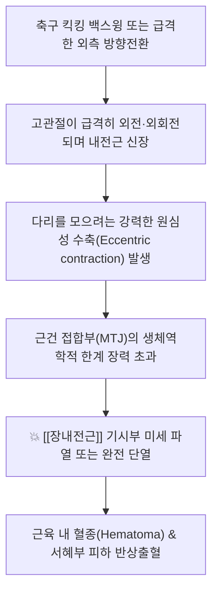

---
aliases:
  - 내전근 파열
  - 내전근 염좌
  - Adductor strain
  - Adductor tear
  - 서혜부 염좌
  - 사타구니 파열
tags:
  - 질환
  - 근골격계
  - 하지
  - 스포츠손상
  - 내전근
  - 장내전근
  - 서혜부통증
  - 근육파열
---
# 🫁 [[내전근 파열]] (Adductor Muscle Strain / Tear)

> **핵심 요약 (Key Summary)**:
> 치골 결합부에서 대퇴골 내측으로 주행하는 고관절 내전근군, 특히 [[장내전근]](Adductor longus) 기시부 건막의 급격한 신장-수축 과부하로 인한 근섬유 파열 손상.
> 축구, 하키 등 급격한 방향 전환(Cutting), 킥킹(Kicking), 외전 감속 동작 중 원심성 수축(Eccentric contraction) 스트레스로 호발.
> 서혜부 내측의 급격한 뚝 하는 소리(Popping), 날카로운 자통, 고관절 수동 외전 시 신장통 및 저항 내전 시 극심한 통증을 유발하는 대표 스포츠 하지 손상.

---

## 📌 목차
1. [손상 해부학 및 호발 근육 (Anatomy of Injury)](#1-손상-해부학-및-호발-근육-anatomy-of-injury)
2. [생체역학적 손상 기전 (Biomechanics of Tear)](#2-생체역학적-손상-기전-biomechanics-of-tear)
3. [중증도 분류 (Grade I ~ III) 및 임상 증상](#3-중증도-분류-grade-i--iii-및-임상-증상)
4. [이학적 검사 및 영상 진단 (MRI, 초음파)](#4-이학적-검사-및-영상-진단-mri-초음파)
5. [추나·한의 중재 및 단계별 재활 프로토콜](#5-추나한의-중재-및-단계별-재활-프로토콜)
6. [출처 및 학술 참고 문헌 (References)](#6-출처-및-학술-참고-문헌-references)

---

## 1. 손상 해부학 및 호발 근육 (Anatomy of Injury)

| 근육명 | 기시부 (Origin) | 정지부 (Insertion) | 손상 빈도 및 특징 |
| :--- | :--- | :--- | :--- |
| **[[장내전근]]** (Adductor longus) | 치골체 전면 (치골결합 바로 아래) | 대퇴골 조선 내측순 중간 1/3 | **전체 내전근 손상의 60~80% 차지**, 치골 기시부 건-골 접합부(Enthesis) 파열 호발 |
| **[[단내전근]]** (Adductor brevis) | 치골 하부 가지 | 대퇴골 치골근선 및 조선 상부 | 장내전근 심층에 위치, 복합 파열 동반 |
| **[[대내전근]]** (Adductor magnus) | 치골하지, 좌골지 및 좌골결절 | 대퇴골 조선 전체 및 내전근결절 | 대형 근육으로 심부 파열 및 만성 서혜부 통증 |
| **[[박근]]** (Gracilis) | 치골결합 및 치골궁 연골 하부 | 경골 조면 내측 (거위발건) | 다관절 근육으로 원위부 및 기시부 신장 손상 |

* **지배 신경**: 폐쇄신경(Obturator nerve, L2~L4) 앞가지 및 뒷가지.
* **치골 결합부(Pubic aponeurosis)의 공통 건막 구조**:
  * 장내전근의 기시부 건막은 [[복직근]] 하부 건막과 치골 전면에서 연속되어 강력한 길항-협력 짝힘을 형성하므로, 손상 시 치골결합염(Osteitis pubis)으로 흔히 파급됨.

---

## 2. 생체역학적 손상 기전 (Biomechanics of Tear)

* **원심성 수축 부하 (Eccentric Overload)**:
  * 근육이 늘어나면서 동시에 강력한 장력을 발휘해야 할 때 장력 집중 부위인 근건 접합부(Myotendinous junction, MTJ)에 미세 파열 발생.
* **내전근 대 둔근/외전근 근력 불균형 (Adductor to Abductor Ratio)**:
  * 내전근의 근력이 외전근([[중둔근]]) 근력의 80% 미만으로 떨어져 있을 때 내전근 파열 위험도가 17배 증가함이 보고됨.

---

## 3. 중증도 분류 (Grade I ~ III) 및 임상 증상

1. **1도 염좌 (Grade I - 경도 파열)**:
   * 근섬유의 5% 미만 미세 파열. 국소 압통은 있으나 근력 소실이나 기능 장애는 거의 없음 (회복 1~2주).
2. **2도 파열 (Grade II - 부분 파열)**:
   * 상당수 근섬유의 불완전 파열. 뚜렷한 서혜부 부종, 피하 출혈, 다리를 모을 때 심한 통증 및 보행 시 절뚝거림 (회복 3~6주).
3. **3도 파열 (Grade III - 완전 파열)**:
   * 치골 부착부에서 건이 완전히 뜯어짐(Avulsion). 극심한 통증, 함몰 촉진, 광범위 피하 혈종, 능동적 내전 불능 (수술적 재건 또는 2~3개월 이상 장기 재활).

---

## 4. 이학적 검사 및 영상 진단 (MRI, 초음파)

* **압박 검사 (Squeeze Test)**:
  * 무릎 사이에 검사자의 주먹이나 베개를 끼우고 양다리를 강하게 모으도록 했을 때 서혜부 안쪽에 유발되는 극심한 통증.
* **수동 신장 검사 (Passive Abduction)**:
  * 고관절을 외전시킬 때 내전근 기시부의 팽팽한 견인통 발생.
* **초음파 및 골반 MRI**:
  * 급성기 근육 내 부종(고신호 강도), 혈종 저류 및 건의 골막 탈락 유무 확인.

---

## 5. 추나·한의 중재 및 단계별 재활 프로토콜

* **급성기 (손상 후 48~72시간) - PRICE 원칙**:
  * 얼음찜질, 압박 붕대, 고관절 과외전 방지, 침상 안정.
* **한의 침구 및 약침 치료**:
  * **혈자리**: 기충(ST30), 급맥(LR12), 음렴(LR11), 족오리(LR10), 혈해(SP10).
  * 파열 부위 국소 염증 및 혈종 흡수를 촉진하기 위해 [[중성어혈약침]] 주입 및 전침(2Hz) 치료.
* **회복기 추나 및 재활 운동**:
  * 골반 변위로 인한 치골 결합부 비틀림을 교정하는 치골 추나 기법 적용.
  * 등척성 수축 훈련 $\rightarrow$ 등장성 훈련 $\rightarrow$ 코펜하겐 내전근 운동(Copenhagen Adduction Exercise)을 통한 원심성 근력 강화.

---

## 6. 출처 및 학술 참고 문헌 (References)

* Serner, A., et al. (2015). Diagnosis of acute groin injuries: a systematic review. *British Journal of Sports Medicine*, 49(12), 768-774.
  * `[연구 요약]` 급성 서혜부 및 내전근 손상의 임상 이학적 검사 표준화, MRI 진단 일치도 및 손상 분류 체계를 확립.
* Tyler, T. F., et al. (2001). The association of hip strength and flexibility with the incidence of adductor muscle strains in professional ice hockey players. *The American Journal of Sports Medicine*, 29(2), 124-128.
  * `[연구 요약]` 내전근과 외전근의 근력 비율 불균형이 내전근 파열을 초래하는 핵심 생체역학적 예측 인자임을 입증.
