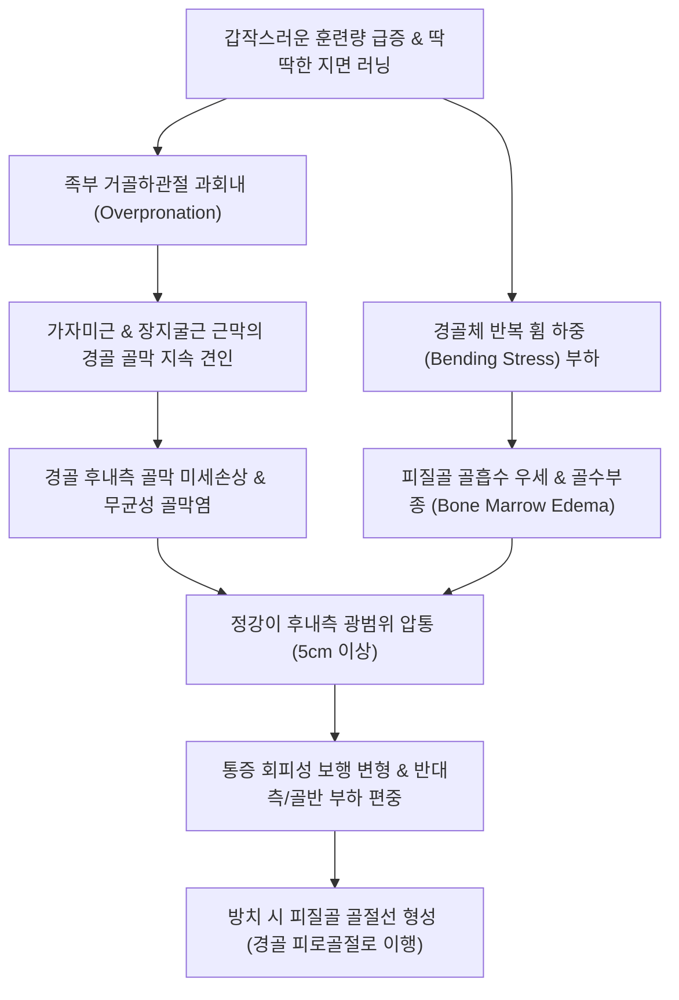

# 🩺 내측 경골 스트레스 증후군 (Medial Tibial Stress Syndrome, MTSS)

> **상위 분류**: [[근골격계 질환]] > [[하지 질환]] > [[하퇴 및 족부 질환]] > [[과사용 증후군]]
> **핵심 3줄 요약 (Key Summary)**:
> - 📍 병소 부위 & 해부·병태생리: 반복적인 달리기나 점프 등 하지 충격 부하로 인해 경골(Tibia) 후내측 골간 능선(Posteromedial border)에 부착하는 심부 후방 구획 근막(가자미근, 장지굴근, 후경골근)의 과도한 견인력(Traction)과 경골 피질골의 미세 손상 및 골막염(Periostitis)이 발생하는 과사용 질환.
> - 🚩 전형적 임상 양상: 경골 후내측 하부 1/3 부위를 따라 **5cm 이상 광범위하게 나타나는 둔한 골성 압통**, 운동 시작 시 심하다가 몸이 풀리면 일시 완화되고 운동 직후 다시 악화되는 전형적 운동 유발성 정강이 통증.
> - 🛠️ 핵심 검사 & 치료 전략: 후내측 경골 압통 범위 평가(피로골절의 국소 <5cm 압통과 감별), 침도(Acupotomy)를 통한 골막 부착부 유착 감압 박리, 신바로약침 및 비복근·가자미근 신장성(Eccentric) 이완, 족부 과회내(Overpronation) 교정 맞춤 안창 및 훈련 부하 10% 감축 지도.
> - ⚠️ 응급 의뢰 레드플래그: 5cm 미만의 국소적인 심한 점 압통, 튜닝포크 진동 검사 극통, X-ray상 피질골 골절선(Dreaded Black Line) 확인 시 경골 피로골절(Stress Fracture)로 즉시 4~6주 비체중부하 깁스 고정 의뢰. 안정 시에도 지속되는 무감각, 족배동맥 맥박 소실 시 급성 구획증후군 응급 수술 의뢰.

---

## 📌 목차
1. [질환 개요 & 해부학적 병태생리](#1-질환-개요--해부학적-병태생리)
2. [병태생리 메커니즘 & 생체역학적 악순환 네트워크](#2-병태생리-메커니즘--생체역학적-악순환-네트워크)
3. [임상 증상 & 이학적 검사(Physical Exam) 알고리즘](#3-임상-증상--이학적-검사physical-exam-알고리즘)
4. [감별 진단 매트릭스 (Differential Diagnosis)](#4-감별-진단-매트릭스--differential-diagnosis)
5. [한의 통합 치료 프로토콜 (침·약침·추나·한약)](#5-한의-통합-치료-프로토콜-침약침추나한약)
6. [양방 치료 & 병용·의뢰 기준 (Conventional Treatment & Referral)](#6-양방-치료--병용의뢰-기준-conventional-treatment--referral)
7. [재활 운동 & 생활습관 티칭 가이드](#7-재활-운동--생활습관-티칭-가이드)
8. [💡 사용자 진료실 핵심 필기 & 임상 노하우 (Melt-In 잔여 심화 집약)](#8--사용자-진료실-핵심-필기--임상-노하우-melt-in-잔여-심화-집약)
9. [출처 및 학술 참고 문헌 (References)](#9-출처-및-학술-참고-문헌-references)

---

## 1. 질환 개요 & 해부학적 병태생리

### 1.1 개요 및 역학
**내측 경골 스트레스 증후군(Medial Tibial Stress Syndrome, MTSS)**은 일반 대중에게 흔히 **신스프린트(Shin Splints)**로 알려진 대표적인 운동 유발성 하퇴 통증 질환이다.
- **호발군**: 마라톤·조깅 입문자, 군대 신병 훈련병, 육상·축구·농구 선수, 댄서 등 반복적으로 딱딱한 지면에서 달리기나 점프를 수행하는 인구에서 흔히 발생한다. 운동선수 하지 손상의 약 10~15%, 군 훈련병의 약 20~35%가 겪는다.
- **해부학적 핵심 부위**: 경골체(Tibial shaft) 원위 1/3 지점의 후내측 능선(Posteromedial border). 이곳은 족관절 저측굴곡 및 회외를 담당하는 **가자미근(Soleus)**, **장지굴근(Flexor Digitorum Longus, FDL)**, **심부 후방 구획 근막(Deep crural fascia)**이 조밀하게 골막(Periosteum)에 부착하는 생체역학적 취약 지점이다.

![[오스굿슐라터병_경골조면_Xray.jpg|400]]
> [그림 1: 하퇴 경골 골간단 및 골막 부착부 해부학적 구조 — 방사선 영상]

---

## 2. 병태생리 메커니즘 & 생체역학적 악순환 네트워크

### 2.1 병태생리 가설: 견인 유발 골막염 vs 골 스트레스 연속체
과거에는 [[후경골근]]의 견인에 의한 단순 염증으로 여겨졌으나, 최근 생체역학 및 조직학 연구에 의해 다음과 같은 다인성 연속체(Continuum) 모델로 확립되었다.
1. **근막 견인력(Fascial Traction)**: 달리기 착지 시 발이 과도하게 안쪽으로 무너지는 **과회내(Overpronation)**가 발생하면, 장지굴근과 가자미근 내측 섬유가 긴장하면서 경골 골막을 지속적으로 잡아당긴다.
2. **골 하중 피로 및 골흡수 우세**: 발이 지면에 닿을 때 발생하는 지면반발력(GRF)과 경골의 미세 휨(Bending stress)으로 인해 피질골에 미세 손상(Micro-damage)이 누적된다. 골재형성 주기에서 파골세포의 골흡수가 조골세포의 신생 골형성보다 빨라지면서 국소 피질골이 다공화(Osteopenia)된다.
3. **골막 신경 혈관 증식 및 통증**: 골막에 무균성 염증과 신생 신경섬유가 발현되어 신경성 통증이 증폭되며, 적절한 휴식 없이 지속될 경우 피질골 균열인 **경골 피로골절(Tibial Stress Fracture)**로 이행한다.

![[피로골절_01_영상소견_경골골간단_피로골절_Xray.jpg|400]]
> [그림 2: 경골 피로골절(Stress Fracture) 대비 내측 경골 스트레스 증후군(MTSS)의 방사선 소견 — 단순 X-ray]

### 2.2 생체역학적 악순환 네트워크

---

## 3. 임상 증상 & 이학적 검사(Physical Exam) 알고리즘

### 3.1 주요 증상 양상
- **전형적인 운동 유발성 통증 패턴**:
  - 초기: 달리기 시작 시 정강이 안쪽이 뻐근하게 아프다가, 몸이 더워지면 통증이 가라앉고, 운동을 마치고 쉴 때 다시 욱신거리며 통증 재발.
  - 진행기: 훈련 내내 통증이 지속되어 달릴 수 없게 되며, 걷거나 계단을 오르내릴 때, 심하면 안정 시에도 통증이 발생함.
- **광범위한 선형 압통(Diffuse Tenderness)**:
  - 경골 원위 1/3 후내측 능선을 따라 손가락으로 눌렀을 때 **최소 5cm 이상(보통 10~15cm)**에 걸쳐 넓게 압통이 이어짐 (피로골절과의 가장 중요한 임상 감별점).
- **경미한 연부조직 부종**: 병변 부위 골막을 만져보면 약간 몽글몽글하게 두터워진 느낌이나 경미한 함요 부종(Pitting edema)이 관찰될 수 있음.

![[발허리뼈골절_01_영상소견_제2중족골_피로골절_Xray.jpg|400]]
> [그림 3: 하지 과사용성 반복 부하에 의한 골간 스트레스 반응 — 방사선 영상]

![[발허리뼈골절_05_술기실사_족부침치료.jpg|400]]
> [그림 4: 후경골근 및 가자미근 골막 부착부 견인력 완화를 위한 하지 침구 치료 실사 — 한의 임상술기]

### 3.2 진단 및 영상 평가
1. **임상 진단 기준 (Navarro & Yates 기준)**:
   - 운동 유발성 경골 후내측 통증 병력.
   - 경골 후내측 능선을 따라 5cm 이상의 연속된 촉진 통증.
   - 신경학적 이상 소견(감각 저하, 운동 마비) 음성.
2. **단순 방사선 사진 (X-ray)**:
   - 초기 및 단순 MTSS에서는 뼈에 이상이 없어 정상으로 나타남. (피로골절 배제 목적으로 필수 촬영). 만성기에는 국소 골막 비후 소견 관찰 가능.
3. **MRI 검사 (Fredericson 분류)**:
   - 1기: 골막하 부종만 관찰됨 (순수 골막염).
   - 2기: T2 강조영상에서 골수부종이 경미하게 관찰됨.
   - 3기: T1 및 T2 강조영상 모두에서 광범위한 골수부종 관찰.
   - 4기: 피질골 내 골절선(Fracture line) 확인 $\rightarrow$ **경골 피로골절 확진**.

---

## 4. 감별 진단 매트릭스 (Differential Diagnosis)

| 감별 질환 | 호발 부위 및 통증 범위 | 휴식 시 양상 | 영상 소견 (X-ray / MRI) | 결정적 감별 포인트 |
| :--- | :--- | :--- | :--- | :--- |
| **[[내측 경골 스트레스 증후군]]** | 경골 후내측 **5cm 이상 광범위** 압통 | 운동 중단 후 서서히 안정 | X-ray 정상, MRI상 골막 부종 | 5cm 이상 선형 압통, 과회내 족부 |
| **[[경골 피로골절]]** | 경골 전방 또는 내측 **<5cm 국소 점 압통** | 쉴 때도 욱신거림, 야간통 | 골절선(Dreaded Black line), 골수부종 | **튜닝포크 진동 검사 극통**, 체중 부하 즉시 불능 |
| **만성 운동성 구획증후군 (CECS)** | 하퇴 전외측 또는 심부 구획 전반 | **운동 멈추면 15~30분 내 완전 소실** | 방사선 정상 | 달릴 때 종아리가 터질 듯함, 발가락 감각저하, 구획압 측정 |
| **심부정맥 혈전증 (DVT)** | 종아리 전체의 급격한 종창과 열감 | 지속적 통증과 팽만감 | 혈관 초음파 혈전 확인 | 호만스 검사(Homans sign) 양성, D-dimer 상승 |

---

## 5. 한의 통합 치료 프로토콜 (침·약침·추나·한약)

![[무릎염좌_05_술기실사_측부인대_자침치료.jpg|400]]
> [그림 5: 하퇴 내측 근막 긴장 완화 및 골막 미세혈류 촉진을 위한 경혈 자침 — 한의 임상술기]

### 5.1 침구 및 침도(Acupotomy) 치료
- **혈위 선정**: 누곡(SP7), 지기(SP8), 삼음교(SP6), 음릉천(SP9), 승산(BL57), 태계(KI3), 조해(KI6).
- **침도 골막 감압 박리술**:
  - 경골 후내측 능선의 심부 근막 부착부와 유착된 골막 부위를 촉진하여 가장 압통이 심한 결절 지점에 0.5×40mm 침도를 골면에 닿을 때까지 사자(斜刺) 자입.
  - 골막에 수직으로 긴장된 근막 섬유를 미세하게 절개·박리하여 골막에 걸리는 지속적 인장 장력을 즉각 감압시킴.
- **전침 치료**: 삼음교-음릉천, 누곡-지기 혈위에 2~4Hz 저주파 전침을 통전하여 가자미근과 장지굴근의 근경련을 해소하고 골막 미세 순환을 촉진.

### 5.2 약침 치료 (Pharmacopuncture)
- **신바로약침 / 소염약침**: 경골 골막염 병변부를 따라 0.1~0.2cc씩 다점 피하 및 골막 인접부에 총 1.0~2.0cc 분할 주입하여 화학적 무균성 염증과 골막 부종을 신속 소퇴.
- **자하거(태반) 약침**: 골재형성 부전과 피질골 다공화가 우려되는 아급성기 환자에게 주입하여 국소 골모세포 활성화 및 미세 손상 치유 촉진.

### 5.3 추나치료 (하퇴 및 족부 생체역학 교정)
- **거골하 관절(Subtalar Joint) 가동 교정**: 과회내된 족부 아치를 거상하고 거골의 외측 회전 및 내번 가동성을 확보하는 관절가동 추나 적용.
- **후경골근 및 가자미근 근막 이완(Myofascial Release)**: 하퇴 후방 구획 근육군의 단축과 유착을 수기 압박 및 신장 기법으로 정돈.

### 5.4 한약 치료
- **급성 골막 염증기**: [[당귀수산]], [[활혈서경탕]] 가감. 어혈을 제거하고 미세혈관 관류를 개선하여 골막 부종을 신속 흡수시킴.
- **만성 과사용 회복기**: [[독활기생탕]], [[보중익기탕]] 가미 (우슬, 두충, 속단, 골쇄보 배합). 골대사를 촉진하고 하퇴 근건 인장 강도를 증강하여 피로골절 이행을 예방.

---

## 6. 양방 치료 & 병용·의뢰 기준 (Conventional Treatment & Referral)

![[발허리뼈골절_06_보존치료_단하지보행보조기_CAMboot.jpg|400]]
> [그림 6: 과부하 방지 및 충격 완화를 위한 보존적 부하 관리 — 임상 보조기]

### 6.1 보존적 양방 치료
- **체외충격파 치료(ESWT)**: 방사형(Radial) 또는 집중형(Focused) 충격파를 경골 후내측 능선에 적용하여 신생 혈관 생성 및 골재형성 촉진 (Teles et al., 2026).
- **보조기 및 맞춤 안창(Orthotics)**: 발 아치를 지지하는 내측 종아치 서포트 패드를 신발 내에 장착하여 회내 스트레스 차단.

### 6.2 정형외과 전원 및 수술 의뢰 기준
- 2~3주간의 적극적 치료에도 악화되거나 국소 점 압통(<5cm)으로 좁혀져 피로골절이 의심될 때 MRI 정밀 의뢰.
- 6개월 이상의 보존적 치료에도 반응하지 않는 불응성 증례의 경우 후방 심부 구획 근막절개술(Fasciotomy) 및 골막 소파술을 고려.

---

## 7. 재활 운동 & 생활습관 티칭 가이드

### 7.1 단계별 러닝 복귀 프로토콜
1. **1단계 (통증 조절기 1~2주)**:
   - 통증을 유발하는 달리기, 줄넘기, 농구 전면 중단.
   - 체중 부하가 없는 수영, 실내 자전거(낮은 저항)로 심폐지구력 유지.
2. **2단계 (근력 및 충격 흡수 회복기 3~4주)**:
   - 계단 끝에 서서 뒤꿈치를 내리는 가자미근·비복근 **편심성 신장(Eccentric heel drop)** 운동 (매일 15회 3세트).
   - 발가락으로 수건 당기기(Towel curl) 및 숏풋(Short foot) 운동으로 족부 족저 내재근 강화.
3. **3단계 (점진적 러닝 재개기 5주 이후)**:
   - **10% 규칙 준수**: 주당 주행 거리나 훈련 강도를 전주 대비 10% 이상 늘리지 않음.
   - 푹신한 우레탄 트랙이나 흙길에서 조깅 시작 (아스팔트·콘크리트 금지).
   - 보폭을 좁히고 분당 케이던스(Cadence)를 170~180보로 높여 착지 시 경골에 가해지는 수직 충격을 분산.

---

## 8. 💡 사용자 진료실 핵심 필기 & 임상 노하우 (Melt-In 잔여 심화 집약)

### 8.1 5cm 룰: 신스프린트인가 피로골절인가 즉각 판별법
- 마라톤을 준비하다 정강이가 아프다며 뛰어온 환자가 있으면 손가락 끝으로 경골 안쪽 능선을 따라 위에서 아래로 훑어내려 본다.
- 압통 부위가 **"여기서부터 여기까지 손바닥 길이만큼 다 아파요" 하며 5cm 이상 길게 이어지면 95% 내측 경골 스트레스 증후군(신스프린트)**이다.
- 반면 환자가 **"선생님, 바로 요기 동전만한 한 점이 미치도록 아파요"** 하고 콕 집어 가리키면, 튜닝포크(음차)를 두드려 그 자리에 대본다. 환자가 소리를 지르며 다리를 뺀다면 피로골절이 이미 발생한 것이다. 즉시 깁스를 대고 상급병원 MRI를 보내야 한다.

### 8.2 신발 안쪽 닳음과 깔창 처방의 결정적 효과
- 신스프린트 환자는 신발 밑창을 뒤집어보면 십중팔구 **뒤꿈치 안쪽과 엄지발가락 쪽이 심하게 닳아 있는 과회내(Overpronation)** 패턴이다.
- 침과 약침으로 통증을 없애주어도 이 회내 패턴을 교정하지 않으면 다시 뛰자마자 100% 재발한다.
- 진료실에서 아치를 받쳐주는 내측 쐐기(Medial wedge)나 단단한 아치 지지 깔창을 신발에 깔아주면, 지면 착지 시 경골 골막으로 전달되는 비틀림 장력이 절반 이하로 줄어들어 재발 없이 완치된다.

---

## 9. 출처 및 학술 참고 문헌 (References)

1. **Teles AI et al. (2026)**. Load-induced medial leg pain in runners: A systematic review of non-invasive treatment approaches. *Phys Ther Sport*. 81:101962. [PMID: 42462658](https://pubmed.ncbi.nlm.nih.gov/42462658/)
   - *[연구 요약]*: 러너에서 발생하는 부하 유발성 내측 하퇴 통증(MTSS)에 대한 도수치료, 운동치료, 체외충격파, 보조기 등 비침습적 보존 치료의 임상적 유효성을 분석한 체계적 문헌고찰.

2. **Fan T et al. (2026)**. A SHAP-based machine learning approach to decoding the relationship between running posture features and tibial load in novice runners with MTSS: towards accurate and intelligent rehabilitation strategies. *BMC Musculoskelet Disord*. 27:312. [PMID: 42174528](https://pubmed.ncbi.nlm.nih.gov/42174528/)
   - *[연구 요약]*: 초보 러너의 주행 자세(케이던스, 보폭, 족부 착지 각도)와 경골 부하 간의 상관관계를 머신러닝으로 분석하여 MTSS 예방 및 재활을 위한 생체역학적 지침을 도출함.

3. **Mazzotti A et al. (2026)**. Medial tibial stress syndrome. *Musculoskelet Surg*. 110(2):145-154. [PMID: 41831134](https://pubmed.ncbi.nlm.nih.gov/41831134/)
   - *[연구 요약]*: 내측 경골 스트레스 증후군의 병인론, 피로골절과의 연속체적 병태생리, Fredericson MRI 분류 및 단계별 보존 치료 프로토콜을 총괄 고찰한 최신 종설.

4. **Saad MA et al. (2025)**. Medial Tibial Stress Syndrome: A Scoping Review of Epidemiology, Biomechanics, and Risk Factors. *Cureus*. 17(3):e81463. [PMID: 40171337](https://pubmed.ncbi.nlm.nih.gov/40171337/)
   - *[연구 요약]*: 운동선수와 군 훈련병을 대상으로 한 MTSS의 역학, 족부 과회내 등 생체역학적 위험 인자, 성별 및 체질량지수(BMI)의 영향을 체계적으로 정리한 범위 고찰.
