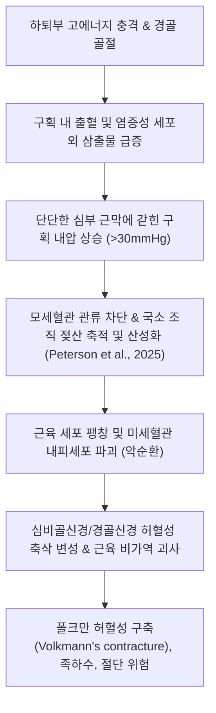

# 🩺 다리 골절 (Lower Leg Fractures / Tibia and Fibula Fractures)

> **핵심 3줄 요약 (Key Summary)**:
> - 📍 **병소 부위 & 해부·병태생리**: 무릎관절과 발목관절 사이의 하퇴부를 구성하는 [[경골]](Tibia, 정강뼈) 및 [[비골]](Fibula, 종아리뼈)의 골절을 총칭하며, 경골 전내측면이 피하에 바로 노출되어 있어 **인체 장관골 중 개방성 골절(Open fracture, Gustilo-Anderson)과 불유합 빈도가 가장 높다**.
> - 🚩 **전형적 임상 양상**: 하퇴부의 극심한 동통, 체중 부하 불가, 각형성(Angulation) 및 단축 기형, 조기 광범위 종창. 특히 골절 후 4개 구획 내압 상승으로 발생하는 **[[급성 구획 증후군]](Acute Compartment Syndrome)** 발생 시 6~8시간 내 영구적 근육 괴사 및 신경 마비 초래.
> - 🛠️ **핵심 검사 & 치료 전략**: 하퇴부 전후방(AP) 및 측면(Lateral) X-ray(슬관절 및 족관절 동시 포함 촬영 필수). 비전위 안정형은 장하지 석고 고정 후 슬개건체중부하(PTB) 보조기 전환, 전위 골절은 **폐쇄적 골수내정 고정술(Closed Intramedullary Nailing, IM nail)** 표준 시행. 고정기 어혈 제거([[당귀수산]], [[자연동]]) 및 회복기 비골신경 마비·근위축 한의 전침 치료.
> - ⚠️ **응급 의뢰 레드플래그**: 5P 징후(극심한 통증 Pain, 창백 Pallor, 맥박 소실 Pulselessness, 감각 이상 Paresthesia, 마비 Paralysis), 족지 수동 신전 시 극심한 통증, 개방창으로 뼈 돌출 시 즉시 응급 근막절개술 및 세척술 전원.

---

## 📌 목차
1. [질환 개요 & 해부학적 병태생리](#1-질환-개요--해부학적-병태생리)
2. [병태생리 메커니즘 & 생체역학적 악순환 네트워크](#2-병태생리-메커니즘--생체역학적-악순환-네트워크)
3. [임상 증상 & 이학적 검사(Physical Exam) 알고리즘](#3-임상-증상--이학적-검사physical-exam-알고리즘)
4. [감별 진단 매트릭스 (Differential Diagnosis)](#4-감별-진단-매트릭스-differential-diagnosis)
5. [한의 통합 치료 프로토콜 (침·약침·추나·한약)](#5-한의-통합-치료-프로토콜-침약침추나한약)
6. [양방 치료 & 병용·의뢰 기준 (Conventional Treatment & Referral)](#6-양방-치료--병용의뢰-기준-conventional-treatment--referral)
7. [재활 운동 & 생활습관 티칭 가이드](#7-재활-운동--생활습관-티칭-가이드)
8. [💡 사용자 진료실 핵심 필기 & 임상 노하우 (Melt-In 잔여 심화 집약)](#8--사용자-진료실-핵심-필기--임상-노하우-melt-in-잔여-심화-집약)
9. [출처 및 학술 참고 문헌 (References)](#9-출처-및-학술-참고-문헌-references)

---

## 1. 질환 개요 & 해부학적 병태생리

하퇴부(Lower leg)는 대퇴골로부터 전달되는 체중의 85% 이상을 지탱하는 내측의 굵은 **[[경골]](Tibia)**과, 15% 미만의 체중 부하 및 족외측 근육 부착부 역할을 하는 외측의 가느다란 **[[비골]](Fibula)**로 구성된다. 두 뼈는 골간막(Interosseous membrane)과 근위/원위 경비관절에 의해 하나의 기능적 단위로 연결되어 있다.

![[다리골절_01_병태도해_경골비골_해부도해_Gray258.png]]
> [그림 1: ① 병태생리·도해 — 하지 하퇴골의 전면 해부도: 경골체부(Tibia)와 비골(Fibula)의 골격 구조 (Henry Gray, Anatomy of the Human Body)]

다리 골절(하퇴골 골절)은 인체 장관골 골절 중 가장 빈번하게 발생하는 손상 중 하나이다. 특히 경골의 전내측면(Shin)은 두터운 근육 피복이 전혀 없이 피하지방과 피부만으로 덮여 있는 독특한 해부학적 구조를 지닌다. 이로 인해:
1. 외부 충격 시 피부가 쉽게 찢어지는 **개방성 골절(Open fracture)**이 전신 장골 중 가장 흔하게 발생한다 (전체 경골 골절의 약 25%).
2. 골막 외 혈류(Extraosseous blood supply)가 취약하여 골유합 지연 및 [[불유합]](Nonunion), 만성 골수염(Osteomyelitis)의 발생률이 높다.

![[다리골절_01_영상의학_경골간부골절_Xray.jpg]]
> [그림 2: ① 병태생리·영상 — 경골 간부의 횡상 골절 및 비골 골절 동반 단순 방사선(X-ray) 소견 (Wikimedia Commons)]

![[다리골절_01_영상의학_경골나선상골절_방사선.png]]
> [그림 3: ① 병태생리·영상 — 하지 비틀림(Torsion) 손상으로 발생한 경골 나선상 전위 골절 방사선 소견 (Wikimedia Commons)]

골절 형태는 직접 타격에 의한 횡상(Transverse) 및 분쇄 골절(Comminuted fx), 스키나 스포츠 중 비틀림 손상에 의한 나선상(Spiral fx) 또는 사상 골절(Oblique fx)로 구분된다.

---

## 2. 병태생리 메커니즘 & 생체역학적 악순환 네트워크

### 하퇴 4대 구획과 급성 구획 증후군 (Compartment Syndrome)
하퇴부는 단단하고 신장성이 없는 심부 근막(Deep fascia)과 골간막, 경골 및 비골에 의해 **4개의 폐쇄된 근막 구획**으로 나뉜다:

![[다리골절_02_해부도해_하퇴4대구획_횡단면_Gray432.png]]
> [그림 4: ② 관련 해부 구조물 — 하퇴부 횡단면의 4대 근막 구획: 전방, 외측, 천부 후방, 심부 후방 구획 및 신경혈관 다발 (Henry Gray)]

1. **전방 구획 (Anterior compartment)**: 전경골근, 장지신근, 장무지신근 / **심비골신경**, 전경골동정맥.
2. **외측 구획 (Lateral compartment)**: 장비골근, 단비골근 / **천비골신경**.
3. **천부 후방 구획 (Superficial posterior compartment)**: 비복근, 가자미근, 족저근 / 비복신경.
4. **심부 후방 구획 (Deep posterior compartment)**: 후경골근, 장지굴근, 장무지굴근 / **경골신경**, 후경골동정맥, 비골동정맥.

골절 후 혈종 형성과 조직 부종으로 폐쇄된 구획 내 압력이 모세혈관 관류압(약 30mmHg) 이상으로 상승하면 미세혈관이 허탈되고 조직 허혈이 초래된다:

---

## 3. 임상 증상 & 이학적 검사(Physical Exam) 알고리즘

### 임상 증상
- **국소 통증 및 기형**: 골절 부위의 심한 자발통, 압통, 하퇴부의 육안적 각형성(Angulation), 단축 기형 및 이상 가동성(Abnormal mobility).
- **급성 구획 증후군 5P 징후**:
  1. **Pain out of proportion**: 손상 정도에 비해 설명할 수 없을 정도로 극심한 통증.
  2. **Pain on passive stretch**: **가장 조기 진단적 가치가 높은 징후**. 발가락을 수동으로 신전(Dorsiflexion)시킬 때 전방 구획의 찢어지는 듯한 극통 유발.
  3. **Pallor / Tense swelling**: 나무토막처럼 단단하게 팽창된 하퇴부 피부.
  4. **Paresthesia**: 심비골신경 지배 영역인 제1-2족지 갈퀴 공간(Web space)의 감각 저하.
  5. **Paralysis / Pulselessness**: 족하수 및 족배동맥 맥박 소실 (말기 징후로 이미 근괴사가 진행됨을 시사).

### 이학적 검사 및 영상 알고리즘
1. **신경혈관 및 연부조직 전수 검사**:
   - 족배동맥 및 후경골동맥 맥박 확인.
   - Gustilo-Anderson 분류에 따른 개방창 크기 및 오염도 평가 (Type I <1cm, Type II 1~10cm, Type III >10cm 광범위 연부조직 손상).
2. **구획압 측정(Stryker needle manometer)**: 구획 내압이 30mmHg 초과 또는 이완기 혈압과의 차이(ΔP)가 30mmHg 미만일 때 즉시 근막절개술 결정.
3. **영상 검사**:
   - **X-ray**: 하퇴부 AP 및 Lateral 뷰. 반드시 **슬관절과 족관절을 모두 포함**하여 촬영(Maisonneuve 골절 등 근위 비골 골절 간과 방지).

---

## 4. 감별 진단 매트릭스 (Differential Diagnosis)

| 질환명 | 주 손상 부위 | 연부조직 긴장도 | 방사선 특징 | 치료 우선순위 |
| :--- | :--- | :--- | :--- | :--- |
| **경골 간부 골절 (본 질환)** | 경골 중앙 1/3 샤프트 | 구획 증후군 위험 극히 높음 | 경골 및 비골 간부 골절선 | 골수내정 고정술(IM nail), 구획압 모니터링 |
| **경골 고평부 골절 (Plateau fx)** | 근위 경골 관절면 | 슬관절 혈관절증(Hemarthrosis) | 경골 외측/내측 관절면 함몰 | 관절면 거상 및 해부학적 금속판 고정 |
| **경골 필론 골절 (Pilon fx)** | 원위 경골 천장(Plafond) | 족관절 수포, 연부조직 괴사 | 족관절 관절면 분쇄 압괴 | 단계적 외고정 후 관혈적 정복술 |
| **[[비골 골절]](단독 골절)** | 비골 간부 단순 충격 | 경미한 부종, 체중 부하 가능 | 비골 단독 골절선, 경골 정상 | 보존적 보행 보조기 3~4주 |
| **메종뇌브 골절 (Maisonneuve)** | 원위 경비인대 + 근위 비골 | 내과 골절 또는 삼각인대 파열 | 원위 경비인대 벌어짐 + 근위 비골두 골절 | 경비인대 정복 나사 고정술 필수 |

---

## 5. 한의 통합 치료 프로토콜 (침·약침·추나·한약)

다리 골절 환자는 급성기 관내정 수술 또는 석고 고정 후 발생하는 하퇴 근육 위축, 지연 유합, 족관절 강직 및 비골신경 마비 후유증 치료를 위해 한의원에 내원한다.

![[다리골절_05_술기실사_구획증후군_감압근막절개술.jpg]]
> [그림 5: ③ 치료·시술점 — 급성 구획 증후군으로 인한 근육 괴사를 방지하기 위해 시행된 하퇴부 감압 근막절개술(Fasciotomy) 실사 (Wikimedia Commons)]

### 1) 침구 및 전침 치료
- **주요 취혈점**: [[족삼리]](ST36), [[양릉천]](GB34), [[음릉천]](SP9), [[조구]](ST38), [[승산]](BL57), [[현종]](GB39), [[해계]](ST41).
- **자침 기법**:
  - 골수내정 삽입 부위(경골 결절 상방) 및 원위 횡고정 나사 부위를 피해 정상 근복부 자침.
  - **비골신경 마비(족하수) 전침 프로토콜**: 양릉천-족삼리(천비골신경) 및 조구-해계(심비골신경)에 2Hz/100Hz 혼합파를 20분간 통전하여 전경골근 근력 수축 촉진 및 신경 재생 유도.

### 2) 약침 치료
- **[[자하거 약침]]**: 경골의 불량한 혈류 공급과 지연 유합을 극복하기 위해 골절선 주변 건측 피부 및 족삼리 혈위에 주 2~3회 1.0cc 주입 (골형성 단백질 활성화).
- **[[신비약침]]**: 고정 해제 후 하퇴 심부 후방 구획 근막 긴장 완화.

### 3) 한약 치료
- **급성 고정기 (수상 후 1~4주)**: [[당귀수산]](當歸鬚散) 가미방 + **[[자연동]]**(自然銅, 醋淬) 2g/일 (골막하 혈종 흡수 및 신생 가골 형성 촉진, PMID 38256337).
- **회복기 (불유합 예방 및 근력 회복)**: 접골단(接骨丹) 또는 [[독활기생탕]](獨活寄生湯) 가감(속단, 골쇄보, 두충 증량) 투여.

---

## 6. 양방 치료 & 병용·의뢰 기준 (Conventional Treatment & Referral)

![[다리골절_06_양방수술_경골골수내정_고정술_Xray.jpg]]
> [그림 6: ③ 치료·시술점 — 경골 간부 전위 골절에서 시행된 폐쇄적 확공 골수내정(Intramedullary Nailing, IM nail) 고정술 방사선 소견 (Wikimedia Commons)]

### 수술적 치료 (Surgical Management)
1. **폐쇄적 골수내정 고정술(Closed Intramedullary Nailing, IM Nail)**:
   - 성인 전위성 경골 간부 골절의 **골드 스탠다드(Gold Standard)** (Lee et al., 2026).
   - 슬개건을 종절개하거나 슬개골 상부 접근법(Suprapatellar approach)을 통해 경골 골수강 내 네일을 삽입하고 근위/원위 잠김 나사를 체결.
   - 골막 혈류를 보존하며 조기 체중 부하(Early weight-bearing)가 가능한 절대적 장점.
2. **최소침습 금속판 고정술(MIPO)**: 관절 근처 골절(근위 고평부, 원위 필론 골절)에 적용.
3. **외고정술(External Fixation)**: Gustilo Type III 중증 개방성 골절 또는 연부조직 상태가 극도로 불량한 경우 임시 고정으로 사용.

### 응급 근막절개술 (Emergency Fasciotomy)
- 급성 구획 증후군 확진 시 지체 없이 전외측 및 후내측 피부 절개를 통한 **4개 구획 완전 감압 근막절개술** 시행 (골든타임: 6시간 이내).

### 1차 진료실 의뢰 기준
- **응급 수술 전원**: 하퇴부의 긴장성 종창 및 발가락 수동 신전 시 극통(구획 증후군), 피부 개방창 및 뼈 노출, 족배동맥 맥박 소실 시 즉시 응급실 전원.

---

## 7. 재활 운동 & 생활습관 티칭 가이드

### 1) 단계별 재활 운동
- **1단계 (수술 직후 0~2주)**:
  - 발목 펌프 운동 및 능동 족지 굴신 운동: 하지 정맥혈 환류 촉진.
  - 대퇴사두근 등척성 수축 훈련(Isometric Quad sets).
- **2단계 (2~6주, 점진적 체중 부하)**:
  - 골수내정 고정 환자는 골유합 상태에 따라 목발을 이용한 부분 체중 부하(PWB 30~50%) 조기 시작.
  - 비체중 족관절 능동 가동 범위 운동.
- **3단계 (6~12주, 완전 체중 부하 및 근력 강화)**:
  - 전체 체중 부하 보행(FWB) 전환.
  - 밴드 저항을 이용한 전경골근 및 비골근 근력 강화, 카프 레이즈(Calf raise).

### 2) 생활습관 수칙
- **절대 금연**: 경골은 골유합 실패율이 가장 높은 뼈이며, 흡연 시 불유합 위험이 4배 이상 증가하므로 수상 후 최소 6개월간 절대 금연.

---

## 8. 💡 사용자 진료실 핵심 필기 & 임상 노하우 (Melt-In 잔여 심화 집약)

- **석고 붕대 환자의 '타는 듯한 발 통증' 호소**: 반깁스나 통깁스를 한 환자가 "발이 으스러지게 아프고 타는 것 같다"고 호소하면 진통제를 추가할 것이 아니라 **즉시 붕대와 석고를 전면 절개(Bivalving)**하여 압력을 풀어주어야 한다. 석고 압박에 의한 구획 증후군 발생 시 치명적인 의료사고로 이어진다.
- **비골 골절 치료의 원칙**: 경골이 정상인 단순 비골 간부 골절은 수술하지 않고 보행 보조기로 체중 부하를 허용해도 4~6주면 자연 치유된다. 단, 족관절 내과 통증이나 경비인대 파열(Maisonneuve 골절)이 동반되었는지는 반드시 확인해야 한다.

---

## 9. 출처 및 학술 참고 문헌 (References)

1. **Lee JW et al. (2026)**. Rigid intramedullary nailing with suprapatellar approach for tibial shaft fractures in adolescents with open physes. *Injury*, 57(4):113130. [PMID 41764814](https://pubmed.ncbi.nlm.nih.gov/41764814/)
   - [연구 요약]: 경골 간부 골절에서 슬개골 상부 접근법(Suprapatellar)을 통한 강성 골수내정 고정술의 정복 정확도 향상 및 조기 관절 기능 회복 효과 분석.

2. **Peterson DF et al. (2025)**. In Vivo Intramuscular pH in Tibia Fractures Is Acidic Prior to Stabilization and Equilibrates Toward Systemic pH 48 h Post Stabilization. *J Orthop Res*, 43(8):1378-1386. [PMID 40448424](https://pubmed.ncbi.nlm.nih.gov/40448424/)
   - [연구 요약]: 경골 골절 후 하퇴 구획 내 근육 조직의 허혈성 산성화(pH 저하) 병태생리와 조기 골 고정 후 구획 내 미세 순환 정상화 과정 규명.

3. **Sinjeri D et al. (2026)**. Posterior tibial artery pseudoaneurysm after titanium elastic nailing for tibial shaft fracture in a 7-year-old boy. *Acta Chir Belg*, 126(1):15-17. [PMID 41404826](https://pubmed.ncbi.nlm.nih.gov/41404826/)
   - [연구 요약]: 경골 간부 골절의 수술적 내고정 후 발생할 수 있는 후경골동맥 가성동맥류 등 하지 주요 혈관 합병증의 조기 발견 및 치료 증례 보고.

4. **Nam EY et al. (2023)**. Therapeutic Efficacy of Chinese Patent Medicine Containing Pyrite for Fractures: A Systematic Review and Meta-Analysis. *Medicina (Kaunas)*, 60(1):164. [PMID 38256337](https://pubmed.ncbi.nlm.nih.gov/38256337/)
   - [연구 요약]: 경골을 포함한 장관골 골절에서 자연동(Pyrite) 배합 제제의 신생 골화 촉진 및 골절 유합 시간 단축 효능 메타분석.

---

## 관련 노트

- [[경골]]
- [[비골]]
- [[고관절 골절]]
- [[골반 골절]]
- [[발목 염좌]]
- [[급성 구획 증후군]]
- [[자연동]]
- [[당귀수산]]
- [[독활기생탕]]
- [[족삼리]]
- [[양릉천]]
