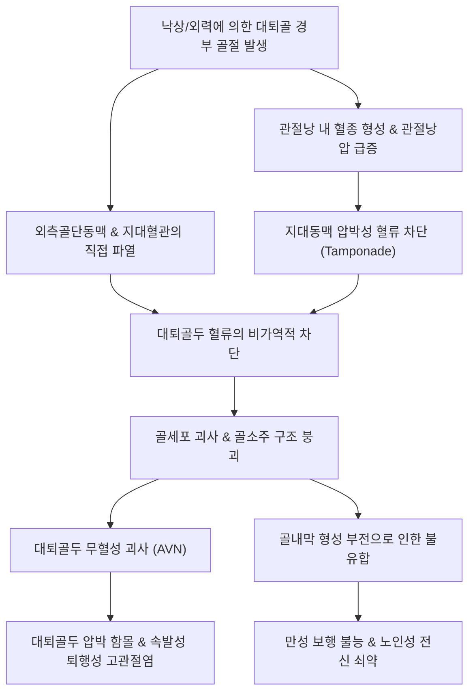

# 🩺 대퇴골 경부 골절 (Femoral Neck Fracture)

> **핵심 3줄 요약 (Key Summary)**:
> - 📍 **병소 부위 & 해부·병태생리**: 대퇴골두 직하부에서 전자간선 사이의 관절낭 내(Intracapsular) 골절로, 대퇴골두로 유입되는 내측대퇴회선동맥의 지대혈관망(Retinacular arteries)이 파열되어 [[대퇴골두 무혈성 괴사]](AVN) 및 불유합 발생률이 극히 높음.
> - 🚩 **전형적 임상 양상**: 낙상 후 서혜부 및 고관절의 극심한 통증과 보행 불능. 전위성 골절의 경우 환측 하지가 단축(Shortening)되고 외회전(External rotation)되는 전형적인 사지 변형 관찰.
> - 🛠️ **핵심 검사 & 치료 전략**: 골반 전후면(Pelvis AP) 및 고관절 측면 X-ray로 진단하며 미세/잠재 골절은 MRI로 확진. 전위 골절은 연령에 따라 다발성 유관나사/FNS 내고정술(젊은 층) 또는 양극성 인공관절 반치환술(BHA, 고령층) 시행 후 한의 활혈·접골·보신 약물 및 보행 재활 병용.
> - ⚠️ **응급 의뢰 레드플래그**: 수상 직후 급격한 혈압 저하 및 빈혈(내출혈 쇼크), 하지 원위부 족배동맥 박동 소실 및 신경마비, 조기 전위 위험이 있는 불완전 골절의 즉각적 정형외과 응급 전원.

---

## 📌 목차
1. [질환 개요 & 해부학적 병태생리](#1-질환-개요--해부학적-병태생리)
2. [병태생리 메커니즘 & 생체역학적 악순환 네트워크](#2-병태생리-메커니즘--생체역학적-악순환-네트워크)
3. [임상 증상 & 이학적 검사(Physical Exam) 알고리즘](#3-임상-증상--이학적-검사physical-exam-알고리즘)
4. [감별 진단 매트릭스 (Differential Diagnosis)](#4-감별-진단-매트릭스-differential-diagnosis)
5. [한의 통합 치료 프로토콜 (침·약침·추나·한약)](#5-한의-통합-치료-프로토콜-침약침추나한약)
6. [양방 치료 & 병용·의뢰 기준 (Conventional Treatment & Referral)](#6-양방-치료--병용의뢰-기준-conventional-treatment--referral)
7. [재활 운동 & 생활습관 티칭 가이드](#7-재활-운동--생활습관-티칭-가이드)
8. [💡 사용자 진료실 핵심 필기 & 임상 노하우 (Melt-In 잔여 심화 집약)](#8--사용자-진료실-핵심-필기--임상-노하우-melt-in-잔여-심화-집약)
9. [출처 및 학술 참고 문헌 (References)](#9-출처-및-학술-참고-문헌-references)

---

## 1. 질환 개요 & 해부학적 병태생리

대퇴골 경부 골절(Femoral Neck Fracture)은 대퇴골두의 관절연골 직하부 기저부에서 대퇴골 전자간선(Intertrochanteric line)에 이르는 경부 부위에서 발생하는 대표적인 고관절 골절이다. 해부학적으로 고관절낭 내(Intracapsular)에 위치하여 관절낭외 골절인 [[대퇴골 전자간 골절]]과 구별되는 고유한 병태생리학적 및 치료적 특성을 지닌다. 65세 이상 고령층에서 [[골다공증]]에 기인하여 일상적인 평지 낙상(Ground-level fall)과 같은 저에너지 손상으로 빈발하며, 여성의 발병률이 남성에 비해 2~3배 높다. 반면 젊은 성인에서는 교통사고나 추락 등 고에너지 손상에 의해 주로 발생한다.

골절의 안정성과 혈류 손상 위험도는 정형외과학적으로 **Garden 분류**와 **Pauwels 분류**를 통해 체계적으로 평가된다:
1. **Garden 분류 (정위 방사선 기준)**:
   - **Stage I**: 불완전 외전 또는 감입 골절(Incomplete/impacted fracture, 안정형).
   - **Stage II**: 완전 골절이나 골절편 전위가 없는 정렬 유지 골절(Complete non-displaced, 안정형).
   - **Stage III**: 완전 골절이며 골절편이 부분 전위된 상태(Partially displaced, 대퇴골두 골소주선 회전 왜곡, 불안정형).
   - **Stage IV**: 완전 골절이며 골편이 완전히 전위되어 비구와의 정렬이 소실된 상태(Completely displaced, 불안정형).
2. **Pauwels 분류 (골절선 주행 각도 기준)**:
   - 수평선에 대한 골절선의 각도에 따라 제1형(<30°, 압박력 우세, 안정형), 제2형(30~50°, 전단력 증가), 제3형(>50°, 전단력 극대화, 극도의 불안정성 및 불유합 위험)으로 세분된다.

![[대퇴골경부골절_01_병태도해_대퇴경부골절_분류모식도.jpg]]
> [그림 1: ① 병태생리·도해 — 대퇴골 경부 골절의 해부학적 위치 및 정위적 골절선 분류(Garden & Pauwels)]

방사선학적으로 고령층의 전위성 골절은 대퇴골두 골소주(Trabecular lines)의 단절과 왜곡이 명확히 관찰되며, 경부 후벽의 분쇄(Posterior comminution)가 동반될 경우 정복의 안정성이 급격히 저하된다.

![[대퇴골경부골절_01_영상의학_대퇴경부골절_CT단면.png]]
> [그림 2: ① 영상의학 — 대퇴골 경부 분쇄 골절의 골반 관상면 CT 재구성 영상]

---

## 2. 병태생리 메커니즘 & 생체역학적 악순환 네트워크

대퇴골 경부의 혈액 공급은 내측대퇴회선동맥(Medial Circumflex Femoral Artery, MCFA)의 분지인 외측골단동맥(Lateral Epiphyseal Artery)과 상하 지대동맥(Retinacular arteries)에 절대적으로 의존한다. 이 혈관망은 관절낭의 활액막 하층을 통과하여 대퇴골두로 상행하는데, 경부 골절 시 골편의 전위와 관절낭 내 혈종 형성으로 인해 혈관이 직접 열상되거나 압박(Intracapsular Tamponade)을 받게 된다. 

대퇴골 경부는 골막(Periosteum)이 결손되어 있어 골절 치유 과정에서 외골소주성 가골(External callus) 형성이 일어나지 않으며, 전적으로 내골소주성 골내막 유합(Endosteal healing)에만 의존한다. 또한 관절액 내의 섬유소용해효소(Fibrinolysin)가 혈종 형성을 억제하여 초기 골유합 환경을 저해한다. 따라서 불유합(Nonunion)과 무혈성 괴사의 발생률이 매우 높다.

![[대퇴골경부골절_02_해부도해_고관절낭후방인대_Gray320.png]]
> [그림 3: ② 관련 해부 구조물 — 고관절낭 후방 및 관절낭외 회선동맥망 해부도(Gray's Anatomy)]

---

## 3. 임상 증상 & 이학적 검사(Physical Exam) 알고리즘

### 1) 임상 증상
- **서혜부 및 둔부 통증**: 수상 직후 고관절 심부 및 서혜부(Groin)에 극심한 통증이 발생하며, 통증은 대퇴 전면 또는 무릎 내측([[연관통]])으로 방사될 수 있다.
- **보행 및 체중 부하 불능**: 전위성 골절 환자는 기립이나 보행이 절대적으로 불가능하다. 단, Garden I 감입 골절 환자는 경미한 파행을 보이며 절뚝거리며 걸을 수 있어 진단 지연의 원인이 된다.
- **하지 기형(Deformity)**: 장골근 및 둔근군의 견인 작용으로 인해 환측 하지가 1~2cm 단축(Shortening)되며, 장요근의 외회전 토크로 인해 족부가 바깥으로 돌아가는 외회전(External rotation, 대개 45° 안팎) 기형이 나타난다.

### 2) 이학적 검사 및 진단 알고리즘
- **축성 압박 검사 (Heel Strike / Anvil Test)**: 환자를 앙와위로 눕히고 발뒤꿈치를 주먹으로 가볍게 두드릴 때 고관절 심부로 방사되는 날카로운 격통 발생.
- **통나무 굴리기 검사 (Log Roll Test)**: 침상에서 환자의 대퇴부를 내회전/외회전 시킬 때 극심한 방어적 근경련 및 서혜부 통증 발현.
- **패트릭 검사 (FABER Test)**: 굴곡·외전·외회전 시 관절낭 팽창으로 통증 유발. 골절 의심 시 무리한 강제 굴곡은 전위를 유발하므로 금기.
- **방사선 검사**:
  1. **골반 전후면(Pelvis AP) & 고관절 전후면(Hip AP)**: Shenton 선의 연속성 소실, 골소주각 변화 확인.
  2. **크로스 테이블 외측상(Cross-table Lateral)**: 골절편의 전후방 전위 확인 (환측 다리를 무리하게 개구리 자세로 굴곡시키는 Frog-leg lateral은 골절선 전위를 유발하므로 금기).
  3. **골반 3차원 CT**: 관절 내 유리 골편, 경부 후벽 분쇄 정도 평가.
  4. **고관절 MRI**: 단순 방사선상 음성인 불완전/잠재(Occult) 골절의 골수 부종 및 선상 저신호 강도를 확인하는 표준 검사법.

---

## 4. 감별 진단 매트릭스 (Differential Diagnosis)

| 감별 질환 | 호발 연령 및 기전 | 병변 위치 및 특징 | 방사선 및 임상적 감별점 | 예후 및 합병증 특성 |
| :--- | :--- | :--- | :--- | :--- |
| **대퇴골 경부 골절** | 65세 이상, 저에너지 낙상 | 관절낭 내(Intracapsular) | 하지 단축 및 외회전 기형(약 45°), Shenton선 단절 | 무혈성 괴사(AVN) 및 불유합률 극히 높음 |
| **[[대퇴골 전자간 골절]]** | 75세 이상, 초고령 골다공증 | 관절낭 외(Extracapsular) | 심한 외회전 기형(90° 가까이), 대전자부 심한 피하 출혈반 | 해면골 풍부하여 골유합 양호, 과다 실혈 위험 |
| **[[골반 골절]] (치골지 골절)** | 고령자 낙상 / 고에너지 외상 | 치골지, 좌골지, 비구 | 서혜부 전면 압통, 고관절 회전 운동 범위 보존 | 비수술적 안정 가료로 골유합 호발 |
| **[[대퇴골두 무혈성 괴사]]** | 30~50대 남성, 음주/스테로이드 | 대퇴골두 체중부하부 연골하 | 외상력 없는 서혜부 통증, 초중기 하지 단축 없음 | 외상과 무관한 골두 압괴, 전치환술 적응증 |
| **고관절 좌상 및 전자부 점액낭염** | 전 연령, 타박 또는 과사용 | 대전자 외측 연부조직 | 대전자부 국소 압통, 수동적 고관절 회전 시 심부 통증 없음 | 단순 소염진통 및 침 치료로 수주 내 호전 |

---

## 5. 한의 통합 치료 프로토콜 (침·약침·추나·한약)

대퇴골 경부 골절은 급성기 수술적 고정 또는 관절 치환술이 필수적인 질환이다. 한의 치료는 **수술 전후 전신 합병증 방지, 혈종 흡수 촉진, 골유합기 골대사 가속화, 기능 회복기 근위축 및 보행 장애 개선**을 목표로 단계별 통합 치료를 시행한다.

### 1) 시기별 단계적 치료 프로토콜
- **1단계 (급성기 / 수술 직후 0~2주)**: 활혈화어(活血化瘀), 지통소종(止痛消腫). 수술 후 관절낭 주위 어혈 및 부종 제거, 심부정맥혈전증(DVT) 예방.
  - 대표 처방: [[당귀수산]](當歸鬚散) 또는 복원활혈탕(復元活血湯).
- **2단계 (아급성 골유합기 / 수술 후 2~8주)**: 접골속근(接骨續筋), 보기양혈(補氣養血). 골내막 유합 촉진 및 가골 형성 촉진.
  - 대표 처방: [[자연동]](自然銅, 산골)을 군약으로 배합한 접골단(接骨丹), [[신통축어탕]](身痛逐瘀湯), [[오적산]](五積散).
- **3단계 (만성 회복기 / 수술 후 8~24주)**: 보익간신(補益肝腎), 강근장골(强筋壯骨). 폐용성 골다공증 예방, 대퇴사두근 및 둔근 위축 방지, 보행 밸런스 회복.
  - 대표 처방: [[독활기생탕]](獨活寄生湯), [[보중익기탕]](補中益氣湯), [[육미지황탕]](六味地黃湯).

### 2) 주요 혈위 침구 치료
- **근위 취혈**: [[환도]](GB30), [[비관]](ST31), [[복토]](ST32), [[거료]](GB29), 질변(BL54). 관절낭 주위 긴장 완화 및 국소 미세혈류 순환 개선.
- **원위 취혈**: [[족삼리]](ST36), [[양릉천]](GB34, 근회), [[현종]](GB39, 골회), 태충(LR3), 삼음교(SP6). 전신 기혈 순환 촉진 및 골대사 활성화.
- **약침 치료**: 신바로약침(염증 제어 및 신경 보호), 중성어혈약침(국소 혈종 분해 및 정체 개선), 자하거약침(퇴행성 근위축 방지 및 골조직 영양).

![[대퇴골경부골절_05_술기실사_고관절혈위_비관_복토_자침도해.jpg]]
> [그림 4: ③ 치료·시술점 — 고관절 전외측 비관(ST31) 및 대퇴사두근 복토(ST32) 자침 술기 도해]

---

## 6. 양방 치료 & 병용·의뢰 기준 (Conventional Treatment & Referral)

> 🎯 **이 섹션의 목적**: 대퇴골 경부 골절은 조기 수술적 개입이 환자의 생존율과 관절 보존을 좌우하는 중증 질환이다. 한의사는 골절 유형과 환자 연령에 따른 양방 치료 방침을 명확히 이해하고 적절한 시점에 정형외과로 의뢰 및 협진을 진행해야 한다.

### 1) 양방 외과적 수술 적응증
1. **젊은 성인 (<60~65세)**: 관절 보존이 최우선 목표.
   - 다발성 유관나사 고정술(Multiple Cannulated Screws): 역삼각형(Inverted triangle) 형태로 3개의 유관나사를 삽입하여 압박력 제공.
   - 대퇴골 경부 시스템(Femoral Neck System, FNS): 최소 침습으로 전단력에 대한 높은 생체역학적 안정성 제공.
   - 24시간 이내의 응급 정복 및 내고정이 골두 무혈성 괴사율을 낮추는 핵심 인자임.
2. **고령 환자 (>65~70세, 전위성 Garden III/IV)**:
   - 양극성 인공고관절 반치환술(Bipolar Hemiarthroplasty, BHA): 비구 연골이 건전한 고령층에서 가장 널리 시행되며, 조기 체중 부하와 보행이 가능함.
   - 인공고관절 전자치환술(Total Hip Arthroplasty, THA): 기존 고관절염이 동반되었거나 기대 수명이 길고 활동적인 고령층에 적용.

![[대퇴골경부골절_06_양방수술_양극성인공관절반치환술.jpg]]
> [그림 5: 양방 수술 — 고령 전위성 대퇴골 경부 골절의 양극성 인공고관절 반치환술(BHA) 방사선 소견]

### 2) 약물 요법 및 병용 치료
- **골다공증 치료제**: 골절 직후 Bisphosphonate 또는 부갑상선호르몬 제제(Teriparatide) 투여로 골밀도 향상 및 재골절 방지.
- **항응고 요법**: 수술 후 침상 안정기로 인한 DVT/폐색전증(PE) 방지를 위해 LMWH(저분자 헤파린) 또는 NOAC 투여 (한약 복용 시 항응고제 상호작용 및 출혈 경향 모니터링 필요).

### 3) 응급 및 정형외과 전원 기준 (Referral Criteria)
- 낙상 후 서혜부 통증 및 보행 불능을 호소하는 모든 의심 환자는 **지체 없이 정형외과 전원(골든타임 24~48시간 이내 수술 권장)**.
- Garden I/II 감입 골절 환자도 이차 전위(Secondary displacement) 위험이 10~20%에 달하므로 절대 안정 지시 후 방사선과 및 정형외과 의뢰.
- 내고정술 후 수개월 내에 발생하는 통증 재발, 하지 단축, 파행은 **대퇴골두 무혈성 괴사(AVN) 또는 나사 컷아웃(Cut-out)** 의 징후이므로 즉각적인 재영상 검사 의뢰.

---

## 7. 재활 운동 & 생활습관 티칭 가이드

고관절 골절 치료의 궁극적인 성패는 **조기 기립과 보행 훈련**을 통한 폐렴, 욕창, DVT 등 노인성 와상 합병증의 예방에 달려 있다.

### 1) 시기별 재활 운동 단계
- **침상 안정기 (수술 후 1~3일)**:
  - 족관절 펌핑 운동(Ankle Pumps): 종아리 비복근 펌프 작용 활성화로 정맥 환류 촉진.
  - 대퇴사두근 및 둔근 등척성 운동(Quad & Gluteal Sets): 무릎 뒤로 침대를 누르며 허벅지와 엉덩이에 5초간 힘주기.
- **초기 활동기 (수술 후 1~2주)**:
  - 침상 변좌 및 보행기(Walker)를 이용한 부분 체중 부하 기립 훈련.
  - 골반 브릿지 운동(Pelvic Bridge Exercise): 침상에서 양 무릎을 세우고 골반을 들어 올려 둔부 근육 활성화.
- **중기 회복기 (수술 후 2~6주)**:
  - 정형외과적 안정성에 따른 점진적 완전 체중 부하(Full weight bearing).
  - 하지 신전근 강화 및 둔근 외전근(중둔근) 운동을 통해 트렌델렌버그(Trendelenburg) 보행 방지.

![[대퇴골경부골절_07_재활운동_골반브릿지_둔근강화.jpg]]
> [그림 6: 재활 운동 — 침상 및 초기 재활기 둔근 및 고관절 안정화를 위한 골반 브릿지 운동]

### 2) 생활습관 및 낙상 방지 티칭
- **인공관절 치환술 후 탈구 주의 자세**: 고관절 굴곡 90° 이상(낮은 의자 앉기 금지), 내전(다리 꼬기 금지), 내회전 동작 제한.
- **주거 환경 개선**: 화장실 미끄럼 방지 매트 설치, 문턱 제거, 야간 조명등 확보.
- **영양 공급**: 단백질 섭취 증대 및 비타민 D, 칼슘 보충.

---

## 8. 💡 사용자 진료실 핵심 필기 & 임상 노하우 (Melt-In 잔여 심화 집약)

- **Garden I 감입 골절의 함정 (Occult Danger)**:
  - 한의원에 내원하는 고령 환자 중 "엉덩방아를 찧었는데 걸을 수는 있다. 그런데 사타구니가 뻐근하다"고 호소하는 경우가 있다.
  - 이는 대퇴골 경부의 외전 감입 골절(Garden I)일 가능성이 매우 높다. 이때 침 치료나 물리치료만 시행하며 귀가시킬 경우, 며칠 내로 가벼운 체중 부하에 의해 완전 전위성 골절(Garden IV)로 전환되어 관절을 보존하지 못하고 인공관절 수술로 이어지는 비극이 발생한다.
  - **임상 팁**: 고령 낙상 환자의 서혜부 압통과 Anvil test 양성 소견이 있다면 걷더라도 절대 그 자리에서 휠체어에 태우고 방사선 촬영을 의뢰해야 한다.
- **수술 후 한의 재활과 골유합 가속화**:
  - 내고정술을 받은 젊은 환자나 활동적인 장년층의 경우, [[자연동]](산골)과 파골세포 억제 및 조골세포 촉진 효능이 입증된 한약 제제([[접골단]])를 복용시키면 골유합 기간을 30~40% 단축시킬 수 있다.
  - 인공관절 수술을 받은 고령 환자는 한약 투여를 통해 수술 후 기혈 부족으로 인한 섬망(Delirium)과 전신 무력증을 개선하고, 조기 보행 의지를 고취시키는 데 탁월한 효과를 발휘한다.
- **노인 고관절 골절의 1년 사망률 직시**:
  - 통계적으로 고령 환자의 대퇴골 경부 골절 후 1년 내 사망률은 15~30%에 달한다. 뼈 자체의 문제보다 와상 상태로 인한 폐렴, 패혈증, 혈전색전증이 주요 사인이다. 따라서 "뼈를 맞추는 것" 못지않게 "하루라도 빨리 침대 밖으로 일으켜 세우는 것"이 환자의 생명을 구하는 길임을 명심해야 한다.

---

## 9. 출처 및 학술 참고 문헌 (References)

1. Bian Y, Ding H, Chen Z, Liu Z, Zhou H, Fan J. (2026). A Novel Scoring System Can Estimate the Risk of Posttraumatic Osteonecrosis After Femoral Neck Fracture Fixation in Adults Younger Than 65 Years. *Clin Orthop Relat Res*. PMID: 42770960.

2. Kook I, Lee S, Kim J, Park S. (2026). Characteristics of the Extent and Onset of Osteonecrosis of the Femoral Head After Femoral Neck System (FNS) Fixation: A Minimum Two-Year Follow-Up Comparative Study with Cannulated Screws. *J Clin Med*, 15(16):1480. PMID: 42652809.

3. Baer A, Beck M, Bastian JD. (2026). Closed reduction of acute femoral neck fractures-a simple and reproducible technique. *Oper Orthop Traumatol*. PMID: 42728393.

4. Cara J, O'Neill C, Jenkins P. (2026). Outcomes after initial nonoperative management of undisplaced intracapsular femoral neck fractures: a five-year single-center cohort study with structured literature review. *Eur Geriatr Med*. PMID: 42593606.

5. Nam EY, Lee YJ, Kim SH, Kang JW. (2023). Therapeutic Efficacy of Chinese Patent Medicine Containing Pyrite for Fractures: A Systematic Review and Meta-Analysis. *Medicina (Kaunas)*, 60(1):164. PMID: 38256337.

---

## 관련 노트

- [[고관절 골절]]
- [[대퇴골 전자간 골절]]
- [[골반 골절]]
- [[대퇴골두 무혈성 괴사]]
- [[다리 골절]]
- [[골다공증]]
- [[자연동]]
- [[당귀수산]]
- [[독활기생탕]]
- [[환도]]
