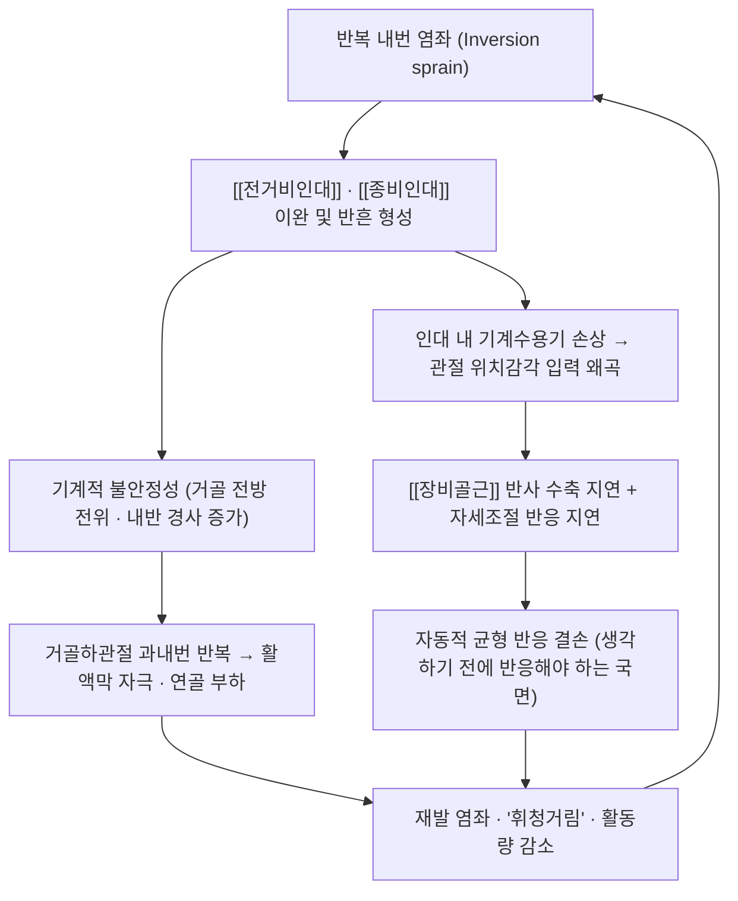

# 🩺 만성 발목 불안정증 (Chronic Ankle Instability, CAI)

> **핵심 3줄 요약 (Key Summary)**:
> - 📍 병소 부위 & 해부·병태생리: [[전거비인대]](ATFL)·[[종비인대]](CFL)의 반복 손상으로 남은 기계적 이완 + 관절·근육 기계수용기 손상에 따른 감각·운동조절 결손이 겹친 상태. 급성 염좌 환자의 상당수(문헌 최대 40% 수준)가 CAI로 이행한다.
> - 🚩 전형적 임상 양상: 초기 염좌 후 12개월 이상 지나도 반복되는 '접질림'과 주관적 불안정감(휘청거림), 계단·울퉁불퉁한 길에서의 자신감 저하, 반복 염좌, 활동량 감소.
> - 🛠️ 핵심 검사 & 치료 전략: 전방 서랍 검사·거골 경사 검사로 기계적 이완을, [[SEBT]]·한 발 서기·체중부하 런지(족배굴곡)로 기능 결손을 평가한다. 1차 치료는 균형·고유수용감각 훈련 + 비골근 근력운동이고, 재발 예방에는 보조기·테이핑 근거가 강하다. 한방에서는 대측·원위 [[균형침]]과 [[이중과제 훈련]] 병합이 최근 RCT로 보고됐다.
> - ⚠️ 응급 의뢰 레드플래그: 급성 외상 직후 골성 압통(오타와 발목 규칙 양성)·체중부하 불능·원위 경비인대결합 손상 의심(고위 염좌)이면 영상검사 우선. 만성이라도 관절 잠김·심부 통증이 있으면 거골 박리성 골연골염(OCD) 감별 위해 MRI 의뢰.

> 🖼️ 이미지 미확보 — ② 영상 소견(MRI·초음파) ④ 이학적 검사 시연(전방 서랍 검사) ⑤⑥ 술기 실사(침·약침 시술 장면)는 이번 회차 확보 실패. 확보분 4장(① 환부 실사 ③ 해부 도해 ③' 병기 일러스트 ⑦ 보조기 실사)만 수록했다.

---

## 📌 목차
1. [질환 개요 & 해부학적 병태생리](#1-질환-개요--해부학적-병태생리)
2. [병태생리 메커니즘 & 생체역학적 악순환 네트워크](#2-병태생리-메커니즘--생체역학적-악순환-네트워크)
3. [임상 증상 & 이학적 검사(Physical Exam) 알고리즘](#3-임상-증상--이학적-검사physical-exam-알고리즘)
4. [감별 진단 매트릭스 (Differential Diagnosis)](#4-감별-진단-매트릭스-differential-diagnosis)
5. [한의 통합 치료 프로토콜 (침·약침·추나·한약)](#5-한의-통합-치료-프로토콜-침약침추나한약)
6. [양방 치료 & 병용·의뢰 기준 (Conventional Treatment & Referral)](#6-양방-치료--병용의뢰-기준-conventional-treatment--referral)
7. [재활 운동 & 생활습관 티칭 가이드](#7-재활-운동--생활습관-티칭-가이드)
8. [💡 사용자 진료실 핵심 필기 & 임상 노하우](#8--사용자-진료실-핵심-필기--임상-노하우-melt-in-잔여-심화-집약)
9. [출처 및 학술 참고 문헌 (References)](#9-출처-및-학술-참고-문헌-references)

---

## 1. 질환 개요 & 해부학적 병태생리

![[만성발목불안정증_01_환부실사_급성부종반상출혈.jpg|450]]
> [그림 1: ① 환부 실사 — 우측 발목 외측 인대 파열 직후의 심한 부종과 광범위한 반상출혈. 이런 급성 내번 손상이 반복되면 만성 발목 불안정증의 출발점이 된다 (Wikimedia Commons, CC BY-SA 3.0, 촬영 Usien)]

만성 발목 불안정증(CAI)은 '염좌가 덜 아픈 상태'가 아니라 **손상 후 남은 별개의 임상 상태**다. 외측 발목 염좌는 스포츠 손상 중 가장 흔한데, 초기 염좌를 겪은 환자의 상당수가 12개월이 지나도 반복 염좌·불안정감·기능 저하를 호소한다. 국제 합의문(International Ankle Consortium)은 CAI 연구·임상 대상자를 다음 조건으로 정의했다 — ① 의미 있는 외측 발목 염좌 병력이 1회 이상 ② 그 염좌가 염증 증상(통증·부종)을 동반 ③ 초기 손상 후 **최소 12개월 경과** ④ 그 이후 반복 염좌 또는 '휘청거림(giving way)'이나 불안정감, 기능 저하가 지속.

![[만성발목불안정증_02_병기일러스트_외측인대손상단계.jpg|500]]
> [그림 2: ③' 병기 일러스트 — 정상 발목(1단)에서 외측 인대 손상이 경도·중등도·중증으로 진행하는 4단계. 손상 범위가 커질수록 거골의 전방 전위·내반 경사가 커진다 (Wikimedia Commons, CC BY-SA 3.0, Laboratoires Servier)]

- 질환 정의 및 분류
  - 기계적 불안정성(mechanical instability): 인대 이완·관절 역학 변화·활액 반응 등 **구조적** 원인. 전방 서랍 검사·거골 경사 검사에서 건측 대비 증가된 이완도로 확인한다.
  - 기능적 불안정성(functional instability): 구조적 이완이 뚜렷하지 않아도 **감각 입력·신경근 조절 결손**으로 반복 염좌와 '휘청거림'이 생기는 상태. 고유수용감각 저하·비골근 반응시간 지연·균형 결손이 축이다.
  - 임상에서는 두 요인이 거의 항상 겹친다 — 진료실에서는 '기계적이냐 기능적이냐'를 나누기보다 **어느 쪽 비중이 큰지**를 판단해 중재를 배분한다.
- 관련 해부학적 구조물
  - 골격 및 관절: [[비골]] 외과(외측 복사뼈)가 내측보다 길고 아래로 내려와 있어 내번 손상이 많다. [[거골]]과 [[종골]]이 만드는 거골하관절이 과회내·과내번을 보상한다.
  - 근육 및 근막: [[장비골근]]·[[단비골근]]이 외번을 담당하는 **동적 안정화 장치**다. CAI에서는 이 근육군의 반응시간 지연과 근력 저하가 반복 보고된다. 상부 사슬에서는 [[중둔근]]·[[대둔근]] 활성 패턴도 달라진다.
  - 신경 및 혈관: 외측 인대 복합체에 분포하는 기계수용기(러피니·파치니 소체)가 손상되면 관절 위치감각 입력이 왜곡된다. [[비골신경]]·[[천비골신경]] 주행 손상이 동반되면 족배부 감각 이상을 확인해야 한다.

---

## 2. 병태생리 메커니즘 & 생체역학적 악순환 네트워크

![[만성발목불안정증_03_해부도해_외측인대복합체.jpg|470]]
> [그림 3: ③ 해부 도해 — 발·발목 외측면의 인대 배치. 전거비인대(Anterior talofibular lig.)와 종비인대(Calcaneofibular lig.)가 외측 복사뼈를 중심으로 거골·종골을 잇는 구조가 명확히 표시되어 있다 (Sobotta 해부도, 퍼블릭 도메인)]

### 1) 해부학적·감각 기전
- 외측 인대 복합체의 이완은 거골의 전방 전위(ATFL)와 내반 경사(CFL)를 증가시켜 **관절 역학 자체를 바꾼다**.
- 동시에 인대 내 기계수용기 손상 → 관절 위치감각(joint position sense) 저하 → 비골근 반응시간 지연 → 손상 기전을 늦추지 못하는 악순환이 만들어진다.
- 즉 CAI의 결손은 '인대가 헐거운 것'과 '감각→운동 반응이 느린 것'의 **두 축**이며, 그래서 치료도 수동적 안정화(보조기)만으로는 부족하고 능동적 신경근 재교육이 필수다.

### 2) 생체역학적 연쇄 반응 (Kinetic Chain)
- 발목 → 무릎·고관절로 올라가는 보상: 착지 시 [[중둔근]] 약화로 골반이 내려가고 대퇴가 내전·내회전되면 발목 과내번 부하가 커진다.
- 보행 패턴 변화: 발목 족배굴곡 제한이 있으면 뒤꿈치 닿기 이후 체중 이동이 줄고 보행속도가 떨어진다. 반복 염좌 환자는 하루 보행량 자체가 줄어드는 악순환에 들어간다(활동량 감소 → 근력·감각 입력 추가 감소).

---

## 3. 임상 증상 & 이학적 검사(Physical Exam) 알고리즘

### 1) 주소증
- 반복 염좌: "자꾸 발목이 접질려요" — 특별한 외상 없이 평지·계단에서도 발생.
- 주관적 불안정감(giving way): 통증은 없는데 순간적으로 힘이 빠지고 발목이 꺾일 것 같은 느낌.
- 활동 위축: 운동·계단·울퉁불퉁한 길 회피. 만성화되면 통증보다 **자신감 저하**가 주 호소가 된다.
- 잔여 증상: 아침 첫 디딤의 뻣뻣함, 발목 바깥쪽의 둔한 통증, 족배굴곡 제한.

### 2) 필수 이학적 검사법
- [[전방 서랍 검사]](Anterior Drawer Test): 발목을 10~20° 족저굴곡한 상태에서 종골을 잡고 전방으로 견인 — [[전거비인대]] 이완 평가. 건측 대비 증가·부드러운 종말점이면 양성.
- [[거골 경사 검사]](Talar Tilt Test): 중립위에서 종골을 내번 — [[종비인대]] 이완 평가. 건측 대비 내번 각 증가면 양성.
- 체중부하 런지 검사(Weight-bearing Lunge Test): 무릎을 벽에 대고 발뒤꿈치를 든 채 최대 족배굴곡 거리 측정. **CAI에서 가장 실용적인 제한 지표**다.
- 한 발 서기(Single-leg Stance): 눈 뜨고/감고 30초 유지 가능 여부. 자세조절 결손을 즉시 보여준다.
- [[SEBT]]: 동적 균형의 표준 수행검사. 전방 도달거리의 좌우 차 4 cm 이상은 하지 손상 위험과 연관된다고 보고됐다(PMID 17193868).
- [[CAIT]](Cumberland 발목 불안정성 도구): 9문항·0~30점 자기보고 척도, 27점 이하면 불안정성 시사. 진단·분류의 표준 도구로 검증됐다(PMID 16935061). 이번 회차에는 개념 파일을 만들지 않고 본문 설명으로만 남긴다.

---

## 4. 감별 진단 매트릭스 (Differential Diagnosis)

| 감별 질환 | 호발 병소 및 원인 | 주소증 차이점 | 특이적 이학적 검사 소견 |
| :--- | :--- | :--- | :--- |
| [[만성 발목 불안정증]] (본 질환) | 외측 인대 복합체 이완 + 감각·조절 결손 | 반복 접질림, 불안정감, 활동 위축 | [[전방 서랍 검사]]·[[거골 경사 검사]] 이완도 증가, [[SEBT]] 전방 도달 저하 |
| 급성 [[발목 염좌]] | 내번 외력 직후 인대 신장·파열 | 수상 직후 부종·반상출혈·압통 | 급성기 검사는 통증으로 제한, 오타와 발목 규칙으로 골절 배제 |
| [[거골 골절]] — 박리성 골연골염(OCD) | 반복 미세 외상·골연골 손상 | 관절 잠김, 심부 통증, 붓기 반복 | 심부 압통, MRI에서 거골 돔 연골하 결손 |
| [[비골근 건병증]] | 비골근건의 과사용·아탈구 | 외과 후방 통증, 걸을 때 '뚝' 소리 | 비골근건 압통·아탈구 촉지 |
| [[제5발허리뼈 기저부 골절]] | 급격한 내번 시 단비골근 견인 | 발 외측연 통증 | 제5중족골 결절 골 타진통 양성 |

---

## 5. 한의 통합 치료 프로토콜 (침·약침·추나·한약)

- 침구 치료(Acupuncture)
  - 국소 취혈: 구허(GB40)·신맥(BL62)은 외측 인대 복합체 직상, 해계(ST41)·곤륜(BL60)은 전외측, 조해(KI6)는 내측 대칭점, 양릉천(GB34)·현종(GB39)은 하지 근·건 조절점으로 쓴다.
  - [[전침]]: 구허–신맥, 해계–곤륜 배합에 2 Hz 저주파 15~20분. 통증 역치 상향과 신경인성 부종 억제를 목표로 한다.
  - [[균형침]]: 2026-09-29 리뷰 1번에서 통상 재활에 추가해 보행·균형 지표를 더 끌어올린 대측·원위 자극 기법 — 완관절 주름 요측 1촌의 통증점에 20분 유침·주 6일·6주(PMID 42542908).
- 약침 치료(Pharmacopuncture)
  - 급성 부종·열감기에는 중성어혈·황련해독탕 약침을 외과 전하방에 피내·피하 분할 주입.
  - 만성 이완·재발기에는 [[신바로약침]]·[[봉약침]]을 인대 부착부에 심부 주입해 조직 재생·인장 강도 회복을 노린다 → [[약침]].
- 추나 치료(Chuna)
  - 급성기에는 내번·비틀림 교정 금기. 아급성기 이후 족관절 견인 상태에서 거골을 후방으로 미는 **거골 후방 활주**로 족배굴곡 제한을 회복시킨다.
- 한약 치료(Herbal Medicine)
  - 급성 어혈기: 당귀수산 가미(도인·홍화 증량).
  - 만성 이완·불안정기: [[독활기생탕]] 가미(속단·두충·구척)로 결합조직 강화와 재발 방지를 노린다.

---

## 6. 양방 치료 & 병용·의뢰 기준 (Conventional Treatment & Referral)

![[만성발목불안정증_04_보조기착용_실사.jpg|450]]
> [그림 4: ⑦ 보조기 실사 — 좌측 발목에 착용한 스트랩형 발목 보조기(Aircast®). 반복 염좌 예방에서 보조기·테이핑의 근거가 강하며, 실내·실외 활동 시 착용을 지도한다 (Wikimedia Commons, CC BY-SA 4.0)]

- 약물 치료(Medication)
  - [[비스테이로이드성 소염진통제]]는 급성 염좌기 통증·부종 조절 목적으로 단기 사용한다. 만성 불안정증 자체에는 장기 복용 근거가 없다.
- 비약물 시술(Procedures)
  - 보조기·테이핑: 재발 예방에서 근거가 강한 항목이다. 레이스업형 보조기를 선호하며, 염좌 후 최대 6개월~1년 착용이 권고된다.
  - 체계적 재활 운동: 균형·고유수용감각 훈련 + 비골근·족배굴곡근 근력운동이 1차 치료다.
- 수술 적응증(Surgical Indication)
  - 3~6개월 이상의 적절한 비수술 치료에도 '휘청거림'과 불안정성이 지속되고 영상·이학적 검사에서 CAI가 확인되면 변형 브로스트롬-굴드 술식 등 외측 인대 봉합·재건을 고려한다.
- 한의 병용 판단
  - 침·약침·부항은 보조기·운동치료와 병용 가능. 단 시술 직후 통증이 사라졌다고 격렬한 보행·운동을 재개하면 미세 유합 중인 조직이 재손상되므로 **시술 후 3일간 보호대 착용과 부하 제한**을 함께 지도한다.
- 전문과 의뢰 기준
  - 급성 외상 + 골성 압통(오타와 규칙 양성) → 영상검사.
  - 만성이라도 관절 잠김·심부 통증 지속 → 거골 OCD 감별 위해 MRI.
  - 6개월 이상 재활에도 불안정 지속 → 정형외과(족부·발목) 의뢰.

---

## 7. 재활 운동 & 생활습관 티칭 가이드

- 1단계 | 통증·부종 조절기
  - 부드러운 범위의 발목 펌프·알파벳 쓰기로 가동성 유지, 통증 허용 범위에서 체중부하 시작.
- 2단계 | 근력 (비골근·족배굴곡근)
  - 세라밴드 외번 운동: 15회 × 3세트, 통증 없이 가능하면 저항 상향.
  - 뒤꿈치 들기: 양발 → 한발 → 계단 모서리 → 무게 부하 순으로 진행(6~12회 × 3~4세트).
- 3단계 | 균형·고유수용감각
  - 한 발 서기(눈 뜨고 60초 × 3세트 → 눈 감고), 쿠션·폼패드에서 동일 과제, 손으로 무게 옮기기 같은 **자기 교란(self-perturbation)** 추가.
- 4단계 | 이중과제·기능 복귀
  - [[이중과제 훈련]]: 음악·화면 게임 등 인지 과제를 병행해 '생각하지 않는' 자동 반응을 훈련한다. 2026-09-29 리뷰 1번의 병합군 설계가 이 구조다.
  - 방향 전환·홉·착지 훈련으로 스포츠 복귀 단계로 진행.
- 재평가 지표
  - [[SEBT]](전방·후내·후외 도달거리, 좌우 차), 한 발 서기 시간, 체중부하 런지 거리, 보행속도·보행률. SEBT는 정상화(%) 기준으로 **전방 5.87% · 후내 7.84% · 후외 7.55%** 이상 변화면 측정오차를 넘는 실제 변화로 본다(PMID 31598406).
- 생활습관
  - 울퉁불퉁한 길·계단에서는 보조기 착용, 신발은 뒤꿈치가 안정된 것을 권한다. 재발이 잦으면 체중·보행량 관리도 함께 다룬다.

---

## 8. 💡 사용자 진료실 핵심 필기 & 임상 노하우 (Melt-In 잔여 심화 집약)

- **"이미 아픈 데가 아니라 '안 꺾이는 회로'를 다시 만드는 치료"라고 설명하라**: CAI 환자는 통증이 거의 없어 치료 동기가 약하다. "인대가 늘어난 것도 문제지만, 발목이 꺾이려는 순간 반응하는 반사가 느려진 게 더 큰 문제입니다. 침은 그 감각 입력을 정리하고, 훈련은 반응 속도를 되돌립니다"라고 프레임을 잡으면 순응도가 올라간다.
- **대측 완관절을 잡는 손이 곧 진단 도구다**: 균형침은 환측 반대편 완관절 주름에서 요측 1촌 부위의 압통점을 찾아 자침한다. 이때 압통이 뚜렷한 지점을 잡는 것이 득기의 출발이며, 자침 후 환자에게 "발목이 가벼워졌다"는 반응이 오면 그 세션에서 곧바로 균형·보행 훈련으로 이어 붙이는 것이 효과적이다.
- **훈련은 치료 직후에 붙여라**: 침·약침 직후 통증 역치가 올라간 창을 이용해 이중과제·균형 훈련을 같은 세션에 붙인다. 이 순서는 원문(2026-09-29 리뷰 1번)이 시술 15분 + 훈련 30분으로 배분한 구조와도 일치한다.
- **재발 환자에게는 '숫자'로 보여줘라**: SEBT 전방 도달거리와 보행속도를 4주마다 재서 카드에 적어주면, 통증이 없어도 개선을 체감한다. 2026-09-29 시험에서 보행속도 0.37 m/s 개선이 병합군의 핵심 성과였다.
- **절대 하지 말 것**: 시술 직후 통증 소실을 근거로 격렬한 보행·스포츠 복귀를 허락하는 것. 그리고 시험 혈위를 특정 경혈로 치환해 "그 혈자리에 근거가 있다"고 말하는 것 — 원문은 경혈명을 특정하지 않았다.

---

## 9. 출처 및 학술 참고 문헌 (References)

- Gribble PA, Delahunt E, Bleakley C, et al. Selection criteria for patients with chronic ankle instability in controlled research: a position statement of the International Ankle Consortium. *J Orthop Sports Phys Ther*. 2013;43(8):585-591. [PubMed (PMID 23902805)](https://pubmed.ncbi.nlm.nih.gov/23902805/)
  - [연구 요약] CAI 연구 대상자 선정 기준(반복 염좌 병력·염증 동반·12개월 경과·불안정감/기능저하)을 국제 합의로 통일한 문서로, 진료실에서도 '이 환자를 CAI로 부를 조건'을 판단하는 기준점이 된다.
- Liu N, Wang M, Meng Q, et al. Comparative efficacy of conventional rehabilitation, balance acupuncture combined with conventional rehabilitation and additional unconscious proprioception training for chronic ankle instability: a randomized-controlled clinical trial. *Jt Dis Relat Surg*. 2026;37(3):637-648. [PubMed (PMID 42542908)](https://pubmed.ncbi.nlm.nih.gov/42542908/)
  - [연구 요약] CAI 120명 3군 RCT. 6주 후 보행·균형·SEBT 개선 폭이 병합군 > 균형침군 > 대조군 순(p<0.05), 이상반응 0건. 다만 병합군 총 중재시간(85분)이 다른 군(60분)보다 길어 총량 효과와 특이적 상승작용을 분리할 수 없다는 한계를 저자가 명시했다.
- Hiller CE, Refshauge KM, Bundy AC, Herbert RD, Kilbreath SL. The Cumberland ankle instability tool: a report of validity and reliability testing. *Arch Phys Med Rehabil*. 2006;87(9):1235-1241. [PubMed (PMID 16935061)](https://pubmed.ncbi.nlm.nih.gov/16935061/)
  - [연구 요약] CAIT 9문항·0~30점 척도의 타당도·신뢰도를 검증한 원논문. 27점 이하를 불안정성 기준으로 제시해 진료실 선별과 추적에 바로 쓸 수 있다.
- Pierobon A, Raguzzi IA, Soliño S, et al. Minimal detectable change and reliability of the star excursion balance test in patients with lateral ankle sprain. *Physiother Res Int*. 2020;25(4):e1850. [PubMed (PMID 32458531)](https://pubmed.ncbi.nlm.nih.gov/32458531/)
  - [연구 요약] 외측 발목 염좌 환자군에서 SEBT의 신뢰도와 최소검출변화(MDC)를 산출한 연구로, CAI·염좌 환자 추적에서 '의미 있는 변화'를 판정할 때 병리군 기준값을 제공한다.
- Plisky PJ, Rauh MJ, Kaminski TW, Underwood FB. Star Excursion Balance Test as a predictor of lower extremity injury in high school basketball players. *J Orthop Sports Phys Ther*. 2006;36(12):911-919. [PubMed (PMID 17193868)](https://pubmed.ncbi.nlm.nih.gov/17193868/)
  - [연구 요약] SEBT 전방 도달거리의 좌우 차 4 cm 이상이 하지 손상 위험과 연관됨을 보고한 선구적 연구로, 진료실에서 좌우 비대칭을 해석하는 기준이 된다.
- Powden CJ, Dodds TK, Gabriel EH. The reliability of the star excursion balance test and lower quarter Y-balance test in healthy adults: a systematic review. *Int J Sports Phys Ther*. 2019;14(5):683-694. [PubMed (PMID 31598406)](https://pubmed.ncbi.nlm.nih.gov/31598406/)
  - [연구 요약] SEBT·YBT의 검사자 간/내 신뢰도가 우수함(ICC 0.87~0.90, Grade A)을 정리하고 방향별 MDC(정상화 % 기준 전방 5.87 · 후내 7.84 · 후외 7.55)를 제시했다. 반복 측정의 해석 기준으로 쓴다.
- Zhang J, et al. Effect of strength training with additional acupuncture on balance, ankle sensation, and isokinetic muscle strength in chronic ankle instability among college students. *Front Physiol*. 2024;15:1324924. [PubMed (PMID 38645693)](https://pubmed.ncbi.nlm.nih.gov/38645693/)
  - [연구 요약] 대학생 CAI에서 근력훈련 단독 대 근력훈련 + 침(태계 KI3·곤륜 BL60, 10~15분, 주 3회 × 8주)을 비교한 RCT. 침 병행군에서 전후방 균형·족배굴곡·족저굴곡 근력과 운동감각이 더 개선되어, 국소 혈위 자극 병행의 근거를 보탠다.

---

## 관련 노트
- [[발목 염좌]] — 급성 염좌의 진단·치료(오타와 규칙·PRICE/POLICE·약침·추나)
- [[전거비인대]] · [[종비인대]] · [[후거비인대]] · [[삼각인대]]
- [[장비골근]] · [[단비골근]] · [[중둔근]] · [[거골]] · [[종골]] · [[비골]]
- [[SEBT]] · [[CAIT]] · [[고유수용감각]] · [[균형침]] · [[이중과제 훈련]]
- [[2026-09-29_근골격계-사지말초_심층리뷰]] 1번 · [[2026-09-29_근골격계-사지말초_개념학습]]
