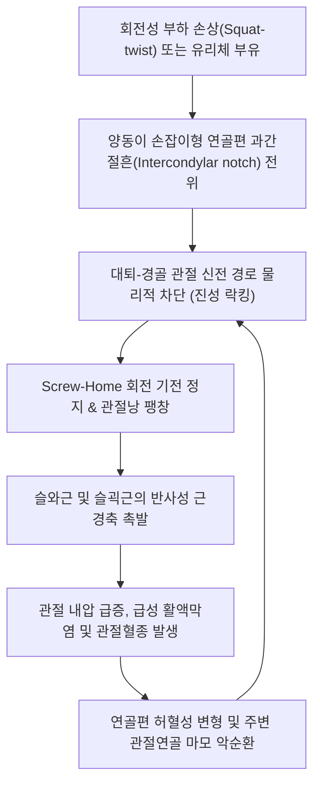

# 🩺 무릎 락킹 증후군 (Locked Knee Syndrome)

> **핵심 3줄 요약 (Key Summary)**:
> - 📍 **병소 부위 & 해부·병태생리**: 슬관절 대퇴-경골 관절강(Tibiofemoral joint) 내에 **양동이 손잡이형 반월상연골 파열편(Bucket-handle meniscal tear)**, **관절 내 유리체(Loose body, 관절쥐)**, 또는 단절된 전방십자인대 단구가 과간절흔(Intercondylar notch) 사이에 물리적으로 감입되어 무릎의 완전 신전을 기계적으로 차단(Mechanical block)하는 응급 정형외과적 병태.
> - 🚩 **전형적 임상 양상**: 무릎이 굽혀진 상태에서 갑자기 굳어 **마지막 10°~30°의 신전이 단단한 고무줄 탄력성 저항(Springy block)과 함께 불가능**해지는 급성 신전 장애. 동통성 관절선 압통 및 관절혈종(Hemarthrosis)에 의한 급속한 종창.
> - 🛠️ **핵심 검사 & 치료 전략**: 진성 락킹(기계적 감입)과 가성 락킹(통증/햄스트링 경축)의 감별. 과도한 강제 신전 금기. 경골 축방향 견인 및 미세 회전을 통한 비침습적 도수 정복(Reduction), 슬안(내·외슬안) 자침 및 약침을 통한 활액막 부종 감압. 도수 정복 실패 또는 파열편 전위 시 조기 관절경적 봉합술 의뢰.
> - ⚠️ **응급 의뢰 레드플래그**: 도수 정복이 불가능한 급성 진성 락킹(연골 파열편의 혈행 차단 및 영구 변형 위험), 슬와동맥 또는 비골신경 마비 징후(발목 족배굴곡 마비, 족배부 감각 소실), 박리성 골연골염의 대형 골연골편 감입.

---

## 📌 목차
1. [질환 개요 & 해부학적 병태생리](#1-질환-개요--해부학적-병태생리)
2. [병태생리 메커니즘 & 생체역학적 악순환 네트워크](#2-병태생리-메커니즘--생체역학적-악순환-네트워크)
3. [임상 증상 & 이학적 검사(Physical Exam) 알고리즘](#3-임상-증상--이학적-검사physical-exam-알고리즘)
4. [감별 진단 매트릭스 (Differential Diagnosis)](#4-감별-진단-매트릭스-differential-diagnosis)
5. [한의 통합 치료 프로토콜 (침·약침·추나·한약)](#5-한의-통합-치료-프로토콜-침약침추나한약)
6. [양방 치료 & 병용·의뢰 기준 (Conventional Treatment & Referral)](#6-양방-치료--병용의뢰-기준-conventional-treatment--referral)
7. [재활 운동 & 생활습관 티칭 가이드](#7-재활-운동--생활습관-티칭-가이드)
8. [💡 사용자 진료실 핵심 필기 & 임상 노하우 (Melt-In 잔여 심화 집약)](#8--사용자-진료실-핵심-필기--임상-노하우-melt-in-잔여-심화-집약)
9. [출처 및 학술 참고 문헌 (References)](#9-출처-및-학술-참고-문헌-references)

---

## 1. 질환 개요 & 해부학적 병태생리

**무릎 락킹 증후군(Locked Knee Syndrome)**은 슬관절(Knee joint)이 특정 각도에서 고정되어 능동적 또는 수동적으로 완전한 폄(신전, Extension)이 이루어지지 않는 기계적 기능 장애를 지칭한다. 임상적으로는 관절강 내부의 물리적 구조물 끼임에 의한 **진성 락킹(True mechanical locking)**과, 극심한 통증 및 근경련에 의한 **가성 락킹(Pseudo-locking)**으로 대별된다.

![[Meniscus_tear_types.svg]]
> [그림 1: ① 병태해부 — 무릎 락킹을 유발하는 양동이 손잡이형(Bucket-handle) 파열 등 반월상연골 파열 형태 도해]

진성 락킹의 약 70~80%는 **[[반월상연골 파열]](Meniscal tear)**, 특히 세로 파열편이 중앙 과간절흔(Intercondylar notch)으로 뒤집혀 전위되는 **양동이 손잡이형 파열(Bucket-handle tear)**에 의해 발생한다. 정상적인 슬관절 신전 시 대퇴과(Femoral condyle)는 경골 고평부 위에서 구름(Rolling)과 활주(Gliding)를 동시에 수행하며 마지막 5° 신전 시 대퇴골의 내회전(Screw-home mechanism)이 완결되어야 한다. 그러나 전위된 파열편이나 유리체가 과간 공간에 쐐기처럼 박히면 이 회전-신전 기전이 물리적으로 차단된다.

![[Tear_of_medial_meniscus.jpg]]
> [그림 2: ① 수술 소견 — 내측 대퇴과와 경골 고평부 사이에 감입되어 관절 신전을 차단하는 내측 반월상연골 파열편]

- **주요 병인**:
  1. **양동이 손잡이형 반월상연골 파열**: 주로 내측 반월판(Medial meniscus)에서 3배 이상 호발.
  2. **관절강 내 유리체(Loose body, 관절쥐)**: [[박리성 골연골염]](Osteochondritis Dissecans), 활막 연골종증, 퇴행성 골극 파편.
  3. **전방십자인대(ACL) 단구 감입**: 파열된 ACL 인대 그루터기가 과간절흔에 끼임.
  4. **슬개골 아탈구/탈구 및 추벽(Plica) 비후**.

---

## 2. 병태생리 메커니즘 & 생체역학적 악순환 네트워크

슬관절 내 전위된 연골편은 관절낭의 팽창과 기계적 수용체 자극을 유도하여 햄스트링(Hamstring) 및 슬와근(Popliteus muscle)의 반사적 보호성 경축(Protective muscle spasm)을 유발한다.

![[MRI_on_tear_of_meniscus.jpg]]
> [그림 3: ① 영상 병태 — 과간절흔(Intercondylar notch) 내로 전위된 반월상연골 파열편의 이중 후십자인대 징후(Double PCL sign) MRI]

![[박리성골연골증_슬관절_MRI_시상면_T2_소견.jpg]]
> [그림 4: ① 영상 감별 — 관절 내를 부유하며 기계적 락킹을 유발하는 유리체(Loose body) 및 박리성 골연골증 슬관절 MRI]

연골편이 감입된 상태에서 체중 부하를 가하거나 억지로 다리를 펴려고 시도하면, 감입된 연골 조직에 지속적인 압박 허혈(Ischemia)과 변형이 발생하여 자발 정복이 불가능해지며, 대퇴과 관절연골의 2차적인 국소 함몰 및 박리 손상을 가속화한다.

---

## 3. 임상 증상 & 이학적 검사(Physical Exam) 알고리즘

### 임상 증상
- **돌발적 신전 불능**: 쪼그려 앉았다가 일어서거나 회전하는 순간 '뚝'하는 파열음과 함께 무릎이 완전히 펴지지 않음 (보통 20°~45° 굴곡 상태로 고정).
- **탄력성 저항감(Springy Block)**: 굴곡은 환자가 통증을 참으며 어느 정도 가능하나, 끝 신전 시 뼈와 뼈가 부딪히는 느낌이 아니라 질긴 고무가 걸린 듯 튕겨 나오는 탄력성 저항이 확인됨.
- **급성 관절 종창(Effusion/Hemarthrosis)**: 손상 후 수 시간 내에 슬관절 내 관절액 또는 혈종이 차올라 슬개골 부유 검사(Patellar tap test) 양성.

### 이학적 검사 알고리즘

![[맥머레이검사_1단계_최대굴곡_관절선촉진_실사.jpg]]
> [그림 5: ② 이학적 검사 — 슬관절을 최대 굴곡하고 관절선 압통을 촉진하며 시작하는 맥머레이 검사(McMurray test) 실사]

![[맥머레이검사_2단계_회전및스트레스_신전유발_실사.jpg]]
> [그림 6: ② 이학적 검사 — 경골 회전 및 외반/내반 스트레스를 가하며 신전시켜 락킹 및 덜컥거림을 유발하는 검사 실사]

1. **신전 말기 탄력성 저항 평가 (Springy Extension Block Test)**:
   - 앙와위에서 대퇴골을 지지하고 발목을 들어 올려 무릎을 펼 때 완전 신전(0°) 도달 여부 평가. 단단한 탄력성 저항 시 진성 락킹 확진.
2. **관절선 압통(Joint Line Tenderness)**:
   - 내측 또는 외측 관절열(Joint line)을 따라 극심한 국소 압통 존재 (민감도 80% 이상).
3. **[[맥머레이 검사]](McMurray Test)**:
   - 완전 락킹 상태에서는 무리하게 시행하지 않으나, 불완전 락킹이나 정복 후 검사 시 경골 외회전-외반(내측 반월판) 또는 내회전-내반(외측 반월판) 신전 시 통증과 함께 '덜컥(Click)'거리는 탄발음 확인.
4. **라크만 검사(Lachman Test)**:
   - 전방십자인대 동반 손상 및 ACL 단구 감입 여부 감별.

---

## 4. 감별 진단 매트릭스 (Differential Diagnosis)

![[슬관절_연부조직_통증부위_도해.svg]]
> [그림 7: ① 해부 감별 — 진성 락킹(반월판·유리체)과 가성 락킹(슬개대퇴·측부인대·활액막염)의 통증 부위 도해]

| 구분 | 진성 락킹 (True Locking) | 가성 락킹 (Pseudo-Locking) | 관절강 내 유리체 (Loose Body) | 급성 슬개골 탈구 (Patellar Dislocation) |
| :--- | :--- | :--- | :--- | :--- |
| **원인 병리** | 양동이 손잡이형 반월상연골 파열편 끼임 | 통증 및 햄스트링/사두근 반사성 경축 | 박리성 골연골염, 연골 파편 부유 | 슬개골의 외측 지대 파열 및 외측 활주 고정 |
| **신전 장애 특성** | **기계적 탄력성 저항(Springy block)**, 항상 일정 각도 | 통증으로 인한 수의적 방어, 서서히 펴짐 | **락킹 각도가 매번 바뀜(간헐적 락킹)** | 슬개골이 외측으로 완전히 튀어나와 관절 변형 |
| **병력 및 양상** | 쪼그려 앉다 회전 손상 후 지속 고정 | 타박, 급성 염좌, 과다 삼출액 | 평소 무릎 속에서 돌아다니는 느낌 | 외측 충격 또는 점프 착지 시 외측 전위 |
| **해결 방식** | **도수 정복 또는 관절경 수술** | 진통 소염, 국소 마취 시 관절 신전 가능 | 관절경적 유리체 제거술 | 슬개골 내측 도수 정복 |

---

## 5. 한의 통합 치료 프로토콜 (침·약침·추나·한약)

![[무릎염좌_05_술기실사_측부인대_자침치료.jpg]]
> [그림 8: ③ 한의 시술 — 슬안 및 무릎 주변 경혈 자침을 통해 슬관절낭 부종을 감압하고 근경련을 해소하는 침치료 실사]

### 슬관절 비침습적 도수 정복 추나 (Reduction Maneuver)
- **적응증**: 외상 후 수 시간 이내의 급성 진성 락킹으로 연골편의 영구적 변형이 일어나기 전 단계.
- **도수 기법**:
  1. 환자를 앙와위로 눕히고 조수를 통해 대퇴부를 안정적으로 고정함.
  2. 시술자는 환자의 발목과 경골 근위부를 부드럽게 파지하고, 축방향 견인(Axial traction)을 가하면서 무릎을 90° 이상 굴곡시킴.
  3. 경골을 부드럽게 내회전 및 외회전 교대 회전(Oscillatory rotation)시키며 관절강 유격을 넓혀 파열편이 과간절흔에서 외측 본래 위치로 빠져나오도록 유도.
  4. 파열편이 미끄러져 제자리로 환원되면 '딸깍'하는 느낌과 함께 완전 신전이 통증 없이 회복됨. **(절대 무리한 강제 신전 금기)**

### 침구 및 약침 치료
- **주요 혈위**: [[독비]](ST35, 외슬안), [[내슬안]](EX-LE4), [[양릉천]](GB34), [[음릉천]](SP9), [[혈해]](SP10), [[위중]](BL40).
- **자침 기법**: 슬안혈을 통해 관절강 인접부 활액막으로 침을 사자하여 관절내압을 분산시키고, 위중 및 슬와근 압통점에 전침(2Hz)을 적용하여 햄스트링의 경련성 단축을 즉각 해제함.
- **약침 치료**:
  - 급성 부종기: **황련해독탕 약침** 또는 **소염 약침**을 슬개하 지방체 및 관절선 압통부에 주입하여 혈종 흡수 및 활액막염 진정.
  - 정복 후 안정기: **신바로 약침** 또는 **자하거 약침**으로 미세 파열된 연골연과 인대의 회복을 유도.

### 한약 치료 (Herbal Medicine)
- **급성 어혈종창기**: **[[당귀수산]]**, **활혈소종탕(活血消腫湯)**. 관절 내 혈종과 부종을 신속 흡수하고 순환 장애 개선.
- **만성 연골 손상기**: **[[독활기생탕]]**, **대방풍탕(大防風湯)** 가감. 관절 연골의 퇴행성 마모를 지연시키고 하지 근력을 보강.

---

## 6. 양방 치료 & 병용·의뢰 기준 (Conventional Treatment & Referral)

### 양방 치료 프로토콜
- **관절강 내 천자(Arthrocentesis)**: 혈관절증(Hemarthrosis)으로 슬관절 내압이 극도로 높을 경우 18G 바늘로 관절액을 흡인하여 통증을 즉각 경감시키고 가성 락킹 요소를 배제함.
- **수술적 치료 (Surgical Indication — 관절경 수술)**:
  - **응급/준응급 수술 적응증**: 도수 정복에 실패하여 무릎이 펴지지 않는 지속적 진성 락킹 환자 (손상 후 1~2주 이내 조기 관절경 수술 권장).
  - 연골편이 과간 공간에 장시간 끼여 있으면 연골이 짓눌려 변형(Plastic deformation)되므로 복원 봉합술이 불가능해지고 부분 절제술을 해야 하는 위험이 급증함.
  - **수술 기법**: 혈류 공급이 양호한 Red-Red 또는 Red-White 구역 파열은 **관절경적 연골 봉합술(All-inside or Inside-out repair)**, 무혈관대 파열이나 분쇄 파열은 **부분 절제술(Partial meniscectomy)** 시행.

### 한의 병용 및 의뢰 기준
- **수술 후 한의 재활 병용**: 관절경 봉합술 후 4~6주간의 보조기 고정 기간 동안 대퇴사두근 위축 방지를 위한 침치료 및 신바로 약침, 관절 연골 회복 한약 투여가 매우 유효함.
- **응급 의뢰 트리거 (Red Flags)**:
  1. 도수 정복 시도에도 전혀 정복되지 않는 완전 신전 제한 진성 락킹.
  2. 족배동맥 맥박 소실 또는 족관절 마비(슬와동맥/신경 동반 손상 의심).
  3. 관절 흡인액에서 농성 삼출액이 확인되는 화농성 관절염.

---

## 7. 재활 운동 & 생활습관 티칭 가이드

1. **초기 안정 및 고정 (RICE)**:
   - 정복 성공 후 1~2주간은 경첩 보조기(Hinged knee brace)를 착용하여 과도한 회전 및 깊은 굴곡을 제한.
2. **대퇴사두근 등척성 강화 (Quad Setting)**:
   - 앙와위에서 무릎 밑에 수건을 말아 넣고 무릎으로 수건을 바닥 쪽으로 5~10초간 강하게 누르는 등척성 수축 운동 (1일 3회, 세트당 20회). 관절 운동 없이 허벅지 앞쪽 근육 위축을 차단.
3. **직거상 운동 (Straight Leg Raise, SLR)**:
   - 발목을 족배굴곡한 상태에서 다리를 무릎을 편 채로 45도 들어 올려 5초간 유지.
4. **금기 동작**:
   - 쪼그려 앉기, 양반다리(가부좌), 무릎 꿇기, 급격한 방향 전환 스포츠(축구, 농구) 3개월간 엄격 금지.

---

## 8. 💡 사용자 진료실 핵심 필기 & 임상 노하우 (Melt-In 잔여 심화 집약)

- **절대 무리한 강제 신전 금기**: 락킹 환자가 내원했을 때 다리를 억지로 펴려고 강하게 누르면 감입된 반월상연골이 찢어지며 전층 절단되거나 대퇴과 연골이 파인다. 정복은 반드시 '견인과 회전 유동'으로 유도해야 한다.
- **가성 락킹의 1초 감별**: 환자가 아파서 못 펴는 것인지 연골이 끼인 것인지 헷갈릴 때는, 슬와근과 햄스트링 건 부착부(위중, 곡천, 음곡)에 약침이나 침치료를 시행하고 얼음찜질을 10분간 적용해 본다. 근긴장이 풀리면서 서서히 펴지면 가성 락킹이고, 통증이 줄어도 끝에서 '딱'하고 튕겨 나오면 진성 락킹이다.
- **정복 성공 후의 환자 티칭**: 정복 소리와 함께 무릎이 펴졌다고 해서 파열된 연골이 붙은 것은 아니다. 파열편이 제자리로 돌아간 상태일 뿐이므로, 즉시 보조기를 채우고 정밀 MRI 검사를 받도록 지도해야 한다.

---

## 9. 출처 및 학술 참고 문헌 (References)

1. Shakshak M, et al. (2026). Outcomes of Combined All-Inside With Inside-Out or Outside-In Versus Inside-Out Meniscal Repair Techniques for Bucket-Handle Meniscal Tear. *Am J Sports Med*, 54(1):112-120. [PMID 41694996](https://pubmed.ncbi.nlm.nih.gov/41694996/)

2. Salleh MF, et al. (2024). Double Trouble: A Case Report of a Locked Knee Due to a Loose Body and a Degenerative Osteophyte. *Cureus*, 16(2):e53874. [PMID 38465033](https://pubmed.ncbi.nlm.nih.gov/38465033/)

3. Wong KC, et al. (2023). Popliteus Tendon Injury: A Rare Cause of Acute Locked Knee. *Cureus*, 15(5):e39626. [PMID 37288232](https://pubmed.ncbi.nlm.nih.gov/37288232/)

---

## 관련 노트
- [[반월상연골 파열]]
- [[박리성 골연골염]]
- [[슬관절 전방십자인대 손상]]
- [[맥머레이 검사]]
- [[슬관절 활액낭염]]
- [[당귀수산]]
- [[독활기생탕]]
