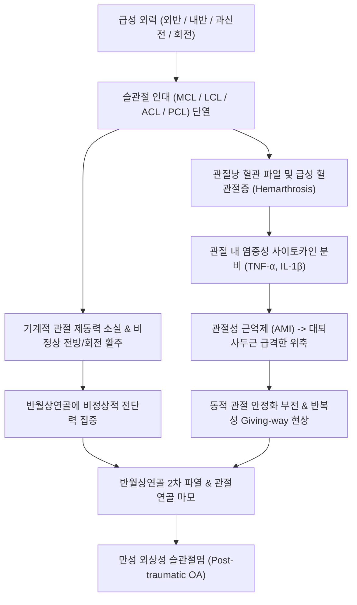

# 🩺 무릎 염좌 (Knee Sprain / Collateral & Cruciate Ligament Sprain)

> **핵심 3줄 요약 (Key Summary)**:
> - 📍 **병소 부위 & 해부·병태생리**: 슬관절을 안정화하는 주요 4대 인대(내측측부인대 MCL, 외측측부인대 LCL, 전방십자인대 ACL, 후방십자인대 PCL) 및 관절낭의 과신전, 외반(Valgus)/내반(Varus) 비틀림 외력에 의한 섬유 파열 및 불안정증.
> - 🚩 **전형적 임상 양상**: 수상 순간의 '뚝' 하는 파열음(Popping sound), 2~4시간 내 관절강 내 급속한 혈관절증(Hemarthrosis) 및 종창, 관절선 압통 및 보행 시 무릎이 덜컹거리거나 힘이 빠지는 'Giving way' 현상.
> - 🛠️ **핵심 검사 & 치료 전략**: 라크만 검사(Lachman test), 외반/내반 스트레스 검사, 전·후방 서랍 검사를 통한 손상 인대 선별. Grade I~II는 힌지형 보조기(Knee brace) 착용 하 침·약침(신바로·중성어혈) 및 한약(당귀수산·독활기생탕)을 병용한 조기 보존 치료; Grade III 완전 파열 및 다발성 인대 복합 손상은 수술적 재건술 의뢰.
> - ⚠️ **응급 의뢰 레드플래그**: 무릎 관절 탈구를 동반한 다발성 인대 파열, 슬와동맥(Popliteal artery) 손상에 따른 족배동맥 박동 소실 및 하지 창백·냉감, 총비골신경(Peroneal nerve) 손상으로 인한 족하수(Foot drop) 관찰 시 즉각 응급실 의뢰.

---

## 📌 목차
1. [질환 개요 & 해부학적 병태생리](#1-질환-개요--해부학적-병태생리)
2. [병태생리 메커니즘 & 생체역학적 악순환 네트워크](#2-병태생리-메커니즘--생체역학적-악순환-네트워크)
3. [임상 증상 & 이학적 검사(Physical Exam) 알고리즘](#3-임상-증상--이학적-검사physical-exam-알고리즘)
4. [감별 진단 매트릭스 (Differential Diagnosis)](#4-감별-진단-매트릭스-differential-diagnosis)
5. [한의 통합 치료 프로토콜 (침·약침·추나·한약)](#5-한의-통합-치료-프로토콜-침약침추나한약)
6. [양방 치료 & 병용·의뢰 기준 (Conventional Treatment & Referral)](#6-양방-치료--병용의뢰-기준-conventional-treatment--referral)
7. [재활 운동 & 생활습관 티칭 가이드](#7-재활-운동--생활습관-티칭-가이드)
8. [💡 사용자 진료실 핵심 필기 & 임상 노하우 (Melt-In 잔여 심화 집약)](#8--사용자-진료실-핵심-필기--임상-노하우-melt-in-잔여-심화-집약)
9. [출처 및 학술 참고 문헌 (References)](#9-출처-및-학술-참고-문헌-references)

---

## 1. 질환 개요 & 해부학적 병태생리

무릎 염좌(Knee Sprain)는 무릎 관절(슬관절)을 지지하는 정적 안정성 구조물인 인대(Ligaments)가 생리적 가동 범위를 초과하는 외력에 의해 늘어나거나 부분 또는 완전 단열된 병태를 총칭한다. 슬관절은 해부학적으로 대퇴골(Femur)과 경골(Tibia)의 관절면 접촉이 평탄하여 뼈 자체의 골성 안정성(Bony stability)이 낮고, 인대 복합체와 관절와순(반월상연골), 주변 동적 건-근육군에 전적으로 의존하는 구조를 갖는다.

![[전방십자인대_파열병태_3D일러스트.jpg]]
> [그림 1: ① 병태생리·영상 — 슬관절 전방 변위 및 회전 불안정성을 초래하는 전방십자인대 파열 병태 도해 (Simbio Archive)]

무릎 인대 손상은 손상된 구조물에 따라 다음과 같이 구분된다:
1. **[[내측측부인대]](Medial Collateral Ligament, MCL) 손상**: 가장 흔한 무릎 염좌(전체의 약 40%)로, 무릎 외측에서 내측으로 가해지는 외반력(Valgus force)이나 외회전 스트레스에 의해 발생한다. 표층(Superficial) 및 심층(Deep) 인대로 구성되며, 혈류 공급이 양호하여 Grade I~II의 경우 보존적 치료로 90% 이상 완치된다(Bianco et al., 2023).
2. **[[전방십자인대]](Anterior Cruciate Ligament, ACL) 손상**: 감속, 방향 전환, 점프 후 착지 등 비접촉성 회전 손상(Non-contact twisting)으로 호발한다. 경골의 전방 전위 및 내회전을 제한하는 핵심 구조물로, 파열 시 관절 내 출혈(혈관절증)을 초래하며 관절염 진행 위험이 높다(Liu et al., 2026).
3. **[[후방십자인대]](Posterior Cruciate Ligament, PCL) 손상**: 굴곡된 무릎 상태에서 경골 전면에 강한 충격이 가해지는 '대시보드 손상(Dashboard injury)'이나 과신전(Hyperextension) 손상으로 발생한다.
4. **[[외측측부인대]](Lateral Collateral Ligament, LCL) 및 후외측 회전 복합체(PLC) 손상**: 내반력(Varus force)에 의해 발생하며, 단독 손상은 드물고 십자인대 손상이나 비골신경 손상을 흔히 동반한다.

임상적 중증도 분류(AMA Standard):
- **Grade 1 (경도 염좌)**: 인대 섬유의 미세 단열(Micro-tearing), 관절 안정성 유지(이완도 < 5mm), 명확한 종말점(Firm end-point) 유지.
- **Grade 2 (중등도 부분 파열)**: 불완전 파열, 부분적 불안정성 동반(이완도 5~10mm), 종말점은 있으나 다소 연약함.
- **Grade 3 (중증 완전 파열)**: 인대의 완전 단열, 현저한 관절 불안정성(이완도 > 10mm), 검사 시 종말점 상실(Soft/Empty end-point).

---

## 2. 병태생리 메커니즘 & 생체역학적 악순환 네트워크

![[전방십자인대_01_해부도해_십자인대_Gray348.png]]
> [그림 2: ② 관련 해부 구조물 — 대퇴골-경골 간 전·후방 십자인대 및 측부인대 주행 해부도 (Gray's Anatomy, Public Domain)]

![[슬관절_연부조직_통증부위_도해.svg]]
> [그림 3: ② 관련 해부 구조물 — 무릎 관절 주변 관절낭 및 인대·건 부착부 통증 유발 부위 도해 (Simbio Archive)]

무릎 인대가 단열되면 기계적 지지력 상실뿐만 아니라 인대 내부에 분포하는 고유수용성 감각 수용기(Ruffini, Pacinian, Golgi type receptors)가 파괴된다. 이로 인해 관절 위치 감각(Joint position sense)과 반사성 근수축 피드백 루프가 소실되며, 대퇴사두근의 신경인성 억제(Arthrogenic Muscle Inhibition, AMI)가 초래된다.

![[외상성관절염_선행외상_전방십자인대파열_도해.jpg]]
> [그림 4: ② 생체역학적 악순환 — 인대 파열 후 관절 회전 중심축 변화에 따른 가속성 외상성 골관절염 진행 기전 (Simbio Archive)]

불안정해진 슬관절은 보행 시 대퇴골 과상부와 경골 평탄면 간의 전단 응력(Shear stress)을 반월상연골과 관절연골로 직접 전달하게 되며, 이는 2차적인 반월상연골 복합 파열 및 조기 외상성 관절염으로 이어지는 악순환을 유발한다(Saráchaga Mendoza et al., 2026).

---

## 3. 임상 증상 & 이학적 검사(Physical Exam) 알고리즘

### 3.1 주요 자각 증상
- **파열음(Popping Sound)**: 환자의 70% 이상이 수상 순간 "뚝" 하는 느낌이나 소리를 자각한다.
- **급격한 종창 및 열감**: 관절강 내 출혈로 인해 수상 후 2~6시간 이내에 슬관절이 공처럼 부어오른다.
- **체중 부하 곤란 및 무력감(Giving way)**: 계단을 내려가거나 방향을 바꿀 때 무릎이 힘없이 꺾이거나 덜컹거림.
- **국소 관절선 압통**: MCL 손상 시 내측 관절선 상부 대퇴부착부 또는 경골부착부의 극심한 압통.

### 3.2 핵심 이학적 검사법

![[라크만_검사_2단계_경골전방견인_끝느낌평가.jpg]]
> [그림 5: ③ 이학적 검사 — 전방십자인대 손상을 진단하는 라크만 검사의 경골 전방 견인 및 끝느낌 평가 (Simbio Archive)]

1. **라크만 검사 (Lachman Test)**:
   - 환자를 앙와위로 눕히고 무릎을 20~30도 굴곡시킨 상태에서 한 손으로 대퇴골 원위부를 고정하고 다른 손으로 경골 근위부를 전방으로 당긴다.
   - 전방십자인대 손상 진단의 Gold Standard (민감도 85%, 특이도 94%). 전방 이동량의 증가와 딱딱한 저항감(Firm end-point)의 상실 시 양성.
2. **외반/내반 스트레스 검사 (Valgus/Varus Stress Test)**:
   - 무릎을 30도 굴곡시킨 상태에서 한 손으로 발목을 잡고 다른 손으로 무릎 관절부를 지지하며 외반(내측인대 검사) 및 내반(외측인대 검사) 스트레스를 가한다.
   - 내측 또는 외측 관절 간격의 벌어짐과 통증 재현을 평가 (Grade I: 통증만 있음, Grade II: 5~10mm 벌어짐, Grade III: 10mm 이상 벌어짐).
3. **전방 및 후방 서랍 검사 (Anterior & Posterior Drawer Test)**:
   - 무릎을 90도 굴곡시키고 발을 검사대 위에 고정한 상태에서 경골 근위부를 양손으로 감싸 쥐고 전방 및 후방으로 견인/압박한다. 후방 십자인대 손상 시 경골 결절이 정상보다 뒤로 처지는 후방 처짐 징후(Posterior sag sign)가 동반된다.

![[맥머레이검사_2단계_회전및스트레스_신전유발_실사.jpg]]
> [그림 6: ③ 이학적 검사 — 동반 반월상연골 손상 및 회전 스트레스 유발 평가 (맥머레이 검사) (Simbio Archive)]

---

## 4. 감별 진단 매트릭스 (Differential Diagnosis)

| 감별 질환 | 손상 기전 및 호발 부위 | 주요 증상 및 징후 | 특이적 이학적 검사 | 영상의학적(MRI/X-ray) 특징 |
| :--- | :--- | :--- | :--- | :--- |
| **무릎 염좌 (MCL)** | 외측에서 타격된 외반력 | 내측 관절선 상하부 압통 | 외반 스트레스 검사 (30도 굴곡) | MRI상 내측인대 신호 강도 증가, 연속성 단절 |
| **무릎 염좌 (ACL)** | 비접촉성 감속 및 회전력 | 수상 시 팝 사운드, 급성 혈관절 | Lachman test (+), Pivot shift (+) | MRI상 ACL 주행 소실, 외측 대퇴과 골좌상(Bone bruise) |
| **[[반월상연골 파열]]** | 무릎 굴곡 상태 체중부하 회전 | 관절 잠김(Locking), 굴곡 제한 | McMurray test (+), Apley test (+) | MRI 관절면 관통 고신호 강도 선 |
| **[[슬개골 탈구]]** | 젊은 여성, 외반 비틀림 | 슬개골 외측 변위, 내측 지대 통증 | Patellar apprehension test (+) | X-ray상 외측 아탈구, 대퇴 활차 이형성 |
| **경골 과간 융기 골절** | 소아·청소년 ACL 견인 외상 | 심한 혈관절증, 완전 신전 제한 | 관절 천자 시 지방 방울(Fat globules) | 단순 방사선 측면 뷰에서 융기 골편 확인 |

---

## 5. 한의 통합 치료 프로토콜 (침·약침·추나·한약)

무릎 염좌의 한의 치료는 급성기(1~2주) 관절강 내 삼출액 및 혈종 흡수와 부종 감소, 아급성기(2~6주) 인대 부착부 결합조직 증식 유도, 회복기(6주 이후) 슬관절 동역학 회복과 대퇴사두근 활성화의 3단계로 구성된다.

![[무릎염좌_05_술기실사_측부인대_자침치료.jpg]]
> [그림 7: ⑤ 한의 통합 치료 — 슬관절 측부인대 손상 부위 및 혈위에 대한 호침 치료 실사 (Wikimedia Commons, CC BY 2.0)]

### 5.1 침치료 & 전침 요법
- **배혈 혈위**: 내슬안(EX-LE4), 외슬안(EX-LE5 / 독비 ST35), 양릉천(GB34), 음릉천(SP9), 혈해(SP10), 양구(ST34), 족삼리(ST36), 곡천(LR8).
- **인대 부착부 사자법**: 손상된 MCL의 대퇴골 과상부 기시점 및 경골 부착점에 0.25×40mm 호침을 인대 섬유 주행 방향으로 평자/사자하여 섬유아세포(Fibroblast) 활성화 유도.
- **전침(Electroacupuncture)**: 내슬안-외슬안, 혈해-양구에 2Hz 저주파 연속파를 20분간 적용하여 관절 내 통증 전달 물질(Substance P, CGRP) 억제 및 활액 순환 촉진.

![[청강의감28_12_강활제통음_무릎_부종1.jpg]]
> [그림 8: ⑤ 한의 통합 치료 — 급성기 슬관절 수종 및 활액막 부종 제어를 위한 한약 치험 증례 도해 (Simbio Archive)]

### 5.2 약침 요법
- **급성 혈관절증 및 염증기**: **중성어혈(Neutral Blood Stasis) 약침** 또는 **황련해독탕 약침** 1.0~2.0cc를 슬개하 건 주변 및 관절낭 활액막 주위에 분할 주입하여 급성 삼출액 흡수 촉진.
- **인대 재생 및 만성 불안정기**: **신바로 약침** 또는 **자하거(Placenta) 약침**을 MCL/LCL 단열 부위 및 관절낭 연부조직에 0.5cc씩 주입하여 Type I 콜라겐 합성 촉진 및 인대 인장 강도 복원.

### 5.3 한약 치료
- **급성 손상기 (1~2주)**: 당귀수산(當歸鬚散) 가미방, 대황자충환(大黃䗪蟲丸) — 어혈 제거, 무릎 열감 및 혈종 흡수.
- **풍습저체기 (2~4주)**: 강활제통음(羌活導滯湯), 오적산(五積散) 가미방 — 활액막 삼출액 배출, 무릎 무거움과 굴신 곤란 완화.
- **인대 허약 및 퇴행 예방기 (4주 이후)**: 독활기생탕(獨活寄생湯), 보골기생탕(補骨寄生湯) 가미방 (속단 續斷, 골쇄보 骨碎補, 두충 杜仲, 우슬 牛膝 각 6g 가미) — 인대 지지력 회복 및 조기 골관절염 진행 억제.

### 5.4 추나 치료 (Chuna Manual Therapy)
- **급성기(Grade I~II)**: 인대 단열 부위에 직접적인 회전력이나 전단력을 가하는 고속저진폭기법(HVLA)은 절대 금기. 대퇴사두근, 대퇴이두근, 비복근에 대한 근막이완기법(JS 관절신연기법)을 통해 슬관절 압박력을 경감.
- **아급성/회복기**: 슬개골 가동술(Patellar mobilization, 상하좌우 활주)을 시행하여 슬개대퇴관절 유착을 방지하고, 비골두(Fibula head)의 전후방 활주 교정.

---

## 6. 양방 치료 & 병용·의뢰 기준 (Conventional Treatment & Referral)

### 6.1 비수술적 보존 치료
- **MCL Grade I~II**: 보조기(Hinged knee brace) 착용 하 체중 부하 허용, 4~6주간 안정.
- **단독 PCL 손상 (Grade I~II)**: 경골의 후방 처짐을 막는 동적 PCL 보조기 착용 후 대퇴사두근 강화.
- **약물 치료**: 경구 NSAIDs(Celecoxib 200mg qd, Meloxicam 7.5mg qd) 1~2주 투여. 관절강 내 스테로이드 주사는 인대 파열 급성기에는 건·인대 괴사 위험으로 금기.

### 6.2 수술적 치료 적응증
- **ACL 완전 파열**: 활동적인 스포츠 활동을 원하는 젊은 환자, 고도의 회전 불안정성(Pivot shift 양성)을 동반한 경우 자가건/동종건 관절경하 재건술(Reconstruction) 시행.
- **다발성 인대 손상(Multiligament knee injury)**: 2개 이상의 주요 인대가 동시 파열되어 관절이 탈구된 경우(Saráchaga Mendoza et al., 2026).
- **MCL Grade III 중 경골 부착부 견열 파열(Stener-like lesion)**: 관절강 내로 인대가 말려 들어간 경우 수술적 봉합 필요.

### 6.3 응급 전원 기준
- 슬와동맥 손상 의심 (발등 맥박 소실, 발가락 감각 마비, 창백 및 냉감).
- 관절 천자 시 지방 방울이 섞인 혈액 확인 (골절 동반).
- 무릎의 완전 탈구 정복 후 자발통 지속.

---

## 7. 재활 운동 & 생활습관 티칭 가이드

### 7.1 단계별 재활 프로토콜
1. **1단계: 대퇴사두근 활성화 및 무부하 ROM (1~2주차)**
   - **대퇴사두근 등척성 수축 (Quad Sets)**: 무릎 밑에 둥근 수건을 받치고 수건을 바닥으로 5초간 꾹 누름 (20회씩 3세트).
   - **직거상 운동 (Straight Leg Raise, SLR)**: 무릎을 편 채로 30도 들어 올려 5초간 유지.
2. **2단계: 조기 닫힌사슬 운동 (Closed Kinetic Chain) (2~6주차)**
   - **월 스쿼트 (Wall Squat)**: 등을 벽에 대고 무릎을 0~45도까지만 구부려 5초간 유지.
   - **힐 슬라이드 (Heel Slides)**: 벽이나 침대에서 발뒤꿈치를 미끄러뜨리며 점진적 굴곡 각도 회복.
3. **3단계: 고유수용성 감각 및 기능성 훈련 (6주 이후)**
   - 밸런스 패드(Airex pad) 위에서 한 발 서기 (30초 유지).
   - 스포츠 복귀 판정을 위한 홉 테스트(Hop test) 수행 (Liu et al., 2026).

---

## 8. 💡 사용자 진료실 핵심 필기 & 임상 노하우 (Melt-In 잔여 심화 집약)

- **급성 종창(2시간 이내)은 90% 이상 혈관절증이다**: 수상 후 1~2시간 만에 무릎이 팽팽하게 부어오른다면 단순 관절염의 활액 삼출이 아니라 전방십자인대 파열, 관절낭 파열, 혹은 골연골 골절에 의한 출혈이다. 이때는 무리하게 침치료만 지속하지 말고 반드시 방사선 및 MRI 촬영을 권유해야 한다.
- **라크만 검사는 '20도 굴곡'이 생명이다**: 무릎을 90도 구부리고 하는 전방 서랍 검사는 햄스트링의 방어성 수축(Guarding)과 대퇴과 후방 곡면의 제동 때문에 ACL 단열의 50%를 놓친다. 반드시 무릎을 20~30도만 살짝 구부린 상태에서 햄스트링에 힘을 완전히 빼게 한 후 라크만 검사를 해야 단열 여부를 정확히 짚어낼 수 있다.
- **MCL 손상 환자에게 온찜질은 독이다**: 내측측부인대는 표층에 위치하여 손상 초기 3~5일간은 모세혈관 누출이 지속된다. 초기 핫팩이나 온열 치료를 하면 관절낭 종창이 폭발적으로 늘어난다. 수상 후 최소 72시간은 RICE(아이싱, 압박 붕대, 거상)를 철저히 지도하고, 냉습포나 황련해독탕 약침으로 국소 열감을 내리는 것이 급선무다.

---

## 9. 출처 및 학술 참고 문헌 (References)

- **Bianco A, et al. (2023)**. Conservative Approach to Treating American Football Players With Medial Collateral Ligament Grade 2 Sprain During the Season. *J Sport Rehabil*. [PMID 37573029](https://pubmed.ncbi.nlm.nih.gov/37573029/)
  - **[연구 요약]**: 미식축구 선수에서 발생한 내측측부인대(MCL) 2도 염좌에 대한 체계적 비수술적 보존 치료 프로토콜 고찰. 힌지형 보조기와 단계적 기능성 재활을 통해 수술 없이 안정적인 스포츠 복귀를 달성한 임상적 경로를 제시함.
- **Saráchaga Mendoza H, et al. (2026)**. Diagnosis, Treatment, and Current Controversies in Multiligament Knee Injuries: A Narrative Review. *Cureus*. [PMID 42774985](https://pubmed.ncbi.nlm.nih.gov/42774985/)
  - **[연구 요약]**: 슬관절 다발성 인대 손상의 진단적 접근법과 수술적 재건 타이밍 및 보존적 치료의 한계점을 다룬 종설. 혈관 및 신경 손상 동반 여부 선별과 관절 불안정성에 따른 단계적 치료 알고리즘을 분석함.
- **Liu X, et al. (2026)**. Hop Test Performance is Associated with Return-to-Sport but Shows Limited Association with Reinjury after Anterior Cruciate Ligament Reconstruction: A Systematic Review and Meta-Analysis. *J Sports Sci Med*. [PMID 42713242](https://pubmed.ncbi.nlm.nih.gov/42713242/)
  - **[연구 요약]**: 십자인대 손상 및 재건술 후 기능적 회복 지표로서 홉 테스트(Hop test)의 신뢰도와 스포츠 복귀 후 재부상 위험률 간의 상관성을 분석한 체계적 문헌고찰 및 메타분석.

---

## 관련 노트

- [[전방십자인대]]
- [[내측측부인대]]
- [[후방십자인대]]
- [[반월상연골 파열]]
- [[무릎 탈구]]
- [[외상성 관절염]]
