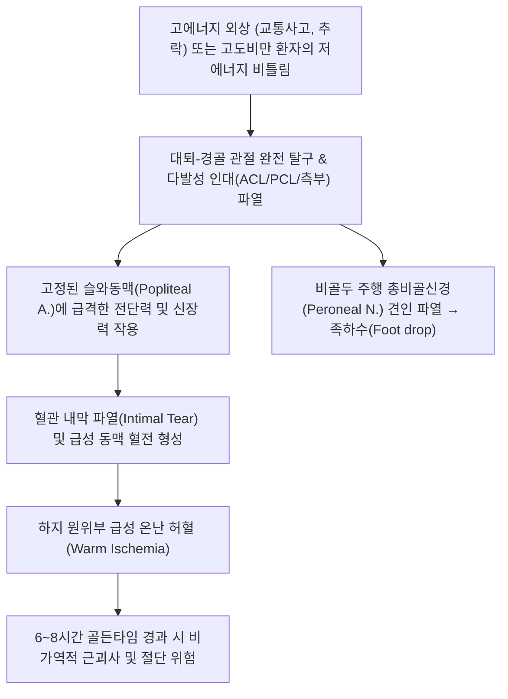

# 🩺 무릎 탈구 (Knee Dislocation / Tibiofemoral Dislocation)

> **핵심 3줄 요약 (Key Summary)**:
> - 📍 **병소 부위 & 해부·병태생리**: 대퇴골 원위부와 경골 근위부 사이의 대퇴-경골 관절(Tibiofemoral joint)이 완전히 어긋나는 손상. 전방십자인대(ACL), 후방십자인대(PCL), 내측측부인대(MCL), 후외측회전복합체(PLC) 중 **최소 3개 이상의 주요 인대가 동시 파열**되는 다발성 인대 손상(Multiligament Knee Injury, MLKI).
> - 🚩 **전형적 임상 양상**: 육안으로 관찰되는 극심한 무릎 기형, 극심한 동통과 관절혈종. 단, **약 50%는 내원 전 자발 정복(Spontaneous reduction)**되어 단순 염좌로 오인될 수 있으므로 전후방·회전 불안정성 및 신경혈관 평가 필수.
> - 🛠️ **핵심 검사 & 치료 전략**: **슬와동맥(Popliteal artery) 손상(20~40%)** 및 **총비골신경(Common peroneal nerve) 손상(25~35%)** 감별이 최우선. 족배동맥 촉진 및 발목상완지수(ABI < 0.9 시 응급 CT 혈관조영술). 급성기 즉각적인 119 응급센터 전원. 아급성기 및 수술 후에는 관절 강직 방지 가동 추나, 비골신경 마비 전침·약침, 인대 복원 한약 투여.
> - ⚠️ **응급 의뢰 레드플래그**: 족배동맥(Dorsalis pedis) 박동 소실, 발의 창백·냉감·청색증, ABI < 0.9 (허혈 6~8시간 초과 시 하지 절단 위험), 비골신경 마비로 인한 족하수(Foot drop), 개방성 탈구 및 구획증후군(Compartment syndrome).

---

## 📌 목차
1. [질환 개요 & 해부학적 병태생리](#1-질환-개요--해부학적-병태생리)
2. [병태생리 메커니즘 & 생체역학적 악순환 네트워크](#2-병태생리-메커니즘--생체역학적-악순환-네트워크)
3. [임상 증상 & 이학적 검사(Physical Exam) 알고리즘](#3-임상-증상--이학적-검사physical-exam-알고리즘)
4. [감별 진단 매트릭스 (Differential Diagnosis)](#4-감별-진단-매트릭스-differential-diagnosis)
5. [한의 통합 치료 프로토콜 (침·약침·추나·한약)](#5-한의-통합-치료-프로토콜-침약침추나한약)
6. [양방 치료 & 병용·의뢰 기준 (Conventional Treatment & Referral)](#6-양방-치료--병용의뢰-기준-conventional-treatment--referral)
7. [재활 운동 & 생활습관 티칭 가이드](#7-재활-운동--생활습관-티칭-가이드)
8. [💡 사용자 진료실 핵심 필기 & 임상 노하우 (Melt-In 잔여 심화 집약)](#8--사용자-진료실-핵심-필기--임상-노하우-melt-in-잔여-심화-집약)
9. [출처 및 학술 참고 문헌 (References)](#9-출처-및-학술-참고-문헌-references)

---

## 1. 질환 개요 & 해부학적 병태생리

**무릎 탈구(Knee Dislocation / Tibiofemoral Dislocation)**는 대퇴골 과부(Femoral condyles)와 경골 고평부(Tibial plateau) 사이의 관절 접촉이 완전히 상실되는 정형외과적 초응급 질환이다. 단순한 슬개골(무릎뼈) 탈구와는 완전히 구별되는 중증 외상으로, 슬관절 지지 복합체의 붕괴를 의미한다.

![[무릎탈구_후방탈구_측면Xray_소견.jpg]]
> [그림 1: ① 영상 소견 — 대퇴골에 대해 경골이 후방으로 완전 전위된 무릎 후방 탈구 측면 X-ray]

![[무릎탈구_외측탈구_전후면Xray_소견.jpg]]
> [그림 2: ① 영상 소견 — 관절낭 및 측부인대 파열과 함께 경골이 외측으로 전위된 외측 무릎 탈구 X-ray]

### Schenck 무릎 탈구 분류법
1. **KD-I (Knee Dislocation I)**: 십자인대 중 하나(ACL 또는 PCL) 파열 + 측부인대 손상.
2. **KD-II**: 양측 십자인대(ACL + PCL) 동시 파열, 양측 측부인대는 온전.
3. **KD-III**: 양측 십자인대(ACL + PCL) 파열 + 내측측부인대(MCL) 파열 (KD-III-M) 또는 외측측부인대/후외측복합체(LCL/PLC) 파열 (KD-III-L).
4. **KD-IV**: 4대 주요 인대(ACL + PCL + MCL + LCL/PLC) 전부 파열 (극도의 불안정성).
5. **KD-V**: 무릎 탈구에 관절 내 골절(경골 고평부 또는 대퇴과 골절)이 동반된 골절-탈구.

- **전위 방향에 따른 분류**:
  - **전방 탈구(Anterior dislocation, 30~40%)**: 슬관절 과신전 손상에 의해 호발하며, 슬와동맥 견인성 내막 파열 위험.
  - **후방 탈구(Posterior dislocation, 25~35%)**: 계기판 손상(Dashboard injury, 굴곡위에서 경골에 후방 외력 부하)으로 발생하며, 슬와동맥의 완전 단열 위험이 가장 높음.
  - **외측/내측/회전 탈구(Lateral/Medial/Rotatory)**.

---

## 2. 병태생리 메커니즘 & 생체역학적 악순환 네트워크

### 슬와동맥 및 총비골신경의 해부학적 취약성
슬관절 후방의 슬와와(Popliteal fossa)에서 **슬와동맥(Popliteal artery)**은 근위부에서는 내전근건열공(Adductor hiatus)의 섬유성 조직에, 원위부에서는 가자미근 활(Soleus arcade)에 단단히 고정되어 있다. 슬관절이 탈구되면서 경골이 전방 또는 후방으로 전위될 때 슬와동맥은 전단력과 신장력을 흡수하지 못하고 내막 파열(Intimal flap tear), 혈전증, 또는 완전 횡단 단열(Transection)을 일으킨다.

![[무릎탈구_십자인대_및_측부인대_해부도_Gray348.png]]
> [그림 3: ① 병태해부 — 무릎 탈구 시 파열되는 전방·후방십자인대 및 내외측 측부인대 복합체 해부도해]

![[무릎탈구_슬와동맥_및_신경손상_해부도해.jpg]]
> [그림 4: ① 혈관신경 해부 — 슬와부 후방을 주행하여 무릎 탈구 시 견인 및 파열 위험이 높은 슬와동맥 및 총비골신경 주행 도해]

---

## 3. 임상 증상 & 이학적 검사(Physical Exam) 알고리즘

### 임상 증상
- **육안적 기형**: 대퇴골과 경골의 축이 완전히 틀어져 무릎이 기괴한 형태로 변형됨.
- **자발 정복 환자의 함정**: 내원 환자의 약 50%는 현장에서 이미 저절로 뼈가 맞춰져 들어간 상태로 내원한다. 환자가 "무릎이 완전히 빠졌다가 덜컥하고 들어갔다"고 진술하면 단순 염좌로 넘기지 말고 반드시 무릎 탈구에 준하여 혈관 검사를 시행해야 한다.
- **피부 주름 징후(Dimple Sign)**: 내측 관절선 부위에 피부가 안으로 말려 들어간 함몰 주름이 보이면 대퇴 내과가 관절낭을 뚫고 감입된 비정복성 탈구(Irreducible dislocation)를 의미함.

### 이학적 검사 알고리즘

![[라크만_검사_1단계_슬관절20도굴곡_시작자세.jpg]]
> [그림 5: ② 이학적 검사 — 자발 정복 후 다발성 인대 파열로 인한 전방 불안정성을 평가하는 라크만 검사(Lachman test) 실사]

1. **혈관 검사 (Vascular Examination — 최우선 순위)**:
   - **족배동맥(Dorsalis pedis) 및 후경골동맥(Posterior tibial artery) 맥박 촉진**.
   - **발목상완지수(Ankle-Brachial Index, ABI)** 측정: 환측 발목 수축기압을 상완 수축기압으로 나눈 값. **ABI < 0.9이면 즉시 응급 CT 혈관조영술(CT Angiography)** 의뢰.
2. **신경학적 검사 (Neurological Examination)**:
   - 총비골신경 기능 평가: 제1-2 족지 간 지간부 감각(심비골신경), 족배부 감각(천비골신경), 발목 족배굴곡 및 엄지발가락 신전력 평가.
3. **인대 안정성 검사 (정복 확인 후 시행)**:
   - [[라크만 검사]](Lachman test) 및 전방전위 검사 (ACL 파열).
   - 후방전위 검사(Posterior drawer test) 및 후방 처짐(Sag sign) (PCL 파열).
   - 30° 외반/내반 스트레스 검사 (측부인대 파열).

---

## 4. 감별 진단 매트릭스 (Differential Diagnosis)

![[슬개골탈구불안검사_2단계_슬개골외측변위_실사.jpg]]
> [그림 6: ① 감별 진단 — 대퇴-경골 탈구와 혼동하기 쉬운 급성 슬개골(무릎뼈) 외측 탈구 소견]

![[슬관절_연부조직_통증부위_도해.svg]]
> [그림 7: ① 해부 감별 — 슬관절 다발성 인대 손상 부위 및 연부조직 해부학적 위치 도해]

| 감별 질환 | 손상 관절 및 구조 | 육안적 변형 부위 | 혈관 손상 위험 | 응급도 및 치료 방향 |
| :--- | :--- | :--- | :--- | :--- |
| **[[무릎 탈구]](대퇴-경골 탈구)** | 대퇴-경골 관절 (ACL+PCL 등 $\ge$ 3개 인대) | 하퇴 전체가 전후/외측으로 전위 | **매우 높음 (20~40%)** | **초응급**: 사지 절단 방지, 즉시 혈관 평가 및 정복 |
| **[[무릎뼈 탈구]](슬개골 탈구)** | 슬개-대퇴 관절 (내측슬개대퇴인대 MPFL) | 슬개골만 외측으로 툭 튀어나옴 | 극히 드묾 | 슬관절 신전 및 슬개골 내측 압박으로 비교적 용이하게 정복 |
| **단순 [[슬관절 전방십자인대 손상]]** | ACL 단독 파열 (관절 접촉 유지) | 관절 변형 없음, 혈종만 팽만 | 거의 없음 | RICE, 정밀 MRI 후 아급성기 인대 재건술 |
| **경골 고평부 골절** | 경골 관절면 골절 | 국소 골성 압통, 혈관절증 | 중간 (전위 심할 시) | X-ray/CT 확인 후 수술적 내고정술 |

---

## 5. 한의 통합 치료 프로토콜 (침·약침·추나·한약)

![[무릎염좌_05_술기실사_측부인대_자침치료.jpg]]
> [그림 8: ③ 한의 시술 — 수술적 인대 재건술 후 만성 관절 불안정 및 신경 마비 후유증을 다스리는 경혈 자침 실사]

### 급성기 한의 진료실 대처 원칙
- **급성 탈구 상태 내원 시**: 한의원 내에서 침이나 약침을 놓는 것이 절대 금기이다. 맥박 소실 시 부드러운 종축 견인(Longitudinal traction)으로 1회 정복을 시도할 수 있으나, 지체 없이 119 구급대를 호출하여 정형외과/혈관외과 응급센터로 즉시 이송해야 한다.

### 아급성기 및 수술 후 한의 재활 프로토콜
1. **비골신경 마비(Peroneal Nerve Palsy / 족하수) 전침 치료**:
   - **[[양릉천]](GB34)**, **[[족삼리]](ST36)**, **[[조구]](ST38)**, **[[해계]](ST41)**.
   - 전완 및 하지 전외측 근육군에 2Hz/100Hz 혼합 전침 자극을 주 3~4회 적용하여 탈신경된 전경골근의 근위축을 방지하고 신경 재생을 촉진.
2. **약침 치료 (Pharmacopuncture)**:
   - 관절경 다발성 인대 재건술 4~6주 후: **신바로 약침** 또는 **자하거 약침**을 슬관절 주변 인대 부착부 및 슬안혈에 주입하여 이식건의 골 결합 및 결합조직 생성을 촉진.
3. **관절가동 추나 요법 (Chuna)**:
   - 외고정 장치 발거 후 발생한 관절 강직(Arthrofibrosis)에 대해, 슬개골 상하좌우 활주(Patellar mobilization) 및 경골-대퇴골의 부드러운 축방향 견인 신장 기법을 단계적으로 적용.
4. **한약 치료 (Herbal Medicine)**:
   - **신경 마비 및 기혈어체기**: **[[보양환오탕]](補陽還五湯)** 가감. 기를 돋우고 어혈을 뚫어 말초 신경 및 미세 혈관 재생을 촉진.
   - **인대 복원 및 관절 쇠약기**: **[[독활기생탕]](獨活寄生湯)**, **[[오적산]](五積散)** 가감방(속단, 골쇄보, 두충 증량).

---

## 6. 양방 치료 & 병용·의뢰 기준 (Conventional Treatment & Referral)

### 양방 치료 프로토콜
- **응급 정복 (Emergent Closed Reduction)**: 진정 마취 하에 하지 종축 견인을 통해 즉각 정복. 정복 전후 반드시 맥박 및 ABI 재측정.
- **혈관 손상 재건술 (Vascular Revascularization)**: 슬와동맥 파열 시 대복재정맥 이식편(Saphenous vein graft)을 이용한 우회술 또는 혈전제거술 시행. **허혈 시간 6~8시간 이내 재개통 필수**.
- **외고정 장치(External Fixator)**: 심한 관절 불안정성이나 혈관 수술 후 관절을 안정시키기 위해 경대퇴-경골 외고정기 4~6주 거치.
- **인대 재건술 (Multiligament Reconstruction)**: 혈관 안정화 후 2~3주 경과 시 관절경하 자가건/동종건 다발성 인대 재건술 시행.

### 응급 의뢰 트리거 (Red Flags)
1. **슬관절 완전 탈구 상태 (즉각 119 출동 및 응급실 전원)**.
2. **족배동맥 또는 후경골동맥 맥박 소실, 발의 냉감, 창백 (급성 동맥 폐색)**.
3. **발목상완지수(ABI) < 0.9**.
4. **족배부 감각 마비 및 발목 족배굴곡 불능(Foot drop)**.
5. **하퇴부의 극심한 팽창, 수동 신전 시 극심한 통증(급성 구획증후군 의심)**.

---

## 7. 재활 운동 & 생활습관 티칭 가이드

1. **족하수 방지를 위한 AFO 보조기 착용**:
   - 비골신경 마비가 동반된 경우 발목이 아래로 처져 보행 시 걸려 넘어지는 것을 방지하기 위해 단하지 보조기(AFO) 착용 필수.
2. **대퇴사두근 등척성 세팅 (Quad Sets)**:
   - 관절 각도 변화 없이 대퇴사두근에 힘을 주어 무릎 뒤를 침대로 누르는 운동을 조기부터 매일 시행.
3. **수동 관절 가동 운동 (Continuous Passive Motion, CPM)**:
   - 외고정기 제거 후 정형외과 주치의의 허가 하에 하루 1~2시간씩 각도를 0°에서 점진적으로 90°까지 증가.

---

## 8. 💡 사용자 진료실 핵심 필기 & 임상 노하우 (Melt-In 잔여 심화 집약)

- **자발 정복 환자의 '위장된 평온'을 경계하라**: "다리가 꺾였다가 제자리로 들어왔는데 지금은 그냥 뻐근하다"며 걸어서 한의원에 들어오는 환자가 있다. 다발성 인대가 파열되면 관절낭도 찢어져 관절액이 피하로 새어나가기 때문에 오히려 관절 종창이 심하지 않을 수 있다. 그러나 이 상태에서 슬와동맥 내막이 찢어져 혈전이 천천히 차오르고 있을 수 있으므로, 반드시 족배동맥 맥박을 짚고 발목 혈압(ABI)을 재야 한다.
- **피부 주름(Dimple sign) 발견 시 강제 정복 금지**: 무릎 안쪽에 보조개처럼 피부가 쏙 들어간 주름이 보이면 대퇴골 과부가 관절낭을 뚫고 끼인 'Buttonhole' 상태이다. 이때 도수 정복을 강하게 시도하면 연부조직이 괴사하므로 즉시 수술실로 보내야 한다.
- **수술 후 족하수 환자의 골든타임 치료**: 다발성 인대 수술 후 총비골신경 손상으로 발목을 못 드는 환자는 양방에서 "기다려보자"는 말만 듣고 6개월 이상 방치되다 오는 경우가 많다. 수술 후 2~3주째부터 양릉천-족삼리-해계에 전침과 자하거 약침을 집중 투여하면 영구 족하수를 막고 신경 회복률을 획기적으로 높일 수 있다.

---

## 9. 출처 및 학술 참고 문헌 (References)

1. Constantinescu D, et al. (2023). Vascular Injury After Knee Dislocation: A Meta-Analysis Update. *Sports Med Arthrosc Rev*, 31(1):16-23. [PMID 36730697](https://pubmed.ncbi.nlm.nih.gov/36730697/)

2. Giustra F, et al. (2024). Irreducible knee dislocation: improved clinical outcomes of open and arthroscopic surgical treatment. A systematic review of the literature. *Musculoskelet Surg*, 108(1):1-12. [PMID 37993611](https://pubmed.ncbi.nlm.nih.gov/37993611/)

3. Wan JJY, et al. (2024). Popliteal Artery Stent Thrombosis After Multiligamentous Knee Injury Reconstruction: A Case Report. *Cureus*, 16(10):e70635. [PMID 39446995](https://pubmed.ncbi.nlm.nih.gov/39446995/)

---

## 관련 노트
- [[슬관절 전방십자인대 손상]]
- [[무릎뼈 탈구]]
- [[무릎 락킹 증후군]]
- [[당귀수산]]
- [[독활기생탕]]
- [[보양환오탕]]
- [[양릉천]]
