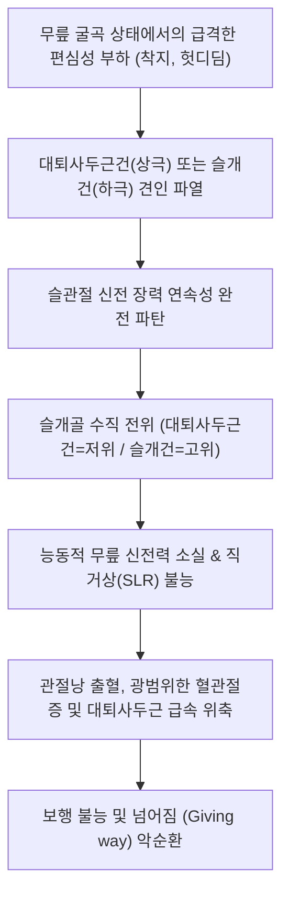

# 🩺 무릎 폄근 손상 (Knee Extensor Mechanism Injuries)

> **핵심 3줄 요약 (Key Summary)**:
> - 📍 **병소 부위 & 해부·병태생리**: 대퇴사두근(Quadriceps), 대퇴사두근건(Quadriceps tendon), 슬개골(Patella), 슬개건(Patellar tendon), 경골 조면(Tibial tuberosity)으로 이어지는 무릎 신전 연쇄 기구(Extensor mechanism)의 급성·만성 파열 및 파탄 손상.
> - 🚩 **전형적 임상 양상**: 무릎에 갑작스러운 편심성 부하(Eccentric loading) 후 발생한 극심한 동통과 함께 **능동적 무릎 신전 완전 소실 및 직거상 불능(Inability to perform straight leg raise, SLR)**. 건 부착부의 만져지는 결손(Palpable gap)과 슬개골 전위.
> - 🛠️ **핵심 검사 & 치료 전략**: 연령별 호발 감별(40세 이상 = 대퇴사두근건 파열/저위 슬개골, 40세 미만 = 슬개건 파열/고위 슬개골). 전층 파열 시 2주 이내 조기 관절경/개방적 수술 재건 의뢰. 불완전 파열 및 만성 건병증(점퍼스니)은 한의 약침, 전침, 화침 및 편심성 대퇴사두근 재활 적용.
> - ⚠️ **응급 의뢰 레드플래그**: 능동 신전 래그(Extension lag) > 30° 또는 완전 직거상 불능(전층 파열 시 지체 없이 수술적 재건 필요), 슬개골 골절 동반, 만성 신부전·부갑상선 기능항진증 환자의 양측성 동시 파열.

---

## 📌 목차
1. [질환 개요 & 해부학적 병태생리](#1-질환-개요--해부학적-병태생리)
2. [병태생리 메커니즘 & 생체역학적 악순환 네트워크](#2-병태생리-메커니즘--생체역학적-악순환-네트워크)
3. [임상 증상 & 이학적 검사(Physical Exam) 알고리즘](#3-임상-증상--이학적-검사physical-exam-알고리즘)
4. [감별 진단 매트릭스 (Differential Diagnosis)](#4-감별-진단-매트릭스-differential-diagnosis)
5. [한의 통합 치료 프로토콜 (침·약침·추나·한약)](#5-한의-통합-치료-프로토콜-침약침추나한약)
6. [양방 치료 & 병용·의뢰 기준 (Conventional Treatment & Referral)](#6-양방-치료--병용의뢰-기준-conventional-treatment--referral)
7. [재활 운동 & 생활습관 티칭 가이드](#7-재활-운동--생활습관-티칭-가이드)
8. [💡 사용자 진료실 핵심 필기 & 임상 노하우 (Melt-In 잔여 심화 집약)](#8--사용자-진료실-핵심-필기--임상-노하우-melt-in-잔여-심화-집약)
9. [출처 및 학술 참고 문헌 (References)](#9-출처-및-학술-참고-문헌--references)

---

## 1. 질환 개요 & 해부학적 병태생리

**무릎 폄근 손상(Knee Extensor Mechanism Injuries)**은 체중을 지지하고 하지 보행을 가능하게 하는 핵심 동적 구조물인 슬관절 신전 기구(Extensor apparatus)의 연속성이 기계적으로 단절되거나 손상되는 병태를 통칭한다. 이 복합체는 [[대퇴사두근]](대퇴직근, 외측광근, 내측광근, 중간광근)의 근복에서 시작하여 **대퇴사두근건(Quadriceps tendon)**, 종자골인 **슬개골(Patella)**, **슬개건(Patellar tendon/ligament)**을 거쳐 경골 조면(Tibial tuberosity)에 정지한다.

![[대퇴사두근-20240915192138939.png]]
> [그림 1: ① 병태해부 — 무릎 신전 기전을 구성하는 대퇴사두근 4두 및 슬개골 부착부 해부도해]

신전 기구 손상은 파열 위치에 따라 명확한 역학적·연령별 분기를 보인다:
1. **[[대퇴사두근건 파열]](Quadriceps Tendon Rupture)**: 대퇴사두근건이 슬개골 상극(Superior pole) 부착부에서 떨어져 나가는 병변으로, 주로 **40세 이상 중장년층**에서 건의 퇴행성 변성, 당뇨병, 만성 신부전, 스테로이드 투여력 등을 배경으로 호발한다.
2. **[[슬개건 파열]](Patellar Tendon Rupture)**: 슬개골 하극(Inferior pole) 또는 경골 조면 부착부에서 슬개건이 파열되는 병변으로, 주로 **40세 미만의 젊고 활동적인 운동선수**(농구, 배구, 육상 점프 종목)에서 호발한다.
3. **슬개골 골절**: 신전 기전 중앙부의 골성 연속성 파탄.

![[힘줄병증_슬개건병증_점퍼스니_해부병태도해.jpg]]
> [그림 2: ① 해부병태 — 슬개골 하극과 경골 조면을 연결하는 슬개건 및 신전 기전 부착부 도해]

---

## 2. 병태생리 메커니즘 & 생체역학적 악순환 네트워크

손상의 주된 생체역학적 기전은 무릎이 굴곡된 상태에서 신전근이 급격히 수축하는 **편심성 수축 부하(Eccentric contraction)**이다. 계단을 내려오다 헛디디거나, 점프 후 착지 시 체중의 수 배에 달하는 장력이 신전 기전에 걸리면서 가장 취약한 건-골 접합부(Enthesis)가 파열된다.

![[무릎폄근손상_대퇴사두근건파열_저위슬개골_Xray.jpg]]
> [그림 3: ① 영상 병태 — 대퇴사두근건 파열로 인해 슬개골이 하방으로 전위된 저위 슬개골(Patella baja) X-ray]

![[무릎폄근손상_슬개건파열_고위슬개골_Xray.png]]
> [그림 4: ① 영상 병태 — 슬개건 파열로 대퇴사두근의 상방 견인력에 의해 슬개골이 높게 치솟은 고위 슬개골(Patella alta) X-ray]

파열이 발생하면 대퇴사두근의 정상적인 장력 사슬이 끊어지며, 파열 위치에 따라 슬개골의 수직 위치가 정반대로 전위된다:
- 대퇴사두근건 파열 시: 슬개건의 당김에 의해 슬개골이 비정상적으로 내려앉음 (**저위 슬개골, Patella baja**).
- 슬개건 파열 시: 대퇴사두근의 저항 없는 견인력으로 슬개골이 허벅지 쪽으로 치솟음 (**고위 슬개골, Patella alta**).

---

## 3. 임상 증상 & 이학적 검사(Physical Exam) 알고리즘

### 임상 증상
- **파열 순간의 느낌**: 환자는 '뚝'하는 파열음과 함께 무릎 앞쪽에 날카로운 통증을 느끼며 즉시 주저앉음.
- **체중 부하 불능**: 무릎이 꺾이며 지탱하지 못해 단독 보행이 불가능함.
- **만져지는 함몰 결손(Palpable Sulcus / Gap)**: 슬개골 바로 윗부분(대퇴사두근건 파열) 또는 아랫부분(슬개건 파열)을 만졌을 때 손가락이 쑥 들어가는 결손부가 뚜렷하게 촉진됨.

### 이학적 검사 알고리즘

![[슬개골압박검사_2단계_클라크검사_대퇴사두근수축_실사.jpg]]
> [그림 5: ② 이학적 검사 — 대퇴사두근 수축 시 신전 지대의 통증 및 신전 래그를 평가하는 이학적 검사 실사]

1. **능동 하지 직거상 검사 (Active Straight Leg Raise, SLR)**:
   - 앙와위에서 환자에게 무릎을 편 상태로 다리를 들어 올리도록 지시.
   - **전층 파열 시 다리를 전혀 들어 올리지 못함 (Inability to SLR)**. 부분 파열 시 들어 올릴 수는 있으나 완전 신전 상태를 유지하지 못하고 무릎이 굽어지는 **신전 래그(Extension lag)** 관찰.
2. **슬개골 높이 평가 (Insall-Salvati Ratio)**:
   - 측면 X-ray에서 슬개건 길이(TL)와 슬개골 대각선 길이(PL)의 비율 측정. 정상치 0.8~1.2.
   - TL/PL > 1.2: 고위 슬개골 (슬개건 파열).
   - TL/PL < 0.8: 저위 슬개골 (대퇴사두근건 파열).
3. **초음파 및 MRI 검사**:
   - 건 섬유의 완전 불연속성, 건 파단부 혈종 및 건 퇴축(Retraction) 거리 평가.

---

## 4. 감별 진단 매트릭스 (Differential Diagnosis)

![[힘줄병증_슬개건_부착부_건병증_MRI_시상면.jpg]]
> [그림 6: ① 영상 감별 — 완전 파열과 감별해야 하는 만성 슬개건병증(Jumper's knee) 시상면 T2 MRI]

![[건염_01_환부실사_슬개건염.jpg]]
> [그림 7: ① 환부 실사 — 슬개건 부착부 염증 및 종창을 보이는 환부 실사]

| 감별 질환 | 호발 연령 및 배경 | 결손부 촉진 부위 | 슬개골 위치 변위 | 능동 SLR 가능 여부 |
| :--- | :--- | :--- | :--- | :--- |
| **[[대퇴사두근건 파열]]** | 40세 이상 중장년, 전신 대사질환 | 슬개골 상극 직상부 | **저위 슬개골 (Patella baja)** | **불가능 (완전 파열 시)** |
| **[[슬개건 파열]]** | 40세 미만 젊은 운동선수 | 슬개골 하극~경골조면 | **고위 슬개골 (Patella alta)** | **불가능 (완전 파열 시)** |
| **슬개골 골절** | 직접 타박 또는 급격한 장력 | 슬개골 본체 골편 분리 | 골편 간격 벌어짐 | 불가능 (전위성 골절 시) |
| **만성 [[슬개건염]](점퍼스니)** | 반복적 점프 운동선수 | 결손 없음, 하극 국소 압통 | 정상 위치 유지 | **완전 가능 (통증만 호소)** |
| **[[대퇴신경 마비]]** | 신경 포착 또는 의인성 손상 | 결손 없음 (근위축 동반) | 정상 위치 유지 | SLR 불능이나 건 연속성은 정상 |

---

## 5. 한의 통합 치료 프로토콜 (침·약침·추나·한약)

![[무릎염좌_05_술기실사_측부인대_자침치료.jpg]]
> [그림 8: ③ 한의 시술 — 대퇴사두근건 및 슬개건 주변 경혈 자침을 통한 건 조직 재생 침치료 실사]

### 적응증 분류
- **전층 파열**: 한의 단독 치료 금기. 즉시 수술 의뢰 후 수술 후 재활 병용.
- **불완전 파열(부분 파열) 및 만성 건병증**: 한의 복합 보존적 치료의 최우선 적응증.

### 침구 치료 및 건-골 부착부 자극
- **주요 혈위**: [[양구]](ST34, 대퇴사두근 극렬통 진통 극혈), [[혈해]](SP10), [[독비]](ST35), [[내슬안]](EX-LE4), [[학정]](EX-LE2), [[음릉천]](SP9).
- **화침(火鍼) 및 온침 요법**: 만성 슬개건병증 및 미세 파열 부위에 침첨을 가열하여 자입하는 화침을 시술하여 국소 섬유아세포 증식 및 콜라겐 합성을 자극함.

### 약침 치료 (Pharmacopuncture)
- **신바로 약침 및 자하거 약침**: 슬개골 상하극 건 부착부에 0.5~1.0ml 주입하여 만성 퇴행성 건 조직의 신혈관 형성 및 재생을 촉진.
- **봉약침(Melittin)**: 만성 무균성 건초염 부위에 저농도(0.05mg/ml)로 주입하여 건 주변 염증성 삼출액 흡수.

### 추나 요법 및 근막 이완 (Chuna)
- **대퇴사두근 근에너지기법(MET)**: 대퇴직근과 외측광근의 과도한 근막 단축을 부드럽게 이완시켜 슬개골에 걸리는 과도한 장력을 분산.
- **슬개골 관절가동술(Patellar Mobilization)**: 수술 후 발생한 슬개골-대퇴 활주면의 유착을 방지하기 위해 상하·좌우 도수 가동 적용.

### 한약 치료 (Herbal Medicine)
- **급성 부종·손상기**: **[[당귀수산]]**, **서경탕(舒經湯)**. 미세 혈종 흡수 및 통증 억제.
- **건 골 결합 복원기**: **[[독활기생탕]]**, **보신건골탕(補腎健骨湯)** 가감 (속단, 두충, 구척, 골쇄보 배합). 건 섬유의 장력 회복 및 골-건 부착부 유착 촉진.

---

## 6. 양방 치료 & 병용·의뢰 기준 (Conventional Treatment & Referral)

### 양방 치료 프로토콜
- **수술적 치료 (Surgical Indication — 표준 원칙)**:
  - **전층 파열(Complete rupture)은 수술이 절대적 적응증**이다.
  - 건 조직의 퇴축과 지방 변성을 방지하기 위해 **손상 후 2주 이내 조기 봉합술(End-to-end repair or Transosseous suture / Suture anchor)** 시행 필수.
  - 만성 진구성 파열의 경우 자가 햄스트링건 또는 동종건을 이용한 건 재건술 필요.
- **비수술적 보존 치료**:
  - 신전 기전이 보존된 부분 파열에 한해 실린더 석고 붕대(Cylinder cast) 또는 신전 보조기를 4~6주간 착용 후 점진적 재활.

### 응급 의뢰 트리거 (Red Flags)
1. **능동적 직거상(SLR) 완전 불능 (전층 파열 의심 즉시 정형외과 전원)**.
2. **슬개골 상·하부의 명확한 촉진상 결손부(Gap) 존재**.
3. **측면 X-ray상 명확한 고위 슬개골 또는 저위 슬개골 소견**.
4. **스테로이드 국소 주사 직후 발생한 급성 건 파열**.

---

## 7. 재활 운동 & 생활습관 티칭 가이드

1. **대퇴사두근 편심성 강화 운동 (Eccentric Decline Squat)**:
   - 만성 건병증 및 부분 손상 회복기: 25도 경사판 위에서 천천히 무릎을 굽히며 버티는 편심성 스쿼트를 15회씩 3세트 실시하여 건의 인장 강도를 회복시킴.
2. **대퇴사두근 폼롤러 근막 이완**:
   - 허벅지 앞쪽과 외측(장경인대-외측광근 접경부)을 폼롤러로 매일 이완하여 건 부착부 견인력 경감.
3. **수술 후 재활 단계**:
   - 0~2주: 신전 보조기 고정 하 체중 부하 금지, 족관절 펌핑 운동.
   - 2~6주: 통증 없는 범위 내 수동 굴곡 각도 서서히 증가 (주당 15~20도씩).

---

## 8. 💡 사용자 진료실 핵심 필기 & 임상 노하우 (Melt-In 잔여 심화 집약)

- **'안 올라가는 다리'를 절대 가볍게 보지 마라**: 넘어지거나 삐끗한 후 "무릎은 많이 안 부었는데 다리가 안 들린다"고 호소하는 환자는 십자인대 손상이 아니라 **대퇴사두근건 또는 슬개건 전층 파열**이다. 침대에 눕히고 "다리를 편 채로 들어보세요(Active SLR)" 한 마디면 3초 안에 감별된다.
- **나이로 쪼개는 파열 공식**:
  - 40세 이상 중년 환자가 계단에서 헛디딘 후 다리를 못 들면 $\rightarrow$ **대퇴사두근건 파열 (슬개골 상극 결손)**.
  - 20~30대 젊은이가 점프 착지 후 다리를 못 들면 $\rightarrow$ **슬개건 파열 (슬개골 하극 결손)**.
- **부분 손상 환자에서 스테로이드 주사 절대 금기**: 무릎 앞쪽 통증 환자에게 건 내 스테로이드 주사를 반복하면 건 섬유의 괴사가 유발되어 사소한 점프에도 전층 파열로 이어진다. 반드시 신바로 약침, 자하거 약침 및 온침/화침으로 콜라겐 리모델링을 유도해야 한다.

---

## 9. 출처 및 학술 참고 문헌 (References)

1. Pope JD, et al. (2023). Quadriceps Tendon Rupture. *StatPearls*, NBK482352. [PMID 29494011](https://pubmed.ncbi.nlm.nih.gov/29494011/)

2. Mabrouk A, et al. (2026). Patellar Tendon Rupture. *StatPearls*, NBK513264. [PMID 30020647](https://pubmed.ncbi.nlm.nih.gov/30020647/)

3. Yuce A, et al. (2022). The Injury Mechanism of Knee Extensor Mechanism Rupture in Professional Athletes: A Video Analysis Study. *Orthop J Sports Med*, 10(10):23259671221128760. [PMID 36187575](https://pubmed.ncbi.nlm.nih.gov/36187575/)

---

## 관련 노트
- [[대퇴사두근]]
- [[슬개건염]]
- [[무릎뼈 탈구]]
- [[무릎 락킹 증후군]]
- [[당귀수산]]
- [[독활기생탕]]
- [[양구]]
