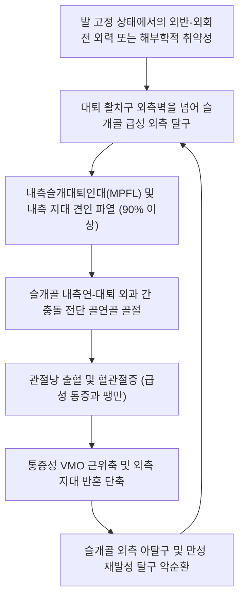

# 🩺 무릎뼈 탈구 (Patellar Dislocation / Patellar Instability)

> **핵심 3줄 요약 (Key Summary)**:
> - 📍 **병소 부위 & 해부·병태생리**: 슬개골(무릎뼈, Patella)이 대퇴골 활차구(Trochlear groove)를 벗어나 거의 예외 없이 **외측으로 이탈(Lateral dislocation, > 95%)**되는 급성 관절 탈구 손상. 1차 정적 제동 구조물인 **내측슬개대퇴인대(Medial Patellofemoral Ligament, MPFL)**의 90% 이상 파열 동반.
> - 🚩 **전형적 임상 양상**: 무릎 외측으로 슬개골이 툭 튀어나오는 육안적 기형, 급성 혈관절증(Hemarthrosis), 대퇴 내과 부착부 압통(Bassett's sign), 슬개골 외측 변위 시 극도의 공포 반응을 보이는 **페어뱅크 불안 검사(Fairbank's apprehension test) 양성**.
> - 🛠️ **핵심 검사 & 치료 전략**: 무릎을 서서히 신전시키며 슬개골을 내측으로 부드럽게 밀어주는 비침습적 도수 정복술(Reduction). 정복 후 골연골 골절(Osteochondral fracture) 유무 X-ray/MRI 확인. MPFL 부착부 및 혈해·양구 약침 자입, 내측광근 사두(VMO) 강화 전침, 외측 지대 단축 이완 추나, 재발 방지 보조기 착용.
> - ⚠️ **응급 의뢰 레드플래그**: 관절 내 5mm 이상의 유리 골연골 골편(Loose osteochondral fragment) 발생(조기 관절경 수술 적응증), 도수 정복이 불가능한 감돈성 탈구, 무릎 관절 자체의 대퇴-경골 탈구(무릎 탈구) 동반.

---

## 📌 목차
1. [질환 개요 & 해부학적 병태생리](#1-질환-개요--해부학적-병태생리)
2. [병태생리 메커니즘 & 생체역학적 악순환 네트워크](#2-병태생리-메커니즘--생체역학적-악순환-네트워크)
3. [임상 증상 & 이학적 검사(Physical Exam) 알고리즘](#3-임상-증상--이학적-검사physical-exam-알고리즘)
4. [감별 진단 매트릭스 (Differential Diagnosis)](#4-감별-진단-매트릭스-differential-diagnosis)
5. [한의 통합 치료 프로토콜 (침·약침·추나·한약)](#5-한의-통합-치료-프로토콜-침약침추나한약)
6. [양방 치료 & 병용·의뢰 기준 (Conventional Treatment & Referral)](#6-양방-치료--병용의뢰-기준-conventional-treatment--referral)
7. [재활 운동 & 생활습관 티칭 가이드](#7-재활-운동--생활습관-티칭-가이드)
8. [💡 사용자 진료실 핵심 필기 & 임상 노하우 (Melt-In 잔여 심화 집약)](#8--사용자-진료실-핵심-필기--임상-노하우-melt-in-잔여-심화-집약)
9. [출처 및 학술 참고 문헌 (References)](#9-출처-및-학술-참고-문헌--references)

---

## 1. 질환 개요 & 해부학적 병태생리

**무릎뼈 탈구(Patellar Dislocation / [[슬개골 탈구]])**는 슬개대퇴관절(Patellofemoral joint)에서 종자골인 슬개골이 대퇴골의 대퇴 활차구(Femoral trochlea)로부터 완전히 이탈되는 병태이다. 대퇴사두근의 외측 견인 벡터(Q-angle)로 인해 탈구의 95% 이상이 **외측(Lateral)**으로 일어난다.

![[슬개대퇴증후군_슬개골마찰_연골연화도해.png]]
> [그림 1: ① 병태해부 — 대퇴 활차구 내에서 슬개골의 정상적인 접촉면 및 외측 활주 마찰 병태도해]

정상 슬관절에서 슬개골은 굴곡 0°~20° 구간에서는 연부조직인 **내측슬개대퇴인대(Medial Patellofemoral Ligament, MPFL)**의 장력에 의해 외측 탈구가 억제되며, 20°~30° 이상 굴곡되면 대퇴 활차의 외측 관절면(Lateral trochlear facet)이라는 골성 방어벽 속으로 진입하여 안정성을 확보한다.

![[무릎폄근손상_슬개건파열_고위슬개골_Xray.png]]
> [그림 2: ① 선행 소인 — 슬개골 탈구의 대표적인 해부학적 취약 요인인 고위 슬개골(Patella alta) X-ray 소견]

### 슬개골 탈구의 주요 해부학적 소인
1. **활차 이형성증(Trochlear Dysplasia)**: 대퇴 활차구가 얕거나 평평하여 골성 제동력이 취약함.
2. **고위 슬개골([[Patella alta]])**: 무릎 굴곡 시 슬개골이 활차구 내로 늦게 진입함.
3. **Q-angle 증가 및 외반슬(Genu valgum)**: 대퇴사두근의 외측 편위 견인력 급증.
4. **내측광근 사두([[VMO]]) 약화** 및 **외측 지대(Lateral retinaculum)의 비후·단축**.

---

## 2. 병태생리 메커니즘 & 생체역학적 악순환 네트워크

급성 슬개골 탈구는 전형적으로 발이 지면에 고정된 상태에서 대퇴골이 급격히 내회전하고 무릎이 외반(Valgus) 스트레스를 받는 비틀림 기전에 의해 발생한다.

![[대퇴사두근-20240915192138939.png]]
> [그림 3: ① 근육 해부 — 외측 견인력에 저항하여 슬개골을 내측으로 유지하는 내측광근(VMO) 해부도해]

![[슬관절_연부조직_통증부위_도해.svg]]
> [그림 4: ① 연부조직 해부 — 슬개골 외측 탈구 시 견인 파열되는 내측슬개대퇴인대(MPFL) 및 관절낭 부착부 도해]

외측으로 탈구되는 순간 슬개골 내측 관절연골과 대퇴 외과(Lateral femoral condyle)의 외측연이 강하게 충돌하면서 **골연골 전단 골절(Osteochondral shear fracture)**이 흔히 동반되며, MPFL이 대퇴골 부착부(Schöttle's point) 또는 슬개골 내측연에서 찢어지며 혈관절증(Hemarthrosis)을 형성한다.

---

## 3. 임상 증상 & 이학적 검사(Physical Exam) 알고리즘

### 임상 증상
- **외측 돌출 변형**: 슬개골이 대퇴골 외측으로 완전히 빠져나가 무릎 전면이 비정상적으로 평평해지고 외측에 딱딱한 돌출이 관찰됨.
- **자발 정복 환자의 호소**: 현장에서 다리를 펴는 순간 '덜컥'하고 저절로 맞춰져 내원하는 경우가 흔하며, 환자는 "무릎이 순간적으로 빠졌다가 들어갔다"고 진술함.
- **바셋 징후(Bassett's Sign)**: 대퇴골 내상과와 내전근 결절(Adductor tubercle) 사이 MPFL 부착부의 극심한 압통.

### 이학적 검사 알고리즘

![[슬개골탈구불안검사_1단계_준비자세_실사.jpg]]
> [그림 5: ② 이학적 검사 — 슬관절 20~30도 굴곡위에서 슬개골 외측 불안정을 검사하기 위한 준비 자세 실사]

![[슬개골탈구불안검사_2단계_슬개골외측변위_실사.jpg]]
> [그림 6: ② 이학적 검사 — 엄지로 슬개골을 외측으로 밀 때 환자가 통증과 재탈구 공포로 대퇴사두근을 급격히 수축하는 양성 반응 실사]

1. **[[페어뱅크 불안 검사]](Fairbank's Patellar Apprehension Test)**:
   - 환자를 앙와위로 눕히고 무릎을 20°~30° 굴곡한 상태에서, 검사자가 엄지손가락으로 슬개골의 내측연을 잡고 외측으로 부드럽게 밀어냄.
   - 슬개골이 외측으로 미끄러질 때 환자가 극도의 공포감(Apprehension)을 나타내며 검사자의 손을 뿌리치거나 대퇴사두근을 강하게 수축하여 무릎을 펴려고 하면 양성.
2. **슬개골 외측 활주 검사 (Patellar Glide Test)**:
   - 완전 신전 상태에서 슬개골의 횡경을 4등분(Quadrants)하여 외측으로 밀었을 때 2등분(50%) 이상 과도하게 밀리면 내측 지대 이완, 3등분(75%) 이상 밀리면 MPFL 파열 강력 시사.
3. **슬개골 압박 및 추적 검사 (J-sign)**:
   - 굴곡 상태에서 완전 신전할 때 슬개골이 마지막 신전 순간에 갑자기 외측으로 'J'자 궤적을 그리며 튕겨나가는 현상 평가.

---

## 4. 감별 진단 매트릭스 (Differential Diagnosis)

![[슬개골압박검사_1단계_슬개골압박_내외활주_실사.jpg]]
> [그림 7: ① 이학적 감별 — 슬개골 압박 및 관절면 연골 연화성 마찰음을 평가하는 검사 실사]

| 감별 질환 | 손상 관절 및 구조 | 탈구 및 변형 부위 | 혈관/신경 손상 위험 | 관절 가동 범위 특성 |
| :--- | :--- | :--- | :--- | :--- |
| **[[무릎뼈 탈구]](슬개골 탈구)** | 슬개대퇴관절 (MPFL 파열) | **슬개골만 외측으로 돌출** | 극히 드묾 | 신전 시 비교적 용이하게 정복됨 |
| **[[무릎 탈구]](대퇴-경골 탈구)** | 대퇴-경골 관절 (ACL/PCL/측부) | 하퇴 전체가 전후/외측 전위 | **매우 높음 (20~40%)** | 관절 전체가 붕괴되는 초응급 |
| **급성 [[전방십자인대 파열]]** | 과간절흔 내 ACL 단독 파열 | 육안적 관절 변형 없음 | 드묾 | Lachman (+), 혈관절증 급속 발생 |
| **슬개골 골절** | 슬개골 체부 골절 | 골편 사이 함몰 홈 | 없음 | 능동 신전 완전 불능 (전위 시) |
| **[[슬개대퇴 동통 증후군]]** | 활차구 내 연골 마모·부정정렬 | 탈구 없음 (만성 뻐근함) | 없음 | Clarke sign (+), 극장 징후 |

---

## 5. 한의 통합 치료 프로토콜 (침·약침·추나·한약)

![[무릎염좌_05_술기실사_측부인대_자침치료.jpg]]
> [그림 8: ③ 한의 시술 — 슬개골 주변 내측 지대 및 경혈 자침을 통한 MPFL 복원 및 통증 제어 침치료 실사]

### 슬개골 비침습적 도수 정복법 (Closed Reduction Maneuver)
- 급성 탈구 상태로 내원 시 즉각 시행:
  1. 환자의 고관절을 약간 굴곡시켜 대퇴사두근 긴장을 완화시킴.
  2. 슬관절을 부드럽게 천천히 **완전 신전(0°)**시킴.
  3. 슬관절이 펴지는 과정에서 시술자의 양 엄지로 외측으로 이탈된 슬개골을 내측 방향으로 부드럽게 밀어 넣으면 대부분 '딸깍'하며 활차구 내로 정복됨.
  4. 정복 후 즉시 무릎 신전 보조기(Knee immobilizer)를 적용하고 X-ray 검사 의뢰.

### 침구 및 전침 치료
- **주요 혈위**: [[혈해]](SP10, MPFL 부착부 및 VMO 자극 요혈), [[양구]](ST34), [[독비]](ST35), [[내슬안]](EX-LE4), [[양릉천]](GB34), [[음릉천]](SP9).
- **VMO(내측광근 사두) 선택적 전침 자극**: 혈해혈과 대퇴 내측 하부에 2Hz 저주파 전침을 주 3회 시술하여 탈구 후 반사성 억제(Arthrogenic muscle inhibition)로 위축된 내측광근의 신경근 재활성화를 유도.

### 약침 치료 (Pharmacopuncture)
- **손상된 MPFL 부착부(혈해-대퇴내과)**에 **신바로 약침** 또는 **자하거 약침**을 0.5~1.0ml 주입하여 이완 및 파열된 섬유성 지대의 교원질 증식과 반흔 치유를 촉진.
- 급성 활액막염 및 관절 부종에는 **황련해독탕 약침**을 슬개하 지방체 부위에 자입.

### 추나 요법 (Chuna)
- **외측 지대(Lateral retinaculum) 근막이완기법(JS 기법)**: 단축된 외측 광근 및 장경인대(ITB) 슬개골 부착부를 엄지로 횡방향 이완.
- **슬개골 내측 활주 추나(Medial Patellar Glide)**: 슬관절 20도 굴곡위에서 슬개골을 내측으로 부드럽게 활주시키는 관절가동술 적용.

### 한약 치료 (Herbal Medicine)
- **급성기**: **[[당귀수산]]**, **활혈소종탕**. 혈관절증 흡수 및 연부조직 부종 소퇴.
- **아급성 만성 불안정기**: **[[독활기생탕]]**, **오적산** 가감방(골쇄보, 속단, 우슬 배합)으로 인대 강도를 보강하고 슬개대퇴 연골 연화를 방지.

---

## 6. 양방 치료 & 병용·의뢰 기준 (Conventional Treatment & Referral)

### 양방 치료 프로토콜
- **보존적 치료 (초발성 탈구 원칙)**:
  - 관절 내 골연골 골절이 없는 초발성 탈구는 원칙적으로 보존적 치료 시행.
  - 신전 보조기(또는 슬개골 안정화 보조기) 2~3주간 착용 후 조기 대퇴사두근 재활 진행.
- **수술적 치료 (Surgical Indication)**:
  - **급성 수술 적응증**: 5mm 이상의 전위된 골연골 골편이 존재할 경우(관절경적 골편 고정술 또는 절제술).
  - **재발성 슬개골 탈구(Recurrent Dislocation)**: 보존적 치료 실패 후 2회 이상 탈구가 반복되는 경우 **관절경하 내측슬개대퇴인대 재건술(MPFL Reconstruction)** 및 외측 지대 유리술(Lateral release) 시행.
  - 고위 슬개골이나 TT-TG 거리 > 20mm인 심한 해부학적 변형 환자는 경골조면 이전술(Fulkerson osteotomy) 병행.

### 응급 의뢰 트리거 (Red Flags)
1. **도수 정복이 되지 않는 비정복성 탈구 (연부조직 감입 의심)**.
2. **X-ray상 관절강 내 명확한 골연골 유리편(Loose body) 관찰**.
3. **무릎 탈구(대퇴-경골 관절의 완전 탈구) 및 족배동맥 박동 소실**.

---

## 7. 재활 운동 & 생활습관 티칭 가이드

1. **내측광근(VMO) 고립 강화 운동**:
   - 무릎 사이에 부드러운 볼이나 베개를 끼우고 허벅지 안쪽을 10초간 강하게 조이는 내전근-VMO 동시 수축 운동 (1일 3회, 세트당 20회).
2. **슬개골 테이핑 (McConnell Taping)**:
   - 비탄력 테이프를 이용해 슬개골을 내측으로 당겨 고정함으로써 일상생활 및 보행 시 외측 탈구 불안감을 차단.
3. **하지 사슬 교정**:
   - 평발(과회내) 및 외반슬(X자 다리)은 Q-angle을 증가시키므로 아치 서포트 인솔 착용 및 중둔근 강화 운동(클램셸, 사이드 플랭크) 병행.

---

## 8. 💡 사용자 진료실 핵심 필기 & 임상 노하우 (Melt-In 잔여 심화 집약)

- **정복은 '힘'이 아니라 '무릎 펴기'다**: 슬개골이 빠져서 울고 있는 환자에게 슬개골만 억지로 밀어 넣으려 하면 환자가 아파서 다리에 힘을 주며 절대 들어가지 않는다. 환자의 발목을 잡고 "심호흡 하세요" 하면서 무릎을 서서히 0도로 펴주기만 해도 슬개골이 스스로 '쏙' 들어가는 경우가 80% 이상이다.
- **정복 후 반드시 X-ray로 연골 조각을 찾아라**: 정복이 예쁘게 잘 되었다고 환자를 그냥 보내면 절대 안 된다. 슬개골이 외측으로 빠지면서 대퇴골 모서리를 긁어 연골 조각(골연골 골편)이 떨어져 나가는 경우가 30%에 달한다. X-ray Sunrise 뷰나 관절강 내 뼈조각이 없는지 정밀 확인해야 관절염을 막는다.
- **초발 환자의 50%가 재발한다**: 첫 번째 탈구 후 통증이 사라졌다고 VMO 재활을 게을리하면 2년 내에 50% 이상이 재탈구를 겪는다. 혈해 약침과 VMO 전침 치료를 6주 이상 지속하여 내측 지대의 장력을 끝까지 회복시켜야 재탈구를 차단할 수 있다.

---

## 9. 출처 및 학술 참고 문헌 (References)

1. Hayat Z, et al. (2023). Patella Dislocation. *StatPearls*, NBK538288. [PMID 30855872](https://pubmed.ncbi.nlm.nih.gov/30855872/)

2. Luxenburg D, et al. (2023). Anatomy, Bony Pelvis and Lower Limb: Medial Patellofemoral Ligament. *StatPearls*, NBK580503. [PMID 35593802](https://pubmed.ncbi.nlm.nih.gov/35593802/)

3. Zhou D, et al. (2026). Double Adjustable-Loop Cortical Buttons for Minimally Invasive Anatomic Double-Bundle Medial Patellofemoral Ligament Reconstruction. *Arthrosc Tech*, 15(9):103210. [PMID 42701584](https://pubmed.ncbi.nlm.nih.gov/42701584/)

---

## 관련 노트
- [[슬개대퇴 동통 증후군]]
- [[무릎 탈구]]
- [[무릎 락킹 증후군]]
- [[대퇴사두근]]
- [[당귀수산]]
- [[독활기생탕]]
- [[혈해]]
