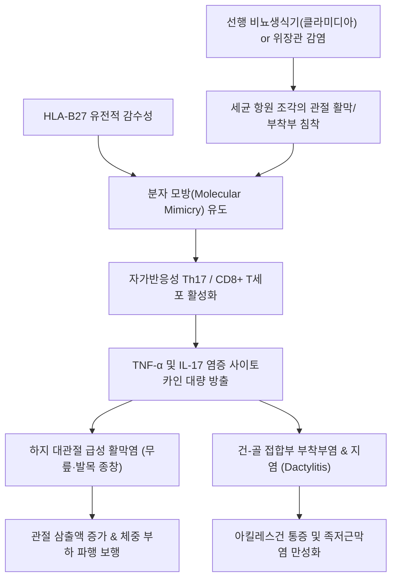

# 🩺 반응성 관절염 (Reactive Arthritis)

> **상위 분류**: [[근골격계 질환]] > [[하지 질환]] > [[척추관절염]] / [[류마티스 및 전신 질환]]
> **핵심 3줄 요약 (Key Summary)**:
> - 📍 병소 부위 & 해부·병태생리: 비뇨생식기([[클라미디아]] 등) 또는 위장관(살모넬라, 시겔라, 여시니아, 캄필로박터 등) 감염 후 1~4주 뒤, 유전적 소인([[HLA-B27]])을 가진 환자에서 분자 모방(Molecular mimicry)과 면역 이상으로 인해 발생하는 **무균성 자가면역 척추관절염**.
> - 🚩 전형적 임상 양상: 고전적 3대 징후인 **"관절염(하지 비대칭 올리고관절염), 비임균성 요도염/자궁경부염, 결막염/포도막염"**, 손발가락이 소시지처럼 퉁퉁 붓는 **지염(Dactylitis)**, 아킬레스건 부착부염(Enthesitis), 환상 귀두염(Circinate balanitis).
> - 🛠️ 핵심 검사 & 치료 전략: 관절 천자(무균성 활액 확인으로 화농성 관절염 배제), 선행 감염원 PCR/배양 검사, 급성기 습열독(濕熱毒) 제거 한약([[용담사간탕]], [[사묘환]]) 및 소염/신바로약침, 양방 1차 NSAIDs 및 활동성 클라미디아 항생제 병용.
> - ⚠️ 응급 의뢰 레드플래그: 단일 관절의 극심한 발열과 농성 삼출액은 급성 화농성 관절염(Septic arthritis) 배제 전까지 응급 관절 천자 및 정형외과 배농 의뢰 필수! 급성 전방 포도막염(안통, 시력 저하) 발생 시 즉시 안과 응급 전원.

---

## 📌 목차
1. [질환 개요 & 해부학적 병태생리](#1-질환-개요--해부학적-병태생리)
2. [병태생리 메커니즘 & 생체역학적 악순환 네트워크](#2-병태생리-메커니즘--생체역학적-악순환-네트워크)
3. [임상 증상 & 이학적 검사(Physical Exam) 알고리즘](#3-임상-증상--이학적-검사physical-exam-알고리즘)
4. [감별 진단 매트릭스 (Differential Diagnosis)](#4-감별-진단-매트릭스--differential-diagnosis)
5. [한의 통합 치료 프로토콜 (침·약침·추나·한약)](#5-한의-통합-치료-프로토콜-침약침추나한약)
6. [양방 치료 & 병용·의뢰 기준 (Conventional Treatment & Referral)](#6-양방-치료--병용의뢰-기준-conventional-treatment--referral)
7. [재활 운동 & 생활습관 티칭 가이드](#7-재활-운동--생활습관-티칭-가이드)
8. [💡 사용자 진료실 핵심 필기 & 임상 노하우 (Melt-In 잔여 심화 집약)](#8--사용자-진료실-핵심-필기--임상-노하우--melt-in-잔여-심화-집약)
9. [출처 및 학술 참고 문헌 (References)](#9-출처-및-학술-참고-문헌--references)

---

## 1. 질환 개요 & 해부학적 병태생리

### 1.1 개요 및 역학
**반응성 관절염(Reactive Arthritis, ReA)**은 신체 원격 부위(비뇨생식기 또는 위장관)의 감염이 발생한 후 촉발되는 전신성 염증성 질환으로, 과거 **라이터 증후군(Reiter's syndrome)**으로 불렸다. 혈청 음성 척추관절염(Seronegative Spondyloarthritis) 질환군에 속한다.
- **호발 연령 및 성별**: 20~40대 젊은 성인에서 호발한다. 비뇨생식기 감염 후 관절염은 남성에서 5~10배 흔하며, 장관 감염 후 관절염은 남녀 비율이 거의 동일하다.
- **주요 원인균**:
  - **비뇨생식기성**: *Chlamydia trachomatis* (가장 흔함, 약 50% 이상).
  - **장인성**: *Salmonella enteritidis*, *Shigella flexneri*, *Yersinia enterocolitica*, *Campylobacter jejuni*, *Clostridioides difficile* (Iglesias Iglesias et al., 2026).
- **유전적 소인**: 환자의 약 60~85%에서 **[[HLA-B27]]** 유전자 양성을 보이며, 양성 환자에서 중증도와 만성화율, 척추 침범 및 포도막염 동반율이 현저히 높다.

![[화농성관절염_관절강천자_화농성_활액삼출물_임상사진.jpg|400]]
> [그림 1: 반응성 관절염의 무균성 활액 확인 및 급성 화농성 관절염 감별을 위한 관절강 천자 활액 소견 — 임상사진]

---

## 2. 병태생리 메커니즘 & 생체역학적 악순환 네트워크

### 2.1 분자생물학적 기전: 선행 감염과 분자 모방 (Molecular Mimicry)
반응성 관절염은 관절 내에 세균이 직접 증식하는 화농성 감염이 아니며, **면역 매개성 무균 염증**이다.
1. **점막 장벽 침투 및 세균 항원 이동**: 장 또는 비뇨기 점막을 통해 침투한 병원체 항원(LPS, 세균 DNA/RNA 편모 조각)이 단핵구/대식세포에 포식되어 림프관 및 혈류를 타고 원격 관절 활막 및 골-건 부착부(Enthesis)로 운반된다.
2. **분자 모방 및 자가반응 T세포 활성화**: 세균 펩타이드 항원이 숙주의 HLA-B27 분자와 구조적으로 유사하여, 항원제시세포에 의해 활성화된 CD8+ 세포독성 T세포 및 Th17 세포가 관절 연골과 활막 자가항원을 오인 공격한다.
3. **염증성 사이토카인 연쇄 분비**: TNF-α, IL-17, IL-23, IFN-γ가 대량 분비되어 활막세포 증식, 호중구 침윤 및 부착부염(Enthesitis)을 유발한다 (Khawar et al., 2026).

![[슬관절_활액낭_추벽_해부도_Gray347.png|400]]
> [그림 2: 반응성 올리고관절염 호발 슬관절의 활막 및 관절강 해부학적 구조 — Gray's Anatomy]

![[류마티스관절염_활막염_판누스_병태도해.jpg|400]]
> [그림 3: 감염 후 분자 모방 및 자가면역 활막염 병태도해 — 면역병태도]

### 2.2 생체역학적 악순환 네트워크

---

## 3. 임상 증상 & 이학적 검사(Physical Exam) 알고리즘

### 3.1 4대 임상 징후 및 전신 증상
1. **비대칭성 하지 올리고관절염 (Asymmetric Oligoarthritis)**:
   - 선행 감염 후 1~4주 뒤 발생.
   - 주로 **무릎(슬관절), 발목(족관절), 중족지관절** 등 하지의 큰 관절 1~4개에 비대칭적으로 극심한 부종, 발적, 열감 발생.
2. **지염 (Dactylitis, '소시지 손발가락')**:
   - 손가락이나 발가락 전체가 소시지처럼 미만성으로 퉁퉁 붓고 굽히기 힘듦. 굴곡건초염과 인접 지간관절염이 동시에 병발한 특징적 징후.
3. **부착부염 (Enthesitis)**:
   - 아킬레스건 부착부 및 족저근막 종골 부착부의 심한 보행 통증.
4. **점막 및 피부 병변**:
   - **비임균성 요도염 / 자궁경부염**: 배뇨통, 요도 분비물.
   - **결막염 / 급성 전방 포도막염**: 양안 충혈, 눈부심, 안통.
   - **환상 귀두염 (Circinate balanitis)**: 음경 귀두부의 무통성 천표성 미란.
   - **농포성 각화증 (Keratoderma blennorrhagicum)**: 손바닥과 발바닥에 발생하는 농포성 건선 유사 과각화 인설.

![[화농성관절낭염_슬개전점액낭염_급성종창_임상사진.jpg|400]]
> [그림 4: 비대칭성 하지 올리고관절염 및 활액낭 종창 임상 소견 — 임상사진]

![[무릎염좌_05_술기실사_측부인대_자침치료.jpg|400]]
> [그림 5: 슬관절 주변 부착부염(Enthesitis) 및 활막염 완화를 위한 침구 치료 실사 — 한의 임상술기]

![[발허리뼈골절_05_술기실사_족부침치료.jpg|400]]
> [그림 6: 족부 지염(Dactylitis, 소시지 발가락) 및 족저근막 부착부 소염을 위한 침구 치료 실사 — 한의 임상술기]

### 3.2 진단 및 검사 알고리즘
1. **관절액 분석 (Joint Fluid Aspiration — 최우선 감별)**:
   - 백혈구 수치 2,000~50,000/μL 수준의 염증성 활액.
   - **그람염색 및 세균 배양 음성** (무균성 확인), **편광현미경 결정 음성** (통풍/가성통풍 배제).
2. **선행 감염원 확인**:
   - 첫 소변 *Chlamydia trachomatis* NAAT/PCR 검사.
   - 대변 배양 검사 (최근 설사 병력 시).
3. **혈액 검사**:
   - ESR, CRP 현저한 상승. 류마티스 인자(RF) 및 Anti-CCP 음성. HLA-B27 양성 여부 확인.

---

## 4. 감별 진단 매트릭스 (Differential Diagnosis)

| 감별 질환 | 호발 부위 및 관절 침범 패턴 | 관절액 소견 | 동반 임상 특징 | 결정적 감별 포인트 |
| :--- | :--- | :--- | :--- | :--- |
| **[[반응성 관절염]]** | **하지 비대칭 올리고관절**(무릎·발목) | **무균성 염증액**, 결정 음성 | 요도염, 결막염, 소시지 발가락(지염) | **선행 요도염/장염 병력(1~4주 전), HLA-B27 (+)** |
| **[[화농성 관절염]]** | 주로 단일 관절(단관절염) | **백혈구 >50,000/μL, 그람염색(+)** | 전신 고열, 오한, 패혈증 징후 | 관절 천자 시 농성 액체, 즉시 응급 배농 |
| **파종성 임균 감염(DGI)** | 유주성 관절통 후 건초염 | 임균 배양/PCR 양성 | 피부 출혈성 농포 병변 | 최근 위험 성접촉력, 테트라사이클린/세프트리악손 반응 |
| **[[결정성 관절염]](통풍)** | 제1 중족족지관절(1st MTP) | **바늘형 요산 결정(MSU) 확인** | 고요산혈증, 음주 후 야간 격통 | 편광현미경 음성 복굴절 바늘 |
| **[[강직성 척추염]]** | 천장관절, 척추 축성 관절 | 만성 무균성 삼출액 | 3개월 이상 조조강직, 염증성 요통 | 천장관절 X-ray상 골미란/경화 |

---

## 5. 한의 통합 치료 프로토콜 (침·약침·추나·한약)

### 5.1 침구 치료 (청열제습 및 부착부 순환 촉진)
- **혈위 선정**:
  - 슬관절: 독비(ST35), 내슬안, 음릉천(SP9), 양릉천(GB34), 슬양관(GB33), 혈해(SP10).
  - 족부/발목: 곤륜(BL60), 태계(KI3), 구허(GB40), 상구(SP5), 해계(ST41), 조해(KI6).
  - 전신 청열 혈위: 곡지(LI11), 합곡(LI4), 족삼리(ST36).
- **자침 기법**:
  - 급성 관절염 및 지염 부위는 침습적 자극을 피하고 관절 주변부 피내침 및 2~4Hz 저주파 전침을 적용하여 활막 부종을 완화.
  - 아킬레스건 및 족저근막 부착부염(Enthesitis) 부위에는 0.25×30mm 호침으로 완만한 직자입을 통해 국소 미세혈류를 개선.

### 5.2 약침 치료 (Pharmacopuncture)
- **황련해독탕 약침 / 소염약침**: 급성기 국소 열감과 활막염 완화를 위해 1.0~2.0cc를 관절강 주변 지지 인대 및 활액낭 주위에 주입하여 염증성 사이토카인 활성을 억제.
- **신바로약침**: 아급성기 인대 및 연골 보호를 위해 주 2회 시술.

### 5.3 한약 치료 (변증 치료)
- **습열독성(濕熱毒盛) 단계 (급성 활동기)**:
  - 관절이 붉게 붓고 열이 나며 요도 분비물, 배뇨통, 결막 충혈이 동반된 전형적 발병기.
  - 처방: [[용담사간탕]] 합 [[사묘환]] 가감 (용담초, 황백, 창출, 차전자, 의이인, 목통, 토복령, 패장초 배합). 하초(下焦)의 습열독을 소변과 대변으로 신속히 배출시키고 자가면역 염증을 진정시킴.
- **풍한습비 및 간신휴허(風寒濕痺·肝腎虧虛) 단계 (아급성·만성기)**:
  - 급성 염증은 가라앉았으나 관절 강직감과 관절통, 피로감이 수개월간 지속되는 경우.
  - 처방: [[독활기생탕]], [[당귀점통탕]] 가미 (우슬, 두충, 속단, 상기생 배합). 관절 결합조직을 보강하고 만성 척추관절병증 이행을 방지.

---

## 6. 양방 치료 & 병용·의뢰 기준 (Conventional Treatment & Referral)

### 6.1 일차 약물 치료
- **선행 감염 항균 치료**:
  - 활동성 *Chlamydia trachomatis* 비뇨기 감염이 확인된 경우: **독시사이클린(Doxycycline 100mg bid 7일)** 또는 아지스로마이신(Azithromycin 1g 단회 투여). 성 파트너 동반 치료 필수.
  - (주의: 장관 감염 후 반응성 관절염은 이미 세균이 배출된 상태이므로 루틴 항생제 투여는 권장되지 않음).
- **NSAIDs**: 인도메타신(Indomethacin), 나프록센 등 고용량 1차 표준 투여로 관절통 및 조조강직 완화.
- **관절강 내 스테로이드 주사**: NSAIDs에 반응하지 않는 단관절/올리고관절염 환자에게 트리암시놀론 국소 침윤.

### 6.2 만성기 DMARDs 및 표적 치료제 (Arfeen et al., 2026)
- 3개월 이상 지속되는 불응성 만성 관절염 환자:
  - **설파살라진(Sulfasalazine)**: 1차 경구 항류마티스제.
  - **TNF-α 억제제(Infliximab, Adalimumab)** 또는 **Apremilast(PDE4 억제제)**: 난치성 축성 침범 및 부착부염에 고려.

---

## 7. 재활 운동 & 생활습관 티칭 가이드

### 7.1 관절 보호 및 운동 요법
- **급성 부종기**: 과도한 체중 부하를 피하고 안정(Rest) 취하되, 완전 부동화는 관절 강직을 유발하므로 하루 2~3회 무부하 상태에서 부드러운 수동 관절 가동(PROM) 운동 시행.
- **회복기**: 수영, 실내 자전거 등 관절 충격이 적은 유산소 운동을 통해 대퇴사두근과 하퇴 근력을 회복.
- **아킬레스건 스트레칭**: 벽 밀기 스트레칭을 통해 단축된 후방 근막을 신장하여 부착부염 재발 방지.

### 7.2 안전한 생활습관 티칭
- 성매개 비뇨기 감염 재발 방지를 위해 완치 판정 시까지 성관계 금기 및 콘돔 사용 지도.
- 식중독 예방을 위한 위생적인 음식 조리 습관 지도.

---

## 8. 💡 사용자 진료실 핵심 필기 & 임상 노하우 (Melt-In 잔여 심화 집약)

### 8.1 젊은 남성이 한쪽 무릎이 부어서 왔을 때 반드시 물어봐야 할 3가지
- 20~30대 건장한 청년이 특별히 다친 적도 없는데 한쪽 무릎이나 발목이 터질 듯이 부어서 내원하면 디스크나 단순 염좌로 넘기면 안 된다.
- 반드시 다음 세 가지를 진료실에서 차분히 문진해야 한다:
  1. **"최근 2~4주 사이에 소변볼 때 찌릿하거나 요도에서 분비물이 나온 적이 있습니까?" (클라미디아 요도염)**
  2. **"최근 심한 장염이나 설사를 앓은 적이 있습니까?" (살모넬라/시겔라 장염)**
  3. **"눈이 빨갛게 충혈되거나 눈부심이 있습니까?" (결막염/포도막염)**
- 여기에 발가락이 소시지처럼 부어있는 지염(Dactylitis)이 관찰된다면 99% 반응성 관절염이다.

### 8.2 화농성 관절염과의 감별을 놓치면 다리를 잃는다
- 반응성 관절염은 무균성 면역 질환이지만, 초기 임상 양상은 관절이 뻘겋게 붓고 열이 나 화농성 관절염(Septic arthritis)과 매우 흡사하다.
- 화농성 관절염은 하루만 방치해도 세균 효소에 의해 관절 연골이 녹아내려 영구 장애가 남는다.
- 환자가 고열(38.3℃ 이상)과 오한을 동반하고 무릎을 1도도 움직이지 못한다면, 지체 없이 정형외과나 응급실로 보내 관절 천자(Arthrocentesis) 및 그람염색을 받게 해야 한다.

---

## 9. 출처 및 학술 참고 문헌 (References)

1. **Khawar Z et al. (2026)**. When the Infection Clears but Inflammation Persists: A Case of Chlamydia-Associated Reactive Arthritis Requiring Disease-Modifying Antirheumatic Drug (DMARD) Therapy. *Cureus*. 18(2):e101878. [PMID: 41728514](https://pubmed.ncbi.nlm.nih.gov/41728514/)
   - *[연구 요약]*: 클라미디아 감염 후 항생제 치료로 병원체가 제거된 이후에도 지속되는 자가면역성 반응성 관절염의 분자면역학적 병태생리와 DMARDs 치료 반응을 분석한 증례 및 종설.

2. **Arfeen N et al. (2026)**. Apremilast as an Adjuvant in Refractory Reactive Arthritis: A Retrospective Observational Study. *Cureus*. 18(3):e104968. [PMID: 41970101](https://pubmed.ncbi.nlm.nih.gov/41970101/)
   - *[연구 요약]*: 기존 NSAIDs 및 1차 면역억제제에 불응하는 난치성 반응성 관절염 환자에서 PDE4 억제제(Apremilast)의 말초 관절염 및 부착부염 조절 효과를 평가한 후향적 연구.

3. **Iglesias Iglesias C et al. (2026)**. Reactive arthritis due to Clostridioides difficile: A new case, literature review and role of toxin B. *Enferm Infecc Microbiol Clin (Engl Ed)*. :503225. [PMID: 42498595](https://pubmed.ncbi.nlm.nih.gov/42498595/)
   - *[연구 요약]*: 클로스트리디오이데스 디피실 감염 후 유발되는 반응성 관절염의 독소 B 매개 면역 병태생리와 장관 감염 후 관절염의 최신 임상 지침 고찰.

4. **Kobayashi S et al. (2025)**. Post-COVID-19 arthritis: viral arthritis, not reactive arthritis. *EULAR Rheumatol Open*. 1(3):472-474. [PMID: 42367654](https://pubmed.ncbi.nlm.nih.gov/42367654/)
   - *[연구 요약]*: 바이러스성 감염 후 발생하는 관절염과 세균성 감염 후 자가면역 척추관절염인 반응성 관절염 간의 임상 양상, 지속 기간 및 병태생리학적 감별 지침을 제시함.
