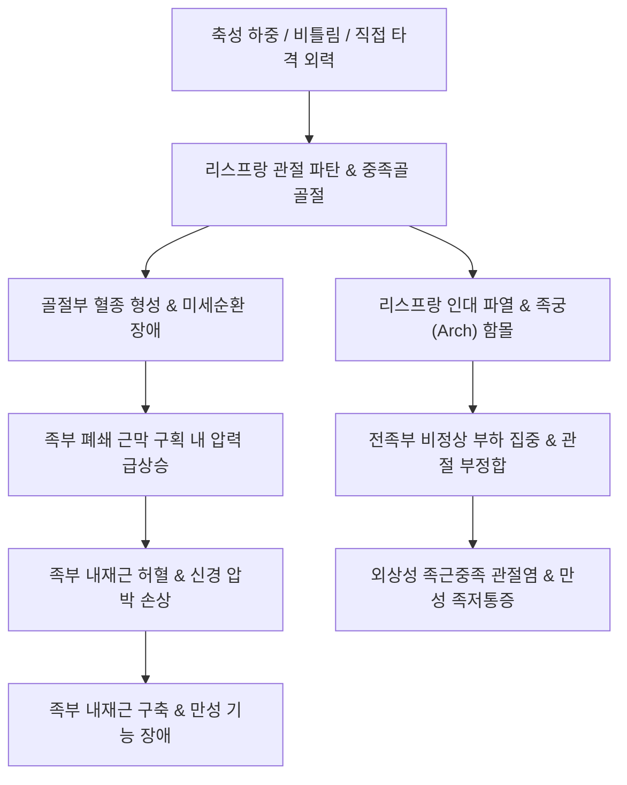

# 🩺 발 골절 (Foot Fracture)

> **핵심 3줄 요약 (Key Summary)**:
> - 📍 **병소 부위 & 해부·병태생리**: 족근골(후족부·중족부)과 중족골(전족부)에 발생하는 골절로, 리스프랑 관절 손상(Lisfranc injury) 및 제5중족골 기저부 골절(Jones fracture / Avulsion fracture), 중족골 피로골절(행군 골절)이 임상적으로 가장 중요함.
> - 🚩 **전형적 임상 양상**: 족부 직접 타박 또는 족관절 족저굴곡-회전 손상 후 족배부 및 족저부의 심한 부종, 반상출혈, 국소 압통, 보행 및 체중 부하 불능. 리스프랑 손상 시 족저부(Plantar ecchymosis) 피하 출혈반이 특징적임.
> - 🛠️ **핵심 검사 & 치료 전략**: 족부 3방향 X-ray(AP, Lateral, Oblique) 및 체중부하 촬영으로 중족골 정렬과 관절 간격 판정. 비전위 골절은 단하지 깁스 또는 보조기화(CAM boot) 및 한의 활혈·접골 치료; 전위성 리스프랑 손상 및 존스 골절은 K-강선, 나사/금속판 내고정술(ORIF) 의뢰.
> - ⚠️ **응급 의뢰 레드플래그**: 족부 구획증후군 의심 징후(극심한 자발통, 수동 신전 시 극통, 감각 마비), 족배동맥(Dorsalis pedis) 박동 소실 및 족부 냉감, 개방성 골절, 탈구를 동반한 심한 족부 외형 변형.

---

## 📌 목차
1. [질환 개요 & 해부학적 병태생리](#1-질환-개요--해부학적-병태생리)
2. [병태생리 메커니즘 & 생체역학적 악순환 네트워크](#2-병태생리-메커니즘--생체역학적-악순환-네트워크)
3. [임상 증상 & 이학적 검사(Physical Exam) 알고리즘](#3-임상-증상--이학적-검사physical-exam-알고리즘)
4. [감별 진단 매트릭스 (Differential Diagnosis)](#4-감별-진단-매트릭스-differential-diagnosis)
5. [한의 통합 치료 프로토콜 (침·약침·추나·한약)](#5-한의-통합-치료-프로토콜-침약침추나한약)
6. [양방 치료 & 병용·의뢰 기준 (Conventional Treatment & Referral)](#6-양방-치료--병용의뢰-기준-conventional-treatment--referral)
7. [재활 운동 & 생활습관 티칭 가이드](#7-재활-운동--생활습관-티칭-가이드)
8. [💡 사용자 진료실 핵심 필기 & 임상 노하우 (Melt-In 잔여 심화 집약)](#8--사용자-진료실-핵심-필기--임상-노하우-melt-in-잔여-심화-집약)
9. [출처 및 학술 참고 문헌 (References)](#9-출처-및-학술-참고-문헌-references)

---

## 1. 질환 개요 & 해부학적 병태생리

발(Foot)은 총 26개의 골격과 수많은 관절 및 인대로 이루어져 있으며, 해부학적으로 **후족부(Hindfoot: 거골, 종골)**, **중족부(Midfoot: 주상골, 입방골, 3개의 설상골)**, **전족부(Forefoot: 5개의 중족골, 14개의 족지골)**의 3대 기능 영역으로 구분된다. 발 골절은 직립 보행 시 체중 분산과 충격 흡수를 담당하는 족부 아치(Longitudinal and transverse arches)의 구조적 파탄을 유발한다.

임상에서 흔히 접하는 대표적 골절 유형은 다음과 같다:
1. **리스프랑 관절 손상 (Lisfranc Fracture-Dislocation)**:
   - 족근골(설상골·입방골)과 중족골 기저부를 잇는 족근중족 관절(Tarsometatarsal joint)의 손상이다.
   - 내측 설상골과 제2 중족골 기저부를 견고하게 결속하는 **리스프랑 인대(Lisfranc ligament)**가 파열되거나 견인 골절을 일으킬 때 발생하며, 방사선상 2mm 이상의 이개(Diastasis)가 관찰된다.
2. **제5중족골 기저부 골절 (Fractures of the Base of the Fifth Metatarsal)**:
   - **Zone 1 (견열 골절 / Tuberosity Avulsion)**: 단비골근건(Peroneus brevis tendon) 및 족저근막 외측대 견인에 의한 조면 결열 골절. 골유합이 양호한 'Pseudo-Jones' 골절.
   - **Zone 2 (존스 골절 / Jones Fracture)**: 제4-5 중족골간 관절면으로 연장되는 간부-골간단 경계부(Metaphyseal-diaphyseal junction) 횡골절. 미세 혈류 공급이 취약한 분수계(Watershed area)로, [[불유합]] 및 지연유합의 위험이 극히 높음.
   - **Zone 3 (피로 골절 / Stress Fracture)**: 원위 간부 부위로 반복적 하중에 의한 골절.
3. **피로 골절 (Stress Fracture / 행군 골절, March Fracture)**:
   - 제2, 제3 중족골 간부에서 흔하며, 군사 훈련이나 마라톤 등 반복적 과부하로 인해 골 흡수가 골 형성을 초과하여 발생한다.

![[발골절_01_병태도해_리스프랑관절_손상분류.png]]
> [그림 1: ① 병태생리·도해 — 리스프랑 관절(Lisfranc joint)의 해부학적 배열선 및 이개 손상 기전 모식도 (Wikimedia Commons)]

![[발골절_01_영상의학_제5중족골_존스골절_Xray.jpg]]
> [그림 2: ① 병태생리·영상 — 제5중족골 기저부 간부-골간단 경계부의 전형적인 존스 골절(Jones fracture) 단순 방사선 소견 (Wikimedia Commons)]

---

## 2. 병태생리 메커니즘 & 생체역학적 악순환 네트워크

족부 골격은 '로만 아치(Roman Arch)' 형태를 이루며, 쐐기 모양의 설상골들과 제2 중족골이 둥근 천장의 쐐기돌(Keystone) 역할을 수행한다. 제2 중족골 기저부는 제1, 제3 중족골에 비해 근위부로 깊숙이 박혀 있는 장부(Mortise) 구조를 형성하여 중족부의 횡적 안정성을 유지한다.

발 골절 발생 시 생체역학적 파탄과 부종 형성 과정은 다음과 같다:

![[발골절_02_해부도해_족부골격_배측인대_Gray355.png]]
> [그림 3: ② 관련 해부 구조물 — 족부 종아치와 횡아치를 지지하는 족저 인대 복합체 해부도 (Henry Gray, Anatomy of the Human Body)]

---

## 3. 임상 증상 & 이학적 검사(Physical Exam) 알고리즘

### 1) 주요 임상 증상
- **족배부 및 전족부 통증**: 수상 부위의 국소적 압통과 체중 부하 시 날카로운 찌르는 듯한 통증.
- **특징적 족저 반상출혈 (Plantar Ecchymosis)**: 발바닥 중앙부 또는 내측 아치 족저면에 멍(출혈반)이 보이면 **리스프랑 손상의 병변 특이적 징후(Pathognomonic sign)**로 간주한다.
- **보행 장애 및 족부 변형**: 환자는 뒤꿈치로만 디디거나 체중 부하를 전면 거부하며, 중족부 불안정 시 발이 편평해지는 편평족 변형이 관찰된다.

### 2) 이학적 검사 알고리즘
- **피아노 건 검사 (Piano Key Test)**: 의심되는 중족골두를 잡고 배측 및 족저 방향으로 흔들 때 중족관절 기저부에 격통 유발.
- **중족부 회내-외전 유발 검사 (Pronation-Abduction Test)**: 후족부를 고정하고 전족부를 수동적으로 외전 및 회내시킬 때 리스프랑 관절부 통증 재현.
- **단비골근 저항 검사**: 족관절을 외번(Eversion)시킬 때 제5중족골 기저부 통증 악화 (Zone 1 골절 감별).
- **방사선 검사**:
  1. **족부 3방향 (AP, Lateral, Oblique)**:
     - AP 뷰: 제1 중족골 외측연과 내측 설상골 외측연, 제2 중족골 내측연과 중간 설상골 내측연의 일치선 확인.
     - Oblique 뷰: 제3 중족골 내측연과 외측 설상골 내측연, 제4 중족골 내측연과 입방골 내측연의 정렬 확인.
  2. **체중부하 방사선(Weight-bearing X-ray)**: 미세 리스프랑 손상에서 이개 간극 확인.
  3. **CT / MRI**: 잠재 골절, 미세 인대 견열 골절, 조기 피로골절 확진.

---

## 4. 감별 진단 매트릭스 (Differential Diagnosis)

| 감별 질환 | 손상 기전 및 호발 부위 | 주요 증상 및 징후 | 방사선 및 영상 소견 | 예후 및 관리 원칙 |
| :--- | :--- | :--- | :--- | :--- |
| **[[발 골절]] (리스프랑 손상)** | 발끝 서기 상태에서 족저굴곡 낙상 | 족저부 반상출혈, 중족부 심한 부종 | 제1-2 중족골간 간격 2mm 이상 이개 | 전위 시 관혈적 정복 및 나사 고정 필수 |
| **제5중족골 존스 골절 (Zone 2)** | 족부 내번 및 축성 하중 | 제5중족골 외측 기저부 압통 | 간부-골간단 경계부 횡골절 | 불유합 빈발, 보존 깁스 6~8주 또는 수술 |
| **제5중족골 결열 골절 (Zone 1)** | 급격한 족관절 내번 염좌 | 외측 복사뼈 하방 조면 압통 | 조면 분리 골편, 성장판 방향과 직각 | 4~6주 보조기화 착용으로 양호한 골유합 |
| **중족골 피로 골절 (March fx)** | 마라톤, 군사 훈련 등 만성 과부하 | 초기 경미한 족배통, 점진적 악화 | 초기 방사선 음성, 2~3주 후 골막 반응 | 체중 부하 제한, 활동 조절로 자연 유합 |
| **단순 족배부 염좌** | 경미한 뒤틀림 외상 | 국소 연부조직 압통, 족저 출혈반 없음 | 골절선 및 관절 간극 이개 없음 | 1~2주 소염진통 및 침 치료로 호전 |

---

## 5. 한의 통합 치료 프로토콜 (침·약침·추나·한약)

발 골절의 한의 치료는 **급성기 부종 소퇴 및 미세구획 순환 개선, 아급성기 골유합 가속화, 기능 회복기 족궁 지지근 강화 및 보행 안정화**를 목표로 진행한다.

### 1) 시기별 단계적 치료 프로토콜
- **1단계 (급성기 / 0~2주)**: 활혈화어(活血化瘀), 소종지통(消腫止痛). 골절 주변부 부종 흡수 및 통증 억제.
  - 대표 처방: [[당귀수산]](當歸鬚散) 가미방.
- **2단계 (아급성 골유합기 / 2~6주)**: 접골속근(接骨續筋), 익기양혈(益氣養血). 조골세포 활성화 및 가골 형성 촉진.
  - 대표 처방: [[자연동]](自然銅, 산골) 배합 접골단(接骨丹), 복원활혈탕(復元活血湯).
- **3단계 (회복 및 재활기 / 6~12주)**: 보익간신(補益肝腎), 강근골(强筋骨). 족관절 및 족부 관절 강직 예방, 족저근막 유연성 회복.
  - 대표 처방: [[독활기생탕]](獨活寄生湯), [[오적산]](五積散).

### 2) 주요 혈위 침구 치료
- **국소 취혈**: [[함곡]](ST43), [[내정]](ST44), [[태충]](LR3), [[족임읍]](GB41), [[구허]](GB40). 중족골간 신경혈관 주행로를 자극하여 부종 배출 및 진통 촉진.
- **원위 취혈**: [[족삼리]](ST36), [[양릉천]](GB34, 근회), [[현종]](GB39, 골회), 삼음교(SP6). 하지 전반의 혈행 개선 및 골대사 촉진.
- **약침 치료**: 신바로약침(관절 주위 염증 제어), 중성어혈약침(국소 어혈 및 반상출혈 분해), 황련해독약침(급성기 열감 및 염증 완화).

![[발골절_05_술기실사_위경_함곡_내정_자침도해.jpg]]
> [그림 4: ③ 치료·시술점 — 족배부 중족골간 통증 제어를 위한 위경 함곡(ST43) 및 내정(ST44) 자침 도해 (Wellcome Collection)]

---

## 6. 양방 치료 & 병용·의뢰 기준 (Conventional Treatment & Referral)

> 🎯 **이 섹션의 목적**: 발 골절은 조기 진단 실패 시 평생 지속되는 외상성 관절염과 보행 장애를 초래할 수 있다. 한의사는 보존적 치료 적응증과 수술적 의뢰 기준을 명확히 구분하여 대처해야 한다.

### 1) 양방 보존적 치료 vs 수술적 내고정술
- **보존적 치료**:
  - 전위가 없는 단순 중족골 골절, 제5중족골 Zone 1 견열 골절, 2mm 미만 무전위 리스프랑 손상.
  - 단하지 석고 붕대(Short leg cast) 또는 단단한 밑창의 탈착식 보조기(CAM boot) 4~6주 적용.
- **외과적 수술 적응증**:
  - 리스프랑 관절의 2mm 이상 이개 또는 관절면 불일치.
  - 운동선수 또는 활동적인 환자의 제5중족골 존스 골절 (골수강내 유관나사 고정술).
  - 다발성 중족골 골절 및 10° 이상의 시상면 각형성(Sagittal angulation) 전위.

![[발골절_06_양방치료_제5중족골_골절_내고정술_Xray.jpg]]
> [그림 5: 양방 치료 — 불유합 고위험군 존스 골절의 골수강내 유관나사(Intramedullary screw) 내고정술 방사선 소견 (Wikimedia Commons)]

### 2) 응급 및 정형외과 전원 기준
- **족부 구획증후군(Foot Compartment Syndrome)**: 전족부 및 족저부의 심한 팽윤, 수동적 발가락 신전 시 발생하는 마약성 진통제로 조절되지 않는 격심한 통증.
- 족배동맥(Dorsalis pedis artery) 맥박 소실, 모세혈관 재충혈 시간 2초 초과.
- 피부 천공을 동반한 개방성 골절.
- 체중부하 방사선상 명확한 리스프랑 관절 이탈구 확인 시.

---

## 7. 재활 운동 & 생활습관 티칭 가이드

골유합이 확인된 후 점진적인 가동 범위 회복과 족부 내재근 강화를 통해 정상적인 보행 패턴(Gait cycle)을 회복한다.

### 1) 단계별 재활 운동
- **초기 (체중 부하 제한기 / 2~6주)**:
  - 족지 능동 굴곡-신전 운동(Active Toe Flexion/Extension).
  - 족관절 회전 및 펌핑 운동을 통한 혈류 정체 방지.
- **중기 (부분 체중 부하 및 족재근 훈련 / 6~8주)**:
  - 발가락 수건 끌어당기기(Towel Curls): 의자에 앉아 발가락 힘으로 바닥의 수건을 당겨 족저 내재근 강화.
  - 족저건막 및 종아리 복합체 스트레칭.
- **후기 (전체중 부하 및 고유수용감각 / 8~12주)**:
  - 밸런스 패드(Balance pad) 기립 및 단하지 서기(Single leg stance) 훈련.

![[발골절_07_재활운동_족저건막_족재근_스트레칭.jpg]]
> [그림 6: 재활 운동 — 족부 아치 재건 및 중족골 부하 분산을 위한 족부 내재근(Intrinsic foot muscles) 강화 운동]

---

## 8. 💡 사용자 진료실 핵심 필기 & 임상 노하우 (Melt-In 잔여 심화 집약)

- **존스 골절과 견열 골절을 혼동하지 말 것**:
  - 발목을 삐끗해서 온 환자가 제5중족골 기저부 압통을 보일 때 단순 염좌나 단순 견열 골절(Zone 1)로 치부해서는 안 된다.
  - 골절선이 제4-5 중족골간 관절면에 닿아 있는 Zone 2(존스 골절)라면, 단순 반깁스로는 30~50%에서 불유합이 발생한다. 반드시 정확한 X-ray 사위상(Oblique view)을 확인하고 체중 부하를 철저히 차단해야 한다.
- **발바닥 멍(Plantar Ecchymosis)의 무서움**:
  - 환자가 "발등을 삐끗했다"고 호소하며 내원했는데 발바닥 중앙에 검붉은 멍이 퍼져 있다면, 방사선상 뚜렷한 골절이 보이지 않더라도 **리스프랑 관절 인대 손상**을 90% 이상 의심해야 한다.
  - 이를 놓치고 단순 염좌로 침 치료만 하다 체중을 실으면, 수개월 후 족궁이 주저앉고 극심한 외상성 관절염으로 걸을 수 없게 된다. 반드시 정형외과 족부 전문의에게 의뢰하여 CT 또는 체중부하 방사선을 촬영하도록 해야 한다.
- **한약 투여를 통한 골절 치유 기간 단축**:
  - 중족골 피로골절이나 비전위성 골절 환자에게 깁스 적용과 함께 [[자연동]](산골) 배합 한약([[접골단]])을 4~6주 복용시키면 방사선상 골진(Callus) 형성이 대조군에 비해 현저히 빠르게 관찰되며, 임상적 압통 소실 시기도 크게 앞당길 수 있다.

---

## 9. 출처 및 학술 참고 문헌 (References)

1. Stover MD, Edelstein AI, Matson AP. (2025). Radiographic Outcomes of Open Reduction and Kirschner-Wire Fixation Versus Screw or Plate Fixation for Lisfranc Injuries: A Propensity Score-Weighted Comparative Study. *J Foot Ankle Surg*. PMID: 42796020.

2. Cates NK, Lalli TA. (2024). Lisfranc Fixation Utilizing Dorsomedial Plating Technique. *Foot Ankle Clin*, 29(4):559-570. PMID: 40098330.

3. Charles JP, Finestone AS, Milgrom C. (2025). Mechanical and physiological contributors to metatarsal structure and bone stress injury. *Bone*, 191:117362. PMID: 42425253.

4. Rivenburgh D. (2025). The Sports Med Foot/Ankle: Not Always a Sprain. *Clin Sports Med*. PMID: 42584046.

5. Nam EY, Lee YJ, Kim SH, Kang JW. (2023). Therapeutic Efficacy of Chinese Patent Medicine Containing Pyrite for Fractures: A Systematic Review and Meta-Analysis. *Medicina (Kaunas)*, 60(1):164. PMID: 38256337.

---

## 관련 노트

- [[발목 골절]]
- [[발가락 골절]]
- [[발꿈치뼈 골절]]
- [[종자골 골절]]
- [[자연동]]
- [[당귀수산]]
- [[독활기생탕]]
- [[불유합]]
