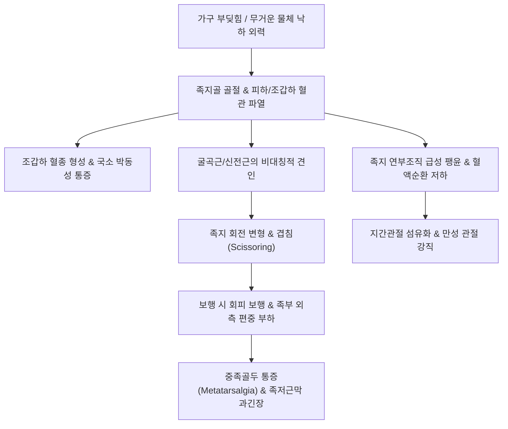

# 🩺 발가락 골절 (Toe Fracture / Phalangeal Fracture of the Foot)

> **핵심 3줄 요약 (Key Summary)**:
> - 📍 **병소 부위 & 해부·병태생리**: 제1지(무지, 2개 지골) 및 제2~5지(각 3개 지골)에 발생하는 골절로, 무지(Hallux)는 보행 시 체중의 40~50%를 지탱하므로 단순 소족지 골절과 분리하여 접근해야 함.
> - 🚩 **전형적 임상 양상**: 발가락 부딪힘(Stubbing trauma) 또는 중량물 낙하 후 극심한 국소 통증, 종창, 반상출혈, 보행 시 압통. 말절골 압궤 손상 시 조갑하 혈종(Subungual hematoma) 빈발.
> - 🛠️ **핵심 검사 & 치료 전략**: 족지 전후면 및 사위상 X-ray로 관절 침범 및 전위 여부 확인. 대부분의 비전위 소족지 골절은 동반 테이핑(Buddy taping) 및 단단한 밑창 신발로 치유; 무지의 관절내 전위 골절이나 소아 시모어 골절(Seymour fx)은 수술적 강선 고정 의뢰.
> - ⚠️ **응급 의뢰 레드플래그**: 족지 조갑판 탈구 및 조갑상 열상을 동반한 개방성 골절(골수염 위험), 족지 말단부의 청색증 및 모세혈관 재충혈 소실(디지털 혈류 차단), 심한 회전 변형 및 불완전 절단 의심 징후.

---

## 📌 목차
1. [질환 개요 & 해부학적 병태생리](#1-질환-개요--해부학적-병태생리)
2. [병태생리 메커니즘 & 생체역학적 악순환 네트워크](#2-병태생리-메커니즘--생체역학적-악순환-네트워크)
3. [임상 증상 & 이학적 검사(Physical Exam) 알고리즘](#3-임상-증상--이학적-검사physical-exam-알고리즘)
4. [감별 진단 매트릭스 (Differential Diagnosis)](#4-감별-진단-매트릭스-differential-diagnosis)
5. [한의 통합 치료 프로토콜 (침·약침·추나·한약)](#5-한의-통합-치료-프로토콜-침약침추나한약)
6. [양방 치료 & 병용·의뢰 기준 (Conventional Treatment & Referral)](#6-양방-치료--병용의뢰-기준-conventional-treatment--referral)
7. [재활 운동 & 생활습관 티칭 가이드](#7-재활-운동--생활습관-티칭-가이드)
8. [💡 사용자 진료실 핵심 필기 & 임상 노하우 (Melt-In 잔여 심화 집약)](#8--사용자-진료실-핵심-필기--임상-노하우-melt-in-잔여-심화-집약)
9. [출처 및 학술 참고 문헌 (References)](#9-출처-및-학술-참고-문헌-references)

---

## 1. 질환 개요 & 해부학적 병태생리

발가락 골절(Toe Fracture)은 족부 외상 중 가장 흔하게 접하는 질환으로, 무지(Great toe)의 기절골·말절골 2개와 제2~5 소족지(Lesser toes)의 기절골·중절골·말절골 12개, 총 14개의 족지골(Phalanges) 중 하나 이상에 골절이 발생하는 것을 말한다.

손상 기전에 따라 크게 두 가지로 분류된다:
1. **축성 충돌 손상 (Stubbing Injury)**: 보행 중 맨발로 가구나 문턱에 발가락 끝을 부딪히는 손상. 주로 제5족지(새끼발가락)의 기절골 경부나 간부에서 사상(Oblique) 또는 나선상(Spiral) 골절이 호발한다.
2. **압궤 손상 (Crush Injury)**: 무거운 물건이 발가락 위로 떨어지는 손상. 주로 말절골(Distal phalanx)의 분쇄 골절(Tuft fracture)을 일으키며, 조갑하 혈종(Subungual hematoma)과 조갑상(Nail bed) 파열을 흔히 동반한다.

임상적으로 **무지(제1족지) 골절과 소족지(제2~5족지) 골절은 엄격히 구별**된다:
- 무지는 정상 보행 시 체중의 40~50%를 지탱하고 보행 말기 추진력(Push-off)을 제공하는 핵심 구조물이다. 관절면 침범이나 부정유합 발생 시 보행 패턴 붕괴 및 퇴행성 관절염으로 이환되므로 적극적인 정복이 필요하다.
- 소족지는 경미한 각형성이나 단축이 발생해도 임상적 기능 장애가 드물어 보존적 치료로 원활히 회복된다.

![[발가락골절_01_병태도해_족지골_골격구조_Gray276.png]]
> [그림 1: ① 병태생리·도해 — 족지골(발가락뼈)의 기절골, 중절골, 말절골 골격 및 관절 구조 (Henry Gray)]

![[발가락골절_01_영상의학_발가락기절골_골절_Xray.jpg]]
> [그림 2: ① 병태생리·영상 — 외력 타박으로 발생한 족지 기절골의 사상 골절 방사선(X-ray) 소견 (Wikimedia Commons)]

---

## 2. 병태생리 메커니즘 & 생체역학적 악순환 네트워크

족지간 관절(Interphalangeal joint)과 중족족지 관절(MTP joint)은 강력한 족저판(Plantar plate)과 측부인대 복합체에 의해 지지된다. 지골 골절 시 장·단지굴근건 및 신근건의 불균형한 견인력에 의해 특징적인 각형성(Angulation) 및 회전 전위(Rotational deformity)가 유발될 수 있다.

![[발가락골절_02_해부도해_족지간관절_측부인대_Gray358.png]]
> [그림 3: ② 관련 해부 구조물 — 중족족지관절(MTP) 및 지간관절(IP)을 안정화하는 측부인대 및 족저판 도해 (Henry Gray)]

---

## 3. 임상 증상 & 이학적 검사(Physical Exam) 알고리즘

### 1) 주요 임상 증상
- **국소 종창 및 반상출혈**: 수상 직후 발가락 전체가 소시지처럼 붓고 보라색 피하 출혈이 관찰됨.
- **체중 부하 시 전족부 통증**: 발가락으로 지면을 차고 나갈 때 날카로운 통증 발생으로 파행(Limping).
- **조갑하 혈종**: 발톱 밑으로 검붉은 혈종이 차오르며, 팽창된 내압으로 인해 심장이 뛰는 듯한 박동성 격통(Throbbing pain) 발생.
- **회전 변형(Scissoring)**: 인접 발가락 위나 아래로 발가락이 교차하여 겹치는 회전 변형 확인.

### 2) 이학적 검사 및 진단 알고리즘
- **축성 압박 검사 (Axial Compression Test)**: 발가락 끝을 잡고 근위부 방향으로 가볍게 축성 압박을 가할 때 골절부에 국소 격통 유발.
- **회전 정렬 검사**: 모든 발가락을 가볍게 굴곡시켰을 때 발톱의 평면이 평행하고 모든 발가락 끝이 주상골 결절(Navicular tuberosity)을 향하는지 확인.
- **방사선 검사**:
  1. **족부 및 족지 전후면(AP) & 사위상(Oblique)**: 족지골의 피질골 연속성 단절 및 골편 분리 확인.
  2. 단순 타박상과 감별을 위해 관절면 침범(Intra-articular involvement) 및 2mm 이상의 전위 여부를 정밀 판독.

![[발가락골절_06_영상의학_발가락골절_임상방사선_Xray.jpg]]
> [그림 4: 양방 진단 — 발가락 외상 환자의 골절 전위 및 분쇄 정도를 평가하는 족지 전후면 방사선 소견 (Wikimedia Commons)]

---

## 4. 감별 진단 매트릭스 (Differential Diagnosis)

| 감별 질환 | 손상 기전 및 호발 부위 | 주요 증상 및 징후 | 영상 의학 소견 | 예후 및 치료 원칙 |
| :--- | :--- | :--- | :--- | :--- |
| **[[발가락 골절]]** | 직접 타박, 발가락 부딪힘 | 국소 압통, 종창, 피하 멍, 박동통 | 피질골 단절, 골절선 확인 | 테이핑 3~4주, 안정 시 양호한 유합 |
| **족지간 관절 탈구** | 과도한 젖힘 또는 뒤틀림 | 명확한 관절 외형 변형, 탄발성 고정 | 관절면의 완전한 어긋남 | 도수 정복 후 2~3주 동반 고정 |
| **단순 족지 염좌 및 타박** | 경미한 충돌 | 종창은 있으나 압박통 경미 | 골절선 음성, 피질골 정상 | 냉찜질, 침 치료로 1~2주 내 소퇴 |
| **통풍성 관절염 (Gout)** | 외상력 없음, 고요산혈증 | 제1 MTP의 극심한 발적, 열감, 야간통 | 관절 주위 연부조직 종창, 펀치아웃 병변 | 소염진통제(콜키신, NSAID), 한약 청열사화 |
| **소아 시모어 골절 (Seymour fx)** | 소아 말절골 굴곡 손상 | 발톱 기저부 들림, 조갑상 열상 | 말절골 골단판(Salter-Harris I/II) 분리 | 개방성 골절로 간주, 세척 및 수술 필수 |

---

## 5. 한의 통합 치료 프로토콜 (침·약침·추나·한약)

발가락 골절의 한의 치료는 **급성기 부종 흡수 및 미세순환 개선, 조갑하 어혈 배출, 가골 형성 가속화 및 지간관절 강직 방지**를 목표로 한다.

### 1) 시기별 단계적 치료 프로토콜
- **1단계 (급성기 / 0~2주)**: 활혈소종(活血消腫), 화어지통(化瘀止痛).
  - 대표 처방: [[당귀수산]](當歸鬚散), 복원활혈탕(復元活血湯).
- **2단계 (아급성 골유합기 / 2~4주)**: 접골속근(接骨續筋). 골절편 결합 및 골진 분비 촉진.
  - 대표 처방: [[자연동]](自然銅, 산골) 배합 접골단(接骨丹), [[오적산]](五積散).
- **3단계 (회복 및 기능 회복기 / 4~8주)**: 서근활락(舒筋活絡), 보익간신(補益肝腎). 보행 시 족지 추진력 회복.
  - 대표 처방: [[독활기생탕]](獨活寄生湯).

### 2) 주요 혈위 침구 치료
- **국소 및 인접 혈위**: 대돈(LR1), 은백(SP1), 여태(ST45), 족규음(GB44), 지음(BL67) 등 정혈(井穴) 주변 자락(刺絡) 및 사혈을 통한 국소 압력 감압.
- **원위 취혈**: [[태충]](LR3), [[함곡]](ST43), [[내정]](ST44), 삼음교(SP6). 족부 미세혈류 순환 촉진.
- **약침 치료**: 중성어혈약침(골절 주위 팽륜 및 혈종 분해), 신바로약침(관절낭 염증 제어).

![[발가락골절_05_술기실사_버디테이핑_동반고정술기.jpg]]
> [그림 5: ③ 치료·시술점 — 비전위성 족지골 골절의 인접 족지 활용 동반 테이핑(Buddy Taping) 고정 술기 (Wikimedia Commons)]

---

## 6. 양방 치료 & 병용·의뢰 기준 (Conventional Treatment & Referral)

### 1) 양방 보존적 처치 (Buddy Taping & Offloading)
- **동반 테이핑 (Buddy Taping)**:
  - 부러진 발가락을 건강한 인접 발가락과 함께 반창고로 고정하여 천연 부목(Splint) 역할을 하도록 함.
  - 짓무름 방지를 위해 발가락 사이에 거즈(Gauze)를 반드시 삽입해야 함.
  - 제4, 5족지 골절 시에는 내측 족지(제3, 4지)와 묶어 외번 변형을 방지.
- **조갑하 혈종 감압술 (Trephination)**:
  - 조갑면적의 50% 이상을 차지하거나 심한 박동통이 동반될 경우, 멸균 주사바늘이나 전기 소작기로 발톱 중앙에 구멍을 뚫어 혈종을 배액.

### 2) 외과적 수술 적응증 및 전원 기준
- **무지(제1족지)의 관절면 25% 이상 침범 골절 또는 2mm 이상 전위 골절**: 관혈적 정복 및 K-강선(K-wire) 내고정술 필요.
- **도수 정복으로 교정되지 않는 심한 회전 변형 및 각형성(>10~15°)**.
- **개방성 골절 (Open fracture)**: 조갑하 열상이 동반된 경우 골수염(Osteomyelitis) 방지를 위해 항생제 정맥 투여 및 세척술 필수.
- **소아 시모어 골절 (Seymour Fracture)**: 성장판 손상 및 골단 조기 유합으로 인한 단지증 방지를 위해 소아정형외과 즉각 전원.

![[발가락골절_07_영상의학_골단판손상_살터해리스_방사선.jpg]]
> [그림 6: 영상의학 — 소아 발가락 골절에서 성장 장애 위험을 평가하는 골단판(Salter-Harris IV) 골절 방사선 소견 (Wikimedia Commons)]

---

## 7. 재활 운동 & 생활습관 티칭 가이드

골절 고정(3~4주) 후 관절낭 섬유화로 인한 발가락 굳음증을 예방하고 보행 기능을 조기 정상화한다.

### 1) 가동성 및 근력 강화 운동
- **발가락 능동 굴곡-신전 훈련**: 발가락을 오므렸다 쫙 펴는 동작 10회씩 3세트.
- **발가락 가위바위보 운동**: 엄지발가락만 위로 들기(가위), 전체 오므리기(바위), 발가락 전체를 부채처럼 넓게 벌리기(보).
- **구슬 집기(Marble Pickup)**: 바닥에 흩어진 작은 구슬이나 바둑알을 발가락으로 집어 컵에 넣는 동작으로 내재근 협응력 증진.

### 2) 일상생활 주의사항
- **신발 선택**: 앞코가 좁고 굽이 높은 신발 절대 금지. 바닥이 단단하고 꺾이지 않는 딱딱한 밑창 신발(Rigid-soled post-op shoe) 착용.
- **부종 관리**: 수상 후 48시간 냉찜질 및 취침 시 발을 베개 위에 올려 심장보다 높게 유지.

---

## 8. 💡 사용자 진료실 핵심 필기 & 임상 노하우 (Melt-In 잔여 심화 집약)

- **소족지 골절 환자의 흔한 오해 해소**:
  - 환자들은 "발가락 부러졌는데 깁스도 안 해주고 테이프만 감아주냐"며 불안해하는 경우가 많다.
  - 소족지는 구조상 깁스를 통째로 감는 것보다 인접한 발가락을 부목 삼아 고정하는 **Buddy Taping**이 훨씬 안정적이며 관절 강직 합병증을 줄인다는 점을 명확히 티칭해야 한다. 단, 발가락 사이에 거즈를 끼우지 않으면 습진과 피부 궤양이 생기므로 주의를 주어야 한다.
- **소아 시모어 골절(Seymour fracture)의 치명적 함정**:
  - 어린이가 발가락을 부딪혀 발톱 밑에서 피가 살짝 나고 부어 있을 때 단순 타박상이나 조갑 탈락으로 넘겨서는 안 된다.
  - 이는 말절골의 골단판(Salter-Harris I/II)이 골절되면서 손톱/발톱 뿌리가 골절선 사이에 끼어 들어간 **개방성 골단판 골절(Seymour fracture)**일 가능성이 매우 높다.
  - 조기에 세척하고 끼인 조갑상을 빼내지 않으면 만성 골수염과 성장판 조기 폐쇄로 발가락이 자라지 않는 비극이 발생하므로 의심 즉시 소아정형외과로 의뢰해야 한다.
- **무지(엄지발가락)는 소족지와 완전히 다르다**:
  - 엄지발가락 골절은 체중의 절반을 부담하는 부위이므로 2mm만 어긋나도 걷을 때마다 쑤시는 만성 관절염으로 이환된다. 엄지발가락 골절 환자는 비전위성이라 하더라도 단단한 깁스 부목과 체중 부하 제한을 철저히 시켜야 한다.

---

## 9. 출처 및 학술 참고 문헌 (References)

1. Garcia-Elorriaga G, Delgadillo-Gutiérrez S. (2024). [Hallux fracture: anatomy, biomechanics, classification, management, and rehabilitation. Narrative review]. *Cir Cir*, 92(4):541-549. PMID: 42685412.

2. Boparai S, Patel S, Higgins JP. (2024). Seymour Fractures Revisited: Recognition and Management of an Open Physeal Distal Phalanx Injury. *J Hand Microsurg*, 16(2):100037. PMID: 42434507.

3. Soliman M, Amin A, Hegazy M. (2025). NEGLECTED SEYMOUR FRACTURES OF THE HALLUX IN CHILDREN: FIXATION VERSUS NO FIXATION, AND TRANSARTICULAR VERSUS EXTRA-ARTICULAR TECHNIQUE. *Acta Ortop Bras*, 33(1):e276483. PMID: 42763045.

4. Nam EY, Lee YJ, Kim SH, Kang JW. (2023). Therapeutic Efficacy of Chinese Patent Medicine Containing Pyrite for Fractures: A Systematic Review and Meta-Analysis. *Medicina (Kaunas)*, 60(1):164. PMID: 38256337.

---

## 관련 노트

- [[발 골절]]
- [[발목 골절]]
- [[종자골 골절]]
- [[발꿈치뼈 골절]]
- [[자연동]]
- [[당귀수산]]
- [[독활기생탕]]
- [[통풍]]
