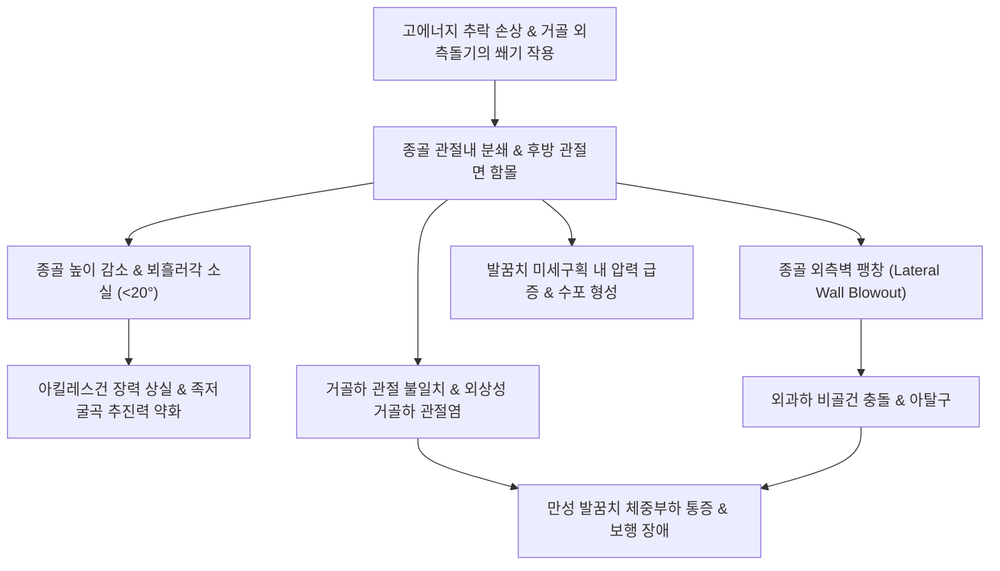

# 🩺 발꿈치뼈 골절 (Calcaneal Fracture / 종골 골절)

> **핵심 3줄 요약 (Key Summary)**:
> - 📍 **병소 부위 & 해부·병태생리**: 족근골 중 가장 큰 종골(Calcaneus)의 골절로, 약 70~75%가 거골하 관절(Subtalar joint)을 침범하는 관절내 골절(Intra-articular fracture)이며 뵈흘러각(Böhler's angle)의 소실을 동반함.
> - 🚩 **전형적 임상 양상**: 사다리나 건물 추락 손상 후 발꿈치 심부의 극심한 통증, 족저부 반상출혈(Mondor's sign), 심한 종창, 체중 부하 절대 불능. 요추 압박 골절(10%) 및 반대측 종골 골절(10%) 동반 빈발.
> - 🛠️ **핵심 검사 & 치료 전략**: 족부 측면 X-ray(뵈흘러각 정상 20~40°, 지산각 120~145°) 및 브로덴(Broden) 뷰로 관절면 함몰 확인 후 3차원 CT(Sanders 분류)로 수술 계획 수립. 전위성 관절내 골절은 족근동 접근법 또는 외측 확장 도달법 내고정술(ORIF) 시행 후 한의 활혈·접골·소종 치료 병용.
> - ⚠️ **응급 의뢰 레드플래그**: 족부 구획증후군(극심한 족저 팽창 및 감각 마비), 종골 외측 피부의 팽팽함(Tenting) 및 수포 형성(Fracture blisters, 피부 괴사 임박), 추락 환자의 요추 부위 자발통 및 신경학적 마비 증상 동반 시 즉각 응급 전원.

---

## 📌 목차
1. [질환 개요 & 해부학적 병태생리](#1-질환-개요--해부학적-병태생리)
2. [병태생리 메커니즘 & 생체역학적 악순환 네트워크](#2-병태생리-메커니즘--생체역학적-악순환-네트워크)
3. [임상 증상 & 이학적 검사(Physical Exam) 알고리즘](#3-임상-증상--이학적-검사physical-exam-알고리즘)
4. [감별 진단 매트릭스 (Differential Diagnosis)](#4-감별-진단-매트릭스-differential-diagnosis)
5. [한의 통합 치료 프로토콜 (침·약침·추나·한약)](#5-한의-통합-치료-프로토콜-침약침추나한약)
6. [양방 치료 & 병용·의뢰 기준 (Conventional Treatment & Referral)](#6-양방-치료--병용의뢰-기준-conventional-treatment--referral)
7. [재활 운동 & 생활습관 티칭 가이드](#7-재활-운동--생활습관-티칭-가이드)
8. [💡 사용자 진료실 핵심 필기 & 임상 노하우 (Melt-In 잔여 심화 집약)](#8--사용자-진료실-핵심-필기--임상-노하우-melt-in-잔여-심화-집약)
9. [출처 및 학술 참고 문헌 (References)](#9-출처-및-학술-참고-문헌-references)

---

## 1. 질환 개요 & 해부학적 병태생리

발꿈치뼈 골절(종골 골절, Calcaneal Fracture)은 족근골 골절 중 가장 흔한 손상(전체 족근골 골절의 약 60%)이다. 종골은 해면골(Cancellous bone)로 채워진 얇은 피질골 껍질 구조를 지니고 있어, 높은 곳에서 떨어져 발뒤꿈치로 착지할 때 거골의 외측 돌기(Lateral process of talus)가 쐐기(Wedge)처럼 종골체부를 내려찍으면서 분쇄 함몰 골절을 일으킨다(연인 골절, Lover's fracture 또는 Don Juan fracture).

임상적 분류 체계:
1. **Essex-Lopresti 분류 (방사선 측면상 기준)**:
   - **설상 골절 (Tongue type)**: 2차 골절선이 후방 관절면 아래를 지나 후방 종골 결절(Tuberosity) 끝까지 수평으로 주행하여 설상 골편을 형성함. 아킬레스건의 견인으로 관절면 함몰이 악화됨.
   - **관절 함몰 골절 (Joint depression type)**: 2차 골절선이 후방 관절면 바로 뒤쪽에서 배측으로 주행하여 관절면 골편만 단독으로 종골체부 내로 쐐기처럼 박힘.
2. **Sanders 분류 (관상면 CT 기준)**:
   - 후방 관절면(Posterior facet)의 골절선 수(A, B, C선)와 골편 수에 따라 Type I(무전위), Type II(2골편, 1개 골절선), Type III(3골편, 2개 골절선), Type IV(4골편 이상, 고도 분쇄 골절)로 분류하며, 수술적 정복 난이도와 예후를 결정함.

![[발꿈치뼈골절_01_병태도해_보흘러각_지산각_모식도.jpg]]
> [그림 1: ① 병태생리·도해 — 종골의 해부학적 높이와 관절면 함몰을 평가하는 뵈흘러각(Böhler's angle: 정상 20~40°) 측정 모식도 (Wikimedia Commons)]

![[발꿈치뼈골절_01_영상의학_종골관절내_함몰골절_Xray.jpg]]
> [그림 2: ① 병태생리·영상 — 고에너지 추락 손상으로 뵈흘러각이 0° 가까이 소실된 전위성 종골 관절내 함몰 골절 방사선 소견 (Wikimedia Commons)]

---

## 2. 병태생리 메커니즘 & 생체역학적 악순환 네트워크

종골 골절 시 종골체부가 납작해지고 외측으로 팽창(Lateral wall blowout)하면서 여러 가지 심각한 2차적 생체역학적 문제를 야기한다:
1. **뵈흘러각 감소 및 아킬레스건 무력화**: 종골의 수직 높이가 감소하면 아킬레스건의 모멘트 암(Moment arm)이 단축되어 보행 시 족저굴곡 추진력이 현저히 약화된다.
2. **비골건 충돌(Peroneal Tendon Impingement)**: 종골 외측벽이 바깥으로 밀려나와 비골 외과와 비골하 공간을 협소화시켜 비골건 아탈구 및 건초염을 유발한다.
3. **거골하 관절의 외상성 관절염**: 체중의 대부분을 분산하는 후방 관절면의 부조화(Step-off > 2mm)는 조기 관절 연골 마모와 지속적인 심부 발꿈치 통증을 초래한다.

![[발꿈치뼈골절_02_해부도해_종골골격_외측면_Gray271.png]]
> [그림 3: ② 관련 해부 구조물 — 종골(발꿈치뼈)의 거골관절면, 비골결절 및 후방 종골결절 해부도 (Henry Gray, Anatomy of the Human Body)]

---

## 3. 임상 증상 & 이학적 검사(Physical Exam) 알고리즘

### 1) 주요 임상 증상
- **발꿈치 심부 통증 및 체중 부하 불능**: 환측 발꿈치로 지면을 딛지 못하며 극심한 통증 호소.
- **몬도르 징후 (Mondor's Sign)**: 수상 후 24~48시간 내에 발바닥 중앙 및 족저 내외측으로 퍼지는 전형적인 족저 반상출혈.
- **발꿈치 종창 및 골절 수포(Fracture Blisters)**: 피하 연부조직이 얇은 발꿈치 주위로 극심한 부종이 발생하고 장액성/출혈성 수포 형성.
- **발꿈치 폭 확장 및 외반 변형**: 뒤에서 관찰 시 발꿈치 너비가 건측에 비해 넓어지고 평발화됨.

### 2) 이학적 검사 및 영상 알고리즘
- **축성 압박통 및 스퀴즈 검사 (Calcaneal Squeeze Test)**: 종골 내외측을 양손으로 쥐고 압박할 때 날카로운 격통 발생.
- **동반 손상 전신 스크리닝**: 추락 충격이 축성 골격을 따라 상행하므로 **요추 및 흉요추 이행부 압통 검사(10% 동반)** 및 **반대측 발꿈치 검진(10% 양측성)** 필수.
- **방사선 검사**:
  1. **족부 및 족관절 측면상(Lateral view)**:
     - **뵈흘러각 (Böhler's angle)**: 종골 결절 최고점-후방 관절면 최고점 선과 후방 관절면 최고점-전방 돌기 최고점 선이 이루는 각 (정상: 20~40°). 골절 시 20° 미만으로 감소하거나 역전됨.
     - **지산각 (Angle of Gissane / Critical angle)**: 후방 관절면 경사선과 전방 돌기 경사선이 이루는 각 (정상: 120~145°). 관절면 함몰 시 145° 이상으로 개대됨.
  2. **축방향 방사선 (Harris axial view)**: 종골체부의 단축, 외측벽 팽창, 내측 거골지지돌기(Sustentaculum tali) 골절선 확인.
  3. **브로덴 촬영 (Brodén's view)**: 거골하 관절면의 정복 상태를 동적으로 확인.
  4. **족부 관상면 및 축방향 CT**: Sanders 분류 판정 및 수술 계획을 위한 필수 검사.

![[발꿈치뼈골절_07_영상의학_종골골절_관상면_CT단면.jpg]]
> [그림 4: 영상의학 — 거골하 관절면(Subtalar joint)의 전위 및 분쇄 정도를 정밀 평가하는 종골 관상면 CT 소견 (Wikimedia Commons)]

---

## 4. 감별 진단 매트릭스 (Differential Diagnosis)

| 감별 질환 | 손상 기전 및 원인 | 주요 통증 부위 | 방사선 및 영상 소견 | 예후 및 관리 |
| :--- | :--- | :--- | :--- | :--- |
| **[[발꿈치뼈 골절]] (관절내)** | 고에너지 추락 착지 외상 | 종골 전체 심부 격통, 족저 멍 | 뵈흘러각 소실, 관절면 분쇄 | 수술적 내고정술 또는 관절유합술 고려 |
| **종골 스트레스 골절** | 장거리 보행, 군사 훈련 | 종골 결절 외측부 압통, 부종 경미 | 초기 X-ray 음성, 2~3주 후 경화선 | 4~6주 비체중 부하로 양호한 유합 |
| **족저근막염 (Plantar Fasciitis)** | 만성 과사용, 아침 첫 발 통증 | 종골 결절 전내측 족저면 압통 | 골절선 음성, 종골 골극(Spur) 동반 가능 | 스트레칭, 보존적 침/물리치료 |
| **종골 후방 점액낭염** | 신발 마찰, 아킬레스건 부착부 염좌 | 아킬레스건 부착부 팽윤 및 압통 | 연부조직 음영 증가, 골질 정상 | 국소 침구 치료, 후방 압박 배제 신발 |
| **거골 골절 (거골 체부/후방돌기)** | 족관절 배굴-축성 압박 | 족관절 심부 및 전방 압통 | 거골 활차 및 후방돌기 골절선 | 무혈성 괴사(AVN) 고위험군 |

---

## 5. 한의 통합 치료 프로토콜 (침·약침·추나·한약)

종골 골절 환자의 한의 치료는 **극심한 연부조직 부종의 조기 흡수, 수포 발생 예방, 수술 후 골유합 가속화 및 만성 거골하 관절 강직 완화**를 목표로 체계적으로 진행한다.

### 1) 시기별 단계적 치료 프로토콜
- **1단계 (급성기 / 0~2주)**: 청열화어(淸熱化瘀), 활혈이수(活血利水). 극심한 종창과 혈종을 신속히 배출시켜 피부 수포 발생을 억제.
  - 대표 처방: [[당귀수산]](當歸鬚散) 합 오령산(五苓散).
- **2단계 (아급성 골유합기 / 2~8주)**: 접골속근(接骨續筋), 보기생혈(補氣生血). 해면골의 신속한 신생 가골 형성 촉진.
  - 대표 처방: [[자연동]](自然銅, 산골) 배합 접골단(接骨丹), 복원활혈탕(復元活血湯).
- **3단계 (만성 회복기 / 8~24주)**: 보익간신(補益肝腎), 강근골(强筋骨). 아킬레스건 구축 예방 및 족저 지방체(Heel fat pad) 위축 완화.
  - 대표 처방: [[독활기생탕]](獨活寄生湯), [[육미지황탕]](六味地黃湯).

### 2) 주요 혈위 침구 치료
- **국소 취혈**: [[태계]](KI3), [[곤륜]](BL60), [[조해]](KI6), [[신맥]](BL62), 수천(KI5), 복삼(BL61). 종골 내외측 터널과 관절낭 주위 순환 개선.
- **원위 취혈**: [[양릉천]](GB34), [[현종]](GB39), [[족삼리]](ST36), 승산(BL57). 하지 정맥 환류 촉진 및 아킬레스건 긴장 완화.
- **약침 치료**: 중성어혈약침(발꿈치 주위 혈종 분해), 신바로약침(거골하 관절낭 염증 제어), 자하거약침(후기 골소주 재생 및 인대 영양).

![[발꿈치뼈골절_05_술기실사_신경_태계_조해_자침도해.jpg]]
> [그림 5: ③ 치료·시술점 — 종골 내측 및 족관절 후하방 통증 완화를 위한 신경 태계(KI3) 및 조해(KI6) 자침 도해 (Wellcome Collection)]

---

## 6. 양방 치료 & 병용·의뢰 기준 (Conventional Treatment & Referral)

### 1) 양방 보존적 치료 vs 외과적 수술
- **보존적 치료**:
  - 무전위 관절내 골절(Sanders Type I) 및 거골하 관절면을 침범하지 않은 관절외 골절.
  - 심한 혈관 질환, 중증 당뇨병, 고령의 와상 환자 (수술 합병증 위험이 이득을 상회하는 경우).
  - 10~12주간 비체중 부하 단하지 깁스 부목 적용.
- **외과적 수술 (ORIF)**:
  - 거골하 관절면 단차 2mm 이상인 전위성 골절(Sanders Type II, III).
  - 설상 골절(Tongue type)로 후방 결절이 배측으로 전위된 경우(피부 천공 위험으로 조기 정복 필수).
  - **수술 접근법**:
    1. 외측 확장 도달법(Extensile lateral approach): 넓은 시야 확보 및 해부학적 플레이트 고정. 단, 피부 괴사 합병증 위험(5~10%).
    2. 족근동 접근법(Sinus tarsi approach): 최소 침습으로 연부조직 합병증을 최소화하며 관절면 정복.

![[발꿈치뼈골절_06_양방수술_종골골절_플레이트내고정술_Xray.jpg]]
> [그림 6: 양방 수술 — 관절면 정복 및 종골 외측벽 팽창 교정을 위한 플레이트 내고정술 방사선 소견 (Wikimedia Commons)]

### 2) 응급 및 정형외과 전원 기준
- **피부 괴사 절박**: 종골 골편에 의해 발꿈치 피부가 하얗게 팽팽해지거나(Tenting), 출혈성 수포가 광범위하게 형성되는 경우.
- **족부 구획증후군 (Foot Compartment Syndrome)**: 종골 골절 환자의 10% 내외에서 발생.
- **동반 척추 손상**: 추락 손상 기전 환자에서 요통이나 하지 방사통, 배뇨 장애가 동반될 경우 즉시 응급 척추 검진 의뢰.

---

## 7. 재활 운동 & 생활습관 티칭 가이드

종골 골절은 골유합 이후에도 보행 시 발꿈치 충격 흡수 장애로 인해 최소 6개월에서 1년 이상의 긴 회복 기간이 필요하다.

### 1) 시기별 재활 훈련
- **비체중 부하 가동기 (0~6주)**:
  - 침상 족관절 펌핑 운동 및 발가락 능동 굴곡-신전.
  - 거골하 관절의 내번-외번(Inversion-Eversion) 능동 보조 운동으로 관절 구축 방지.
- **부분 체중 부하 훈련기 (6~10주)**:
  - 수중 보행(Aquatic therapy) 또는 체중의 25~50%만 부하하는 보행기 보행.
  - 아킬레스건 및 비복근-가자미근 복합체 수건 스트레칭.
- **전체중 부하 및 충격 흡수 훈련기 (10~16주 이상)**:
  - 밸런스 보드 운동을 통한 고유수용감각 회복.
  - 종골 패드(Silicone heel cup)를 장착하여 뒤꿈치 지방체 충격 완화.

### 2) 생활습관 티칭
- 뒤꿈치가 얇은 플랫슈즈나 구두 착용 금지; 완충력(Cushion)이 뛰어난 두꺼운 밑창의 런닝화 착용.
- 칼슘 및 비타민 D 섭취 증대.

---

## 8. 💡 사용자 진료실 핵심 필기 & 임상 노하우 (Melt-In 잔여 심화 집약)

- **추락 환자에서 발꿈치만 보면 하수(下手)다**:
  - 사다리나 지붕에서 떨어져 발뒤꿈치 통증을 호소하는 환자가 오면, 발꿈치 X-ray만 찍어서는 절대 안 된다.
  - 발뒤꿈치로 가해진 축성 에너지는 다리를 타고 척추로 직결되어 **제12흉추~제2요추 부위의 방출성/압박 골절**을 10% 이상 동반한다. 환자가 발꿈치 통증에 정신이 팔려 요통을 못 느끼는 경우가 많으므로 반드시 요추 부위를 촉진하고 기형 여부를 확인해야 한다.
- **수술 시기 결정과 한의 부종 치료의 역할**:
  - 종골은 피하 연부조직이 매우 얇아서, 다치자마자 바로 수술하면 피부가 괴사되어 금속판이 노출되는 재앙이 일어난다. 그래서 정형외과에서도 'Wrinkle sign(피부 주름 징후)'이 나타날 때까지 1~2주간 깁스만 대고 기다린다.
  - 이 대기 기간 동안 [[당귀수산]]과 이수소종 한약을 투여하고 [[태계]], [[곤륜]]에 침 치료를 병행하면 연부조직 부종과 멍을 3~5일 이상 단축시켜 안전한 조기 수술 환경을 만들어줄 수 있다.
- **거골하 관절염 후유증의 예고**:
  - Sanders III, IV형 골절 환자는 아무리 수술이 잘 되어도 거골하 관절의 퇴행성 변화로 울퉁불퉁한 자갈길을 걸을 때 발꿈치 깊은 곳이 쑤시는 후유증이 남는다.
  - 환자에게 치료 초기부터 이러한 예후를 충분히 설명하고, 장기적으로 종골 패드 착용 및 한의 관절 치료([[독활기생탕]])를 꾸준히 관리받도록 유도해야 의료 분쟁을 예방할 수 있다.

---

## 9. 출처 및 학술 참고 문헌 (References)

1. Yavuz U, Soylemez MS, Cengiz B. (2025). Postoperative hindfoot alignment after sinus tarsi versus extensile lateral approach for Sanders type III-IV calcaneal fractures. *Eur J Orthop Surg Traumatol*. PMID: 42760182.

2. Bhadresha A, Williams R, Davies M. (2024). Minimally invasive percutaneous fixation of displaced intra-articular calcaneal fractures: Surgical technique and case series from a major trauma centre. *Injury*, 55(11):111874. PMID: 42468064.

3. Tharmviboonsri T, Silapunt K, Chuckpaiwong B. (2024). The incidence and descriptive factors of calcaneal malunion after surgical fixation of intra-articular calcaneal fractures using the sinus tarsi approach: A retrospective cohort study with binary logistic regression analysis. *Foot Ankle Surg*, 30(8):720-727. PMID: 41927422.

4. Nam EY, Lee YJ, Kim SH, Kang JW. (2023). Therapeutic Efficacy of Chinese Patent Medicine Containing Pyrite for Fractures: A Systematic Review and Meta-Analysis. *Medicina (Kaunas)*, 60(1):164. PMID: 38256337.

---

## 관련 노트

- [[발 골절]]
- [[발목 골절]]
- [[발가락 골절]]
- [[종자골 골절]]
- [[자연동]]
- [[당귀수산]]
- [[독활기생탕]]
- [[아킬레스건염]]
