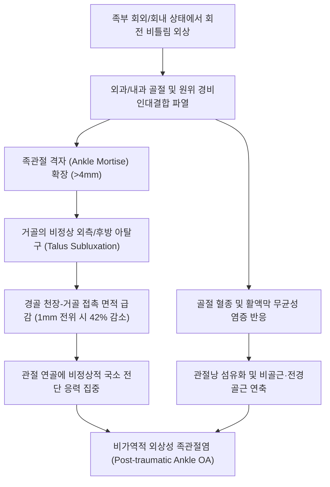

# 🩺 발목 골절 (Ankle Fracture / Malleolar Fracture)

> **핵심 3줄 요약 (Key Summary)**:
> - 📍 **병소 부위 & 해부·병태생리**: 경골 원위부 내과(Medial malleolus), 비골 원위부 외과(Lateral malleolus), 경골 후순(Posterior malleolus) 및 원위 경비인대결합(Syndesmosis)을 침범하는 골절. 단과(Unimalleolar), 양과(Bimalleolar), 삼과(Trimalleolar) 골절로 분류.
> - 🚩 **전형적 임상 양상**: 족부 회전 외상 직후 복사뼈 부위의 극심한 압통, 급격한 종창 및 반상출혈, 거골의 아탈구로 인한 족관절 외형 뒤틀림, 즉각적인 체중 부하 불능(오타와 발목 규칙 양성).
> - 🛠️ **핵심 검사 & 치료 전략**: 족관절 3방향 X-ray(AP, Lateral, Mortise view)로 Danis-Weber(Type A, B, C) 및 관절 격자(Mortise) 4mm 초과 확장 여부 판정. 안정성 Weber A/일부 B는 단하지 깁스 또는 탈착식 보조기(CAM boot) 및 한의 치료(침·약침·산골 처방) 병용; 불안정 골절(양과·삼과·Weber C)은 수술적 관혈적 정복 및 내고정술(ORIF) 의뢰.
> - ⚠️ **응급 의뢰 레드플래그**: 족관절 완전 탈구를 동반한 피부 팽팽함(Tenting) 및 괴사 절박, 개방성 골절, 족배동맥 및 후경골동맥 박동 소실(족부 허혈), 심한 족부 구획증후군 징후 시 즉각 응급 정형외과 전원.

---

## 📌 목차
1. [질환 개요 & 해부학적 병태생리](#1-질환-개요--해부학적-병태생리)
2. [병태생리 메커니즘 & 생체역학적 악순환 네트워크](#2-병태생리-메커니즘--생체역학적-악순환-네트워크)
3. [임상 증상 & 이학적 검사(Physical Exam) 알고리즘](#3-임상-증상--이학적-검사physical-exam-알고리즘)
4. [감별 진단 매트릭스 (Differential Diagnosis)](#4-감별-진단-매트릭스-differential-diagnosis)
5. [한의 통합 치료 프로토콜 (침·약침·추나·한약)](#5-한의-통합-치료-프로토콜-침약침추나한약)
6. [양방 치료 & 병용·의뢰 기준 (Conventional Treatment & Referral)](#6-양방-치료--병용의뢰-기준-conventional-treatment--referral)
7. [재활 운동 & 생활습관 티칭 가이드](#7-재활-운동--생활습관-티칭-가이드)
8. [💡 사용자 진료실 핵심 필기 & 임상 노하우 (Melt-In 잔여 심화 집약)](#8--사용자-진료실-핵심-필기--임상-노하우-melt-in-잔여-심화-집약)
9. [출처 및 학술 참고 문헌 (References)](#9-출처-및-학술-참고-문헌-references)

---

## 1. 질환 개요 & 해부학적 병태생리

발목 골절(Ankle Fracture)은 하지에서 가장 흔하게 발생하는 관절 내 골절 중 하나로, 족관절 격자(Ankle mortise)를 형성하는 경골(Tibia)의 원위 관절면 및 내과·후과, 비골(Fibula)의 외과 골절을 총칭한다. 주로 보행이나 스포츠 활동 중 발이 지면에 고정된 상태에서 회전 외력이 가해질 때 발생한다.

![[발목골절_01_영상소견_양과골절_Xray.jpg]]
> [그림 1: ① 병태생리·영상 — 내과 및 외과의 동시 골절로 관절 격자의 심각한 불안정성을 초래한 양과 골절 X-ray (Wikimedia Commons, CC BY-SA 3.0)]

![[발목골절_01_영상소견_삼과골절_Xray.jpg]]
> [그림 2: ① 병태생리·영상 — 내과, 외과 및 경골 후순(후과)을 모두 침범한 고에너지 외상성 삼과 골절 X-ray (Wikimedia Commons, CC BY-SA 4.0)]

임상 분류 체계는 크게 두 가지가 사용된다:
1. **Danis-Weber 분류**: 원위 경비인대결합(Syndesmosis)을 기준으로 비골 골절선의 높이에 따라 구분한다(Wu et al., 2025):
   - **Type A**: 인대결합 하방(Infrasyndesmotic)의 비골 횡골절. 인대결합 손상이 없어 매우 안정적이며, 95% 이상 보존적 깁스 치료 대상.
   - **Type B**: 인대결합 높이(Trans-syndesmotic)의 비골 나선상/사상 골절. 인대결합 부분 손상 가능성(약 50%)이 있으며, 내측 삼각인대 손상 여부에 따라 수술 여부 결정.
   - **Type C**: 인대결합 상방(Suprasyndesmotic)의 비골 골절. 인대결합 및 골간막(Interosseous membrane)이 광범위하게 파열되어 관절 격자가 완전히 파탄된 불안정성 골절(수술 필수).
2. **Lauge-Hansen 분류**: 수상 당시 족부의 위치(회외 Supination vs 회내 Pronation)와 외력의 방향(외회전 External rotation, 내전 Adduction, 외전 Abduction)의 4가지 조합(SER, SA, PER, PA)으로 손상 순서를 체계화함.

---

## 2. 병태생리 메커니즘 & 생체역학적 악순환 네트워크

![[발목골절_02_해부도해_베버분류_병태도해.jpg]]
> [그림 3: ② 관련 해부 구조물 — Danis-Weber 분류에 따른 비골 골절 높이 및 원위 경비인대결합 손상 기전 (Smart-Servier, CC BY-SA 3.0)]

족관절은 경골 천장(Tibial plafond)과 양측 복사뼈가 거골(Talus)을 오목하게 감싸는 '장부 맞춤(Mortise and tenon)' 구조를 이룬다. 정상 상태에서는 거골 활차와 관절면 간극이 전 둘레에 걸쳐 3~4mm 이하로 균일하게 유지된다.

![[족관절_외측인대_해부도_전거비인대_종비인대.png]]
> [그림 4: ② 관련 해부 구조물 — 비골 외과를 안정화하는 전거비인대(ATFL)·종비인대(CFL)·전경비인대(PTFL) 측면 해부 도해 — ⚠️ 출처 미확인 (2026-10-08)]

![[족관절_내측인대_해부도_삼각인대.png]]
> [그림 5: ② 관련 해부 구조물 — 거골·종골을 내측에서 지지하는 부채꼴 삼각인대(deltoid ligament) 복합체 내측면 해부 도해 — ⚠️ 출처 미확인 (2026-10-08)]

만약 골절로 인해 거골이 외측으로 단 1mm만 외측 전위되어도 경골-거골 간 접촉 면적은 42% 감소하고 국소 접촉 압력은 2배 이상 폭증한다. 이는 관절 연골의 조기 마모와 외상성 골관절염을 초래하는 핵심 생체역학적 기전이다.

---

## 3. 임상 증상 & 이학적 검사(Physical Exam) 알고리즘

### 3.1 주요 자각 증상
- **체중 부하 불능**: 수상 즉시 발을 디딜 수 없으며 극심한 체중 부하통 호소.
- **국소 종창 및 피하 출혈**: 외과 또는 내과 주변에 급격한 부종과 혈종 발생, 수 시간 내 족저부까지 반상출혈 확산.
- **가시적 관절 변형**: 족관절이 외번되거나 뒤로 밀리는 아탈구 외형 관찰.

### 3.2 핵심 이학적 검사법

![[족관절_전방견인_좌위수기검사_실사.jpg]]
> [그림 6: ③ 이학적 검사 — 거골 아탈구·족관절 전방 불안정성을 평가하는 전방 서랍(anterior drawer) 검사 시연 실사 — ⚠️ 출처 미확인 (2026-10-08)]

1. **오타와 발목 규칙 (Ottawa Ankle Rules)**:
   - 다음 중 하나라도 해당하면 단순 방사선 촬영(X-ray) 절대 적응증:
     - 비골 외과 원위부 6cm 이내의 골 타진통/압통.
     - 경골 내과 원위부 6cm 이내의 골 타진통/압통.
     - 수상 직후 및 진료실에서 4보 이상 독립 보행 불능.
2. **근위 비골 압진 (Maisonneuve 골절 선별)**:
   - 족관절 손상 환자에서 반드시 무릎 바로 아래 비골두(Fibula head)를 압진해야 한다. 외과 골절이 없더라도 내과 골절 또는 삼각인대 파열과 함께 근위 비골 골절이 발생하는 고위 손상(Maisonneuve fracture)을 배제하기 위함.
3. **경비골 압박 검사 (Squeeze Test)**:
   - 종아리 중간 부위에서 경골과 비골을 함께 쥐어짰을 때 족관절 원위부 인대결합에 통증이 유발되면 인대결합 파열(Syndesmosis injury) 양성.

---

## 4. 감별 진단 매트릭스 (Differential Diagnosis)

| 감별 질환 | 손상 기전 및 호발 부위 | 주요 증상 및 징후 | 특이적 이학적 검사 | 방사선(X-ray) 소견 |
| :--- | :--- | :--- | :--- | :--- |
| **발목 골절 (Weber A/B)** | 내번/회외 회전력 | 복사뼈 국소 골 타진통, 즉시 보행 곤란 | Ottawa 규칙 (+), 골 타진통 (+) | 비골 원위부 골절선, 격자 정상 |
| **[[발목 염좌]]** | 단순 내번 족저굴곡 외상 | 외측 인대(ATFL) 압통, 복사뼈 뼈 자체 통증 없음 | Anterior drawer test (+), 골 타진통 (-) | 피질골 연속성 정상, 골편 없음 |
| **메조뇌브 골절 ([[Maisonneuve]])** | 심한 회내-외회전 외상 | 족관절 내측 통증 + 무릎 외측 비골두 통증 | Squeeze test (+), 비골두 압통 (+) | 족관절 격자 확장 + 근위 비골 골절 |
| **[[거골 골절]]** | 고에너지 족배굴곡 낙상 | 족관절 심부 격통, 거골하 관절 가동 제한 | 거골 경부 직접 압통 | 거골 활차/경부 골절선 확인 |
| **[[제5발허리뼈 기저부 골절]]** | 내번 비틀림 (단비골근 견인) | 발 외측 가장자리 통증 (발목 통증으로 호소) | 제5중족골 결절 압통 (+) | 제5중족골 기저부 골절선 (Zone 1/2) |

---

## 5. 한의 통합 치료 프로토콜 (침·약침·추나·한약)

발목 골절의 한의 치료는 급성 고정기(삼출액·어혈 흡수, 혈류 촉진)와 고정 해제 후 관절 가동기(거골하관절 강직 해소, 족관절 안정화 근육 강화)의 2단계로 진행된다.

![[발허리뼈골절_05_술기실사_족부침치료.jpg]]
> [그림 7: ⑤ 한의 통합 치료 — 족관절 골절 후 혈종 흡수 및 미세 순환 개선을 위한 족부 자침 시술 (Wikimedia Commons, CC BY 2.0)]

### 5.1 침치료 & 전침 요법
- **배혈 혈위**: 구허(GB40), 신맥(BL62), 조해(KI6), 상구(SP5), 해계(ST41), 곤륜(BL60), 태계(KI3), 족삼리(ST36), 양릉천(GB34).
- **고정 중 자침**: 석고 밖으로 노출된 족지부(팔풍 EX-LE10) 및 하퇴 근위부(양릉천, 족삼리)에 자침하여 하지 정맥 펌프 기능을 자극하고 부종을 신속히 제거.
- **고정 발거 후 전침**: 해계-곤륜, 구허-조해에 2Hz 저주파를 20분간 적용하여 관절낭 유착을 완화하고 골유합 부위의 미세 순환을 촉진.

### 5.2 약침 요법
- **급성 부종 제어기**: **중성어혈 약침** 1.0~2.0cc를 족관절 주변 피하에 분할 주입하여 피하 혈종 흡수 및 통증 억제.
- **골유합 및 인대 강화기**: **신바로 약침** 또는 **자하거 약침**을 비골 골막 인접부 및 인대 부착부에 주입하여 가골 형성 촉진 및 만성 불안정증 예방.

### 5.3 한약 치료 (골유합 및 관절 회복)
- **급성 어혈기 (수상 후 1~2주)**: 당귀수산(當歸鬚散) 가미방 (자연동 自然銅 4g, 몰약 3g 가미) — 급성 혈종 흡수, 미세혈관 신생 촉진.
- **가골형성기 (수상 후 3~5주)**: 접골자금단(接骨紫金丹), 궁귀조혈음(芎歸調血飮) 가미방 (골쇄보 骨碎補, 속단 續斷 각 8g 가미) — 가골 강도 및 조골세포 증식 증대.
- **관절구련 및 회복기 (수상 후 6주 이후)**: 독활기생탕(獨活寄生湯) — 관절낭 유착 완화, 족부 근력 회복.

### 5.4 추나 치료 (Chuna Manual Therapy)
- **주의**: 방사선학적으로 골유합이 확인되기 전 골절 부위에 대한 직접 교정은 절대 금기.
- **적용**: 깁스 발거 후 족퇴관절(Talocrural)의 전후방 활주 기법(AP Glide) 및 거골하관절(Subtalar)의 가동술을 통해 족배굴곡 각도 정상화.

---

## 6. 양방 치료 & 병용·의뢰 기준 (Conventional Treatment & Referral)

![[발허리뼈골절_06_보존치료_단하지보행보조기_CAMboot.jpg]]
> [그림 8: ⑥ 양방 보존 치료 — 안정성 비골 골절(Weber A) 환자의 조기 체중 부하 및 관절 보호를 위한 보행 보조기(CAM boot) (Wikimedia Commons, CC BY-SA 3.0)]

### 6.1 비수술적 치료
- **적응증**: 전위가 없는 단독 외과 골절(Danis-Weber A 또는 내측 손상이 없는 안정성 Weber B) (Wu et al., 2025; Spierings et al., 2022).
- **고정 방법**: 단하지 석고 붕대 또는 탈착식 보행 보조기(CAM boot)를 4~6주간 착용하며, 환자의 통증 내약성에 따라 단계적 체중 부하(Zhou et al., 2025).

### 6.2 수술적 치료 적응증 (ORIF)
- **양과 및 삼과 골절**: 관절 격자의 불안정성이 명백한 경우.
- **Danis-Weber Type C 골절**: 인대결합 나사(Syndesmotic screw) 또는 봉합단추(TightRope) 고정 필수.
- **도수 정복 후 관절면 단차가 2mm 이상 남거나 거골의 외측 전위가 1mm 이상인 경우**.

### 6.3 응급 전원 기준
- 골절 탈구(Fracture-dislocation)로 인한 피부 괴사 위험.
- 개방성 골절 또는 신경혈관 손상(족배동맥 박동 소실).
- 족부 구획증후군(극심한 자발통 및 발가락 수동 신전통).

---

## 7. 재활 운동 & 생활습관 티칭 가이드

### 7.1 단계별 재활 운동
1. **1단계: 고정기 무부하 운동 (수상 즉시~4주)**
   - **발가락 꼼지락 운동**: 발가락을 완전히 쥐었다 펴는 동작을 자주 시행하여 림프 환류 촉진 및 심부정맥혈전증(DVT) 예방.
   - **대퇴사두근 등척성 수축**: 무릎 펴고 다리 들기(SLR)를 통해 하지 근력 유지.
2. **2단계: 고정 해제 후 관절 가동성 회복 (4~8주)**
   - **수건 당기기 족배굴곡**: 앉은 자세에서 발바닥에 수건을 걸고 몸 쪽으로 부드럽게 당겨 아킬레스건 및 종아리 신전.
   - **발목 알파벳 쓰기**: 공중에 발끝으로 글씨를 쓰며 족퇴관절 및 거골하관절 가동 범위 회복.
3. **3단계: 고유수용성 감각 및 근력 강화 (8주 이후)**
   - 세라밴드를 이용한 발목 외번/내번 근력 강화.
   - 밸런스 패드 위에서 한 발 서기 훈련.

---

## 8. 💡 사용자 진료실 핵심 필기 & 임상 노하우 (Melt-In 잔여 심화 집약)

- **"단순 삔 것 같아요"라는 말을 절대 믿지 마라**: 외과 골절(Weber B) 환자는 손상 직후 통증 부위를 '발목 삔 곳'으로 인식하고 내원한다. 특히 내측에 통증이 없으면 환자 스스로 가볍게 여긴다. 복사뼈 끝을 손가락 끝으로 톡톡 두드렸을 때(골 타진) 뼈마디가 울리는 통증이 있다면 99% 골절이므로 지체 없이 X-ray를 촬영해야 한다.
- **무릎 비골두를 누르는 것이 명의의 습관이다**: 발목 내측이 붓고 아픈데 외과에는 골절이 안 보이는 환자가 있다. 이때 무릎 아래 비골두를 꾹 눌러보라. 환자가 비명을 지른다면 이것이 바로 교과서에 나오는 'Maisonneuve 골절'이다. 발목만 사진을 찍으면 비골 골절을 놓치고 단순 염좌로 오진하게 된다.
- **깁스 풀고 족배굴곡 각도를 못 만들면 무릎·허리가 망가진다**: 발목 골절 후 깁스를 푼 환자들은 거골의 후방 활주가 제한되어 발목을 위로 젖히는 각도(Dorsiflexion)가 10도 미만으로 굳어버린다. 이 상태로 걸으면 무릎이 과신전(Genu recurvatum)되거나 골반이 틀어진다. 해계(ST41)와 곤륜(BL60) 자침 후 거골 후방 글라이드 추나를 적용해 족배굴곡 15도 이상을 먼저 확보해주어야 보행이 정상화된다.

---

## 9. 출처 및 학술 참고 문헌 (References)

- **Wu H, et al. (2025)**. Determinants of surgical necessity in Danis-Weber a lateral malleolus fractures: Prognostic insights from a nonoperative cohort. *Injury*. [PMID 41962195](https://pubmed.ncbi.nlm.nih.gov/41962195/)
  - **[연구 요약]**: Danis-Weber A형 외과 골절 환자에서 비수술적 보존 치료의 성공 예후 인자와 수술 전환 기준을 분석한 전향적 코호트 연구. 관절 격자 간격이 유지되는 경우 안정적인 비수술적 골유합 달성을 입증함.
- **Zhou X, et al. (2025)**. Comparative efficacy of cast immobilization versus removable braces in patients with ankle fractures: a systematic review and meta-analysis. *J Orthop Surg Res*. [PMID 40069691](https://pubmed.ncbi.nlm.nih.gov/40069691/)
  - **[연구 요약]**: 발목 골절 보존 치료에서 전통적 석고 깁스와 탈착식 보행 보조기(Removable braces)의 기능적 회복 및 합병증 발생률을 비교한 메타분석. 조기 가동 보조기 사용 시 관절 강직 완화 효과가 유의하게 우수함을 보고함.
- **Spierings KE, et al. (2022)**. Cast versus removable orthosis for the management of stable type B ankle fractures: a systematic review and meta-analysis. *Foot Ankle Surg*. [PMID 36383226](https://pubmed.ncbi.nlm.nih.gov/36383226/)
  - **[연구 요약]**: 안정성 Danis-Weber B형 발목 골절에 대한 깁스 대 탈착식 보조기의 치료 성적을 분석한 체계적 문헌고찰. 일상 복귀 속도와 환자 만족도에서 탈착식 보조기의 임상적 타당성을 규명함.

---

## 관련 노트

- [[Danis-Weber 분류]]
- [[발목 염좌]]
- [[발허리뼈 골절]]
- [[거골 골절]]
- [[Maisonneuve]]
