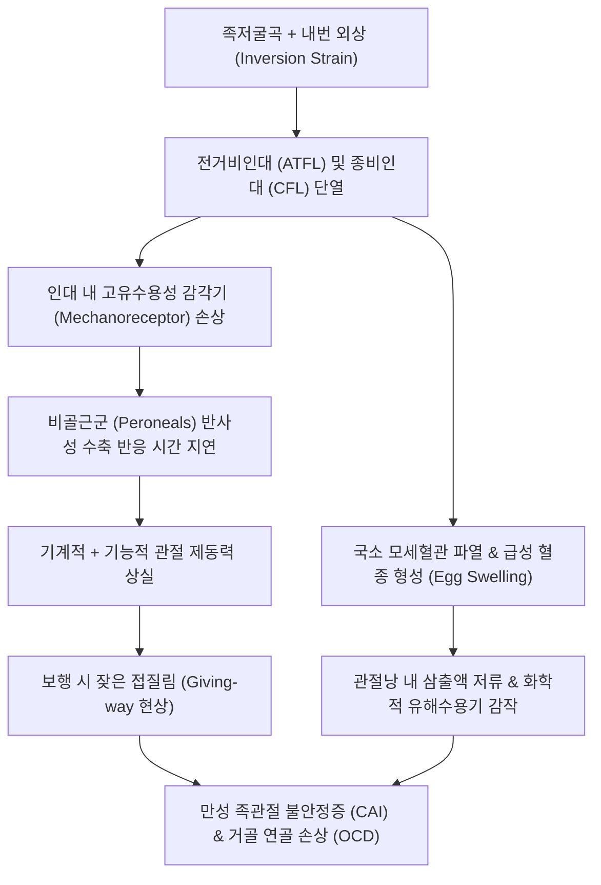

# 🩺 발목 염좌 (Ankle Sprain / Inversion Ankle Sprain & Chronic Ankle Instability)

> **핵심 3줄 요약 (Key Summary)**:
> - 📍 **병소 부위 & 해부·병태생리**: 족저굴곡(Plantarflexion) 및 내번(Inversion) 외력에 의해 호발하는 외측 인대 복합체([[전거비인대]] ATFL 85%, [[종비인대]] CFL 35%)의 신장 및 파열. 거골의 비정상적 전방 전위 및 내반 경사 유발.
> - 🚩 **전형적 임상 양상**: '접질림' 직후 외과 전하방의 달걀 모양 국소 종창(Egg swelling), 피하 반상출혈, 족배굴곡/내번 시 통증, 체중 부하 시 불안정감.
> - 🛠️ **핵심 검사 & 치료 전략**: 오타와 발목 규칙(Ottawa Ankle Rules)으로 골절 감별 후 전방 서랍 검사(Anterior drawer test) 및 거골 경사 검사(Talar tilt test)로 인대 이완도 평가. 급성기 PRICE·압박 붕대 및 황련해독탕/중성어혈 약침을 적용하고, 아급성기 침·추나(거골 후방 활주) 및 비골근 재활을 통해 만성 족관절 불안정증(CAI) 예방.
> - ⚠️ **응급 의뢰 레드플래그**: 제5발허리뼈 기저부 골절(Zone 1/2), 원위 경비인대결합 완전 파열(High ankle sprain), Maisonneuve 골절(근위 비골두 골절 동반), 족배동맥 박동 소실 시 즉각 정형외과 전원.

---

## 📌 목차
1. [질환 개요 & 해부학적 병태생리](#1-질환-개요--해부학적-병태생리)
2. [병태생리 메커니즘 & 생체역학적 악순환 네트워크](#2-병태생리-메커니즘--생체역학적-악순환-네트워크)
3. [임상 증상 & 이학적 검사(Physical Exam) 알고리즘](#3-임상-증상--이학적-검사physical-exam-알고리즘)
4. [감별 진단 매트릭스 (Differential Diagnosis)](#4-감별-진단-매트릭스-differential-diagnosis)
5. [한의 통합 치료 프로토콜 (침·약침·추나·한약)](#5-한의-통합-치료-프로토콜-침약침추나한약)
6. [양방 치료 & 병용·의뢰 기준 (Conventional Treatment & Referral)](#6-양방-치료--병용의뢰-기준-conventional-treatment--referral)
7. [재활 운동 & 생활습관 티칭 가이드](#7-재활-운동--생활습관-티칭-가이드)
8. [💡 사용자 진료실 핵심 필기 & 임상 노하우 (Melt-In 잔여 심화 집약)](#8--사용자-진료실-핵심-필기--임상-노하우-melt-in-잔여-심화-집약)
9. [출처 및 학술 참고 문헌 (References)](#9-출처-및-학술-참고-문헌-references)

---

## 1. 질환 개요 & 해부학적 병태생리

발목 염좌(Ankle Sprain)는 한의원 및 1차 의료기관 외래에서 가장 흔히 접하는 급성 근골격계 질환으로, 전체 스포츠 손상의 약 25%를 차지한다. 족관절 외측은 해부학적으로 내측 복사뼈에 비해 외측 비골 복사뼈가 더 아래로 길게 내려와 있고, 내측 삼각인대(Deltoid ligament)가 훨씬 두껍고 강인하기 때문에 족부 내번(Inversion) 손상이 전체 염좌의 85~90%를 점유한다.

![[발목염좌_01_환부실사_급성종창_SprainedAnkle.jpg]]
> [그림 1: ① 병태생리·환부 — 외측 전거비인대 단열 후 30분 이내에 외과 전하방으로 발생한 전형적인 달걀 모양 급성 종창 실사 (Wikimedia Commons, CC BY-SA 3.0)]

외측 인대 복합체는 3개의 독자적인 인대로 구성되며, 손상 기전에 따라 순차적으로 파열된다:
1. **[[전거비인대]](Anterior Talofibular Ligament, ATFL)**:
   - 비골 외과 전연에서 시작하여 거골 경부 외측에 부착.
   - 발목이 족저굴곡(Plantarflexion)된 상태에서 가장 팽팽해지며, 장력이 집중되어 외측 염좌의 85% 이상에서 가장 먼저 단열된다.
2. **[[종비인대]](Calcaneofibular Ligament, CFL)**:
   - 비골 외과 첨부에서 시작하여 종골 외측면에 주행하는 관절외 인대.
   - 발목이 중립위 또는 족배굴곡 상태에서 내번될 때 긴장하며, 중등도 이상의 염좌(Grade II~III)에서 ATFL과 동반 파열된다(약 35%).
3. **[[후거비인대]](Posterior Talofibular Ligament, PTFL)**:
   - 비골와에서 거골 후외측 결절로 주행하는 매우 두껍고 강인한 인대.
   - 완전 족관절 탈구가 일어나지 않는 한 단독 파열은 극히 드물다.

![[발목염좌_01_병태도해_내번손상_Servier.jpg]]
> [그림 2: ① 병태생리·도해 — 지면 착지 시 족저굴곡 및 내번력 집중으로 인한 전거비인대 신장 및 파열 병태 도해 (Smart-Servier, CC BY-SA 3.0)]

손상 중증도 분류 (Grade I~III):
- **Grade I (경도 염좌)**: 인대 섬유의 미세 신장 및 미세 파열. 관절 이완도 음성, 체중 부하 가능, 부종 경미.
- **Grade II (중등도 부분 파열)**: ATFL의 완전 파열 또는 CFL 부분 단열. 중등도 종창 및 반상출혈, 보행 시 통증, 경미한 전방 불안정성(이완도 5mm 미만).
- **Grade III (중증 완전 파열)**: ATFL 및 CFL의 동시 완전 파열. 극심한 종창 및 광범위한 피하 출혈, 체중 부하 불능, 전방 서랍 검사 및 거골 경사 검사 현저한 양성(이완도 > 10mm).

---

## 2. 병태생리 메커니즘 & 생체역학적 악순환 네트워크

![[족관절_외측인대_해부도_전거비인대_종비인대.png]]
> [그림 3: ② 관련 해부 구조물 — 외측 복사뼈를 지지하는 전거비인대(ATFL) 및 종비인대(CFL) 해부도 (Simbio Archive)]

발목 염좌는 단순한 결합조직 파열에 그치지 않고, 인대 내에 조밀하게 분포하는 고유수용성 감각기(Mechanoreceptors)의 신경학적 탈신경(De-afferentation)을 초래한다.

이로 인해 발목이 안쪽으로 꺾이려 할 때 즉각적으로 수축하여 족부를 외번시켜야 하는 [[장비골근]](Peroneus longus) 및 단비골근(Peroneus brevis)의 반사성 근수축 반응 시간(Reaction time)이 지연된다. 관절 제어 기능이 상실된 상태에서 조기 일상 복귀를 시도하면 거골의 반복적 아탈구와 활액막염이 지속되어 **만성 족관절 불안정증(Chronic Ankle Instability, CAI)** 으로 이행된다(Li et al., 2026; Shinde et al., 2026).

---

## 3. 임상 증상 & 이학적 검사(Physical Exam) 알고리즘

### 3.1 주요 자각 증상
- **외측 복사뼈 전하방 압통**: 손가락 끝으로 ATFL 부착부(외과 전하방 함요처)를 눌렀을 때 격통.
- **달걀형 부종(Egg Swelling)**: 수상 후 수 분~수십 분 내에 외과 전하방이 볼록하게 솟아오름.
- **체중 부하 곤란**: 초기 딛을 때 심한 찌릿함과 통증으로 파행(Limping) 보행.

### 3.2 핵심 이학적 검사법

![[족관절_전방견인_복와위수기검사_실사.jpg]]
> [그림 4: ③ 이학적 검사 — 복와위에서 전거비인대의 이완도 및 거골 전방 전위를 평가하는 전방 서랍 검사 (Simbio Archive)]

1. **전방 서랍 검사 (Anterior Drawer Test)**:
   - 환자의 발목을 10~20도 족저굴곡시킨 상태에서 한 손으로 경골 원위부를 고정하고, 다른 손으로 종골을 감싸 쥐어 전방으로 견인한다.
   - 전거비인대(ATFL) 단열 평가의 핵심 검사. 건측 대비 3~5mm 이상 전방으로 딸려 나오거나 부드러운 종말점(Soft end-point), 흡입 징후(Dimple sign) 관찰 시 양성.
2. **거골 경사 검사 (Talar Tilt Test / Inversion Stress Test)**:
   - 발목을 0도 중립위에 두고 종골을 안쪽으로 강하게 내번(Inversion)시킨다.
   - 종비인대(CFL) 단열 여부 평가. 건측 대비 내번 각도가 10도 이상 크거나 거골 외측 관절면이 벌어지면 양성.

![[족관절_거골경사_내반검사_종비인대스트레스_실사.jpg]]
> [그림 5: ③ 이학적 검사 — 족관절 중립위에서 종비인대(CFL)의 긴장도를 평가하는 거골 경사 내반 스트레스 검사 (Simbio Archive)]

3. **오타와 발목 규칙 (Ottawa Ankle Rules - 골절 배제 스크리닝)**:
   - 단순 염좌와 골절 감별의 표준 도구(민감도 98% 이상):
     - 외과 원위부 6cm 골성 압통.
     - 내과 원위부 6cm 골성 압통.
     - 제5발허리뼈 기저부 압통.
     - 주상골(Navicular) 압통.
     - 수상 직후 및 진료실에서 4보 이상 보행 불가.
   - 위 항목이 모두 음성이면 방사선 촬영 없이 염좌로 확진 가능.

---

## 4. 감별 진단 매트릭스 (Differential Diagnosis)

| 감별 질환 | 손상 기전 및 호발 부위 | 주요 증상 및 징후 | 특이적 이학적 검사 | 영상의학적 특징 |
| :--- | :--- | :--- | :--- | :--- |
| **발목 염좌 (외측)** | 족저굴곡 + 내번 외상 | 외과 전하방(ATFL) 압통, 달걀 부종 | Anterior drawer (+), Talar tilt (+) | 단순 방사선상 골절 없음 |
| **고위 발목 염좌 (Syndesmosis)** | 족배굴곡 + 외회전 외상 | 족관절 상부 전경비인대 부위 통증 | Squeeze test (+), External rotation test (+) | 경비골 간격 >5mm 확장 |
| **[[제5발허리뼈 기저부 골절]]** | 급격한 족부 내번 (단비골근 견인)| 발 외측연 통증, 발목 통증으로 호소 | 제5중족골 결절 골 타진통 (+) | 결절부(Zone 1) 또는 경계부(Zone 2) 골절선 |
| **[[비골 외과 견열 골절]]** | 강한 ATFL 견인력 | 외과 끝부분의 심한 골 타진통 | Ottawa 규칙 양성 (외과 뼈 자체 통증) | 비골 원위 첨부 미세 골편(Fleck fragment) |
| **거골 박리성 골연골염 ([[거골 골절|OCD]])**| 반복적 염좌 또는 압박 | 발목 심부 통증, 관절 잠김(Locking) | 거골 활차 전외측/후내측 압통 | MRI/CT상 거골 돔(Dome) 연골하 결손 |

---

## 5. 한의 통합 치료 프로토콜 (침·약침·추나·한약)

발목 염좌의 한의 치료는 급성기(1~3일) 무균성 염증 및 혈종 억제, 아급성기(4~14일) 인대 섬유 유합 및 관절 가동성 회복, 만성기(2주 이후) 비골근 동적 안정성 및 고유수용성 감각 재교육의 3단계로 진행된다(Yang et al., 2025).

![[발허리뼈골절_05_술기실사_족부침치료.jpg]]
> [그림 6: ⑤ 한의 통합 치료 — 외측 전거비인대 부착부 및 구허·신맥 혈위에 대한 호침 치료 실사 (Wikimedia Commons, CC BY 2.0)]

### 5.1 침치료 & 전침 요법
- **주요 경혈**: 구허(GB40, ATFL 직상), 신맥(BL62, CFL 직상), 해계(ST41), 곤륜(BL60), 조해(KI6), 양릉천(GB34), 현종(GB39).
- **국소 인대 자침술**: 0.25×30mm 호침을 구허 및 신맥 혈위에 평자 또는 사자하여 손상된 인대 부착부의 국소 미세혈류를 증가시키고 섬유아세포 분화를 자극.
- **전침(Electroacupuncture)**: 구허-신맥, 해계-곤륜에 2Hz 저주파를 15~20분간 적용하여 통증 역치를 즉각 상향시키고 신경인성 부종(Substance P 누출) 억제.

### 5.2 약침 요법
- **급성기 부종·열감기**: **황련해독탕 약침** 또는 **중성어혈 약침** 1.0~2.0cc를 외과 전하방 부종 부위에 피내 및 피하 분할 주입하여 급성 삼출액 흡수 촉진.
- **인대 회복 및 만성 불안정기**: **신바로 약침** 또는 **자하거 약침**을 ATFL/CFL 파열 부위에 0.5cc씩 심부 주입하여 Type I 콜라겐 합성 촉진 및 인대 인장 강도 복원.

### 5.3 한약 치료
- **급성 어혈기 (1~5일)**: 당귀수산(當歸鬚散) 가미방 (도인 桃仁, 홍화 紅花 증량) — 국소 어혈 신속 배출, 종창 소퇴.
- **습열울체기 (아급성기 부종 잔여)**: 사묘용담탕(四妙龍膽湯), 오적산(五積散) 가미방 — 관절 삼출액 흡수, 굴신 곤란 완화.
- **인대 이완 및 만성 불안정기**: 독활기생탕(獨活寄生湯) 가미방 (속단 續斷, 두충 杜仲, 구척 狗脊 각 6g 가미) — 인대 결합조직 강화 및 재발 방지.

### 5.4 추나 치료 (Chuna Manual Therapy)
- **급성기 금기**: 족관절을 내번시키는 동작이나 강한 비틀림 교정은 파열된 인대를 재손상시키므로 절대 금기.
- **거골 후방 활주 기법 (Posterior Talar Glide)**: 염좌 환자는 거골이 전외측으로 아탈구되어 족배굴곡이 제한되는 경우가 많음. 환자를 앙와위로 눕히고 족관절 견인 상태에서 거골 경부를 후방으로 부드럽게 밀어 넣는 수기법을 적용하여 정상 보행 궤적 복원.

---

## 6. 양방 치료 & 병용·의뢰 기준 (Conventional Treatment & Referral)

![[발허리뼈골절_06_보존치료_단하지보행보조기_CAMboot.jpg]]
> [그림 7: ⑥ 양방 보존 치료 — Grade II~III 발목 염좌의 인대 단열 보호 및 조기 체중 부하를 위한 단하지 보조기(CAM boot) (Wikimedia Commons, CC BY-SA 3.0)]

### 6.1 단계별 보존 요법 (PRICE to POLICE)
- **과거 PRICE**: Protection, Rest, Ice, Compression, Elevation.
- **현대 POLICE 권고**: Protection(보조기), Optimal Loading(통증 역치 내 최적 부하), Ice, Compression, Elevation. 무조건적인 장기 안식보다는 테이핑이나 탈착식 보조기를 착용한 조기 체중 부하가 인대 회복과 고유수용성 감각 보존에 훨씬 유리함(Vilchez-Cavazos et al., 2025).

### 6.2 수술적 치료 적응증
- 3~6개월 이상의 적극적 한의 보존 치료 및 운동 요법에도 불구하고 지속적인 Giving-way 현상과 관절 불안정성을 보이는 만성 족관절 불안정증(CAI).
- 술식: 변형 브로스트롬 술식(Modified Broström-Gould procedure) 또는 내측 보강 인대 테이프(Internal brace augmentation)를 통한 외측 인대 봉합·재건술(Li et al., 2026).

### 6.3 응급 전원 기준
- 외측 복사뼈, 내측 복사뼈, 제5중족골, 주상골의 골 타진통 양성(골절 의심).
- 족배동맥 박동 소실 및 발가락 냉감·감각 이상(혈관 손상).
- 비골두 부위의 압통 동반(Maisonneuve 골절 의심).

---

## 7. 재활 운동 & 생활습관 티칭 가이드

![[장비골근-20240915215143890.png]]
> [그림 8: ⑦ 재활 운동 — 족관절의 외측 동적 안정성을 책임지는 장비골근 및 단비골근 주행 해부 (Simbio Archive)]

### 7.1 단계별 재활 프로토콜
1. **1단계: 조기 가동성 회복 (수상 후 3~7일)**
   - **알파벳 쓰기**: 의자에 앉아 발끝으로 공중에 A부터 Z까지 대문자를 그리며 족관절의 모든 평면 가동 범위 회복.
   - **수건 당기기 스트레칭**: 통증이 없는 범위에서 아킬레스건을 부드럽게 신전.
2. **2단계: 비골근 동적 강화 운동 (수상 후 1~3주)**
   - **세라밴드 외번 운동 (Eversion with Theraband)**: 밴드를 발 외측에 걸고 바깥쪽으로 발목을 젖히는 저항 운동 (15회씩 3세트). 비골근의 반응 속도를 회복시키는 핵심 운동.
3. **3단계: 고유수용성 감각 및 밸런스 재교육 (수상 후 3주 이후)**
   - **한 발 서기 (Single Leg Stance)**: 눈 뜨고 30초, 익숙해지면 눈 감고 30초 유지.
   - **밸런스 패드 훈련**: 쿠션이나 워블 보드 위에서 중심 잡기를 통해 관절 위치 감각 회복 (Shinde et al., 2026).

---

## 8. 💡 사용자 진료실 핵심 필기 & 임상 노하우 (Melt-In 잔여 심화 집약)

- **"침 맞고 바로 안 아프다고 막 걸어 다니면 안 된다"**: 침치료와 약침은 진통 및 부종 완화 효과가 매우 탁월하여, 시술 직후 환자가 통증이 사라진 것으로 착각하고 즉시 정상 보행을 하다가 미세 유합되던 인대를 다시 찢어먹는 경우가 흔하다. 시술 후 반드시 3일간은 테이핑이나 발목 보호대를 채우고 격렬한 보행을 제한해야 인대가 늘어난 채 굳는 '만성 불안정증'을 예방할 수 있다.
- **제5중족골 기저부를 안 만지면 의료 사고 난다**: 환자가 "발목 접질렸어요" 하고 오면 열에 아홉은 외측 복사뼈만 본다. 그러나 발목이 꺾일 때 단비골근건이 당겨지면서 제5중족골 결절이 뜯어지는 견열 골절(Dancer's fracture / Jones fracture)이 굉장히 흔하다. 진료실에 들어오는 발목 염좌 환자는 무조건 제5중족골 기저부(새끼발가락 외측 뼈 튀어나온 곳)를 엄지로 강하게 압진하는 습관을 들여라.
- **아급성기 발목이 덜 젖혀지면 거골을 뒤로 밀어라**: 염좌 발생 후 2주가 지났는데도 쪼그려 앉을 때 발목 앞쪽이 찝히고 아프다는 환자가 많다. 이는 외상 시 거골(Talus)이 전외측으로 살짝 빠진 채 잠겨서(Anterior talar subluxation) 족배굴곡 시 과상부 밑으로 미끄러져 들어가지 못하기 때문이다. 이때 족관절을 견인하며 거골을 뒤로 쑥 밀어 넣는 '거골 후방 글라이드 추나'를 1회만 해줘도 찝히는 증상이 즉시 사라지고 가동 범위가 100% 회복된다.

---

## 9. 출처 및 학술 참고 문헌 (References)

- **Yang Y, et al. (2025)**. Physical therapy versus conventional treatment for grade I and II acute ankle sprains: trial sequential analysis and meta-analysis. *J Orthop Surg Res*. [PMID 41023742](https://pubmed.ncbi.nlm.nih.gov/41023742/)
  - **[연구 요약]**: 1도 및 2도 급성 발목 염좌 환자에서 조기 능동적 물리치료와 전통적 단순 고정 치료의 임상적 효과를 비교한 메타분석. 조기 기능성 치료군에서 통증 완화, 관절 가동 범위 회복 및 재발률 감소 효과가 유의하게 우수함을 입증함.
- **Li Y, et al. (2026)**. Internal brace augmentation versus modified brostrom-gould procedure for chronic lateral ankle instability: a systematic review and meta-analysis of functional and radiographic outcomes. *BMC Musculoskelet Disord*. [PMID 42469828](https://pubmed.ncbi.nlm.nih.gov/42469828/)
  - **[연구 요약]**: 만성 외측 족관절 불안정증(CAI)에 대한 전통적 변형 브로스트롬 수술과 내부 브레이스 보강술의 기능적 및 방사선학적 결과를 비교한 체계적 문헌고찰. 조기 체중 부하 및 관절 안정성 복원율을 분석함.
- **Shinde N, et al. (2026)**. Evidence-Based Physical Therapy Management for Chronic Ankle Instability in Young Females: A Systematic Review. *Crit Rev Phys Rehabil Med*. [PMID 42438618](https://pubmed.ncbi.nlm.nih.gov/42438618/)
  - **[연구 요약]**: 젊은 여성에서 호발하는 만성 족관절 불안정증에 대한 근거 중심 물리치료 및 신경근 재훈련 프로토콜 고찰. 고유수용성 감각 훈련과 비골근 강화가 장기적 기능 회복의 핵심임을 제시함.

---

## 관련 노트

- [[전거비인대]]
- [[종비인대]]
- [[발목 골절]]
- [[발허리뼈 골절]]
- [[오타와 발목 규칙]]
- [[장비골근]]
