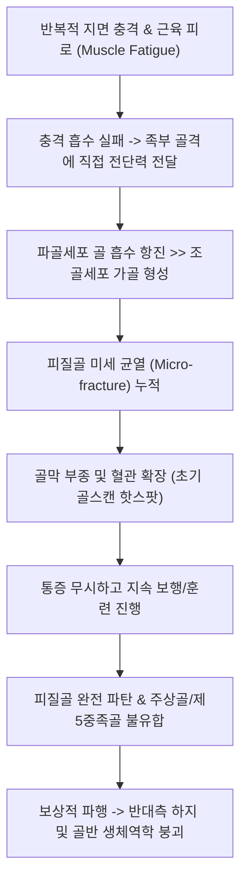

# 🩺 발의 피로 골절 (Foot Stress Fracture / 족부 피로골절)

> **핵심 3줄 요약 (Key Summary)**:
> - 📍 **병소 부위 & 해부·병태생리**: 반복적인 충격과 체중 부하로 인해 발생하는 족부 골격의 미세골절. 특히 [[발허리뼈]](중족골 간부, 행군 골절)와 중심부 혈류가 취약한 [[주상골]](Navicular, 고위험군) 및 종골(Calcaneus)에 호발.
> - 🚩 **전형적 임상 양상**: 외상 병력 없이 장거리 보행·훈련 후 악화되는 발등 또는 발뒤꿈치의 뻐근한 둔통, 활동 지속 시 보행 곤란, 특정 뼈 부착부의 '국소 핀포인트 압통(Point tenderness)'.
> - 🛠️ **핵심 검사 & 치료 전략**: 초기 단순 X-ray(1~2주간 위음성 흔함) 한계 인지 후 MRI 또는 골스캔(Bone scan) 조기 시행. 저위험군(중족골 2~4지, 종골)은 활동 조절 및 CAM boot 보존 치료, 고위험군(주상골, 제5중족골 기저부)은 엄격한 6~8주 비체중부하 깁스 또는 수술적 고정; 골유합기 한약(당귀수산·자연동) 병용.
> - ⚠️ **응급 의뢰 레드플래그**: 주상골 배측 피질골 완전 골절선 관찰, 제5중족골 존스 골절 부위의 골수강 경화(불유합 가관절증), 보행 불가 수준의 골 완전 단열 위험 시 즉각 정형외과 수술 의뢰.

---

## 📌 목차
1. [질환 개요 & 해부학적 병태생리](#1-질환-개요--해부학적-병태생리)
2. [병태생리 메커니즘 & 생체역학적 악순환 네트워크](#2-병태생리-메커니즘--생체역학적-악순환-네트워크)
3. [임상 증상 & 이학적 검사(Physical Exam) 알고리즘](#3-임상-증상--이학적-검사physical-exam-알고리즘)
4. [감별 진단 매트릭스 (Differential Diagnosis)](#4-감별-진단-매트릭스-differential-diagnosis)
5. [한의 통합 치료 프로토콜 (침·약침·추나·한약)](#5-한의-통합-치료-프로토콜-침약침추나한약)
6. [양방 치료 & 병용·의뢰 기준 (Conventional Treatment & Referral)](#6-양방-치료--병용의뢰-기준-conventional-treatment--referral)
7. [재활 운동 & 생활습관 티칭 가이드](#7-재활-운동--생활습관-티칭-가이드)
8. [💡 사용자 진료실 핵심 필기 & 임상 노하우 (Melt-In 잔여 심화 집약)](#8--사용자-진료실-핵심-필기--임상-노하우-melt-in-잔여-심화-집약)
9. [출처 및 학술 참고 문헌 (References)](#9-출처-및-학술-참고-문헌-references)

---

## 1. 질환 개요 & 해부학적 병태생리

발의 피로 골절(Foot Stress Fracture)은 단일 외상이 아닌 장기간의 반복적인 아극성(Submaximal) 기계적 과부하로 인해 족부의 골 흡수(Bone resorption) 속도가 골 형성(Bone formation) 속도를 초과하여 미세 골소주 파탄이 누적된 질환이다. 군인(신병 훈련병), 마라톤 러너, 발레 무용수 등에서 호발하며, 전신 피로골절의 약 30~40%가 족부에 집중된다(Campbell et al., 2025).

![[발허리뼈골절_01_영상소견_제2중족골_피로골절_Xray.jpg]]
> [그림 1: ① 병태생리·영상 — 군사 훈련 및 장거리 보행 후 제2발허리뼈 간부에 방추형 가골 비후를 보이는 행군 골절 X-ray (Wikimedia Commons, Public Domain)]

족부 내 발생 부위별 특성:
1. **[[발허리뼈]] 피로골절 (행군 골절, March Fracture)**:
   - 제2, 제3 중족골 간부 및 경부에 가장 흔함. 정상 보행 시 입각기 말기 추진력(Push-off) 부하가 집중되는 해부학적 축.
   - 대체로 저위험군(Low-risk)으로 분류되어 4~6주간의 체중 분산 보조기로 완치됨.
2. **족부 [[주상골]] 피로골절 (Tarsal Navicular Stress Fracture - 고위험군)**:
   - 족부 종아치의 정점(Keystone)에 위치하며, 대퇴골-경골에서 전달되는 충격이 거골을 거쳐 주상골 중심부 1/3로 집중됨.
   - 중앙 1/3 구역은 내측 및 외측에서 진입하는 영양혈관의 종말 구역(Watershed area)으로 무혈성 괴사(AVN) 및 불유합 위험이 극히 높음(Attia et al., 2021).
3. **종골 피로골절 (Calcaneal Stress Fracture)**:
   - 훈련병 등에서 착지 충격의 누적으로 호발하며 종골 결절 후방 해면골에 횡 주행으로 발생.
4. **제5발허리뼈 기저부 피로골절 (Zone 2/3 - 고위험군)**:
   - 비골근의 견인력과 내번 비틀림 응력이 겹치는 취약 부위(Junaid Saleem et al., 2025).

![[발의피로골절_01_영상소견_거골피로골절_추적Xray.jpg]]
> [그림 2: ① 병태생리·영상 — 초기 단순 방사선상 발견되지 않다가 1개월 후 피질골 경화로 확인된 잠재성 거골 피로골절 X-ray (Wikimedia Commons, CC BY-SA 3.0)]

---

## 2. 병태생리 메커니즘 & 생체역학적 악순환 네트워크

![[발허리뼈골절_02_해부도해_중족골치유구역_Polzer.jpg]]
> [그림 3: ② 관련 해부 구조물 — 중족골 기저부 및 족부 횡아치 구조와 미세혈관 주행도 (Wikimedia Commons, CC BY-SA 3.0)]

족부의 뼈는 생체역학적으로 종아치와 횡아치를 이루어 스프링처럼 체중을 분산한다. 그러나 반복된 점프나 장거리 달리기 시, 발바닥의 내재근(Intrinsic foot muscles)과 후경골근, 비골근군이 피로(Muscle fatigue) 상태에 빠지면 충격을 흡수하지 못하고 골격계로 전단 응력(Shear stress)이 고스란히 전도된다.

볼프의 법칙(Wolff's law)에 따른 정상 골 리모델링 과정에서는 파골세포(Osteoclast)가 먼저 미세 손상된 골질을 깎아내고 1~2주 후에 조골세포(Osteoblast)가 가골을 채운다. 이 리모델링 '시간차' 동안 훈련을 중단하지 않고 지속하면 골 강도가 일시적으로 최저점에 도달하여 미세 골절선이 점차 피질골 전체로 확장된다.

---

## 3. 임상 증상 & 이학적 검사(Physical Exam) 알고리즘

### 3.1 주요 자각 증상
- **잠행성 발병**: 뚜렷한 외상 없이 "어느 날부터 달리기 시작할 때 발등이 아프다가, 나중에는 걷기만 해도 울린다"고 호소.
- **체중 부하통**: 보행 시 발 앞꿈치를 딛고 뗄 때(Toe-off) 날카로운 통증.
- **국소 종창**: 해당 중족골이나 발등 중앙부에 미세한 부종 및 온열감.

### 3.2 핵심 이학적 검사법

![[족관절_거골경사_내반검사_중립파지_실사.jpg]]
> [그림 4: ③ 이학적 검사 — 후족부를 중립 파지 후 족관절 내반(거골 경사) 스트레스를 가하는 도수 평가 실사 — 출처 미확인]

1. **핀포인트 골 압통 (Point Tenderness)**:
   - 손가락 끝 하나로 뼈를 눌렀을 때 특정 1~2cm 부위에 환자가 소리를 지를 정도의 극소 압통 확인.
2. **주상골 N-spot 압통 (Navicular N-spot Pain)**:
   - 전경골근건과 거골두 사이, 발등 가장 높은 함요부(주상골 배측 중심부)를 수직 압박. 양성 시 주상골 피로골절 강력 시사.
3. **종골 압박 검사 (Calcaneal Squeeze Test)**:
   - 양손바닥으로 종골의 내외측을 동시에 강하게 쥐어짤 때 심한 통증 발생 시 종골 피로골절 양성.
4. **한 발 깽깽이 뛰기 검사 (Single-leg Hop Test)**:
   - 환측 발로 제자리에서 1회 가볍게 뛰게 했을 때 착지 순간 뼈가 울리는 격통으로 착지 불능.

---

## 4. 감별 진단 매트릭스 (Differential Diagnosis)

![[족저근막염_종골극_발꿈치통증_도해.png]]
> [그림 5: ④ 감별 진단 — 발꿈치·후족부 골격을 보여주는 측면 방사선 영상 4컷(EX/SE/IM 시리즈). 족저근막염 호발부위 도해가 아님 — 출처 미확인]

| 감별 질환 | 호발 위치 | 통증 양상 및 발생 기전 | 이학적 감별 검사 | 방사선 및 MRI 소견 |
| :--- | :--- | :--- | :--- | :--- |
| **발의 피로 골절** | 중족골 간부, 주상골, 종골 | 보행할수록 지속 악화되는 골성 통증 | 핀포인트 골 압통 (+), Squeeze (+) | 초기 X-ray 정상, MRI상 골수 부종 |
| **[[족저근막염]]** | 종골 결절 내측 족저면 | 아침 첫발 디딜 때 격통, 활동 시 완화 | 족저근막 부착부 압통, Windlass (+) | 초음파상 족저근막 두께 >4mm |
| **[[몰톤 신경종]]** | 제3-4 중족골두 사이 족저 | 발가락 타는 듯한 통증, 모래알 밟는 느낌 | Mulder's sign (+), 족두 압박통 | 초음파상 신경종 종괴 확인 |
| **후경골근건염** | 내과 후하방 및 주상골 결절 | 발 아치가 무너지며 내측 통증 | Single heel raise 불가, 건 주행 압통 | 초음파상 건초 삼출액 및 비후 |
| **골연골염 ([[거골 골절|OCD]])**| 거골 활차 관절면 | 발목 깊은 곳의 덜컹거림, 잠김 | 거골 돔 압통, 관절 가동 제한 | MRI 관절면 골연골 결손 |

---

## 5. 한의 통합 치료 프로토콜 (침·약침·추나·한약)

발의 피로 골절 한의 치료는 골막 염증 억제 및 골수 미세혈관 재생 촉진, 족부 종아치 충격 완화의 단계로 진행된다.

![[발허리뼈골절_05_술기실사_족부침치료.jpg]]
> [그림 6: ⑤ 한의 통합 치료 — 족부 피로골절 부위의 골막 혈류 개선 및 어혈 제거를 위한 자침 시술 (Wikimedia Commons, CC BY 2.0)]

### 5.1 침치료 & 전침 요법
- **배혈 혈위**: 태충(LR3), 함곡(ST43), 족임읍(GB41), 속골(BL65), 공손(SP4), 연곡(KI2), 곤륜(BL60).
- **골막 인접 자침**: 골절 의심 부위 주변 1cm 연부조직에 0.25×30mm 호침을 사자하여 골막의 미세 순환 확장 및 일산화질소(NO) 합성 유도.
- **전침**: 2Hz 연속파를 15분간 적용하여 골형성 단백질(BMP-2) 및 혈관내피성장인자(VEGF) 분비를 촉진.

### 5.2 약침 요법
- **신바로 약침** 또는 **자하거 약침** 1.0cc를 골막 인접부 피하에 주입하여 조골세포 활성을 높이고 미세 섬유화 골소주의 유합을 가속화.
- 국소 열감 및 부종이 심한 경우 **황련해독탕 약침**을 표층에 분할 주입.

### 5.3 한약 치료 (골유합 및 신정 보충)
- **급성 통증기 (1~3주차)**: 당귀수산(當歸鬚散) 가미방 (자연동 自然銅 4g, 몰약 3g 가미) — 골막 미세혈종 흡수.
- **골 형성 촉진기 (4~8주차)**: 보골기생탕(補骨寄生湯), 접골자금단(接骨紫金丹) (골쇄보 骨碎補, 속단 續斷, 두충 杜仲 각 8g 가미) — 골소주 밀도 강화.

### 5.4 추나 치료 (Chuna Manual Therapy)
- **금기**: 골절 부위 중족골이나 주상골을 직접 꺾거나 비트는 고속저진폭기법(HVLA) 절대 금기.
- **적용**: 비체중부하 상태에서 거골하관절(Subtalar)의 가동술과 족저근막, 비복근, 가자미근의 근막이완술(Myofascial release)을 통해 지면 충격의 분산 경로를 정상화.

---

## 6. 양방 치료 & 병용·의뢰 기준 (Conventional Treatment & Referral)

![[발허리뼈골절_06_보존치료_단하지보행보조기_CAMboot.jpg]]
> [그림 7: ⑥ 양방 보존 치료 — 족부 피로골절의 체중 부하 차단 및 치유를 위한 단하지 보조기(CAM boot) (Wikimedia Commons, CC BY-SA 3.0)]

### 6.1 위험도별 정형외과 치료 원칙
1. **저위험군 (중족골 2~4지, 종골)**:
   - 4~6주간 무리한 운동 중단, 둥근 밑창(Rocker-bottom) 신발이나 깁스 부츠(CAM boot) 착용 하 일상 보행 허용.
2. **고위험군 (주상골, 제5중족골 기저부 Zone 2/3)**:
   - 불유합률이 높으므로 최소 6~8주간 철저한 비체중부하(Non-weight-bearing short leg cast) 및 목발 보행 필수(Attia et al., 2021).
   - 완전 피질골 골절선이 확인되거나 엘리트 운동선수의 경우 조기 경피적 유관 나사 고정술(Cannulated screw fixation) 시행.

### 6.2 응급 전원 기준
- 고위험군 부위(주상골)의 완전 골절 및 전위 발생.
- 8주 이상의 철저한 보존적 치료에도 골스캔/MRI상 신호 강도 호전이 없는 만성 불유합.

---

## 7. 재활 운동 & 생활습관 티칭 가이드

![[장비골근-20240915215143890.png]]
> [그림 8: ⑦ 재활 운동 — 하지 골격(경골·족부)과 장비골근 등 하지 근군을 강조한 3D 근골격 모형 — 출처 미확인]

### 7.1 단계별 재활 프로토콜
1. **1단계: 무부하 유산소 운동 (1~4주차)**
   - 수영, 고정식 자전거(발뒤꿈치로 페달 밟기), 상체 에르고미터로 심폐 지구력 유지.
2. **2단계: 족부 내재근 강화 (4~6주차)**
   - **쇼트풋 운동 (Short-Foot Exercise)**: 발가락을 굽히지 않고 족저 종아치를 위로 끌어올리는 운동 (10초 유지, 15회).
   - **수건 집기 (Towel Curls)**: 내재근 활성화.
3. **3단계: 점진적 체중 부하 및 훈련 복귀 (8주 이후)**
   - 트레드밀에서 걷기부터 시작하여 10% 법칙(주당 훈련량 증가 10% 이내) 엄수.

---

## 8. 💡 사용자 진료실 핵심 필기 & 임상 노하우 (Melt-In 잔여 심화 집약)

- **"X-ray 깨끗한데요" 하고 돌려보내면 2주 뒤 원망받는다**: 피로골절 초기 10~14일간은 단순 X-ray로 절대 뼈 부러진 게 안 보인다. 뼈가 부러진 게 아니라 골막이 붓고 미세 균열이 생긴 단계이기 때문이다. "뼈에 금 안 갔다"고 안심시키지 말고, "피로골절 초기엔 엑스레이에 안 나오니 2주간 체중 부하를 줄이고 추적 사진을 찍자"고 미리 설명해 두어야 한다.
- **주상골 N-spot을 누르면 고위험군이 바로 가려진다**: 발등 중앙(주상골 N-spot)에 핀포인트 압통이 있는 환자는 절대 가볍게 다루면 안 된다. 주상골은 혈관이 안 통하는 곳이라 방치하면 뼈가 썩는 무혈성 괴사(AVN)로 가기 십상이다. N-spot 압통 환자는 즉시 CAM boot를 채우고 MRI를 찍게 해야 의료 사고를 면한다.
- **신발 깔창과 아치 확인**: 발의 피로골절 환자의 70%는 요족(Cavus foot, 아치가 너무 높아 충격 흡수 불가)이거나 과도한 평발이다. 뼈가 붙은 뒤에도 맞춤형 깔창(Orthotics)으로 족부 아치를 받쳐주지 않으면 다른 중족골로 번갈아가며 피로골절이 재발한다.

---

## 9. 출처 및 학술 참고 문헌 (References)

- **Attia AK, et al. (2021)**. Return to sport following navicular stress fracture: a systematic review and meta-analysis. *Foot Ankle Surg*. [PMID 34415421](https://pubmed.ncbi.nlm.nih.gov/34415421/)
  - **[연구 요약]**: 고위험군에 속하는 족부 주상골 피로골절의 보존적 치료(비체중부하 고정)와 수술적 내고정술 후 스포츠 복귀율을 비교한 메타분석. 비체중부하 6주 이상 유지 시 85% 이상의 안정적 골유합을 달성함을 규명함.
- **Junaid Saleem M, et al. (2025)**. Imaging-Based Classification of Fifth Metatarsal Fractures: A Systematic Review. *Eur J Radiol*. [PMID 41140990](https://pubmed.ncbi.nlm.nih.gov/41140990/)
  - **[연구 요약]**: 제5발허리뼈 기저부 피로골절 및 견열골절에 대한 방사선학적 구역 분류의 진단적 일치도와 불유합 예측 인자를 종합한 체계적 문헌고찰.
- **Campbell D, et al. (2025)**. Development of Stress Fractures in Military Recruits: A Systematic Review. *Mil Med*. [PMID 41302705](https://pubmed.ncbi.nlm.nih.gov/41302705/)
  - **[연구 요약]**: 군사 훈련병 집단에서 발생하는 족부 및 하지 피로골절의 생체역학적 위험 요인과 조기 선별 프로토콜을 다룬 체계적 문헌고찰.

---

## 관련 노트

- [[피로골절]]
- [[발허리뼈 골절]]
- [[족저근막염]]
- [[주상골]]
- [[몰톤 신경종]]
