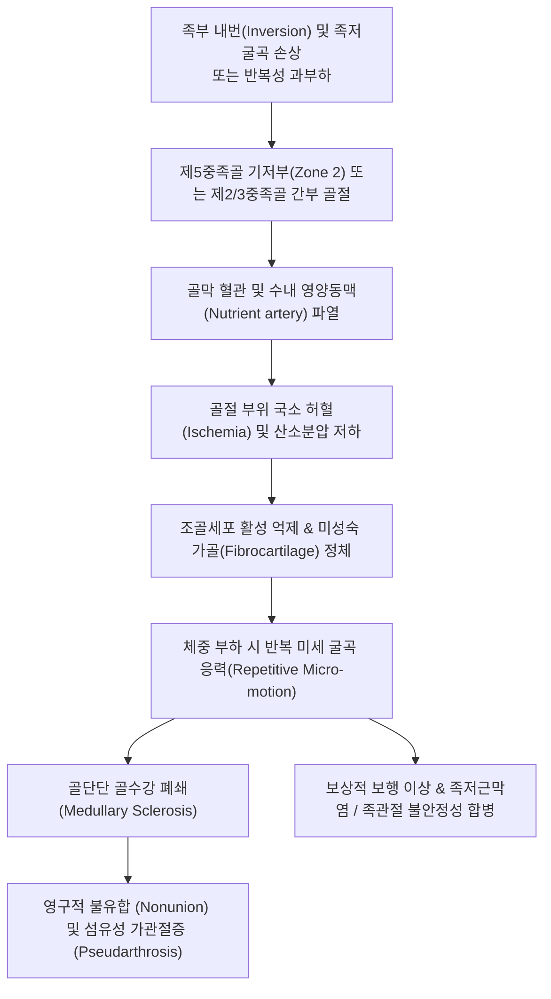

# 🩺 발허리뼈 골절 (Metatarsal Fracture / 중족골 골절 & 존스 골절)

> **핵심 3줄 요약 (Key Summary)**:
> - 📍 **병소 부위 & 해부·병태생리**: 발의 횡아치와 종아치를 지지하는 5개 [[발허리뼈]](중족골, Metatarsal bones)의 외상성 또는 과사용성 골절. 특히 제5발허리뼈 기저부 골단-골간 경계부(Zone 2, 진성 존스 골절)는 혈류 공급이 취약한 Watershed 구역으로 불유합(Nonunion) 위험이 극히 높음.
> - 🚩 **전형적 임상 양상**: 수상 직후 족부 등쪽/외측연의 급격한 종창 및 반상출혈, 족저 압박 및 보행 시 딛지 못하는 극심한 체중 부하통, 특정 중족골 간부 또는 결절부의 국소 골 타진통.
> - 🛠️ **핵심 검사 & 치료 전략**: 족부 3방향 X-ray(AP, Lateral, Oblique) 기반 Lawrence & Botte 구역 분류 감별. Zone 1은 보행부츠(CAM boot) 착용 하 조기 보존 치료, Zone 2/3 및 전위 골절은 비체중부하 깁스 또는 수술적 나사 고정술 의뢰; 골유합기 한약(당귀수산·자연동) 및 주변 연부조직 순환 침치료 병용.
> - ⚠️ **응급 의뢰 레드플래그**: 제1-2 발허리뼈 간격 벌어짐을 동반한 리스프랑 관절 손상(Lisfranc dislocation), 족부 4개 근막 구획의 내압 상승에 따른 구획 증후군 의심 소견(극심한 자발통, 수동 신전통, 감각 마비), 족배동맥 박동 소실 시 즉각 응급 정형외과 전원.

---

## 📌 목차
1. [질환 개요 & 해부학적 병태생리](#1-질환-개요--해부학적-병태생리)
2. [병태생리 메커니즘 & 생체역학적 악순환 네트워크](#2-병태생리-메커니즘--생체역학적-악순환-네트워크)
3. [임상 증상 & 이학적 검사(Physical Exam) 알고리즘](#3-임상-증상--이학적-검사physical-exam-알고리즘)
4. [감별 진단 매트릭스 (Differential Diagnosis)](#4-감별-진단-매트릭스-differential-diagnosis)
5. [한의 통합 치료 프로토콜 (침·약침·추나·한약)](#5-한의-통합-치료-프로토콜-침약침추나한약)
6. [양방 치료 & 병용·의뢰 기준 (Conventional Treatment & Referral)](#6-양방-치료--병용의뢰-기준-conventional-treatment--referral)
7. [재활 운동 & 생활습관 티칭 가이드](#7-재활-운동--생활습관-티칭-가이드)
8. [💡 사용자 진료실 핵심 필기 & 임상 노하우 (Melt-In 잔여 심화 집약)](#8--사용자-진료실-핵심-필기--임상-노하우-melt-in-잔여-심화-집약)
9. [출처 및 학술 참고 문헌 (References)](#9-출처-및-학술-참고-문헌-references)

---

## 1. 질환 개요 & 해부학적 병태생리

발허리뼈 골절(Metatarsal Fracture)은 발의 중간부와 앞발을 잇는 5개의 긴 뼈(중족골)에 발생하는 골절로, 전체 족부 골절의 약 35%를 차지하는 가장 흔한 손상이다. 무거운 물체의 낙하 등 직접 타격에 의한 외상성 골절과, 군인·마라토너·무용수 등에서 반복적인 지면 충격으로 발생하는 피로 골절(Stress fracture / 행군 골절, March fracture)로 대별된다.

![[발허리뼈골절_01_영상소견_존스골절_Xray.jpg]]
> [그림 1: ① 병태생리·영상 — 제5발허리뼈 기저부 골간-골단단 경계부에 발생한 진성 존스 골절 X-ray (Wikimedia Commons, CC BY-SA 4.0)]

![[발허리뼈골절_01_영상소견_제2중족골_피로골절_Xray.jpg]]
> [그림 2: ① 병태생리·영상 — 장기간 보행 과부하로 발생한 제2발허리뼈 간부 피로골절(행군 골절) 가골 형성 소견 (Wikimedia Commons, Public Domain)]

임상 및 한의 진료실에서 가장 주의 깊게 감별해야 하는 핵심 부위는 **제5발허리뼈 기저부 골절(Proximal fifth metatarsal fracture)** 이며, Lawrence & Botte 분류에 따라 예후와 치료 방침이 완전히 갈린다(Sepúlveda et al., 2026):

1. **Zone 1 (결절 견열 골절, Avulsion Fracture / Pseudo-Jones / Dancer's Fracture)**:
   - 제5중족골 조면(Tuberosity) 결절부의 골절.
   - 단비골근건(Peroneus brevis tendon) 또는 족저근막 외측대(Lateral band of plantar fascia)의 급격한 견인력에 의해 발생.
   - 풍부한 해면골(Cancellous bone) 혈류 덕분에 보행 부츠나 깁스를 통한 보존적 치료로 95% 이상 정상 골유합에 도달함.
2. **Zone 2 (진성 존스 골절, True Jones Fracture)**:
   - 제4-5 발허리뼈간 관절면(4th-5th intermetatarsal articulation)에서 시작하여 외측 피질골로 진행하는 골간단-골간 경계부(Metaphyseal-diaphyseal junction)의 횡골절.
   - 영양동맥(Nutrient artery)의 원위 진입로와 결절부 골단 혈관망 사이의 '혈관 결손 취약 구역(Watershed area)'에 위치하여 혈류 공급이 극히 불량함.
   - 지연 유합(Delayed union) 및 불유합(Nonunion) 발생률이 15~30%에 달함.
3. **Zone 3 (골간부 근위 피로골절, Proximal Diaphyseal Stress Fracture)**:
   - 제4-5 관절면 원위부 1.5cm 이상의 골간부에 위치.
   - 반복적인 비틀림 응력에 의해 발생하며, 피질골 비후와 골수강 폐쇄(Sclerosis)를 동반하여 불유합 위험이 가장 높음(Liu et al., 2026).

![[발허리뼈골절_01_영상소견_제5중족골기저부_견열골절_Xray.png]]
> [그림 3: ① 병태생리·영상 — 단비골근건 견인에 의한 제5중족골 조면 견열 골절(Zone 1) 방사선 소견 (Wikimedia Commons, Public Domain)]

---

## 2. 병태생리 메커니즘 & 생체역학적 악순환 네트워크

![[발허리뼈골절_02_해부도해_중족골치유구역_Polzer.jpg]]
> [그림 4: ② 관련 해부 구조물 — Polzer 및 Lawrence-Botte에 따른 제5발허리뼈 기저부 치유 구역 및 혈관 분포 해부도해 (Wikimedia Commons, CC BY-SA 3.0)]

발허리뼈는 정상 보행 시 입각기(Stance phase) 말기에 체중의 수 배에 달하는 굽힘 모멘트(Bending moment)와 비틀림 응력을 흡수한다. 제2, 제3 발허리뼈는 설상골(Cuneiforms) 사이에 단단히 끼어 있어 가동성이 거의 없는 '고정 축' 역할을 하므로 과사용 시 피로 골절이 호발한다.

반면 제5발허리뼈의 Zone 2 부위는 족부 역전(Inversion)과 족저굴곡 시 단비골근 및 제3비골근, 족저근막 외측대의 비틀림 인장력이 집중되는 해부학적 특성을 지닌다. 여기에 영양동맥 손상이 겹칠 경우, 정상적인 연골내 골화(Endochondral ossification) 과정이 정체되고 연골 섬유성 가관절증(Pseudarthrosis)으로 진행되는 생체역학적 악순환이 발생한다.

![[발허리뼈골절_02_병태생리_존스골절_불유합_가관절증_Xray.jpg]]
> [그림 5: ② 관련 해부 구조물 — 보존적 치료 실패 및 조기 체중 부하로 초래된 존스 골절의 불유합 및 가관절증 소견 (Wikimedia Commons, CC BY-SA 3.0)]

---

## 3. 임상 증상 & 이학적 검사(Physical Exam) 알고리즘

### 3.1 주요 자각 증상
- **족부 외측/배측 통증**: 발을 디딜 때(Heel-off 및 Push-off) 날카로운 통증이 발생하여 절뚝거림(Antalgic gait).
- **국소 종창 및 반상출혈**: 수상 후 수 시간 내 발등이나 발 외측 가장자리를 따라 멍(Bruising)과 부종 발생.
- **점진적 통증 (피로골절의 경우)**: 외상 병력 없이 수 주 전부터 보행이나 달리기 후 발등이 뻐근하다가 점차 보행 불능 상태로 악화.

### 3.2 핵심 이학적 검사법
1. **국소 골 타진통 및 압통 (Point Tenderness)**:
   - 제5발허리뼈 기저부 결절(Zone 1) 또는 관절면 1.5cm 원위부(Zone 2)를 손가락 끝으로 정밀 압진했을 때 극심한 날카로운 압통 유발.
2. **축성 압박 검사 (Axial Compression Test)**:
   - 검사자가 환자의 발가락(해당 발허리뼈의 족지)을 잡고 중족골 기저부 방향으로 직선 압박을 가할 때 골절 부위에서 뼈가 울리는 격통 재현.
3. **건 수축 저항 검사**:
   - 발목을 외번(Eversion) 및 족배굴곡시킬 때 저항을 가하면 단비골근건이 견인되면서 제5중족골 결절부에 통증 유발.
4. **오타와 발목 규칙 (Ottawa Ankle Rules - Foot Zone)**:
   - 제5발허리뼈 기저부 압통, 주상골(Navicular) 압통, 또는 수상 직후 및 진료실에서 4보 이상 보행 불능 중 하나라도 해당 시 단순 방사선 촬영(X-ray) 필수 적응증.

---

## 4. 감별 진단 매트릭스 (Differential Diagnosis)

![[발허리뼈골절_04_감별진단_리스프랑관절_골절탈구_Xray.jpg]]
> [그림 6: ④ 감별 진단 — 중족골 기저부 정렬 파열을 동반한 치명적 리스프랑 관절 손상 X-ray 소견 (Wikimedia Commons, CC BY-SA 4.0)]

| 감별 질환 | 호발 병변 위치 | 손상 기전 및 원인 | 방사선(X-ray) 감별 핵심 소견 | 치료 접근 및 예후 |
| :--- | :--- | :--- | :--- | :--- |
| **Zone 1 견열 골절** | 제5중족골 결절부 조면 | 단비골근건 급격한 견인 | 결절부 횡골절선, 관절면 침범 드뭄 | CAM boot 보행, 6~8주 내 양호한 유합 |
| **Zone 2 존스 골절** | 골간단-골간 경계부 | 족부 내번 비틀림 응력 | 제4-5 관절면 연장 횡골절, 수내경화 | 비체중부하 깁스 6~8주 또는 수술 고정 |
| **제2/3 중족골 행군 골절**| 제2, 3중족골 경부·간부 | 과도한 군사 훈련·마라톤 | 초기 2주 방사선 정상, 이후 방추형 가골 | 체중 부하 제한, 활동 중단 4~6주 |
| **[[리스프랑 관절 손상]]** | 제1-2 중족골-설상골 관절| 고에너지 외상 또는 족저굴곡 낙상 | 제1-2 중족골 간격 >2mm 이개, Fleck sign | 응급 수술적 정복 및 내고정 필수 |
| **베살리우스 부골 ([[Os Vesalianum]])** | 제5중족골 결절 외측 후방 | 선천성 악세사리 골화 중심 | 매끄러운 피질골 테두리를 가진 둥근 뼛조각(Brickman et al., 2026) | 임상적 무증상 관찰 또는 보존 요법 |

---

## 5. 한의 통합 치료 프로토콜 (침·약침·추나·한약)

발허리뼈 골절의 한의 치료는 골절 고정기(부종·어혈 제거 및 골세포 분화 촉진)와 고정 해제 후 재활기(관절 강직 해소 및 족부 고유수용성 감각 회복)로 나누어 적용한다.

![[발허리뼈골절_05_술기실사_족부침치료.jpg]]
> [그림 7: ⑤ 한의 통합 치료 — 족부 골절 후 연부조직 순환 촉진 및 어혈 제거를 위한 자침 시술 (Wikimedia Commons, Joy Walraven, CC BY 2.0)]

### 5.1 침치료 & 전침 요법
- **배혈 혈위**: 구허(GB40), 신맥(BL62), 조해(KI6), 태충(LR3), 속골(BL65), 통곡(BL66), 족임읍(GB41), 팔풍(EX-LE10).
- **골절 인접부 자침**: 골절선 자체를 직접 자침하는 것은 피하고, 골절 부위 상하 1~2cm 연부조직 및 비골근건 부착부에 0.25×30mm 호침을 사자하여 국소 미세혈관 확장 유도.
- **전침(Electroacupuncture)**: 속골-구허, 족임읍-신맥을 연결하여 2Hz 저빈도 자극을 20분간 적용함으로써 골막의 BMP-2(Bone Morphogenetic Protein-2) 발현 및 혈관신생(Angiogenesis) 촉진.

### 5.2 약침 요법
- **급성 혈종 흡수기**: **중성어혈 약침** 1.0cc를 족배부 부종 부위 및 신맥·구허 혈위에 피내/피하 분할 주입하여 림프 순환 및 삼출물 배출 촉진.
- **골유합 촉진기 (3주 이후)**: **신바로 약침** 또는 **자하거 약침**을 비골근건 건막 주변 및 중족골 기저부 골막 인접부에 주입하여 결합조직 재생 촉진.

### 5.3 한약 치료 (골유합 특화 처방)
- **초기 어혈기 (수상 후 1~2주)**: 당귀수산(當歸鬚散) 가미방 (자연동 自然銅 4g, 몰약 沒藥 3g, 유향 乳香 3g 가미) — 국소 혈종 흡수, 미세혈관 순환 개선.
- **중기 가골형성기 (수상 후 3~6주)**: 접골자금단(接骨紫金丹) 또는 궁귀조혈음(芎歸調血飮) 가미방 (속단 續斷 8g, 골쇄보 骨碎補 8g, 우슬 牛膝 6g 가미) — 조골세포 활성화 및 가골 강도 증진.
- **후기 재활기 (수상 후 6주 이후)**: 독활기생탕(獨活寄生湯) — 관절낭 강직 해소, 인대 지지력 회복.

### 5.4 추나 요법
- **주의**: 골절 부위가 완전히 방사선학적으로 유합되기 전까지 중족골에 대한 직접적 염전(Torsion)이나 전단 응력을 가하는 추나는 절대 금기.
- **적용**: 깁스 고정으로 인해 굳어진 족퇴관절(Talocrural joint), 거골하관절(Subtalar joint) 및 족근중족관절의 부드러운 수동 관절 가동술(JS 족부 신연기법)과 비골근·비복근 근막이완술(Myofascial release) 적용.

---

## 6. 양방 치료 & 병용·의뢰 기준 (Conventional Treatment & Referral)

![[발허리뼈골절_06_보존치료_단하지보행보조기_CAMboot.jpg]]
> [그림 8: ⑥ 양방 보존 치료 — 안정성 골절(Zone 1)의 체중 분산 및 보호를 위한 단하지 보행 보조기(CAM walking boot) (Wikimedia Commons, CC BY-SA 3.0)]

### 6.1 구역별 정형외과 치료 원칙
1. **Zone 1 (결절 견열 골절)**:
   - 관절면 전위가 2mm 미만인 경우: 단하지 석고 붕대 또는 단하지 보행 보조기(CAM boot)를 착용하고 환자가 견딜 수 있는 한도 내에서 조기 체중 부하(Weight bearing as tolerated) 허용. 4~6주 후 유합 확인.
2. **Zone 2 (존스 골절)**:
   - 일반 환자: 비체중부하 단하지 석고(Non-weight-bearing short leg cast)를 최소 6~8주간 철저히 유지. 목발 사용 필수.
   - 운동선수 또는 활동적 성인: 불유합 및 재골절 방지를 위해 조기 수술적 고정(경피적 골수내 유관 나사 고정술, Percutaneous intramedullary cannulated screw fixation) 선호(Sepúlveda et al., 2026).
3. **Zone 3 (피로 골절)**:
   - 비체중부하 깁스 최소 8~12주 시행. 수내 경화가 이미 진행된 만성 불유합형 피로골절은 골이식술 및 금속판/나사 내고정술 필요.

### 6.2 양방·전문과 응급 의뢰 기준
- **구획증후군(Compartment syndrome)**: 족부의 극심한 팽창, 발가락 수동 신전 시 견딜 수 없는 통증, 족저 감각 저하.
- **리스프랑 관절 손상 의심**: 제1-2 중족골 기저부 간격이 2mm 이상 벌어졌거나 족저부에 반상출혈(Plantar ecchymosis) 관찰 시.
- **개방성 골절(Open fracture)** 또는 피부 괴사 위험(Tenting) 동반.

---

## 7. 재활 운동 & 생활습관 티칭 가이드

### 7.1 단계별 재활 프로토콜
1. **1단계: 비체중부하 가동성 훈련 (수상 후 2~4주)**
   - **발가락 굴신 운동**: 깁스 밖으로 노출된 발가락을 쥐었다 폈다 반복하여 내재근 위축 방지 및 림프 환류 촉진.
   - **족관절 알파벳 쓰기**: 발목을 이용하여 공중에 A부터 Z까지 글씨를 쓰며 거골하관절 가동 범위 유지.
2. **2단계: 부분 체중부하 및 내재근 강화 (수상 후 4~6주)**
   - **수건 끌어당기기 (Towel Curl)**: 의자에 앉아 바닥에 수건을 깔고 발가락 힘으로 수건을 몸 쪽으로 끌어당김 (10회씩 3세트).
   - **구슬 집어 올리기 (Marble Pickup)**: 발가락으로 바닥의 작은 구슬이나 볼펜을 집어 상자에 넣는 훈련.
3. **3단계: 완전 체중부하 및 균형 감각 회복 (수상 후 8주 이후)**
   - **밸런스 보드 훈련 (BAPS Board)**: 한 발로 서서 밸런스 패드 위에서 30초간 균형 잡기.
   - **카프 레이즈 (Calf Raise)**: 양발 뒤꿈치 들기부터 시작하여 점진적으로 외측 중족골 아치 부하 훈련.

---

## 8. 💡 사용자 진료실 핵심 필기 & 임상 노하우 (Melt-In 잔여 심화 집약)

- **"발목 삐었다"고 온 환자의 발가락을 반드시 만져라**: 외측 발목 염좌(전거비인대 손상)와 제5발허리뼈 기저부 골절은 수상 기전(발목 족저굴곡+내번)이 완전히 동일하다. 환자가 발목 바깥쪽 통증을 호소할 때, 전거비인대만 누르고 제5중족골 결절부를 누르지 않으면 골절을 100% 놓친다. 반드시 뼈의 결절부를 엄지로 꾹 눌러 '골 타진통'이 있는지 확인해야 한다.
- **존스 골절에 "침 맞고 걸으세요"는 의료 사고의 지름길**: Zone 1 견열골절은 CAM 부츠 신고 디뎌도 뼈가 잘 붙지만, Zone 2 존스 골절은 혈류가 없는 Watershed 구역이다. 여기에 비체중부하 티칭을 안 하고 딛고 다니게 하면 십중팔구 불유합(가관절증)으로 넘어가 결국 뼈를 깎아내고 나사를 박는 수술을 받아야 한다. 엑스레이 상 골절선 위치가 결절부(Zone 1)인지 관절면 경계부(Zone 2)인지 자로 재듯 확인하라.
- **피로 골절(행군 골절)의 방사선 맹점**: 제2, 3중족골 피로골절은 증상 발생 후 초기 10~14일간은 단순 X-ray 상 아무런 이상이 보이지 않는 경우가 허다하다. 마라톤이나 장거리 보행 후 발등이 붓고 딛기 힘든데 엑스레이가 정상이라면, "뼈에는 이상 없습니다"라고 단정하지 말고 "미세 골절 가능성이 있으니 2주간 푹 쉬고 다시 찍어보자"고 설명해야 신뢰를 잃지 않는다.

---

## 9. 출처 및 학술 참고 문헌 (References)

- **Sepúlveda M, et al. (2026)**. From Jones to avulsion: rethinking the fifth metatarsal base. *Current opinion in pediatrics*. [PMID 42627241](https://pubmed.ncbi.nlm.nih.gov/42627241/)
  - **[연구 요약]**: 제5발허리뼈 기저부 골절의 해부학적 구역 분류(Zone 1 견열골절 vs Zone 2 진성 존스 골절)와 보존적 치료 및 수술적 내고정술의 최신 치료 지침을 재정립한 종설. 소아 및 젊은 층에서의 혈류 역학적 특성과 불유합 방지 프로토콜을 제시함.
- **Liu X, et al. (2026)**. Navicular and Fifth Metatarsal Base Stress Fractures: An illustrated anatomical review. *KSSTA*. [PMID 42171011](https://pubmed.ncbi.nlm.nih.gov/42171011/)
  - **[연구 요약]**: 족부 주상골 및 제5발허리뼈 기저부 피로골절의 해부학적 발생 기전과 생체역학적 응력 집중도를 고찰한 문헌. 혈관 조영 분석을 통해 골단-골간 경계부의 혈류 취약 구역(Watershed area)과 지연 유합의 상관성을 규명함.
- **Brickman B, et al. (2026)**. A Rare Pediatric Cause of Lateral Foot Pain: Symptomatic Os Vesalianum Pedis Requiring Excision and Peroneus Brevis Repair. *Journal of orthopaedic case reports*. [PMID 42273472](https://pubmed.ncbi.nlm.nih.gov/42273472/)
  - **[연구 요약]**: 제5발허리뼈 기저부 골절과 감별해야 하는 선천성 부골인 베살리우스 골(Os Vesalianum Pedis)의 임상 증례 보고. 부골과 견열 골절 간의 방사선학적 감별 진단점과 단비골근건 부착부 손상에 대한 임상적 접근법을 기술함.

---

## 관련 노트

- [[발허리뼈]]
- [[리스프랑 관절 손상]]
- [[발목 염좌]]
- [[발목 골절]]
- [[족저근막염]]
- [[Os Vesalianum]]
