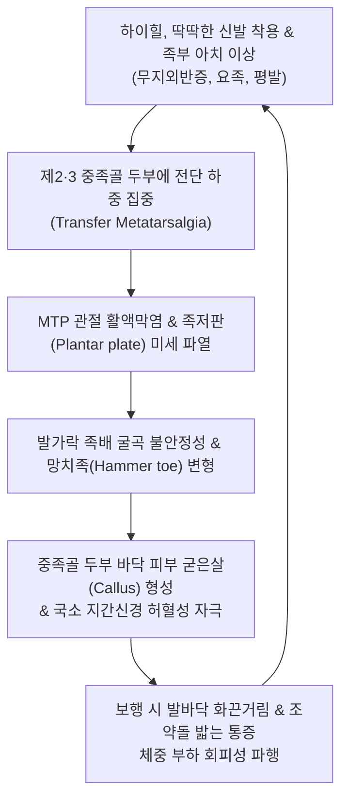

# 🩺 발허리뼈 관절통 (Metatarsalgia / MTP Joint Pain)

> **핵심 3줄 요약 (Key Summary)**:
> - 📍 **병소 부위 & 해부·병태생리**: 발허리뼈(중족골, Metatarsal bone) 두부와 몸쪽발가락뼈(근위지골)가 만나는 발허리발가락관절(MTP joint) 및 족저판(Plantar plate)에 체중 부하 불균형과 전족부 횡아치 붕괴로 인해 발생하는 만성 압박성 통증 및 활액막염 증후군이다.
> - 🚩 **전형적 임상 양상**: 주로 제2·3 중족골 두부 발바닥 면에 "자갈이나 조약돌을 밟고 서 있는 것 같다"는 화끈거리고 찌릿한 통증을 호소하며, 맨발로 딱딱한 바닥을 걷거나 하이힐, 좁은 신발을 신을 때 통증이 극심해진다.
> - 🛠️ **핵심 검사 & 치료 전략**: 중족골 두부 족저면 압통 촉진, 라크만 검사(Lachman test of MTP) 및 뮬더 징후(Mulder sign, 몰톤신경종 감별)로 진단하고, [[팔풍]](EX-LE10)·[[태충]](LR3) 침치료, 중성어혈·신바로약침, 전족부 횡아치 재건 추나 및 메타타살 패드(Metatarsal pad) 인솔을 적용한다.
> - ⚠️ **응급 의뢰 레드플래그**: 당뇨병성 신경병증 환자에서 무통성으로 진행하는 중족골 두부 궤양 및 골수염(Charcot foot 의심), 발허리뼈 무혈성 괴사(Freiberg 질환 급성기), 급격한 화농성 관절염(발적, 종창, 고열).

---

## 📌 목차
1. [질환 개요 & 해부학적 병태생리](#1-질환-개요--해부학적-병태생리)
2. [병태생리 메커니즘 & 생체역학적 악순환 네트워크](#2-병태생리-메커니즘--생체역학적-악순환-네트워크)
3. [임상 증상 & 이학적 검사(Physical Exam) 알고리즘](#3-임상-증상--이학적-검사physical-exam-알고리즘)
4. [감별 진단 매트릭스 (Differential Diagnosis)](#4-감별-진단-매트릭스-differential-diagnosis)
5. [한의 통합 치료 프로토콜 (침·약침·추나·한약)](#5-한의-통합-치료-프로토콜-침약침추나한약)
6. [양방 치료 & 병용·의뢰 기준 (Conventional Treatment & Referral)](#6-양방-치료--병용의뢰-기준-conventional-treatment--referral)
7. [재활 운동 & 생활습관 티칭 가이드](#7-재활-운동--생활습관-티칭-가이드)
8. [💡 사용자 진료실 핵심 필기 & 임상 노하우 (Melt-In 잔여 심화 집약)](#8--사용자-진료실-핵심-필기--임상-노하우-melt-in-잔여-심화-집약)
9. [출처 및 학술 참고 문헌 (References)](#9-출처-및-학술-참고-문헌-references)

---

## 1. 질환 개요 & 해부학적 병태생리

**발허리뼈 관절통(Metatarsalgia, 한자명: 中足骨痛)**은 전족부(Forefoot)의 발허리뼈 두부(Metatarsal head) 부위에 체중이 비정상적으로 집중되면서 활액막염, 활액낭염, 족저판 파열 및 관절염이 발생하는 임상적 증후군이다.

해부학적으로 전족부는 보행 주기의 입각기 말기(Push-off phase) 동안 체중의 약 110~150%에 달하는 수직 부하를 감당한다. 정상 발에서는 제1 중족골 두부가 약 33%의 하중을 분산하고, 나머지 제2~5 중족골이 균등하게 분산한다. 그러나 제1 중족골이 짧은 모튼 족(Morton's foot), 무지외반증, 요족(Pes cavus) 또는 하이힐 착용 등으로 인해 제1 중족골의 지지력이 상실되면, 상대적으로 가늘고 긴 **제2·3 중족골 두부로 과도한 전단력이 전이(Transfer metatarsalgia)**된다.

중족골 두부 바닥에는 관절낭을 강화하는 섬유연골 복합체인 **족저판(Plantar plate)**이 존재하여 발가락의 과신전을 방어하는데, 지속적인 압박 부하가 가해지면 족저판의 미세 파열과 불안정성이 발생하여 MTP 관절의 불완전 탈구(Subluxation)와 해머토(Hammer toe, 망치족) 변형이 동반된다.

![[발허리뼈골절_02_해부도해_중족골치유구역_Polzer.jpg]]
> [그림 1: ① 해부·병태 — 발허리뼈(중족골)의 골성 구조, 관절면 및 횡아치 역학 해부도해]

![[족저신경_주행_해부도_Gray833.png]]
> [그림 2: ① 해부 — 발허리뼈 두부 사이를 주행하는 내측 및 외측 족저신경 분지 해부도]

---

## 2. 병태생리 메커니즘 & 생체역학적 악순환 네트워크

발허리뼈 관절통의 병태생리는 **'생체역학적 횡아치 붕괴'**와 **'연부조직 완충능 상실'**의 악순환이다.

1. **전족부 횡아치 붕괴와 굳은살(Callus) 형성**:
   - 중족골 두부들을 가로로 묶어주는 심부 횡중족인대(Deep transverse metatarsal ligament)가 이완되면 전족부 횡아치가 무너져 중족골 두부가 바닥으로 내려앉는다.
   - 반복 마찰로 인해 피부 각질층이 비후되어 원추형 굳은살(Callus)이 형성되며, 이 굳은살 자체가 못처럼 작용하여 하방의 점액낭과 지간신경을 더욱 강하게 찌르는 역학적 악순환을 형성한다.
2. **지간신경 압박 및 몰톤 신경종과의 상호 연관**:
   - 좁은 신발을 신으면 중족골 두부 사이 간격이 좁아져 제3-4지 또는 제2-3지 사이를 주행하는 고유 지간신경(Common digital nerve)이 압박을 받아 신경종(Morton's neuroma)이 2차적으로 병발한다.

![[몰톤신경종_지간신경_발생부위_도해.jpg]]
> [그림 3: ① 병태도해 — 발허리뼈 두부 사이에서 신경 압박 및 신경종이 발생하는 몰톤 신경종 병태 도해]

---

## 3. 임상 증상 & 이학적 검사(Physical Exam) 알고리즘

### 1) 임상 증상
- **발바닥 전족부 작열통**: 발가락 뿌리 바로 아래 발바닥 볼(Ball of the foot) 부위가 화끈거리고 타는 듯하며, 오래 서 있거나 걸으면 발바닥이 찢어질 듯 아프다.
- **조약돌 감각**: 양말 속에 모래알이나 돌멩이가 들어있는 듯한 둔탁한 이물감을 지속적으로 호소한다.
- **굳은살 동반**: 제2, 제3 중족골 두부 바로 아래 국소적인 통증성 굳은살이 뚜렷하게 관찰된다.

### 2) 이학적 검사 알고리즘
1. **중족골 두부 족저면 압통 검사**: 발가락을 약간 족배 굴곡시킨 상태에서 검사자의 엄지손가락으로 각 중족골 두부 바로 아래를 족저에서 족배 방향으로 직접 압박할 때 국소 압통을 확인한다.
2. **라크만 검사 (Lachman test of MTP joint)**: 한 손으로 중족골 경부를 고정하고 다른 손으로 기저 지골을 잡고 수직 방향으로 전후 전위시킬 때 관절의 아탈구와 통증이 발생하면 족저판 파열(Plantar plate tear)을 시사한다.
3. **뮬더 징후 (Mulder Sign)**: 양측에서 중족골 두부를 가로 방향으로 꽉 쥐어 압박하면서 동시에 지간 공간을 촉진할 때 '딸깍'하는 탄발음과 함께 전격성 방사통이 유발되면 [[몰톤 신경종]]으로 감별된다.

![[망치족_관절변형_실사.jpg]]
> [그림 4: ② 임상 소견 — 발허리뼈 두부의 과도한 하중 집중을 유발하는 발가락 근위지관절 망치족(Hammer toe) 변형 실사]

![[바빈스키반사_자극경로_족저호_실사.png]]
> [그림 5: ② 이학적 검사 — 발바닥 족저 아치 및 전족부 지간 공간 압통을 유도하는 검진 실사]

---

## 4. 감별 진단 매트릭스 (Differential Diagnosis)

| 감별 질환 | 호발 부위 및 기전 | 주 통증 양상 | 이학적 검사 특징 | 단순 방사선 / 초음파 소견 |
| :--- | :--- | :--- | :--- | :--- |
| **발허리뼈 관절통** | 제2·3 중족골 두부 족저면 | 뻐근한 압박통, 굳은살 동반 | MTP 직접 압통 (+), Mulder 음성 | 뼈 이상 없음, 초음파 상 활액막염 |
| **[[몰톤 신경종]]** | 제3-4지 또는 2-3지 지간 공간 | 찌릿하고 타는 듯한 신경통, 발가락 저림 | **Mulder sign (+)**, 지간 압박통 | 초음파 상 5mm 이상 저에코성 신경종 |
| **[[중족골 피로골절]]** | 제2 중족골 간부/경부 | 보행 시 극심한 골성 통증, 족배부 부종 | 중족골 간부 압통, 축성 타진통 | 2~3주 후 X-ray 상 골막 반응/가골 |
| **프라이버그 질환** | 청소년기 제2 중족골 두부 | 중족골 두부의 무혈관성 괴사 | 관절 운동 제한, 관절 마찰음 | X-ray 상 중족골 두부 편평화/경화 |
| **급성 [[통풍]]** | 제1 MTP 관절 (엄지발가락) | 극심한 발적, 종창, 열감, 산통 | 스치기만 해도 극통 | 요산염 침착, 혈중 요산 수치 상승 |

![[발허리뼈골절_01_영상소견_제2중족골_피로골절_Xray.jpg]]
> [그림 6: ① 영상 감별 — 단순 발허리뼈 관절통과 감별해야 할 제2중족골 경부 피로골절(행군골절) X-ray]

### ⚠️ 응급 의뢰 레드플래그
- **당뇨병 환자의 감각 저하 부위 궤양 형성(Mal perforant)**: 연부조직 괴사 및 골수염 진행 위험이 극히 높으므로 즉시 당뇨발 전문 클리닉 의뢰.
- **청소년기 제2 중족골 두부의 점진적 함몰**: 프라이버그 병(Freiberg's infraction)으로 인한 조기 관절 파괴 의심 시 정형외과 정밀 MRI 의뢰.

---

## 5. 한의 통합 치료 프로토콜 (침·약침·추나·한약)

### 1) 침구 치료 (Acupuncture)
- **주요 혈위**: [[팔풍]](EX-LE10), [[태충]](LR3), [[함곡]](ST43), [[내정]](ST44), [[용천]](KI1), [[곤륜]](BL60), [[태계]](KI3).
- **시술 기법**:
  - **팔풍혈(八風穴) 지간 사자 자침**: 중족골 두부 사이 지간 공간으로 0.25×30mm 호침을 족배에서 족저 방향으로 15~20mm 사자하여 지간 신경 주위의 울혈과 활액낭 부종을 배출시킨다.
  - 전족부 심부 TrP에 미세 전류 전침(2Hz)을 15분간 적용하여 감작된 통각 수용기를 안정화한다.

### 2) 약침 치료 (Pharmacopuncture)
- **신바로약침 / 중성어혈약침**: MTP 관절낭 및 족저판 부착부에 0.3~0.5cc씩 총 1.0cc를 자입하여 만성 기계적 활액막염과 신경 염증을 강력히 소퇴시킨다.
- **봉약침(Sweet BV 1:20,000)**: 퇴행성 MTP 관절염 및 연골 손상 부위에 극미량 점자하여 미세혈류를 개선한다.

### 3) 추나 요법 (Chuna Manual Therapy)
- **전족부 횡아치 재건 추나(Metatarsal Arch Mobilization)**: 술자의 엄지손가락으로 제2·3 중족골 두부를 발바닥 쪽에서 족배 쪽으로 받쳐 올리고, 제1·5 중족골을 족저 방향으로 부드럽게 감싸 쥐어 무너진 전족부 횡아치를 복원하는 가동술을 시행한다.
- **거골 및 족근골 가동 추나**: 발목 관절의 배굴 가동성을 개선하여 입각기 말기 전족부로 가해지는 과도한 보상성 압력을 차단한다.

![[발허리뼈골절_05_술기실사_족부침치료.jpg]]
> [그림 7: ③ 한의 술기 — 발허리뼈 사이 팔풍혈 및 족배부 경혈 자침 치료 술기 실사]

### 4) 한약 치료 (Herbal Medicine)
- **[[소경활혈탕]](疎經活血湯)**: 풍습열(風濕熱)과 어혈로 인해 발바닥 앞쪽이 화끈거리고 찌릿한 신경혈관성 통증을 치료한다.
- **[[사물탕]](四物湯) 합 우슬, 방기**: 족부 말단 혈류 저하 및 인대 이완성 관절통에 기혈을 공급한다.

---

## 6. 양방 치료 & 병용·의뢰 기준 (Conventional Treatment & Referral)

### 1) 패드 및 보조기 요법 (핵심)
- **메타타살 패드(Metatarsal Pad)**: 중족골 두부 바로 '뒤쪽(몸쪽)'에 패드를 부착하여 보행 시 중족골 두부가 바닥에 닿기 전에 하중을 가로막아 압력을 공중에 띄우는 것이 가장 효과적인 비수술 치료법이다.
- **로커 바텀 슈즈(Rocker-bottom shoe)**: 롤링 밑창 신발을 통해 전족부 굴곡 압력을 분산한다.

### 2) 수술 적응증
- 족저판 완전 파열로 발가락이 교차(Crossover toe)되거나 탈구된 경우: 족저판 봉합술 및 중족골 단축 절골술(Weil osteotomy) 시행.

![[발허리뼈골절_06_보존치료_단하지보행보조기_CAMboot.jpg]]
> [그림 8: ④ 보존 치료 — 전족부 횡아치 압박 완화 및 하중 분산을 위한 맞춤형 인솔 및 족부 보조기]

---

## 7. 재활 운동 & 생활습관 티칭 가이드

### 1) 단족 운동 (Short Foot Exercise)
- 발가락을 웅크리지 않고 중족골 두부를 발뒤꿈치 쪽으로 끌어당겨 족저 내재근을 강화하고 내측 종아치와 횡아치를 동시에 세운다.

### 2) 아킬레스건 및 족저근막 스트레칭
- 종아리 비복근과 아킬레스건이 단축되면 보행 시 뒤꿈치가 일찍 떨어져 전족부에 과부하가 걸린다. 계단 끝에 발 앞쪽만 걸치고 뒤꿈치를 아래로 늘리는 스트레칭을 하루 3회 교육한다.

### 3) 신발 지도
- 앞코가 뾰족한 신발, 하이힐, 밑창이 종이처럼 얇은 단화(플랫슈즈) 착용을 엄격히 금지하고, 앞볼이 넓고 쿠션감이 있는 운동화를 착용하도록 지도한다.

---

## 8. 💡 사용자 진료실 핵심 필기 & 임상 노하우 (Melt-In 잔여 심화 집약)

- **메타타살 패드 부착 위치의 결정적 실수 방지**:
  - 환자들에게 패드를 사서 붙이라고 하면 10명 중 9명은 **아픈 곳(중족골 두부 바로 아래)에 패드를 붙여서 통증을 2배로 악화**시켜 온다.
  - 반드시 진료실에서 네임펜으로 환자의 발바닥에 중족골 두부 뼈를 만져 표시해주고, "아픈 뼈 바로 뒤쪽 1cm 패인 곳"에 패드의 가장 두꺼운 정점이 오도록 직접 붙여주어야 즉각적인 제통 효과(압력 60% 이상 감소)가 나타난다.
- **팔풍혈 심자 시 감전감 주의**:
  - 팔풍혈 자침 시 침첨이 너무 족저 신경 본간을 직접 찌르면 발가락 끝으로 심한 방전감이 발생할 수 있으므로, 침첨을 족배 횡인대 심부로 부드럽게 밀어 넣으며 득기감(묵직한 산창감)을 얻는 것이 요령이다.

---

## 9. 출처 및 학술 참고 문헌 (References)

1. Bowen CJ, et al. (2026). Orthotics for First Metatarsophalangeal Osteoarthritis: Are we Asking the Wrong Question?. *J Foot Ankle Res*, 19(1):e12450. [PMID 42543499](https://pubmed.ncbi.nlm.nih.gov/42543499/)

2. Nery C, et al. (2026). Metatarsophalangeal Joint Instability: Anatomy and Physiopathology. *Foot Ankle Clin*, 31(1):15-28. [PMID 42209092](https://pubmed.ncbi.nlm.nih.gov/42209092/)

3. Baumhauer JF, et al. (2026). Lesser Metatarsophalangeal Joint Instability: Nonsurgical Treatment Alternatives. *Foot Ankle Clin*, 31(1):29-42. [PMID 42209093](https://pubmed.ncbi.nlm.nih.gov/42209093/)

---

## 관련 노트

- [[몰톤 신경종]]
- [[중족골통]]
- [[발허리뼈 골절]]
- [[통풍]]
- [[족저근막염]]
- [[망치족]]
