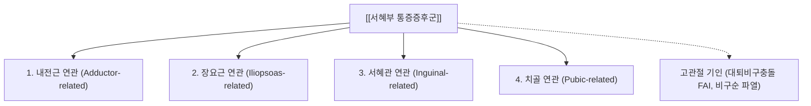

---
aliases:
  - 서혜부 통증증후군
  - 사타구니 통증
  - Groin pain syndrome
  - 운동선수 서혜부 통증
tags:
  - 질환
  - 근골격계
  - 서혜부
  - 하지
  - 도하합의
  - 내전근
  - 장요근
---
# 🩺 [[서혜부 통증증후군]] (Groin Pain Syndrome, 사타구니 통증)

> **핵심 요약 (Key Summary)**:
> 서혜부 및 치골 주위 연부조직과 관절의 과사용 및 전단력 손상으로 인해 발생하는 만성 사타구니 통증 증후군입니다.
> 2015 도하 합의(Doha Agreement)에 따라 내전근·장요근·서혜관·치골 연관의 4대 임상 아형으로 분류되며 대퇴비구충돌(FAI)과 감별합니다.
> 달리기와 킥 동작 시 통증이 악화되며 장내전근 및 장요근 건막 침도 박리술과 골반 회전 교정 추나요법의 핵심 적응증입니다.

---

## 📌 목차
1. [질환 개요 & 2015 도하 합의(Doha Agreement) 4대 분류](#1-질환-개요--2015-도하-합의doha-agreement-4대-분류)
2. [병태생리 및 해부학적 발생 기전](#2-병태생리-및-해부학적-발생-기전)
3. [핵심 이학적 검사 & 감별 진단](#3-핵심-이학적-검사--감별-진단)
4. [임상 양상 및 영상 진단 (MRI/초음파)](#4-임상-양상-및-영상-진단-mri초음파)
5. [한의학적 통합 치료 프로토콜 (추나·침도·약침)](#5-한의학적-통합-치료-프로토콜-추나침도약침)
6. [재활 운동 및 예방 프로토콜](#6-재활-운동-및-예방-프로토콜)
7. [출처 및 학술 참고 문헌 (References)](#7-출처-및-학술-참고-문헌-references)

---

## 1. 질환 개요 & 2015 도하 합의(Doha Agreement) 4대 분류

축구, 하키, 육상 등 방향 전환과 킥이 빈번한 운동선수와 일반인에게 호발하는 만성 서혜부 통증을 체계화한 국제 표준 분류 체계입니다.

1. **내전근 연관 (Adductor-related)**: 가장 흔함(60% 이상). [[장내전근]] 건 부착부 압통 및 저항 내전 시 통증.
2. **장요근 연관 (Iliopsoas-related)**: [[장요근]] 건염 또는 점액낭염. 고관절 저항 굴곡 및 수동 신전 스트레칭 시 통증.
3. **서혜관 연관 (Inguinal-related)**: 복벽 건막 약화 및 서혜관 후벽 손상(스포츠 탈장, Athletic pubalgia). 기침이나 복압 상승 시 통증.
4. **치골 연관 (Pubic-related)**: [[치골]] 결합부 골막염(Osteitis pubis) 및 국소 압통.

---

## 2. 병태생리 및 해부학적 발생 기전

* **전복벽과 내전근의 상반된 장력 불균형**:
  * 골반 치골체에 위쪽으로는 [[복직근]]이, 아래쪽으로는 [[장내전근]]이 부착.
  * 급격한 감속, 방향 전환, 킥 동작 시 골반에 비대칭적 전단력(Shearing stress)이 가해져 치골 결합부와 건막 접합부에 미세 파열과 만성 염증 유발.
* **코어 안정성 결손과 장요근 과부하**:
  * 골반저근과 [[복횡근]]의 지지력 약화 시 장요근이 과도하게 수축하여 대퇴골두를 전방으로 밀어내며 서혜인대 하부를 압박.

---

## 3. 핵심 이학적 검사 & 감별 진단

* **스퀴즈 검사 (Squeeze Test)**:
  * 무릎을 0° 또는 45° 굴곡한 상태에서 양 무릎 사이에 주먹이나 공을 끼우고 최대 힘으로 모으게(내전) 할 때 서혜부 통증 유발 시 내전근 병변 양성.
* **장요근 저항 굴곡 검사**:
  * 앙와위에서 하지를 들어 올릴 때 하방 압력을 가해 저항을 줄 때 서혜부 심부 통증 재현 시 장요근 병변 양성.
* **패트릭 검사 (FABER Test) & FADIR 검사**:
  * 고관절 관절순 파열, 대퇴비구충돌증후군(FAI) 감별.

---

## 4. 임상 양상 및 영상 진단 (MRI/초음파)

* **증상**: 달릴 때, 발차기할 때, 방향 전환할 때 서혜부 안쪽이 뻐근하고 날카롭게 아픔. 아침 기상 시 뻣뻣하다가 움직이면 다소 풀리나 운동 후 다시 악화.
* **MRI 소견**: 치골체 골수 부종(Bone marrow edema), 장내전근 건막 부착부 고신호강도, 치골결합 분리.
* **초음파 소견**: 장내전근 건의 저에코성 비후 및 도플러 혈류 증가.

---

## 5. 한의학적 통합 치료 프로토콜 (추나·침도·약침)

* **침도 미세 박리술**:
  * **표적 부위**: 치골 결절 하부 [[장내전근]] 건 부착부의 만성 석회화 및 반흔 조직을 소침도로 미세 절개하여 유착 박리 및 국소 신생 혈관 생성 촉진.
* **약침 치료**:
  * 치골 결합부 및 장요근 건 주위에 [[신바로약침]] 또는 [[오공약침]](0.5~1.0ml)을 주입하여 신경인성 염증 차단.
* **골반 교정 추나요법**:
  * 골반 비틀림(장골 전후방 회전 변위) 및 치골 결합 상하 전위를 교정하여 치골에 걸리는 기계적 전단력 해소.

---

## 6. 재활 운동 및 예방 프로토콜

* **코펜하겐 내전근 운동 (Copenhagen Adduction Exercise)**:
  * 측와위 플랭크 자세에서 위쪽 다리로 벤치를 지지하며 내전근의 원심성(Eccentric) 근력을 강화하는 최고 수준의 예방 운동.
* **장요근 스트레칭 & 둔근 강화**:
  * 단축된 장요근을 신장시키고 [[대둔근]]과 중둔근을 강화하여 골반 전방 경사 억제.

---

## 7. 출처 및 학술 참고 문헌 (References)
* Weir A, et al. Doha agreement meeting on terminology and definitions in groin pain in athletes. *Br J Sports Med*. 2015;49(12):768-774.
  * `[연구 요약]`: 서혜부 통증증후군의 국제 합의 분류 체계(내전근, 장요근, 서혜관, 치골 연관) 정립 논문.
* Serner A, et al. Diagnosis of groin pain: a systematic review of clinical diagnostic tests. *Br J Sports Med*. 2015;49(12):803-809.
  * `[연구 요약]`: 스퀴즈 검사를 포함한 서혜부 통증 진단 이학적 검사의 신뢰도 및 타당도 체계적 문헌고찰.
