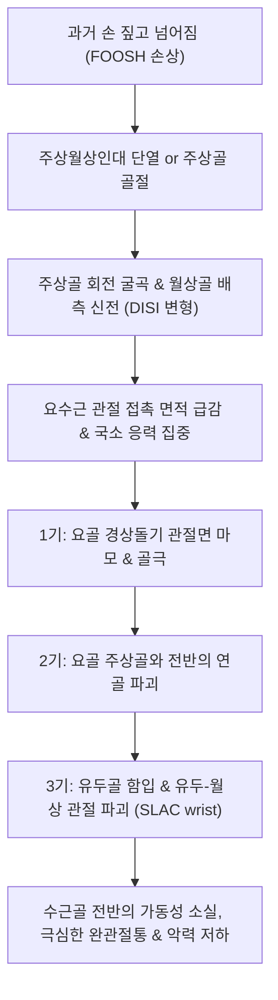

# 🩺 수근관절 관절염 (Wrist Osteoarthritis)

> **상위 분류**: [[근골격계 질환]] > [[상지 질환]] > [[수근관절 및 수부 질환]] > [[골관절염]]
> **핵심 3줄 요약 (Key Summary)**:
> - 📍 병소 부위 & 해부·병태생리: 손목 요수근관절(Radiocarpal) 및 수근간관절(Midcarpal), 특히 과거 [[주상골]] 골절 불유합([[SNAC]])이나 주상월상인대(Scapholunate ligament) 파열 후 진행하는 **주상월상 진행성 붕괴(SLAC wrist)**, 주상-대소능형관절(STT)에 발생하는 퇴행성 및 외상후성 골관절염.
> - 🚩 전형적 임상 양상: 바닥을 짚고 일어날 때 완관절 배측의 심한 압통과 마찰음(Crepitus), 손목 배굴(Dorsiflexion) 및 척측 편위 가동 범위 제한, 병마개 돌리기나 걸레 짜기 동작 시 악력 약화.
> - 🛠️ 핵심 검사 & 치료 전략: 왓슨 검사(Watson test) 및 연마 검사(Grind test), 펜슬 그립 방사선 뷰(Pencil grip view)를 통한 조기 수근골 관절강 협착 평가, 완관절 배측 인대 안정화 침구·약침 치료, 수근골 교정 추나 및 중립형 완관절 스플린트.
> - ⚠️ 응급 의뢰 레드플래그: 주상골 골절의 불유합 방치로 인한 광범위한 수근골 붕괴(SLAC 3기 이상) 시 비가역적 관절 파괴로 전수근관절 유합술이 불가피하므로 조기 정형외과 수부 전문의 전원. 월상골 무혈성 괴사(키엔벡병 Kienböck's disease) 병발 시 응급 감압 필요.

---

## 📌 목차
1. [질환 개요 & 해부학적 병태생리](#1-질환-개요--해부학적-병태생리)
2. [병태생리 메커니즘 & 생체역학적 악순환 네트워크](#2-병태생리-메커니즘--생체역학적-악순환-네트워크)
3. [임상 증상 & 이학적 검사(Physical Exam) 알고리즘](#3-임상-증상--이학적-검사physical-exam-알고리즘)
4. [감별 진단 매트릭스 (Differential Diagnosis)](#4-감별-진단-매트릭스--differential-diagnosis)
5. [한의 통합 치료 프로토콜 (침·약침·추나·한약)](#5-한의-통합-치료-프로토콜-침약침추나한약)
6. [양방 치료 & 병용·의뢰 기준 (Conventional Treatment & Referral)](#6-양방-치료--병용의뢰-기준-conventional-treatment--referral)
7. [재활 운동 & 생활습관 티칭 가이드](#7-재활-운동--생활습관-티칭-가이드)
8. [💡 사용자 진료실 핵심 필기 & 임상 노하우 (Melt-In 잔여 심화 집약)](#8--사용자-진료실-핵심-필기--임상-노하우--melt-in-잔여-심화-집약)
9. [출처 및 학술 참고 문헌 (References)](#9-출처-및-학술-참고-문헌--references)

---

## 1. 질환 개요 & 해부학적 병태생리

### 1.1 개요 및 3대 호발 패턴
수근관절(손목)은 8개의 수근골과 요골, 척골 원위부가 정교한 관절면을 이루는 복합 관절로, 체중 부하 관절이 아니기 때문에 일차성 골관절염보다는 **선행 외상이나 인대 파열, 골절 불유합에 속발하는 이차성 관절염**이 대부분(90% 이상)을 차지한다.
1. **SLAC Wrist (Scapholunate Advanced Collapse)**:
   - 가장 흔한 형태. 주상월상인대(SL ligament) 단열 후 수근골 정렬이 무너지며 요골-주상골 관절부터 관절염이 시작되어 유두골-월상골 관절로 파급됨.
2. **SNAC Wrist (Scaphoid Nonunion Advanced Collapse)**:
   - 주상골 허리(Waist) 골절의 불유합(Nonunion) 후 원위 골편의 굴곡과 근위 골편의 불안정성으로 관절염이 진행됨.
3. **STT 관절염 (Scaphotrapeziotrapezoid OA)**:
   - 주상골, 대능형골, 소능형골 사이의 관절염으로 수근골 퇴행성 마모의 흔한 원인 (PMID 41983463).

![[수근관절관절염_02_병태도해_SLAC_wrist_단계별진행도.png|480]]
> [그림 1: ① 주상월상 진행성 붕괴(SLAC wrist)의 관절 연골 마모 및 수근골 파괴 3단계 병태 진행도] 요골 경상돌기 관절염(1기)에서 요골 주상골와 전반(2기) 및 유두골-월상골 관절 침범(3기)으로 진행하는 병태도 — Wikimedia Commons / Radiopaedia

---

## 2. 병태생리 메커니즘 & 생체역학적 악순환 네트워크

### 2.1 SLAC / SNAC 3단계 병태생리 진행
주상골과 월상골을 이어주는 핵심 인대가 파열되면, 주상골은 손바닥 쪽으로 회전 굴곡(Flexion)되고 월상골은 신전(Extension)되는 **DISI(Dorsal Intercalated Segment Instability)** 변형이 발생한다.
- **1기 (Stage I)**: 요골 경상돌기(Radial styloid)와 주상골 원위 외측 관절면 사이의 국소 관절염.
- **2기 (Stage II)**: 요골의 주상골 와(Scaphoid fossa) 전체로 관절 연골 마모와 연골하 경화가 확산됨.
- **3기 (Stage III)**: 유두골(Capitate)이 주상골과 월상골 사이로 함입되면서 유두골-월상골(Capitolunate) 관절면까지 파괴됨 (단, 요골-월상골 관절면은 끝까지 보존되는 독특한 특징이 있음).

![[수근관절관절염_02_해부도해_수근골_수장면_Gray219.png|450]]
> [그림 2: ② 관련 해부 구조물 — 왼손 뼈 **수장면(掌側面)**. 수근골(Carpus — 주상골·월상골·삼각골·두상골 등), 중수골(Metacarpus), 지골(Phalanges)과 수장측 인대·힘줄 부착부 라벨 — 출처: Wikimedia Commons, File:Gray219.png (Public domain, Gray's Anatomy)]

![[수근관절관절염_02_해부도해_수근골_수배면_Gray220.png|450]]
> [그림 3: ② 관련 해부 구조물 — 같은 왼손 뼈의 **수배면(背側面)**. 요측·척측 수근신근(Ext. carpi radialis / ulnaris) 부착부와 수근관절 배측 구조 — 출처: Wikimedia Commons, File:Gray220.png (Public domain, Gray's Anatomy)]

> ⚠️ **이미지 교체 (2026-10-06 아린)** — 이 자리에 있던 `류마티스관절염_척측편위_단추구멍변형_임상.jpg`(류마티스관절염의 척측편위·단추구멍 변형)는 **퇴행성 SLAC wrist 노트에 맞지 않는 내용**이고, 같은 파일이 3개 노트에서 재사용되고 있었습니다(중복). 해부 도판 2장으로 교체했습니다.

### 2.2 생체역학적 악순환 네트워크

---

## 3. 임상 증상 & 이학적 검사(Physical Exam) 알고리즘

### 3.1 주요 증상 양상
- **완관절 배측 통증**: 손목을 뒤로 젖히거나(배굴) 바닥을 짚고 체중을 실을 때 손목 등쪽(주상골-월상골 부위)에 날카로운 통증 발생.
- **가동 범위 제한 및 마찰음**: 손목의 굴곡-신전 각도가 정상(130~140도)의 절반 이하로 감소하며, 손목을 돌릴 때 거친 연골 마찰음(Crepitus)이 촉지됨.
- **악력(Grip strength) 감퇴**: 주먹을 꽉 쥐거나 무거운 냄비를 들 때 손목에 힘이 빠지고 시큰거려 일상생활 지장.

![[수근관절관절염_03_영상의학_주상월상인대해리_SLAC_Xray.jpg|450]]
> [그림 4: ③ 단순 방사선 전후면(AP view) 소견 — 주상월상인대 해리(Terry-Thomas sign) 및 요수근관절 간격 협착을 보이는 전형적인 SLAC wrist X-ray] — Wikimedia Commons

### 3.2 이학적 특수 검사
1. **왓슨 검사 (Watson's Scaphoid Shift Test)**:
   - 검사자가 엄지손가락으로 환자의 주상골 결절(손바닥 쪽)을 배측으로 압박한 상태에서 손목을 척측 편위에서 요측 편위로 움직인다.
   - 주상월상인대가 파열되어 관절염이 진행된 경우 주상골이 요골 배측 연골연을 타고 넘어가며 덜컥거리는 아탈구(Subluxation)와 통증이 발생함(양성).
2. **연마 검사 (Grind Test)**:
   - 손목 관절을 축방향으로 압박하면서 비틀 때 관절 연골 마모로 인한 거친 염발음과 날카로운 통증 유발.
3. **펜슬 그립 뷰 (Pencil Grip X-ray View, PMID 42524669)**:
   - 연필을 쥐는 자세로 촬영하는 방사선 뷰로, 일반 전후면 사진에서 잘 보이지 않는 조기 요수근관절 및 STT 관절강 협착을 예민하게 포착함.

---

## 4. 감별 진단 매트릭스 (Differential Diagnosis)

| 감별 질환 | 호발 부위 및 통증 양상 | 이학적 특수 검사 | 단순 방사선(X-ray) 소견 | 결정적 감별 포인트 |
| :--- | :--- | :--- | :--- | :--- |
| **[[수근관절 관절염]](SLAC)** | 완관절 배측 중심부, 손 짚을 때 통증 | **왓슨 검사 양성**, Grind test 양성 | 요골 경상돌기 골극, 관절강 협착 | 과거 손 짚고 넘어진 병력, DISI 변형 |
| **[[드퀘르벵 건초염]]** | 요골 경상돌기 제1 신전건 구획 | **핑켈스타인 검사(Finkelstein) 양성** | 방사선상 정상 | 장무지외전근/단무지신근 압통, 엄지 굴곡 시 통증 |
| **[[키엔벡병]]** | 월상골 부위 국소 압통과 부종 | 월상골 직하방 압통 | **월상골 경화, 낭종, 압박 붕괴** | 수근골 무혈성 괴사(AVN), 청장년 호발 |
| **[[TFCC 손상]]** | 손목 척측(새끼손가락 쪽) 통증 | 척측 스트레스 검사 양성, Piano key 양성 | 척골 양성 변위(Ulnar plus) | 문고리 돌리기, 걸레 짜기 시 척측 극통 |
| **[[수근관 증후군]]** | 손바닥 및 1~3수지 저림, 야간통 | 팔렌 검사(Phalen), 틴넬(Tinel) 양성 | 골 구조 정상 | 신경 포착 증상(정중신경), 감각 이상 |

---

## 5. 한의 통합 치료 프로토콜 (침·약침·추나·한약)

![[수부질환_05_수부침치료실사_수지침.jpg|450]]
> [그림 5: ⑤ 한의 치료 술기 실사 — 완관절 배측 경혈(양계·양지·양곡) 및 수근관절 침구 치료] 완관절 배측 인대 부착부 미세순환 복원 및 활막 부종을 완화하는 침구 술기 — 한의 임상술기

![[수근관절관절염_05_한의혈위_손팔경혈도.png|450]]
> [그림 6: ⑤ 한의 혈위 도해 — 手部圖像(손과 팔의 경혈도). 손배면·손바닥면·측면의 경혈 위치를 그린 일본 목판 의서 도판으로, 양계(LI5)·양지(TE4)·양곡(SI5)·외관(TE5) 등 완관절 주위 혈위 판독용 — 출처: Wikimedia Commons, File:Acu-moxa chart; points of the hand and arm, Japanese woodcut, Wellcome L0037971 (CC BY 4.0)]

### 5.1 침구 및 전기자침 치료
- **혈위 선정**: 양계(LI5), 양지(TE4), 양곡(SI5), 외관(TE5), 대릉(PC7), 합곡(LI4), 열결(LU7).
- **자침 기법**:
  - 완관절 배측의 요수근관절 열극과 수근골 사이 인대 부착부에 0.25×30mm 호침으로 사자(斜刺) 자입.
  - 양계-양지, 외관-양곡 혈위에 2~4Hz 저주파 전침을 15분간 통전하여 관절낭 주변 활막 부종을 완화하고 전완 신전근 건초의 과긴장을 해소.

### 5.2 약침 치료 (Pharmacopuncture)
- **신바로약침**: 퇴행성 관절 연골 마모와 연골하 골경화 부위의 통증 신호 차단 및 결합조직 강화를 위해 요골 경상돌기 및 주상-월상 관절 배측에 1.0cc 주입.
- **황련해독탕 약침 / 소염약침**: 관절 사용 과다로 활액막염이 급성 악화되어 열감과 부종이 발생한 경우 1.0cc 시술.

### 5.3 추나치료 (수근골 가동술)
- 요골과 주상골, 월상골 사이의 유착된 관절면을 확보하기 위해 완관절 견인(Distraction)을 유지한 상태에서 수근골의 전후방 활주(AP gliding) 기법을 부드럽게 적용.
- 완관절 굴근 및 신근 근막 이완(Myofascial Release)으로 완관절에 가해지는 압박 응력을 경감.

### 5.4 한약 치료
- **급성 통증 악화기**: [[소경활혈탕]], [[서경탕]] 가감 (강활, 방풍, 당귀, 천궁, 강황 배합). 상지 경락의 기혈 순환을 촉진하고 관절 마찰성 염증을 신속히 가라앉힘.
- **만성 퇴행 보강기**: [[독활기생탕]], [[삼기음]] 가감 (상기생, 구기자, 우슬, 오가피 배합). 수근골 연골의 퇴행을 억제하고 인대 결합조직을 튼튼하게 보강.

---

## 6. 양방 치료 & 병용·의뢰 기준 (Conventional Treatment & Referral)

### 6.1 보존적 양방 치료 (PMID 41168861)
- **완관절 안정화 스플린트**: 완관절을 15~20도 배굴 상태로 유지하는 칵업(Cock-up) 부목을 적용하여 일상 동작 중 요수근관절 마찰 억제.
- **관절강 내 스테로이드 주사**: 난치성 급성 활막염 시 트리암시놀론 국소 주입 (단, 잦은 주사는 연골 파괴를 촉진하므로 연 2~3회 이내로 엄격 제한).

### 6.2 수술적 구제술 (Surgical Salvage) (PMID 41455026)
- 보존적 치료에 반응하지 않는 진행성 SLAC/SNAC 환자:
  - **근위 수근골 절제술 (Proximal Row Carpectomy, PRC)**: 2기 단계에서 주상골, 월상골, 삼각골을 제거하여 요골과 유두골 간 새로운 관절을 형성 (가동성 보존 우수).
  - **사골 융합술 (Four-Corner Fusion, 4CF)**: 주상골을 절제하고 유두골, 유구골, 삼각골, 월상골 4개를 나사못으로 고정 (악력 보존 우수).
  - **전수근관절 유합술 (Total Wrist Arthrodesis)**: 3기 이상 광범위 파괴 시 손목을 완전히 굳히는 최종 수술.

---

## 7. 재활 운동 & 생활습관 티칭 가이드

### 7.1 손목 관절 보호 수칙
- **바닥 짚기 엄격 금지**: 방바닥에서 일어날 때 손바닥으로 바닥을 짚으면 완관절에 체중의 수 배에 달하는 전단력이 걸려 연골이 급격히 파괴됨. 반드시 주먹을 쥐고 짚거나 의자 팔걸이를 짚고 일어나도록 교육.
- **도구 활용**: 무거운 프라이팬이나 냄비는 양손으로 들고, 병마개 따기 보조 기구 등을 활용하여 수근골 비틀림 방지.

### 7.2 등척성(Isometric) 손목 안정화 운동
- 손목을 중립 위치에 두고 반대쪽 손으로 저항을 주며 손목 굴곡 및 신전 근육을 5~10초간 힘을 주는 등척성 강화 운동 시행 (관절 마찰 없이 근력 유지).

---

## 8. 💡 사용자 진료실 핵심 필기 & 임상 노하우 (Melt-In 잔여 심화 집약)

### 8.1 "10년 전 손 짚고 넘어진 적 있습니까?" (놓치기 쉬운 SLAC wrist의 기원)
- 50~60대 환자가 "손목 등쪽이 아파서 걸레를 못 짜고 바닥을 못 짚겠다"며 내원했을 때, 단순 건초염으로 보고 침만 놓으면 몇 달째 낫지 않는다.
- 반드시 환자에게 **"10년 전, 20년 전에 빙판길이나 운동하다가 손을 세게 짚고 넘어져서 손목 삐었던 적이 있습니까?"** 하고 물어보아야 한다.
- 그때 주상월상인대가 끊어졌거나 주상골에 실금이 간 것을 단순 염좌로 알고 방치하여, 세월이 흘러 수근골 정렬이 무너지면서 SLAC/SNAC wrist 관절염으로 악화된 환자가 진료실에 부지기수이다.
- X-ray에서 요골 경상돌기 골극과 관절강 협착을 확인하고, 환자에게 퇴행성 관절염의 성격을 명확히 설명해야 치료 만족도를 높일 수 있다.

---

## 9. 출처 및 학술 참고 문헌 (References)

1. **Abola MV et al. (2026)**. Pencil Grip X-Ray View Improves Detection of Early Wrist Arthritis. *J Wrist Surg*. 15(4):365-370. [PMID: 42524669](https://pubmed.ncbi.nlm.nih.gov/42524669/)
   - *[연구 요약]*: 수근관절 관절염 환자에서 연필을 쥐는 기능적 자세 방사선 뷰(Pencil grip view)가 조기 요수근관절 및 STT 관절강 협착 진단 민감도를 유의하게 향상시킴을 규명.

2. **Rodriguez Fontan F et al. (2026)**. Scaphotrapeziotrapezoid Joint Osteoarthritis: Differentiating SOAC Wrist From SLAC Wrist. *J Am Acad Orthop Surg*. 34(18):e2072-e2081. [PMID: 41983463](https://pubmed.ncbi.nlm.nih.gov/41983463/)
   - *[연구 요약]*: 주상-대소능형관절(STT) 관절염과 주상월상 진행성 붕괴(SLAC) 관절염의 생체역학적 차이, 방사선학적 병기 판정 및 차별화된 보존적/수술적 치료 접근법 고찰.

3. **Cadoux-Hudson D et al. (2026)**. Are outcomes of proximal row carpectomy and four-corner fusion dependent on the diagnosis of scapholunate advanced collapse or scaphoid non-union advanced collapse? a systematic review. *Musculoskelet Surg*. 110(3):281-286. [PMID: 41455026](https://pubmed.ncbi.nlm.nih.gov/41455026/)
   - *[연구 요약]*: SLAC 및 SNAC 손목 관절염에 대한 근위 수근골 절제술(PRC)과 사골 융합술(4CF)의 통증 완화, 관절 가동 범위 및 악력 회복 결과를 비교 분석한 체계적 문헌고찰.

4. **Larsson SL et al. (2025)**. Partial wrist denervation versus patient education and self-managed exercise therapy in patients with wrist osteoarthritis: study protocol for a randomized controlled trial. *Trials*. 26(1):453. [PMID: 41168861](https://pubmed.ncbi.nlm.nih.gov/41168861/)
   - *[연구 요약]*: 수근관절 골관절염 환자에서 환자 교육 및 자가 운동 재활 요법과 신경차단술의 기능적 보존 효과를 비교 평가하기 위한 전향적 무작위 대조 임상시험 프로토콜.
