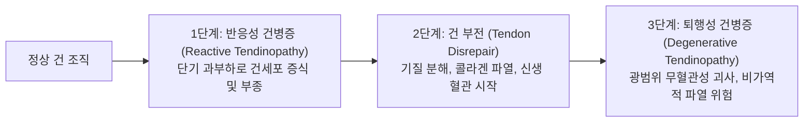

---
aliases:
  - 슬개골하건염
  - 슬개건염
  - 슬개건병증
  - 점퍼스 니
  - Jumper's knee
  - Patellar tendinitis
  - Patellar tendinopathy
tags:
  - 질환
  - 근골격계
  - 하지
  - 슬관절
  - 스포츠손상
  - 슬개건
  - 대퇴사두근
---

# 🫁 [[슬개골하건염]] (Patellar Tendinopathy / Jumper's Knee)

> **핵심 3줄 요약 (Key Summary)**:
> 🎯 슬개골 하극(Inferior pole of patella)과 슬개건 기시부의 만성적인 에너지 저장-방출 과부하로 인한 비염증성 혈관신생-점액성 건 퇴행성 변화(건병증)
> 🚩 배구, 농구 등 점프와 착지가 반복되는 운동선수에서 호발하며 블라지나(Blazina) 4단계 분류에 따른 활동 후 통증에서 영구적 건 파열로 진행
> 🔍 바셋 징후(Basset's sign) 및 편심성 스쿼트 검사로 진단하며 쿡&퍼담(Cook & Purdam) 4단계 텐던 로딩 운동, [[신바로약침]], 화침 및 침도 치료 적용
> ⚠️ 성장기 경골 조면 견열 골단염인 [[Osgood Schlatter 병]] 및 슬개골 상극 건염, 슬개대퇴 증후군과의 명확한 감별 진단 필수

---

## 📌 목차
1. [기본 정보 및 정의 (Overview)](#1-기본-정보-및-정의-overview)
2. [원인 및 병태생리 (Pathophysiology)](#2-원인-및-병태생리-pathophysiology)
3. [임상 증상 및 블라지나(Blazina) 병기 분류](#3-임상-증상-및-블라지나blazina-병기-분류)
4. [진단 및 이학적 검사 (Diagnostic Evaluation)](#4-진단-및-이학적-검사-diagnostic-evaluation)
5. [감별 진단 (Differential Diagnosis)](#5-감별-진단-differential-diagnosis)
6. [양방적 치료 및 로드 매니지먼트 (Load Management)](#6-양방적-치료-및-로드-매니지먼트-load-management)
7. [한의학적 변증 및 통합 치료 프로토콜 (TKM Protocol)](#7-한의학적-변증-및-통합-치료-프로토콜-tkm-protocol)
8. [출처 및 현대 학술 연구 요약 (References)](#8-출처-및-현대-학술-연구-요약-references)

---

## 1. 기본 정보 및 정의 (Overview)

![[슬개건염_병태_일러스트.jpg|320]]
> [그림 1] 슬개골 하단 건 기시부(Start of Patellar tendon)에 집중되는 과부하와 염증성 미세 손상을 나타낸 Jumper's knee 병태 일러스트.

* **정의**: 슬개골 하극(Inferior pole of patella)과 경골 조면(Tibial tuberosity)을 연결하는 슬개건(Patellar tendon, 실질적으로는 인대 구조)의 기시부 심층 섬유에 반복적인 인장력과 전단 과부하가 가해져 발생하는 만성 건병증(Tendinopathy)입니다.
* **명칭과 병리적 실체**: 흔히 '슬개건염(Tendinitis)'으로 불리나, 조직학적으로는 급성 염증 세포(호중구)의 침윤이 거의 없고 **건세포(Tenocyte) 증식, 콜라겐 섬유의 파열 및 무질서한 배열, 기질 내 점액성 변성(Mucoid degeneration), 비정상적 신생 혈관 및 통각 신경 증식(Neovascularization & Ingrowing nerves)**을 특징으로 하는 '슬개건병증(Tendinopathy)'이 정확한 병태생리적 명칭입니다.
* **호발 인구**: 배구, 농구, 육상 높이뛰기, 핸드볼 등 폭발적인 점프 및 착지 동작을 반복하는 운동선수(유병률 40~50%) 및 웨이트 트레이닝(스쿼트, 레그 익스텐션)을 즐기는 성인.

---

## 2. 원인 및 병태생리 (Pathophysiology)

![[슬개건병증_초음파_소견.jpg|320]]
> [그림 2] 슬개골 하극 슬개건 기시부의 섬유 다발 변성 및 병변 부위.

### 2.1 스프링 메커니즘과 신장-단축 주기 (Stretch-Shortening Cycle, SSC)
* 슬개건은 단순한 힘의 전달 장치가 아니라, 점프 착지 시 강력한 원심성(Eccentric) 수축으로 탄성 위치 에너지를 흡수하고, 재도약 시 이를 방출하는 강력한 **인체 스프링(Spring)** 역할을 수행합니다.
* 체중의 6~8배에 달하는 극한의 장력이 좁은 슬개골 하단 부착부(Enthesis)의 심층(Deep posterior fibers)에 반복 가해지면 건의 세포외 기질(ECM) 손상이 누적됩니다.

### 2.2 쿡&퍼담(Cook & Purdam) 건병증 연속체 모델 (Continuum Model)

* **대퇴사두근 경직 및 하지 정렬 이상**:
  * [[대퇴직근]] 및 [[외측광근]]의 만성 단축은 슬개건의 기초 장력을 과도하게 상승시킵니다.
  * 족부 과회내(Overpronation) 또는 고관절 외전근([[중둔근]]) 약화로 인한 무릎 외반(Valgus collapse)은 슬개건에 비틀림 전단력을 가중시킵니다.

---

## 3. 임상 증상 및 블라지나(Blazina) 병기 분류

![[슬관절_연부조직_통증부위_도해.svg|300]]
> [그림 3] 슬관절 전면 연부조직 및 슬개골-슬개건 해부 구조 도해.

### 3.1 블라지나(Blazina) 임상 4단계 분류
| 단계 (Stage) | 통증 발현 시점 | 스포츠 및 일상 활동 수행 능력 |
| :--- | :--- | :--- |
| **Phase 1** | 운동 및 경기 종료 후에만 슬개골 하단에 통증 발생 | 기능적 장애 전혀 없음, 정상 활동 가능 |
| **Phase 2** | 운동 시작 시 워밍업 단계에 아프다가 몸이 풀리면 완화되고, 운동 종료 후 다시 악화 | 경기력 저하 없이 스포츠 활동 완수 가능 |
| **Phase 3** | 운동 중에도 통증이 지속되어 정상적인 훈련 및 경기 불가 | 현저한 기능 제한, 일상생활(계단, 쪼그려 앉기) 통증 |
| **Phase 4** | 슬개건 완전 파열 (Complete Rupture) | 보행 불능, 신전 기전 완전 소실 (수술적 재건 필수) |

### 3.2 주요 자각 증상
* **슬개골 바로 아래 국소 통증**: 슬개골 아래쪽 끝(하극)을 누를 때 찌릿하고 날카로운 압통.
* **부하 의존적 통증 (Load-dependent Pain)**: 계단 내려가기, 쪼그려 앉기(Deep squat), 내리막길 걷기 시 대퇴사두근 원심성 수축으로 통증 악화.
* **장시간 착석 후 뻣뻣함 (Movie-goer's Sign)**: 영화관이나 차 안에서 무릎을 90° 이상 굴곡한 채 오래 앉아 있으면 슬개골 전면에 뻐근한 압박감 발생.

---

## 4. 진단 및 이학적 검사 (Diagnostic Evaluation)

### 4.1 핵심 이학적 검사
* **바셋 징후 (Basset's Sign)**:
  * 무릎을 완전히 편 상태(완전 신전)에서 슬개골 하극을 누르면 심한 통증이 발생하지만, 무릎을 90° 굴곡한 상태에서 누르면 슬개건이 전방으로 이동하고 대퇴골 관절면과 밀착되면서 통증이 현저히 감소하거나 사라지는 슬개건 기시부 병변의 대표적 특징적 징후.
* **단하지 편심성 스쿼트 검사 (Decline Squat Test)**:
  * 25° 경사판(Decline board) 위에 환측 한 발로 서서 무릎을 천천히 굽히며 스쿼트 동작을 할 때 슬개골 하단에 통증이 재현되면 강력한 양성 (건에 걸리는 슬개대퇴 하중 극대화).
* **슬개골 압박 검사 (Clark's Sign 배제)**:
  * 슬개골 연골연화증([[슬개대퇴 증후군]])과의 감별을 위해 슬개골 자체의 관절면 마찰통 유무 확인.

### 4.2 영상 진단
* **근골격계 초음파 및 컬러 도플러**:
  * 슬개골 하극 슬개건 기시부의 국소적 저에코성 비후(Hypoechoic thickening, 정상 두께 4~5mm 이상), 콜라겐 섬유 파열, 컬러 도플러상 병적 신생 혈관망(Neovascularity) 확인.
* **슬관절 MRI (Sagittal T2/PD)**:
  * 슬개골 하단 건 기시부 심층의 국소적 고신호강도 및 호파 지방체(Hoffa's fat pad)의 반응성 부종 정밀 평가.

---

## 5. 감별 진단 (Differential Diagnosis)

* **[[Osgood Schlatter 병]] (Osgood-Schlatter Disease)**:
  * 성장기 청소년(10~15세)에서 슬개골 하단이 아닌 원위부 **경골 조면(Tibial tuberosity)**의 골단판 견열 골연골염으로 골 융기와 압통이 나타남.
* **신딩-라르센-요한슨 증후군 (Sinding-Larsen-Johansson Syndrome)**:
  * 성장판이 닫히지 않은 10~14세 소아·청소년의 슬개골 하극 성장판 골단염(Traction apophysitis).
* **[[슬개대퇴 증후군]] (Patellofemoral Pain Syndrome, PFPS)**:
  * 건 자체의 국소 압통보다는 슬개골 뒤쪽 관절면(연골)의 전반적인 마찰통 및 슬개골 압박 활주 시 연발음(Crepitus) 발생.
* **슬개하 지방체염 (Hoffa's Disease)**:
  * 슬개건 심층의 호파 지방체가 슬개골과 대퇴과 사이에 끼여 비후 및 압통 유발.

---

## 6. 양방적 치료 및 로드 매니지먼트 (Load Management)

* **활동 수정 및 로드 조절 (Load Management)**:
  * 점프, 전력 질주, 플라이오메트릭 훈련을 일시 중단하되, 완전한 침상 안정(Complete rest)은 건의 기계적 내구성을 저하시키므로 금기.
* **단계별 텐던 로딩 재활 운동 (Malliaras & Rio 프로토콜)**:
  1. **1단계 (등척성 운동, Isometric)**: 통증 완화(Analgesic effect) 및 피질 척수로 억제를 유도하기 위해 단하지 레그 익스텐션 또는 스페인 스쿼트(Spanish squat)를 45초 유지 x 5세트 시행.
  2. **2단계 (등장성 중량 부하, Isotonic)**: 느린 속도의 고중량 스쿼트 및 레그 프레스(Heavy Slow Resistance, HSR).
  3. **3단계 (에너지 저장 훈련, Energy Storage)**: 점프 착지, 방향 전환 등 신장-단축 주기 훈련.
  4. **4단계 (스포츠 복귀, RTS)**: 점진적 경기 복귀.
* **체외충격파 치료 (ESWT)**:
  * 난치성 만성 건병증 부위에 집중형 충격파를 적용하여 비정상 신생 혈관과 통각 수용기를 탈감작하고 기질 재생 유도.
* **⚠️ 국소 스테로이드 주사 절대 금기**:
  * 슬개건 내 스테로이드 주사는 단기 염증 완화 효과는 있으나, 건 세포 괴사와 콜라겐 합성을 억제하여 **건의 급성 파열(Rupture)** 위험을 치명적으로 높이므로 엄격히 금기됨.

---

## 7. 한의학적 변증 및 통합 치료 프로토콜 (TKM Protocol)

### 7.1 한의 변증 (Syndrome Differentiation)
* **노손기체(勞損氣滯)**: 무리한 운동과 점프로 인해 슬개 부위 경락의 기혈이 손상되어 뻐근하고 당기는 둔통 발생.
* **풍한습비(風寒濕痺)**: 한습(寒濕)의 사기가 무릎 관절에 침범하여 날씨가 흐리거나 차가울 때 슬개골 아래가 시리고 쑤시며 굴신이 불리함.
* **간신부족(肝腎不足)**: 간주근(肝主筋), 신주골(腎主骨)의 허약으로 인대와 건의 탄력성이 저하되어 만성적으로 재발하고 무릎에 힘이 빠짐.

### 7.2 침구 및 화침·온침 요법
* **주요 취혈점**:
  * 족양명위경(足陽明胃經): 독비(ST35), 양구(ST34), 족삼리(ST36), 비관(ST31).
  * 족태음비경(足太陰脾經): 내슬안(EX-LE4), 음릉천(SP9), 혈해(SP10).
  * 아시혈(阿是穴): 슬개골 하극 기시부 압통점 직자 및 사자.
* **화침(火鍼) 및 구법(灸法)**:
  * 만성 퇴행성으로 저하된 건의 콜라겐 재배열과 조직 재생을 유도하기 위해 슬개골 하단 건 부착부에 화침 또는 뜸 요법을 적용하여 국소 무균성 치유 반응 유도.

### 7.3 약침 및 침도 의학 (Acupotomy)
* **[[신바로약침]] & 오공약침**:
  * 슬개골 하단 기시부 심층에 신바로약침(0.5~1.0cc)을 정밀 주입하여 건 주위의 만성 신경인성 염증과 신생 신경의 과민성을 차단.
* **태반약침(자하거)**:
  * 만성 퇴행성 건병증 부위에 영양 물질을 공급하여 손상된 건 섬유의 인장 강도 회복 촉진.
* **소침도 미세 절개 박리술**:
  * 만성 결절성 비후 및 섬유화 유착이 심한 경우, 소침도로 건막 주위의 유착된 섬유 다발을 세로 방향으로 미세 박리하여 국소 장력을 감압.

### 7.4 추나요법 및 근막 이완 (Chuna & IASTM)
* **대퇴사두근 근막 이완 기법 (Myofascial Release)**:
  * 단축된 [[대퇴직근]] 및 외측광근의 긴장을 수기 추나로 이완시켜 슬개골에 걸리는 상방 견인 장력을 해소.
* **슬개골 가동 추나요법 (Patellar Mobilization)**:
  * 슬개골을 상하좌우로 부드럽게 관절 가동화하여 슬개대퇴 관절의 정상 활주 리듬 복원.

---

## 8. 출처 및 현대 학술 연구 요약 (References)

* Blazina ME, Kerlan RK, Jobe FW, et al. Jumper's knee. *Orthop Clin North Am*. 1973;4(3):665-678. [PMID: 4783891](https://pubmed.ncbi.nlm.nih.gov/4783891/)
  * `[연구 요약]` 슬개골 및 대퇴사두건 부착부 손상을 'Jumper's knee'로 명명하고 임상 증상에 따른 4단계 병기 분류(Blazina classification)를 최초로 정립한 기념비적 논문.
* Malliaras P, Cook J, Purdam C, et al. Patellar Tendinopathy: Clinical Diagnosis, Load Management, and Advice for Challenging Case Presentations. *J Orthop Sports Phys Ther*. 2015;45(11):887-898. [PMID: 26390269](https://pubmed.ncbi.nlm.nih.gov/26390269/)
  * `[연구 요약]` 슬개건병증의 임상적 진단 평가 기준과 등척성-등장성-에너지 저장 훈련으로 이어지는 체계적 단계별 건 부하 관리(Load management) 가이드라인을 제시함.
* Rio E, Kidgell D, Purdam C, et al. Isometric exercise induces analgesia and reduces inhibition in patellar tendinopathy. *Br J Sports Med*. 2015;49(19):1277-1283. [PMID: 25979840](https://pubmed.ncbi.nlm.nih.gov/25979840/)
  * `[연구 요약]` 슬개건병증 환자에서 등척성 대퇴사두근 수축 운동(Isometric exercise)이 즉각적인 진통 효과를 유발하고 대뇌 피질-운동 억제를 현저히 감소시킴을 입증한 무작위 교차 연구.
