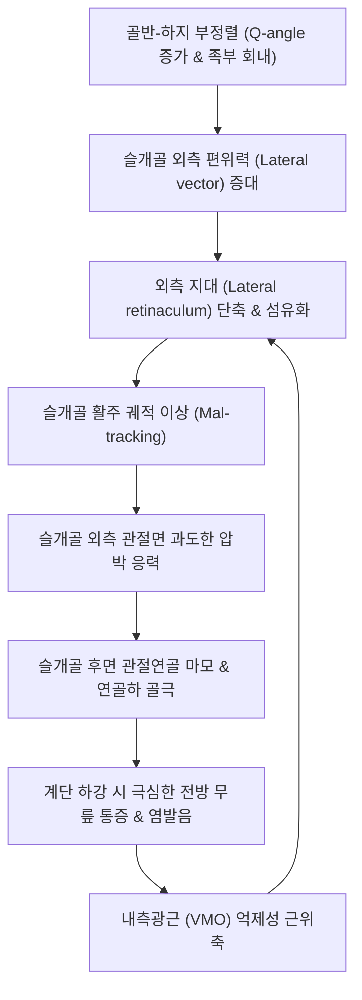

# 🩺 슬개대퇴관절염 (Patellofemoral Osteoarthritis, PF OA)

> **상위 분류**: [[근골격계 질환]] > [[하지 질환]] > [[슬관절 질환]] > [[골관절염]]
> **핵심 3줄 요약 (Key Summary)**:
> - 📍 병소 부위 & 해부·병태생리: [[슬개골]](Patella) 후면의 관절 연골과 대퇴골 활차구(Trochlear groove) 사이의 관절 연골이 마모되고 연골하 골극 및 경화가 진행되는 질환으로, 대퇴사두근 불균형과 **외측 지대(Lateral retinaculum)의 구축으로 인한 슬개골 외측 편위(Lateral tracking)**가 주된 생체역학적 원인.
> - 🚩 전형적 임상 양상: **계단을 내려갈 때 무릎 앞쪽(전방부)의 심한 통증**, 쪼그려 앉거나 일어날 때 뚜렷한 마찰음(Crepitus), 오래 앉아 있다 일어설 때 굳어지는 **극장 징후(Movie-theater sign)**.
> - 🛠️ 핵심 검사 & 치료 전략: 클라크 검사(Clarke's test) 및 슬개골 압박 마찰 검사, 스카이라인/머천트 뷰(Skyline / Merchant X-ray) 관절강 협착 평가, 침도(Acupotomy)를 통한 외측 지대 미세 절개 감압, 신바로약침 및 내측광근(VMO)·중둔근 강화 운동.
> - ⚠️ 응급 의뢰 레드플래그: 연골 박리로 인한 관절 내 유리체(Loose body)가 감입되어 무릎이 펴지지도 굽혀지지도 않는 관절 잠김(Locking) 발생 시 정형외과 응급 관절경 의뢰. 보행 불능 수준의 고도 슬개골 외측 아탈구 시 수술 상담.

---

## 📌 목차
1. [질환 개요 & 해부학적 병태생리](#1-질환-개요--해부학적-병태생리)
2. [병태생리 메커니즘 & 생체역학적 악순환 네트워크](#2-병태생리-메커니즘--생체역학적-악순환-네트워크)
3. [임상 증상 & 이학적 검사(Physical Exam) 알고리즘](#3-임상-증상--이학적-검사physical-exam-알고리즘)
4. [감별 진단 매트릭스 (Differential Diagnosis)](#4-감별-진단-매트릭스--differential-diagnosis)
5. [한의 통합 치료 프로토콜 (침·약침·추나·한약)](#5-한의-통합-치료-프로토콜-침약침추나한약)
6. [양방 치료 & 병용·의뢰 기준 (Conventional Treatment & Referral)](#6-양방-치료--병용의뢰-기준-conventional-treatment--referral)
7. [재활 운동 & 생활습관 티칭 가이드](#7-재활-운동--생활습관-티칭-가이드)
8. [💡 사용자 진료실 핵심 필기 & 임상 노하우 (Melt-In 잔여 심화 집약)](#8--사용자-진료실-핵심-필기--임상-노하우--melt-in-잔여-심화-집약)
9. [출처 및 학술 참고 문헌 (References)](#9-출처-및-학술-참고-문헌--references)

---

## 1. 질환 개요 & 해부학적 병태생리

### 1.1 개요 및 역학
**슬개대퇴관절염(Patellofemoral Osteoarthritis, PF OA)**은 슬관절을 구성하는 두 개의 관절(경대퇴관절 및 슬개대퇴관절) 중 **슬개대퇴관절(Patellofemoral joint)**에 국한되거나 선행하여 발생하는 골관절염이다.
- 50세 이상 성인 무릎 통증의 약 20~40%에서 슬개대퇴 관절염이 단독 또는 경대퇴관절염과 동반되어 나타나며, 특히 **여성에서 남성보다 2배 이상 호발**한다.
- 젋은 층의 [[슬개대퇴 증후군]](PFPS / 연골연화증)이 제때 교정되지 않고 생체역학적 마찰이 수십 년간 누적될 경우 구조적 골관절염으로 이행한다.

![[슬개대퇴증후군_슬개골마찰_연골연화도해.png|400]]
> [그림 1: 슬개대퇴 관절의 마찰 및 연골 연화·마모 병태 도해 — 인체 병태도]

---

## 2. 병태생리 메커니즘 & 생체역학적 악순환 네트워크

### 2.1 생체역학적 기전: 외측 지대 구축과 외측 쏠림 (Lateral Tracking)
슬개골은 대퇴사두근의 수축력을 경골조면으로 전달하는 지렛대(Sesamoid bone) 역할을 하며, 무릎 굴곡 시 대퇴골 활차구(Trochlea)를 따라 활주한다.
1. **Q-angle 증가 및 외측 편위력**: 여성의 넓은 골반, 고관절 내회전, 족부 과회내 등으로 인해 Q-angle(대퇴사두근 견인선과 슬개건 축의 각도)이 커지면 슬개골을 외측으로 잡아당기는 외측 전단력이 증폭된다.
2. **외측광근 및 외측 지대(Lateral retinaculum)의 구축**: 외측 연부조직이 단축·섬유화되는 반면, 슬개골을 내측에서 잡아주는 **내측광근(Vastus Medialis Oblique, VMO)**은 반사적으로 위축·약화된다.
3. **국소 관절면 과부하 및 연골 마모**: 슬개골 외측 관절면에 비정상적인 접촉 압력이 집중되면서 초자연골의 균열, 마모, 연골하 골경화 및 골극 형성이 가속화된다 (Gul et al., 2026; Kekki et al., 2026).

![[퇴행성슬관절염_연골마모_병태일러스트.png|400]]
> [그림 2: 관절 연골 마모 및 연골하 골극 형성 조직 도해 — 병태 일러스트]

![[퇴행성슬관절염_KL_grade_엑스레이도해.png|400]]
> [그림 3: 방사선상 관찰되는 관절강 협착 및 골극 형성 등급 — X-ray 도해]

### 2.2 생체역학적 악순환 네트워크

---

## 3. 임상 증상 & 이학적 검사(Physical Exam) 알고리즘

### 3.1 3대 핵심 임상 징후
1. **계단 하강 시 전방 통증**:
   - 무릎을 굽히며 체중을 실을 때 슬개대퇴 관절면에 체중의 3~5배에 달하는 압박력이 발생하므로, **올라갈 때보다 내려갈 때 통증이 현저히 악화됨**.
2. **극장 징후 (Movie-Theater Sign / Movie Sign)**:
   - 좁은 좌석(영화관, 비행기, 자동차, 식당)에서 무릎을 90도 이상 굽힌 채 30분~1시간 이상 앉아 있으면 무릎 앞쪽이 뻐근하게 굳고 아파 다리를 펴야만 함.
3. **거친 슬개골 마찰음 (Patellar Crepitus)**:
   - 쪼그려 앉거나 무릎을 굽혔다 펼 때 손을 슬개골 위에 얹으면 사각사각하거나 우두둑거리는 거친 뼈 마찰음이 촉지됨.

![[슬관절_활액낭_추벽_해부도_Gray347.png|400]]
> [그림 4: 슬개골 후면 및 슬개상낭·활액막 해부학적 구조 — Gray's Anatomy]

### 3.2 이학적 특수 검사
1. **클라크 검사 (Clarke's Sign / Patellar Grind Test)**:
   - 환자가 무릎을 펴고 누운 상태에서 검사자가 슬개골 상연을 하방(발쪽)으로 부드럽게 압박하고, 그 상태에서 환자에게 대퇴사두근을 수축하게 함.
   - 슬개골 후면 연골 마모가 있는 경우 통증으로 인해 대퇴사두근 수축을 즉시 멈추거나 비명을 지름(양성).
2. **슬개골 외측 편위 및 경사 검사 (Patellar Tilt & Glide Test)**:
   - 슬개골 외측연을 들어 올렸을 때 수평면 위로 0도 이상 올라오지 못하면 외측 지대의 심한 구축을 의미함.
3. **방사선 검사 (Merchant View / Skyline View)**:
   - 무릎을 45도 굴곡하고 위에서 아래로 촬영하는 축상면 뷰(Axial view)로, 슬개대퇴 관절강의 외측 협착, 대퇴 활차구의 골극, 슬개골 외측 아탈구를 정밀 평가.

---

## 4. 감별 진단 매트릭스 (Differential Diagnosis)

| 감별 질환 | 호발 연령 및 통증 위치 | 통증 악화 동작 | 단순 방사선(X-ray) 소견 | 결정적 감별 포인트 |
| :--- | :--- | :--- | :--- | :--- |
| **[[슬개대퇴관절염]]** | 50대 이상 여성, 무릎 전방부 | **계단 내려갈 때**, 쪼그려 앉기 | **Skyline상 외측 관절강 협착, 골극** | 거친 염발음(Crepitus), 구조적 관절염 |
| **[[슬개대퇴 증후군]](PFPS)** | 10~30대 젊은 여성, 무릎 전방부 | 계단 오르내리기, 달리기 | **X-ray상 정상** | 연골 마모 없는 기능적 추적 이상, 연골연화증 |
| **[[퇴행성 관절염]](내측 구획)** | 60대 이상, 무릎 내측 관절열극 | **보행 시, 계단 오를 때** | 체중부하 전후면상 내측 협착 | O자 다리 변형(내반슬), 내측 관절열극 압통 |
| **[[슬개건염]]** | 20~40대 점프 운동선수 | 점프 후 착지 시 | 정상 | 슬개골 하단(건 기시부) 국소 압통, 마찰음 없음 |
| **슬개전 점액낭염** | 무릎 꿇고 일하는 직업인 | 무릎 앞을 바닥에 댈 때 | 연부조직 부종 | 피부 바로 밑의 물혹, 관절강 내 병변 아님 |

---

## 5. 한의 통합 치료 프로토콜 (침·약침·추나·한약)

![[무릎염좌_05_술기실사_측부인대_자침치료.jpg|400]]
> [그림 5: 슬개골 주변 지대 긴장 완화 및 슬안혈 침구 치료 실사 — 한의 임상술기]

### 5.1 침구 및 침도(Acupotomy) 치료
- **혈위 선정**: 독비(ST35), 내슬안, 양구(ST34), 혈해(SP10), 음릉천(SP9), 양릉천(GB34), 복토(ST32).
- **외측 지대 침도 절개 박리술 (Acupotomy Retinacular Release)**:
  - 슬개골 외측연을 따라 구축된 외측 지대 섬유를 촉진하여 0.5×40mm 침도로 2~3군데 미세 종절개(Longitudinal release)를 시행.
  - 슬개골을 외측으로 잡아당기던 단축된 근막 장력을 해제함으로써 슬개골이 활차구 중심부로 자연스럽게 정렬되도록 유도.
- **전침 치료**: 양구-혈해, 내외슬안 혈위에 2~4Hz 저주파 전침을 통전하여 활액막 염증을 흡수시키고 대퇴사두근 긴장을 완화.

### 5.2 약침 치료 (Pharmacopuncture)
- **신바로약침**: 슬개골 후면 관절 연골 마모 부위와 슬개하 지방체(Hoffa's fat pad)에 1.0~2.0cc를 주입하여 연골 파괴 효소(MMP) 억제 및 통증 감압.
- **소염약침 / 황련해독탕 약침**: 관절 사용 후 슬개상낭에 수종이나 열감이 동반된 급성 활막염 단계에 1.0cc 시술.

### 5.3 추나치료 (슬개골 가동술)
- 환자의 무릎을 편 상태에서 검사자가 슬개골을 내측으로 부드럽게 밀어주는 **슬개골 내측 활주(Medial Patellar Glide) 추나 기법** 적용 (외측 지대 신장).
- 대퇴사두근(특히 대퇴직근, 외측광근) 및 장경인대(ITB)의 근막 이완술 병행.

### 5.4 한약 치료
- **급성 종창 및 마찰통**: [[대강활탕]], [[방기황기탕]] 가감. 관절 내 수종을 소퇴시키고 마찰 열감을 진정시킴.
- **만성 연골 퇴행 보강**: [[독활기생탕]], [[가미서경탕]] 가미 (우슬, 두충, 구기자, 속단 배합). 연골 결합조직을 영양하고 대퇴사두근 인장 강도를 회복시킴.

---

## 6. 양방 치료 & 병용·의뢰 기준 (Conventional Treatment & Referral)

![[퇴행성관절염_슬관절_KL등급_2기_및_3기_Xray.jpg|400]]
> [그림 6: 슬관절 퇴행성 관절염 및 슬개대퇴 관절강 협착 방사선 소견 — 단순 X-ray]

### 6.1 보존적 양방 치료
- **맥코넬 테이핑 (McConnell Taping)**: 슬개골을 내측으로 당겨 고정함으로써 보행 시 외측 마찰 통증 즉각 경감.
- **관절강 내 히알루론산 주사**: 슬개골 후면의 윤활 작용을 보조하여 관절 마찰음과 마모 완화.

### 6.2 수술적 치료 및 의뢰 기준
- 6개월 이상의 보존적 치료에도 일상생활 보행이 불가능한 경우:
  - **관절경하 외측 지대 유리술 (Lateral retinacular release)**.
  - **슬개대퇴 관절 부분 치환술 (Patellofemoral Arthroplasty, PFA)**: 경대퇴 관절은 건강하고 슬개대퇴 관절만 고도로 파괴된 환자에게 인공 슬개-대퇴관절 삽입.
  - 전 슬관절 치환술(TKA): 전체 관절염 동반 시 시행 (Gul et al., 2026).

---

## 7. 재활 운동 & 생활습관 티칭 가이드

### 7.1 내측광근(VMO) 집중 강화 운동
1. **스트레이트 레그 레이즈 (Straight Leg Raise, SLR)**:
   - 바닥에 누워 발끝을 바깥으로 15도 외회전한 상태에서 다리를 곧게 펴고 30cm 들어 올려 5초간 유지 (내측광근 선택적 자극, 15회 3세트).
2. **미니 스쿼트 (볼 스퀴즈 스쿼트)**:
   - 양 무릎 사이에 배구공이나 쿠션을 끼우고 안쪽으로 조이면서 30~45도까지만 살짝 무릎을 굽혔다 펴기 (깊은 스쿼트는 슬개대퇴 압박을 극대화하므로 절대 금기!).
3. **중둔근 강화 (클램쉘 Clamshell 운동)**:
   - 고관절 외전근을 강화하여 무릎이 안쪽으로 무너지는 동적 외반(Dynamic valgus) 방지.

### 7.2 일상생활 금기 수칙
- **쪼그려 앉기, 무릎 꿇기, 양반다리 절대 금기**: 무릎 굴곡 각도가 90도를 넘어가면 슬개골 후면에 가해지는 압력이 체중의 7~8배로 폭증하여 연골이 맷돌처럼 갈려 나감. 좌식 생활을 입식 생활(침대, 식탁, 양변기)로 전면 전환.

---

## 8. 💡 사용자 진료실 핵심 필기 & 임상 노하우 (Melt-In 잔여 심화 집약)

### 8.1 "계단 오를 때 아픈가요, 내려갈 때 아픈가요?" (1초 감별 공식)
- 무릎 환자가 문을 열고 들어올 때 던지는 가장 결정적인 질문이다.
- **"계단 올라갈 때 아프다" $\rightarrow$ 내측 경대퇴관절염 (체중 지탱 부하).**
- **"계단 내려갈 때 무릎 앞이 부서질 듯 아프다" $\rightarrow$ 슬개대퇴관절염 (슬개골 전방 압착 부하).**
- 환자가 내려갈 때 아프다고 하면 진료실 침대에 눕히고 슬개골 바깥쪽을 손가락으로 꾹 눌러본다. 환자가 펄쩍 뛰며 외측 지대가 팽팽한 활시위처럼 굳어 있다면, 이곳에 침도 치료를 하여 장력을 풀어주는 것만으로 당일 계단을 훨씬 편하게 내려갈 수 있다.

---

## 9. 출처 및 학술 참고 문헌 (References)

1. **Gul T et al. (2026)**. Patellofemoral Joint Outcomes in Kinematically vs. Mechanically Aligned Total Knee Arthroplasty: A Systematic Review and Meta-Analysis. *Medicina (Kaunas)*. 62(3):512. [PMID: 42512776](https://pubmed.ncbi.nlm.nih.gov/42512776/)
   - *[연구 요약]*: 인공 슬관절 치환술 시 기구 정렬 방식(기구학적 vs 기계적)에 따른 슬개대퇴 관절의 추적 궤적, 전방 통증 및 합병증 발생률을 메타분석함.

2. **Kekki C et al. (2026)**. Early Patellofemoral Osteoarthritis Following ACL Reconstruction: A Narrative Review. *Healthcare (Basel)*. 14(4):618. [PMID: 42512597](https://pubmed.ncbi.nlm.nih.gov/42512597/)
   - *[연구 요약]*: 전방십자인대 재건술 후 조기에 속발하는 슬개대퇴 골관절염의 생체역학적 원인, 활차 연골 마모 및 외측 지대 구축의 병태생리를 체계적으로 고찰.

3. **Allison A et al. (2026)**. Association of Early Knee Extension Range of Motion Deficits With Cartilage T2 Relaxation Following Anterior Cruciate Ligament Reconstruction. *Am J Sports Med*. 54(9):2680-2687. [PMID: 42438201](https://pubmed.ncbi.nlm.nih.gov/42438201/)
   - *[연구 요약]*: 슬관절 신전 가동 결손이 슬개대퇴 관절 연골의 T2 이완 시간 및 조기 연골 기질 파괴에 미치는 영향을 규명한 전향적 연구.

4. **Shen M et al. (2026)**. The Association of Advanced Patellofemoral Chondrosis With Outcomes After Posterior Medial Meniscus Root Repair. *Am J Sports Med*. :3635465261471374. [PMID: 42610516](https://pubmed.ncbi.nlm.nih.gov/42610516/)
   - *[연구 요약]*: 진행성 슬개대퇴 연골연화 및 관절염이 반월상연골 후각 봉합술 후 무릎 기능 회복과 전방 통증에 미치는 부정적 영향을 분석한 임상 코호트 연구.
