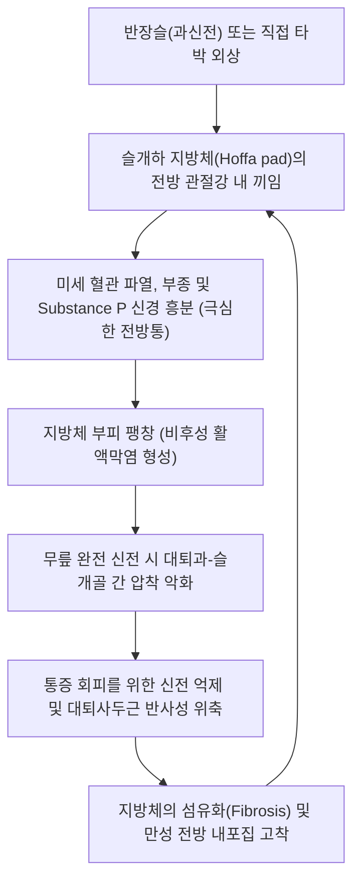

# 🩺 슬관절 전방 내포집증후군 (Anterior Knee Impingement Syndrome / Hoffa's Disease)

> **핵심 3줄 요약 (Key Summary)**:
> - 📍 **병소 부위 & 해부·병태생리**: 슬개건(Patellar tendon) 심부와 대퇴-경골 관절낭 전방 사이에 위치한 **슬개하 지방체(Infrapatellar fat pad, Hoffa fat pad)** 및 **활액막 추벽(Synovial plica)**이 무릎의 과신전(Hyperextension)이나 반복적 압박으로 인해 대퇴과와 슬개골 사이에 기계적으로 끼여 비후·염증·섬유화되는 질환.
> - 🚩 **전형적 임상 양상**: 무릎을 완전히 펴거나 뒤로 젖힐 때(과신전) 발생하는 무릎 앞쪽 심부의 날카로운 찝힘 통증, 슬개건 양측(내·외슬안 부위)의 동통성 팽만 및 부종, **호파 검사(Hoffa's test) 양성**. 계단을 내려가거나 오래 서 있을 때 악화.
> - 🛠️ **핵심 검사 & 치료 전략**: 슬개건염(Jumper's knee, 하극 국소 압통) 및 슬개대퇴증후군(굴곡 시 악화)과의 감별. 반장슬(Genu recurvatum) 방지 테이핑 및 교정 추나, 독비(외슬안)·내슬안 심부 침치료 및 소염 약침을 통한 지방체 감압, 햄스트링·비복근 균형 재활. 보존적 치료 실패 시 관절경하 지방체 부분 절제술 의뢰.
> - ⚠️ **응급 의뢰 레드플래그**: 지속적인 기계적 락킹(Locking) 동반(유리 골연골편 또는 반월상연골 파열 합병 의심), 관절 천자 시 농성 관절액 배출(화농성 관절염/점액낭염), 거대 지방종 또는 활막 육종 의심 종괴.

---

## 📌 목차
1. [질환 개요 & 해부학적 병태생리](#1-질환-개요--해부학적-병태생리)
2. [병태생리 메커니즘 & 생체역학적 악순환 네트워크](#2-병태생리-메커니즘--생체역학적-악순환-네트워크)
3. [임상 증상 & 이학적 검사(Physical Exam) 알고리즘](#3-임상-증상--이학적-검사physical-exam-알고리즘)
4. [감별 진단 매트릭스 (Differential Diagnosis)](#4-감별-진단-매트릭스-differential-diagnosis)
5. [한의 통합 치료 프로토콜 (침·약침·추나·한약)](#5-한의-통합-치료-프로토콜-침약침추나한약)
6. [양방 치료 & 병용·의뢰 기준 (Conventional Treatment & Referral)](#6-양방-치료--병용의뢰-기준-conventional-treatment--referral)
7. [재활 운동 & 생활습관 티칭 가이드](#7-재활-운동--생활습관-티칭-가이드)
8. [💡 사용자 진료실 핵심 필기 & 임상 노하우 (Melt-In 잔여 심화 집약)](#8--사용자-진료실-핵심-필기--임상-노하우-melt-in-잔여-심화-집약)
9. [출처 및 학술 참고 문헌 (References)](#9-출처-및-학술-참고-문헌--references)

---

## 1. 질환 개요 & 해부학적 병태생리

**슬관절 전방 내포집증후군(Anterior Knee Impingement Syndrome)**은 슬관절 전방 연부조직이 대퇴골과 경골 또는 슬개골 사이의 관절간극에 물리적으로 끼여 통증과 기능 제한을 일으키는 질환군을 의미한다. 가장 대표적인 병태는 **호파병(Hoffa's Disease / [[슬개하 지방체 증후군]])**과 **활액막 [[추벽 증후군]](Plica Syndrome)**이다.

![[슬관절_활액낭_추벽_해부도_Gray347.png]]
> [그림 1: ① 병태해부 — 슬개하 지방체(Hoffa fat pad), 슬개전 점액낭 및 활액막 추벽의 해부학적 위치 도해]

**슬개하 지방체(Infrapatellar Fat Pad, IPFP, Hoffa's Fat Pad)**는 슬개골 하극, 슬개건 후면, 경골 고평부 전상면 및 관절낭 활액막 사이에 위치하는 원추형의 지방 조직이다. 정상적으로는 슬관절 굴곡-신전 시 관절액의 윤활을 돕고 충격을 흡수하며 전방 연부조직의 유연한 활주를 돕는다. 

![[슬관절_연부조직_통증부위_도해.svg]]
> [그림 2: ① 병소 위치 — 슬개하 지방체 내포집 및 슬관절 전방 연부조직 통증 유발 부위 도해]

그러나 호파 지방체는 인체 연골·인대와 달리 **풍부한 미세 혈관망**과 **고밀도의 자유 신경종말(Substance P, CGRP 신경섬유)**을 포함하고 있어, 슬관절에서 통증에 가장 민감한 구조물 중 하나이다. 직접적인 타박, 미세 손상의 누적, 또는 무릎이 과도하게 뒤로 꺾이는 **반장슬([[Genu recurvatum]])** 상태에서 반복적인 끼임(Impingement)이 발생하면 심한 통증과 활액막 비후를 유발한다.

---

## 2. 병태생리 메커니즘 & 생체역학적 악순환 네트워크

### 호파 지방체의 비후-충돌 악순환 고리
1. **급성 손상 기전**: 무릎 앞쪽의 직접적 타박(Direct trauma) 또는 급격한 과신전 손상 시 지방체 내 출혈과 급성 부종 발생.
2. **반복 미세 외상 및 반장슬(Genu recurvatum)**: 선천적 관절 이완이나 대퇴사두근-햄스트링 불균형으로 무릎이 0°를 넘어 뒤로 꺾일 때마다, 지방체 상단부가 대퇴과 관절연골과 슬개골 하극 사이에 강력하게 압착됨.
3. **만성 염증 및 섬유화**: 반복적 끼임으로 인해 지방 조직이 비대해지며(Hypertrophy), 부피가 커진 지방체는 가벼운 신전 동작에서도 더욱 쉽게 끼이는 악순환에 빠짐. 결국 지방 조직이 섬유성 반흔 및 연골성 화생(Fibrocartilaginous metaplasia)으로 변성되어 탄력성을 잃고 영구적인 신전 차단을 초래함.

![[슬개전점액낭_해부위치_도해.png]]
> [그림 3: ① 병태 감별 — 전방 충돌 시 압박받는 슬개하 심부 지방체와 표재성 슬개전 점액낭 비교 도해]

![[힘줄병증_슬개건병증_점퍼스니_해부병태도해.jpg]]
> [그림 4: ① 생체역학 — 과신전 및 반복적 충격 시 슬개건 후방과 대퇴과 사이에서 발생하는 기계적 끼임(Impingement) 도해]

---

## 3. 임상 증상 & 이학적 검사(Physical Exam) 알고리즘

### 임상 증상
- **전방 찌릿함 및 신전통**: 평지 보행 중 발을 디디며 무릎을 완전히 펼 때 무릎 밑 깊숙한 곳에서 날카로운 찝힘 통증 호소.
- **슬개건 양측 팽만**: 슬개골 바로 아래 슬개건을 사이에 두고 내측과 외측(슬안혈 부위)이 빵빵하게 부어오르고 누르면 통증이 심함.
- **하이힐 및 내리막길 악화**: 굽이 높은 신발을 신거나 내리막길을 내려갈 때 무릎이 과신전되면서 증상 악화.

### 이학적 검사 알고리즘

![[슬개골압박검사_1단계_슬개골압박_내외활주_실사.jpg]]
> [그림 5: ② 이학적 검사 — 슬개골 압박 및 하방 활주를 통해 슬개하 지방체의 압통을 촉진하는 검사 실사]

![[슬개골압박검사_2단계_클라크검사_대퇴사두근수축_실사.jpg]]
> [그림 6: ② 이학적 검사 — 대퇴사두근 수축 시 슬개하 전방 조직의 충돌 유발 및 동통을 평가하는 검사 실사]

1. **호파 검사 (Hoffa's Test)**:
   - 환자를 앙와위로 눕히고 무릎을 30°~45° 굴곡시킨 상태에서, 검사자가 양 엄지손가락으로 슬개건의 내측과 외측 여백(슬개하 지방체 부위)을 깊숙이 압박함.
   - 압박을 유지한 채 무릎을 수동으로 서서히 완전 신전(0°)시킬 때, 끝 신전 범위에서 지방체가 압착되며 환자가 비명을 지르거나 통증으로 신전을 거부하면 양성.
2. **과신전 유발 검사 (Hyperextension Test)**:
   - 발목을 들어 올려 무릎을 과신전시킬 때 전방 슬개하 심부 통증 유발 확인.
3. **내측 추벽 활주 검사 (Mediopatellar Plica Test)**:
   - 슬개골 내측연에서 굴곡-신전 시 '딸깍'하며 손가락 밑으로 튕기는 두터워진 띠(Cord-like band) 확인.

---

## 4. 감별 진단 매트릭스 (Differential Diagnosis)

![[건염_01_환부실사_슬개건염.jpg]]
> [그림 7: ① 임상 감별 — 슬개하 지방체염과 감별해야 하는 슬개건염(Jumper's knee)의 국소 병소 실사]

| 감별 질환 | 주 이환 부위 | 통증 악화 동작 | 압통 국소 부위 | 핵심 이학적 검사 |
| :--- | :--- | :--- | :--- | :--- |
| **[[슬관절 전방 내포집증후군]](호파병)** | 슬개건 심부 호파 지방체 | **완전 신전 및 과신전**, 오래 서있기 | **슬개건 양측 연부조직(슬안 부위)** | **Hoffa test (+)**, Hyperextension (+) |
| **[[슬개건염]](점퍼스니)** | 슬개건 자체 (표재성/심부) | 점프 착지, 계단 오르기 (신전 부하) | **슬개골 하극(Inferior pole) 직하부** | 하극 정밀 촉진 압통 (+), Hoffa (-) |
| **[[슬개대퇴 동통 증후군]](PFPS)** | 슬개-대퇴 관절 연골면 | **깊은 굴곡**, 스쿼트, 쪼그려 앉기 | 슬개골 관절면 후면 및 주변부 | Clarke test (+), 극장 징후 (+) |
| **슬개전 점액낭염** | 피부와 슬개골 사이 표재낭 | 무릎 꿇기(직접 접촉) | 슬개골 바로 앞 피부 표재 낭종 | 육안상 명확한 물혹, 관절내 통증 없음 |
| **내측 추벽 증후군** | 슬개골 상내측 활액막 주름 | 굴곡 30~60도 구간에서 걸림 | 슬개골 내측연 활액막 띠 | Plica shelf test (+), 딸깍거림 |

---

## 5. 한의 통합 치료 프로토콜 (침·약침·추나·한약)

![[무릎염좌_05_술기실사_측부인대_자침치료.jpg]]
> [그림 8: ③ 한의 시술 — 독비 및 내슬안 자침을 통해 비후된 슬개하 지방체를 직접 감압하고 소염하는 침치료 실사]

### 침구 치료: 슬안 심부 자입 및 감압
- **주요 혈위**: [[독비]](ST35, 외슬안), [[내슬안]](EX-LE4), [[학정]](EX-LE2), [[양구]](ST34), [[음릉천]](SP9).
- **심부 자침 기법**:
  - 무릎을 30~45도 굴곡시킨 상태에서 슬개건 양측의 독비와 내슬안을 통해 침첨을 과간와(Intercondylar notch) 방향으로 1.0~1.5치 심부 자입.
  - 비후되고 부종이 찬 호파 지방체 내 미세 순환을 자극하여 정맥성 울혈을 해소하고 관절낭 내압을 감압함.
  - 전침(2Hz)을 적용하여 감각신경(Substance P)의 통증 전달을 차단.

### 약침 치료 (Pharmacopuncture)
- **급성 종창기**: **황련해독탕 약침** 또는 **소염 약침**을 슬개하 지방체 중심부에 0.5~1.0ml 주입하여 지방 세포의 무균성 염증과 혈관 확장을 신속 억제.
- **만성 섬유화기**: **신바로 약침** 또는 **자하거 약침**을 주입하여 섬유화된 지방체 조직의 유연성을 회복하고 연골성 화생을 차단.

### 추나 의학 및 자세 교정 (Chuna)
- **반장슬(Genu recurvatum) 교정 추나**:
  - 골반의 과도한 전방경사(Anterior pelvic tilt) 및 족관절 배굴 제한이 무릎 과신전을 유도하므로, 장요근 이완 및 종골-거골 관절가동술을 병행.
- **슬개골 상방 활주 추나(Superior Patellar Glide)**: 슬개골이 하방으로 고착되어 지방체를 누르는 것을 방지하기 위해 슬개골을 상방으로 부드럽게 가동.

### 한약 치료 (Herbal Medicine)
- **습열하주(濕熱下注) 및 급성 부종형**: **[[대방풍탕]]**, **사묘환(四妙丸)** 합 **오령산(五苓散)**. 하지 관절낭의 열감과 삼출액 흡수 촉진.
- **기체어혈 및 만성 통증형**: **[[당귀수산]]**, **[[독활기생탕]]** 가감. 미세 혈액순환 개선 및 지방체 섬유성 유착 해소.

---

## 6. 양방 치료 & 병용·의뢰 기준 (Conventional Treatment & Referral)

### 양방 치료 프로토콜
- **보존적 처치**:
  - 과신전 방지 테이핑(Hyperextension block taping) 및 뒤꿈치 힐 리프트(Heel lift)를 신발에 삽입하여 무릎이 뒤로 젖혀지는 것을 물리적으로 차단.
  - 소염진통제(NSAIDs: Celecoxib 200mg qd) 2주간 투여.
- **초음파 유도하 국소 주사**: 지방체 내 국소 마취제 및 저용량 트리암시놀론(10~20mg) 주입은 단기 소염에 유효하나, 지방 괴사(Fat necrosis) 및 슬개건 위축 위험으로 연 1~2회로 엄격 제한.
- **수술적 치료 (Surgical Indication)**:
  - 3~6개월 이상의 적극적 보존적 치료에도 심한 통증과 보행 장애가 지속되며, MRI상 지방체의 비가역적 섬유성 결절이 확인되는 경우 **관절경하 슬개하 지방체 부분 절제술(Arthroscopic partial Hoffa resection)** 시행.

### 응급 의뢰 트리거 (Red Flags)
1. **관절경 수술이 필요한 진성 락킹 증상 동반**.
2. **지방체 내 결절이 급격히 커지며 야간통이 심한 경우(활막 육종 등 종양성 병변 감별)**.
3. **국소 고열, 발적 및 관절 내 농성 삼출액(감염성 관절염 의심)**.

---

## 7. 재활 운동 & 생활습관 티칭 가이드

1. **무릎 과신전 방지 테이핑**:
   - 키네시오 테이프를 무릎 뒤 슬와부에 'X'자로 강하게 부착하여 무릎이 0도를 넘어 과신전되는 것을 탄력적으로 제한.
2. **골반 중립 및 햄스트링-비복근 협응 운동**:
   - 무릎을 살짝 굽힌 상태(Soft knee)로 서 있는 자세 교육.
   - 브릿지 운동(Bridge exercise) 및 햄스트링 컬을 통해 무릎 뒤쪽 굴곡근군의 동적 제동력을 강화.
3. **금기 자세 티칭**:
   - 서 있을 때 무릎을 뒤로 꽉 잠그는 습관(Locking the knees in standing) 절대 금지.
   - 높은 굽 구두(하이힐) 착용 금지 (반장슬을 강제 유발함).

---

## 8. 💡 사용자 진료실 핵심 필기 & 임상 노하우 (Melt-In 잔여 심화 집약)

- **슬개건염과의 3초 감별 포인트**:
  - 환자가 "무릎 앞쪽이 아프다"고 할 때, 손가락 끝으로 슬개골 뼈 바로 밑(슬개골 하극)을 찔렀을 때 아프면 $\rightarrow$ **슬개건염(Jumper's knee)**.
  - 슬개골 뼈가 아니라 그 옆의 말랑말랑한 살(독비·내슬안 부위)을 깊이 누르면서 무릎을 펼 때 아프면 $\rightarrow$ **슬개하 지방체 증후군(Hoffa병)**.
- **서 있는 자세만 봐도 진단이 나온다**: 진료실에 들어올 때 골반이 앞으로 빠지고 무릎이 뒤로 활처럼 꺾여 있는 '반장슬(Genu recurvatum)' 체형 환자가 앞무릎 통증을 호소하면 90% 이상 호파병이다. 신발 뒤꿈치에 0.5~1cm 패드만 대줘도 통증의 절반이 즉시 사라진다.
- **내·외슬안 깊은 침의 효과**: 독비와 내슬안에서 침을 얕게 놓으면 효과가 없다. 무릎을 45도 구부리게 한 뒤 관절강 중심 쪽으로 1치 이상 깊숙이 찔러 넣어 비후된 지방체 심부를 뚫어줘야 정체된 울혈이 풀리며 즉각적인 가벼움을 느낀다.

---

## 9. 출처 및 학술 참고 문헌 (References)

1. Kim YM, et al. (2020). Patella-patellar tendon angle decreases in patients with infrapatellar fat pad syndrome and medial patellar plica syndrome. *Knee Surg Sports Traumatol Arthrosc*, 28(8):2580-2586. [PMID 32125441](https://pubmed.ncbi.nlm.nih.gov/32125441/)

2. Chen TR, et al. (2022). Anterior Knee Pain Associated with Hoffa Disease Alleviated with Genicular Artery Embolization: A Case Study. *J Vasc Interv Radiol*, 33(9):1108-1110. [PMID 35688296](https://pubmed.ncbi.nlm.nih.gov/35688296/)

3. Mace J, et al. (2016). Infrapatellar fat pad syndrome: a review of anatomy, function, treatment and dynamics. *Acta Orthop Belg*, 82(1):94-101. [PMID 26984660](https://pubmed.ncbi.nlm.nih.gov/26984660/)

---

## 관련 노트
- [[슬개하 지방체 증후군]]
- [[슬개건염]]
- [[추벽 증후군]]
- [[슬개대퇴 동통 증후군]]
- [[무릎 락킹 증후군]]
- [[독비]]
- [[내슬안]]
