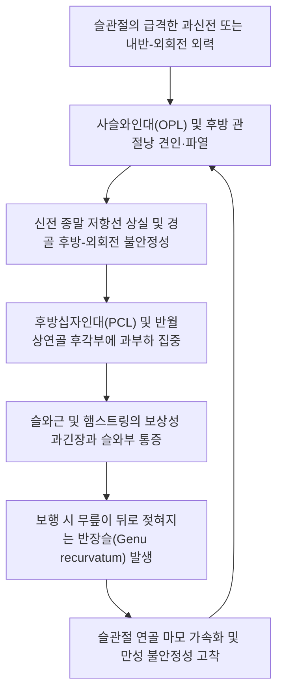

# 🩺 슬관절 후방 관절낭 손상 (Posterior Knee Capsular Injury)

> **핵심 3줄 요약 (Key Summary)**:
> - 📍 **병소 부위 & 해부·병태생리**: 슬관절 후면의 관절낭 복합체인 **사슬와인대(Oblique popliteal ligament, OPL)**, **궁형슬와인대(Arcuate popliteal ligament)**, **후내측 관절낭(PMC)** 및 **후외측 복합체(PLC)**의 신장, 파열 및 이완 병변. 슬관절의 과신전(Hyperextension) 및 회전 안정성을 제공하는 핵심 정적 제동 기전의 붕괴.
> - 🚩 **전형적 임상 양상**: 슬와부(오금, Popliteal fossa) 깊숙한 곳의 지속적인 둔통 및 견인통, 무릎을 디딜 때 뒤로 꺾이며 덜컥거리는 **반장슬 불안정성(Genu recurvatum & Giving way)**, 보행 시 외반/내반 회전 불안정, **다이얼 검사(Dial test) 양성**.
> - 🛠️ **핵심 검사 & 치료 전략**: 후방십자인대(PCL) 및 후외측 복합체(PLC) 동반 손상 감별. Grade I/II 불완전 손상은 신전 보조기 고정 하 위중·위양·곡천 심부 자침, 신바로·자하거 약침을 통한 후방 관절낭 인대 증식, 햄스트링-비복근 동적 안정화 재활. Grade III 파열 및 다발성 인대 불안정 시 조기 인대 재건술 의뢰.
> - ⚠️ **응급 의뢰 레드플래그**: 급성 후방 탈구 동반(슬와동맥 혈전 폐색 및 구획증후군 위험), 비골신경 손상으로 인한 발목 족배굴곡 마비(족하수), 무릎 30° 및 90° 다이얼 검사상 15° 이상의 현저한 외회전 증가(Grade III PLC 복합 파열).

---

## 📌 목차
1. [질환 개요 & 해부학적 병태생리](#1-질환-개요--해부학적-병태생리)
2. [병태생리 메커니즘 & 생체역학적 악순환 네트워크](#2-병태생리-메커니즘--생체역학적-악순환-네트워크)
3. [임상 증상 & 이학적 검사(Physical Exam) 알고리즘](#3-임상-증상--이학적-검사physical-exam-알고리즘)
4. [감별 진단 매트릭스 (Differential Diagnosis)](#4-감별-진단-매트릭스-differential-diagnosis)
5. [한의 통합 치료 프로토콜 (침·약침·추나·한약)](#5-한의-통합-치료-프로토콜-침약침추나한약)
6. [양방 치료 & 병용·의뢰 기준 (Conventional Treatment & Referral)](#6-양방-치료--병용의뢰-기준-conventional-treatment--referral)
7. [재활 운동 & 생활습관 티칭 가이드](#7-재활-운동--생활습관-티칭-가이드)
8. [💡 사용자 진료실 핵심 필기 & 임상 노하우 (Melt-In 잔여 심화 집약)](#8--사용자-진료실-핵심-필기--임상-노하우-melt-in-잔여-심화-집약)
9. [출처 및 학술 참고 문헌 (References)](#9-출처-및-학술-참고-문헌--references)

---

## 1. 질환 개요 & 해부학적 병태생리

**슬관절 후방 관절낭 손상(Posterior Knee Capsular Injury)**은 대퇴-경골 관절의 후면을 둘러싸며 관절액의 유출을 막고 과신전을 제동하는 후방 관절낭(Posterior capsule) 및 그 보강 인대군에 발생하는 염좌, 파열 및 만성 이완 병변이다.

![[슬관절후방관절낭_후면해부도_SmartServier.png]]
> [그림 1: ① 병태해부 — 사슬와인대(OPL), 비복근 부착부 및 슬관절 후방 관절낭의 주요 해부학적 구조 도해]

슬관절 후방 지지대는 크게 세 구획으로 나뉜다:
1. **중앙 후방 관절낭(Central Posterior Capsule)**: 반막양근(Semimembranosus) 건의 연장선인 **[[사슬와인대]](Oblique Popliteal Ligament, OPL)**에 의해 두텁게 보강되며, 무릎 과신전(Hyperextension)에 대한 가장 강력한 제1차 정적 저항선 역할을 수행한다.
2. **후외측 복합체([[PLC]], Posterolateral Corner)**: 후외측 관절낭, **외측측부인대(LCL)**, **슬와근건(Popliteus tendon)**, **슬와비골인대(Popliteofibular ligament, PFL)**, **궁형슬와인대(Arcuate ligament)**로 구성되며, 경골의 과도한 외회전과 내반(Varus)을 제어한다.
3. **후내측 관절낭(PMC, Posteromedial Capsule)**: 후내측 관절낭과 후사각인대(Posterior Oblique Ligament, POL)로 구성되어 외반 및 내회전을 제어한다.

![[슬관절후방관절낭_시상단면도_SmartServier.jpg]]
> [그림 2: ① 단면 해부 — 후방십자인대(PCL) 후방에서 관절을 감싸는 후방 관절낭과 슬와근의 시상면 해부도]

---

## 2. 병태생리 메커니즘 & 생체역학적 악순환 네트워크

### 과신전 및 내반-외회전 외력에 의한 파열 기전
후방 관절낭 손상은 스포츠 활동 중 점프 착지 시 무릎이 뒤로 꺾이는 급격한 **과신전 손상(Hyperextension injury)**이나, 교통사고 시 무릎 전면에서 후방으로 가해지는 강한 충격(Dashboard injury), 또는 전외측에서 가해진 접촉성 외력으로 무릎이 벌어지는 내반-과신전 스트레스에 의해 유발된다.

![[무릎탈구_십자인대_및_측부인대_해부도_Gray348.png]]
> [그림 3: ① 인대 복합체 — 후방십자인대 및 후방 관절낭 보강 인대의 상호 역학 도해]

![[무릎탈구_슬와동맥_및_신경손상_해부도해.jpg]]
> [그림 4: ① 혈관신경 인접성 — 후방 관절낭 직후방을 주행하여 견인 손상 위험이 있는 슬와동맥 및 경골·비골신경 해부도]

후방 관절낭이 파열되면 무릎 신전 시 딱딱하게 멈추어 주어야 할 정상 종말 감(End-feel)이 사라지고, 무릎이 정상 각도(0°)를 넘어 비정상적으로 뒤로 꺾이는 **반장슬(Genu recurvatum)**이 고착된다. 이는 [[후방십자인대]](PCL)에 만성적인 신장 과부하를 가하여 조기 내측 및 슬개대퇴 관절염으로 진행하는 악순환을 형성한다.

---

## 3. 임상 증상 & 이학적 검사(Physical Exam) 알고리즘

### 임상 증상
- **오금 심부 통증(Deep Popliteal Pain)**: 무릎 뒤쪽 오금 부위가 끊어질 듯 뻐근하며, 다리를 완전히 펼 때 통증이 극에 달함.
- **걸을 때 무릎이 뒤로 빠지는 느낌(Hyperextension Giving Way)**: 보행 시 체중을 싣는 순간(입각기 초기) 무릎이 뒤로 툭 젖혀지며 힘이 빠짐.
- **슬와부 압통 및 부종**: 비복근 건 부착부와 사슬와인대 부위에 둔탁한 압통과 부종 존재.

### 이학적 검사 알고리즘

![[라크만_검사_1단계_슬관절20도굴곡_시작자세.jpg]]
> [그림 5: ② 이학적 검사 — 십자인대 및 관절낭 복합체 손상을 감별하기 위한 슬관절 안정성 평가 실사]

![[박리성골연골증_슬관절_MRI_시상면_T2_소견.jpg]]
> [그림 6: ① 영상 평가 — 후방 관절낭 파열 시 동반되는 후방 관절낭액 누출 및 인대 손상을 평가하는 시상면 T2 MRI]

1. **다이얼 검사 (Dial Test — 후외측 관절낭/PLC 감별의 핵심)**:
   - 복와위에서 무릎을 **30° 굴곡** 및 **90° 굴곡**한 상태에서 양측 발목을 잡고 경골 외회전 각도를 비교.
   - **30°에서만 건측 대비 10° 이상 외회전 증가**: 순수 후외측 관절낭(PLC) 단독 손상.
   - **30°와 90° 모두에서 10° 이상 외회전 증가**: 후외측 복합체(PLC) + 후방십자인대(PCL) 복합 파열.
2. **과신전 외반/내반 검사 (Hyperextension-Varus Test)**:
   - 다리를 완전 신전한 상태에서 내반 및 외반 스트레스를 가할 때 관절 간격 벌어짐 및 통증 유발 평가.
3. **후방 처짐 징후 (Posterior Sag Sign) & 후방전위 검사 (Posterior Drawer Test)**:
   - 무릎 90도 굴곡 상태에서 경골 결손 및 후방 전위 여부 평가.

---

## 4. 감별 진단 매트릭스 (Differential Diagnosis)

![[슬관절_연부조직_통증부위_도해.svg]]
> [그림 7: ① 해부 감별 — 슬관절 후방 및 주변 연부조직 인대 손상 부위 비교 도해]

| 감별 질환 | 손상 구조물 | 주 통증 부위 | 특징적 신체 검진 | 보행 시 양상 |
| :--- | :--- | :--- | :--- | :--- |
| **[[슬관절 후방 관절낭 손상]]** | 사슬와인대(OPL), 후외측 관절낭 | **슬와부 심부 전반** | **Dial test (+)**, 과신전 시 통증 극대화 | 무릎이 뒤로 꺾임 (반장슬) |
| **단독 [[후방십자인대 파열]]** | PCL 단독 파열 | 슬와부 둔통, 경골 전면 | **Posterior drawer (+)**, Sag sign (+) | 계단 내려갈 때 불안정 |
| **[[베이커 낭종]](Baker's Cyst)** | 비복근-반막양근 점액낭 팽창 | 오금 내측의 만져지는 물혹 | 굴곡 시 팽만감, 신전 시 압박통 | 쪼그려 앉을 때 압박감 |
| **슬와근건염(Popliteus Tendinitis)** | 슬와근 건-근복 접합부 | 슬와 외측 및 LCL 심부 | 양반다리 시 통증, 외회전 저항통 | 평지 보행은 대체로 양호 |
| **슬와동맥 포착 증후군** | 비복근 비정상 주행으로 동맥 압박 | 종아리 파행(Claudication) | 운동 후 족배동맥 맥박 감약 | 걸으면 종아리가 저리고 터질 듯함 |

---

## 5. 한의 통합 치료 프로토콜 (침·약침·추나·한약)

![[무릎염좌_05_술기실사_측부인대_자침치료.jpg]]
> [그림 8: ③ 한의 시술 — 슬관절 후면 및 측부 인대 부착부 경혈 자침을 통한 후방 지지대 강화 침치료 실사]

### 침구 치료: 후방 관절낭 타겟팅 및 경련 해소
- **주요 혈위**: [[위중]](BL40, 슬와부 중심 및 사슬와인대 자극), [[위양]](BL39, 대퇴이두근건 내측 및 후외측 지지대), [[곡천]](LR8, 반막양근 부착부), [[음곡]](KI10, 반건양근 부착부), [[승산]](BL57).
- **심부 전침 요법**:
  - 복와위에서 위중과 위양혈에 침을 1.0~1.5치 직자하여 후방 관절낭 표면 연부조직에 도달시킴.
  - 2Hz/100Hz 혼합파를 15분간 적용하여 손상 후 반사적으로 경축된 슬와근과 비복근의 과긴장을 풀고 국소 혈류를 증대시킴.

### 약침 치료 (Pharmacopuncture)
- **신바로 약침 및 자하거 약침**:
  - 사슬와인대 부착부(대퇴골 내과 후면)와 후외측 비골두 인접 부위에 0.5~1.0ml 주입.
  - 이완되고 미세 파열된 후방 섬유성 관절낭의 교원질 증식을 유도하여 인장 강도를 복원.
- **황련해독탕 약침**: 급성 외상성 활액막염 및 슬와부 부종기에 주입하여 삼출액 흡수 촉진.

### 추나 의학 및 관절가동 (Chuna)
- **슬관절 후방 관절낭 신장 완화 추나**: 과도한 신전을 제한하고, 경골의 전방 활주(Anterior glide) 도수 기법을 적용하여 후방 관절낭에 가해지는 견인 장력을 차단.
- **골반-요추 연계 교정**: 골반 전방경사 교정을 통해 대퇴사두근의 과신전 유발력을 중립화.

### 한약 치료 (Herbal Medicine)
- **급성 외상기**: **[[당귀수산]]**, **소경활혈탕**. 슬와부 심부 어혈 제거 및 통증 완화.
- **만성 불안정 및 인대 이완기**: **[[독활기생탕]]**, **보신건골탕** 가감 (두충, 속단, 구척, 우슬 증량). 후방 관절낭 및 인대 결합조직을 강화하고 관절 퇴행을 억제.

---

## 6. 양방 치료 & 병용·의뢰 기준 (Conventional Treatment & Referral)

### 양방 치료 프로토콜
- **보존적 치료 (Grade I / II 염좌)**:
  - 무릎을 0~10도 약간 굴곡된 상태로 고정하는 신전 제한 보조기(Hinged brace)를 3~4주간 착용. 과신전(Genu recurvatum) 발생을 차단하여 관절낭이 짧아진 상태에서 치유되도록 유도.
- **수술적 치료 (Surgical Indication — Grade III 완전 파열)**:
  - 후방 관절낭 파열에 PCL 파열 또는 Dial test 양성의 심한 후외측 불안정성(PLC rupture)이 동반된 경우 **관절경하 후외측 복합체 재건술(PLC Reconstruction)** 또는 사슬와인대 보강 봉합술 시행.

### 응급 의뢰 트리거 (Red Flags)
1. **슬관절 완전 탈구 병력 및 족배동맥 맥박 감약(슬와동맥 손상 의심 즉시 전원)**.
2. **비골두 부위 압박 손상으로 인한 발목 족배굴곡 마비(총비골신경 완전 마비)**.
3. **Dial test상 30°와 90° 모두에서 15° 이상의 현저한 외회전 증가(다발성 인대 파열)**.

---

## 7. 재활 운동 & 생활습관 티칭 가이드

1. **과신전 방지 테이핑**:
   - 무릎 뒤 슬와부에 신축성 테이프를 팽팽하게 X자로 부착하여 보행 시 무릎이 0도를 넘어 뒤로 꺾이지 않도록 탄력적 제동벽 형성.
2. **햄스트링 및 비복근 협응 강화 운동**:
   - 짐볼 햄스트링 컬(Swiss-ball hamstring curl) 및 밴드 레그 컬을 통해 무릎 뒤쪽 굴곡근군이 신전 시 후방 관절낭 대신 능동적 제동 역할을 하도록 훈련.
3. **일상생활 주의사항**:
   - 서 있을 때 무릎을 완전히 펴서 뒤로 기대는 습관(Passive knee locking) 절대 회피.
   - 무거운 물건을 들고 무릎을 과신전시키는 데드리프트 동작 제한.

---

## 8. 💡 사용자 진료실 핵심 필기 & 임상 노하우 (Melt-In 잔여 심화 집약)

- **'오금이 당긴다'는 말 속에 숨겨진 인대 손상**: 환자가 "무릎 뒤 오금이 땡겨서 다리를 똑바로 못 펴겠다"고 하면 단순한 비복근 쥐나 햄스트링 단축으로 넘기기 쉽다. 그러나 과신전 외상 병력이 있다면 반드시 **사슬와인대(OPL) 및 후방 관절낭 손상**을 의심하고 무릎을 뒤로 젖혀보아야 한다.
- **Dial Test 30초 실전 감별**: 환자를 엎드리게 한 뒤 무릎을 30도 구부려 발목을 바깥으로 돌려보고, 90도로 구부려 다시 돌려본다. 30도에서만 유독 덜컥하며 많이 돌아가면 **후외측 관절낭(PLC) 단독 손상**이고, 90도에서도 똑같이 많이 돌아가면 **PCL까지 다 터진 중증 복합 손상**이다.
- **위중혈 자침 시 해부학적 주의**: 위중(BL40)은 슬와동맥 및 경골신경 바로 위에 위치한다. 따라서 굵은 장침으로 무리하게 수직 직자하기보다는, 0.25~0.30mm 호침으로 1치 내외 부드럽게 자입하거나 슬와근 부착부 외측(위양 방향)으로 사자하는 것이 안전하고 효과적이다.

---

## 9. 출처 및 학술 참고 문헌 (References)

1. Corsia S, et al. (2026). Avoiding Tunnel Collisions in Knee Posterolateral Corner Reconstructions: The Versailles Technique. *Arthrosc Tech*, 15(9):103280. [PMID 42625652](https://pubmed.ncbi.nlm.nih.gov/42625652/)

2. Cobisi CD, et al. (2026). The Use of Arthroscopy in Diagnosis and Operative Treatment of Knee Posterolateral Corner Injuries: A Narrative Review. *Diagnostics (Basel)*, 16(13):2091. [PMID 42452717](https://pubmed.ncbi.nlm.nih.gov/42452717/)

3. Faus-Cotino J, et al. (2026). Combined Posterolateral Corner and Proximal Tibiofibular Joint Anatomic Reconstruction: A Surgical Strategy for Complex Posterolateral Knee Instability. *Arthrosc Tech*, 15(8):103198. [PMID 42586932](https://pubmed.ncbi.nlm.nih.gov/42586932/)

---

## 관련 노트
- [[슬관절 후방십자인대 손상]]
- [[무릎 탈구]]
- [[무릎 락킹 증후군]]
- [[슬관절 전방 내포집증후군]]
- [[당귀수산]]
- [[독활기생탕]]
- [[위중]]
