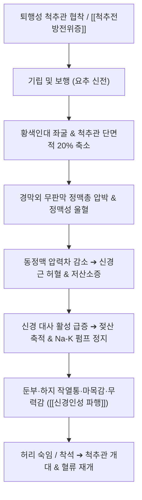

# 🩺 [[신경인성 파행]] (Neurogenic Claudication, M48.06)

> **핵심 3줄 요약 (Key Summary)**:
> - 📍 병소 부위 & 해부·병태생리: 요추 [[척추관 협착증]] 또는 퇴행성 [[척추전방전위증]]으로 인해 보행 및 기립 시 척추관 단면적이 좁아져 마미총(Cauda equina) 및 신경근에 정맥성 울혈과 동맥성 허혈이 발생하는 신경혈관성 증후군.
> - 🚩 전형적 임상 양상 & 3대 징후: 일정 거리 보행 시 둔부·하지 전체의 쥐어짜는 듯한 통증·저림·무력감 발현, 허리를 뒤로 젖히면 악화, 허리를 앞으로 숙이거나 의자에 앉으면 수 분 내에 극적으로 소실(쇼핑카트 징후).
> - 🛠️ 핵심 감별 검사 & 한·양방 다각적 치료 전략: [[반 겔더렌 자전거 검사]](Bicycle test) 및 족배동맥 맥박으로 혈관성 파행과 감별하며, 협척혈 심자침, 신바로·황련해독탕 [[약침 치료]], 콕스 굴곡-신장 [[추나요법]] 및 리마프로스트(PGE1) 병용.
> - ⚠️ 응급 의뢰 레드플래그 & 악화 요인: 안장 감각 둔마(Saddle anesthesia), 배뇨/배변 괄약근 조절 장애, 양측 족하수(Foot drop) 등 마미증후군 징후 출현 시 지체 없이 척추외과 응급 수술 전원.

---

## 📌 목차
1. [질환 개요 & 해부학적 병태생리](#1-질환-개요--해부학적-병태생리)
2. [병태생리 메커니즘 & 생체역학적 악순환 네트워크](#2-병태생리-메커니즘--생체역학적-악순환-네트워크)
3. [임상 증상 & 이학적 검사(Physical Exam) 알고리즘](#3-임상-증상--이학적-검사physical-exam-알고리즘)
4. [감별 진단 매트릭스 (Differential Diagnosis)](#4-감별-진단-매트릭스-differential-diagnosis)
5. [한의 통합 치료 프로토콜 (침·약침·추나·한약)](#5-한의-통합-치료-프로토콜-침약침추나한약)
6. [양방 치료 & 병용·의뢰 기준 (Conventional Treatment & Referral)](#6-양방-치료--병용의뢰-기준-conventional-treatment--referral)
7. [재활 운동 & 생활습관 티칭 가이드](#7-재활-운동--생활습관-티칭-가이드)
8. [💡 사용자 진료실 핵심 필기 & 임상 노하우 (Melt-In 잔여 심화 집약)](#8--사용자-진료실-핵심-필기--임상-노하우-melt-in-잔여-심화-집약)
9. [출처 및 학술 참고 문헌 (References)](#9-출처-및-학술-참고-문헌-references)

---

## 1. 질환 개요 & 해부학적 병태생리

![[척추관협착증_황색인대비후_MRI_축상면.jpg|450]]
> [그림 1: ① 요추 척추관 협착증의 축상면(Axial) T2 MRI — 퇴행성 황색인대 비후 및 경막낭 협착 소견 — 출처: Wikimedia Commons (CC BY 4.0)]

![[척추관협착증_척추전방전위증_Xray.png|450]]
> [그림 2: ② 요추 측면 단순 방사선(X-ray) — L4-L5 분절의 척추전방전위증 및 척추관 전후경 협착 — 출처: Wikimedia Commons (CC BY-SA 4.0)]

* **질환 정의**:
  * 신경인성 파행(Neurogenic Intermittent Claudication, NIC)은 요추관 협착증([[척추관 협착증]])의 가장 특징적인 임상 증후군이다.
  * 보행이나 기립 시 요추 척추관(Spinal canal) 및 신경근관이 기계적으로 좁아지면서 마미총(Cauda equina)과 신경근에 정맥성 울혈(Venous pooling)과 2차적 동맥 허혈이 발생하여 둔부와 하지 전체로 저림, 쥐어짜는 통증, 무력감이 나타난다.
* **체위 변화에 따른 동적 척추관 역학 (Dynamic Canal Mechanics)**:
  * **요추 신전 (기립 및 보행)**: 추간판이 후방 돌출되고, 후관절이 맞물리며, 황색인대가 척추관 내측으로 주름 잡혀 접혀 들어감(Bulging / Pincer effect). 척추관 단면적이 15~20% 축소되어 신경근 압박이 극대화된다.
  * **요추 굴곡 (허리 숙이기 및 착석)**: 추간판 후방 간격이 벌어지고 황색인대가 팽팽히 펴져 척추관 단면적이 즉시 확장되어 신경 압박이 감압된다.

---

## 2. 병태생리 메커니즘 & 생체역학적 악순환 네트워크

![[척추관협착증_삼엽형척추관_해부병태도.jpg|450]]
> [그림 3: ③ 중심성 척추관 협착 및 삼엽형 척추관(Trefoil canal) 형성에 따른 마미총 신경근 압박 해부 병태도 — 출처: Gray's Anatomy (Public Domain)]

### 정맥 울혈 및 이중 허혈 가설 (Two-Vessel Venous Ischemia Model)
1. **정맥 울혈 발생 (Venous Pooling)**:
   * 척추관 내압이 상승하면 모세혈관보다 벽이 얇은 경막외 무판막 정맥총(Batson's plexus)이 먼저 폐색되어 신경근 내 모세혈관망의 정수압이 급상승한다.
2. **동맥 공급 차단 및 젖산 축적**:
   * 정맥압 상승으로 동정맥 압력 경사(AV gradient)가 붕괴되어 미세 동맥 혈류가 2차 차단된다. 보행 중 산소 요구량은 2~3배 폭증하나 무산소증이 초래되어 젖산(Lactate)이 급격히 축적된다.
3. **신경 전도 차단과 파행 발현**:
   * 나트륨-칼륨 펌프 작동 정지로 신경 전도가 차단되어 하지 탈력감이 발생하고, C-섬유가 화학적으로 자극받아 격렬한 저림과 통증이 폭발한다.

---

## 3. 임상 증상 & 이학적 검사(Physical Exam) 알고리즘

### 1) 특징적 임상 양상
* **간헐적 신경인성 파행**: 보행 시작 후 일정 거리(무통 보행 거리)를 지나면 하지 전체가 무겁고 터질 듯하며 주저앉게 됨.
* **쇼핑카트 징후 (Shopping Cart Sign)**: 마트 카트를 잡고 상체를 숙이고 걸으면 몇 시간 동안 통증 없이 편안하게 걸을 수 있음.
* **임상 표현형 구분**:
  * **통증형 (Pain-dominant)**: 둔통·자통 우세. 침구 치료 및 추나에 대한 반응이 우수함.
  * **감각형 (Sensory-dominant)**: 남의 살 같은 마목감, 발바닥에 모래를 밟는 듯한 이상감각 우세. 신경 탈수초화 진행으로 장기 치료 요함.

### 2) 필수 이학적 검사법

![[켐프_검사_2단계_신전_측굴_회전.jpg|420]]
> [그림 4: ④ 켐프 검사(Kemp's Test) — 요추 신전·측굴·회전을 통한 척추관 및 추간공 협착 신경근 증상 유발 — 출처: Simbio Clinical Archive]

* **[[켐프 검사]](Kemp's Test)**:
  * 환자를 세우거나 앉힌 상태에서 요추를 신전·측굴·회전시키며 하방 축성 압박을 가함. 척추관 및 추간공 단면적이 좁아져 하지 방사통이나 둔부 통증이 유발되면 요추관 협착 및 후관절 병변 양성.
* **반 겔더렌 자전거 검사 (Bicycle Test of van Gelderen)**:
  * 실내 자전거를 상체를 숙이고 타게 함. 신경인성 파행 환자는 평지 보행이 100m도 불가능하더라도 척추관이 확장되어 **30분 이상 통증 없이 주행 가능**(혈관성 파행은 자전거 주행 시에도 종아리 통증 폭발).
* **트레드밀 경사도 보행 검사**: 평지 보행 시 조기 파행 발생, 10도 오르막(상체 전굴)에서는 보행 거리 현저히 증가.
* **말초 동맥 맥박 촉진**: 족배동맥(Dorsalis pedis) 및 후경골동맥 박동이 정상적으로 힘차게 촉진됨(혈관성 파행 감별 필수).

---

## 4. 감별 진단 매트릭스 (Differential Diagnosis)

| 감별 항목 | [[신경인성 파행]] | 혈관성 파행 (말초동맥질환) | [[요추 추간판 탈출증]] |
| :--- | :--- | :--- | :--- |
| **통증 발현 원인** | 척추관 내 마미총 정맥 울혈 및 신경 허혈 | 말초 동맥 폐색(PAD)으로 인한 하지 근육 허혈 | 탈출 수핵에 의한 신경근 화학적/기계적 압박 |
| **자세의 영향** | **허리 신전 시 악화, 굴곡 시 즉시 완화** | 자세와 무관 (보행 운동량에 비례) | 허리 굴곡 시 악화, 기침/복압 상승 시 악화 |
| **휴식 시 완화 방식** | **반드시 앉거나 허리를 숙여야 완화** | **서서 가만히 쉬기만 해도 즉시 완화** | 누워서 무릎을 굽히면 완화 |
| **자전거 검사** | **통증 없이 장시간 주행 가능 (음성)** | **주행 중 종아리 격통 발생 (양성)** | 주행 시 굴곡 부하로 요통 악화 가능 |
| **족배동맥 맥박** | **정상 (힘차게 뜀)** | **소실 또는 현저히 감약** | 정상 |
| **피부 변화** | 없음 (정상 체온 및 피부색) | 족부 냉감, 피부 창백, 하지 털 탈모, 궤양 | 없음 |

---

## 5. 한의 통합 치료 프로토콜 (침·약침·추나·한약)

![[요추추간판탈출증_추나요법_신장기법.png|450]]
> [그림 6: ⑥ 콕스 테이블을 활용한 요추 굴곡-신장(Flexion-Distraction) 감압 추나 기법 — 출처: Simbio Clinical Archive]

* **침구 치료 (Acupuncture)**:
  * **요추 협척혈(EX-B2) 심자술 (PMID 38950397)**: L3-L5 협척혈 및 [[대장수(BL25)]]에 60~75mm 호침으로 척추 후관절 골성에 안전하게 도달하도록 심자 자침(주 3회, 6주 18회). 신경근 주변 미세순환 촉진 및 ODI 유의한 개선.
  * **원위 원락 배혈**: [[환도(GB30)]], [[위중(BL40)]], [[승산(BL57)]], [[양릉천(GB34)]] 전침(2Hz 저주파) 통전으로 하지 신경근 흥분성 정상화.
* **약침 치료 (Pharmacopuncture)**:
  * **신바로 / 황련해독탕 약침**: 요추 후관절 및 협척혈 부위에 1.0~2.0cc 주입하여 황색인대 및 관절낭 염증 차단.
  * **자하거 / 단삼 약침 (PMID 42099446)**: 협척혈 및 방광수 부위 주입으로 신경근 허혈성 미세정맥 울혈 개선 및 신경 축삭 재생 촉진.
* **추나요법 (Chuna Manipulation)**:
  * **요추 굴곡 변위 신장 가동술 (Cox Technique)**: 굴곡-신장 테이블을 활용하여 요추를 부드럽게 굴곡 및 축성 견인하여 순간적 척추관 단면적 확대와 경막외 정맥압 감압 유도.
  * **골반 후방 경사 유도 및 [[장요근]] 이완**: 과도한 골반 전방 경사와 요추 전만을 완화하여 기립 시 척추관 협착 방지.
* **한약 치료 (Herbal Medicine)**:
  * **[[독활기생탕]](獨活寄生湯)**: 보간신, 강근골, 거풍습으로 노인성 척추관 협착증의 1차 표준 방제.
  * **[[오적산]](五積散)**: 한습담어(寒濕痰瘀)가 겹쳐 흐리거나 추운 날 보행 장애가 심해지는 경우.
  * **[[보양환오탕]](補陽還五湯)**: 기허혈어로 인해 발바닥 마목감과 하지 탈력감이 동반되는 감각형 파행.

---

## 6. 양방 치료 & 병용·의뢰 기준 (Conventional Treatment & Referral)

### 1) 양방 약물 치료
* **프로스타글란딘 E1(PGE1) 유도체**: Limaprost alfadex 5μg tid.
  * 신경근 내 미세혈류를 확장하고 혈소판 응집을 억제하여 무통 보행 거리를 유의하게 확장시키는 협착증 특화 약물.
* **신경병증성 통증 제어제**:
  * Pregabalin 75mg bid (신기능에 따라 조절), 또는 Gabapentin 300mg tid.
* **진통소염제 및 근이완제**:
  * Celecoxib 200mg qd + Eperisone 50mg tid.

### 2) 주사 및 수술적 치료
* **경막외 신경차단술 (Epidural Steroid Injection)**:
  * 추간공(Transforaminal) 또는 후궁간(Interlaminar) 접근법으로 덱사메타손/트리암시놀론 국소 주입하여 급성 신경 부종 완화.
* **수술적 감압술 및 유합술**:
  * 후궁 절제술(Laminectomy), 현미경하 감압술, 척추 전방전위증 동반 시 후방 척추유합술(PLIF/TLIF).

### 3) 한·양방 병용 시 주의사항
* Limaprost나 아스피린 등 항혈전제를 복용 중인 환자에게 활혈거어 한약([[도인]], [[홍화]], [[단삼]]) 처방 시 멍이나 출혈 경향 모니터링.
* 경막외 신경차단술을 받은 환자는 감염 위험 방지를 위해 주사 후 최소 48시간 동안 요추부 심자침 시술을 유예.

### 4) 응급 전원 및 상급병원 의뢰 기준 (레드플래그)
* **[[마미증후군]](Cauda Equina Syndrome)**:
  * 배뇨 곤란, 요폐(Urinary retention), 변실금 등 방광/직장 괄약근 기능 부전.
  * 안장 부위(회음부, 항문 주위)의 양측성 감각 탈실(Saddle anesthesia).
* **진행성 운동 신경 마비**:
  * 족관절 족배굴곡 근력 3등급 이하 저하, 족하수(Foot drop) 급격 진행.
  * 위 증상 관찰 시 48시간 이내 응급 감압 수술을 받도록 척추외과로 즉시 전원 의뢰.

---

## 7. 재활 운동 & 생활습관 티칭 가이드

* **실내 자전거(사이클) 타기 권장**:
  * 상체를 앞으로 숙이고 타는 실내 고정식 자전거는 척추관을 넓힌 상태에서 하지 혈류를 촉진하므로 최선의 유산소 운동임.
* **분할 보행 교육**:
  * 억지로 통증을 참으며 만 보를 걷는 것은 신경을 허혈 상태로 방치하는 행위이므로, 200~300m 단위로 나누어 쉬면서 걷도록 지도.
* **금기 운동**:
  * 맥켄지 신전 운동, 허리 젖히기 요가 자세(코브라 자세)는 척추관을 직접 압박하므로 절대 금기.
  * [[윌리엄스 굴곡 운동]](무릎을 가슴으로 당기는 스트레칭)을 시행하여 요추 후관절을 열어줄 것.

---

## 8. 💡 사용자 진료실 핵심 필기 & 임상 노하우 (Melt-In 잔여 심화 집약)

### 원장실 실전 문진 및 환자 티칭 가이드
* **"허리 디스크인가요, 협착증인가요?" 10초 감별 스크립트**:
  * "어르신, 걸을 때 허리를 꼿꼿이 펴고 걸으면 편하신가요, 아니면 유모차나 카트를 짚고 앞으로 구부정하게 걸어야 편하신가요?"
  * "구부려야 편하고 똑바로 서면 다리가 터질 것 같아요" $\rightarrow$ **100% 척추관 협착에 의한 신경인성 파행**.
  * "앉아 있으면 엉덩이와 다리가 찢어질 듯 아프고 서서 걸으면 오히려 낫습니다" $\rightarrow$ **추간판 탈출증(디스크)**.
* **현실적인 치료 목표 설정 (Expectation Management)**:
  * "어르신, 좁아진 척추관을 20대 때처럼 뼈를 깎지 않고 넓히는 것은 어렵습니다. 우리의 치료 목표는 100m밖에 못 걷던 다리를 500m, 1km까지 안 쉬고 걸을 수 있게 혈류를 뚫어주는 것입니다."
  * 2~4주 치료 후 '무통 보행 거리'의 연장을 기준으로 호전 여부를 평가한다.

---

## 9. 📚 출처 및 학술 참고 문헌 (References)

* **Liu Z, Liu Y, Xu H et al.** (2024). Acupuncture for Lumbar Spinal Stenosis: A Multicenter Randomized Controlled Trial. *JAMA Netw Open*, 7(7):e2420456.
  * [PubMed 링크 (PMID: 38950397)](https://pubmed.ncbi.nlm.nih.gov/38950397/)
  * `[연구 요약]`: 요추관 협착증 및 신경인성 파행 환자 80명을 대상으로 대장수 및 요추 협척혈 심자 침 치료를 6주간 시행한 결과, 가짜 침 대비 통증 점수 및 보행 장애 지수(ODI)가 16%p 이상 유의하게 개선됨을 규명한 대규모 다기관 RCT.
* **Ammendolia C, Hofkirchner C, Plener J et al.** (2023). Conservative Management of Lumbar Spinal Stenosis: A Systematic Review and Meta-Analysis of Randomized Controlled Trials. *J Orthop Sports Phys Ther*, 53(10):620-634.
  * [PubMed 링크 (PMID: 37715644)](https://pubmed.ncbi.nlm.nih.gov/37715644/)
  * `[연구 요약]`: 신경인성 파행 환자에 대한 굴곡 기반 자전거 운동, 체간 안정화 트레이닝, 도수 가동술의 복합 보존 치료가 보행 거리 확장과 수술 지연에 미치는 유효성을 체계적으로 입증함.
* **Bagley CA, MacLean MA, Arnold PM et al.** (2021). Lumbar Spinal Stenosis and Potential Management With Prostaglandin E1 Analogs. *Am J Phys Med Rehabil*, 100(3):289-296.
  * [PubMed 링크 (PMID: 33065578)](https://pubmed.ncbi.nlm.nih.gov/33065578/)
  * `[연구 요약]`: 마미총 미세정맥 울혈 및 신경근 허혈성 병태생리에 대한 PGE1 유도체(Limaprost)의 혈류 확장 기전과 보행 거리 개선 효능을 총괄 고찰함.
* **Kim TH, Park JY, Lee YJ et al.** (2026). Pharmacopuncture for Lumbar Spinal Stenosis: A Randomized Controlled Clinical Trial. *Integr Med Res*, 15(3 Part A):101323.
  * [PubMed 링크 (PMID: 42099446)](https://pubmed.ncbi.nlm.nih.gov/42099446/)
  * `[연구 요약]`: 요추 척추관 협착증 환자에게 협척혈 약침 시술을 12주간 시행하여 통상 진료군 대비 최대 보행 거리의 현저한 확장(군간차 1.61)과 장기 효과 유지를 입증함.
