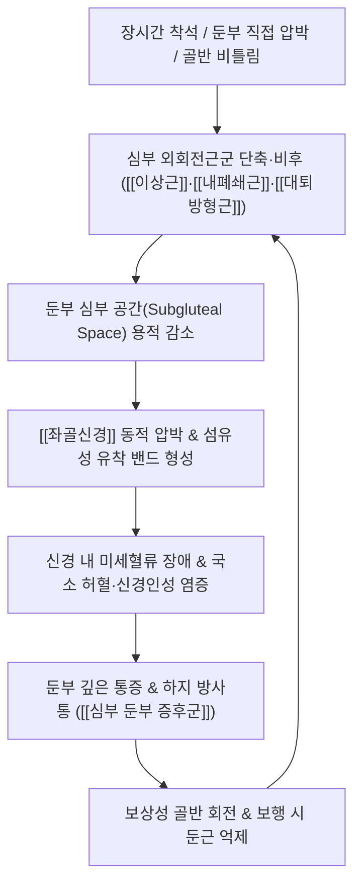

# 🩺 [[심부 둔부 증후군]] (Deep Gluteal Syndrome / 深部臀部症候群, DGS)

> **핵심 3줄 요약 (Key Summary)**:
> - 📍 병소 부위 & 해부·병태생리: 둔부 심부 공간(Subgluteal space)에서 [[좌골신경]]이 [[이상근]], [[내폐쇄근]], [[상쌍자근]], [[하쌍자근]], [[대퇴방형근]] 또는 섬유성 밴드·혈관 루프에 의해 압박·유착되어 발생하는 비추간판성 좌골신경통 질환군.
> - 🚩 전형적 임상 양상 & 3대 징후: 30분 이상 지속 착석 불가(Sitting intolerance), 둔부 깊은 부위의 뻐근하고 쥐어짜는 통증, 대퇴 후면~하퇴 외측으로의 하지 방사통 및 보행 시 악화.
> - 🛠️ 핵심 감별 검사 & 한·양방 다각적 치료 전략: FAIR 검사, Seated Piriformis 검사, Pace 검사, 좌골결절 외측 압통 확인; 초음파 유도하 장침·침도 박리술([[환도]], [[질변]]), 신경 주위 소염 약침, 이상근 및 심부 외회전근군 등척성 후 이완(PIR) 추나.
> - ⚠️ 응급 의뢰 레드플래그 & 악화 요인: 하지 근력 급격한 마비(Foot drop), 회음부 감각 저하 및 대소변 장애(마미증후군 의심), 좌골대퇴 충돌 부위의 무리한 고관절 신전·내회전 강제 수기 금기.

---

## 📌 목차
1. [질환 개요 & 해부학적 병태생리](#1-질환-개요--해부학적-병태생리)
2. [병태생리 메커니즘 & 생체역학적 악순환 네트워크](#2-병태생리-메커니즘--생체역학적-악순환-네트워크)
3. [임상 증상 & 이학적 검사(Physical Exam) 알고리즘](#3-임상-증상--이학적-검사physical-exam-알고리즘)
4. [감별 진단 매트릭스 (Differential Diagnosis)](#4-감별-진단-매트릭스-differential-diagnosis)
5. [한의 통합 치료 프로토콜 (침·약침·추나·한약)](#5-한의-통합-치료-프로토콜-침약침추나한약)
6. [재활 운동 & 생활습관 티칭 가이드](#6-재활-운동--생활습관-티칭-가이드)
7. [💡 사용자 진료실 핵심 필기 & 임상 노하우 (Melt-In 잔여 심화 집약)](#7--사용자-진료실-핵심-필기--임상-노하우-melt-in-잔여-심화-집약)
8. [출처 및 학술 참고 문헌 (References)](#8-출처-및-학술-참고-문헌-references)

---

## 1. 질환 개요 & 해부학적 병태생리

![[심부둔부_외회전근_해부도.png|450]]
> [그림 1: 둔부 심부 공간(Subgluteal Space)의 외회전근군 해부도 — 이상근, 상·하쌍자근, 내폐쇄근, 대퇴방형근 및 대퇴골 대전자 부착부]

* **질환 정의 및 개념의 현대적 확장**:
  * [[심부 둔부 증후군]](Deep Gluteal Syndrome, DGS)은 [[요추 추간판 탈출증]](디스크)이나 요추 척추관 협착증 등 **척추성 병변 이외의 원인**으로 인해, 골반 후면의 둔부 심부 공간(Subgluteal space)에서 [[좌골신경]](Sciatic nerve)이 근육, 건, 섬유성 밴드, 혈관 복합체 등에 의해 기계적으로 압박·견인·포착되어 발생하는 모든 비추간판성 좌골신경통 질환군을 총칭합니다.
  * 과거에는 둔부의 비추간판성 통증을 모두 [[이상근 증후군]](Piriformis syndrome)이라는 단일 진단명으로 불렀으나, 고해상도 MRI와 고관절 관절경 수술의 발전으로 이상근 하방의 삼두근 복합체, 대퇴방형근, 좌골대퇴 공간 등 다양한 포착 병변이 규명되면서 포괄적인 DGS 개념으로 통합·확장되었습니다.
* **관련 해부학적 구조물**:
  * **골격 및 랜드마크**: 좌골결절(Ischial tuberosity), 대퇴골 소전자(Lesser trochanter), 대전자(Greater trochanter), 천골(Sacrum), 대좌골공(Greater sciatic foramen).
  * **근육 및 근막**:
    * 천층: [[대둔근]](Gluteus maximus) — 심부 공간을 덮는 두터운 지붕 역할.
    * 심부 외회전근군: [[이상근]](Piriformis), [[상쌍자근]](Gemellus superior), [[내폐쇄근]](Obturator internus), [[하쌍자근]](Gemellus inferior), [[대퇴방형근]](Quadratus femoris).
    * 대퇴 후면근: [[대퇴이두근]](Biceps femoris 장두 기시부), 반건양근, 반막양근.
  * **신경 및 혈관**:
    * 포착 신경: [[좌골신경]](경골신경 + 총비골신경 복합체), [[후대퇴피신경]](Posterior femoral cutaneous nerve).
    * 혈관: 상둔동맥, 하둔동맥 혈관 루프(Vascular loops) — 신경을 옭아매는 동맥 변이 존재.
    * 인대: 천결절인대(Sacrotuberous ligament)의 낫돌기(Falciform process), 천극인대.

---

## 2. 병태생리 메커니즘 & 생체역학적 악순환 네트워크

![[이상근증후군_둔부신경혈관_네터해부도.png|450]]
> [그림 2: 둔부 심부 신경혈관 주행도 — 이상근 하공을 통과하는 좌골신경 및 하둔신경·후대퇴피신경 주행 관계]

### 1) 해부학적 4대 포착 레벨 및 기전

| 포착 레벨 | 원인 구조물 | 해부학적 병태 위치 | 임상적 발현 특징 |
| :--- | :--- | :--- | :--- |
| **이상근 레벨** | [[이상근]] 비후·연축, 건성 비후, 이상근 관통 해부학적 변이 | 대좌골공(Greater sciatic foramen) 이상근하공 | 전통적 이상근 증후군 형태, FAIR 검사 강양성, 대퇴 회전 시 유발 |
| **삼두근 복합체 레벨** | [[내폐쇄근]]-[[상쌍자근]]-[[하쌍자근]] 복합체, 천결절인대 낫돌기 | 좌골극(Ischial spine) 상하부 좁은 간극 | 의자 착석 시 좌골결절 내외측 극심한 압통, Seated Piriformis 검사 양성 |
| **대퇴방형근 레벨** | [[대퇴방형근]] 부종·지방 침윤, 좌골-소전자 간격 협소화 | 좌골결절 외측연과 대퇴골 소전자 사이 간극 | 좌골대퇴 충돌 증후군(IFI), 보행 시 보폭 확대나 신전 시 찌릿한 통증 |
| **혈관성 / 섬유 밴드 레벨** | 하둔동맥 혈관 루프, 섬유혈관성 유착 띠(Fibrous bands) | 둔부 심부 공간 전역의 신경 활주로 | 체위 변화 시 신경의 정상적 종적 활주(15~28mm) 차단으로 견인 손상 |

![[좌골대퇴충돌_DGS_MRI.jpg|450]]
> [그림 3: 좌골대퇴 충돌 증후군(Ischiofemoral Impingement) 축성 T2 MRI — 좌골결절과 대퇴골 소전자 간격 협착 및 대퇴방형근 내 고신호강도 부종]

### 2) 생체역학적 악순환과 운동학적 연쇄 반응 (Kinetic Chain)
* **착석 시 좌골 압박과 신경 동적 포착**: 의자에 앉을 때 고관절이 90° 굴곡되면 [[좌골신경]]은 좌골결절 외측 모서리에 밀착되며, 이상근 및 내폐쇄근 건 부착부가 신경을 가로질러 팽팽해집니다. 장시간 착석은 심부 공간 내 압력을 정상 대비 3~4배 상승시켜 신경 상막의 모세혈관 순환을 차단(허혈 유발)합니다.
* **보행 및 고관절 신전 시 충돌 (IFI 기전)**: 보행 입각기 후기(Terminal stance)에 고관절이 신전·외회전될 때 대퇴골 소전자가 좌골결절 쪽으로 접근합니다. 만약 골반 전방경사나 고관절 후방 관절낭 단축이 동반되면 [[대퇴방형근]]과 그 사이를 주행하는 좌골신경이 끼어 으깨지는 전단력(Shear force)을 받습니다.

---

## 3. 임상 증상 & 이학적 검사(Physical Exam) 알고리즘

### 1) 주소증 및 신경학적 증상
* **착석 불내성 (Sitting Intolerance)**: 가장 핵심적인 임상 지표로, 딱딱한 의자에 20~30분 이상 앉아있지 못하고 엉덩이를 들썩이거나 환측 둔부를 들고 앉는 편향 착석 자세를 취함.
* **둔부 심부 뻐근함 & 하지 방사통**: 둔부 중심 또는 좌골 부위의 깊숙한 쥐어짜는 듯한 둔통과 함께 대퇴 후면, 슬와부, 비복근 외측 및 족부로 이어지는 저림과 당김.
* **보행 시 간헐적 파행**: 신경의 유착으로 인해 보폭을 넓게 딛거나 고관절을 신전할 때 신경이 당겨지며 다리를 절게 됨.
* **야간 통증 및 체위 변경통**: 수면 중 환측을 아래로 하고 누울 때 둔부 압박으로 통증이 심해져 잠에서 깸.

### 2) 필수 이학적 검사법 (Physical Examination)

| 검사명 | 검사 방법 | 양성 반응 및 임상적 가치 |
| :--- | :--- | :--- |
| **FAIR 검사** | 환자를 측와위로 눕히고 고관절 **굴곡 90°(Flexion), 내전(Adduction), 내회전(Internal Rotation)** 유도 | [[이상근]]을 팽팽하게 신장시켜 좌골신경 압박 유발 (민감도 88%, 특이도 83%) |
| **Seated Piriformis 검사** | 환자가 의자에 앉은 상태에서 고관절 90° 굴곡 후 능동적 고관절 외전에 검사자가 강하게 저항 | [[내폐쇄근]] 및 [[이상근]]의 등척성 수축을 유도하여 둔부 심부 통증 유발 |
| **Pace 검사** | 환자가 앉은 자세에서 양 무릎을 바깥으로 벌리는 외전 동작에 검사자가 양손으로 저항 | 둔부 외측 및 심부 통증 유발과 함께 고관절 외전근 약화 확인 |
| **Beatty 검사** | 아픈 쪽이 위로 오도록 측와위로 누운 후 무릎을 든 상태에서 침대 바닥에서 무릎을 들어 올림 | 이상근의 능동적 수축에 의한 심부 둔통 유발 |
| **좌골결절 외측 압통 (Tinel Sign)** | 앙와위 또는 복와위에서 좌골결절과 대전자 사이 좌골신경 주행로를 직접 엄지로 심부 압박 | 포착 신경 부위의 날카로운 압통 및 발끝으로 찌릿한 방사통 재현 |
| **하지직거상 검사 (SLRT) 감별** | 앙와위에서 무릎을 편 채 다리를 들어 올림 | 요추 디스크와 달리 60~70° 이상 고각도에서 둔부 자체의 당김 위주로 발현 |

---

## 4. 감별 진단 매트릭스 (Differential Diagnosis)

| 감별 질환 | 호발 병소 및 병태 기전 | 주소증 차이점 | 특이적 검사 및 감별 포인트 |
| :--- | :--- | :--- | :--- |
| **[[심부 둔부 증후군]]** (본 질환) | 둔부 심부 공간 내 [[좌골신경]] 포착 | 요통 없음/경미, 30분 이상 착석 불가, 둔부 심부 극심한 압통 | FAIR 양성, Seated Piriformis 양성, SLRT 고각도 음성/경미 |
| **[[요추 추간판 탈출증]]** | L4/5, L5/S1 신경근(Root) 압박 | 요통 선행, 기침/재채기/복압 상승 시 방사통 악화, 피부분절 감각 저하 | [[SLR test]] 30~60° 양성, [[Bragard test]] 양성, 발살바 양성 |
| **[[좌골점액낭염]]** | 좌골결절 상부 점액낭 마찰 염증 | 좌골결절 뼈 바로 위 압통, 보행 시에는 통증 경미, 방사통 없음 | 좌골결절 골막 직접 압통, 방사통 부재, 초음파상 낭종성 삼출액 |
| **[[대전자점액낭염]]** | 고관절 외측 대전자 점액낭 염증 | 고관절 외측 통증, 옆으로 누울 때 외측 통증, 하지 후면 방사통 없음 | 대전자 외측면 압통, 패트릭 검사 시 외측 통증, 보행 파행(외전근 약화) |
| **[[이상근 증후군]]** (협의) | 오직 [[이상근]] 단독에 의한 포착 | 이상근 복부 압통 위주, IFI나 삼두근 증상 없음 | FAIR 검사만 단독 양성, 좌골-소전자 충돌 음성 |

---

## 5. 한의 통합 치료 프로토콜 (침·약침·추나·한약)

![[이상근증후군_이상근_약침주입점_임상사진.png|400]]
> [그림 4: 둔부 심부 공간 약침 및 장침 자입 임상 시술 사진 — 좌골신경 주행로와 이상근 하연 포착점 해제]

* **침구 및 침도 치료 (Acupuncture & Acupotomy)**:
  * **심부 둔부 침도 박리술 (Acupotomy)**: 둔부 심부 공간의 섬유성 유착 띠 및 단축된 외회전근 건막을 0.5~0.75mm 침도로 미세 절개하여 좌골신경 주위 감압을 유도합니다. (Tuo et al., 2026 임상 입증)
  * **혈위 및 자침점**: [[환도]], [[질변]], [[포황]], 승부, 은문.
  * **자침 기법**: 대둔근 두께를 고려하여 75~100mm 장침을 사용하며, 좌골신경 주행로에 접근 시 찌릿한 득기감(De-qi)을 확인한 뒤 저주파(2Hz) 전침을 15분간 적용하여 심부 근긴장을 이완합니다.
* **약침 치료 (Pharmacopuncture)**:
  * **신바로약침 / 황련해독약침**: 좌골신경 포착 지점 주위 무균성 염증 및 부종 제거, 신경 주위 조직 활주성 개선.
  * **자하거(인태반)약침 / 중성어혈약침**: 만성 허혈성 신경 손상 부위의 재생 촉진 및 근막 섬유화 개선.
  * 초음파 유도하 시술 시 좌골신경과 외회전근 건 사이의 결체조직 공간에 약침액 2~3cc를 수압박리(Hydrodissection) 방식으로 주입.
* **추나 치료 (Chuna Manipulation)**:
  * **고관절 견인 가동 추나**: 환자를 앙와위로 눕히고 고관절을 굴곡·외전 상태에서 장축 견인을 가하여 심부 외회전근군 긴장 완화.
  * **근막이완(JS) 및 등척성 후 이완(PIR)**:
    1. 고관절 90° 굴곡 및 내전 위치(FAIR 자세)로 유지.
    2. 환자에게 고관절 외회전 방향으로 약 20%의 힘을 주도록 지시하고 시술자는 7초간 등척성 저항.
    3. 숨을 내쉬며 이완할 때 더 깊은 내전·내회전 범위로 스트레칭을 유도하여 심부 건막을 신장.
* **한약 치료 (Herbal Medicine)**:
  * **급성 포착 및 신경통기**: 어혈과 풍습을 제거하고 경락을 통하게 하는 [[오적산]], 대강활탕, 서경탕 가감방.
  * **만성 허혈 및 좌골신경 영양장애기**: 기혈을 보하고 근골을 강화하는 [[독활기생탕]], 보양환오탕(황기 대량 배합으로 미세혈관 신생 및 신경 축삭 재생 촉진).

---

## 6. 재활 운동 & 생활습관 티칭 가이드

* **이상근 및 심부 외회전근군 4자 스트레칭 (Figure-4 Stretch)**:
  * 의자에 바르게 앉아 환측 발목을 반대쪽 무릎 위에 올려 다리 모양을 '4자'로 만듭니다.
  * 허리를 구부리지 않고 가슴을 편 상태에서 상체를 천천히 앞으로 숙여 둔부 깊은 곳이 뻐근하게 당겨지도록 20초간 유지합니다 (1일 3~5회).
* **폼롤러 / 라크로스볼 심부 둔근 이완 (Self-Myofascial Release)**:
  * 바닥에 앉아 환측 둔부 아래에 마사지볼(라크로스볼)을 두고 체중을 실어 압통점(Trigger Point)을 찾습니다.
  * 가장 통증이 심한 이상근 및 내폐쇄근 부위에서 30~60초간 머물며 호흡을 내쉬어 심부 근막을 이완합니다.
* **좌골신경 신경 활주 운동 (Sciatic Nerve Flossing)**:
  * 의자에 앉아 무릎을 펼 때 고개를 뒤로 젖히고, 발목을 당겨 발끝을 몸쪽으로 올릴 때 고개를 숙여 신경이 한쪽으로 과도하게 팽팽해지지 않으면서 전후로 슬라이딩되도록 10회 반복합니다.
* **생활습관 교정 (Ergonomics)**:
  * **지갑/휴대폰 뒷주머니 넣기 절대 금지**: 뒷주머니의 두꺼운 소지품은 골반을 틀어지게 하고 좌골신경을 직접 압박하는 주원인입니다.
  * **도넛 방석 및 좌골 체중 분산 방석 활용**: 좌골결절 부위의 직접 압박을 피해 둔부 심부 공간의 내압 상승을 방지합니다.
  * **30분 룰**: 30분 이상 연속 착석을 피하고 최소 1~2분씩 일어나 둔부 혈류를 순환시킵니다.

---

## 7. 💡 사용자 진료실 핵심 필기 & 임상 노하우 (Melt-In 잔여 심화 집약)

> [!IMPORTANT]
> **🛡️ 원장님 임상 감별 직관 팁 (진료실 핵심 체크)**
> - 요추 디스크(HIVD) 환자는 "허리가 끊어질 듯 아프면서 다리가 저린다"고 호소하지만, DGS 환자는 **"허리는 멀쩡한데 엉덩이 깊은 곳에 돌멩이나 골프공이 박혀있는 것 같고 의자에 20분도 못 앉아 있겠다"**고 명확히 표현합니다.
> - SLR 검사 시 허리에서 방사통이 찌릿하고 오는 것이 아니라 70도 이상 들었을 때 엉덩이 뒤쪽이 뻣뻣하게 당기기만 한다면 척추관 내부보다는 둔부 심부 공간 포착을 1순위로 의심하십시오.

* **실전 문진 체크리스트**:
  1. "운전이나 사무 업무 시 엉덩이가 아파서 한쪽으로 비스듬히 앉으시나요?" (착석 불내성 확인)
  2. "서 있거나 걸을 때보다 푹신하거나 딱딱한 의자에 앉아 있을 때 통증이 더 심해지나요?" (DGS 특징적 양상)
  3. "기침을 하거나 대변을 볼 때 엉덩이나 다리로 찌릿한 전기가 통하나요?" (디스크 감별: DGS는 복압 상승 시 통증 악화가 거의 없음)
* **치료 손맛 노하우 (자침 및 추나 팁)**:
  * **환도혈 자침 심도**: 일반 체격의 성인 기준 환도혈 자침 시 최소 60~75mm 이상 들어가야 대둔근을 지나 이상근과 좌골신경 주행면에 도달합니다. 얕게 찌르면 대둔근 표층만 자극하여 치료 효과가 급감합니다.
  * **약침 주입 각도**: 좌골결절과 대전자 연결선의 내측 1/3 지점에서 직자 또는 약간 미측(하방)으로 기울여 자입하며, 신경을 직접 찌르지 않고 신경 주위 근막 간극(Perineural space)으로 약액이 부드럽게 퍼지도록 무저항감을 확인 후 주입합니다.
* **환자 설명 티칭 스크립트**:
  * *"환자분, 지금 다리가 저린 원인은 허리 디스크가 아니라 엉덩이 깊숙한 곳의 근육들이 딱딱하게 굳어서 그 사이를 지나가는 좌골신경을 마치 올가미처럼 쥐어짜고 있기 때문입니다. 의자에 오래 앉아 있는 것이 신경에 피가 안 통하게 만드는 가장 나쁜 자세이니, 30분마다 한 번씩 일어나 엉덩이 근육을 풀어주셔야 침 치료 효과가 배가됩니다."*

---

## 8. 출처 및 학술 참고 문헌 (References)

1. **Martin, H. D., Palmer, I. J., Hatem, M. A., et al. (2020)**. Deep gluteal syndrome is defined as a non-discogenic sciatic nerve disorder with entrapment in the deep gluteal space: a systematic review. *Knee Surgery, Sports Traumatology, Arthroscopy*, 28(10), 3354-3367.
   - [PubMed: PMID 32246173](https://pubmed.ncbi.nlm.nih.gov/32246173/) | DOI: 10.1007/s00167-020-05962-y
   - **[연구 요약]**: 심부 둔부 공간 내 비추간판성 좌골신경 포착 질환으로서 DGS의 명확한 해부학적 정의, 4대 호발 포착 구조물(이상근, 내폐쇄근-쌍자근 복합체, 대퇴방형근, 섬유성 밴드) 및 진단 검사법을 체계적으로 집대성한 랜드마크 체계적 문헌고찰.

2. **Tuo, J., Wang, J., Luo, Y., et al. (2026)**. Ultrasound-Guided Hydrodissection Combined with Acupotomy Release versus Hydrodissection Alone for Deep Gluteal Syndrome: A Retrospective Study on Short-Term Efficacy. *Journal of Pain Research*, 19, 789-801.
   - [PubMed: PMID 41743445](https://pubmed.ncbi.nlm.nih.gov/41743445/) | DOI: 10.2147/JPR.S451298
   - **[연구 요약]**: 심부 둔부 증후군 환자 대상 초음파 유도하 수압박리술 단독 대비 침도 박리술(Acupotomy) 병용군의 둔부 통증(VAS), 하지 방사통 및 착석 지속 시간의 유의미하고 즉각적인 개선 효과를 입증한 최신 임상 연구.

3. **Yoon, Y. H., Hwang, J. H., Lee, H. W., et al. (2025)**. Beyond Nerve Entrapment: A Narrative Review of Muscle-Tendon Pathologies in Deep Gluteal Syndrome. *Diagnostics*, 15(19), 2445.
   - [PubMed: PMID 41095750](https://pubmed.ncbi.nlm.nih.gov/41095750/) | DOI: 10.3390/diagnostics15192445
   - **[연구 요약]**: 단순 신경 압박 기전을 넘어 외회전근군의 건병증, 근막 유착, 좌골대퇴 충돌(IFI) 등 복합 연부조직 병태생리를 규명하고 영상의학적·보존적 감별 진단 경로를 제시한 최신 학술 총설.
