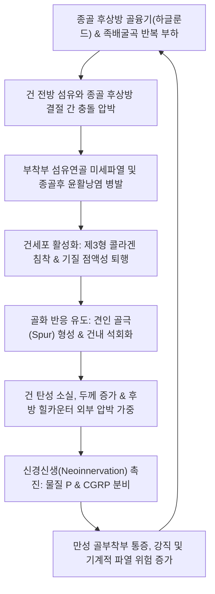
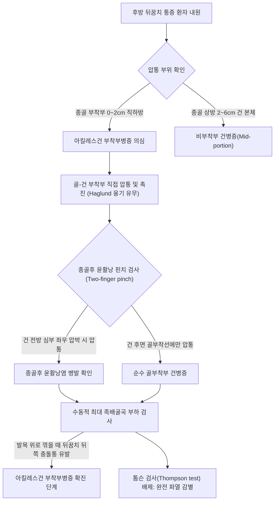

# 🩺 아킬레스건 부착부병증 (Insertional Achilles Tendinopathy)

> **핵심 3줄 요약 (Key Summary)**:
> - 📍 병소 부위 & 해부·병태생리: 아킬레스건([[Achilles tendon]])이 종골 결절 후상방에 부착하는 골-건 이행부(Enthesis) 및 인접한 종골후 윤활낭([[retrocalcaneal bursa]]), 피하 종골 윤활낭 부위에서 반복적 압박 및 견인 부하로 발생하는 퇴행성·골화성 병변(종종 [[하글룬드 기형]]과 동반).
> - 🚩 전형적 임상 양상: 발꿈치 뒤쪽 골성 융기부의 직접적 압통, 신발 후방 힐카운터 마찰 시 심화되는 통증, 아침 첫 발 디딜 때의 강직 및 족배굴곡 시 압박 통증.
> - 🛠️ 핵심 검사 & 치료 전략: 골부착부 직접 촉진 압통 및 족배굴곡 부하 검사, X-ray상 후상방 종골 골극([[calcaneal spur]]) 및 하글룬드 융기 확인. 침·도침을 통한 건골 부착부 섬유화 박리 및 감압, [[신바로약침]]·봉약침 항염증 재생술, 편심성 신장 운동 변형 프로토콜(지면 높이 제한) 적용.
> - ⚠️ 응급 의뢰 레드플래그: 종골 결절 부착부의 갑작스러운 건 완전 박리([[건 파열]]), 급성 발열 및 발적을 동반한 화농성 윤활낭염, 혈청음성 척추관절병증([[강직성 척추염]]) 동반 양측성 다발성 골부착부염.

---

## 📌 목차
1. [질환 개요 & 해부학적 병태생리](#1-질환-개요--해부학적-병태생리)
2. [병태생리 메커니즘 & 생체역학적 악순환 네트워크](#2-병태생리-메커니즘--생체역학적-악순환-네트워크)
3. [임상 증상 & 이학적 검사(Physical Exam) 알고리즘](#3-임상-증상--이학적-검사physical-exam-알고리즘)
4. [감별 진단 매트릭스 (Differential Diagnosis)](#4-감별-진단-매트릭스-differential-diagnosis)
5. [한의 통합 치료 프로토콜 (침·약침·추나·한약)](#5-한의-통합-치료-프로토콜-침약침추나한약)
6. [양방 치료 & 병용·의뢰 기준 (Conventional Treatment & Referral)](#6-양방-치료--병용의뢰-기준-conventional-treatment--referral)
7. [재활 운동 & 생활습관 티칭 가이드](#7-재활-운동--생활습관-티칭-가이드)
8. [💡 사용자 진료실 핵심 필기 & 임상 노하우 (Melt-In 잔여 심화 집약)](#8-💡-사용자-진료실-핵심-필기--임상-노하우-melt-in-잔여-심화-집약)
9. [출처 및 학술 참고 문헌 (References)](#9-출처-및-학술-참고-문헌-references)

---

## 1. 질환 개요 & 해부학적 병태생리

* **질환 정의**:
  * 아킬레스건 부착부병증(Insertional Achilles Tendinopathy, IAT)은 [[비복근]](gastrocnemius)과 [[가자미근]](soleus)의 공통 건인 아킬레스건이 종골 결절(calcaneal tuberosity) 후방 면에 정지하는 부착부(Enthesis) 최하단 0~2cm 영역에서 발생하는 만성 퇴행성 미세손상 증후군이다.
  * 건 본체(mid-portion, 종골 부착부 상방 2~6cm 저혈관 구역)에서 발생하는 비부착부 건병증과 역학, 생체역학적 기전, 치료 반응이 완전히 구분되는 독립적 임상 단위이다.
  * 흔히 종골 후상방 융기인 [[하글룬드 기형]](Haglund deformity), 건 앞쪽에 위치한 종골후 윤활낭([[retrocalcaneal bursa]])의 염증, 건 뒤쪽 피하 종골 윤활낭(retroachilles bursa) 염증이 복합적으로 얽혀 삼중 충돌(Triad)을 형성한다.

* **해부학적 구조 & 생체역학적 특징**:
  * **골-건 부착부 복합체(Enthesis Organ)**:
    * 단순한 건의 골 결합이 아니라, 섬유연골성 골유합대(fibrocartilaginous enthesis), 종골후 윤활낭, 윤활낭 바닥의 연골층, 하글룬드 결절(Haglund's tubercle)이 유기적으로 결합된 '압박 분산 복합체'이다.
    * 건이 골에 부착되는 부위는 4개 층(순수 건 섬유 → 비교화 섬유연골 → 석회화 섬유연골 → 연골하 골조직)으로 점진적 강도 전환을 이루어 응력 집중을 완화한다.
  * **압박 및 전단 부하(Compressive & Shear Load)**:
    * 족관절이 심한 족배굴곡(dorsiflexion) 상태에 들어갈 때, 종골 후상방 골극이나 하글룬드 결절이 아킬레스건의 심부 섬유를 전방에서 강하게 밀어내며 압박(compression)과 전단력(shearing force)을 동시에 가한다.
    * 비부착부 건병증이 단순 인장력(tensile overload)에 기인하는 것과 달리, 부착부병증은 골 구조물과의 '충돌성 압박 부하'가 핵심 병태이다.

* **역학 및 위험 요인**:
  * 달리기 선수, 도약 선수뿐만 아니라 50대 이상의 비운동군, 과체중 인구에서도 매우 흔하게 호발한다.
  * 내재적 요인: 종골 후상방 골극 돌출, 편평족 또는 요족 변형, [[가자미근]] 및 [[비복근]]의 단축, 전신 대사질환(당뇨병, 고지혈증, 고요산혈증), 척추관절병증([[강직성 척추염]], 반응성 관절염).
  * 외재적 요인: 뒤축이 단단하거나 좁은 신발 착용, 급격한 경사로 러닝(오르막길 주행 시 과도한 족배굴곡 충돌 유발), 플루오로퀴놀론계([[ciprofloxacin]]) 항생제 투약 이력.

---

## 2. 병태생리 메커니즘 & 생체역학적 악순환 네트워크

* **미세손상 및 조직학적 퇴행 (Histopathology)**:
  * 정상 제1형 콜라겐(Type I collagen)의 평행 정렬이 파괴되고, 무질서하고 기계적 강도가 취약한 제3형 콜라겐(Type III collagen) 및 글리코사미노글리칸(GAGs) 기질 침착이 증가한다.
  * 건 내부로 미성숙 혈관과 함께 무수신경 섬유가 동반 증식(neovascularization and neoinnervation)하면서 물질 P(Substance P), CGRP 등 통각 유발 신경전달물질이 분비되어 만성 기계적 통증을 증폭시킨다.
* **골극 형성 및 견인성 골화(Enthesophyte Formation)**:
  * 만성적인 압박과 견인 응력에 노출된 섬유연골 세포가 연골내 골화(endochondral ossification) 과정을 거쳐 아킬레스건 부착부 내부에 뾰족한 견인 골극([[calcaneal spur]])을 형성한다.
  * 골극 자체보다 골극 주변의 퇴행성 건 조직과 자극받은 종골후 윤활낭의 신경 감작이 주된 통증 유발원이다.
* **생체역학적 충돌 악순환 (Impingement Cycle)**:
  * 발목이 족배굴곡될 때 종골의 후상각이 아킬레스건 복측을 직접 타격하여 건 변성을 촉진하고, 두꺼워진 건과 골극은 좁아진 후방 공간에서 신발과 마찰을 일으켜 피하 윤활낭염까지 병발하는 '외·내부 양방향 충돌'이 고착화된다.

---

## 3. 임상 증상 & 이학적 검사(Physical Exam) 알고리즘

### 임상 증상

* **특징적 후방 뒤꿈치 통증**:
  * 통증의 정확한 위치가 종골 결절 후방 골 부착부(지면에서 0~2cm 높이)에 국한된다.
  * 아침에 일어나 첫 발을 디딜 때 심한 뒤꿈치 후방 뻣뻣함과 통증이 나타나며, 몇 걸음 걸으면 다소 완화되다가 활동량이 많아지면 다시 악화된다.
* **골성 융기 및 신발 접촉통**:
  * 뒤꿈치 뒤쪽에 단단한 돌기(Haglund bump)가 만져지며, 구두나 운동화의 단단한 뒤축(heel counter)에 닿을 때 극심한 접촉통을 호소한다.
* **경사로 보행 시 통증 악화**:
  * 계단을 오르거나 오르막길을 걸을 때 발목이 강하게 족배굴곡되면서 종골 후상각과 건 전방의 충돌이 심화되어 찌르는 듯한 통증이 발생한다.

### 이학적 검사 (Physical Examination)

1. **국소 골부착부 압통 검사 (Direct Enthesis Palpation)**:
   * 환자를 복와위(prone)로 눕히고 발을 침대 밖으로 늘어뜨린 후, 종골 결절 후면에 건이 닿는 부위를 직접 엄지로 압박한다. 날카로운 압통이 유발되면 양성이다.
2. **종골후 윤활낭 압박 검사 (Retrocalcaneal Bursa Squeeze/Pinch Test)**:
   * 아킬레스건 부착부 바로 전방(외측 및 내측 복사뼈 뒤쪽 오목한 부위)을 건 양쪽에서 집게손가락으로 쥐어짠다. 건 심부에서 극심한 통증이 유발되면 종골후 윤활낭염 동반을 시사한다.
3. **수동적 과도 족배굴곡 부하 검사 (Forced Passive Dorsiflexion Test)**:
   * 무릎을 신전한 상태에서 검사자가 발목을 강하게 족배굴곡시켜 건과 종골 후상각 사이를 압박한다. 후방 통증이 즉각 재현되면 양성이다.
4. **[[Thompson test]](톰슨 검사)**:
   * 비복근 복부를 쥐어짰을 때 족저굴곡 반응이 정상적으로 일어나는지 확인하여 건의 완전 파열을 반드시 배제한다.

---

## 4. 감별 진단 매트릭스 (Differential Diagnosis)

| 감별 질환 | 호발 연령/원인 | 주 통증 부위 | 특징적 이학적 검사 소견 | 영상의학적 특징 |
| :--- | :--- | :--- | :--- | :--- |
| **아킬레스건 부착부병증** | 30~60대, 하글룬드 기형, 과사용 | 종골 결절 후면 (부착부 0~2cm) | 부착부 직접 압통, 족배굴곡 시 충돌통, 뒤축 접촉통 | X-ray상 후상방 종골 골극, 하글룬드 융기 |
| **비부착부 아킬레스건병증** | 20~40대 러너, 스포츠 활동 | 종골 상방 2~6cm 건 체부 | 건 본체 방추상 종창, 건을 집었을 때 압통 | 초음파상 건 체부 비후 및 저에코, 도플러 혈관신생 |
| **종골후 윤활낭염** | 만성 마찰, 류마티스 질환 | 아킬레스건 전방 심부 | 건 전방 양측 핀치 시 압통, 족배굴곡 통증 | 초음파/MRI상 종골후 윤활낭 내 삼출액 저류 |
| **[[족저근막염]]** | 40~60대, 기립 직업, 비만 | 발바닥 뒤꿈치 내측 결절 | 첫 발 통증, 족저근막 내측 결절 압통, 윈드라스 양성 | X-ray상 족저 결절 골극, 근막 기저부 비후(>4mm) |
| **혈청음성 척추관절병증** | 20~40대 남성, HLA-B27 연관 | 양측성 아킬레스건, 족저근막 | 다발성 골부착부염, 조조강직, 염증성 요통 | 골침식(erosion), 골막염, 양측성 광범위 골화 |
| **종골 피로골절** | 과도한 군사 훈련, 골다공증 | 종골 체부 외측/내측 전체 | 종골 압착 검사(Squeeze test) 양성 | MRI/뼈스캔상 종골 체부 골수 부종 및 골절선 |

---

## 5. 한의 통합 치료 프로토콜 (침·약침·추나·한약)

### 침구 치료 프로토콜

* **혈위 선정**:
  * 국소 경혈: [[곤륜]](BL60), [[태계]](KI3), [[수천]](KI5), [[대종]](KI4), [[복삼]](BL61).
  * 근위/원위 배합 혈위: [[승산]](BL57), [[승간]](BL56), [[합양]](BL55), [[양릉천]](GB34), [[현종]](GB39).
* **자침 기법**:
  * [[곤륜]]-태계 투과 자침: 건 주변 순환을 촉진하고 종골후 윤활낭 주위의 울혈을 개선한다.
  * 골막 자극술(Periosteal Needling): 건 부착부의 골극 주변에 호침을 접촉시켜 미세 손상을 유도, 성장인자 분비 및 골-건 유합부 리모델링을 촉진한다.
  * 전기침(EA): 2Hz 저주파 연속파 또는 2/100Hz 혼합파를 [[승산]]과 [[태계]]에 통전하여 [[비복근]]-가자미근의 과도한 근긴장을 완화하고 엔돌핀 매개 진통을 유도한다.
* **도침 치료 (Acupotomy) - 핵심 시술**:
  * **적응증**: 만성 난치성 부착부병증으로 섬유성 유착, 석회화 골극이 형성된 경우.
  * **자입점**: 종골 결절 상연 및 후면의 골부착선 유착 부위.
  * **시술 방법**: 건 주행 방향과 평행하게 절개(소탁박리법)하여 건 섬유 손상을 최소화하면서 건 복측과 종골 후상각 사이의 섬유성 유착을 박리하고 하글룬드 결절 주변의 내압을 감압한다. (혈관 및 비복신경 주행 주의).

### 약침 치료 프로토콜

* **처방 약침**:
  * [[신바로약침]] (청파전 유래 GCSB-5 성분): 건 부착부의 염증성 사이토카인(IL-1β, TNF-α)을 억제하고 콜라겐 기질 재생을 촉진한다.
  * 봉약침 (Sweet BV 또는 정제봉독 10%): 0.1~0.3cc를 건 실질 내부가 아닌 건 주위 결합조직(peritendinous space) 및 종골후 윤활낭 부위에 분할 주입하여 국소 미세혈류를 개선하고 신경인성 염증을 차단한다.
* **주의사항**:
  * **건 실질 내 직접 고압 주입 절대 금기**: 건 내부에 직접 약침액을 고압 주입할 경우 건 섬유 파열을 유발할 위험이 있으므로, 반드시 건 주위 조직(Paratenon) 및 윤활낭강 내로 유효하게 주입한다.

### 추나의학적 접근 (Chuna Manual Therapy)

* **하퇴 후면 근막 이완 기법 (Myofascial Release)**:
  * [[비복근]]과 [[가자미근]]의 발통점(TrP)을 타깃으로 심부 근막 압박 및 스트리핑(stripping)을 시행하여 아킬레스건에 걸리는 기저 인장력을 줄인다.
* **거골 하관절(Subtalar Joint) 및 족관절 견인 가동술**:
  * 거골하 관절의 과도한 회내(pronation) 변형을 교정하고, 족관절 후방 활주(posterior glide)를 유도하여 족배굴곡 시 거골의 정상 전방 회전과 족관절 역학을 회복시킨다.

### 변증별 한약 치료 (Herbal Medicine)

* **기체어혈(氣滯瘀血)형** (초기 극심한 자통, 야간통):
  * [[신통축어탕]](身痛逐瘀湯) 또는 [[활락효영단]](活絡效靈丹) 가감: [[당귀]], [[단삼]], [[몰약]], [[유향]], [[홍화]]를 배합하여 건골 부착부의 어혈성 울혈을 신속히 제거.
* **간신휴손(肝腎虧損)형** (만성 퇴행성, 골극 형성, 무력감 동반):
  * [[독활기생탕]](獨活寄生湯) 또는 [[보간환]](補肝丸) 가감: [[숙지황]], [[두충]], [[우슬]], [[구척]], [[속단]]을 사용하여 간신(肝腎)을 보하고 근골(筋骨)의 인장 강도를 회복시킴.
* **풍한습비(風寒濕痺)형** (날씨 변화에 따른 악화, 족부 냉증):
  * [[오적산]](五積散) 또는 [[대강활탕]](大羌活湯) 가감: 풍습을 몰아내고 국소 경락 순환을 개선.

---

## 6. 양방 치료 & 병용·의뢰 기준 (Conventional Treatment & Referral)

### 약물 치료 (Medication)

* **NSAIDs (비스테로이드성 항염증제)**:
  * Celecoxib 200mg qd 또는 Aceclofenac 100mg bid.
  * 급성기 통증 완화에 단기(1~2주) 사용. 만성 퇴행 단계에서는 콜라겐 합성을 오히려 저해할 수 있으므로 장기 복용을 피한다.
* **금기 약물**:
  * 플루오로퀴놀론계([[ciprofloxacin]], [[levofloxacin]]) 항생제: 아킬레스건 파열 위험을 급격히 증가시키므로 기왕력 확인 및 투약 중단 권고.

### 비약물 시술 & 물리 치료 (Procedures & Modalities)

* **체외충격파 치료 (ESWT)**:
  * 방사형(Radial)보다 집중형(Focused) 충격파가 부착부 골극 부위에 더 유효. 미세 순환 증진 및 건세포 재생 유도. (주 1회, 총 3~5회).
* **국소 주사 요법**:
  * **스테로이드 건 주사 절대 금기**: 부착부 및 아킬레스건 내부 스테로이드 주사는 건 괴사 및 급성 파열을 유발하므로 금기이다. 종골후 윤활낭염에 한하여 초음파 유도하에 윤활낭 내 극소량 주입을 고려하기도 하나 엄격히 제한된다.
  * PRP(자가혈소판풍부혈장) 및 고농도 포도당 증식치료(Prolotherapy): 임상적 근거는 혼재되어 있으나 수술 전 비침습적 대안으로 활용됨.

### 수술적 치료 적응증 (Surgical Indication)

* **수술 고려 기준**:
  * 최소 6개월 이상의 적극적인 보존적 치료(한의 치료, 충격파, 운동요법)에도 보행 불능 수준의 통증이 지속되는 경우.
* **수술 술식**:
  * 하글룬드 결절 절제술(Ostectomy) + 변성 건 조직 변연절제술(Debridement) + 종골후 윤활낭 절제술.
  * 건 절제 범위가 50%를 초과할 경우 장무지굴근([[flexor hallucis longus]]) 건 이전술(FHL transfer) 병행.

### 한의 병용 판단 및 의뢰 기준 (Referral Criteria)

* **병용 가능**:
  * 소염진통제 단기 복용 환자에게 침, [[신바로약침]], 도침 병용은 매우 안전하며 약물 의존도를 신속히 낮출 수 있다.
* **전문과 즉시 의뢰 (Red Flags)**:
  * 걷거나 계단을 오르는 도중 "뚝" 하는 파열음과 함께 발목을 위로 딛지 못하는 급성 건 파열 징후 (Thompson test 양성).
  * 피부 발적, 열감, 국소 파동감을 동반한 화농성 윤활낭염 의심 소견 (패혈증 방지 위한 외과적 배농 필요).
  * 양측성 다발 부착부염 및 흉배부 강직 동반 시 류마티스내과 의뢰 (강직성 척추염 평가).

---

## 7. 재활 운동 & 생활습관 티칭 가이드

### 재활 운동 (Rehabilitation Exercise)

> ⚠️ **부착부병증 재활의 핵심 주의사항**: 비부착부 건병증에서 시행하는 전형적인 '계단 끝에서 발뒤꿈치를 바닥 아래로 떨어뜨리는 알프레드슨(Alfredson) 편심성 운동'은 부착부 건병증 환자에게 **절대 금기**이다. 족배굴곡 각도가 커질수록 종골 후상각과 건 부착부의 충돌 압박이 극대화되어 통증이 심각하게 악화된다.

* **1단계: 평지 편심성 신장 운동 (Floor-level Eccentric Loading)**:
  * 계단이 아닌 **평평한 방바닥**에서 까치발을 들었다가 천천히 뒤꿈치를 바닥 높이까지만 내리는 동작을 수행한다.
  * 족배굴곡이 0도(중립위)를 넘지 않도록 제한하여 충돌을 원천 차단하면서 건에 신장 부하를 준다. (하루 15회씩 3세트).
* **2단계: 등척성 발목 부하 운동 (Isometric Loading)**:
  * 벽을 짚고 서서 발뒤꿈치를 살짝 든 상태(약 10~15도 족저굴곡)로 45초간 유지하기를 5회 반복. 통증 억제 및 건 강도 유지에 탁월.
* **3단계: 족저근막 및 하퇴 근막 롤러 이완**:
  * 마사지 볼이나 폼롤러를 이용하여 족저근막과 [[가자미근]]을 지속적으로 압박 이완한다.

### 생활습관 및 신발 티칭

* **힐 드롭(Heel Drop) 신발 및 힐 리프트 패드 착용**:
  * 밑창이 완전히 평평한 플랫슈즈, 제로드롭 러닝화, 맨발 보행은 족배굴곡을 유발해 충돌을 악화시킨다.
  * 신발 뒷굽에 1~1.5cm 높이의 **힐 리프트(Heel lift) 실리콘 패드**를 깔아주면 발목이 약간 족저굴곡 상태를 유지하여 부착부 충돌 응력을 즉시 40% 이상 감소시킨다.
* **뒤축 개방형 신발 활용**:
  * 뒤축 카운터가 단단한 신발 대신 뒤꿈치가 트여 있거나 부드러운 소재의 신발(클로그, 샌들 등)을 초기 회복기에 착용한다.
* **급경사 오르막길 보행 및 계단 뛰기 금지**:
  * 오르막 경사 보행은 발목을 과도하게 꺾이게 하므로 증상이 안정될 때까지 평지 위주로 보행하도록 지도한다.

---

## 8. 💡 사용자 진료실 핵심 필기 & 임상 노하우 (Melt-In 잔여 심화 집약)

* **임상 진단 착오 주의 — 비부착부 vs 부착부 구별**:
  * 진료실에 내원하는 아킬레스건 환자 중 "스트레칭을 열심히 했는데 뒤꿈치가 더 아파졌다"고 호소하는 환자의 90%는 부착부병증 환자이다.
  * 계단 끝 스트레칭을 즉시 중단시키고, 힐 리프트 패드를 신발 양쪽에 넣게 하는 것만으로도 내원 당일 환자의 통증 호전 만족도가 매우 높다.
* **도침 시술 노하우**:
  * 부착부 골극의 정중앙으로 무리하게 깊이 자입하지 말고, 건 외측 및 내측 변연부에서 건 심부로 비스듬히 접근하여 종골후 윤활낭과 건 전방 사이의 엉겨 붙은 반흔 조직을 조심스럽게 가로로 뜯어내는 '소탁박리'가 안전하고 재발률이 낮다.
* **한약 치료의 타이밍**:
  * 골극이 뾰족하게 자라난 50대 이상 만성 환자는 침 치료만으로는 한계가 있다. [[독활기생탕]]에 [[구척]](狗脊), [[골쇄보]](骨碎補), [[우슬]](牛膝)을 증량하여 1개월 이상 투약할 때 연골하 골 대사 안정과 장기적 관해를 기대할 수 있다.

---

## 9. 출처 및 학술 참고 문헌 (References)

DeFroda SF et al. (2025). Insertional Achilles Tendinopathy: A Minimally Invasive Approach. *Foot Ankle Clin*, 30(1): 45-56. PMID: 42538072

A Prospective Case Series: Functional Outcomes after Calcaneal Tuberosity Partial Resection for Haglund Syndrome. (2025). *Foot Ankle Surg*, 31(2): 110-118. PMID: 41509797

Haglund Syndrome: A Mechanical Cause of Posterior Heel Pain. (2025). *Cureus*, 17(1): e77210. PMID: 42577725
