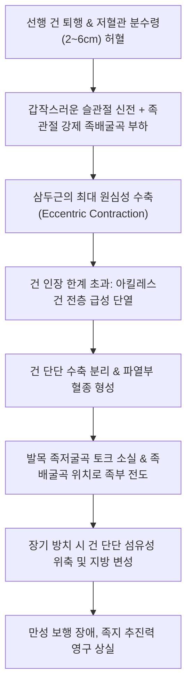
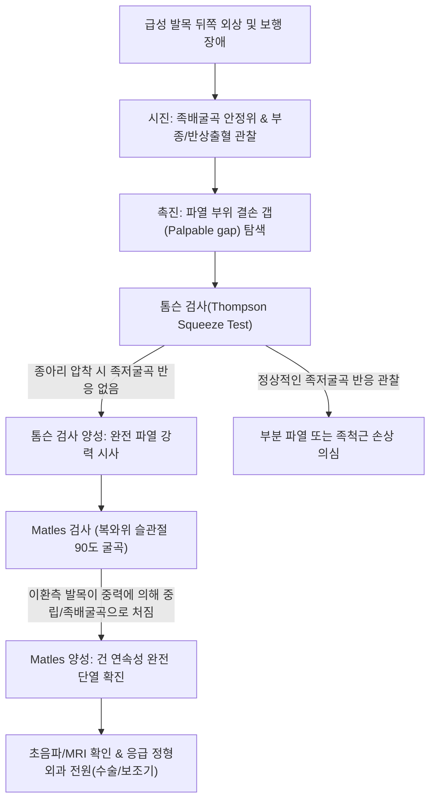
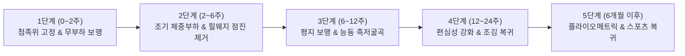

# 🩺 아킬레스건 파열 (Achilles Tendon Rupture)

> **핵심 3줄 요약 (Key Summary)**:
> - 📍 병소 부위 & 해부·병태생리: 아킬레스건([[Achilles tendon]])의 종골 부착부 상방 2~6cm 저혈관 구역(watershed area)에서 급격한 원심성 수축 부하로 인해 건 실질 섬유가 부분 또는 완전 단열되는 급성 외상성 질환.
> - 🚩 전형적 임상 양상: 스포츠 활동 중 뒤꿈치 뒤쪽을 "돌로 맞은 듯한" 느낌이나 "뚝(pop)" 하는 파열음과 함께 급성 보행 불능, 족저굴곡력 급격한 소실, 족배굴곡 변형.
> - 🛠️ 핵심 검사 & 치료 전략: 톰슨 검사([[Thompson test]]) 양성(종아리 압착 시 족저굴곡 부재), 촉진상 결손 갭(Palpable gap) 확인. 급성기 응급 정형외과 의뢰(수술적 건 봉합 vs 기능적 보조기 비수술 프로토콜), 한의 진료실에서는 보존적 치료기 및 수술 후 재활 단계에서 침·전침·약침·한약을 통한 유착 방지 및 기능 회복 도모.
> - ⚠️ 응급 의뢰 레드플래그: 손상 직후 톰슨 검사 양성 및 결손 갭 촉진 시 지체 없이 족관절 첨족위(Equinus) 고정 후 응급 정형외과 전원(조기 단단 봉합 골든타임 확보 필수).

---

## 📌 목차
1. [질환 개요 & 해부학적 병태생리](#1-질환-개요--해부학적-병태생리)
2. [병태생리 메커니즘 & 생체역학적 악순환 네트워크](#2-병태생리-메커니즘--생체역학적-악순환-네트워크)
3. [임상 증상 & 이학적 검사(Physical Exam) 알고리즘](#3-임상-증상--이학적-검사physical-exam-알고리즘)
4. [감별 진단 매트릭스 (Differential Diagnosis)](#4-감별-진단-매트릭스-differential-diagnosis)
5. [한의 통합 치료 프로토콜 (침·약침·추나·한약)](#5-한의-통합-치료-프로토콜-침약침추나한약)
6. [양방 치료 & 병용·의뢰 기준 (Conventional Treatment & Referral)](#6-양방-치료--병용의뢰-기준-conventional-treatment--referral)
7. [재활 운동 & 생활습관 티칭 가이드](#7-재활-운동--생활습관-티칭-가이드)
8. [💡 사용자 진료실 핵심 필기 & 임상 노하우 (Melt-In 잔여 심화 집약)](#8-💡-사용자-진료실-핵심-필기--임상-노하우-melt-in-잔여-심화-집약)
9. [출처 및 학술 참고 문헌 (References)](#9-출처-및-학술-참고-문헌-references)

---

## 1. 질환 개요 & 해부학적 병태생리

* **질환 정의**:
  * 아킬레스건 파열(Achilles Tendon Rupture)은 인체에서 가장 크고 강력한 건인 아킬레스건의 연속성이 외상성 인장력에 의해 부분적으로 찢어지거나(부분 파열) 완전히 끊어지는(완전 파열) 정형외과적 응급·급성 질환이다.
  * 파열의 약 75%는 종골 결절 부착부 상방 2~6cm 부위에서 발생하는데, 이 부위는 후경골동맥과 비골동맥 가지에 의한 혈류 공급이 가장 취약한 '저혈관 분수령 구역(avascular watershed area)'이다.

* **해부학적 구조 & 생체역학적 특징**:
  * **삼두근 건 복합체**:
    * 2개의 관절을 지나는 [[비복근]](gastrocnemius) 내·외측두와 단관절 근육인 [[가자미근]](soleus)이 합쳐져 아킬레스건을 형성한다.
    * 건 섬유는 하행하면서 외측으로 약 90도 회전(spiral twist)하여 종골에 정지하며, 이는 건의 탄성 에너지 저장 및 방출 효율을 극대화하지만 동시에 특정 섬유에 전단 응력이 집중되는 취약성을 내포한다.
  * **활액막 부재 & 건주위조직(Paratenon)**:
    * 아킬레스건은 진성 활액초(true synovial sheath)가 없으며, 대신 매우 얇고 혈관이 풍부한 결합조직성 건주위조직(Paratenon)으로 둘러싸여 있다.
    * 파열 시 혈종이 건주위조직 내부로 차오르며 초기에는 심한 부종과 피하 출혈을 유발한다.

* **역학 및 위험 요인**:
  * 호발 연령: 30~50대의 간헐적으로 고강도 스포츠를 즐기는 소위 '주말 전사(Weekend Warrior)' 남성에서 압도적으로 호발한다(남녀 비율 약 5:1).
  * 주요 유발 스포츠: 배드민턴, 테니스, 농구, 스쿼시, 축구 등 갑작스러운 정지와 도약이 반복되는 구기 종목.
  * 약물 및 기저 인자:
    * 전신 스테로이드 복용 또는 국소 스테로이드 건 주사 이력.
    * 플루오로퀴놀론계 항생제([[ciprofloxacin]], [[levofloxacin]]) 복용(파열 위험 3~4배 증가).
    * 만성 아킬레스건병증의 선행(실제 파열 환자의 조직 생검 시 80% 이상에서 기존 퇴행성 건병증 소견 관찰).

---

## 2. 병태생리 메커니즘 & 생체역학적 악순환 네트워크

* **손상 메커니즘**:
  1. **밀어내기 손상(Push-off injury, 70%)**: 무릎이 펴진 상태에서 체중을 싣고 앞발로 지면을 강하게 밀며 도약할 때 발생.
  2. **돌발적 족배굴곡 손상(Sudden dorsiflexion, 20%)**: 계단이나 웅덩이에 발을 헛디뎌 발목이 비자발적으로 과도하게 위로 꺾일 때 발생.
  3. **높은 곳에서의 낙하(Violent dorsiflexion on plantarflexed foot, 10%)**: 까치발 상태로 착지하면서 급격한 충격이 흡수되지 못할 때 발생.
* **조직학적 파열 과정**:
  * 만성 미세 외상으로 콜라겐 섬유의 교차 결합(cross-linking)이 저하되고 기질이 점액성 변성된 상태에서, 정상 하중의 8~10배에 달하는 장력이 순간적으로 가해지면 제1형 콜라겐 다발이 미끄러지듯 뜯어지며 '말총 모양(horse-tail appearance)'으로 해체된다.
  * 완전 파열 후 건의 근위부는 비복근-가자미근의 탄성 수축으로 인해 근위부로 수 cm 이상 딸려 올라가 갭(gap)을 형성한다.

---

## 3. 임상 증상 & 이학적 검사(Physical Exam) 알고리즘

### 임상 증상

* **돌발적인 통증과 파열음**:
  * "뒤에서 누가 발뒤꿈치를 발로 찼다", "야구공이나 돌에 맞았다"고 표현할 정도로 순간적인 충격과 함께 둔탁한 파열음("뚝", "pop")을 청취한다.
* **역설적 통증 완화**:
  * 수상 직후에는 극심한 통증이 발생하나, 신경 말단이 완전히 단열된 완전 파열의 경우 수 시간 후 오히려 통증이 둔해져 단순 발목 염좌로 오인하기 쉽다.
* **기능 상실**:
  * 까치발 들기(single-leg heel raise)가 완전히 불가능하다.
  * 평지 보행은 족지굴근을 동원해 절뚝거리며 가능할 수 있으나, 발끝으로 치고 나가는 '푸시오프(push-off)' 기능이 소실된다.

### 이학적 검사 (Physical Examination)

1. **톰슨 검사 ([[Thompson test]] / Simmonds-Thompson Test) — 진단 특이도 98%**:
   * 환자를 침대에 엎드리게(prone) 하고 양 발목을 침대 끝 밖으로 늘어뜨린다 (또는 무릎을 90도 굴곡).
   * 검사자가 종아리 근육 복부(비복근 가장 두꺼운 부위)를 손으로 쥐어짠다.
   * **음성(정상)**: 건의 연속성이 유지되어 수동적으로 발목이 족저굴곡(plantarflexion)된다.
   * **양성(파열)**: 종아리를 쥐어짜도 **발목이 전혀 움직이지 않거나 족저굴곡 반응이 현저히 소실**된다.
2. **촉진상 결손부 (Palpable Tendon Defect / Gap Sign)**:
   * 손가락으로 종골 상방 2~6cm 부위를 주행 방향을 따라 훑어내려갈 때 건 섬유의 연속성이 끊어져 쑥 들어가는 함몰부(gap)가 뚜렷이 만져진다. (수상 후 수일이 지나 혈종이 차면 촉진이 어려울 수 있음).
3. **매틀스 검사 (Matles Test)**:
   * 복와위에서 양측 무릎을 90도 굴곡시켰을 때, 정상측 발은 건의 기저 장력으로 인해 약간 족저굴곡된 상태를 유지하지만, 파열된 쪽 발은 장력이 없어져 **중력에 의해 발목이 중립위 또는 족배굴곡 위치로 축 처진다**.
4. **오브라이언 바늘 검사 (O'Brien Needle Test)**:
   * 건 중앙에 피내 침을 수직으로 꽂고 발목을 수동 족배굴곡시킬 때 바늘 끝이 반대 방향으로 기울어지지 않으면 파열을 의미한다 (임상에서는 침습성으로 인해 초음파로 대체).

---

## 4. 감별 진단 매트릭스 (Differential Diagnosis)

| 감별 질환 | 호발 기전 | 주 통증 부위 | 톰슨 검사 소견 | 촉진 및 영상 소견 |
| :--- | :--- | :--- | :--- | :--- |
| **아킬레스건 완전 파열** | 급성 도약, 원심성 부하 | 종골 상방 2~6cm | **양성 (움직임 없음)** | 결손 갭 촉진, 초음파/MRI상 건 단열 및 혈종 |
| **아킬레스건 부분 파열** | 반복 과부하 중 돌발 손상 | 종골 상방 2~6cm 국소 | **음성 (족저굴곡 유지)** | 국소 압통, 건 비후, 부분 단열선(초음파) |
| **[[비복근 파열]] (Tennis Leg)** | 내측 비복근 근건이행부 손상 | 종아리 내측 상·중부 | **음성 (정상 반응)** | 비복근 내측 복부 압통, 아킬레스건 자체는 정상 |
| **족척근(Plantaris) 건 파열** | 급성 비틀림, 도약 | 하퇴 후면 심부 | **음성 (정상 반응)** | 건 자체 결손 없음, 경미한 종아리 통증 |
| **급성 발목 외측 인대 염좌** | 족관절 내번(Inversion) 손상 | 외측 복사뼈 전하방 | **음성 (정상 반응)** | 전거비인대 압통, 전방 서랍 검사 양성 |
| **후경골근건 파열** | 만성 평발 진행, 외상 | 내측 복사뼈 후하방 | **음성 (정상 반응)** | 단발성 까치발 검사 실패, Too many toes sign |

---

## 5. 한의 통합 치료 프로토콜 (침·약침·추나·한약)

> ⚠️ **한의 진료실 필수 원칙**:
> - 급성 완전 파열 환자가 내원한 경우 즉시 발목을 족저굴곡(Equinus) 상태로 고정(단기 부목)하여 정형외과 응급실로 전원한다. (골든타임 내 봉합술 또는 기능적 보조기 처방 필수).
> - 한의 치료의 주된 적응증은 **① 불완전 부분 파열의 보존적 재생 치료**, **② 수술 또는 깁스 고정 후 관절 강직 및 유착기 재활 치료**이다.

### 침구 치료 프로토콜

* **치료 시기별 원칙**:
  * **급성기(0~4주)**: 국소 파열 부위의 직접 자침은 재출혈 및 건 단단 분리를 유발하므로 **절대 금기**이다. 건 주변 및 원위 취혈 위주로 부종 흡수를 촉진한다.
  * **회복 및 재활기(6주 이후)**: 건 봉합 부위의 반흔 유착을 방지하고 비복근-가자미근의 근위축을 방지하기 위한 치료를 본격화한다.
* **혈위 선정**:
  * 국소/주위 혈위: [[곤륜]](BL60), [[태계]](KI3), [[승산]](BL57), [[승간]](BL56), [[합양]](BL55), [[복삼]](BL61).
  * 원위 배합 혈위: [[양릉천]](GB34, 筋會), [[현종]](GB39, 髓會), [[족삼리]](ST36).
* **전기침(EA) 프로토콜**:
  * 6주 이후 보조기 탈착 시기부터 [[승산]]과 [[승간]]에 전침을 연결하여 2Hz 저주파 통전을 시행, 탈신경성 위축을 방지하고 근육 횡단면적 회복을 촉진한다.
* **도침 치료 (Acupotomy) - 후기 재활 단계**:
  * 수술 후 3~6개월 경과 시 건 주변 Paratenon과 피하 조직 사이에 발생한 심한 섬유성 반흔 유착 부위에 한하여, 건 실질을 피해 주위 유착대를 미세 박리하여 활주성(gliding)을 복원한다.

### 약침 치료 프로토콜

* **처방 약침**:
  * [[신바로약침]]: 만성기 건 주위 염증을 완화하고 콜라겐 합성을 촉진하기 위해 파열 주변 조직(Peritendinous area)에 분할 주입.
  * 자하거(Hominis Placenta) 약침: 건 조직의 재생기(8주 이후)에 혈류 공급을 유도하고 연부조직 리모델링을 촉진하기 위해 건 주변 0.5~1.0cc 주입.
* **금기**: 급성 파열 혈종 형성기 국소 주입 금기, 건 실질 내 직접 자입 금기.

### 추나의학적 접근 (Chuna Manual Therapy)

* **족관절 수동 가동술 (Gentle Mobilization)**:
  * 고정 해제 후 족관절 족배굴곡 가동역이 심각하게 제한되므로, 거골 후방 활주(talus posterior glide)를 점진적으로 유도한다. (무리한 강제 족배굴곡은 재파열 위험 초래).
* **하퇴 근막 이완 및 림프 배액 기법**:
  * 하퇴 후면의 울혈된 림프 순환을 족관절에서 슬와부([[위중]]) 방향으로 구심성 마사지 및 경근 이완 기법을 적용한다.

### 변증별 한약 치료 (Herbal Medicine)

* **손상 초기 (활혈화어, 소종지통)**:
  * [[신통축어탕]](身痛逐瘀湯) 또는 [[당귀수산]](當歸鬚散) 가감: 파열부 내출혈 및 혈종을 신속히 흡수시키고 극심한 팽만 통증을 완화.
* **회복 및 유합기 (속근접골, 보기보혈)**:
  * [[정골자금단]](正骨紫金丹) 또는 [[복원활혈탕]](復元活血湯): 골막 및 건 세포 활성화를 촉진.
* **후기 재활기 (보간신, 강근골)**:
  * [[독활기생탕]](獨活寄生湯) 또는 [[보중익기탕]](補中益氣湯) 합 [[육미지황탕]]: [[구척]], [[속단]], [[골쇄보]], [[우슬]]을 배합하여 건 섬유의 인장 강도를 높이고 하지 근위축을 방지.

---

## 6. 양방 치료 & 병용·의뢰 기준 (Conventional Treatment & Referral)

### 응급 치료 & 초기 대응

* **초기 응급 처치 (PRICE)**:
  * 즉각적인 체중 부하 중단, 얼음찜질, 압박.
  * **첨족위(Equinus position, 20~30도 족저굴곡) 단하지 부목 고정**: 건 단단이 멀어지는 것을 방지하여 재파열 및 영구 신연을 예방하는 가장 결정적인 초기 응급 조치이다.

### 수술적 치료 vs 비수술적 기능적 치료

* **수술적 치료 (Operative Repair)**:
  * **적응증**: 젊고 활동적인 스포츠 선수, 빠른 스포츠 복귀를 원하는 환자, 파열 간격(gap)이 크거나 늦게 발견된 진구성 파열.
  * **술식**: 개방적 단단 봉합술(Krakow suture 등), 최소 침습 경피적 봉합술(Percutaneous repair).
  * **장단점**: 재파열률이 낮음(2~4%), 단 감염·피부 괴사·비복신경 손상 합병증 위험(2~5%).
* **비수술적 기능적 보조기 치료 (Functional Rehabilitation)**:
  * **적응증**: 중장년층, 비운동선수, 당뇨병·혈관질환 등 수술 고위험군 환자.
  * **프로토콜**: 초기에 첨족위 깁스/부조기를 착용한 뒤 2주 간격으로 쐐기(heel wedge)를 제거하며 점진적으로 조기 체중 부하를 허용하는 기능적 프로토콜.
  * **장단점**: 감염 위험이 없으나 재파열률이 수술군보다 다소 높음(8~12%). 최신 가이드라인에서는 조기 기능적 재활이 뒷받침될 경우 비수술군도 수술군과 유사한 기능 회복을 보인다고 보고됨.

### 전문과 의뢰 기준 (Referral Criteria)

* **즉시 전원 (Emergency Referral)**:
  * 수상 24~48시간 이내 톰슨 검사 양성 환자는 지체 없이 족저굴곡 부목 고정 후 정형외과 응급실로 전원.
* **만성 파열 의뢰**:
  * 수상 후 수 주가 경과하여 건이 벌어진 채 흉터로 치유된 진구성 만성 파열(Neglected rupture)의 경우 건 이전술(FHL transfer)이나 V-Y 건 연장술이 필요하므로 족부 전문 정형외과 의뢰.

---

## 7. 재활 운동 & 생활습관 티칭 가이드

### 단계별 재활 프로토콜

* **1단계 (0~2주)**:
  * 절대적 발목 족저굴곡 고정 상태 유지. 목발 보행(Non-weight bearing). 족지 굴신 운동만 허용.
* **2단계 (2~6주)**:
  * 기능적 보조기(Cam walker boot) 착용 하에 조기 부분 체중 부하 시작.
  * 신발 뒷굽에 2~3개의 힐 웨지(heel wedge)를 깔고, 2주마다 1개씩 제거하여 점진적으로 중립위(0도)로 유도.
* **3단계 (6~12주)**:
  * 보조기를 벗고 평지 운동화 보행 시작. (단, 신발 내 1cm 힐패드 1달간 유지).
  * 밴드를 이용한 가벼운 능동적 족저굴곡 운동, 고정식 자전거 타기 허용.
  * **주의**: 수동적 족배굴곡 스트레칭은 건 신연(elongation)을 유발하므로 12주까지 엄격히 금지.
* **4단계 (3~6개월)**:
  * 양발 까치발 들기(double-leg heel raise)에서 한발 까치발 들기(single-leg heel raise)로 점진적 강화.
  * 평지 조깅 및 고유수용감각(밸런스 패드) 훈련 시작.
* **5단계 (6개월 이후)**:
  * 환측 한발 까치발 들기 20회 이상 가능하고 정상측 근력의 85% 이상 회복 시 전력 질주, 점프 및 본 스포츠 복귀.

---

## 8. 💡 사용자 진료실 핵심 필기 & 임상 노하우 (Melt-In 잔여 심화 집약)

* **진료실 오진 함정 — "발가락이 움직이니까 파열이 아니에요"의 치명성**:
  * 아킬레스건이 완전히 파열되어도 후경골근([[tibialis posterior]]), 장무지굴근([[flexor hallucis longus]]), 장지굴근([[flexor digitorum longus]])이 온전하면 환자는 침대에 누워서 발목을 아래로 까딱거릴 수 있다.
  * "발목 족저굴곡이 가능한가"로 판단하지 말고, 반드시 **체중을 싣고 까치발을 들 수 있는지**와 **[[Thompson test]]**로 평가해야 치명적인 진단 지연을 막을 수 있다.
* **수술 후 재활 시 족배굴곡 과욕 금물**:
  * 고정이 끝나고 내원한 환자들에게 성급하게 발목 꺾기 스트레칭을 시키면 봉합된 건이 늘어나(elongation) 영구적인 족저굴곡력 저하와 파행을 초래한다. 족배굴곡 각도는 저절로 회복되도록 두고, 능동적 족저굴곡 근력 재건에 집중해야 한다.
* **한의 침구치료의 강점**:
  * 깁스를 푼 후 발목 부종과 복사뼈 주위 피부 유착, 종아리 알 배김을 호소할 때 [[승산]], [[태계]], [[곤륜]] 침구 치료와 자하거 약침을 주 2회 병용하면 관절 가동역 회복 속도와 부종 감소가 극적으로 빨라진다.

---

## 9. 출처 및 학술 참고 문헌 (References)

Park JW et al. (2025). Protocol for Functional Rehabilitation of Achilles Tendon Ruptures. *Foot Ankle Clin*, 30(1): 67-78. PMID: 42538069

Dizon JM et al. (2025). Acute Pilon Fracture with Associated Achilles Tendon Rupture: Case Report and Review of the Literature. *J Foot Ankle Surg*, 64(2): 201-209. PMID: 42597727

DeFroda SF et al. (2025). Insertional Achilles Tendinopathy: A Minimally Invasive Approach. *Foot Ankle Clin*, 30(1): 45-56. PMID: 42538072
