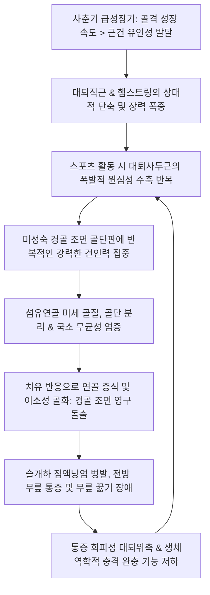
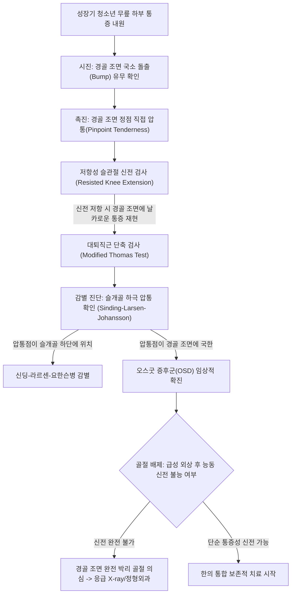
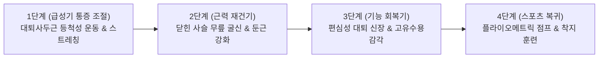

# 🩺 오스굿 증후군 (Osgood-Schlatter Disease, OSD)

> **핵심 3줄 요약 (Key Summary)**:
> - 📍 병소 부위 & 해부·병태생리: 성장기 청소년에서 강력한 [[대퇴사두근]](Quadriceps)의 반복적 수축과 슬개건([[Patellar tendon]])의 견인력으로 인해 아직 골화가 완성되지 않은 [[경골]] 조면(Tibial tuberosity) 골단판(Apophysis)에 발생하는 만성 견인성 골연골염(Traction apophysitis).
> - 🚩 전형적 임상 양상: 10~15세 급성장기 운동 청소년의 경골 조면 국소 돌출, 계단 보행·달리기·점프 시 전방 무릎 하부의 날카로운 통증, 꿇어앉을 때의 직접 접촉통.
> - 🛠️ 핵심 검사 & 치료 전략: 경골 조면의 국소 돌출 및 직접 압통, 저항성 슬관절 신전 시 통증 재현, 측면 X-ray상 경골 조면 골화 중심의 분절화(Fragmentation). [[대퇴직근]] 및 슬괵근([[hamstrings]])의 긴장 완화 침·전침, 건부착부 [[신바로약침]] 항염증 치료, 활동량 조절(Relative rest) 및 편심성 대퇴사두근 재활 프로토콜.
> - ⚠️ 응급 의뢰 레드플래그: 고에너지 점프 착지 후 갑작스러운 경골 조면 견인성 박리 골절(Avulsion fracture, 슬관절 능동 신전 완전 소실), 야간통 및 체중 감소를 동반한 골종양(골육종) 의심 소견.

---

## 📌 목차
1. [질환 개요 & 해부학적 병태생리](#1-질환-개요--해부학적-병태생리)
2. [병태생리 메커니즘 & 생체역학적 악순환 네트워크](#2-병태생리-메커니즘--생체역학적-악순환-네트워크)
3. [임상 증상 & 이학적 검사(Physical Exam) 알고리즘](#3-임상-증상--이학적-검사physical-exam-알고리즘)
4. [감별 진단 매트릭스 (Differential Diagnosis)](#4-감별-진단-매트릭스-differential-diagnosis)
5. [한의 통합 치료 프로토콜 (침·약침·추나·한약)](#5-한의-통합-치료-프로토콜-침약침추나한약)
6. [양방 치료 & 병용·의뢰 기준 (Conventional Treatment & Referral)](#6-양방-치료--병용의뢰-기준-conventional-treatment--referral)
7. [재활 운동 & 생활습관 티칭 가이드](#7-재활-운동--생활습관-티칭-가이드)
8. [💡 사용자 진료실 핵심 필기 & 임상 노하우 (Melt-In 잔여 심화 집약)](#8-💡-사용자-진료실-핵심-필기--임상-노하우-melt-in-잔여-심화-집약)
9. [출처 및 학술 참고 문헌 (References)](#9-출처-및-학술-참고-문헌-references)

---

## 1. 질환 개요 & 해부학적 병태생리

* **질환 정의**:
  * 오스굿 증후군(Osgood-Schlatter Disease, OSD) 또는 오스굿-슐라터병은 슬개건이 부착하는 [[경골]] 결절(조면, Tibial tuberosity)의 골단(Apophysis) 부위에 발생하는 무균성 견인성 골연골염이다.
  * 골격 성숙이 완전히 이루어지지 않은 성장기 청소년에서 대퇴신전 기전의 과사용으로 인해 발생하며, 대표적인 성장기 과사용 증후군(Overuse apophysitis)에 속한다.

* **해부학적 발달 단계 & 취약성**:
  * **경골 조면의 골화 과정 4단계**:
    1. 연골기(Cartilaginous stage, ~11세): 경골 결절 전체가 연골로 구성.
    2. 골단기(Apophyseal stage, 11~14세): 2차 골화 중심이 출현하며 슬개건이 섬유연골성 골단에 정지. (OSD 최호발 시기).
    3. 유합기(Epiphyseal stage, 14~18세): 경골 근위 골단과 결절 골화 중심이 융합.
    4. 골유합 완료기(Bony stage, 18세 이후): 경골 간부와 완전히 결합하여 단단한 골성 융기를 형성.
  * 골단기(Apophyseal stage)에는 뼈의 종적 성장에 비해 근육과 건의 유연성 발달이 뒤처져 생리적인 근건 단축이 발생하며, 섬유연골층이 반복적인 강력한 인장력에 가장 취약한 상태가 된다.

* **역학 및 위험 요인**:
  * **호발 연령 및 성별**: 급성장기를 겪는 만 10~15세 남아(여아는 8~13세)에서 흔하며, 남성이 여성보다 3배가량 호발하지만 여성 청소년의 스포츠 참여 증가로 유병률 격차가 줄고 있다.
  * **스포츠 특성**: 축구, 농구, 배구, 육상, 체조 등 반복적인 점프, 착지, 급가속 및 킥 동작을 수행하는 운동선수의 20% 이상에서 경험한다.
  * **양측성 발생**: 환자의 약 20~30%에서는 양측 슬관절에 동시에 또는 순차적으로 발병한다.

---

## 2. 병태생리 메커니즘 & 생체역학적 악순환 네트워크

* **미세 골단 분리 및 골화 이상 (Apophyseal Avulsion & Fragmentation)**:
  * 대퇴사두근이 강력하게 수축할 때 슬개건을 통해 경골 조면의 연골성 골단판에 가해지는 견인 장력이 연골-골 경계면의 전단 저항 한계를 초과한다.
  * 이로 인해 경골 조면의 일부가 미세하게 들뜨거나(Micro-avulsion) 찢어지며, 손상된 부위에 보상성 섬유연골 증식과 가골(Callus) 형성이 진행되면서 경골 조면이 혹처럼 영구적으로 튀어나오게 된다.
* **유연성 불균형 (Flexibility Imbalance)**:
  * 대퇴사두근 중 2관절 근육인 [[대퇴직근]](Rectus femoris)의 단축과 길항근인 슬괵근([[hamstrings]])의 뻣뻣함은 슬관절 굴곡 시 경골 조면에 걸리는 수동적 장력을 2배 이상 증가시킨다.
* **골소편(Ossicle) 잔존의 병리**:
  * 골화가 종료된 성인기 이후에도 완전히 유합되지 못한 유리 골편(Free ossicle)이 슬개건 심부에 잔존하는 경우, 성인이 되어서도 무릎을 꿇거나 누를 때 만성 통증을 유발하는 원인이 된다.

---

## 3. 임상 증상 & 이학적 검사(Physical Exam) 알고리즘

### 임상 증상

* **특징적 국소 통증 및 압통**:
  * 무릎 슬개골 하방 약 2~3cm 지점인 경골 조면에 국한된 둔통 또는 찌르는 듯한 통증.
  * 달리기, 점프, 계단 오르내리기, 쪼그려 앉기 등 대퇴사두근을 강하게 쓰는 동작 시 통증이 극심해지며, 휴식을 취하면 완화된다.
* **골성 융기 및 국소 부종**:
  * 경골 조면 부위가 육안으로 보아도 반대측에 비해 뚜렷하게 혹처럼 융기되어 있고, 만지면 단단한 골성 비후와 함께 경미한 연부조직 부종이 동반된다.
* **무릎 꿇기 통증 (Kneeling pain)**:
  * 딱딱한 바닥에 무릎을 꿇을 때 돌출된 경골 조면이 바닥에 직접 압박받으며 날카로운 통증을 호소한다.

### 이학적 검사 (Physical Examination)

1. **경골 조면 직접 압통 검사 (Direct Tuberosity Tenderness)**:
   * 검사자의 손가락 끝으로 환자의 경골 조면 가장 돌출된 부위를 눌렀을 때 뚜렷한 국소 압통(Pinpoint tenderness)이 나타난다. (진단의 가장 민감한 소견).
2. **저항성 슬관절 신전 검사 (Resisted Knee Extension Test)**:
   * 환자를 앉히고 무릎을 90도 굴곡한 상태에서 검사자가 하퇴를 막으며 환자에게 발을 앞으로 뻗게 할 때, 경골 조면 부위에 심한 통증이 재현된다.
3. **수동적 과굴곡 검사 (Passive Hyperflexion Test)**:
   * 복와위에서 무릎을 엉덩이 쪽으로 끝까지 구부려 대퇴직근을 최대로 신장시킬 때 경골 조면에 견인통이 유발된다.
4. **신딩-라르센-요한슨 배제 촉진 (SLJ Palpation)**:
   * 압통의 중심이 경골 조면인지, 아니면 슬개골의 최하단 극(Inferior pole)인지 정확히 구분하여 촉진한다.

---

## 4. 감별 진단 매트릭스 (Differential Diagnosis)

| 감별 질환 | 호발 연령 | 병소 부위 | 병태생리 및 특징 | 방사선학적 특징 |
| :--- | :--- | :--- | :--- | :--- |
| **오스굿 증후군 (OSD)** | 10~15세 | **경골 조면 (Tibial tuberosity)** | 슬개건 견인에 의한 경골 골단판 미세골절 | 경골 조면 골화중심 분절화, 가골 돌출 |
| **신딩-라르센-요한슨병 (SLJ)** | 10~14세 | **슬개골 하극 (Inferior patellar pole)** | 슬개건 기저부의 견인성 골단염 | 슬개골 하단 골극 형성, 골편 분리 |
| **[[슬개건염]] (Jumper's Knee)** | 16세 이후~성인 | 슬개골 하극~건 본체 | 건 실질의 반복 인장에 의한 건병증 | X-ray상 정상, 초음파상 건 비후 및 저에코 |
| **경골 조면 견인 박리골절** | 12~16세 소년 | 경골 조면 전체 | 점프 후 착지 시 슬개건에 의한 급성 대형 박리 | 전위된 대형 골편 관찰, 완전 신전 불능 |
| **심부 슬개하 윤활낭염** | 청소년~성인 | 슬개건 심부와 경골 전방 사이 | 슬개건 뒤쪽 윤활낭의 마찰성 활막염 | 초음파/MRI상 슬개하 윤활낭 삼출액 저류 |
| **골육종 (Osteosarcoma)** | 10~20대 | 경골 근위부, 대퇴 원위부 | 악성 원발성 골종양, **야간통**, 급격한 종괴 | 일광 방사선 양상(Sunburst), 골막 반응 |

---

## 5. 한의 통합 치료 프로토콜 (침·약침·추나·한약)

### 침구 치료 프로토콜

* **치료 원칙**:
  * 경골 조면 골단판 자체에 대한 직접적인 과도한 심부 자침은 골막 자극과 통증을 유발할 수 있으므로, **대퇴사두근의 과긴장 완화와 건 주변부 순환 개선**을 기본 축으로 삼는다.
* **혈위 선정**:
  * 대퇴사두근 근복부 혈위: [[복토]](ST32), [[음시]](ST33), [[양구]](ST34, 郄穴), [[비관]](ST31), [[혈해]](SP10).
  * 슬관절 주위 혈위: [[독비]](ST35, 외슬안), [[내슬안]](EX-LE4), [[곡천]](LR8), [[음릉천]](SP9), [[양릉천]](GB34, 筋會).
  * 하지 원위 취혈: [[족삼리]](ST36), [[태충]](LR3), [[승산]](BL57).
* **전기침(EA) 기법**:
  * [[복토]]-양구에 전침을 연결하여 2Hz 저주파를 15분간 통전함으로써 대퇴직근과 외측광근의 긴장성 단축을 선택적으로 이완시키고 척수 후각 레벨의 통증 전달을 차단한다.
* **도침 치료 (Acupotomy) - 적응증 제한**:
  * 성장판이 열려 있는 급성기 소아 청소년에게는 **골단판 부위 도침 시술을 절대 금기**로 한다.
  * 골 성숙이 완료된 성인(18세 이상)에서 유합되지 않은 골소편 주위에 만성 섬유성 유착이 고착화되어 보행 시 통증이 지속되는 경우에 한하여, 슬개건 외측에서 진입해 반흔 조직을 최소 박리한다.

### 약침 치료 프로토콜

* **처방 약침**:
  * [[신바로약침]] (GCSB-5): 슬개건 원위부 주변 조직 및 경골 조면 연부조직에 0.3~0.5cc를 분할 주입하여 염증성 사이토카인을 억제하고 조직 재생을 돕는다.
  * 중성어혈약침: 국소 울혈 및 열감이 동반된 급성기 부종 환자에게 경골 조면 주위 피하로 0.3cc 시술.
* **주의사항**:
  * 건 실질 및 골단판 연골 내부로의 직접 고압 주입을 금하며, 반드시 건 측면 연부조직 공간으로 주입한다.

### 추나의학적 접근 (Chuna Manual Therapy)

* **대퇴사두근 경근 이완 기법 (Quadriceps Muscle Energy Technique, MET)**:
  * 복와위에서 환자의 발목을 잡고 무릎을 굴곡시킨 뒤, 환자가 약 20%의 힘으로 무릎을 펴려고 저항하는 등척성 수축을 7초간 유도한 후 이완기 동안 슬관절을 점진적으로 더 굴곡시켜 대퇴직근을 신장한다.
* **슬괵근 및 비복근 후방 사슬 이완**:
  * 햄스트링이 뻣뻣하면 무릎을 펼 때 대퇴사두근이 훨씬 더 큰 힘을 내야 하므로, 앙와위 하지 직거상 상태에서 슬괵근 MET를 반드시 병행한다.
* **슬개골 가동술 (Patellar Mobilization)**:
  * 슬개골을 상하좌우로 부드럽게 글라이딩시켜 슬개대퇴 관절의 가동성을 확보한다.

### 변증별 한약 치료 (Herbal Medicine)

* **성장기 근골부족(筋骨不足) & 기혈허약(氣血虛弱)** (성장통 동반, 체력 저하형):
  * [[보아탕]](補兒湯) 또는 [[보중익기탕]](補中益氣湯) 합 [[육미지황탕]]: [[숙지황]], [[산약]], [[백출]], [[황기]], [[두충]], [[우슬]]을 배합하여 성장기 골단판의 발육을 돕고 근건 인장력을 강화.
* **외상성 어혈조체(瘀血阻滯)** (운동 후 급성 악화, 국소 열감 및 부종):
  * [[활혈효영단]](活絡效靈丹) 또는 [[당귀수산]](當歸鬚散) 가감: [[단삼]], [[당귀]], [[유향]], [[몰약]]을 배합하여 미세 골단 분리부의 염증 반응을 진정시킴.
* **풍한습비(風寒濕痺)** (추운 날씨나 비 올 때 쑤시고 시린 통증):
  * [[독활기생탕]](獨活寄生湯) 가감: 풍습을 제거하고 경락을 소통시킴.

---

## 6. 양방 치료 & 병용·의뢰 기준 (Conventional Treatment & Referral)

### 보존적 치료 (Conservative Management)

* **상대적 안정 (Relative Rest) & 활동 조절**:
  * 완전한 침상 안정이나 깁스 고정은 대퇴사두근 위축을 초래하므로 지양한다.
  * 점프와 전력 질주 등 통증을 유발하는 고강도 운동만 일시 중단하고, 통증이 없는 범위의 수영이나 가벼운 자전거 타기 등 대체 유산소 운동을 권장한다.
* **경구 약물 치료**:
  * Acetaminophen(타이레놀) 500mg tid 또는 소아용 NSAIDs(Ibuprofen 200~400mg tid)를 통증이 심한 3~5일간 단기 투약.
* **국소 주사 요법에 대한 주의**:
  * **스테로이드 국소 주사는 성장판 손상 및 슬개건 피하 괴사·파열 위험으로 인해 절대 금기**이다.
  * 고농도 포도당 증식치료(Prolotherapy)나 PRP는 청소년기에는 보수적으로 접근하며 일차적으로 권장되지 않는다.

### 수술적 치료 적응증 (Surgical Indication)

* **성장 완료 후 수술**:
  * 성장기 청소년에게는 수술을 시행하지 않는 것이 철칙이다.
  * 골 성숙이 완전히 끝난 성인(18세 이상)에서 보존적 치료에도 불구하고 불유합된 유리 골소편(Ununited ossicle)으로 인해 심각한 통증과 무릎 꿇기 장애가 지속되는 경우에 한하여 관절경적/개방적 골편 절제술(Ossicle excision)을 시행한다.

### 한의 병용 판단 및 의뢰 기준 (Referral Criteria)

* **한양방 병용의 장점**:
  * 진통소염제에만 의존하지 않고 침·약침 및 추나 MET를 병행하면 운동 복귀 시점을 평균 3~4주 단축시킬 수 있다.
* **정형외과 즉각 의뢰 (Red Flags)**:
  * 점프 후 착지 중 "뚝" 소리와 함께 넘어진 후 무릎을 스스로 전혀 펴지 못하는 경우 (경골 조면 완전 박리 골절 의심).
  * 외상력 없이 점진적으로 악화되는 야간통, 발열, 체중 감소, 골단판 주변의 급속한 골성 팽윤 소견 (골육종 등 악성 골종양 감별을 위한 응급 의뢰).

---

## 7. 재활 운동 & 생활습관 티칭 가이드

### 단계별 재활 운동

* **1단계: 등척성 신전 및 수동 신장 (Isometric & Flexibility)**:
  * 대퇴사두근 대퇴 세팅(Quad sets): 무릎 밑에 수건을 깔고 무릎 뒤로 수건을 바닥 쪽으로 꾹 누르며 5초 유지 (10회씩 3세트).
  * 하지 직거상 운동(Straight Leg Raise, SLR): 무릎을 편 채 다리를 45도 들어 올려 5초 유지.
  * [[대퇴직근]] 및 슬괵근 스트레칭: 통증이 없는 범위에서 30초간 부드럽게 신장.
* **2단계: 닫힌 사슬 근력 운동 (Closed Kinetic Chain, CKC)**:
  * 벽 스쿼트(Wall Squats): 등을 벽에 대고 무릎을 30~45도까지만 가볍게 구부린 상태로 버티기 (슬개대퇴 접촉압을 최소화하는 안전 각도).
  * 중둔근 브릿지(Glute bridge) 및 조개운동(Clamshell): 골반 안정성을 높여 무릎의 외반(Valgus) 스트레스를 줄임.
* **3단계: 편심성 제어 훈련 (Eccentric Control)**:
  * 경사판(Decline board) 스쿼트: 25도 경사판에서 천천히 내려앉으며 대퇴사두근의 원심성 수축력 강화.
* **4단계: 스포츠 단계적 복귀**:
  * 가벼운 조깅 → 지그재그 달리기 → 낮은 높이의 점프 착지 훈련 순으로 점진적 부하 증가.

### 일상생활 티칭 및 무릎 패드 활용

* **슬개골 압박 밴드(Cho-Pat Strap / Patellar Tendon Strap)**:
  * 슬개골과 경골 조면 사이의 슬개건 중간 부위를 압박하는 스트랩을 착용하면, 대퇴사두근의 견인력이 경골 조면에 직접 도달하지 않고 스트랩 부위로 분산되어 운동 중 통증을 크게 줄여준다.
* **직접 접촉 방지 무릎 보호대**:
  * 배구, 농구 등 바닥에 무릎이 닿는 스포츠를 할 때는 쿠션이 두꺼운 무릎 보호대를 착용하도록 지도한다.
* **아이싱(Ice application)**:
  * 방과 후 또는 운동 직후 경골 조면 부위에 15분간 냉찜질을 시행하여 국소 염증성 부종을 즉각 차단한다.

---

## 8. 💡 사용자 진료실 핵심 필기 & 임상 노하우 (Melt-In 잔여 심화 집약)

* **성장기 부모 상담 노하우 — "이 뼈는 평생 튀어나와 있나요?"**:
  * 부모님들이 가장 걱정하는 것은 "혹처럼 튀어나온 뼈가 사라지는가"이다. 이미 가골이 형성되어 융기된 뼈는 성인이 되어도 완전히 들어가지 않고 약간 돌출된 채로 남는 경우가 많다.
  * 그러나 "골 성숙이 완료되면 통증은 95% 이상 완전히 소실되며, 성인기 운동 능력이나 일상생활에는 아무런 지장이 없다"는 점을 명확히 설명하여 불필요한 불안감을 해소해 주는 것이 라포 형성에 결정적이다.
* **치료의 핵심은 '무릎'이 아니라 '골반과 발목'**:
  * 경골 조면만 바라보고 침을 놓으면 재발을 막을 수 없다. 대부분의 오스굿 환자는 골반 전방 경사(Anterior pelvic tilt)와 평발(Pronated foot)을 동반한다.
  * 골반 전방 경사를 교정하기 위해 장요근([[iliopsoas]])과 대퇴직근을 풀어주고, 족궁을 지지하는 발목 교정 추나를 병행할 때 무릎 견인 부하가 근본적으로 소실된다.
* **운동 중단 티칭의 디테일**:
  * 무조건 "운동을 아예 하지 마라"고 하면 활동적인 청소년들은 티칭을 무시하고 몰래 운동하다가 증상을 악화시킨다.
  * 통증 점수(VAS)가 3점 이하로 유지되는 범위 내에서는 기술 훈련이나 가벼운 패스 연습을 허용하고, 슈팅이나 전력 질주, 점프 착지 동작만 선별적으로 제한하는 '스마트 부하 관리'를 지도해야 순응도가 극대화된다.

---

## 9. 출처 및 학술 참고 문헌 (References)

Gaikwad S et al. (2026). Blood Flow Restriction-Assisted Rehabilitation for Persistent Osgood-Schlatter Disease in an Adolescent Footballer: A Case Report with Isokinetic Evaluation. *J Orthop Case Rep*, 16(10): 45-52. PMID: 42851796

Kim S et al. (2026). Lower limb strength, flexibility, and running biomechanics in adolescents with and without Osgood-Schlatter disease: comparisons by sex. *Phys Ther Sport*, 75: 88-96. PMID: 42735614

Inami T et al. (2026). Ten Minutes of Passive Hip and Knee Joint Movement Reduces Stiffness Due to Osgood-Schlatter Disease in the Rectus Femoris Muscle. *Arthrosc Sports Med Rehabil*, 8(4): e1023-e1031. PMID: 42500153
