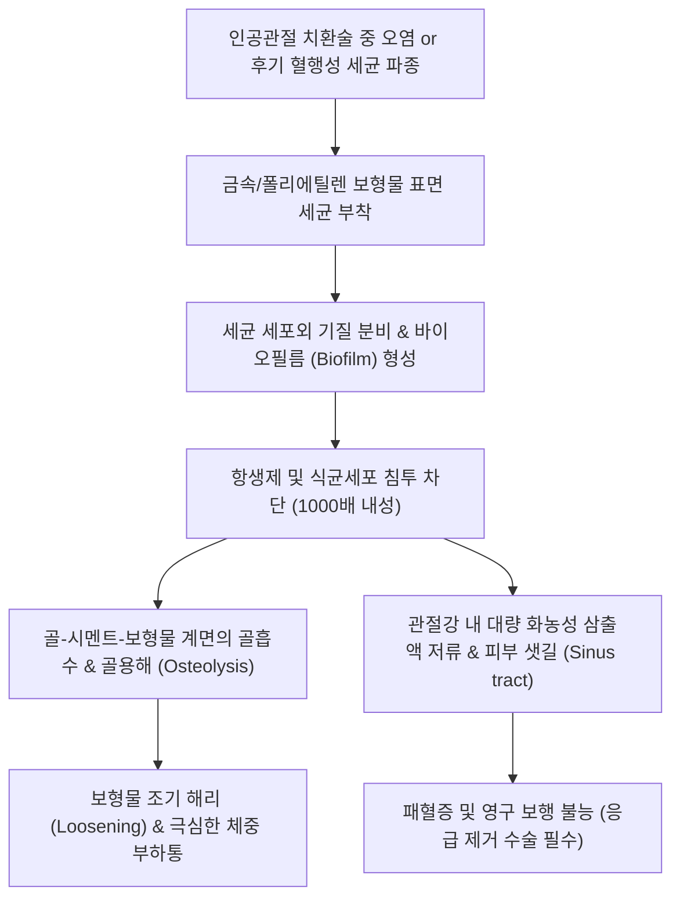

# 🩺 인공 관절 감염성 관절염 (Prosthetic Joint Infection, PJI)

> **상위 분류**: [[근골격계 질환]] > [[하지 질환]] > [[인공관절 및 수술후 합병증]] > [[감염성 관절염]]
> **핵심 3줄 요약 (Key Summary)**:
> - 📍 병소 부위 & 해부·병태생리: 인공 고관절(THA) 또는 인공 슬관절(TKA) 전치환술 후 인공 보형물(금속, 폴리에틸렌) 표면에 세균이 부착하여 **세균성 바이오필름(Biofilm)**을 형성하고 관절강 및 주변 연골하 골조직을 파괴하는 파멸적 합병증.
> - 🚩 전형적 임상 양상: 인공관절 수술 후 호전되던 통증이 수주~수개월 뒤 다시 발생(무통기 후 재발), 수술창 부위의 지속적인 발적·열감·부종, 관절과 연결된 **피부 샛길(Sinus tract)** 형성 및 농성 삼출액 배출.
> - 🛠️ 핵심 검사 & 치료 전략: 관절강 천자(Synovial fluid aspiration: 백혈구 >3,000/μL, PMN >80%), 혈청 CRP/ESR 및 알파-디펜신(Alpha-defensin) 검사, 한의 진료실 관절강 직접 침습 절대 금기, 정형외과 전원을 통한 변연절제 및 임플란트 보존술(DAIR) 또는 2단계 인공관절 재치환술(Two-stage revision).
> - ⚠️ 응급 의뢰 레드플래그: 인공관절 수술 부위의 열감, 종창, 지속적인 상처 삼출물, 피부 샛길(Sinus tract)은 인공관절 주위 감염(PJI)의 절대적 수술 응급 소견! 즉시 수술을 집도한 정형외과로 응급 전원 필수. 관절 내 직접 자침이나 약침 주입은 바이오필름 감염을 가속화하므로 절대 금기!

---

## 📌 목차
1. [질환 개요 & 해부학적 병태생리](#1-질환-개요--해부학적-병태생리)
2. [병태생리 메커니즘 & 생체역학적 악순환 네트워크](#2-병태생리-메커니즘--생체역학적-악순환-네트워크)
3. [임상 증상 & 이학적 검사(Physical Exam) 알고리즘](#3-임상-증상--이학적-검사physical-exam-알고리즘)
4. [감별 진단 매트릭스 (Differential Diagnosis)](#4-감별-진단-매트릭스--differential-diagnosis)
5. [한의 통합 치료 프로토콜 (침·약침·추나·한약)](#5-한의-통합-치료-프로토콜-침약침추나한약)
6. [양방 치료 & 병용·의뢰 기준 (Conventional Treatment & Referral)](#6-양방-치료--병용의뢰-기준-conventional-treatment--referral)
7. [재활 운동 & 생활습관 티칭 가이드](#7-재활-운동--생활습관-티칭-가이드)
8. [💡 사용자 진료실 핵심 필기 & 임상 노하우 (Melt-In 잔여 심화 집약)](#8--사용자-진료실-핵심-필기--임상-노하우--melt-in-잔여-심화-집약)
9. [출처 및 학술 참고 문헌 (References)](#9-출처-및-학술-참고-문헌--references)

---

## 1. 질환 개요 & 해부학적 병태생리

### 1.1 개요 및 역학
**인공관절 주위 감염(Prosthetic Joint Infection, PJI)**은 인공 슬관절 전치환술(TKA) 및 인공 고관절 전치환술(THA) 후 발생하는 가장 치명적인 합병증이다.
- **발생률**: 일차성 인공관절 치환술 후 약 1~2%, 재치환술 후에는 약 3~5%까지 증가한다.
- **원인 미생물**:
  - 황색포도상구균(*Staphylococcus aureus*, MRSA 포함): 약 30~40%.
  - 응고효소 음성 포도상구균(*Staphylococcus epidermidis*): 약 20~30% (주로 만성 지연성 감염 유발).
  - 연쇄구균, 장구균, 그람음성 간균(*Pseudomonas*, *E. coli*), 다균성 감염 (Chen et al., 2026).
  - 비정형 마이코박테리아 등 드문 균주 (Coelho Cunha et al., 2026).

![[화농성관절염_관절강천자_화농성_활액삼출물_임상사진.jpg|400]]
> [그림 1: 인공관절 감염의 진단을 위한 관절 천자 시 흡인되는 농성 활액 소견 — 임상 검체 실사]

---

## 2. 병태생리 메커니즘 & 생체역학적 악순환 네트워크

### 2.1 바이오필름(Biofilm) 형성과 항생제 저항성
인공 보형물(타이타늄, 코발트-크롬, 초고분자량 폴리에틸렌)은 혈관이 통하지 않는 무생물 이물질이므로 숙주의 면역 세포가 접근하기 어렵다.
1. **가역적 부착 및 비가역적 정착**: 수술 중 공기 중 낙하균이나 술자의 손, 또는 혈행성 파종을 통해 균이 인공관절 금속 표면에 달라붙는다.
2. **세균성 세포외 기질(EPS) 분비**: 증식한 세균들이 세포외 고분자 물질(Extracellular Polymeric Substance)인 슬라임(Slime) 형태의 **바이오필름(Biofilm)**을 형성한다.
3. **항생제 및 면역 차단막 형성**: 바이오필름 내부의 세균은 대사율을 극도로 낮추어 휴면 상태(Persister cells)로 전환되며, 항생제 침투를 물리적으로 차단하여 최소박멸농도(MBEC)가 일반 부유 세균의 1,000배 이상 증가한다 (Saadeh et al., 2026).

![[손가락힘줄집감염_01_화농성건초염_임상실사.jpg|400]]
> [그림 2: 인공 보형물 주변 세균성 바이오필름 형성과 화농성 염증 침윤 소견 — 임상실사]

### 2.2 감염 시기별 분류 (Tsukayama 분류)
- **조기 수술후 감염 (Early, <4주)**: 수술 중 오염에 기인. 전신 고열, 급격한 관절 종창, 절개창 삼출물.
- **만성 지연성 감염 (Delayed, 3~24개월)**: 저독성 균주(*S. epidermidis*)에 의한 은밀한 바이오필름 형성. 서서히 발생하는 둔통, 보형물 이완.
- **후기 혈행성 감염 (Late hematogenous, >2년)**: 치과 시술, 요로감염, 피부 감염 등에서 혈류를 타고 인공관절로 원격 전이. 갑작스러운 급통 재발.

---

## 3. 임상 증상 & 이학적 검사(Physical Exam) 알고리즘

### 3.1 3대 핵심 임상 징후
1. **무통 기간 후 돌발 통증 재발 (Pain-free interval 후 통증)**:
   - 인공관절 수술 후 수개월간 잘 걸어 다니며 통증이 없던 환자가, 특별한 외상 없이 갑자기 무릎이나 고관절이 쑤시고 아프기 시작함.
2. **절개창 삼출물 및 피부 샛길 (Sinus Tract — 확진 징후)**:
   - 수술 흉터선 부위가 불룩해지더니 맑거나 노란 진물이 터져 나와 거즈를 적심.
   - 피부와 인공관절 보형물 사이를 연결하는 샛길(Sinus tract)이 육안으로 확인되면 검사 없이도 PJI로 확진됨.
3. **국소 발적, 열감, 관절 가동성 상실**:
   - 무릎이 빵빵하게 부어오르고 피부 온도가 반대측보다 2℃ 이상 뜨거움.

![[화농성관절낭염_슬개전점액낭염_급성종창_임상사진.jpg|400]]
> [그림 3: 수술 부위 급성 감염으로 인한 국소 발적, 종창 및 삼출물 누출 소견 — 임상사진]

![[화농성관절염_급성기_슬관절_Xray_수종소견.jpg|400]]
> [그림 4: 관절 치환술 후 감염성 삼출액 저류 및 관절 주변 연부조직 종창 방사선 소견 — 단순 X-ray]

### 3.2 진단 기준 (ICM / MSIS 2018 기준)
- **주 진단 기준 (Major Criteria — 1개만 있어도 PJI 확진)**:
  1. 보형물과 연결된 피부 샛길(Sinus tract) 확인.
  2. 2회 이상의 별도 관절액 또는 조직 배양에서 동일한 균주 동정.
- **부 진단 기준 (Minor Criteria)**:
  - 혈청 CRP 상승 (>10 mg/L) 및 ESR 상승 (>30 mm/hr).
  - 관절액 백혈구 수치: 급성기 >10,000/μL, 만성기 >3,000/μL.
  - 관절액 다형핵 중성구(PMN) 비율: >70~80%.
  - 관절액 **알파-디펜신(Alpha-defensin)** 검사 양성 (Do et al., 2026).

---

## 4. 감별 진단 매트릭스 (Differential Diagnosis)

| 감별 질환 | 발병 시기 및 병력 | 관절액 백혈구(WBC) | 혈청 CRP / ESR | 결정적 감별 포인트 |
| :--- | :--- | :--- | :--- | :--- |
| **[[인공 관절 감염성 관절염]](PJI)** | 수술 후 어느 때나, 무통기 후 재발 | **>3,000/μL (PMN >80%)**, 배양 양성 | **현저한 상승** | **피부 샛길(Sinus tract), 알파-디펜신(+), 수술창 발적** |
| **무균성 해리 (Aseptic Loosening)** | 수술 후 수년~십수 년 뒤 | <2,000/μL (단핵구 우세) | 정상 또는 경미 상승 | 방사선상 보형물 주변 방사선투과선(Lucent line), 감염 음성 |
| **인공관절 주위 혈종** | 수술 직후 1~2주 이내 | 혈성 활액, 배양 음성 | 수술 후 정상적 일시 상승 | 전신 발열 없음, 시간 경과 시 점차 완화 |
| **반사성 교감신경 위축증 ([[CRPS]])** | 수술 후 지속적인 작열통 | 관절액 없음 | 정상 | 이질통(Allodynia), 피부 색조 변화, 감염 지표 음성 |

---

## 5. 한의 통합 치료 프로토콜 (침·약침·추나·한약)

### 5.1 한의 진료실 절대 금기 및 안전 수칙 (Absolute Contraindications)
- ⛔ **인공관절 내부 직접 자침 및 약침 주입 절대 금기**:
  - 인공관절은 혈류가 통하지 않는 금속/플라스틱 이물질이므로, 관절강 내로 바늘을 찔러 넣는 행위는 피부 표면 상재균을 보형물로 밀어 넣어 치명적인 PJI를 직접 유발하는 중대한 의료 과실이다.
  - 환자가 인공관절 수술을 받은 기왕력이 있다면, 해당 무릎의 관절강 내 직접 자침은 영구히 피해야 한다.
- ⛔ **인공관절 부위 강한 추나 스러스트(HVLA) 금기**:
  - 인공 보형물과 숙주 골조직 간의 결합부(Bone-cement interface)에 기계적 전단 손상을 주어 보형물 해리를 촉진하므로 금기.

### 5.2 수술 후 감염 조절기 원위부 보조 한의 치료
정형외과적 감염 치료(항생제, 재치환술)가 완료된 후 관해기에 전신 면역 및 주변 연부조직 순환 회복을 보조한다.
- **원위 취혈 침구 치료**:
  - 족삼리(ST36), 양릉천(GB34), 삼음교(SP6), 태충(LR3), 합곡(LI4), 곡지(LI11).
  - 수술 부위에서 떨어진 원위 경혈을 취혈하여 하지 혈액 순환을 촉진하고 전신 면역계를 자극.
- **한약 치료 (전신 기혈 보강 및 만성 염증 억제)**:
  - 장기 항생제 복용 및 반복 수술로 위장관 기능과 기혈이 극도로 쇠약해진 단계.
  - 처방: [[보양환오탕]], [[십전대보탕]] 합 [[황련해독탕]] 가감 (황기 30g 이상 증량, 당귀, 백출, 복령, 금은화, 포공영 배합). 골수 조혈 기능을 돕고 절개창 결합조직의 재생을 촉진.

---

## 6. 양방 치료 & 병용·의뢰 기준 (Conventional Treatment & Referral)

![[발허리뼈골절_06_보존치료_단하지보행보조기_CAMboot.jpg|400]]
> [그림 5: 감염 조절 및 보형물 재치환술 후 체중 부하 보호를 위한 보조기 적용 — 임상 보조기]

![[퇴행성관절염_슬관절_KL등급_2기_및_3기_Xray.jpg|400]]
> [그림 6: 인공관절 전치환술(TKA)의 선행 적응증인 말기 슬관절 골관절염 소견 — 단순 X-ray]

### 6.1 수술적 치료의 2대 표준
PJI는 항생제 단독 투여로는 바이오필름을 제거할 수 없으므로 **반드시 외과적 수술이 병행**되어야 한다.
1. **변연절제 및 임플란트 보존술 (DAIR - Debridement, Antibiotics, and Implant Retention)**:
   - 증상 발생 3~4주 이내의 급성 감염이며 보형물 고정이 견고한 경우 적용. 관절을 열어 활막과 세균 덩어리를 긁어내고 폴리에틸렌 라이너만 교체한 뒤 강력한 항생제 유지.
2. **2단계 재치환술 (Two-Stage Revision — 만성 감염의 골드 스탠다드)**:
   - **1단계**: 감염된 기존 인공관절 보형물과 시멘트를 완전히 제거하고, 고농도 항생제(반코마이신 등)가 함유된 시멘트 스페이서(Cement spacer)를 삽입한 후 6~8주간 정맥 항생제 투여.
   - **2단계**: 감염 지표(CRP, ESR, 관절액 검사)가 완전히 정상화된 것을 확인한 후 새로운 인공관절을 재삽입.

---

## 7. 재활 운동 & 생활습관 티칭 가이드

### 7.1 인공관절 환자의 평생 감염 예방 수칙
- **치과 시술 및 침습적 검사 전 예방적 항생제**:
  - 발치, 임플란트, 잇몸 치료, 비뇨기과 방광경, 대장 내시경 용종 절제술 전에는 일시적인 균혈증(Bacteremia)이 발생하여 인공관절로 세균이 파종될 수 있음. 시술 1시간 전 아목시실린 등 예방적 항생제 복용을 정형외과 주치의와 상의하도록 지도.
- **피부 상처 즉각 소독**: 무좀, 봉와직염, 모낭염 등 사지의 가벼운 피부 감염도 즉시 치료하여 혈행성 전이 차단.

---

## 8. 💡 사용자 진료실 핵심 필기 & 임상 노하우 (Melt-In 잔여 심화 집약)

### 8.1 "인공관절 한 무릎에는 절대 침을 꽂지 마라" (면허를 지키는 철칙)
- 70대 어르신이 "무릎 인공관절 수술한 지 1년 됐는데 쑤시고 시큰거린다"며 침을 놔달라고 내원하는 경우가 대단히 많다.
- 이때 무릎 수술 자국 주변이나 관절강 깊숙이 침을 찌르는 것은 **절대적으로 금기**이다.
- 정상 관절은 활막과 백혈구가 세균을 방어하지만, 인공관절은 무생물 쇳덩이라서 바늘 끝에 스친 피부 상재균 한 마리만 들어가도 며칠 안에 바이오필름을 형성해 관절 전체를 썩게 만든다.
- 만약 침을 맞은 뒤 감염이 터지면 한의사 책임으로 100% 몰리게 된다.
- 인공관절 환자는 오직 허벅지(대퇴사두근), 엉덩이(둔근), 종아리 근육 부위의 **원위부 근막만 부드럽게 침이나 마사지로 풀어주고, 관절 자체는 절대 건드리지 말아야 한다.**

### 8.2 수술창에서 노란 진물이 조금이라도 비치면 1초의 지체 없이 전원
- 환자가 수술 흉터선에 뾰루지 같은 게 생겨서 진물이 조금 나온다고 밴드를 붙이고 내원하면, 절대로 환부를 압출하거나 소독만 하고 돌려보내면 안 된다.
- 그것은 단순 뾰루지가 아니라 관절 깊숙한 쇳덩이에서부터 피부 밖으로 뚫고 나온 **샛길(Sinus tract)**일 가능성이 99%이다.
- 즉시 거즈를 대고 수술했던 대학병원 정형외과 인공관절 센터로 직행하게 해야 한다. 조기에 가면 라이너만 바꾸는 세척술(DAIR)로 끝날 수 있지만, 며칠 미루면 쇳덩이를 다 뜯어내는 대수술을 받아야 한다.

---

## 9. 출처 및 학술 참고 문헌 (References)

1. **Saadeh JE et al. (2026)**. Current Concepts in Periprosthetic Joint Infection: Modern Biomarkers, Microbiome Insights, Molecular Diagnostics, and Emerging Prevention Strategies. *Orthop Res Rev*. 18:634292. [PMID: 42746583](https://pubmed.ncbi.nlm.nih.gov/42746583/)
   - *[연구 요약]*: 인공관절 주위 감염의 분자생물학적 진단 기법, 마이크로바이옴 분석, 차세대 바이오마커 및 바이오필름 억제를 위한 최신 보존적/수술적 예방 전략 총괄 고찰.

2. **Chen J et al. (2026)**. What constitutes a true polymicrobial periprosthetic joint infection? From multiple detections to organism-level causality. *Front Microbiol*. 17:1936444. [PMID: 42699484](https://pubmed.ncbi.nlm.nih.gov/42699484/)
   - *[연구 요약]*: 인공관절 감염에서 다균성 감염(Polymicrobial PJI)의 진단적 인과 관계 규명과 복합 균주 바이오필름에 대한 표적 항균 치료 지침을 분석함.

3. **Coelho Cunha C et al. (2026)**. Mycobacterial periprosthetic joint infection of the hip and knee: current concepts in diagnosis and management. *Eur J Clin Microbiol Infect Dis*. :. [PMID: 42627466](https://pubmed.ncbi.nlm.nih.gov/42627466/)
   - *[연구 요약]*: 고관절 및 슬관절 인공관절 치환술 후 발생하는 비정형 결핵균 및 마이코박테리아 PJI의 임상 증상, 특수 배양 진단 및 단계별 수술 관리 지침 고찰.

4. **Do DH et al. (2026)**. Utility of Synovial Alpha Defensin Lateral Flow Test in Diagnosing Septic Arthritis in Native Knees. *Cureus*. 18(2):e112425. [PMID: 42577321](https://pubmed.ncbi.nlm.nih.gov/42577321/)
   - *[연구 요약]*: 관절 활액 내 알파-디펜신(Alpha-defensin) 신속 키트 검사의 세균성 관절염 및 인공관절 감염 진단 민감도와 특이도를 평가한 임상 연구.
