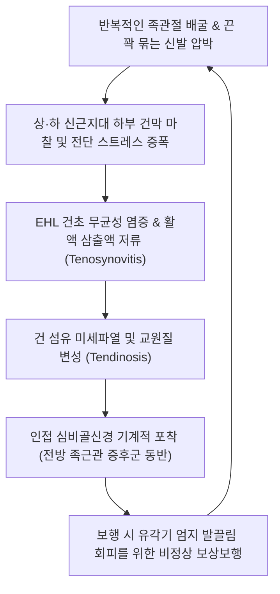

# 🩺 [[장모지신근건염]] (Extensor Hallucis Longus Tendinitis / 긴엄지폄근건염, KCD M76.8)

> **핵심 3줄 요약 (Key Summary)**:
> - 📍 **병소 부위 & 해부·병태생리**: [[비골]] 전면 중간부에서 기시하여 발목 전방의 상·하 [[신근지대]]를 통과해 엄지발가락 원위지골 기저부로 이어지는 [[장모지신근]](EHL) 힘줄 및 활액초의 마찰·과사용 무균성 염증.
> - 🚩 **전형적 임상 양상**: 발등 내측 및 제1중족골 배측의 국소 압통, 엄지발가락 저항 신전(Extension) 시 격심한 통증, 족관절 배굴 시의 삐걱거리는 마찰음(Crepitus), 꽉 끼는 신발 착용 시 증상 악화.
> - 🛠️ **핵심 검사 & 치료 전략**: 엄지발가락 능동 신전 저항 검사, 초음파 건초 삼출액 및 비후 관찰; 신근지대 통과 부위([[해계]], [[구허]]) 및 건 주행로([[태충]]) 침구·도침 치료, 항염 소염약침 및 족관절 거퇴관절 관절가동 추나.
> - ⚠️ **응급 의뢰 레드플래그**: 외상 후 엄지발가락 능동 신전 완전 불능(급성 건 완전 파열), [[심비골신경]] 압박에 의한 제1-2지 간 배측 감각 소실(전방 족근관 증후군), 요추 수핵탈출증으로 인한 급성 [[족하수]](L5 신경근 손상) 감별 필요.

---

## 📌 목차
1. [질환 개요 & 해부학적 병태생리 (Disease Overview & Anatomy)](#1-질환-개요--해부학적-병태생리-disease-overview--anatomy)
2. [병태생리 메커니즘 & 임상적 악순환 (Pathophysiology & Vicious Cycle)](#2-병태생리-메커니즘--임상적-악순환-pathophysiology--vicious-cycle)
3. [임상 증상 & 이학적 검사 (Clinical Presentation & Physical Exam)](#3-임상-증상--이학적-검사-clinical-presentation--physical-exam)
4. [감별 진단 매트릭스 (Differential Diagnosis Matrix)](#4-감별-진단-매트릭스-differential-diagnosis-matrix)
5. [한의 통합 치료 프로토콜 (KMD Integrated Protocol)](#5-한의-통합-치료-프로토콜-kmd-integrated-protocol)
6. [양방 치료 & 병용·의뢰 기준 (Conventional Treatment & Referral)](#6-양방-치료--병용의뢰-기준-conventional-treatment--referral)
7. [단계별 재활 & 자가 운동 티칭 (Rehabilitation & Self-Care)](#7-단계별-재활--자가-운동-티칭-rehabilitation--self-care)
8. [💡 진료실 핵심 필기 & 임상 노하우](#8--진료실-핵심-필기--임상-노하우)
9. [출처 및 학술 참고 문헌 (References)](#9-출처-및-학술-참고-문헌-references)

---

## 1. 질환 개요 & 해부학적 병태생리 (Disease Overview & Anatomy)

![[Extensor_hallucis_longus_anatomy.png|450]]
> [그림 1: ① 병태생리·해부 — 비골 중간부에서 시작하여 발목 전면 해계혈 부위를 거쳐 엄지발가락 기저부로 주행하는 장모지신근 해부도 — Wikipedia(PD)]

* **질환 정의 및 개요**:
  * [[장모지신근건염]](Extensor Hallucis Longus Tendinitis / Tendinopathy)은 엄지발가락을 들어 올리고 발목의 배굴(Dorsiflexion)을 보조하는 [[장모지신근]](EHL)의 건 및 건막(Tendon sheath)에 반복적 기계적 마찰, 압박, 견인력 과부하로 인해 발생하는 무균성 염증성 질환입니다.
  * 주로 발목 전방의 상·하 [[신근지대]](Extensor retinaculum) 아래를 통과하는 부위나 제1중족족지관절(MTP joint) 근위부에서 호발하며, 건초염(Tenosynovitis)의 형태로 나타나는 경우가 많습니다.
* **역학 및 호발군**:
  * 마라톤, 트레일러닝, 축구 등 잦은 가감속과 언덕 오르기를 반복하는 육상 스포츠 선수에게 흔합니다.
  * 발등이 높은 요족(Pes cavus) 변형 환자나 끈을 너무 꽉 조여 매는 신발, 군화, 스키 부츠 등 단단한 신발을 착용하는 직업군에서 외부 압박성 건염으로 빈발합니다.
* **해부학적 구조와 역학적 관계**:
  * **기시와 정지**: [[비골]] 전면 중간 2/4 및 골간막에서 기시하여, 하퇴 전방 구획을 내려와 발목 관절 전면 중앙을 지나 엄지발가락 말절골(Distal phalanx) 기저부 등쪽에 정지합니다.
  * **신경 및 혈관**: [[심비골신경]](Deep fibular nerve, L4-S1, 특히 **L5 척수 분절 핵심 지표근**)의 지배를 받으며, 전경골동맥의 분지로부터 혈액을 공급받습니다.
  * **전방 족근관과의 인접성**: EHL 건은 족관절 전방에서 하신근지대 하부 공간(Anterior tarsal tunnel)을 형성하며 [[전경골근]] 건의 외측, [[장지신근]] 건의 내측에 위치하고, 바로 외측 심부에 [[심비골신경]]과 족배동맥이 주행하므로 염증 종창 시 신경 압박 증상이 유발될 수 있습니다.

---

## 2. 병태생리 메커니즘 & 임상적 악순환 (Pathophysiology & Vicious Cycle)

![[Extensor_hallucis_brevis_anatomy.png|450]]
> [그림 2: ② 관련 해부 구조물 — 발등에서 장모지신근건과 교차 주행하며 엄지발가락 신전을 보조하는 단모지신근 및 신근지대 구조 — Wikimedia Commons(PD)]

![[Extensor_digitorum_longus_foot_anatomy.png|420]]
> [그림 3: ② 발목 및 발등 신전건 복합체 — 족관절 전방 신근 구획 내 장모지신근과 장지신근의 상대적 위치 관계 — Wikimedia Commons(PD)]

### 1) 미세 손상 및 기계적 압박 기전
* **신근지대 하부 마찰 협착**: 보행의 유각기(Swing phase) 말기에 엄지발가락이 지면에 걸리지 않도록 EHL이 강하게 수축하는데, 신발 끈에 의한 직하방 압박이 가해지면 신근지대와 설상골(Cuneiform) 골융기 사이에서 활주 저항이 급증하여 건초 부종이 발생합니다.
* **불충분한 건막 혈류와 점액성 변성**: 반복된 장력 부하와 국소 압박은 미세순환을 저해하여 건 실질의 점액성 변성과 콜라겐 섬유 다발의 분절화를 야기합니다.

### 2) 생체역학적 보상과 인접 관절 파급
* EHL의 통증성 억제(Inhibition)가 발생하면 환자는 엄지발가락을 들지 못해 보행 시 [[단모지신근]](EHB) 및 [[장지신근]](EDL)을 과도하게 동원하며, 이는 족배부 전체의 신전근 과긴장과 족지 변형(망치족지)을 유발합니다.

---

## 3. 임상 증상 & 이학적 검사 (Clinical Presentation & Physical Exam)

![[발목염좌_01_환부실사_급성종창_SprainedAnkle.jpg|420]]
> [그림 4: ③ 임상 증상 — 발목 전면 및 발등 내측부의 종창과 마찰성 압통 발현 부위 실사 — Wikimedia Commons(CC BY)]

![[Extensor_hallucis_longus_TriggerPoints.jpg|420]]
> [그림 5: ③ 통증 유발점(TrP) 및 방사통 패턴 — 장모지신근 하부 1/3 트리거포인트에서 제1중족지관절 및 발등으로 방사되는 통증 지도 — Travell & Simons]

### 1) 주요 자각 증상
* **발등 및 엄지발가락 배측 통증**: 족관절 전면 중앙에서 제1중족족지관절로 이어지는 힘줄 주행선을 따라 쑤시고 당기는 통증.
* **저항 신전 시 통증 격화**: 환자 스스로 엄지발가락을 위로 젖히거나 검사자가 저항을 줄 때 병변부에 예리한 통증 발생.
* **신발 착용 시 악화**: 끈이 달린 운동화나 구두를 신으면 혀(Tongue) 부분이 건을 직접 압박하여 보행이 극도로 불편해짐.
* **마찰음(Crepitus)**: 발가락을 굽혔다 폈다 할 때 건초 내부 활액 저류 및 섬유소 침착으로 인해 삐걱거리는 마찰음이 촉진됨.

### 2) 이학적 검사 알고리즘
* **EHL 능동 저항 신전 검사 (Resisted Great Toe Extension Test)**:
  * 족관절 중립위에서 환자에게 엄지발가락 원위지골을 위로 들어 올리게 하고, 검사자가 아래로 저항을 가함. 발등 건 주행부의 통증 유발 시 양성.
* **국소 촉진 및 마찰음 유발 검사**:
  * 발목 굽힘 주름([[해계]] 부위)에서 제1중족골 기저부까지 건을 핀치그립으로 압진하며 결절, 종창, 압통 및 건 활주 시 마찰음 확인.
* **전방 족근관 증후군 감별 (Tinel Sign)**:
  * 하신근지대 부위의 EHL 외측을 가볍게 타진하여 제1-2지 간 족배부 웹 공간으로 방사되는 찌릿한 이상감각 여부 확인.

---

## 4. 감별 진단 매트릭스 (Differential Diagnosis Matrix)

| 감별 질환 | 호발 병소 및 통증 기전 | 감별 핵심 포인트 (검사·징후) |
| :--- | :--- | :--- |
| **[[장모지신근건염]]** | 발목 전면~발등 내측 EHL 건 주행로 | 엄지 저항 신전 시 국소 통증, 족배 건초 종창, 마찰음 |
| **[[전방 족근관 증후군]]** | 하신근지대 하부 심비골신경 포착 | 제1-2 발가락 사이 배측 감각 저하/저림, 티넬 징후 양성 |
| **[[L5 신경근병증]]** | 요추 4-5번 신경근 압박 | 요통 동반, 하지 외측 방사통, 엄지 신전 근력 저하(무통성 위약), 하지직거상(SLR) 양성 |
| **[[통풍]]성 관절염** | 제1중족족지관절(MTP) 관절강 | 야간 돌발성 극통, 발적·열감·극심한 부종, 요산 수치 상승 |
| **제1중족골 피로골절** | 제1/제2 중족골 간부(Shaft) | 뼈 자체의 국소 골막 압통, 체중 부하 시 악화, X-ray/MRI 골절선 |
| **[[전경골근건염]]** | 발목 전내측 주상골·제1설상골 부착부 | 족관절 능동 배굴 및 내번(Inversion) 저항 시 통증 |

---

## 5. 한의 통합 치료 프로토콜 (KMD Integrated Protocol)

![[발허리뼈골절_05_술기실사_족부침치료.jpg|420]]
> [그림 6: ⑤ 한의 침구 치료 — 족관절 전면 해계·태충 및 장모지신근건 주행로를 따라 시행하는 자침 실사 — 자가보관자료]

* **침구 치료 (Acupuncture)**:
  * **주요 경혈**: [[해계]](ST41), [[중봉]](LR4), [[구허]](GB40), [[태충]](LR3), [[행간]](LR2), 하퇴 외측 [[장모지신근]] 근복부 압통점.
  * **자침 기법**: EHL 건막 주변에 0.25×30mm 호침으로 평자(Horizontal insertion)하여 건초 내 유착을 완화하고, 하퇴 근복부(비골 중간 전외측)에는 직자 후 2~4Hz 저주파 전침을 15분간 적용하여 근 긴장도를 이완시킵니다.
* **약침 치료 (Pharmacopuncture)**:
  * **제제 선택**: 급성 건초염기에는 황련해독약침 또는 소염약침(0.5~1.0cc)을 신근지대 하부 건초 주위에 피내·피하 분할 주입하여 화학적 무균 염증을 제어합니다. 만성 건증(Tendinosis)기에는 신바로약침 또는 중성어혈약침을 건 부착부에 시술하여 조직 재생을 촉진합니다.
* **도침 치료 (Acupotomy)**:
  * 신근지대의 섬유성 비후로 건 활주가 심하게 제한되는 만성 환자의 경우, 소침도로 하신근지대 협착 부위를 건 섬유 주행 방향과 평행하게 미세 박리(Release)합니다.
* **한약 치료 (Herbal Medicine)**:
  * **기체어혈(氣滯瘀血)**: 급성 마찰 손상 및 종창 시 [[당귀수산]] 또는 [[서경탕]] 가감.
  * **풍한습비(風寒濕痺) / 간신부족**: 만성 퇴행성 건병증 및 족부 냉증 시 [[독활기생탕]], [[오적산]].

---

## 6. 양방 치료 & 병용·의뢰 기준 (Conventional Treatment & Referral)

* **약물 치료 (Medication)**:
  * 경구 NSAIDs(Celecoxib 200mg qd, Aceclofenac 100mg bid) 1~2주 단기 투여로 활액낭 및 건초 부종 경감.
* **보존적 시술 (Procedures)**:
  * 신발 패딩(Felt pad)을 대어 신발 끈의 직접 압박을 차단하는 래싱 테크닉(Lacing modification) 적용.
  * 초음파 유도하 건초 내 스테로이드 주사는 건 파열(Tendon rupture) 위험성이 높으므로 원칙적으로 엄격히 제한하며, 필요 시 고농도 포도당 증식치료(Prolotherapy) 또는 체외충격파(ESWT, 방사형 1.5~2.0 bar, 2000타)를 시행합니다.
* **수술적 적응증 (Surgical Indication)**:
  * 6개월 이상의 보존적 치료에도 반응하지 않는 불응성 신근지대 협착증(건초 절개 및 감압술).
  * 외상성 EHL 건 완전 파열 시 급성기(2주 이내) 일차 봉합술 시행(Ardy et al., 2026).
* **한의 병용 판단 (Combination Therapy)**:
  * NSAIDs 복용 중인 환자에게 침구 및 소염약침을 병용하면 약물 복용 기간을 단축시키고 위장관 부작용을 줄일 수 있습니다.

---

## 7. 단계별 재활 & 자가 운동 티칭 (Rehabilitation & Self-Care)

* **1단계: 급성기 부하 차단 및 신발 교정 (1~2주)**:
  * 런닝 및 등산 즉시 중단. 신발 끈을 묶을 때 발등 통증 부위의 구멍을 건너뛰고 묶는 윈도우 래싱(Window lacing) 교육.
* **2단계: EHL 편심성 강화 및 스트레칭 (3~4주)**:
  * **수건 끌어당기기 및 엄지 독립 신전 훈련**: 발뒤꿈치를 바닥에 고정한 채 다른 발가락은 바닥을 누르고 엄지만 독립적으로 위로 들어 올리는 타깃 운동(Toe dissociation).
  * **비복근-가자미근 스트레칭**: 족관절 배굴 제한이 EHL의 과보상을 유발하므로 종아리 근육 스트레칭 병행.
* **3단계: 고유수용성 감각 및 플라이오메트릭 복귀 (5주 이후)**:
  * 밸런스 패드 위에서 한 발 서기, 점진적 조깅 복귀.

---

## 8. 💡 진료실 핵심 필기 & 임상 노하우

* **신발 혀(Tongue) 압박 여부 확인이 치료의 80%**:
  * 치료를 아무리 열심히 해도 환자가 딱딱한 구두나 축구화를 꽉 조여 매면 다음 날 바로 재발합니다. 진료실에 신고 온 신발을 벗겨 발등 주름 부위의 압박 자국을 반드시 확인하십시오.
* **L5 디스크와의 감별 요령**:
  * 환자가 "엄지발가락에 힘이 안 들어가요"라고 호소할 때, 통증 때문에 못 드는 것인지(Pain inhibition, 건염), 아예 신경 신호가 끊겨 덜렁거리는 것인지(True weakness, L5 신경근병증) 구분해야 합니다. 저항을 줄 때 병변부에 통증이 극심하다면 건염이며, 아프지도 않은데 푹 꺼진다면 즉시 요추 MRI를 의뢰해야 합니다.

---

## 9. 출처 및 학술 참고 문헌 (References)

1. **Ardy YF, et al. (2026)**. Reconstruction of a neglected extensor hallucis tendon rupture with an iliotibial band autologous graft: case report. *Int J Surg Case Rep*, 118, 109650. [PMID 42699887](https://pubmed.ncbi.nlm.nih.gov/42699887/)
   - [연구 요약]: 방치된 장모지신근건 파열 환자에서 장경인대 자가건 이식을 통한 기능 재건 및 유각기 보행 회복 증례 보고.
2. **Dellis S, et al. (2026)**. Crenellated superior extensor retinaculum incision: A technical modification to facilitate closure in the anterior ankle approach. *Foot (Edinb)*, 64, 102140. [PMID 42229190](https://pubmed.ncbi.nlm.nih.gov/42229190/)
   - [연구 요약]: 족관절 전방 도달 시 상신근지대의 해부학적 절개 및 봉합 기법을 통해 신전건 마찰과 유착 합병증을 최소화하는 술기 분석.
3. **Gonzalez J, et al. (2026)**. Anterior Tarsal Tunnel Syndrome. *StatPearls*, Treasure Island (FL): StatPearls Publishing. [PMID 30860723](https://pubmed.ncbi.nlm.nih.gov/30860723/)
   - [연구 요약]: 전방 족근관 내에서 하신근지대 및 장모지신근건 비후에 의해 발생하는 심비골신경 포착의 병태생리, 진단 및 감별 지침.
4. **Banu J, et al. (2024)**. Unravelling the Anatomy of the Anterior Tarsal Tunnel and Its Clinical Implications. *Cureus*, 16(7), e65123. [PMID 39130935](https://pubmed.ncbi.nlm.nih.gov/39130935/)
   - [연구 요약]: 전방 족근관의 사체 해부학적 연구를 통해 신전건군(EHL, EDL)과 신경혈관속의 상호 압박 관계 및 임상적 의미 규명.

---

## 관련 노트
- [[장모지신근]]
- [[족하수]]
- [[전방 족근관 증후군]]
- [[해계]]
- [[태충]]
