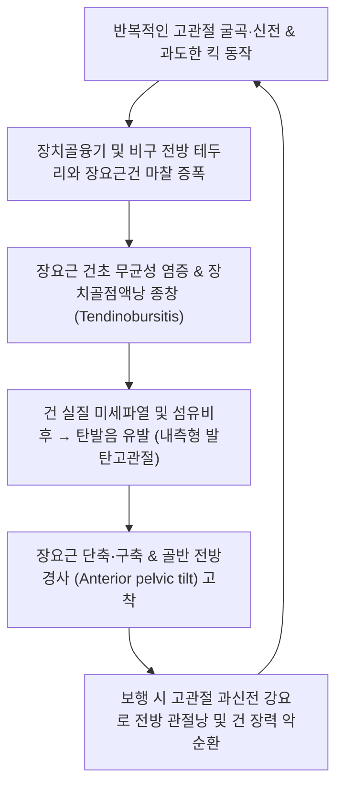

# 🩺 [[장요근건염]] (Iliopsoas Tendinitis / Tendinopathy, KCD M76.1)

> **핵심 3줄 요약 (Key Summary)**:
> - 📍 **병소 부위 & 해부·병태생리**: 요추 및 장골와에서 기시하여 고관절 전방 장치골융기(Iliopectineal eminence)와 관절낭을 활주해 대퇴골 소전자(Lesser trochanter)에 정지하는 [[장요근]](대요근+장골근) 힘줄의 반복적 마찰 및 견인성 미세손상.
> - 🚩 **전형적 임상 양상**: 서혜부(Groin) 전방의 깊숙한 뻐근한 통증, 고관절 신전 시(보행 입각기 말기) 서혜부 당김, 굴곡 저항 시 통증 악화, 고관절을 신전·외선 상태에서 내선·굴곡 시 발생하는 '툭' 하는 탄발음(내측형 [[발탄고관절]]).
> - 🛠️ **핵심 검사 & 치료 전략**: 토마스 검사(Thomas test) 양성, 럿들로프 검사(Ludloff sign) 및 스틴치필드 검사(Stinchfield test); 서혜인대 하부 건 부착부([[충문]], [[기충]]) 및 요추 기시부 침구·약침 치료, 요골반 관절가동 추나 및 장요근 PIR 스트레칭.
> - ⚠️ **응급 의뢰 레드플래그**: [[대퇴골두 무혈성 괴사]](AVN), 고관절 패혈성 관절염, 비구순 파열(Labral tear), 요근 농양(Psoas abscess — 발열, 백혈구 증가, 요근 징후 양성)의 감별 및 긴급 전원 필요.

---

## 📌 목차
1. [질환 개요 & 해부학적 병태생리 (Disease Overview & Anatomy)](#1-질환-개요--해부학적-병태생리-disease-overview--anatomy)
2. [병태생리 메커니즘 & 임상적 악순환 (Pathophysiology & Vicious Cycle)](#2-병태생리-메커니즘--임상적-악순환-pathophysiology--vicious-cycle)
3. [임상 증상 & 이학적 검사 (Clinical Presentation & Physical Exam)](#3-임상-증상--이학적-검사-clinical-presentation--physical-exam)
4. [감별 진단 매트릭스 (Differential Diagnosis Matrix)](#4-감별-진단-매트릭스-differential-diagnosis-matrix)
5. [한의 통합 치료 프로토콜 (KMD Integrated Protocol)](#5-한의-통합-치료-프로토콜-kmd-integrated-protocol)
6. [양방 치료 & 병용·의뢰 기준 (Conventional Treatment & Referral)](#6-양방-치료--병용의뢰-기준-conventional-treatment--referral)
7. [단계별 재활 & 자가 운동 티칭 (Rehabilitation & Self-Care)](#7-단계별-재활--자가-운동-티칭-rehabilitation--self-care)
8. [💡 진료실 핵심 필기 & 임상 노하우](#8--진료실-핵심-필기--임상-노하우)
9. [출처 및 학술 참고 문헌 (References)](#9-출처-및-학술-참고-문헌-references)

---

## 1. 질환 개요 & 해부학적 병태생리 (Disease Overview & Anatomy)

![[Psoas_major_anatomy.png|450]]
> [그림 1: ① 병태생리·해부 — 흉요추 이행부에서 기시하여 장골근과 합류한 뒤 대퇴골 소전자에 정지하는 대요근 및 장요근 해부도 — Wikipedia(PD)]

* **질환 정의 및 개요**:
  * [[장요근건염]](Iliopsoas Tendinitis / Tendinopathy)은 고관절의 가장 강력한 굴곡근인 [[장요근]](Iliopsoas — 대요근과 장골근의 복합체) 힘줄이 대퇴골두 전방, 골반의 장치골융기(Iliopectineal eminence) 또는 대퇴골 소전자(Lesser trochanter) 정지부에서 기계적 마찰, 압박 및 과부하를 받아 발생하는 염증 및 퇴행성 건병증입니다.
  * 건 하부에 위치한 거대한 윤활낭인 [[장요근점액낭염]](Iliopsoas Bursitis)과 거의 항시 동반되며, 임상적으로 **장요근 건점액낭염(Iliopsoas Tendinitis/Bursitis)** 또는 **[[장요근 증후군]]**으로 총칭됩니다.
* **역학 및 호발군**:
  * 달리기, 축구, 체조, 무용, 태권도, 조정 등 고관절의 반복적 굴곡·외회전 동작을 수행하는 스포츠 선수에게 다발합니다(Eser et al., 2026).
  * 인공고관절 전치환술(THA) 후 비구컵의 전방 돌출로 인해 장요근건이 컵 테두리에 지속적으로 충돌하는 의원성 건염(Iliopsoas impingement after THA)도 중요한 호발군입니다(Cohen et al., 2026).
* **해부학적 구조와 역학적 관계**:
  * **기시와 정지**: 대요근(T12~L5 추체 및 횡돌기)과 장골근(장골와)이 합쳐져 서혜인대 하부의 근열공을 통과한 후, 하나의 공통건을 형성하여 대퇴골 경부 내하방의 **소전자(Lesser trochanter)**에 부착합니다.
  * **신경 지배**: 대요근은 요신경총 전지(L1-L3), 장골근은 [[대퇴신경]](L2-L4)의 지배를 받습니다.
  * **활줄 현상(Bowstringing)**: 고관절이 신전될 때 장요근건은 대퇴골두 전방과 장치골융기 위로 팽팽하게 당겨지며 강한 전단력(Shear stress)을 발생시킵니다.

---

## 2. 병태생리 메커니즘 & 임상적 악순환 (Pathophysiology & Vicious Cycle)

![[고관절_전방관절낭_해부도.png|450]]
> [그림 2: ② 관련 해부 구조물 — 고관절 전방 관절낭 및 장치골융기 위를 가로지르는 장요근건의 주행 관계 — Wikipedia(PD)]

![[Iliopsoas_TriggerPoints.jpg|420]]
> [그림 3: ③ 통증 유발점(TrP) 및 방사통 패턴 — 장요근 근복 및 건 부착부 트리거포인트에서 요추부 및 대퇴 전면 서혜부로 방사되는 통증 지도 — Travell & Simons]

### 1) 마찰 충돌 및 내측형 발탄고관절 기전
* 고관절이 굴곡·외전·외회전 상태에서 신전·내전·내회전으로 전환될 때, 팽팽해진 장요근건이 장치골융기나 대퇴골두 전방을 가로질러 미끄러지며 '덜컹' 하거나 '툭' 하는 스냅(Snapping)을 발생시킵니다(Jia et al., 2026).
* 이 반복적인 튕김 현상이 건막과 점액낭에 만성 충격을 주어 미세손상, 활액낭 삼출, 비후 및 석회화를 초래합니다.

### 2) 골반 부정렬과 요추-고관절 복합체 기능부전
* 장요근의 만성 건염과 경축은 골반을 앞으로 잡아당겨 **골반 전방경사(Anterior Pelvic Tilt)**와 요추 전만(Lumbar hyperlordosis)을 조장합니다. 이는 둔근(대둔근)의 상호억제성 약화를 유발하여 보행 시 고관절 신전 파워를 감소시키고, 보상적으로 장요근의 과긴장을 더욱 악화시키는 악순환을 만듭니다.

---

## 3. 임상 증상 & 이학적 검사 (Clinical Presentation & Physical Exam)

![[토마스검사_3단계_반대측대퇴부들림_장요근단축양성.jpg|420]]
> [그림 4: ③ 이학적 검사 — 토마스 검사(Thomas test) 양성 실사로 반대측 대퇴부가 들리며 장요근 단축 및 건 긴장을 시사하는 소견 — 자가보관자료]

### 1) 주요 임상 증상
* **서혜부 심부 둔통**: 서혜인대 하방, 대퇴동맥 맥박 외측부를 깊게 누를 때 뚜렷한 심부 압통 발생.
* **보행 및 계단 오르기 시 통증**: 보행 시 환측 다리가 뒤로 뻗어지는 입각기 말기(고관절 신전 시)에 서혜부가 심하게 당기고, 계단을 오르거나 차를 탈 때 다리를 들어 올리면 통증이 심해짐.
* **내측 탄발음**: 앉았다 일어서거나 다리를 회전할 때 서혜부에서 소리와 함께 통증이 동반됨.
* **방사통**: 요추 하부, 둔부 전외측, 대퇴 전면을 따라 슬관절 상부까지 뻐근한 연관통이 방사될 수 있음.

### 2) 이학적 검사 알고리즘
* **토마스 검사 (Thomas Test)**:
  * 환자를 앙와위로 눕히고 건측 무릎을 가슴으로 최대한 당겨 골반을 후방 회전시킴. 환측 대퇴부가 침대 표면에서 들려 올라가면 장요근 단축 및 건 긴장 양성.
* **스틴치필드 검사 (Stinchfield Test)**:
  * 환자가 누운 상태에서 무릎을 완전히 편 채 다리를 30도 거상하게 하고, 검사자가 하방으로 누르는 저항을 줄 때 서혜부 심부 통증이 유발되면 양성(장요근건 및 고관절 병변 시사).
* **럿들로프 검사 (Ludloff Sign)**:
  * 환자가 의자에 앉아 무릎을 90도 구부린 상태에서 대퇴부를 능동적으로 들어 올릴 때 소전자 부위에 통증이 발생하면 양성(장요근 단독 굴곡 부하 검사).
* **장요근 신전 신장 검사 (Psoas Stretch Test)**:
  * 환자를 복와위로 눕히거나 건측으로 측와위로 눕힌 후, 고관절을 수동적으로 과신전시킬 때 서혜부 통증이 격화됨.

---

## 4. 감별 진단 매트릭스 (Differential Diagnosis Matrix)

| 감별 질환 | 호발 병소 및 통증 기전 | 감별 핵심 포인트 (검사·징후) |
| :--- | :--- | :--- |
| **[[장요근건염]]** | 서혜인대 하부 장요근건 및 소전자 | 저항 굴곡(Stinchfield) 통증, Thomas 검사 양성, 내측 탄발음 |
| **[[비구순 파열]] (Labral Tear)** | 비구 전상방 섬유연골 파열 | FADIR(굴곡·내전·내회전) 검사 시 찝힘 통증, 관절 내 걸림(Catching), MRA 확진 |
| **[[대퇴골두 무혈성 괴사]]** | 대퇴골두 체중부하부 골괴사 | 체중 부하 시 서혜부 격통, 고관절 내회전 심한 제한, X-ray 초승달 징후(Crescent sign) |
| **[[고관절 골관절염]]** | 고관절 관절강 및 관절 연골 마모 | 노년층, 조조강직, 모든 방향의 관절 가동역 제한, X-ray 관절강 협소 및 골극 |
| **[[대퇴신경통]] / L2-L4 신경근병증** | 요신경총 또는 대퇴신경 압박 | 감각 저하(대퇴 전면), 슬개건 반사 저하, 대퇴사두근 위약 동반 |
| **요근 농양 (Psoas Abscess)** | 대요근 내 세균성 농양 형성 | 발열, 오한, 전신 쇠약, 요근 신장 시 극심한 방어 기전, 백혈구/CRP 급상승 |

---

## 5. 한의 통합 치료 프로토콜 (KMD Integrated Protocol)

![[요골반 추나-20240926095045472.png|420]]
> [그림 5: ⑤ 한의 추나 요법 — 고관절 신전 및 장요근 후하방 감압을 위한 요골반 추나 관절신장 기법 — 대한척추신경추수의학회]

![[이상근증후군_이상근_약침주입점_임상사진.png|420]]
> [그림 6: ⑤ 한의 약침 치료 — 서혜인대 하부 장요근건 및 부착부 주변 소염약침 시술 위치 임상사진 — 자가보관자료]

* **침구 치료 (Acupuncture)**:
  * **주요 경혈**: [[충문]](SP12), [[기충]](ST30), [[비관]](ST31), [[거료]](GB29), 요추부 [[신수]](BL23), [[대장수]](BL25), [[기해수]](BL24).
  * **자침 기법**:
    * 서혜부 시술 시 대퇴동맥 맥박을 반드시 검지 손가락으로 촉지하여 보호한 후, 동맥 외측 1~1.5cm 지점의 장요근건 부착부를 향해 0.30×60mm 호침으로 직자 30~45mm 진침하여 뻐근한 득기감을 유도합니다.
    * 복와위에서 요추 2-4번 횡돌기 외측 3cm 부위(대요근 기시부 심부)에 0.35×75mm 장침으로 자침 후 2Hz 전침 통전을 병행합니다.
* **약침 치료 (Pharmacopuncture)**:
  * **소염약침 / 황련해독약침**: 급성 건점액낭염으로 부종과 열감이 있을 때 서혜인대 하부 건초 주변에 1.0cc 주입.
  * **신바로약침 / 중성어혈약침**: 만성 퇴행성 건병증 및 탄발음 호소 시 소전자 부착부에 1.0~2.0cc 분할 주입하여 건 섬유 재생 유도.
* **추나 치료 (Chuna Manipulation)**:
  * **장요근 근에너지기법(PIR/MET)**: 환자를 침대 끝에 걸터앉게 하거나 측와위로 눕혀 고관절 신전 저항 수축(5초, 20% 힘) 후 호흡과 함께 이완 신장 3~5회 반복.
  * **요골반 관절가동추나**: 천장관절 기능부전 및 골반 전방경사를 교정하여 장요근에 걸리는 기계적 과장력을 해소.
* **한약 치료 (Herbal Medicine)**:
  * **급성기 어혈습열(瘀血濕熱)**: [[대서경탕]], [[당귀점통탕]] 가감.
  * **만성기 간신휴손·기혈부족**: [[독활기생탕]], [[삼기음]] 가감.

---

## 6. 양방 치료 & 병용·의뢰 기준 (Conventional Treatment & Referral)

* **약물 치료 (Medication)**:
  * 경구 NSAIDs(Meloxicam 7.5~15mg qd, Celecoxib 200mg qd) 2주 투여 및 근이완제 병용.
* **주사 요법 (Procedures)**:
  * 초음파 또는 C-arm 유도하 장요근 점액낭/건초 내 스테로이드 주사(Triamcinolone 20~40mg + 1% Lidocaine). 통증 경감 효과는 빠르나 건 약화 및 파열 위험이 있어 1년에 2~3회 이내로 제한(Goodwin et al., 2026).
* **수술적 적응증 (Surgical Indication)**:
  * 6개월 이상의 적극적 보존 치료에도 호전이 없는 심한 기능 장애 환자.
  * 관절경하 장요근건 부분 절개술(Arthroscopic iliopsoas tenotomy at labral level or lesser trochanter) 시행(Jia et al., 2026).
* **양방 의뢰 레드플래그 트리거**:
  * 38도 이상의 고열 동반, 보행 불가 수준의 안정 시 격통, X-ray 상 대퇴골두 붕괴 소견 확인 시 즉시 3차 상급병원 정형외과 전원.

---

## 7. 단계별 재활 & 자가 운동 티칭 (Rehabilitation & Self-Care)

* **1단계: 급성 통증 조절 및 과신전 회피 (1~2주)**:
  * 런닝, 계단 운동, 킥 동작 중단. 오래 앉아 있는 자세 피하기(50분마다 기립).
* **2단계: 하프 닐링 장요근 스트레칭 (Half-Kneeling Psoas Stretch) (2~4주)**:
  * 환측 무릎을 바닥에 대고 런지 자세를 취한 후, **골반을 후방 경사(Tuck in)**시킨 상태에서 체중을 천천히 앞으로 이동하여 서혜부 앞쪽이 당기도록 30초 유지(요추를 꺾지 않는 것이 핵심).
* **3단계: 둔근 강화 및 코어 협응 훈련 (4주 이후)**:
  * 글루트 브릿지(Glute bridge), 클램쉘(Clamshell) 운동으로 대둔근과 중둔근을 강화하여 장요근의 보상적 과부하를 원천 차단.

---

## 8. 💡 진료실 핵심 필기 & 임상 노하우

* **서혜부 자침 시 대퇴동맥 박동 확인 필수**:
  * 서혜인대 부위([[충문]], [[기충]])는 외측에서 내측으로 **NAVEL(Nerve - Artery - Vein - Empty space - Lymphatics)** 순서로 주행합니다. 반드시 박동하는 대퇴동맥을 검지로 짚어 외측으로 밀어내고, 동맥의 외측 안전 구역(대퇴신경-장요근건 영역)으로 자침해야 혈종 형성을 방지할 수 있습니다.
* **장요근 스트레칭 시 요추 과신전 주의**:
  * 환자에게 장요근 스트레칭을 시키면 십중팔구 허리를 뒤로 젖혀 요통을 만들어 옵니다. 엉덩이에 힘을 주어 꼬리뼈를 말아 넣는 **골반 후방 회전(Posterior tilt)**을 먼저 만든 뒤 골반을 전진시켜야 장요근만 정확히 늘어납니다.

---

## 9. 출처 및 학술 참고 문헌 (References)

1. **Jia D, et al. (2026)**. [Analysis of effectiveness of arthroscopic iliopsoas tendon tenotomy at labral level for iliopsoas cyst complicated with internal snapping hip]. *Zhongguo Xiu Fu Chong Jian Wai Ke Za Zhi*, 40(9), 1102-1108. [PMID 42749326](https://pubmed.ncbi.nlm.nih.gov/42749326/)
   - [연구 요약]: 내측형 발탄고관절 및 장요근 낭종 환자에서 관절순 수준의 관절경하 장요근건 절제술의 임상적 유효성 및 안전성 분석.
2. **Goodwin D, et al. (2026)**. Extra-articular Hip Endoscopy: Current Indications, Evidence, and Techniques. *J Am Acad Orthop Surg*, 34(17), e890-e901. [PMID 42657889](https://pubmed.ncbi.nlm.nih.gov/42657889/)
   - [연구 요약]: 장요근 건병증, 내측형 탄발음 및 고관절 주변 연부조직 충돌 질환에 대한 관절외 고관절 내시경 중재 기법과 임상 근거 고찰.
3. **Eser MB, et al. (2026)**. Thigh and Groin Overuse Injuries. *Semin Musculoskelet Radiol*, 30(4), 415-427. [PMID 42508453](https://pubmed.ncbi.nlm.nih.gov/42508453/)
   - [연구 요약]: 대퇴 및 서혜부 과사용 손상 중 장요근 건병증, 치골 결합염 및 내전근 손상의 감별 진단과 영상의학적 평가 지침.
4. **Cohen D, et al. (2026)**. Endoscopic Iliopsoas Tendon Lengthening and Iliac Fossa Debridement After Total Hip Arthroplasty: A Surgical Technique. *Video J Sports Med*, 6(4), 2632010X261262015. [PMID 42428545](https://pubmed.ncbi.nlm.nih.gov/42428545/)
   - [연구 요약]: 인공고관절 전치환술 후 발생하는 장요근 충돌 및 난치성 건염에 대한 내시경하 장요근건 연장술 기법 소개.

---

## 관련 노트
- [[장요근]]
- [[장요근점액낭염]]
- [[장요근 증후군]]
- [[충문]]
- [[토마스 검사]]
