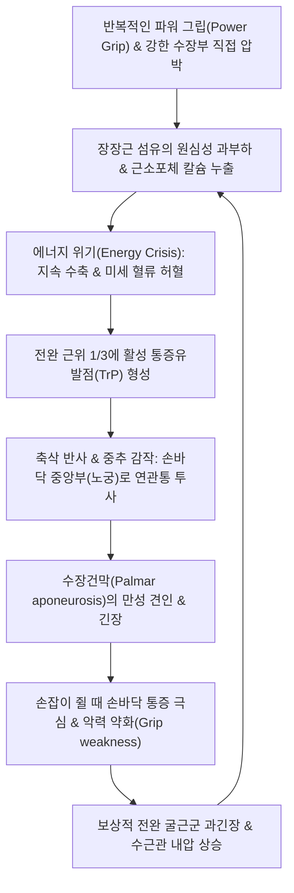
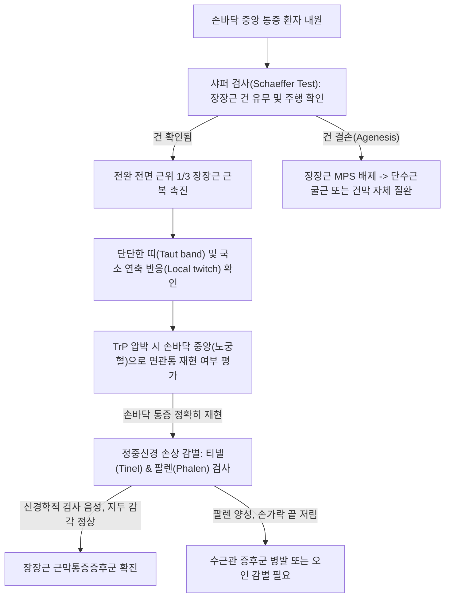

# 🩺 장장근 근막통증증후군 (Palmaris Longus Myofascial Pain Syndrome)

> **핵심 3줄 요약 (Key Summary)**:
> - 📍 병소 부위 & 해부·병태생리: 상완골 내측상과에서 기원하여 [[수장건막]](Palmar aponeurosis) 표층에 정지하는 [[장장근]](Palmaris longus)의 근복(전완 전면 근위 1/3)에 발생한 통증유발점(TrP) 및 만성 근막 단축으로, 손바닥 중앙부 및 원위 수장면에 찌르는 듯한 연관통과 타는 듯한 작열감을 유발하는 질환.
> - 🚩 전형적 임상 양상: 손바닥 한가운데(노궁혈 부위)의 둔하고 쑤시는 통증, 도구(망치, 가위, 라켓 등)를 쥘 때의 극심한 손바닥 압통, 듀피트렌 구축([[수장건막 섬유종증]])과 유사한 수장부 피부 긴장감, 손목 신전 시 전완 전면 당김.
> - 🛠️ 핵심 검사 & 치료 전략: 샤퍼 검사([[Schaeffer test]], 모지-소지 대립 시 장장근 건 돌출)로 건 주행 및 근복 확인 후 전완 근위 1/3 압통점 촉진. [[수근관 증후군]](정중신경 압박)과의 엄밀한 감별. [[곡지]](LI11), [[수삼리]](LI10), [[대릉]](PC7), [[노궁]](PC8) 침구 치료, 근막 이완(MET), 장장근 도침 소탁술 및 수장건막 스트레칭 티칭.
> - ⚠️ 응급 의뢰 레드플래그: 무지구근([[abductor pollicis brevis]])의 급격한 위축, 모지·시지·중지의 지속적 무감각 및 야간 감각 이상([[정중신경]] 마비 의심 정형외과 전원), 급성 수부 구획증후군 의심 부종.

---

## 📌 목차
1. [질환 개요 & 해부학적 병태생리](#1-질환-개요--해부학적-병태생리)
2. [병태생리 메커니즘 & 생체역학적 악순환 네트워크](#2-병태생리-메커니즘--생체역학적-악순환-네트워크)
3. [임상 증상 & 이학적 검사(Physical Exam) 알고리즘](#3-임상-증상--이학적-검사physical-exam-알고리즘)
4. [감별 진단 매트릭스 (Differential Diagnosis)](#4-감별-진단-매트릭스-differential-diagnosis)
5. [한의 통합 치료 프로토콜 (침·약침·추나·한약)](#5-한의-통합-치료-프로토콜-침약침추나한약)
6. [양방 치료 & 병용·의뢰 기준 (Conventional Treatment & Referral)](#6-양방-치료--병용의뢰-기준-conventional-treatment--referral)
7. [재활 운동 & 생활습관 티칭 가이드](#7-재활-운동--생활습관-티칭-가이드)
8. [💡 사용자 진료실 핵심 필기 & 임상 노하우 (Melt-In 잔여 심화 집약)](#8-💡-사용자-진료실-핵심-필기--임상-노하우-melt-in-잔여-심화-집약)
9. [출처 및 학술 참고 문헌 (References)](#9-출처-및-학술-참고-문헌-references)

---

## 1. 질환 개요 & 해부학적 병태생리

* **질환 정의 및 해부학적 위치**:
  * 장장근 근막통증증후군(Palmaris Longus MPS)은 전완부 전면 중앙 표층을 주행하는 [[장장근]](Palmaris longus)의 근육 복부에 단단한 띠(Taut band)와 통증유발점(Trigger Point, TrP)이 형성되어, 전완 전면 및 손바닥(Palmar region) 전체에 연관통(Referred pain)과 자율신경성 감각 이상을 일으키는 근막 질환이다.
  * 해부학적 오분류 주의: 본 질환은 하지가 아닌 **상지 전완부/수부** 근골격계 질환이다. (MSD 매뉴얼 및 볼트 분류상 하지 폴더에 배치된 스텁이나 실제 병소는 상완골 내측상과~수장건막 주행이다).

* **해부학적 구조 & 선천적 변이**:
  * **기시와 정지**: 상완골 내측상과(Medial epicondyle) 총굴근건에서 시작하여, 전완 전면 중앙을 표층으로 주행하다가 손목 횡수근인대(Flexor retinaculum) 표층을 지나 [[수장건막]](Palmar aponeurosis)의 정점에 부착된다.
  * **지배 신경**: [[정중신경]](Median nerve, C7, C8).
  * **진화론적 변이 및 결손**:
    * 인구의 약 10~15%에서 한쪽 또는 양쪽 장장근이 선천적으로 결손(Agenesis)되어 있다.
    * 비후된 역전 장장근(Reversed palmaris longus, 원위부가 근육이고 근위부가 건인 형태) 등의 해부학적 변이가 있는 경우 손목 터널 입구에서 정중신경을 압박하는 기계적 원인이 되기도 한다.

* **역학 및 유발 요인**:
  * 손잡이가 단단한 공구(드라이버, 망치, 펜치)를 장시간 쥐고 비트는 노동자, 미용사, 악기 연주자(바이올린, 첼로, 피아노), 라켓 스포츠 동호인에서 호발한다.
  * 손목을 과도하게 신전한 채 손바닥으로 체중을 지탱하는 요가, 체조 동작 시 과신전 손상으로 발생한다.

---

## 2. 병태생리 메커니즘 & 생체역학적 악순환 네트워크

* **트래벨 & 시몬스(Travell & Simons) 연관통 패턴**:
  * **핵심 통증 영역**: 전완 전면 하부와 손목을 건너뛰고, **손바닥 중심부(손바닥 오목 부위)**에 매우 얕고 타는 듯한 작열감이나 쑤시는 통증을 집중 투사한다.
  * **방사 영역**: 통증이 심해지면 원위부 수장 주름 및 제2~4수지의 기저부로 통증과 함께 바늘로 찌르는 듯한 이상감각(Paresthesia)이 확산된다. 단, 수지의 지두(Fingertip) 감각 저하는 동반하지 않는다.
* **수장건막의 역학적 긴장과 듀피트렌 구축 유발 기전**:
  * 장장근의 만성 단축은 수장건막을 24시간 내내 팽팽하게 당겨놓아 수장부 피하지방 패드를 압박하고 미세 손상을 유도하여 수장건막 결절 형성을 촉진할 수 있다.

---

## 3. 임상 증상 & 이학적 검사(Physical Exam) 알고리즘

### 임상 증상

* **특징적 손바닥 압통**:
  * "손바닥 한가운데가 멍든 것처럼 아프다", "골프채나 테니스 라켓 손잡이를 쥘 때 손바닥이 배겨서 힘을 줄 수가 없다"고 호소한다.
* **기계적 마찰 불내성**:
  * 단단한 물체를 손바닥으로 밀거나 손바닥으로 짚고 일어날 때 연관통이 극적으로 악화된다.
* **쥐기 약화 (Grip weakness)**:
  * 실제 신경 마비로 인한 근력 저하는 없으나, 손을 꽉 쥘 때 손바닥 통증 때문에 주먹을 끝까지 쥐지 못하는 억제성 악력 저하가 나타난다.

### 이학적 검사 (Physical Examination)

1. **샤퍼 검사 ([[Schaeffer test]] / Schaeffer's sign)**:
   * 환자에게 엄지손가락과 새끼손가락 끝을 맞대고(Oppose thumb and little finger) 손목을 약간 굴곡시키게 한다.
   * 손목 전면 중앙에서 굵게 튀어나오는 건이 장장근 건이다. (결손된 환자는 건이 만져지지 않음).
2. **근복 통증유발점 촉진 (Trigger Point Palpation)**:
   * 장장근 건을 확인한 후 건을 따라 전완 근위 1/3 부위(주관절 주름 하방 약 4~6cm, 전완 정중선)로 올라가 근복을 집게 촉진(Pincer palpation)한다.
   * 극심한 압통과 함께 손바닥 중앙으로 찌릿한 방사통이 재현되며, 손가락을 튕길 때 국소 연축 반응(Local twitch response)이 유발된다.
3. **손목 및 수지 신전 가동역 검사**:
   * 팔꿈치를 완전히 펴고 손목과 손가락을 최대로 신전시킬 때 전완 전면 중앙에 당기는 통증과 저항감이 확인된다.

---

## 4. 감별 진단 매트릭스 (Differential Diagnosis)

| 감별 질환 | 주 호발 부위 | 주요 증상 및 통증 양상 | 이학적 검사 소견 | 신경/구조 이상 |
| :--- | :--- | :--- | :--- | :--- |
| **장장근 MPS** | 전완 전면 근위부 | 손바닥 중앙부 작열통, 연관통, 악력 저하 | 근복 TrP 압박 시 손바닥 통증 재현, 샤퍼 양성 | 신경 전도 정상, 지두 감각 완전 정상 |
| **[[수근관 증후군]] (CTS)** | 손목 터널 (정중신경) | 1, 2, 3지 및 4지 요측 손끝 저림, 야간통 | 팔렌(Phalen) 검사 양성, 티넬(Tinel) 징후 양성 | 근전도상 정중신경 전도 지연, 무지구 위축 |
| **듀피트렌 구축** | 수장건막 (4, 5지 수장부) | 수장건막 결절, 무통성 진행성 손가락 굴곡 구축 | 수장부 피부 결절 촉진, 테이블탑 검사 양성 | 건막의 병리적 섬유화 및 결절 형성 |
| **수장건막염** | 수장건막 전체 | 손바닥 전반의 직접 염증, 부종, 누를 때 통증 | 수장건막 자체에 광범위한 직접 압통 | 전완 근복 TrP 없음, 국소 염증 소견 |
| **원회내근 증후군** | 전완 근위 요측 | 전완 근위부 통증 및 손바닥 전체 이상감각 | 저항성 회내 운동 시 통증 악화, 원회내근 압통 | 정중신경 수장지 감각 저하 동반 가능 |

---

## 5. 한의 통합 치료 프로토콜 (침·약침·추나·한약)

### 침구 치료 프로토콜

* **혈위 선정**:
  * 주치 혈위 (전완 장장근 근복): [[극문]](PC4, 郄穴), [[간사]](PC5), [[수삼리]](LI10), [[곡택]](PC3).
  * 수장부 연관통 및 정지부 혈위: [[대릉]](PC7), [[노궁]](PC8, 手厥陰心包經 滎穴), [[소부]](HT8).
* **자침 기법 (Dry Needling / 호침술)**:
  * 전완 전면 근위 1/3의 장장근 발통점에 직자(15~25mm 깊이)하여 근육의 연축 반응(Twitch response)을 유도하고 침을 10~15분간 유침한다.
  * [[대릉]]-노궁 투과 또는 노궁혈 사혈: 손바닥 중앙의 울혈된 기혈을 소통시키고 작열감을 진정시킨다.
* **전기침(EA) 치료**:
  * [[곡택]]과 [[극문]]에 전침을 걸고 2Hz 저주파 통전을 15분간 시행하여 장장근의 만성 근긴축을 이완시킨다.
* **도침 치료 (Acupotomy)**:
  * 만성 단축으로 인해 수장건막 및 굴근지대와의 유착이 극심한 경우, 장장근 건이 굴근지대로 진입하는 [[대릉]] 상방 2cm 부위에서 건 섬유 주행과 평행하게 미세 박리하여 수장건막 견인 장력을 신속히 해소한다.

### 약침 치료 프로토콜

* **처방 약침**:
  * [[신바로약침]] 또는 자하거 약침: 장장근 근복 TrP 부위 및 [[대릉]] 주변에 0.2~0.3cc 주입하여 국소 허혈성 통증을 완화하고 미세혈류를 개선한다.
  * 중성어혈약침: 손바닥 연관통 부위에 열감이 심할 때 [[노궁]] 피하로 0.1cc 미세 주입.

### 추나의학적 접근 (Chuna Manual Therapy)

* **장장근 근막 스트리핑 (Myofascial Stripping)**:
  * 환자의 팔꿈치를 신전하고 손목을 배굴시킨 상태에서, 한의사의 모지로 상완골 내측상과에서 손목 방향으로 장장근 주행을 따라 깊고 느리게 미끄러지듯 압박 이완한다.
* **수장건막 횡단 마찰 이완 (Cross-friction Massage)**:
  * 손바닥 중심의 굳어진 수장건막을 양손 엄지로 좌우로 벌리듯 횡단 마찰하여 근막의 유착을 풀어준다.

### 변증별 한약 치료 (Herbal Medicine)

* **기체어혈(氣滯瘀血)형** (반복 노동 후 손바닥 자통 및 압통 심화):
  * [[활락효영단]](活絡效靈丹) 또는 [[서경탕]](舒經湯) 가감: [[강황]], [[당귀]], [[적작약]], [[홍화]]를 배합하여 상지 경락의 어혈을 제거하고 수부 순환을 촉진.
* **기혈양허(氣血兩虛) 및 근맥실양(筋脈失養)** (만성 피로, 쥐는 힘 약화):
  * [[쌍화탕]](雙和湯) 합 [[사물탕]] 가감: [[황기]], [[백작약]], [[당귀]], [[모과]]를 배합하여 근육에 영양을 공급하고 연축을 이완.

---

## 6. 양방 치료 & 병용·의뢰 기준 (Conventional Treatment & Referral)

### 양방 치료 (Conventional Treatment)

* **약물 요법**:
  * 경구 근이완제(Eperisone 50mg tid) 및 비스테로이드성 소염진통제(Aceclofenac 100mg bid) 단기 투약.
* **통증유발점 주사 (TPI)**:
  * 전완 장장근 근복의 TrP에 0.5% 리도카인 1~2cc 국소 주사.
* **체외충격파 (ESWT)**:
  * 방사형 충격파를 전완 전면 근육군 및 수장건막 부위에 적용하여 국소 순환 증진 및 발통점 해소.

### 한의 병용 판단 및 의뢰 기준 (Referral Criteria)

* **병용 이점**:
  * 약물 복용만으로 손바닥 통증이 해결되지 않는 경우 침 치료와 스트레칭을 병행하면 2주 이내에 악력이 정상화된다.
* **전원 기준 (Red Flags)**:
  * 무지구(Thenar eminence) 근육이 눈에 띄게 꺼지거나 위축되는 경우 ([[정중신경]] 중증 마비).
  * 1, 2, 3지의 감각 저하가 2주 이상 지속되며 밤마다 손이 저려 잠을 깨는 경우 (정형외과 수근관 유리술 의뢰).
  * 수장부에 단단한 결절이 만져지며 4, 5지 손가락이 능동적으로 펴지지 않는 경우 (듀피트렌 구축 평가 의뢰).

---

## 7. 재활 운동 & 생활습관 티칭 가이드

### 재활 스트레칭 & 자가 마사지

* **기도 자세 손목 신전 스트레칭 (Prayer Stretch)**:
  * 양 손바닥을 가슴 앞에서 합장하고, 손바닥이 떨어지지 않게 유지하면서 팔꿈치를 천천히 들어 올려 손목을 90도 신전시킨다. (30초 유지, 3회 반복).
* **개별 수지 신전 스트레칭**:
  * 한 손으로 반대쪽 손가락 전체를 잡고 부드럽게 손등 쪽으로 젖혀 전완 전면과 손바닥 근막을 동시에 신장한다.
* **테니스공 수장부 롤링 마사지**:
  * 테이블 위에 테니스공이나 마사지 볼을 올려두고, 아픈 손바닥으로 체중을 실어 부드럽게 원을 그리며 굴려준다.

### 생활습관 및 작업 환경 수정

* **공구 손잡이 패딩(Grip padding) 장착**:
  * 손잡이가 얇거나 딱딱한 도구에 스펀지 테이프나 그립 테이프를 감아 손바닥에 집중되는 국소 압력을 분산시킨다.
* **키보드/마우스 젤 패드 사용**:
  * 손목이 책상 모서리에 직접 눌리지 않도록 푹신한 손목 받침대를 사용한다.

---

## 8. 💡 사용자 진료실 핵심 필기 & 임상 노하우 (Melt-In 잔여 심화 집약)

* **진료실 오진 1순위 — "손바닥이 아프다는데 왜 팔뚝을 만지나요?"**:
  * 환자는 손바닥(노궁혈)에 파스를 붙이고 오며 손바닥 자체의 염증으로 생각한다. 손바닥만 주무르면 통증이 전혀 낫지 않는다.
  * 환자에게 샤퍼 검사로 장장근을 보여준 뒤, 전완부의 TrP를 꾹 눌렀을 때 "아! 바로 그 손바닥 부위가 찌릿해요!"라는 연관통을 즉석에서 확인시켜 주면 환자의 치료 순응도와 신뢰도가 200% 상승한다.
* **수근관 증후군과의 명확한 감별 포인트**:
  * 수근관 증후군은 **손가락 끝(지두)의 저림과 무감각**이 핵심이지만, 장장근 MPS는 **손바닥 중심부의 쑤심과 둔통**이 핵심이며 손가락 끝 감각은 완전히 정상이다.
* **장장근 결손 환자 체크**:
  * 샤퍼 검사 시 건이 만져지지 않는 결손 환자(약 15%)의 경우, 장장근 MPS가 아니라 [[요측수근굴근]]이나 [[척측수근굴근]], 또는 수장건막 자체의 손상이므로 진단 축을 즉시 전환해야 한다.

---

## 9. 출처 및 학술 참고 문헌 (References)

Garajei A et al. (2026). Dermal sling as an alternative to palmaris longus tendon suspension in radial forearm flap lower lip reconstruction: A case report. *JPRAS Open*, 48: 112-118. PMID: 42835475

Demir CY et al. (2026). Frequency of Palmaris Longus Tendon in Patients Undergoing Carpal Tunnel Release Surgery. *Medicine*, 105: e37821. PMID: 42260819

Abacıoğlu HB et al. (2026). Bilateral Reversed Palmaris Longus: An Unexpected Cause of Carpal Tunnel Syndrome in Sjögren's Syndrome. *Int J Rheum Dis*, 29(4): e15120. PMID: 42839829
