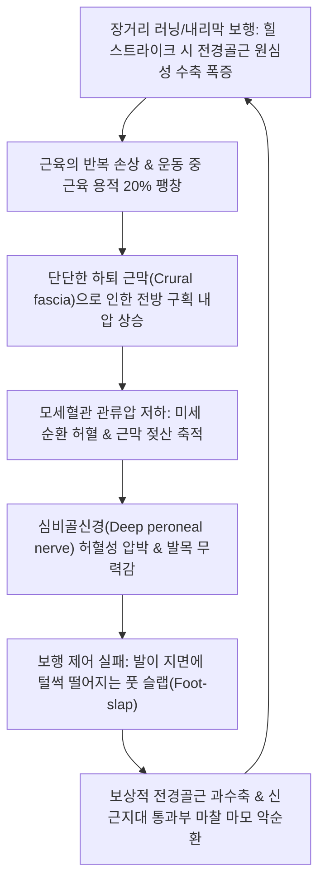
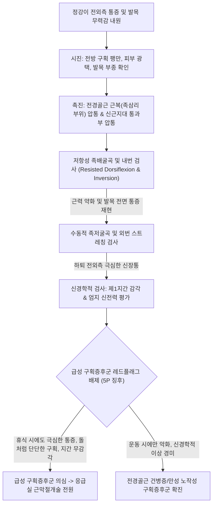
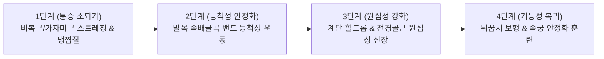

# 🩺 전경골근 증후군 (Tibialis Anterior Syndrome)

> **핵심 3줄 요약 (Key Summary)**:
> - 📍 병소 부위 & 해부·병태생리: 경골 외측면 상부 2/3에서 기원하여 내측 설상골과 제1중족골 저부에 정지하는 [[전경골근]](Tibialis anterior)의 근복, 상·하 십자인대 지대(Extensor retinaculum) 통과 부위, 또는 하지 전방 구획(Anterior compartment) 내부에서 만성 과부하로 발생하는 건병증, 건초염 및 만성 노작성 구획증후군(CECS).
> - 🚩 전형적 임상 양상: 달리기·경사로 보행 후 전경골근 근복(하퇴 외측 전면) 및 발목 전내측의 뻐근하고 터질 듯한 팽만 통증, 보행 시 발목을 들어 올릴 때의 날카로운 건 마찰음(Crepitus) 및 조기 피로로 인한 [[족하수]](Foot drop) 경향(발을 질질 끄는 보행).
> - 🛠️ 핵심 검사 & 치료 전략: 저항성 족배굴곡 및 내번(Inversion) 검사상 통증 재현, 족저굴곡 시 수동 신장통, 전방 구획 내압 측정. [[족삼리]](ST36), [[상거허]](ST37), [[조구]](ST38), [[풍륭]](ST40), [[해계]](ST41) 침구 치료, 근막 절개술에 준하는 도침(Acupotomy) 전방 구획 감압술, [[신바로약침]] 항염증 재생, 길항근인 [[가자미근]]·[[비복근]] 이완 스트레칭.
> - ⚠️ 응급 의뢰 레드플래그: 급성 외상 후 하지 전방 구획의 돌처럼 단단한 팽창, 제1지간(엄지-검지 사이) 무감각([[심비골신경]] 마비), 수동 족저굴곡 시 비명을 지르는 극심한 신장통(급성 전방 구획증후군 의심 즉각 응급실 근막절개술 전원 필수).

---

## 📌 목차
1. [질환 개요 & 해부학적 병태생리](#1-질환-개요--해부학적-병태생리)
2. [병태생리 메커니즘 & 생체역학적 악순환 네트워크](#2-병태생리-메커니즘--생체역학적-악순환-네트워크)
3. [임상 증상 & 이학적 검사(Physical Exam) 알고리즘](#3-임상-증상--이학적-검사physical-exam-알고리즘)
4. [감별 진단 매트릭스 (Differential Diagnosis)](#4-감별-진단-매트릭스-differential-diagnosis)
5. [한의 통합 치료 프로토콜 (침·약침·추나·한약)](#5-한의-통합-치료-프로토콜-침약침추나한약)
6. [양방 치료 & 병용·의뢰 기준 (Conventional Treatment & Referral)](#6-양방-치료--병용의뢰-기준-conventional-treatment--referral)
7. [재활 운동 & 생활습관 티칭 가이드](#7-재활-운동--생활습관-티칭-가이드)
8. [💡 사용자 진료실 핵심 필기 & 임상 노하우 (Melt-In 잔여 심화 집약)](#8-💡-사용자-진료실-핵심-필기--임상-노하우-melt-in-잔여-심화-집약)
9. [출처 및 학술 참고 문헌 (References)](#9-출처-및-학술-참고-문헌-references)

---

## 1. 질환 개요 & 해부학적 병태생리

* **질환 정의**:
  * 전경골근 증후군(Tibialis Anterior Syndrome)은 발목의 가장 강력한 족배굴곡근(Dorsiflexor)이자 내번근(Invertor)인 [[전경골근]](Tibialis anterior)과 그 건(Tendon), 건초(Tendon sheath), 그리고 근육이 수용된 하지 전방 구획(Anterior compartment)에 과도한 기계적 스트레스가 누적되어 발생하는 복합 과사용 질환군이다.
  * 질환 스펙트럼:
    1. **전경골근 근막통증증후군(MPS)**: 근복 내 활성 통증유발점(TrP)으로 인한 하퇴 전외측 및 모지 족배면 연관통.
    2. **전경골근 건병증 및 건초염(Tendinopathy & Tenosynovitis)**: 발목 굴근지대(Extensor retinaculum) 하방 통과 부위 및 제1중족골 부착부의 마찰성 마모.
    3. **만성 노작성 전방 구획증후군(Chronic Exertional Compartment Syndrome, CECS)**: 운동 중 근내압 상승으로 인한 허혈성 통증.

* **해부학적 구조 & 경계**:
  * **기시와 정지**: 경골 외측 과 및 경골 외측면 상부 2/3, 골간막(Interosseous membrane)에서 기원하여, 발목 전내측 상·하 신근지대 아래를 지나 제1설상골(Medial cuneiform) 내측면과 제1중족골(1st metatarsal) 저부에 정지한다.
  * **신경 및 혈관 지배**:
    * 신경: [[심비골신경]](Deep peroneal nerve, L4, L5). (마비 시 족하수 및 제1지간 족배부 감각 소실 유발).
    * 혈관: 전경골동맥(Anterior tibial artery).
  * **하지 전방 구획의 폐쇄적 특성**:
    * 전방 구획은 내측의 경골 골간, 외측의 비골, 후방의 골간막, 전방의 두껍고 신장성이 없는 하퇴 근막(Crural fascia)으로 둘러싸인 단단하고 신축성 없는 '밀폐된 방'이다.
    * 구획 내에는 전경골근, 장지신근([[extensor digitorum longus]]), 장무지신근([[extensor hallucis longus]]), 제3비골근, 심비골신경, 전경골동맥이 주행한다.

* **역학 및 유발 요인**:
  * 마라톤, 축구, 군대 행군, 경사로 하강 보행, 스키, 등산 등 반복적으로 발목을 족배굴곡하거나 착지 시 원심성 수축을 요하는 활동자에서 다발한다.
  * 신발 끈을 발목 전면에 너무 꽉 묶어 신근지대를 압박하는 습관, 낡은 러닝화 착용, 편평족(과회내로 인한 전경골근 건 견인 스트레스 증가).

---

## 2. 병태생리 메커니즘 & 생체역학적 악순환 네트워크

* **보행 생체역학(Biomechanics of Gait)과 손상 기전**:
  * **보행 주기 초기 접지기(Initial Contact to Loading Response)**: 발뒤꿈치가 땅에 닿을 때 발이 지면에 쾅 떨어지지 않도록 전경골근이 강력한 **원심성 수축(Eccentric contraction)**을 하여 족저굴곡 속도를 감속 제어한다. 하강 경사로를 달릴 때 이 감속 부하가 체중의 3~5배로 폭증한다.
  * **유각기(Swing Phase)**: 발가락이 지면에 걸리지 않도록 발목을 들어 올리는 동심성 수축(Concentric contraction)을 수행한다.
* **만성 노작성 구획증후군(CECS)의 내압 기전**:
  * 정상적으로 운동 시 근육 혈류 증가로 부피가 20%까지 팽창하지만, 하퇴 근막이 유연하지 못한 환자는 전방 구획 내압이 30mmHg 이상으로 급상승하여 정맥 유출이 차단되고 국소 허혈성 동통과 저림이 발생한다.
* **신근지대 통과부 협착성 건초염 (Entrapment Tenosynovitis)**:
  * 발목 굴곡 각도가 반복 전환될 때 상·하 십자인대 신근지대 밑을 지나는 전경골근 건 표면이 지대와 마찰하여 활액막염, 건 비후, 건초 삼출액 저류를 초래한다.

---

## 3. 임상 증상 & 이학적 검사(Physical Exam) 알고리즘

### 임상 증상

* **전방 하퇴 및 발목 통증**:
  * 정강이뼈 바깥쪽 근육 부위(하퇴 전외측)가 뻐근하고 터질 듯이 부풀어 오르는 느낌(Tightness, Fullness).
  * 걷거나 뛸 때 발목 앞쪽 주름(해계혈 부위)에서 삐걱거리는 마찰음과 날카로운 통증.
* **노작성 통증 패턴 (Exertional Pattern)**:
  * 운동 시작 후 일정 시간(예: 15~20분 달리기 후)이 지나면 어김없이 통증이 극심해져 달리기를 중단해야 하며, 쉬면 15~30분 내로 통증이 서서히 소실된다.
* **보행 이상 및 신경 압박 증상**:
  * 피로 시 발목을 위로 젖히는 힘이 빠져 발끝이 바닥에 걸려 넘어질 뻔함(Foot drop, Scuffing toes).
  * 엄지발가락과 둘째 발가락 사이(제1지간 족배부, 태충혈 부위)의 저림 및 무감각(심비골신경 감각지 압박).

### 이학적 검사 (Physical Examination)

1. **저항성 족배굴곡 및 내번 검사 (Resisted Dorsiflexion/Inversion Test)**:
   * 환자에게 발목을 위로 젖히고 안쪽으로 비틀게 한 뒤 검사자가 강하게 반대 방향(족저굴곡+외번)으로 누른다. 전경골근 근복 또는 발목 건 부위에서 뚜렷한 통증과 근력 저하가 유발된다.
2. **수동적 과도 족저굴곡 스트레칭 (Passive Plantarflexion Test)**:
   * 무릎을 편 상태에서 검사자가 발목을 최대로 아래로 꺾고 외번시킬 때, 전경골근이 팽팽하게 늘어나면서 전방 구획과 건에 견인통이 재현된다.
3. **신근지대 마찰음 촉진 (Crepitus Palpation)**:
   * 검사자의 손바닥을 발목 전면(해계혈 주위)에 올려놓고 환자에게 발목을 능동적으로 굽혔다 폈다 하게 할 때 거친 눈 밟는 소리(Snow-ball crepitation) 같은 마찰음이 촉지된다.
4. **심비골신경 기능 평가**:
   * 제1족지-제2족지 사이 족배부 피부 감각을 핀프릭(Pin-prick)으로 검사하고, 장무지신근 근력(엄지발가락 들어 올리기)을 확인한다.

---

## 4. 감별 진단 매트릭스 (Differential Diagnosis)

| 감별 질환 | 호발 원인 | 주 통증 부위 | 특징적 검사 소견 | 응급도 및 치료 방향 |
| :--- | :--- | :--- | :--- | :--- |
| **전경골근 증후군** | 러닝, 과사용, 구획내압 상승 | 하퇴 전외측 근복, 발목 전내측 | 저항성 족배굴곡통, 신근지대 마찰음, 노작성 팽만 | 보존적 치료, 도침 감압술, 휴식 |
| **급성 구획증후군 (ACS)** | 골절, 좌상, 깁스 압박 | 하지 전방 구획 전체 | **휴식 무관 극심한 동통**, 목판 같은 경도, 제1지간 무감각 | **외과적 응급 (6시간 내 근막절개술)** |
| **내측 경골 피로증후군 ([[신스프린트]])**| 달리기, 편평족 | 경골 내측 능선 후하방 1/3 | 경골 내측 골막 광범위 압통(>5cm), 족저굴근 연관 | 활동 조절, 족궁 지지, 보존적 치료 |
| **경골 피로골절** | 급격한 훈련량 증가 | 경골 전방 피질 국소 (Pinpoint) | 국소 뼈 압통(<2cm), 튜닝포크 양성, 뼈스캔/MRI 골절선 | 6~8주 완전 체중 부하 제한 |
| **총비골신경 포착증후군** | 비골두 외측 압박 | 비골두 하방, 하퇴 외측면 | 비골두 부위 티넬 징후 양성, 족배굴곡 및 외번 동시 마비 | 비골두 주변 감압, 보조기 착용 |
| **요추 5번(L5) 신경근병증** | 추간판 탈출증, 협착증 | 요둔부 → 대퇴 외측 → 하퇴 전외측 | 하지직거상(SLR) 양성, 기침 시 방사통, 엄지 신전 약화 | 척추 추나, 신경 차단술, 한약 |

---

## 5. 한의 통합 치료 프로토콜 (침·약침·추나·한약)

### 침구 치료 프로토콜

* **혈위 선정**:
  * 족양명위경(足陽明胃經) 주치 혈위: [[족삼리]](ST36), [[상거허]](ST37), [[조구]](ST38), [[하거허]](ST39), [[풍륭]](ST40), [[해계]](ST41).
  * 보조 혈위: [[양릉천]](GB34, 筋會), [[광명]](GB37), [[태충]](LR3), [[중봉]](LR4).
* **자침 기법**:
  * 전경골근 근복 심부 자침: [[족삼리]]와 [[상거허]] 부위에서 경골 외측면에 밀착하여 30~40mm 깊이로 직자하여 근육 내부의 단단한 통증유발점을 사타(Twitching)시킨다.
  * 건초 주변 투자법(Penetration Needling): 발목 전면 [[해계]]혈을 중심으로 상·하 신근지대 아래로 침체를 수평에 가깝게 눕혀 자입함으로써 건초 내 활액 순환을 유도한다.
* **전기침(EA) 프로토콜**:
  * [[족삼리]]-[[조구]]에 전침을 연결하여 2Hz 저주파(연속파)를 15분간 통전하여 전경골근의 허혈성 근강직을 해소하고 근내 미세혈류를 급격히 증가시킨다.
* **도침 치료 (Acupotomy) - 전방 구획 감압술**:
  * 만성 노작성 구획증후군으로 하퇴 근막이 단단하게 경화된 환자의 경우, 경골 외측 1.5cm 지점의 긴장된 근막선상에서 도침으로 하퇴 근막을 종방향으로 2~3포인트 절개(소탁감압술)하여 구획 내압을 직접 떨어뜨린다. (전경골동맥 및 심비골신경 주행을 피해 표층 근막 위주로 안전하게 시술).

### 약침 치료 프로토콜

* **처방 약침**:
  * [[신바로약침]] (GCSB-5): 발목 전면 신근지대 건초 주변 및 전경골근 부착부([[해계]], [[중봉]])에 0.3~0.5cc 주입하여 건막 마찰로 인한 염증성 부종을 신속히 소퇴시킨다.
  * 중성어혈약침: 하퇴 전외측 근육 팽만통 부위에 피내 및 근막층으로 0.3cc 주입하여 국소 어혈과 젖산 축적을 배출한다.

### 추나의학적 접근 (Chuna Manual Therapy)

* **전경골근 근막 스트리핑 및 허혈성 압박 (Myofascial Release)**:
  * 환자를 앙와위로 눕히고 발목을 가볍게 족저굴곡시킨 상태에서, 한의사의 양 모지 또는 수근부를 이용해 경골 외측 결절부에서 발목 전면으로 근 섬유 주행 방향을 따라 깊게 누르며 미끄러져 내린다.
* **길항근인 비복근-가자미근 MET (Post-Isometric Relaxation)**:
  * 종아리 후방 근육이 뻣뻣하면 전경골근이 끊임없이 과부하를 받으므로, 하퇴 삼두근 신장 MET를 반드시 선행하여 족관절 배굴 가동역을 정상화한다.
* **거골 및 설상골 관절 가동술**:
  * 족관절 후방 활주(Posterior glide)와 제1설상골 하방 활주를 유도하여 전경골근 건 부착부의 생체역학적 장력을 감압한다.

### 변증별 한약 치료 (Herbal Medicine)

* **기체어혈(氣滯瘀血)형** (격렬한 훈련 후 하퇴 전면의 팽만 자통, 어두운 설태):
  * [[당귀수산]](當歸鬚散) 또는 [[신통축어탕]](身痛逐瘀湯) 가감: [[단삼]], [[당귀]], [[몰약]], [[유향]], [[우슬]]을 배합하여 구획 내 미세 울혈을 제거하고 종창을 가라앉힘.
* **간신휴손(肝腎虧損) & 근맥피로(筋脈疲勞)** (만성 건병증, 발목 무력감, 족하수 경향):
  * [[독활기생탕]](獨活寄生湯) 합 [[사물탕]] 가감: [[숙지황]], [[두충]], [[속단]], [[모과]], [[백작약]]을 사용하여 근막과 건에 영양을 공급하고 수축력을 강화.
* **습열하주(濕熱下注)형** (발목 건초 부위 열감, 종창, 삼출액 저류):
  * [[사묘환]](四妙丸) 또는 [[당귀점통탕]](當歸拈痛湯) 가감: 황백, 창출, 우슬, 의이인을 배합하여 관절 건초의 습열 염증을 청열이습.

---

## 6. 양방 치료 & 병용·의뢰 기준 (Conventional Treatment & Referral)

### 보존적 치료 및 수술 요법

* **경구 약물 및 물리치료**:
  * NSAIDs 단기 투약 및 냉찜질, 신근지대 마찰 부위의 마찰 방지 패드 부착.
* **체외충격파 치료 (ESWT)**:
  * 신근지대 하방 및 제1중족골 부착부 건병증에 집중형/방사형 충격파를 주 1회 적용하여 건 조직 신생 촉진.
* **근막절개술 (Fasciotomy)**:
  * 보존적 치료에 반응하지 않는 중증 만성 노작성 구획증후군(휴식 시에도 내압 30mmHg 이상)의 경우, 정형외과에서 내시경적 또는 개방성 전방 구획 근막절개술(Fasciotomy)을 시행하여 영구적으로 내압을 해소한다.

### 한의 병용 판단 및 의뢰 기준 (Referral Criteria)

* **한의 치료 우수 적응증**:
  * 만성 노작성 전경골근 통증 및 건초염 단계에서는 침·도침·약침 병용 치료가 근막절개술 이전의 가장 효과적인 비수술적 보존 치료법이다.
* **응급 외과적 의뢰 (Absolute Red Flags - 급성 구획증후군 5P 징후)**:
  * **Pain**: 진통제에 반응하지 않는, 손상 정도에 비해 비정상적으로 극심한 지속성 동통.
  * **Pallor**: 발끝의 창백 및 혈류 장애.
  * **Paresthesia**: 제1지간 족배부의 지속적 저림 및 무감각 (신경 허혈의 가장 빠른 지표).
  * **Paralysis**: 발목 및 엄지발가락 족배굴곡 완전 마비 (족하수).
  * **Pulselessness**: 족배동맥 맥박 소실 (후기 소견).
  * 위 징후 관찰 시 한의 치료를 즉시 중단하고 6시간 이내에 응급 정형외과로 긴급 전원한다.

---

## 7. 재활 운동 & 생활습관 티칭 가이드

### 단계별 재활 운동

* **1단계: 길항근(종아리 뒤쪽) 집중 스트레칭**:
  * 벽 밀기 종아리 스트레칭: 무릎을 편 상태([[비복근]])와 무릎을 살짝 구부린 상태([[가자미근]])에서 각각 뒤꿈치를 바닥에 붙이고 30초씩 신장한다. 종아리 뒤쪽의 유연성이 확보되어야 전경골근의 착지 부하가 절반으로 줄어든다.
* **2단계: 저항 밴드 족배굴곡 운동 (TheraBand Dorsiflexion)**:
  * 탄력 밴드를 발등에 걸고 발목을 몸 쪽으로 당기는 동심성 운동 및 천천히 버티며 내려놓는 원심성 제어 운동 (15회씩 3세트).
* **3단계: 뒤꿈치 보행 훈련 (Heel Walking)**:
  * 맨발로 발뒤꿈치만 땅에 딛고 앞발을 든 채 방 안을 1~2분간 걸어 다니며 전경골근의 지구력을 회복한다.
* **4단계: 단족 운동(Short Foot Exercise)**:
  * 발가락을 굽히지 않고 족궁(내측 종아치)을 끌어올려 족부 내재근을 강화함으로써 전경골근에 가해지는 견인 부하를 지지한다.

### 신발 및 일상생활 티칭

* **신발 끈 묶기 기법 (Lacing Technique)**:
  * 발목 바로 앞부분(신근지대 통과선)의 아일렛(신발 끈 구멍)을 건너뛰고 묶는 '윈도우 레이싱(Window lacing)' 기법을 적용하여 발등 압박을 제거한다.
* **내리막길 러닝 금지**:
  * 회복기 동안 오르막길보다 내리막길 달리기나 급경사 하강 보행을 엄격히 금지한다 (원심성 수축 과부하 차단).

---

## 8. 💡 사용자 진료실 핵심 필기 & 임상 노하우 (Melt-In 잔여 심화 집약)

* **진료실 임상 감별의 핵심 — "신스프린트인가, 전경골근 증후군인가?"**:
  * 환자가 "정강이가 아파요"라며 내원할 때 위치를 명확히 구분해야 한다.
  * 정강이뼈 **안쪽 능선**을 따라 아프면 내측 경골 스트레스 증후군([[신스프린트]], 후경골근/가자미근 기원)이고, 정강이뼈 **바깥쪽 불룩한 근육**이 아프면 전경골근 증후군이다. 치료 혈위와 스트레칭 방향이 정반대이므로 촉진 시 뼈의 내측과 외측을 반드시 구분한다.
* **도침 시술의 혈관·신경 안전 구역**:
  * 전경골근 근복을 도침으로 감압할 때는 반드시 경골 외측 능선에서 1~1.5cm 이내의 안전 구역에서만 시술해야 한다. 비골 쪽에 너무 가깝게 깊이 자입하면 심비골신경과 전경골동맥을 손상시킬 수 있으므로, 경골 골막을 안전 가이드 삼아 표층 근막 절개 위주로 시술한다.
* **족하수 호소 환자의 요추(L5) 디스크 감별**:
  * 발목 힘이 빠진다고 할 때, 단순히 전경골근 피로로 인한 족하수인지 L5 신경근병증으로 인한 진성 족하수인지 반드시 SLR 검사와 건반사(Achilles/Patellar reflex)로 감별해야 치명적 척추 질환의 치료 시기를 놓치지 않는다.

---

## 9. 출처 및 학술 참고 문헌 (References)

Desomer L et al. (2023). Outcomes of Platelet-Rich Plasma Infiltration and Weightbearing Cast Immobilization in Distal Tibialis Anterior Tendinopathy. *Foot Ankle Int*, 44(12): 1234-1242. PMID: 37964467

van Heeswijk K et al. (2026). The Curvature of the Crural Fascia Is Different in Anterior Leg Chronic Exertional Compartment Syndrome. *J Sci Med Sport*, 29(4): 310-318. PMID: 42660737

Gossett L et al. (2022). Gastrocnemius Recession for the Treatment of Tibialis Anterior Tendinopathy. *Foot Ankle Orthop*, 7(1): 2473011421S00213. PMID: 35097331
