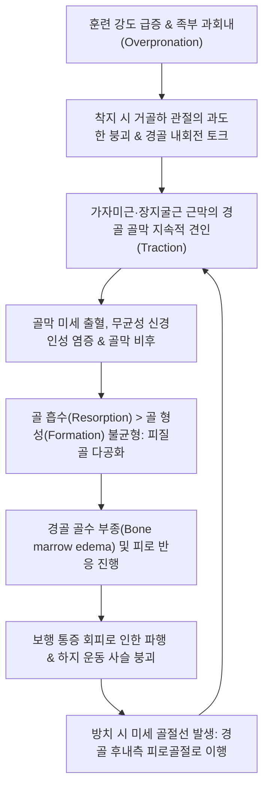
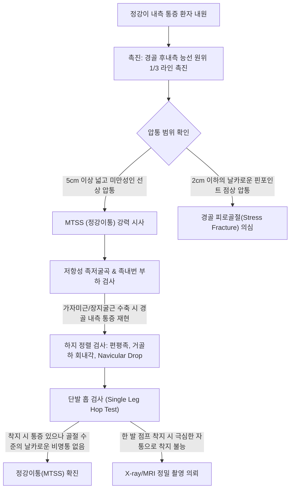
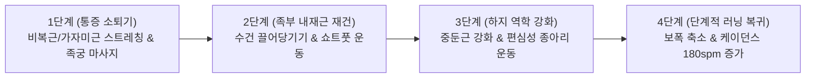

# 🩺 정강이통 (Shin Splints / Medial Tibial Stress Syndrome, MTSS)

> **핵심 3줄 요약 (Key Summary)**:
> - 📍 병소 부위 & 해부·병태생리: 경골 후내측 능선(Posterior-medial border) 원위 1/3 부위에서 [[가자미근]](Soleus), [[후경골근]](Tibialis posterior), [[장지굴근]](Flexor digitorum longus)의 근막 견인력(Traction force)과 보행·러닝 시 경골에 가해지는 반복 굽힘 응력(Bending stress)으로 인해 발생하는 골막염(Periostitis) 및 피질골 스트레스 반응.
> - 🚩 전형적 임상 양상: 러너, 군인, 무용수에서 훈련 초기 또는 운동량 급증 시 정강이 안쪽 모서리를 따라 5cm 이상 광범위하게 나타나는 둔통, 운동 시작 시 통증 후 웜업 시 완화되다 운동 후 재악화되는 특징적 경과.
> - 🛠️ 핵심 검사 & 치료 전략: 경골 후내측 능선 촉진 시 5cm 이상의 연속된 미만성 압통(Diffuse tenderness), 앙와위 저항성 족저굴곡 및 족내번 통증 재현, 피로골절과의 감별(국소 점상 압통 여부). [[비복근]]·[[가자미근]] 심부 이완, [[삼음교]](SP6)·[[누곡]](SP7)·[[지기]](SP8)·[[음릉천]](SP9) 침구 치료, 골막 자극술 및 [[신바로약침]] 항염증 재생술, 족궁 지지 깔창(Insole) 처방.
> - ⚠️ 응급 의뢰 레드플래그: 경골 전방 피질의 국소 핀포인트 압통 및 야간 안정통([[경골 피로골절]] 전방 피질형 의심 정형외과 정밀 MRI 의뢰), 하지 감각 이상 및 족배동맥 맥박 소실([[급성 구획증후군]] 의심).

---

## 📌 목차
1. [질환 개요 & 해부학적 병태생리](#1-질환-개요--해부학적-병태생리)
2. [병태생리 메커니즘 & 생체역학적 악순환 네트워크](#2-병태생리-메커니즘--생체역학적-악순환-네트워크)
3. [임상 증상 & 이학적 검사(Physical Exam) 알고리즘](#3-임상-증상--이학적-검사physical-exam-알고리즘)
4. [감별 진단 매트릭스 (Differential Diagnosis)](#4-감별-진단-매트릭스-differential-diagnosis)
5. [한의 통합 치료 프로토콜 (침·약침·추나·한약)](#5-한의-통합-치료-프로토콜-침약침추나한약)
6. [양방 치료 & 병용·의뢰 기준 (Conventional Treatment & Referral)](#6-양방-치료--병용의뢰-기준-conventional-treatment--referral)
7. [재활 운동 & 생활습관 티칭 가이드](#7-재활-운동--생활습관-티칭-가이드)
8. [💡 사용자 진료실 핵심 필기 & 임상 노하우 (Melt-In 잔여 심화 집약)](#8-💡-사용자-진료실-핵심-필기--임상-노하우-melt-in-잔여-심화-집약)
9. [출처 및 학술 참고 문헌 (References)](#9-출처-및-학술-참고-문헌-references)

---

## 1. 질환 개요 & 해부학적 병태생리

* **질환 정의**:
  * 정강이통(Shin Splints)은 스포츠 의학에서 가장 흔하게 접하는 운동 유발성 하지 통증 증후군으로, 현대 의학적 정식 명칭은 **내측 경골 스트레스 증후군(Medial Tibial Stress Syndrome, MTSS)**이다.
  * 달리기, 점프 등 체중 부하 활동 중 경골 후내측 능선 부착부의 골막(Periosteum)과 인접 피질골에 반복적인 생체역학적 하중이 누적되어 발생하는 만성 견인성 골막염 및 골 피로 손상 연속체(Bone stress continuum)이다.

* **해부학적 구조 & 견인 근육군**:
  * **병소 부위**: 경골(Tibia) 후내측 능선의 중간 및 원위 1/3 경계부 (내측 복사뼈 상방 5~15cm 구역).
  * **연관 근막 및 근육**:
    * 전통적으로는 [[후경골근]](Tibialis posterior)이 주원인으로 지목되었으나, 최근 조직해부학적 연구에 따르면 심부 하퇴 근막(Deep crural fascia)을 공유하는 **[[가자미근]](Soleus) 내측 섬유**와 **[[장지굴근]](Flexor digitorum longus, FDL)**의 기시부 견인력이 골막에 가장 강력한 장력을 가하는 것으로 밝혀졌다.
  * **경골 굽힘 응력(Bending Stress)**:
    * 보행 시 지면 반발력(Ground reaction force)에 의해 경골은 전방 및 외측으로 활처럼 휘어지는 굽힘 모멘트를 받으며, 후내측 피질골에는 압축 응력과 전단 응력이 동시에 집중된다.

* **역학 및 위험 요인**:
  * 마라톤 러너의 15~20%, 군 훈련병의 20~35%에서 발생할 정도로 흔한 대표적 과사용 손상이다.
  * 내재적 요인: 족부 과회내(Overpronation, 편평족), 높은 체질량지수(BMI), 발목 족배굴곡 가동역 감소, 고관절 외회전근([[중둔근]]) 근력 약화, 여성(골밀도 및 역학적 취약성).
  * 외재적 요인: 딱딱한 아스팔트 주행, 쿠션이 마모된 낡은 러닝화 착용, 주간 주행 거리나 훈련 강도의 급격한 증가(10% 법칙 위반).

---

## 2. 병태생리 메커니즘 & 생체역학적 악순환 네트워크

* **견인 가설(Traction Theory) vs 골 굽힘 피로 가설(Bone Bending Theory)**:
  * 1단계(견인 골막염): 발이 회내될 때 가자미근막이 경골 골막을 잡아당겨 골막 신경 말단을 자극하고 국소 염증을 유발.
  * 2단계(피질골 리모델링 지연): 골세포의 파골 반응이 조골 반응보다 우세해져 경골 후내측 피질골의 밀도가 국소적으로 감소.
  * 3단계(골 스트레스 손상): 치료 없이 훈련을 지속할 경우 골막염을 넘어 골수 부종(MRI 고신호) 및 현미경적 피로골절(Stress fracture)로 진전.
* **충격 흡수 실패의 악순환**:
  * [[가자미근]]과 [[비복근]]이 피로해지면 근육 자체의 충격 완충 능력이 상실되어, 착지 시 충격 에너지가 경골 피질골로 고스란히 전달되면서 골막 자극이 급격히 가속화된다.

---

## 3. 임상 증상 & 이학적 검사(Physical Exam) 알고리즘

### 임상 증상

* **특징적 동통 양상**:
  * 경골 안쪽 모서리를 따라 뻐근하게 쑤시고 타는 듯한 통증.
  * **전형적 병기별 통증 패턴**:
    * 1단계: 웜업(Warm-up) 전 운동 초기에만 아프고, 몸이 풀리면 통증이 사라지며 일상생활 지장 없음.
    * 2단계: 운동 시작 시 아프다가 중간에 다소 완화되나, 운동 종료 후 욱신거리는 통증 재발.
    * 3단계: 운동 도중 내내 심한 통증이 지속되어 훈련 수행 불가능, 계단이나 일상 보행 시에도 통증.
    * 4단계: 안정 시 및 야간에도 지속적인 통증 (피로골절 의심 단계).
* **통증 범위의 확산성**:
  * 통증 부위가 손가락 한마디에 국한되지 않고, 경골 내측 능선을 따라 5cm 이상 길게 연속적으로 나타난다.

### 이학적 검사 (Physical Examination)

1. **경골 후내측 연속 압통 검사 (Posteromedial Tibial Border Palpation)**:
   * 환자를 편안히 앉히고 무릎을 90도 굴곡시킨 상태에서, 경골 안쪽 뼈 모서리 바로 뒤쪽을 엄지로 강하게 훑어 올라간다. **최소 5cm 이상의 연속된 압통 구간**이 만져지면 MTSS의 핵심 소견이다.
2. **저항성 족내번 및 족저굴곡 검사 (Resisted Inversion & Plantarflexion)**:
   * 발목을 족저굴곡 및 내번시킨 상태에서 검사자가 반대 방향으로 힘을 가할 때, 경골 후내측 부착부에 기계적 견인통이 재현된다.
3. **주상골 하강 검사 (Navicular Drop Test)**:
   * 체중 비부하 상태와 전부하 상태에서 주상골 결절의 높이 차이를 측정. 10mm 이상 하강 시 과도한 회내(Overpronation)로 판정.
4. **단발 홉 검사 (Single Leg Hop Test)**:
   * 아픈 다리로 제자리에서 1회 또는 연속 점프를 시킨다. 피로골절 환자는 극심한 통증으로 착지가 불가능한 반면, MTSS 환자는 둔통을 느끼며 점프를 완수할 수 있다.

---

## 4. 감별 진단 매트릭스 (Differential Diagnosis)

| 감별 질환 | 압통 범위 및 특성 | 통증 발생 시점 | 영상의학적 소견 | 치료 및 예후 |
| :--- | :--- | :--- | :--- | :--- |
| **정강이통 (MTSS)** | 경골 후내측 **5cm 이상 미만성 선상 압통** | 운동 초기 악화 → 웜업 시 완화 | 초기 X-ray 정상, MRI상 골막하 부종 | 2~4주 훈련량 조절, 한의 보존 치료 |
| **[[경골 피로골절]]** | 경골 전방/후내측 **1~2cm 점상 핀포인트 압통** | 휴식 시에도 지속, **야간통** | 2~3주 후 X-ray 가골 형성, MRI 골절선 | 6~8주 완전 체중 부하 제한(목발) |
| **만성 노작성 구획증후군** | 하퇴 전방/후방 구획 근복의 팽만통 | 운동 중 급격한 내압 상승, 휴식 시 소실 | 구획 내압 측정기 30mmHg 이상 | 근막 감압 침/도침, 중증 시 근막절개술 |
| **심부정맥 혈전증 (DVT)** | 종아리 전체 부종, 열감, Homan 양성 | 보행 무관 지속적 팽창통 | 혈관 도플러 초음파상 혈전 관찰 | **응급 항응고 요법 전원** |
| **신경 포착 (복재신경)** | 경골 내측 원위부~발목 내측 이상감각 | 티넬 징후 양성, 찌릿한 방사통 | 근전도 검사상 감각 신경 전도 지연 | 신경 주위 약침, 감압 치료 |

---

## 5. 한의 통합 치료 프로토콜 (침·약침·추나·한약)

### 침구 치료 프로토콜

* **혈위 선정**:
  * 족태음비경(足太陰脾經) 주치 혈위: [[삼음교]](SP6), [[누곡]](SP7), [[지기]](SP8, 郄穴), [[음릉천]](SP9).
  * 족태양방광경 배합 혈위 (종아리 후방 근막 이완): [[승산]](BL57), [[승간]](BL56), [[합양]](BL55).
  * 보조 혈위: [[태계]](KI3), [[태충]](LR3), [[족삼리]](ST36).
* **골막 자극술 (Periosteal Needling) — 핵심 기법**:
  * 경골 후내측 능선 압통 구간을 따라 호침을 골막 표면에 직각 또는 45도 각도로 접촉시킨 뒤, 가볍게 골막을 톡톡 자극(Pecking)하여 골막하 미세 순환을 촉진하고 조골세포 활성 인자를 유도한다.
* **전기침(EA) 치료**:
  * [[누곡]]-[[지기]]에 전침을 걸고 2/100Hz 혼합파를 15분간 통전하여 국소 신경펩티드 분비를 억제하고 통증 역치를 높인다.
* **도침 치료 (Acupotomy)**:
  * 가자미근막과 경골 골막이 만성적으로 섬유화되어 단단한 결절이 형성된 부위에 한하여, 뼈 능선과 평행하게 침도를 자입하여 골막 부착부 섬유성 유착을 1~2포인트 최소 박리한다.

### 약침 치료 프로토콜

* **처방 약침**:
  * [[신바로약침]] (GCSB-5): 경골 후내측 능선 골막 주변으로 0.1~0.2cc씩 3~4포인트 분할 주입하여 만성 골막염의 염증성 매개체를 차단하고 골막 재생을 유도한다.
  * 중성어혈약침: 훈련 직후 급성 열감과 팽만감이 동반된 경우 골막 피하로 0.3cc 시술.

### 추나의학적 접근 (Chuna Manual Therapy)

* **하퇴 심부 굴근군 근막 이완 기법 (Deep Posterior Compartment MFR)**:
  * 환자를 측와위로 눕히고 이환측 무릎을 가볍게 굴곡시킨 상태에서, 한의사의 양 모지로 경골 후내측 능선 안쪽으로 파고들어가 [[가자미근]]과 [[장지굴근]]을 골막에서 외측으로 떼어내듯 심부 스트리핑을 시행한다.
* **거골하 관절(Subtalar Joint) 회내 교정 추나**:
  * 과도한 회내를 유발하는 거골하 관절의 외번 변위를 내번 방향으로 유도하고 족궁 가동성을 정상화한다.
* **비골두 및 거골 후방 활주 추나**:
  * 발목의 족배굴곡 가동역 제한을 해소하여 달리기 착지 시 경골에 가해지는 굽힘 하중을 분산시킨다.

### 변증별 한약 치료 (Herbal Medicine)

* **기체어혈(氣滯瘀血)형** (초기 격렬한 자통, 야간 욱신거림, 설하정맥 노창):
  * [[신통축어탕]](身痛逐瘀湯) 또는 [[당귀수산]](當歸鬚散) 가감: [[단삼]], [[당귀]], [[몰약]], [[유향]], [[우슬]], [[홍화]]를 배합하여 골막 주위 어혈을 제거.
* **간신부족(肝腎不足) & 근골피로(筋骨疲勞)** (만성 재발성, 피로골절 전조 단계, 뼈가 쑤시는 둔통):
  * [[독활기생탕]](獨活寄生湯) 합 [[육미지황탕]] 가감: [[두충]], [[속단]], [[구척]], [[골쇄보]], [[백작약]]을 대용량 배합하여 골밀도와 피질골 대사를 강화.
* **기혈양허(氣血兩虛)형** (마른 체형, 훈련 후 피로감 극심, 종아리 쥐남):
  * [[작약감초탕]](芍藥甘草湯) 합 [[보중익기탕]](補中益氣湯): 근경련을 진정시키고 하지 말초 순환을 개선.

---

## 6. 양방 치료 & 병용·의뢰 기준 (Conventional Treatment & Referral)

### 보존적 치료 (Conservative Treatment)

* **활동 조절 및 충격 차단**:
  * 통증을 유발하는 고충격 러닝 및 점프 활동을 즉각 중단하고, 무충격 유산소 운동(수영, 아쿠아 조깅, 고정식 실내 자전거)으로 대체.
* **체외충격파 치료 (ESWT)**:
  * 방사형(Radial) 충격파를 경골 후내측 능선 연부조직에 적용하고, 집중형(Focused) 충격파를 피질골 부착부에 조사하여 골 리모델링을 촉진. (주 1회, 총 4~6회).
* **맞춤형 족부 보조기 (Custom Foot Orthotics)**:
  * 족부 과회내 환자에게 내측 족궁 지지대(Arch support) 및 후족부 내반 쐐기(Varus heel wedge) 처방.

### 한의 병용 판단 및 의뢰 기준 (Referral Criteria)

* **병용 요법의 시너지**:
  * 소염진통제는 단기 통증 완화에 유효하나 뼈 치유를 지연시킬 수 있으므로, 침·골막 자극술 및 신바로약침을 병용하여 NSAIDs 복용 기간을 단축하고 훈련 복귀를 앞당긴다.
* **정밀 검사 및 전원 기준 (Red Flags)**:
  * 2cm 이하의 국소 부위에서 손가락 끝으로 뼈를 두드릴 때 소름 돋는 통증이 나타나는 경우 ([[경골 피로골절]] 감별 위한 MRI 의뢰).
  * 2주간의 완전 휴식에도 불구하고 체중 부하 시 날카로운 뼈 통증이 지속되는 경우.
  * 하퇴 전방 구획의 극심한 긴장, 족배부 감각 저하가 동반되는 경우 ([[급성 구획증후군]] 의심).

---

## 7. 재활 운동 & 생활습관 티칭 가이드

### 단계별 재활 운동

* **1단계: 하퇴 삼두근 및 족저근막 스트레칭**:
  * 가자미근 벽 스트레칭: 무릎을 굽힌 상태로 발꿈치를 바닥에 붙여 30초 유지 (가자미근의 골막 견인력 해소).
  * 골프공/마사지 볼 족저근막 롤링: 족궁의 긴장도를 이완.
* **2단계: 족부 내재근 강화 (Short Foot Exercise)**:
  * 발가락을 구부리지 않고 중족골두를 뒤꿈치 쪽으로 당겨 발 아치를 능동적으로 세우는 훈련 (10초 유지, 15회).
  * 수건 발가락으로 끌어당기기(Towel curls).
* **3단계: 고관절 외전근([[중둔근]]) 강화**:
  * 클램쉘(Clamshell) 및 사이드 라잉 레그 레이즈: 골반이 흔들리지 않아야 달릴 때 무릎이 안쪽으로 꺾이지 않고 경골에 걸리는 회전 토크가 감소함.
* **4단계: 러닝 폼 및 케이던스 교정 티칭**:
  * **케이던스(Cadence) 증가**: 분당 걸음 수를 170~180spm으로 높이고 보폭을 10% 줄이면, 착지 시 무릎과 정강이에 가해지는 지면 충격이 20% 이상 급감한다.

### 신발 및 훈련 환경 관리

* **러닝화 교체 주기**:
  * 러닝화의 충격 흡수 중창(Midsole) 수명은 500~700km이므로 주기적으로 교체한다.
* **쿠션 지면 훈련**:
  * 딱딱한 아스팔트나 콘크리트 대신 우레탄 트랙, 흙길, 잔디밭에서 훈련한다.

---

## 8. 💡 사용자 진료실 핵심 필기 & 임상 노하우 (Melt-In 잔여 심화 집약)

* **진료실 감별의 절대 공식 — "5cm 법칙"**:
  * 환자가 정강이가 아프다고 할 때 가장 먼저 해야 할 일은 손가락으로 누르는 범위의 길이를 재는 것이다.
  * 아픈 부위가 뼈를 따라 **5cm 이상 길게 아프면 90% 이상 단순 정강이통(MTSS)**이다.
  * 반대로 통증 부위가 **손가락 한 마디(1~2cm)로 딱 짚어지고 누를 때 자지러지게 아프면 피로골절**이므로 절대로 침을 강하게 놓거나 뛰게 해서는 안 되며, 즉시 X-ray/MRI를 찍어 깁스 고정을 고려해야 한다.
* **족궁 무너짐 교정 없이는 100% 재발**:
  * 정강이만 침을 놓아 증상이 호전되어도 환자가 다시 뛰면 일주일 만에 재발한다. 원인은 100% 착지 시 발목이 안쪽으로 무너지는 평발(과회내)이다.
  * 진료실에서 환자에게 아치 서포트 인솔을 권유하거나, 족부 테이핑(Low-Dye taping)을 해준 채로 걷게 하면 즉석에서 정강이 통증이 절반으로 줄어드는 것을 확인할 수 있다.
* **골막 자극술의 강도 조절**:
  * 경골 능선 골막 자극술은 매우 강력한 치료법이지만, 급성 염증기에 너무 거칠게 골막을 긁으면 시술 후 2~3일간 극심한 뼈 통증(Post-needling soreness)을 유발할 수 있다. 침 끝으로 가볍게 톡톡 2~3회 접촉하는 섬세한 자극이 부작용 없이 효과를 극대화한다.

---

## 9. 출처 및 학술 참고 문헌 (References)

Bouamama A et al. (2026). Impact of targeted lower-limb exercises on biomechanical and neuromuscular risk factors associated with medial tibial stress syndrome. *Sports Biomech*, 25(3): 145-156. PMID: 42733254

Thang Nguyen Q et al. (2026). Minimalist Footwear Acutely Alters Running Kinematics in Runners With Medial Tibial Stress Syndrome. *Arthrosc Sports Med Rehabil*, 8(2): e451-e460. PMID: 42382326

Zhang Z et al. (2026). Mechanistic Links Between Proximal Joint Strength and Tibial Loading in Runners With Medial Tibial Stress Syndrome. *Arch Phys Med Rehabil*, 107(5): 780-790. PMID: 42248231
