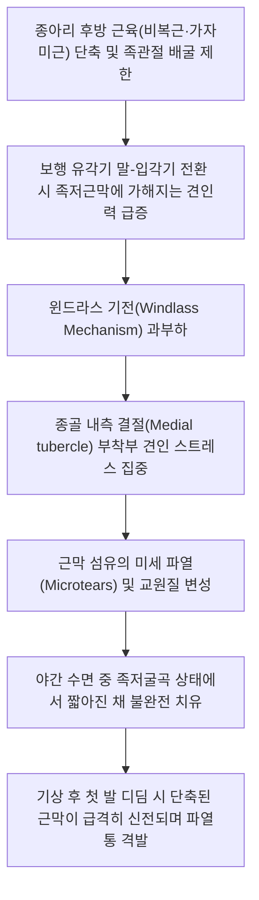

# 족저근막염 (Plantar Fasciitis)

> **핵심 3줄 요약 (Key Summary)**:
> 🎯 아침 기상 직후 첫 발을 디딜 때나 오래 앉아 있다가 일어설 때 발뒤꿈치 종골 내측 결절 부위에 찢어지는 듯한 격통이 발생하는 대표적 족부 과사용 질환.
> 🚩 단순 염증보다는 반복적인 미세 파열과 불완전한 치유로 인한 근막 섬유의 퇴행성 변화(Fasciosis) 및 윈드라스 기전(Windlass mechanism) 과부하가 핵심 병태생리.
> 🔬 [[비복근]]·[[가자미근]]·[[전경골근]]의 단축과 내재근 원심성 수축 과부하가 선행하며, 종골 부착부 도침(Acupotomy) 박리술, 봉약침 및 곤륜·태계·승산 전침·로우다이(Low-Dye) 테이핑 시행.
> ⚠️ 뒤꿈치 골극(Calcaneal spur)은 통증의 직접 원인이 아니므로 절제할 필요가 없으며, 쿠션 화선택, 아킬레스건 신장 스트레칭 및 족저 롤링 마사지 필수 지도.

---

## 1. 개요 및 역학 (Overview & Epidemiology)

족저근막염(Plantar Fasciitis)은 성인 발뒤꿈치 통증(Heel pain)의 가장 흔한 원인 질환으로, 종골(Calcaneus)에서 시작하여 발가락 기저부로 뻗어나가는 두껍고 강인한 섬유띠인 **족저근막(Plantar aponeurosis)**에 과도한 기계적 인장 부하가 누적되어 발생합니다.

명칭에는 '염(-itis)'이 붙어 있으나, 실제 조직학적 검사에서는 급성 염증 세포(중구백혈구)보다는 콜라겐 섬유의 변성, 점액양 변성(Myxoid degeneration), 미세 혈관 증식 및 섬유아세포 과증식이 두드러지는 **'족저근막증(Plantar Fasciosis)'**에 가깝습니다.

![[족저근막염_통증호발부위_도해.jpg|400]]
> [족저근막염 통증 호발 부위 도해: 종골 내측 결절(Medial calcaneal tubercle) 부착부 52% 최고 빈도, 내측 종아치 14%, 중족골두 부위 8% 통증 분포]

### 1) 역학적 특징
* **유병률**: 일반 인구의 약 10%가 일생 중 한 번 이상 경험하며, 러너(달리기 주자)의 약 10~15%에서 발생하는 대표적 스포츠 손상입니다.
* **호발 연령**: 40~60대 중장년층에서 호발하며, 과체중(BMI $\ge 30$)인 사람과 마라톤, 농구, 에어로빅 등 발바닥에 충격이 반복되는 운동선수에서 빈발합니다.
* **성별**: 여성에서 남성보다 약 1.5~2배 다발하며, 폐경 후 발바닥 지방 패드(Heel fat pad)의 위축과 맞물려 급증합니다.

---

## 2. 병태생리 및 생체역학 (Pathophysiology & Biomechanics)

족저근막은 발의 내측 종아치(Medial longitudinal arch)를 유지하고, 보행 시 지면 반발력을 흡수하여 발을 단단한 지레(Rigid lever)로 전환시키는 핵심 생체역학적 구조물입니다.

![[족저근막_해부도_중앙부.png|350]]
> [족저근막(Plantar Aponeurosis) 사체 해부도: 종골 결절에서 기시하여 전족부 5개 발가락(B1~B5)으로 분지되는 강인한 섬유속 구조]

![[족저근막염_종골극_발꿈치통증_도해.png|500]]
> [족저근막염 환자의 발 시상면 MRI 영상: 종골 기시부 족저근막의 현저한 비후(>4.5mm), 골수 부종 및 견인성 종골극(Calcaneal spur) 관찰]

### 1) 윈드라스 기전 (Windlass Mechanism)
* 닻을 감아올리는 도르래처럼, 보행 시 발가락(MTP 관절)이 배측굴곡(Dorsiflexion)되면 족저근막이 중족골두(Metatarsal head)를 감싸며 팽팽하게 당겨집니다.
* 이 견인력에 의해 발의 종아치가 높아지고 중족골과 족근골이 맞물려 단단한 지레를 형성하여 지면을 차고 나가는 추진력(Push-off)을 생성합니다.
* 이 과정이 수천~수만 번 반복되면 종골 기시부에 강력한 인장력(Tension)이 집중되어 미세 손상이 발생합니다.

### 2) 족지신근 과사용 및 족부 내재근 생체역학 (원장님 필기 반영)
* 보행의 추진(Push-off) 단계 동안 중족골두와 원위지골은 체중 하중을 지탱합니다.
* 지면 반발력은 원위지골에 작용하여 중족골두가 배측굴곡하는 모멘트를 유발합니다.
* 이에 대항하여 발바닥 내재근(단지굴근, 무지외전근)에 강한 원심성 수축(Eccentric contraction)이 발생하며 내재근을 과도하게 신장시킵니다.
* [[장지신근]]이나 신전근들이 발목을 과하게 족배굴곡시키면 내재근과 족저근막을 비정상적으로 강하게 잡아당겨 족저근막염을 촉발합니다.
* 또한 중족지관절(MTP)이 위로 구르면서 아래로 밀리고(Roll and slide), 원위지관절(DTP)은 지면 반발력에 의해 위로 꺾이면서 족저건막 부착부의 전단력(Shearing force) 손상이 증폭됩니다.

### 3) 족관절 배굴 제한과 종아리 근육 단축
* **[[비복근]]과 [[가자미근]]의 구축**: 아킬레스건이 팽팽해지면 발목의 족배굴곡이 10도 미만으로 제한됩니다.
* 이를 보상하기 위해 발이 과도하게 엎침(과회내, Overpronation)되면서 발의 아치가 무너지고 족저근막에 가해지는 신장 스트레스가 배가됩니다.
* 아치를 낮추는 힘과 족저굴곡에 관여하는 [[전경골근]] 및 후경골근의 불균형 역시 주요 병인으로 작용합니다.

---

## 3. 임상 증상 및 특징적 양상 (Clinical Features)

### 1) 특징적 통증 패턴 (Pathognomonic Pain)
* **기상 후 첫 발의 격통 (First-step Pain)**:
  * 밤새 수면 중에는 발목이 족저굴곡되어 족저근막이 수축된 상태로 짧아져 있습니다.
  * 아침에 일어나 첫 발을 디디는 순간 체중이 실리며 짧아져 있던 근막이 갑작스럽게 늘어나 미세 파열이 일어나며 바늘로 찌르는 듯한 찢어지는 통증이 발생합니다.
* **보행 후 완화, 지속 보행 시 재악화**:
  * 몇 발자국 걸으면 근막이 서서히 늘어나며 통증이 일시적으로 둔화되지만, 오후가 되어 활동량이 많아지거나 오래 서 있으면 다시 통증이 극심해집니다.
* **휴식 후 재기립 시 통증 (Start-up Pain)**:
  * 의자에 1시간 이상 앉아 있다가 일어설 때 첫 발을 디디기 힘듦.

---

## 4. 진단 및 이학적 검사 (Diagnosis & Physical Exam)

족저근막염은 정밀 검사 없이도 특징적인 병력과 신체 진찰만으로 90% 이상 진단이 가능합니다.

### 1) 진찰 및 압통점 촉진
* **종골 내측 결절(Medial Calcaneal Tubercle) 국소 압통**:
  * 발뒤꿈치 바닥면에서 약간 안쪽으로 치우친 종골 기시부를 엄지손가락으로 깊게 압박했을 때 환자가 움찔하며 극심한 국소 압통을 호소.

### 2) 윈드라스 검사 (Windlass Test)
* 환자를 의자에 앉히거나 체중 부하 상태에서 엄지발가락(제1 MTP 관절)을 수동적으로 강하게 배측굴곡(Dorsiflexion)시킵니다.
* 이로 인해 족저근막이 팽팽하게 긴장되면서 종골 결절 부착부에 환자가 평소 느끼던 통증이 그대로 유발되면 양성으로 확진합니다.

### 3) 영상 진단
* **단순 방사선(X-ray)**: 종골 하면의 골극(Calcaneal spur) 유무를 확인. 단, 골극은 족저근막의 만성 견인에 의한 2차적 골화 현상일 뿐 통증의 직접 원인이 아니며, 무증상 정상인의 15~20%에서도 관찰됩니다.
* **초음파(Ultrasound)**: 족저근막 기시부 두께를 측정. 정상은 3mm 미만이나, 족저근막염 환자는 **4.5mm 이상으로 비후**되어 있고 저에코성 변화(Hypoechoic lesion) 및 혈류 증가 소견을 보입니다.

---

## 5. 양방 치료 및 약리 (Pharmacotherapy & Conventional Care)

### 1) 보존적 치료 (First-line Conservative Care)
* **휴식 및 활동 제한**: 달리기, 점프, 오래 서 있기 등 체중 부하 활동을 중단.
* **약물 요법**: NSAIDs(소염진통제)를 급성기 통증 완화를 위해 2~4주간 단기 처방.
* **족저 테이핑 (Low-Dye Taping)**: 비탄력성 테이프를 발바닥 아치와 뒤꿈치에 부착하여 족저근막의 인장 부하를 기계적으로 차단.
* **야간 부목 (Night Splint)**: 수면 중 발목을 90도 배측굴곡 상태로 고정하여 근막이 단축된 채 치유되는 것을 방지.

### 2) 체외충격파 치료 (ESWT)
* 만성 난치성 족저근막염(6개월 이상 지속)의 표준 중재법.
* 기계적 충격파를 가해 미세 손상을 유도함으로써 국소 신생 혈관 생성(VEGF)과 성장인자 분비를 촉진하여 조직 재생 유도.

### 3) ⚠️ 국소 스테로이드 주사(Corticosteroid Injection)의 위험성
* 급성 통증 감소 효과는 강력하나, 반복 주사 시 **발바닥 지방 패드 위축(Fat pad atrophy)** 및 **족저근막의 영구적 완전 파열(Rupture)**이라는 치명적 합병증을 초래하므로 최소한으로 제한해야 합니다.

---

## 6. 한의학적 변증 및 치료 (Traditional Korean Medicine)

한의학에서 족저근막염은 **족근통(足跟痛)**, **각기(脚氣)**, **어혈(瘀血)**, **신허(腎虛)**의 범주에 속합니다. 

신주골(腎主骨) 원리에 따라 노화나 과로로 인한 신수(腎水) 부족과 과도한 하중으로 인한 국소 기혈어체(氣血瘀滯)를 주 병기로 파악합니다.

### 1) 변증 분류 및 대표 처방 (Syndrome Differentiation)

| 변증 유형 | 주증 및 설맥 | 병리 기전 | 대표 방제 | 구성 본초 |
| :--- | :--- | :--- | :--- | :--- |
| 기체어혈형 (實證) | 아침 기상 시 찌르는 격통, 국소 거안, 야간통, 설자암, 맥삽 | 과사용으로 인한 국소 미세혈관 파열 및 어혈 조체 | [[당귀수산]] 합 [[오적산]] | [[당귀]], [[도인]], [[홍화]], [[소목]], [[우슬]] |
| 신정부족·간신휴허형 (虛證) | 중장년층, 발바닥이 시리고 딛기 힘듦, 요슬산연, 맥침세 | 척추와 하지 골격을 지탱하는 간신 기혈의 쇠퇴 | [[육미지황탕]] 합 [[독활기생탕]] | [[숙지황]], [[산수유]], [[우슬]], [[두충]], [[상기생]] |
| 한습저락형 | 날씨가 궂거나 찬 바닥을 디디면 악화, 무거운 통증, 맥침완 | 풍한습 사기가 하지 경락에 침범하여 근맥 응체 | [[영선제통음]] 합 [[사물탕]] | [[위령선]], [[방풍]], [[강활]], [[백작약]], [[창출]] |

### 2) 도침 요법 (Acupotomy, 침도 치료)
* 만성 족저근막염 치료에서 가장 강력한 근거 수준을 가진 특효 시술.
* 종골 내측 결절 기시부의 만성적으로 두꺼워지고 유착된 반흔 조직(Scar tissue)을 날형 도침으로 미세 절개·박리(Release)하여 근막 내 비정상적 내압을 즉시 감압하고 새로운 콜라겐 조직 재생을 촉진.

### 3) 침구 치료 혈위 및 전침 자극
* **국소 및 근막 연계 혈위**:
  * 백충와, 아시혈(종골 내측 결절 통증 부위 직자).
  * 곤륜(BL60) + 태계(KI3): 아킬레스건 양측 함요처로 발목 관절 가동성 회복 및 신기 보충.
  * 승산(BL57) + 비양(BL58): [[비복근]]과 [[가자미근]]의 근건 이행부를 이완시켜 족저근막 견인력 해소.
  * 족삼리(ST36), 승간: [[전경골근]] 근복 이완.
* **봉약침 (Sweet Bee Venom)**: 멜리틴 성분의 강력한 항염·혈류 개선 작용을 통해 종골 부착부 0.05~0.1cc 피내/피하 주입.

---

## 7. 진료실 핵심 필기 및 실전 가이드 (Clinical Notes & Protocols)

### 1) 종아리 근육([[비복근]]·[[가자미근]]·[[전경골근]]) 이완의 절대적 중요성
* 족저근막염 환자가 오면 발바닥만 치료해서는 절대 완치되지 않습니다.
* 발바닥을 잡아당기는 원선(Cable)은 종아리 후방의 비복근과 가자미근입니다.
* 비복근 내측두와 승산혈(BL57) 부위의 단단한 경결 밴드(Taut band)를 침과 약침으로 풀어주면, 발목의 족배굴곡 각도가 즉시 5~10도 증가하면서 발바닥에 가해지는 텐션이 50% 이상 소실됩니다.

### 2) 실전 테이핑 (Low-Dye Taping) 요법
* 치료 직후 환자가 걸어 나갈 때 통증을 즉시 줄여주는 가장 탁월한 보조 도구입니다.
* 비탄력성 키네시오 테이프를 사용하여 외측 종골에서 시작하여 발바닥 내측 아치를 감아올려 거골하 관절의 과회내(Pronation)를 물리적으로 막아줍니다.
* 테이핑을 부착하는 것만으로 보행 시 족저근막에 걸리는 인장 응력이 30% 이상 경감됩니다.

### 3) 환자 자가 관리 및 스트레칭 티칭 (치료 성공의 핵심)
* **기상 전 스트레칭**:
  * 아침에 침대에서 발을 바닥에 딛기 전에, 수건이나 손으로 발가락 전체를 발등 쪽으로 30초간 강하게 당겨주는 스트레칭을 3회 반복한 후 일어나도록 지도합니다 (첫 발 파열통 방지).
* **골프공 / 얼린 생수병 롤링 마사지**:
  * 의자에 앉아 발바닥 아치 아래에 골프공이나 얼린 500ml 캔/생수병을 두고 뒤꿈치부터 발가락까지 지그시 누르며 5~10분간 굴려줍니다 (냉찜질과 근막 이완 동시 달성).
* **신발 선택 지도**:
  * 맨발 보행, 얇은 플랫슈즈, 쪼리(슬리퍼)는 발바닥의 사형 선고입니다.
  * 굽 높이가 2~3cm 정도 있고 쿠션감이 충분하며 아치를 지지해 주는 운동화를 실내에서도 슬리퍼 대신 착용하도록 지도합니다.

---

## 8. 참고문헌 및 최신 연구 (References)

* Thomas JL, Christensen JC, Kravitz SR, et al. The diagnosis and treatment of heel pain: a clinical practice guideline-revision 2010. *J Foot Ankle Surg*. 2010;49(3 Suppl):S1-S19. doi:10.1053/j.jfas.2010.01.001. [PubMed (PMID: 20439021)](https://pubmed.ncbi.nlm.nih.gov/20439021/)
  > [연구 요약] 미국족부족관절외과학회(ACFAS)의 공식 발뒤꿈치 통증 임상진료지침으로 족저근막염의 단계별 진단 알고리즘, 스트레칭, 야간 부목, 테이핑 및 보존적 중재의 근거 등급을 확립함.
* Martin RL, Davenport TE, Reischl SF, et al. Heel pain-plantar fasciitis: revision 2014. *J Orthop Sports Phys Ther*. 2014;44(11):A1-A33. doi:10.2519/jospt.2014.0303. [PubMed (PMID: 25361863)](https://pubmed.ncbi.nlm.nih.gov/25361863/)
  > [연구 요약] 미국정형물리치료학회(JOSPT)의 족저근막염 임상 가이드라인으로 윈드라스 검사, 종아리 근육 단축 교정 스트레칭, 수기치료 및 전기 물리치료의 중재 효과를 체계적으로 평가함.
* Zhang Q, Li J, Liu X, et al. Small needle-knife versus extracorporeal shock wave therapy for the treatment of plantar fasciitis: A systematic review and meta-analysis. *Heliyon*. 2024;10(2):e24538. doi:10.1016/j.heliyon.2024.e24538. [PubMed (PMID: 38234920)](https://pubmed.ncbi.nlm.nih.gov/38234920/)
  > [연구 요약] 족저근막염에 대한 소침도(도침, Acupotomy) 요법과 체외충격파(ESWT) 치료를 비교한 최신 체계적 문헌고찰 및 메타분석으로, 도침 치료군이 통증 점수(VAS) 감소 및 족부 기능 회복(AOFAS 점수)에 있어 체외충격파 대비 통계적으로 유의미하게 우월함을 입증함.
* Navarro-Santana MJ, Gomez-Chiguano GF, Cleland JA, et al. Is Dry Needling Effective for the Management of Plantar Heel Pain or Plantar Fasciitis? An Updated Systematic Review and Meta-Analysis. *Pain Med*. 2021;22(7):1630-1641. doi:10.1093/pm/pnab036. [PubMed (PMID: 33760098)](https://pubmed.ncbi.nlm.nih.gov/33760098/)
  > [연구 요약] 발뒤꿈치 통증 및 족저근막염 환자에 대한 침 치료(Dry needling)의 유효성을 검증한 메타분석으로, 종아리 후방 트리거 포인트 및 족저근막 기시부 자침이 단기 및 중기 통증 완화와 삶의 질 개선에 탁월한 효과가 있음을 규명함.