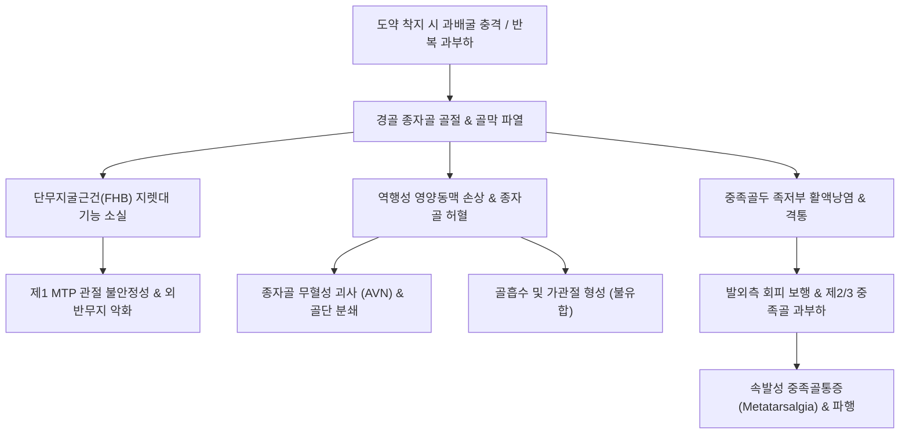

# 🩺 종자골 골절 (Sesamoid Fracture of the Hallux)

> **핵심 3줄 요약 (Key Summary)**:
> - 📍 **병소 부위 & 해부·병태생리**: 제1 중족골두(1st Metatarsal head) 족저면의 단무지굴근건(FHB) 내에 매몰된 2개의 종자골(내측 경골 종자골 및 외측 비골 종자골)의 골절로, 체중 부하의 50% 이상을 흡수하는 내측(경골) 종자골에서 호발함.
> - 🚩 **전형적 임상 양상**: 발레, 육상, 농구 등 도약 착지 외상 또는 반복적 과부하 후 제1 중족골두 족저면의 극심한 국소 압통, 엄지발가락 배굴(Dorsiflexion) 시 격통, 발끝 보행 불능.
> - 🛠️ **핵심 검사 & 치료 전략**: 족부 축방향 종자골 뷰(Sesamoid axial view)로 골절선 확인 및 정상 변이인 이분 종자골(Bipartite sesamoid)과의 감별이 필수. 초기 댄서 패드(Dancer's pad) 제부하, 깁스 고정 및 한의 활혈·접골 치료; 보존적 치료 실패에 따른 불유합(Nonunion)이나 무혈성 괴사 발생 시 부분/완전 종자골 절제술 또는 내고정술 의뢰.
> - ⚠️ **응급 의뢰 레드플래그**: 제1 중족족지관절(MTP) 탈구를 동반한 종자골 복합체 파열(터프 토, Turf toe 3단계), 건 파열에 의한 무지 집게 변형(Claw hallux), 보존 치료 3개월 이상 반응 없는 무혈성 괴사(AVN) 압괴 소견.

---

## 📌 목차
1. [질환 개요 & 해부학적 병태생리](#1-질환-개요--해부학적-병태생리)
2. [병태생리 메커니즘 & 생체역학적 악순환 네트워크](#2-병태생리-메커니즘--생체역학적-악순환-네트워크)
3. [임상 증상 & 이학적 검사(Physical Exam) 알고리즘](#3-임상-증상--이학적-검사physical-exam-알고리즘)
4. [감별 진단 매트릭스 (Differential Diagnosis)](#4-감별-진단-매트릭스-differential-diagnosis)
5. [한의 통합 치료 프로토콜 (침·약침·추나·한약)](#5-한의-통합-치료-프로토콜-침약침추나한약)
6. [양방 치료 & 병용·의뢰 기준 (Conventional Treatment & Referral)](#6-양방-치료--병용의뢰-기준-conventional-treatment--referral)
7. [재활 운동 & 생활습관 티칭 가이드](#7-재활-운동--생활습관-티칭-가이드)
8. [💡 사용자 진료실 핵심 필기 & 임상 노하우 (Melt-In 잔여 심화 집약)](#8--사용자-진료실-핵심-필기--임상-노하우-melt-in-잔여-심화-집약)
9. [출처 및 학술 참고 문헌 (References)](#9-출처-및-학술-참고-문헌-references)

---

## 1. 질환 개요 & 해부학적 병태생리

종자골(Sesamoid bone)은 건(Tendon) 속에 매몰되어 지렛대 팔(Lever arm)을 연장하고 마찰을 줄여주는 역할을 하는 뼈이다. 무지(제1족지) 족저부에는 **경골 종자골(Tibial/Medial sesamoid)**과 **비골 종자골(Fibular/Lateral sesamoid)** 2개가 존재하며, 단무지굴근건(Flexor hallucis brevis)의 내측 및 외측 두(Heads) 안에 위치한다.

해부학적 및 생체역학적 특성:
1. **경골 종자골(Tibial sesamoid)**:
   - 크기가 더 크고 제1 중족골두 하방에서 직접 체중을 지탱하므로 외상성 골절 및 스트레스 골절의 80~90%가 이곳에서 발생한다.
2. **비골 종자골(Fibular sesamoid)**:
   - 외측에 위치하며, 외력 충격보다는 장무지굴근건(FHL)의 활주 지지 및 외전 방지에 관여한다.
3. **골절 기전**:
   - **급성 외상성 골절**: 높은 곳에서 뛰어내릴 때 무지 MTP 관절이 과배굴된 상태에서 발바닥 앞쪽으로 강하게 착지할 때 발생.
   - **피로 골절 (Stress Fracture)**: 발레 무용수, 달리기 주자, 하이힐을 자주 신는 사람 등에서 반복적인 축성 충격으로 인해 미세 골절이 누적됨.
   - **혈류 공급의 취약성**: 원위부에서 근위부로 역행(Retrograde) 유입되는 영양동맥에 의존하므로 골절 시 [[불유합]](Nonunion) 및 [[무혈성 괴사]](AVN)의 발생률이 높다.

![[종자골골절_01_병태도해_무지종자골_해부도해_모식도.png]]
> [그림 1: ① 병태생리·도해 — 제1 중족골두 족저면에 위치한 경골 종자골(Tibial sesamoid)과 비골 종자골(Fibular sesamoid)의 해부학적 위치 모식도 (Wikimedia Commons)]

![[종자골골절_01_영상의학_종자골측면_방사선_Xray.jpg]]
> [그림 2: ① 병태생리·영상 — 제1 중족골두 하방 종자골의 골절선 및 이분 종자골(Bipartite sesamoid) 감별을 위한 족부 측면 방사선 소견 (Wikimedia Commons)]

---

## 2. 병태생리 메커니즘 & 생체역학적 악순환 네트워크

보행의 말기 추진기(Push-off) 동안 무지 MTP 관절은 최대 60~70°까지 배굴되며, 이때 체중의 2~3배에 달하는 장력이 종자골 복합체에 집중된다. 종자골에 골절이 발생하면 단무지굴근의 장력 전달이 차단되고 족저판이 이완되면서 보행 생체역학이 붕괴된다.

![[종자골골절_02_해부도해_단무지굴근건_종자골복합체_Gray275.png]]
> [그림 3: ② 관련 해부 구조물 — 단무지굴근건(FHB) 내에 매몰된 종자골 복합체 및 제1 중족골두 관절면 해부도 (Henry Gray)]

---

## 3. 임상 증상 & 이학적 검사(Physical Exam) 알고리즘

### 1) 주요 임상 증상
- **제1 중족골두 족저면 국소 압통**: 엄지발가락 아래 튀어나온 뼈(특히 내측)를 누르면 소스라치게 놀라는 명확한 압통(Pinpoint tenderness).
- **무지 수동 배굴 시 통증 악화**: 엄지발가락을 위로 젖힐 때 단무지굴근건이 팽팽해지며 골절 부위가 중족골두에 압박되어 통증 발현.
- **파행 보행 (Antalgic Gait)**: 엄지발가락으로 바닥을 밀지 못하고 발 외측 날(Lateral border)로만 걷는 회피 보행.

### 2) 이학적 검사 및 감별 진단 핵심
- **직접 압박 검사**: 제1 중족골두 아래 양측 종자골을 각각 엄지손가락으로 압박하여 내측/외측 침범 확인.
- **무지 MTP 관절 축성 하중 검사 (Axial Grind Test)**: 관절을 누르며 회전시킬 때 골마찰음(Crepitus) 및 연골 손상 여부 확인.
- **방사선 검사**:
  1. **종자골 축방향 촬영 (Sesamoid Axial View)**: 발가락을 배굴시킨 상태에서 종자골과 중족골두 사이 관절면을 축방향으로 촬영하는 필수 검사.
  2. **이분 종자골(Bipartite Sesamoid)과의 감별 판독**:
     - **급성 골절**: 거칠고 예리한 불규칙한 골절선, 경화 테두리 없음, 양 골편 합이 정상 크기, 과거 방사선상 단일 골.
     - **이분 종자골**: 정상 인구의 약 10~25%에서 관찰되는 선천성 변이(양측성 25%). 매끄러운 둥근 피질골 경화 테두리(Corticated borders), 두 뼛조각 합이 정상 종자골보다 큼.
  3. **MRI**: X-ray에서 감별이 모호한 스트레스 골절 및 조기 무혈성 괴사의 골수 부종(Bone marrow edema) 확진.

![[종자골골절_06_영상의학_족부배저면_종자골배열_Xray.jpg]]
> [그림 4: 영상의학 — 종자골의 축방향 배열 및 골절편 전위 여부를 평가하는 족부 배저면 방사선(Dorsoplantar view) 소견 (Wikimedia Commons)]

---

## 4. 감별 진단 매트릭스 (Differential Diagnosis)

| 감별 질환 | 호발 기전 및 환자군 | 통증 특징 | 방사선 및 영상 소견 | 치료 원칙 |
| :--- | :--- | :--- | :--- | :--- |
| **[[종자골 골절]]** | 도약 착지 외상, 마라톤 | 국소 족저 압통, 찌르는 통증 | 예리한 불규칙한 골절선, 피질골 연속성 파괴 | 댄서 패드, 비체중 부하 4~6주 |
| **이분 종자골 (Bipartite)** | 선천성 변이 (무증상 다수) | 통증 없음 (외상 시 결합부 염좌) | 둥글고 매끄러운 피질골 경화연, 양측성 빈발 | 증상 없으면 치료 불필요, 염좌 시 안정 |
| **종자골염 (Sesamoiditis)** | 만성 마찰 및 과사용 | 둔하고 쑤시는 만성 족저통 | 단순 골절선 없음, MRI상 골수 부종 | 스트레칭, 제부하 패드, 소염치료 |
| **터프 토 (Turf Toe)** | 무지 MTP의 과배굴 손상 | 관절 전체의 심한 종창 및 불안정 | 종자골 근위부 전위 (족저판 파열) | 깁스 고정 또는 족저판 봉합술 |
| **통풍성 관절염** | 고요산혈증, 중년 남성 | 극심한 발적, 열감, 야간 격통 | 골절선 음성, 관절강 주위 미란 | 요산강하제, 소염진통제, 한약 |

---

## 5. 한의 통합 치료 프로토콜 (침·약침·추나·한약)

종자골은 해부학적으로 혈류 공급이 부족하여 불유합이 호발하므로, 한의 치료는 **제1 MTP 관절낭 및 족저근의 과긴장 해소, 미세 순환 촉진을 통한 골진 형성 가속화**를 목표로 한다.

### 1) 시기별 단계적 치료 프로토콜
- **1단계 (급성 염증 및 부종기 / 0~2주)**: 청열해독(淸熱解毒), 활혈지통(活血止痛).
  - 대표 처방: [[당귀수산]](當歸鬚散) 가미방.
- **2단계 (골유합 및 가골 형성기 / 2~8주)**: 접골속근(接骨續筋), 보신장골(補腎壯骨). 역행성 혈류 부전 개선 및 골유합 촉진.
  - 대표 처방: [[자연동]](自然銅, 산골) 배합 접골단(接骨丹), [[오적산]](五積散).
- **3단계 (보행 기능 회복기 / 8~16주)**: 서근통락(舒筋通絡), 양혈영근(養血榮筋). 만성 잔여 족저통증 및 활액낭염 소퇴.
  - 대표 처방: [[독활기생탕]](獨活寄生湯).

### 2) 주요 혈위 침구 치료
- **국소 취혈**: [[태백]](SP3), [[공손]](SP4), 대돈(LR1), 행간(LR2), 연곡(KI2). 종자골 주변부 단무지굴근건의 긴장 이완 및 국소 미세혈류 증대.
- **원위 취혈**: [[태충]](LR3), [[족삼리]](ST36), [[양릉천]](GB34), 삼음교(SP6). 전신 혈행 촉진 및 보행 밸런스 정상화.
- **약침 치료**: 중성어혈약침(종자골 주위 활액낭염 및 어혈 제거), 신바로약침(관절낭 내 염증 제어 및 신경 자극 완화).

![[종자골골절_05_술기실사_비경_태백_공손_자침도해.jpg]]
> [그림 5: ③ 치료·시술점 — 제1 중족족지관절 내측 및 족궁 부하 완화를 위한 비경 태백(SP3) 및 공손(SP4) 자침 도해 (Wellcome Collection)]

---

## 6. 양방 치료 & 병용·의뢰 기준 (Conventional Treatment & Referral)

### 1) 보존적 제부하 치료 (Offloading)
- **댄서 패드 (Dancer's Pad / Sesamoid Cutout Pad)**:
  - 제1 중족골두 부위를 파낸 U자형 펠트 패드를 착용하여 보행 시 종자골에 가해지는 체중 부하를 주변 제2~5 중족골두로 분산시킴.
- **고정 치료**: 통증이 심한 급성기에는 단하지 깁스 또는 단단한 로커바닥 보조기(Rocker-bottom sole CAM boot)를 4~6주간 적용.

### 2) 외과적 수술 적응증 및 전원 기준
- **수술 적응증**:
  1. 6개월 이상의 적극적인 보존적 치료에도 불구하고 지속되는 불유합 및 골절부 통증.
  2. 방사선 및 MRI상 대퇴골두 유사한 종자골의 무혈성 괴사(AVN) 및 붕괴 소견.
  3. 무지 MTP 관절낭과 족저판이 완전히 파열되어 관절 탈구가 동반된 경우.
- **수술 기법**:
  - 종자골 부분 절제술(Partial sesamoidectomy): 건 부착부를 최대한 보존하여 절제.
  - 종자골 완전 절제술(Total sesamoidectomy): 불가피한 경우 시행하나, 경골 종자골 완전 절제 시 **외반무지(Hallux valgus)**, 비골 종자골 절제 시 **내반무지(Hallux varus)** 변형 합병증이 발생할 수 있어 신중한 결정 필요.

---

## 7. 재활 운동 & 생활습관 티칭 가이드

골절부 유합이 진행되는 동안 제1 MTP 관절의 구축을 방지하고 점진적으로 보행 능력을 회복한다.

### 1) 단계별 재활 운동
- **초기 (제부하 가동기 / 4~6주)**:
  - 침상 족관절 굽힘-폄 운동(Ankle Bends)으로 비복근-가자미근 유연성 유지.
  - 무지 MTP 수동 가동화(Passive mobilization): 통증이 없는 범위 내에서 엄지발가락을 부드럽게 굴곡.
- **중기 (점진적 체중 부하 / 6~10주)**:
  - 발가락으로 부드러운 수건 끌어당기기 훈련.
  - 종아리 스트레칭: 아킬레스건이 단축되면 보행 시 전족부에 가해지는 압력이 급증하므로 벽 밀기 스트레칭 필수.
- **후기 (스포츠 복귀 / 10~16주)**:
  - 잔디나 우레탄 트랙에서의 가벼운 조깅부터 시작하여 점진적 도약 훈련.

![[종자골골절_07_재활운동_발목관절_가동성_굽힘운동.png]]
> [그림 6: 재활 운동 — 제1 중족골두 체중 부하를 차단한 상태에서 족부 혈행 및 유연성을 유지하는 족관절 굽힘-폄 운동 (Wikimedia Commons)]

### 2) 생활습관 교정
- 바닥이 얇은 플랫슈즈, 샌들, 굽이 높은 하이힐 착용 절대 금지.
- 앞코가 넓고 앞창이 둥글게 굴러가는 로커 바닥(Rocker-bottom) 신발 착용.

---

## 8. 💡 사용자 진료실 핵심 필기 & 임상 노하우 (Melt-In 잔여 심화 집약)

- **이분 종자골(Bipartite sesamoid)을 골절로 오진하지 말 것**:
  - 발바닥 앞쪽 통증 환자의 X-ray에서 종자골이 두 조각으로 보인다고 섣불리 "골절"로 진단하면 안 된다.
  - 정상인의 최대 25%가 선천적으로 뼈가 두 개로 나뉘어 있는 이분 종자골을 가지고 있다.
  - **임상 감별 포인트**:
    1. 반대쪽 발 X-ray를 반드시 찍어본다(이분 종자골의 25%는 양측성).
    2. 조각들의 모서리가 둥글고 매끄러우면 이분 종자골, 날카롭고 톱니 모양이면 골절이다.
    3. 이분 종자골이라도 그 결합부에 염좌나 미세 골절이 생기면 통증이 발생할 수 있으므로, 환자의 주소증 부위와 정확히 일치하는지 촉진(Pinpoint tenderness)으로 확인해야 한다.
- **종자골 절제술의 합병증 경고**:
  - 종자골 불유합으로 수술을 고민하는 환자에게 무조건 "뼈를 떼어내면 통증이 사라진다"고 단순하게 설명해서는 안 된다.
  - 엄지발가락 안쪽의 경골 종자골을 떼어내면 단무지굴근 내측두의 장력이 사라져 외측 당김에 의해 **심한 무지외반증**이 생기고, 반대로 외측을 떼어내면 **무지내반증**이 생긴다.
  - 따라서 가능한 한 댄서 패드, 단단한 깔창, 그리고 [[자연동]](산골) 배합 한약 치료를 통해 뼈를 살리는 보존적 치료를 최소 3~6개월간 끝까지 시도해보는 것이 관절 생체역학을 지키는 최선의 길이다.

---

## 9. 출처 및 학술 참고 문헌 (References)

1. Artioli E, Brognara L, Fabbri G. (2024). Hallux Sesamoid Nonunion: A Comprehensive Systematic Review of Current Evidence. *Foot Ankle Int*, 45(10):1038-1049. PMID: 40863404.

2. Nakajima K, Sasahara J, Miyamoto W. (2024). Avoiding Hallux Sesamoidectomy: A Narrative Review. *J Foot Ankle Surg*, 63(6):790-798. PMID: 41227090.

3. Nam EY, Lee YJ, Kim SH, Kang JW. (2023). Therapeutic Efficacy of Chinese Patent Medicine Containing Pyrite for Fractures: A Systematic Review and Meta-Analysis. *Medicina (Kaunas)*, 60(1):164. PMID: 38256337.

---

## 관련 노트

- [[발 골절]]
- [[발가락 골절]]
- [[발목 골절]]
- [[발꿈치뼈 골절]]
- [[자연동]]
- [[당귀수산]]
- [[독활기생탕]]
- [[불유합]]
