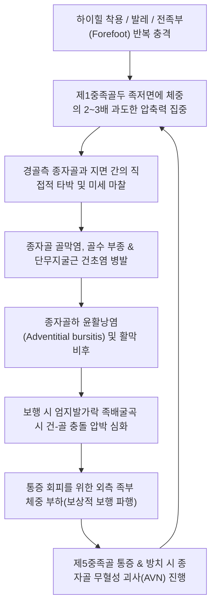
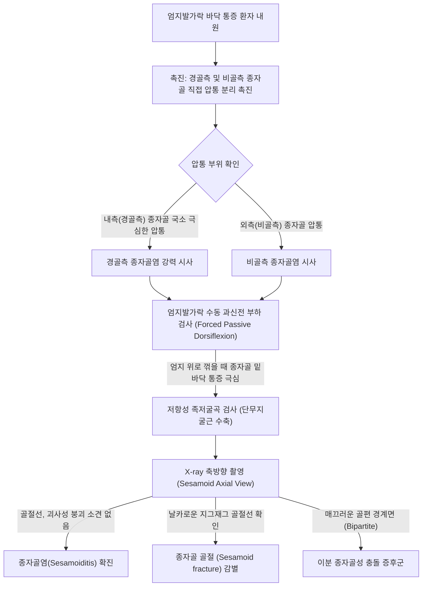
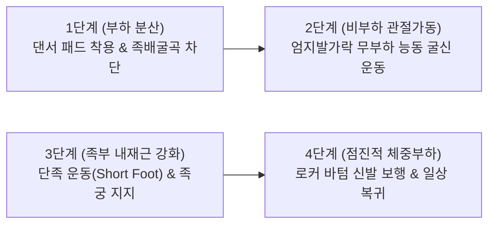

# 🩺 종자골염 (Sesamoiditis)

> **핵심 3줄 요약 (Key Summary)**:
> - 📍 병소 부위 & 해부·병태생리: 제1중족골두 족저면의 단무지굴근([[flexor hallucis brevis]]) 건 내에 매개된 내측(경골측, Tibial) 및 외측(비골측, Fibular) 종자골 및 인접 관절연골·건초·활액낭 부위에서 반복적인 압박과 충격 하중으로 인해 발생하는 무균성 염증 및 골 스트레스 손상 증후군.
> - 🚩 전형적 임상 양상: 발달린 스포츠 선수, 무용수, 하이힐 착용자에서 엄지발가락 관절 밑바닥(제1중족골두 족저면)의 극심한 체중 부하 압통, 보행 시 발끝으로 치고 나가는 도약기(Push-off) 통증, 엄지발가락 수동 족배굴곡 시 통증 악화.
> - 🛠️ 핵심 검사 & 치료 전략: 내측/외측 종자골 직접 압통 촉진, 엄지발가락 과신전 검사, 축방향 X-ray(Sesamoid axial view)상 골 스트레스 반응 및 이분 종자골([[bipartite sesamoid]]) 감별. 침·도침을 통한 단무지굴근건막 감압, [[신바로약침]] 국소 항염증 재생, 종자골 패드(Dancer's pad / Sesamoid pad) 처방을 통한 족저 압력 분산.
> - ⚠️ 응급 의뢰 레드플래그: 높은 곳에서 착지 후 발생한 급성 보행 불능 및 방사선상 뚜렷한 골절선([[종자골 골절]] 의심 깁스 고정 의뢰), 무혈성 괴사(Avascular necrosis / Renander disease) 진행으로 인한 골 붕괴 소견.

---

## 📌 목차
1. [질환 개요 & 해부학적 병태생리](#1-질환-개요--해부학적-병태생리)
2. [병태생리 메커니즘 & 생체역학적 악순환 네트워크](#2-병태생리-메커니즘--생체역학적-악순환-네트워크)
3. [임상 증상 & 이학적 검사(Physical Exam) 알고리즘](#3-임상-증상--이학적-검사physical-exam-알고리즘)
4. [감별 진단 매트릭스 (Differential Diagnosis)](#4-감별-진단-매트릭스-differential-diagnosis)
5. [한의 통합 치료 프로토콜 (침·약침·추나·한약)](#5-한의-통합-치료-프로토콜-침약침추나한약)
6. [양방 치료 & 병용·의뢰 기준 (Conventional Treatment & Referral)](#6-양방-치료--병용의뢰-기준-conventional-treatment--referral)
7. [재활 운동 & 생활습관 티칭 가이드](#7-재활-운동--생활습관-티칭-가이드)
8. [💡 사용자 진료실 핵심 필기 & 임상 노하우 (Melt-In 잔여 심화 집약)](#8-💡-사용자-진료실-핵심-필기--임상-노하우-melt-in-잔여-심화-집약)
9. [출처 및 학술 참고 문헌 (References)](#9-출처-및-학술-참고-문헌-references)

---

## 1. 질환 개요 & 해부학적 병태생리

* **질환 정의**:
  * 종자골염(Sesamoiditis)은 제1중족족지관절(1st Metatarsophalangeal Joint, 1st MTP joint) 족저면에 위치한 두 개의 작은 종자골 복합체(Sesamoid complex)에 만성적인 압박 하중과 마찰이 가해져 발생하는 염증성 질환이다.
  * 종자골 자체의 피로 반응뿐만 아니라, 종자골을 감싸고 있는 단무지굴근건, 족저판(Plantar plate), 관절낭, 종자골간 인대(Intersesamoid ligament) 및 종자골하 활액낭의 병변을 포괄하는 임상적 진단명이다.

* **해부학적 구조 & 생체역학적 기능**:
  * **두 개의 종자골**:
    * **경골측 종자골 (Tibial / Medial sesamoid)**: 크기가 더 크고 내측에 위치하여 체중의 대부분(보행 압력의 약 70%)을 지탱하므로 외측에 비해 손상 빈도가 3~4배 이상 높다.
    * **비골측 종자골 (Fibular / Lateral sesamoid)**: 크기가 작고 외측에 위치.
  * **지렛대 작용 (Pulley Effect)**:
    * 종자골은 슬개골이 대퇴사두근에 대해 하는 역할과 마찬가지로, 단무지굴근 건의 모멘트 암(Moment arm)을 증가시켜 엄지발가락의 족저굴곡 토크를 극대화한다.
    * 보행 시 제1중족골두가 지면에 닿을 때 충격을 흡수하고, 장무지굴근([[flexor hallucis longus]]) 건이 그 사이를 통과할 수 있도록 지지 고랑(Groove)을 형성한다.
  * **이분 종자골 (Bipartite Sesamoid)**:
    * 인구의 약 10~25%에서 선천적으로 종자골의 골화 중심이 융합되지 않아 2개 이상의 조각으로 나뉘어 존재(대부분 경골측에서 발생, 약 25%에서 양측성).
    * 이분 종자골은 섬유연골로 결합되어 있어 충격에 취약하며, 종자골염이나 피로골절과의 방사선학적 감별이 매우 중요하다.

* **역학 및 위험 요인**:
  * 발레 무용수(pointe 동작), 육상 선수(단거리 전력 질주자), 농구·배구 선수, 체조 선수 등 발 앞꿈치(Forefoot)로 체중을 지탱하고 도약하는 직업군에서 호발한다.
  * 신발 요인: 하이힐(체중의 80% 이상이 제1중족골두로 집중됨), 밑창이 얇고 딱딱한 플랫슈즈.
  * 해부학적 요인: 요족(Cavus foot, 높은 아치로 인한 전족부 충격 집중), 무지외반증([[무지외반증]], 종자골의 외측 편위 유발), 제1중족골의 족저굴곡 변형.

---

## 2. 병태생리 메커니즘 & 생체역학적 악순환 네트워크

* **보행 주기와 종자골 스트레스**:
  * 정상 보행의 말기 입각기(Terminal stance)와 전유각기(Pre-swing)에서 발꿈치가 들리고 엄지발가락이 60도 이상 **과도하게 족배굴곡(Dorsiflexion)**될 때, 종자골은 제1중족골두 관절면 위를 활주하며 최대의 인장력과 압축력을 동시에 받는다.
* **무혈성 괴사(Avascular Necrosis) 위험성**:
  * 종자골은 혈관 공급이 원위부 및 족저판을 통해 제한적으로 유입되는 '말단 혈관 구조'를 가진다.
  * 만성적인 압박과 미세골절이 지속되면 혈류 공급이 차단되어 뼈가 서서히 괴사되고 조각나는 르난더병(Renander's disease, 종자골 무혈성 괴사)으로 악화될 수 있다.

---

## 3. 임상 증상 & 이학적 검사(Physical Exam) 알고리즘

### 임상 증상

* **전족부 족저면의 국소 동통**:
  * 엄지발가락 뿌리 관절 밑바닥(제1중족골두 바닥)이 딛기 힘들 정도로 쑤시고 멍든 듯이 아프다.
  * 맨발로 방바닥이나 타일 바닥을 걸을 때 통증이 극대화되며, 푹신한 신발을 신으면 다소 경감된다.
* **도약기(Push-off) 통증**:
  * 걸음을 뗄 때 마지막에 엄지발가락으로 땅을 치고 나가는 순간 찌르는 듯한 날카로운 통증이 발생하여, 환자는 무의식적으로 발 외측 날로 디디며 걷게 된다.
* **부종 및 발적**:
  * 관절낭염이나 윤활낭염이 심한 경우 제1중족골두 족저면 피부가 붉어지고 팽팽하게 부어오른다.

### 이학적 검사 (Physical Examination)

1. **종자골 직접 분리 압통 검사 (Isolated Sesamoid Palpation)**:
   * 환자를 앙와위로 눕히고 발을 편안히 이완시킨 상태에서, 검사자의 엄지손가락으로 제1중족골두 족저 내측(경골측)과 외측(비골측)을 각각 국소적으로 강하게 압박한다. 병변이 있는 종자골 부위에서 즉각적인 날카로운 압통이 유발된다.
2. **엄지발가락 수동 과신전 검사 (Passive Dorsiflexion Provocation Test)**:
   * 검사자가 엄지발가락을 수동으로 끝까지 위로 젖혀 족저판과 단무지굴근건을 팽팽하게 긴장시킨 상태에서 종자골을 압박한다. 통증이 급격히 증폭되면 양성이다.
3. **저항성 엄지발가락 족저굴곡 검사**:
   * 환자에게 엄지발가락을 바닥 쪽으로 구부리게 하고 검사자가 저항할 때 종자골 부위에 통증이 나타난다.

---

## 4. 감별 진단 매트릭스 (Differential Diagnosis)

| 감별 질환 | 호발 기전 및 특징 | 주 압통 부위 | 영상의학적 소견 (X-ray/MRI) | 감별 핵심 포인트 |
| :--- | :--- | :--- | :--- | :--- |
| **종자골염** | 만성 충격, 하이힐, 댄서 | 제1중족골두 족저면 (경골측>비골측) | 골 구조 보존, 골막염, MRI상 연부조직 부종 | 미만성 압통, 보존적 치료로 호전 |
| **[[종자골 골절]]** | 높은 곳에서 착지, 직타 손상 | 종자골 국소 (극심한 자통) | **들쭉날쭉한(Jagged) 날카로운 골절선** | 급성 외상력, 완전 체중 부하 불능 |
| **이분 종자골 (Bipartite)** | 선천성 발육 변이 (무증상 다수) | 무증상이거나 외상 후 염증 | **매끄럽고 둥근 경화된 피질골 경계선** | 골편 사이가 둥글고 피질골로 덮임 |
| **종자골 무혈성 괴사 (AVN)** | 만성 스트레스 손상 방치 | 종자골 부위 지속적 심부통 | X-ray상 골음영 불균일, 붕괴, MRI 저신호 | 르난더병, 골 흡수 및 관절염 진행 |
| **통풍성 관절염 ([[통풍]])** | 고요산혈증, 음주 후 급성 발작 | 제1MTP 관절 전체 (배측 및 족저측) | 관절강 삼출, 요산 결정, 펀치아웃 골침식 | **극심한 야간 급성 발작, 전방위 관절 열감·발적** |
| **터프 토 (Turf Toe)** | 인조잔디에서 엄지 과신전 손상 | 족저판(Plantar plate) 복합체 | 족저판 인대 파열, 종자골 근위부 전위 | 관절 과신전 손상력, 족저판 파열 |

---

## 5. 한의 통합 치료 프로토콜 (침·약침·추나·한약)

### 침구 치료 프로토콜

* **혈위 선정**:
  * 족태음비경(足太陰脾經) 주치 혈위: [[은백]](SP1), [[대도]](SP2, 滎火穴), [[태백]](SP3, 兪土穴, 原穴), [[공손]](SP4).
  * 족궐음간경(足厥陰肝經) 배합 혈위: [[대돈]](LR1), [[행간]](LR2, 滎火穴), [[태충]](LR3, 原穴).
  * 국소 아시혈: 제1중족골두 족저면 종자골 주변 피하 연부조직.
* **자침 기법**:
  * **종자골 주변 사자법(Oblique Needling)**: 족저면 피부는 각질이 두껍고 통각이 예민하므로, 족저면에서 직접 직자하기보다는 발 내측면([[태백]], [[대도]])에서 종자골 바닥 방향으로 침을 비스듬히 눕혀 자입하여 단무지굴근건막의 내압을 감압한다.
  * 전기침(EA) 치료: [[태백]]-[[태충]]에 전침을 걸고 2Hz 저주파를 15분간 통전하여 국소 내인성 오피오이드 분비 및 항염증 반응을 유도한다.
* **도침 치료 (Acupotomy)**:
  * 만성 단무지굴근건 유착 및 섬유성 활액낭염이 동반된 경우, 발 내측 연변에서 진입하여 종자골 측면 지지대 및 유착된 건막을 조심스럽게 미세 절개하여 종자골에 걸리는 지속적 인장력을 해소한다.

### 약침 치료 프로토콜

* **처방 약침**:
  * [[신바로약침]] (GCSB-5): 제1중족골두 내측면([[태백]] 부위)에서 접근하여 종자골 주위 결합조직강 내로 0.2~0.3cc 주입하여 염증성 부종을 신속히 가라앉히고 건 기질을 재생한다.
  * 봉약침 (Sweet BV): 만성 난치성 통증 환자에게 종자골 외측 및 내측 주위로 0.1cc 미세 주입 (건 실질 내 직접 주입 금기).

### 추나의학적 접근 (Chuna Manual Therapy)

* **제1중족족지관절(1st MTP) 견인 및 저굴 가동술**:
  * 엄지발가락을 부드럽게 원위부로 견인(Traction)하면서 약간 족저굴곡시켜 종자골과 중족골두 사이의 관절면 접촉압을 분산시킨다.
* **단무지굴근 및 무지외전근 경근 이완**:
  * 족저 내측 아치를 따라 주행하는 [[단무지굴근]]과 [[무지외전근]](Abductor hallucis)을 수근부 및 모지로 심부 이완하여 종자골을 당기는 기저 장력을 제거한다.
* **거골 및 제1설상골 교정 추나**:
  * 제1중족골이 바닥 쪽으로 과도하게 떨어져 있는 족저굴곡 변위를 상방으로 교정하여 종자골에 체중이 과도하게 쏠리는 것을 방지한다.

### 변증별 한약 치료 (Herbal Medicine)

* **기체어혈(氣滯瘀血)형** (딛기 힘든 날카로운 자통, 외상성 염증):
  * [[당귀수산]](當歸鬚散) 또는 [[활락효영단]](活絡效靈丹) 가감: [[단삼]], [[당귀]], [[몰약]], [[유향]], [[홍화]], [[우슬]]을 배합하여 종자골 주위의 혈종과 울혈을 제거.
* **간신휴손(肝腎虧損) & 골비(骨痺)형** (만성 스트레스 골 반응, 무혈성 괴사 전조 단계):
  * [[독활기생탕]](獨活寄生湯) 합 [[호잠환]](虎潛丸) 가감: [[숙지황]], [[구척]], [[골쇄보]], [[두충]], [[우슬]]을 사용하여 뼈의 피로 손상을 치유하고 골 대사를 촉진.
* **습열비저(濕熱痺阻)형** (국소 종창, 열감, 통풍 유사 증상):
  * [[사묘환]](四妙丸) 또는 [[당귀점통탕]](當歸拈痛湯) 가감: 황백, 창출, 방기, 의이인을 배합하여 습열을 제거하고 부종을 소퇴.

---

## 6. 양방 치료 & 병용·의뢰 기준 (Conventional Treatment & Referral)

### 보존적 치료 및 수술 요법

* **체중 부하 제한 & 보조기 요법**:
  * 급성기 통증 시 단하지 깁스(Short leg walking boot) 또는 로커 바텀 신발(Rocker-bottom shoe)을 2~4주간 착용하여 엄지발가락 족배굴곡을 원천 차단.
* **국소 주사 요법의 주의사항**:
  * **스테로이드 국소 주사는 종자골하 지방 패드(Fat pad) 위축 및 족저판 파열, 종자골 괴사를 유발할 수 있으므로 극도로 신중해야 하며 반복 투여는 금기**이다.
* **수술적 치료 (Sesamoidectomy)**:
  * 6~12개월간의 적극적인 보존적 치료에도 반응하지 않는 불유합 골절, 무혈성 괴사, 불응성 골수염 환자에 한하여 부분 또는 완전 종자골 절제술(Sesamoidectomy)을 시행. (단, 경골측 종자골 완전 절제 시 무지외반증 변형 위험 동반).

### 한의 병용 판단 및 의뢰 기준 (Referral Criteria)

* **한의 치료의 보존적 강점**:
  * 스테로이드 주사의 부작용(지방 패드 위축) 없이 신바로약침과 도침 감압술, 패딩 요법을 통해 수술 없이 80% 이상의 환자에서 성공적인 관해를 유도할 수 있다.
* **정형외과 즉각 의뢰 (Red Flags)**:
  * 방사선상 뚜렷한 골절선과 골편 전위가 확인되는 급성 종자골 골절.
  * 종자골이 찌그러지거나 조각나며 붕괴되는 무혈성 괴사(AVN) 진행 소견.
  * 피부 누공, 궤양을 동반한 당뇨발 합병 골수염 의심 소견.

---

## 7. 재활 운동 & 생활습관 티칭 가이드

### 종자골 패드(Dancer's Pad) 티칭 — 치료의 80%를 결정하는 핵심

* **댄서 패드 (Dancer's Pad / Sesamoid Relief Pad)**:
  * 펠트(Felt)나 실리콘 패드의 **제1중족골두(종자골) 부위에 구멍을 뚫거나 잘라내어(U자형 절개)** 신발 깔창 밑바닥에 부착한다.
  * 체중이 지면에 닿을 때 압력이 제2~5중족골과 뒤쪽으로 분산되고, 아픈 종자골 부위는 공중에 뜨게 만들어(Off-loading) 걸을 때 종자골에 가해지는 압력을 즉각 90% 이상 제거한다.

### 재활 운동 & 스트레칭

* **단무지굴근 수동 신장 (부드러운 신장)**:
  * 통증이 없는 범위에서 엄지발가락을 손으로 가볍게 위로 젖혀 15초 유지.
* **발가락 집게 운동 (Toes Towel Scrunch)**:
  * 바닥에 깔아둔 수건을 발가락으로 쥐었다 놓았다를 반복하여 발바닥 내재근을 강화하고 충격 흡수 능력을 회복한다.
* **종아리 스트레칭**:
  * 비복근과 가자미근이 단축되면 발꿈치가 일찍 들려 전족부 압력이 증가하므로 종아리 스트레칭을 매일 병행한다.

### 신발 선택 가이드

* **하이힐 및 플랫슈즈 절대 금기**:
  * 굽이 3cm 이상인 신발과 바닥이 얇고 딱딱한 신발은 치료 기간 동안 철저히 금지한다.
* **로커 바텀(Rocker-bottom) 솔 신발 권장**:
  * 밑창 앞부분이 둥글게 굴곡진 신발(마사이 워킹화 등)을 신으면 엄지발가락 관절을 꺾지 않고도 발이 저절로 굴러가므로 종자골 충돌을 완벽히 차단한다.

---

## 8. 💡 사용자 진료실 핵심 필기 & 임상 노하우 (Melt-In 잔여 심화 집약)

* **진료실 임상 감별의 핵심 — "이분 종자골인가, 피로골절인가?"**:
  * X-ray를 찍어보면 종자골이 두 조각으로 나뉘어 있어 골절로 오진하기 쉽다.
  * **이분 종자골(Bipartite)**은 나뉜 면의 경계가 둥글고 매끄러우며 피질골 경화가 보이고, 반대쪽 발에도 대칭적으로 존재하는 경우가 많다.
  * **골절(Fracture)**은 골절선이 톱니 모양(Jagged)으로 불규칙하고 날카로우며 국소적으로 소름 돋는 압통이 존재한다. 감별이 모호할 때는 반드시 반대측 X-ray를 함께 찍어 비교해야 한다.
* **치료의 시작과 끝은 오프로딩(Off-loading)**:
  * 아무리 침과 약침을 명중시켜도 환자가 딱딱한 신발을 신고 체중을 실어 걸으면 다음 날 제자리걸음이다.
  * 내원 첫날 진료실에서 즉석으로 펠트 테이프를 오려 **댄서 패드**를 환자 발바닥에 붙여주고 걷게 하면, "어? 디딜 때 하나도 안 아파요!"라며 즉각적인 치료 효과와 환자의 절대적 신뢰를 얻을 수 있다.
* **스테로이드 주사의 파국적 결말 경고**:
  * 다른 병원에서 스테로이드 주사를 2~3회 맞고 온 환자들은 발바닥의 쿠션 역할을 하는 지방 패드가 완전히 녹아 뼈가 가죽 바로 밑에 만져지는 경우가 많다. 이 경우 재생이 극도로 어려우므로 환자에게 스테로이드의 위험성을 사전에 명확히 주지시켜야 한다.

---

## 9. 출처 및 학술 참고 문헌 (References)

Rhim HC et al. (2025). Sesamoid bone stress injury: revising the diagnostic framework for sesamoiditis. *Br J Sports Med*, 59(14): 912-920. PMID: 41535104

Guo L et al. (2024). Clinically Interpretable Sesamoiditis Grading with Multi-Task Learning. *Comput Biol Med*, 180: 108992. PMID: 39326263

Stewart S et al. (2024). Recommendations for the Assessment and Management of Sesamoiditis by Podiatrists. *J Foot Ankle Res*, 17(2): e12025. PMID: 38820171
