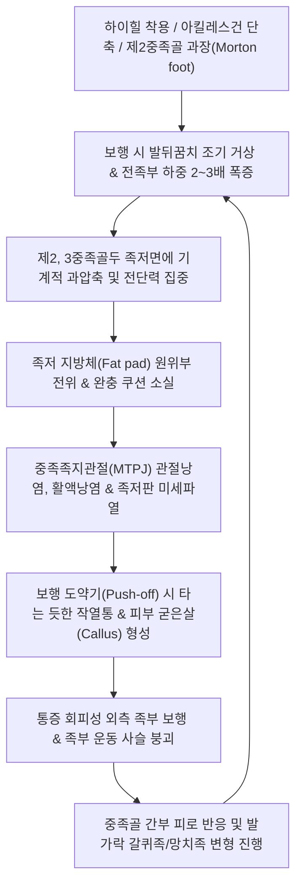
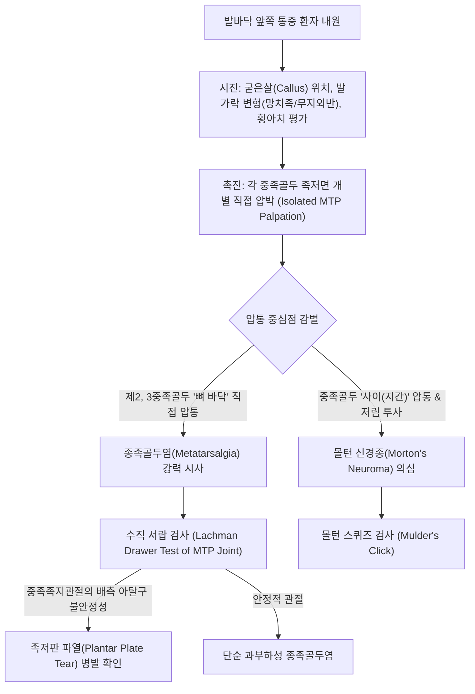
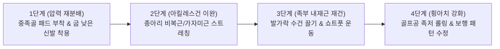

# 🩺 종족골두염 (Metatarsalgia / 중족골통증)

> **핵심 3줄 요약 (Key Summary)**:
> - 📍 병소 부위 & 해부·병태생리: 보행 및 체중 부하 시 제2, 3, 4중족골두(Metatarsal head) 족저면 및 족저판(Plantar plate), 인접 활액낭·지방체 부위에 가해지는 과도한 수직 압력과 전단력으로 인해 발생하는 전족부(Forefoot)의 통증성 과사용 증후군.
> - 🚩 전형적 임상 양상: 발바닥 앞쪽(발가락 뿌리 바로 밑)에 "돌멩이나 자갈을 밟고 걷는 듯한" 타는 듯한 작열통(Burning pain), 맨발 보행 시 악화, 제2, 3중족골두 족저면 굳은살(Callus) 형성, 보행 말기 도약기(Push-off) 통증.
> - 🛠️ 핵심 검사 & 치료 전략: 중족골두 족저면 직접 압통 및 족저판 견인 검사(Lachman/Drawer test of MTP joint), 몰턴 신경종([[몰턴 신경종]])과의 감별(스퀴즈 검사 배제). 중족골 패드(Metatarsal pad) 처방을 통한 전족부 압력 후방 분산, [[용천]](KI1)·[[태충]](LR3)·[[함곡]](ST43) 침구 치료 및 족저 근막 도침 이완술, [[비복근]]·[[가자미근]] 스트레칭.
> - ⚠️ 응급 의뢰 레드플래그: 제2, 3중족골 간부의 국소 점상 압통 및 방사선상 가골 형성([[중족골 피로골절]] 의심), 급성 당뇨병성 족부 궤양 및 골수염 소견, 전족부 감각 소실.

---

## 📌 목차
1. [질환 개요 & 해부학적 병태생리](#1-질환-개요--해부학적-병태생리)
2. [병태생리 메커니즘 & 생체역학적 악순환 네트워크](#2-병태생리-메커니즘--생체역학적-악순환-네트워크)
3. [임상 증상 & 이학적 검사(Physical Exam) 알고리즘](#3-임상-증상--이학적-검사physical-exam-알고리즘)
4. [감별 진단 매트릭스 (Differential Diagnosis)](#4-감별-진단-매트릭스-differential-diagnosis)
5. [한의 통합 치료 프로토콜 (침·약침·추나·한약)](#5-한의-통합-치료-프로토콜-침약침추나한약)
6. [양방 치료 & 병용·의뢰 기준 (Conventional Treatment & Referral)](#6-양방-치료--병용의뢰-기준-conventional-treatment--referral)
7. [재활 운동 & 생활습관 티칭 가이드](#7-재활-운동--생활습관-티칭-가이드)
8. [💡 사용자 진료실 핵심 필기 & 임상 노하우 (Melt-In 잔여 심화 집약)](#8-💡-사용자-진료실-핵심-필기--임상-노하우-melt-in-잔여-심화-집약)
9. [출처 및 학술 참고 문헌 (References)](#9-출처-및-학술-참고-문헌-references)

---

## 1. 질환 개요 & 해부학적 병태생리

* **질환 정의**:
  * 종족골두염(Metatarsalgia, 중족골통증/중족골두염)은 단일 질환이라기보다는 발의 앞부분, 특히 제2, 제3, 제4 중족골두 족저면에 체중 부하 압력이 불균형하게 집중되어 발생하는 만성 동통성 질환군을 총칭하는 광범위한 임상 증후군이다.
  * 보행 시 중족골두와 지면 사이에서 완충 역할을 하는 전족부 지방 패드(Plantar fat pad)의 위축이나 변위, 관절낭염(Capsulitis), 활액낭염(Intermetatarsal bursitis), 족저판(Plantar plate) 퇴행성 미세파열이 복합적으로 관여한다.

* **해부학적 구조 & 횡아치(Transverse Arch)의 역할**:
  * **중족골 포물선(Metatarsal Parabola)**:
    * 정상적인 발에서는 제1중족골과 제2중족골이 가장 길며, 1~5번 중족골두가 완만한 부채꼴 포물선을 이루어 체중 부하를 분산한다 (제1중족골두가 약 33%, 제2~5중족골두가 합쳐서 약 67% 부담).
    * 선천적으로 제2중족골이 지나치게 긴 형태(몰턴 족, Morton's foot structure)이거나 무지외반증으로 인해 제1중족골의 체중 지지 기능이 상실되면, 제2·3중족골두로 과도한 하중이 전이(Transfer metatarsalgia)된다.
  * **전족부 횡아치(Transverse Metatarsal Arch)**:
    * 중족골두 레벨에서는 보행 시 유연하게 평평해졌다가 도약기(Push-off)에 다시 탄성 복원력을 발휘해야 하지만, 횡아치가 영구적으로 무너지면 중앙부 중족골두(제2, 3두)가 바닥에 직접 닿으며 지속적인 기계적 타박을 받는다.

* **역학 및 위험 요인**:
  * 40대 이상 중장년 여성에서 남성보다 3~4배 흔하게 호발한다 (하이힐 착용력 및 노화에 따른 지방 패드 위축).
  * 외재적 요인: 굽이 높고 볼이 좁은 신발(High heels), 얇은 밑창의 신발, 딱딱한 바닥에서의 장시간 보행 및 점프 운동.
  * 내재적 요인: 무지외반증([[무지외반증]]), 요족(Cavus foot, 아치가 너무 높아 전족부에 하중 집중), 편평족, 아킬레스건 단축([[비복근]] 구축), 망치족([[망치족]]) 변형.

---

## 2. 병태생리 메커니즘 & 생체역학적 악순환 네트워크

* **지방 패드 위축 및 원위 전위 (Fat Pad Atrophy & Migration)**:
  * 정상적으로 중족골두 하방에 위치하여 압력을 흡수해야 하는 족저 지방 패드가 노화, 하이힐 착용, 만성 전단력에 의해 중족골두 밑에서 앞쪽(발가락 쪽)으로 밀려나거나 두께가 얇아진다.
  * 쿠션이 사라진 중족골두는 얇은 피부층 바로 밑에서 지면과 직접 부딪히며 '뼈로 걷는 듯한' 극심한 통증을 유발한다.
* **비복근-가자미근 구축(Equinus)의 기계적 악영향**:
  * 종아리 근육이 단축되면 보행 주기 중 발목 족배굴곡이 10도 이상 나오지 못해, 발뒤꿈치가 땅에서 너무 일찍 떨어지며(Early heel-off) 체중 전체가 전족부 중족골두로 조기에 쏟아지게 된다.

---

## 3. 임상 증상 & 이학적 검사(Physical Exam) 알고리즘

### 임상 증상

* **전형적 전족부 족저면 통증**:
  * 발바닥 앞쪽 둥근 부위(제2, 3발가락 뿌리 바로 밑)가 화끈거리고(Burning), 쑤시며, "신발 속에 모래알이나 돌멩이가 들어있는 것 같다"고 표현한다.
  * 맨발로 거실 바닥이나 단단한 마룻바닥을 걸을 때 통증이 극심하며, 푹신한 슬리퍼나 쿠션화를 신으면 증상이 다소 완화된다.
* **피부 굳은살(Callus / Hyperkeratosis)**:
  * 제2, 제3중족골두 족저면에 국소적으로 두껍고 노란 굳은살이 형성되어 있으며, 굳은살 아래로 깊은 압통이 관찰된다.
* **도약기(Push-off) 통증**:
  * 걸음을 걸을 때 발끝으로 지면을 밀고 나가는 마지막 순간에 발바닥 앞쪽이 짓눌리는 듯한 통증으로 인해 발가락에 힘을 주지 못한다.

### 이학적 검사 (Physical Examination)

1. **중족골두 개별 수직 압박 검사 (Direct MTP Head Palpation)**:
   * 검사자의 엄지손가락으로 제1부터 제5중족골두 족저면을 하나씩 아래에서 위로 강하게 수직 압박한다. 제2 또는 제3중족골두 바로 아래에서 뚜렷한 압통이 확인되면 종족골두염을 시사한다.
2. **몰턴 신경종 감별 검사 (Intermetatarsal Space Squeeze)**:
   * 중족골두 뼈 자체가 아니라 제2-3 또는 제3-4 **중족골두 사이 공간(Web space)**을 앞뒤로 쥐어짜면서 횡방향으로 발볼을 압박(Mulder's test)한다. 찌릿한 방사통이나 '딸깍'하는 신경종의 튕김음이 없으면 신경종을 배제한다.
3. **MTP 관절 서랍 검사 (Lachman / Drawer Test of MTPJ)**:
   * 중족골두를 고정하고 기절골(Proximal phalanx)을 위아래로 흔들어 배측 전위(Dorsal subluxation) 여부를 평가한다. 불안정성이 심하면 족저판(Plantar plate) 파열을 의미한다.
4. **실크베르숄드 검사 (Silfverskiöld Test)**:
   * 무릎을 편 상태와 구부린 상태에서 족배굴곡 각도를 비교하여, 전족부 과부하의 원인이 순수 [[비복근]] 구축인지 아킬레스건 전체의 단축인지 판정한다.

---

## 4. 감별 진단 매트릭스 (Differential Diagnosis)

| 감별 질환 | 주 압통 위치 | 통증 양상 및 특징 | 이학적 검사 | 방사선학적 특징 (X-ray/MRI) |
| :--- | :--- | :--- | :--- | :--- |
| **종족골두염 (Metatarsalgia)** | **제2, 3중족골두 족저면** | 타는 듯한 작열통, 돌 밟는 느낌, 굳은살 동반 | 중족골두 바닥 직접 압통 | 횡아치 평탄화, 뼈 자체 골절선 없음 |
| **[[몰턴 신경종]] (Morton's)** | **제3-4 또는 제2-3 중족골 사이 지간부** | 찌릿한 전기 통증, 발가락 저림, 감각 이상 | 뮬더 클릭(Mulder sign) 양성 | 초음파/MRI상 신경종(>5mm) 결절 관찰 |
| **[[중족골 피로골절]] (March Fx)** | **중족골 간부(Shaft) 등쪽(Dorsal)** | 걷기 힘든 날카로운 골성 동통, 족배부 부종 | 간부 등쪽 핀포인트 압통 | 2~3주 후 X-ray 가골 형성, MRI 골절선 |
| **[[프라이베르그병]] (Freiberg's)** | **제2중족골두 관절면 등쪽** | 청소년/젊은 여성, 관절 강직 및 종창 | MTP 관절 굴신 시 마찰음 및 통증 | 제2중족골두 편평화, 무혈성 괴사, 경화 |
| **족저판 파열 (Plantar Plate Tear)** | 중족골두 원위 족저판 부착부 | 발가락이 위로 들리거나 교차됨(Crossover toe) | Lachman 서랍 검사 양성 | 초음파/MRI상 족저판 섬유 단열 |
| **통풍성 관절염 ([[통풍]])** | 제1MTP 관절 (드물게 제2MTP) | 야간성 급성 발작, 극심한 열감·발적 | 전방위 관절 터치 불가 | 요산 결정, 관절강 삼출액 저류 |

---

## 5. 한의 통합 치료 프로토콜 (침·약침·추나·한약)

### 침구 치료 프로토콜

* **혈위 선정**:
  * 족소음신경(足少陰腎經): [[용천]](KI1, 족저 횡아치 중심).
  * 족궐음간경(足厥陰肝經): [[태충]](LR3), [[행간]](LR2).
  * 족양명위경(足陽明胃經): [[함곡]](ST43, 제2·3중족골 기저부), [[내정]](ST44).
  * 족태양방광경 배합: [[승산]](BL57), [[곤륜]](BL60, 하퇴 삼두근 이완).
* **자침 기법**:
  * **배측-족저 투과 침법(Dorsal-to-Plantar Needling)**: 족저면 직자는 통증이 극심하므로, 발등 쪽의 [[함곡]]과 [[내정]] 부위에서 중족골 사이 간극을 통해 족저면 중족골두 바닥 방향으로 침체를 30~40mm 깊이로 자입하여 관절낭과 골간근(Interosseous muscles)을 감압한다.
  * 전기침(EA) 치료: [[함곡]]과 [[태충]]에 전침을 걸고 2Hz 저주파를 15분간 통전하여 전족부의 국소 허혈성 통증을 완화한다.
* **도침 치료 (Acupotomy) - 족저 근막 및 관절낭 유착 박리**:
  * 굳은살 하방에 만성 활액낭염 및 섬유성 비후가 고착화된 경우, 발등 또는 측면에서 진입하여 중족골두 하방의 긴장된 심부 횡중족인대(Deep transverse metatarsal ligament)와 섬유성 유착대를 종방향으로 미세 박리하여 충격 흡수 탄성을 복원한다.

### 약침 치료 프로토콜

* **처방 약침**:
  * [[신바로약침]] (GCSB-5): 제2, 3중족골두 배측 및 측면에서 접근하여 관절낭 주위 및 활액낭강 내로 0.2~0.3cc 주입하여 국소 신경인성 염증과 관절낭 부종을 신속히 가라앉힌다.
  * 중성어혈약침: 전족부 열감 및 야간 욱신거림이 심한 환자에게 지간 신경 주변 피하로 0.2cc 시술.

### 추나의학적 접근 (Chuna Manual Therapy)

* **전족부 횡아치 복원 추나 기법 (Transverse Arch Mobilization)**:
  * 한의사의 양손 모지로 환자의 제2, 3중족골두 족저면을 위로 밀어 올리면서, 제1중족골과 제5중족골을 아래로 모아 쥐어 횡아치의 정상적인 돔(Dome) 형태를 회복시키는 굴곡 가동술을 적용한다.
* **중족족지관절 견인 및 족저판 감압**:
  * 발가락을 장축 방향으로 부드럽게 원위 견인하여 중족골두 관절면의 압박을 해소한다.
* **비복근-가자미근 심부 근막 이완(MFR) 및 MET**:
  * 전족부 과부하의 원발성 원인인 하퇴 삼두근의 단축을 해소하여 조기 힐오프(Early heel-off)를 차단한다.

### 변증별 한약 치료 (Herbal Medicine)

* **기체어혈(氣滯瘀血)형** (타는 듯한 작열통, 야간 둔통, 굳은살 주위 자통):
  * [[활락효영단]](活絡效靈丹) 또는 [[당귀수산]](當歸鬚散) 가감: [[단삼]], [[당귀]], [[몰약]], [[유향]], [[우슬]], [[홍화]]를 배합하여 전족부 모세혈관 순환을 촉진하고 울혈을 배출.
* **간신부족(肝腎不足) & 근막위축(筋膜萎縮)** (노인성 지방 패드 소실, 만성 피로, 뼈로 걷는 느낌):
  * [[독활기생탕]](獨活寄生湯) 합 [[사물탕]] 가감: [[숙지황]], [[두충]], [[속단]], [[구척]], [[백작약]], [[모과]]를 사용하여 족저 결합조직과 연골을 재생하고 인장력을 보강.
* **습열하주(濕熱下注)형** (발바닥 앞쪽 부종, 열감, 축축한 발):
  * [[사묘환]](四妙丸) 가감: 황백, 창출, 우슬, 의이인을 배합하여 하퇴 및 족부의 습열 부종을 제거.

---

## 6. 양방 치료 & 병용·의뢰 기준 (Conventional Treatment & Referral)

### 보존적 치료 및 수술 요법

* **맞춤형 족부 보조기 (Custom Orthotics & Metatarsal Pads)**:
  * 비수술적 치료의 제1원칙. 중족골 패드를 중족골두 바로 뒤쪽(근위부)에 부착하여 하중을 분산시킴.
* **굳은살(Callus) 정기 절제**:
  * 두꺼워진 굳은살 자체가 단단한 돌멩이 역할을 하여 중족골두를 더 강하게 압박하므로, 무균적으로 각질을 깎아내어 표면 압력을 즉각 완화.
* **수술적 치료 (Weil Osteotomy)**:
  * 6개월 이상의 보존적 치료에도 보행이 불가능한 구조적 이상(과도하게 긴 제2중족골) 환자에게 바일 중족골 단축 절골술(Weil osteotomy)을 시행하여 중족골두를 후상방으로 후퇴시킴.

### 한의 병용 판단 및 의뢰 기준 (Referral Criteria)

* **한의 치료의 보존적 가치**:
  * 지방 패드가 위축된 환자에게 스테로이드 주사를 놓으면 지방 패드가 완전히 파괴되므로, 침·도침 및 신바로약침과 패딩 요법을 결합한 한의 보존 치료가 가장 안전하고 장기적인 대안이다.
* **정형외과 즉각 의뢰 (Red Flags)**:
  * 발등 쪽에 붓기와 열감이 동반되며 뼈를 눌렀을 때 비명을 지르는 날카로운 핀포인트 압통 ([[중족골 피로골절]] 감별 위한 방사선 정밀 검사).
  * Lachman 검사상 MTP 관절이 위로 완전히 빠지는 중증 족저판 파열 및 교차지 변형(Crossover toe).
  * 당뇨병 환자에서 굳은살 하방 피부가 뚫리고 진물이 나오는 당뇨발 궤양 의심 소견.

---

## 7. 재활 운동 & 생활습관 티칭 가이드

### 중족골 패드(Metatarsal Pad) 부착법 — 치료 성공의 결정적 노하우

* **부착 위치의 절대 공식 (Head가 아닌 Neck에 부착)**:
  * 환자들이 가장 흔히 범하는 실수는 **아픈 중족골두 바로 밑에 패드를 붙이는 것**이다. 이는 돌멩이 밑에 돌멩이를 더 얹는 격으로 통증을 폭발시킨다.
  * 패드는 반드시 **아픈 중족골두의 바로 뒤쪽(발목 쪽으로 약 5~10mm 후방, Metatarsal neck/shaft 부위)**에 부착해야 한다.
  * 이렇게 해야 체중이 지면에 실릴 때 패드가 중족골 경부를 먼저 떠받쳐주어, 아픈 중족골두는 지면에 닿지 않고 공중에 뜨게 된다(Off-loading).

### 재활 운동 & 스트레칭

* **종아리 벽 스트레칭 (매일 3회, 30초씩)**:
  * 종아리가 유연해져야 발뒤꿈치가 늦게 떨어지고 앞꿈치로 쏟아지는 하중이 40% 이상 줄어든다.
* **발가락으로 수건/구슬 집어 올리기 (Towel Curls & Marble Pick-up)**:
  * 발가락 굴근과 족부 내재근을 강화하여 무너진 전족부 횡아치를 탄탄하게 세운다.
* **골프공/폼롤러 족저 근막 마사지**:
  * 발바닥 중앙 족궁 부위를 골프공으로 부드럽게 굴려 족저 근막의 긴장을 풀어준다.

### 신발 선택 가이드

* **앞볼이 넓고 밑창이 두꺼운 로커 바텀 신발 착용**:
  * 발가락이 조이지 않도록 앞코(Toe box)가 넉넉하고, 밑창 앞부분이 둥글게 굴곡진 신발을 선택한다.
* **하이힐, 플랫슈즈, 맨발 보행 절대 금지**:
  * 집 안에서도 맨발로 다니지 말고 쿠션이 충분한 실내화를 반드시 착용하도록 지도한다.

---

## 8. 💡 사용자 진료실 핵심 필기 & 임상 노하우 (Melt-In 잔여 심화 집약)

* **진료실 오진 1순위 — "신경종인가, 종족골두염인가?"**:
  * 환자가 발 앞바닥이 아프다고 하면 대부분 정형외과에서 몰턴 신경종 진단을 받고 온다.
  * 그러나 실제 촉진해 보면 뼈 사이가 아니라 **제2중족골두 바로 밑바닥(굳은살 부위)**에 압통이 국한된 단순 종족골두염인 경우가 70% 이상이다.
  * 뼈 자체를 눌러 아픈지(종족골두염), 뼈 사이를 쥐어짤 때 발가락 끝으로 전기가 통하는지(신경종)를 10초 만에 감별하여 정확한 병명을 짚어주면 환자의 신뢰가 즉시 형성된다.
* **굳은살(Callus) 깎기와 패딩의 즉각적 효과**:
  * 진료실에서 소독된 메스로 중족골두 밑의 두꺼운 굳은살 표면을 통증 없이 얇게 깎아내고, 깔창에 **중족골 패드**를 정확한 위치(중족골 경부)에 붙여주면 환자가 일어서서 걷는 순간 통증이 80% 이상 사라지는 드라마틱한 호전을 보인다.
* **무지외반증 환자의 전이성 통증(Transfer Metatarsalgia)**:
  * 엄지발가락이 휜 무지외반증 환자는 엄지가 땅을 못 디디므로 제2중족골두로 모든 무게가 쏠려 종족골두염이 필연적으로 발생한다. 엄지발가락 외반을 교정하는 테이핑과 내전근 침 치료를 병행해야 전족부 통증이 근본적으로 재발하지 않는다.

---

## 9. 출처 및 학술 참고 문헌 (References)

Payen Schalkens E et al. (2026). Foot Orthoses Alter Biomechanics During Stair Ascent in Chronic Metatarsalgia. *J Biomech*, 185: 112705. PMID: 42378738

Calori S et al. (2025). Gastrocnemius Recession in Surgical Outcomes for Isolated Metatarsalgia. *J Orthop Surg*, 33: 101. PMID: 41579055

Karagoz B et al. (2025). Relative Second Metatarsal Length and Transfer Metatarsalgia Following Hallux Valgus Surgery. *Acta*, 59: 175. PMID: 41578810
