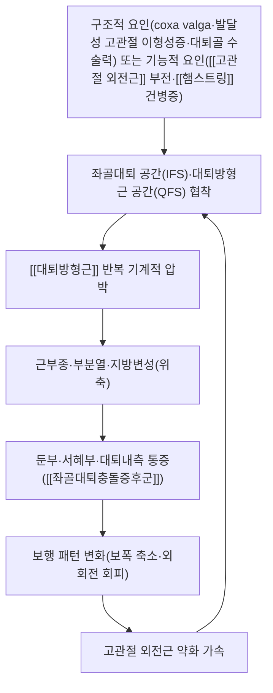

# 🩺 [[좌골대퇴충돌증후군]] (Ischiofemoral Impingement Syndrome / 坐骨大腿衝突症候群, IFI)

> **핵심 3줄 요약 (Key Summary)**:
> - 📍 병소 부위 & 해부·병태생리: [[좌골]] 외측면과 [[대퇴골]] 소전자 사이 공간(ischiofemoral space, IFS 정상 18~26mm)이 협착되며 그 사이를 지나는 [[대퇴방형근]](quadratus femoris)이 반복적으로 기계적 압박·염증·위축을 겪는 질환.
> - 🚩 전형적 임상 양상 & 3대 징후: 깊은 둔부·서혜부 통증과 대퇴 내측 방사통이 3대 주소증이며, 장거리 보행 중 걸리거나 딸깍거리는 느낌(long stride 시 악화)을 호소.
> - 🛠️ 핵심 감별 검사 & 한·양방 다각적 치료 전략: [[장보폭 보행 검사]](long stride walking test)·[[좌골대퇴충돌 검사]](ischiofemoral impingement test)로 유발, MRI로 대퇴방형근 부종·공간 협착 확인, 고관절 외전근 강화 중심 보존치료가 1차.
> - ⚠️ 응급 의뢰 레드플래그 & 악화 요인: 3개월 보존치료(활동 수정·외전근 강화·초음파/CT 유도 대퇴방형근 주사)에도 반응 없는 난치성 통증, 급격한 근력저하·감각이상 동반 시 좌골신경 병변 감별 위해 정형외과 의뢰.

---

## 📌 목차
1. [질환 개요 & 해부학적 병태생리](#1-질환-개요--해부학적-병태생리)
2. [병태생리 메커니즘 & 생체역학적 악순환 네트워크](#2-병태생리-메커니즘--생체역학적-악순환-네트워크)
3. [임상 증상 & 이학적 검사(Physical Exam) 알고리즘](#3-임상-증상--이학적-검사physical-exam-알고리즘)
4. [감별 진단 매트릭스 (Differential Diagnosis)](#4-감별-진단-매트릭스-differential-diagnosis)
5. [한의 통합 치료 프로토콜 (침·약침·추나·한약)](#5-한의-통합-치료-프로토콜-침약침추나한약)
6. [양방 치료 & 병용·의뢰 기준 (Conventional Treatment & Referral)](#6-양방-치료--병용의뢰-기준-conventional-treatment--referral)
7. [재활 운동 & 생활습관 티칭 가이드](#6-재활-운동--생활습관-티칭-가이드)
8. [💡 사용자 진료실 핵심 필기 & 임상 노하우 (Melt-In 잔여 심화 집약)](#7--사용자-진료실-핵심-필기--임상-노하우-melt-in-잔여-심화-집약)
9. [출처 및 학술 참고 문헌 (References)](#8-출처-및-학술-참고-문헌-references)

---

## 1. 질환 개요 & 해부학적 병태생리

> ⚠️ 내용 검토 필요 — 질환/병태생리 메디컬 일러스트 미수록(이번 조사에서 시각 검증 가능한 이미지를 확보하지 못함, `.agents/rules/obsidian-note-standards.md` §4 필수 3종 이미지 규칙 후속 보강 필요)

![[좌골대퇴충돌증후군_MRI_축면영상.jpg|540]]
> [그림 1: ① 질환·병태생리 영상 — 좌골대퇴 공간(IFS) 협착을 보이는 고관절 축면 MRI (PDW SPAIR) / 위키미디어 공용 (CC BY-SA 3.0)]

* **질환 정의 및 분류**: 좌골(정확히는 좌골결절 외측)과 대퇴골 소전자 사이의 좌골대퇴 공간(ischiofemoral space, IFS)이 협착되어 그 사이를 주행하는 [[대퇴방형근]]이 눌리는 고관절 주변 통증 증후군이다. 2009년 Torriani 등이 MRI 소견으로 처음 체계화했으며, 이후 증례보고·메타분석이 축적되었다[^1][^2].
* **역학**: 중년 이후 여성에서 상대적으로 호발한다고 보고되나 표본 크기가 작아 확정적 역학치는 부족하다(⚠️ 확인 불가/추정 — 대규모 역학 연구 부재).
* **관련 해부학적 구조물**:
  * **골격 및 관절**: [[좌골]] 외측면, [[대퇴골]] 소전자, [[고관절]] — IFS(좌골~소전자 간격) 정상 18~26mm, 그 내측 통로인 QFS(quadratus femoris space, 대퇴방형근이 [[햄스트링]] 건과 장요근 사이를 지나는 공간)는 측정 기준에 따라 12~20.4mm로 보고됨[^1].
  * **근육 및 근막**: [[대퇴방형근]](병소 근육), 인접한 [[햄스트링]] 기시부(좌골결절), [[대둔근]]·중둔근 등 고관절 외전근(기능부전 시 유발 요인).
  * **신경 및 혈관**: [[좌골신경]]이 대퇴방형근과 인접 주행하여 협착이 심할 경우 좌골신경 자극 증상과 감별이 필요하다.

---

## 2. 병태생리 메커니즘 & 생체역학적 악순환 네트워크

> ⚠️ 내용 검토 필요 — 관련 해부학적 구조물/신경·혈관 주행 도해 미수록(추후 보강)

![[좌골대퇴충돌증후군_대퇴방형근_해부도.jpg|540]]
> [그림 2: ② 관련 해부 구조물 — 후방 고관절 해부: 대퇴방형근·이상근·좌골신경 주행 / 위키미디어 공용 (CC BY-SA 3.0)]

### 1) 해부학적 포착 및 압박 기전
* 고관절 신전·내전·외회전 자세(특히 보폭이 큰 보행의 입각기 후반)에서 소전자가 좌골에 근접하며 IFS·QFS가 가장 좁아져 대퇴방형근이 반복 압박된다[^1].
* 구조적 원인: coxa valga(경간각 증가), 발달성 고관절 이형성증, 대퇴골 근위부 골절·전자간 절골술·인공관절 치환술 후 변형된 해부 정렬.
* 기능적 원인: 중둔근·소둔근 등 고관절 외전근 부전, 근위 햄스트링 건병증으로 인한 골반 정렬 변화 — 저자들은 "근육 불균형·퇴행성 변화가 협착의 결과가 아니라 원인일 가능성"도 제시한다[^1].

### 2) 생체역학적 연쇄 반응 (Kinetic Chain)
* 대퇴방형근 통증으로 인한 보상성 보행(짧은 보폭, 고관절 외회전 회피)은 반대측 고관절·요추부에 이차적 과부하를 유발할 수 있다(⚠️ 추정 — 직접적 종적 연구는 확인되지 않음).

---

## 3. 임상 증상 & 이학적 검사(Physical Exam) 알고리즘

### 1) 주소증 및 신경학적 증상
* **통증 양상**: 깊은 둔부·서혜부 통증, 대퇴 내측으로의 방사통. 장거리 보행이나 계단 오르내리기에서 악화.
* **운동 장애**: 장보폭 보행 시 고관절 부위의 걸림(clicking)·잠김(locking) 느낌 호소.
* **신경 증상 감별**: 좌골신경과 인접해 주행하므로 심할 경우 좌골신경통 유사 저림이 동반될 수 있어 감별이 필요하다.

### 2) 필수 이학적 검사법 (Physical Examination)
* [[장보폭 보행 검사]] (Long Stride Walking Test): 평소보다 넓은 보폭으로 걷게 하여 환측 입각기 후반에 통증이 재현되면 양성. Gollwitzer 등의 정리에 따르면 민감도 92%·특이도 82%로 보고된다[^1].
* [[좌골대퇴충돌 검사]] (Ischiofemoral Impingement Test): 환자를 건측으로 측와위시킨 뒤 검사측 고관절을 수동으로 신전·내전·외회전시켜 둔부 통증이 재현되면 양성. 민감도 82%·특이도 85%로 보고된다[^1].
* **영상 검사**: MRI에서 대퇴방형근의 부종(고신호강도)·부분열·만성기 지방변성(위축), IFS/QFS 협착 소견을 확인한다.

---

## 4. 감별 진단 매트릭스 (Differential Diagnosis)

| 감별 질환 | 호발 병소 및 원인 | 주소증 차이점 | 특이적 이학적 검사 소견 |
| :--- | :--- | :--- | :--- |
| [[좌골대퇴충돌증후군]] (본 질환) | 좌골~대퇴골 소전자 간 [[대퇴방형근]] 압박 | 장보폭 보행 시 악화되는 둔부·서혜부·대퇴내측 통증 | [[장보폭 보행 검사]]·[[좌골대퇴충돌 검사]] 양성 |
| 근위 [[햄스트링]] 건병증 | 좌골결절 기시부 건 | 앉을 때·저항성 슬굴곡 시 악화, 좌골결절 국소 압통 | 저항성 슬관절 굴곡 시 통증 유발 |
| [[이상근 증후군]] | 이상근에 의한 좌골신경 포착 | 좌골신경 주행을 따른 방사통·저림이 두드러짐 | [[FAIR 검사]] 양성 |
| 대전자 [[활액낭염]] (Greater Trochanteric Pain Syndrome) | 대전자 외측 점액낭·둔근건 | 옆으로 누울 때·대전자부 직접 압통 우세 | 대전자 국소 압통, 저항성 외전 시 통증 |
| [[고관절]] 골관절염 | 관절연골·관절와순 퇴행 | 서혜부 심부통, 아침 강직, 운동범위 전반적 제한 | 고관절 굴곡-내전-내회전(FADIR) 시 서혜부 통증 |

> ⚠️ 확인 불가/추정: 감별질환의 정량적 유병률·중복 이환율은 근거 부족으로 확정하지 않음.

---

## 5. 한의 통합 치료 프로토콜 (침·약침·추나·한약)

> ⚠️ 내용 검토 필요 — 치료 시술점(약침 주입점) 사진 미수록(추후 보강). 아래는 대퇴방형근·둔부 근육학 원칙에 기반한 일반 원칙이며, 본 질환에 특이적인 국내외 한의 임상 문헌은 확인되지 않아 근골격계 통증 일반 원칙을 준용함(⚠️ 확인 불가/추정).

![[좌골대퇴충돌증후군_초음파유도_주사_시술도.png|540]]
> [그림 3: ③ 치료·시술점 — 초음파 유도 심부 둔부(이상근·대퇴방형근 인접) 주사 시술 화면 / 위키미디어 공용 (CC BY 4.0)]

* **침구 치료 (Acupuncture)**: [[대퇴방형근]]·[[이상근]]·[[중둔근]] 트리거포인트 자침, 좌골결절 주변부 심부 자침 시 좌골신경 주행 고려해 안전역 확보.
* **약침 치료 (Pharmacopuncture)**: 대퇴방형근 및 인접 건부착부 염증 완화 목적의 소염 약침을 압통점 중심으로 고려할 수 있음(⚠️ 확인 불가/추정 — 본 질환 특이적 임상연구 미확인).
* **추나 치료 (Chuna Manipulation)**: 골반 정렬·고관절 외회전근 긴장 완화를 위한 관절가동술, 대퇴방형근 부위 근막 이완 수기.
* **한약 치료 (Herbal Medicine)**: 급성기 어혈·염증 완화를 위한 [[활혈거어제]], 만성기 근력저하·퇴행 동반 시 근골 강화 목적의 [[보익제]] 활용을 고려할 수 있음(⚠️ 확인 불가/추정).

---

## 6. 양방 치료 & 병용·의뢰 기준 (Conventional Treatment & Referral)

> 🎯 **이 섹션의 목적**: 환자가 **양방약을 이미 복용 중인 경우가 많다.** 한의원 1차 진료에서 양방 치료를 이해하고, 병용 가능·주의·금기를 판단하며, 언제 의뢰할지 결정한다.

* **약물 치료 (Medication)**:
  * 계열별 약물·용량·기간 — 국내 처방 관행 반영.
  * 작용 기전과 한의 치료와의 상호작용.
* **비약물 시술 (Procedures)**:
  * 주사·차단술·물리치료·보조기 등.
* **수술·시술 적응증 (Surgical Indication)**:
  * 언제 수술로 가는가 — 절대·상대 적응증, 수술 후 경과.
* **한의 병용 판단 (Combination Therapy)**:
  * 병용 가능 / 주의 / 금기. 복용 중 환자의 감량 타이밍·반동 현상.
* **양방·전문과 의뢰 기준 (Referral Criteria)**:
  * 응급 의뢰 트리거와 전문과 의뢰 기준(정형외과·신경외과·내과 등).

	(작성 필요)

---

## 7. 재활 운동 & 생활습관 티칭 가이드

* **이완 및 스트레칭**: 고관절 외회전근·햄스트링의 정적 스트레칭.
* **강화 및 안정화 운동**: 중둔근·소둔근 등 [[고관절 외전근]] 강화 운동이 핵심 — Grimaldi 등은 "고관절 외전근 강화와 골반 조절"을 재활의 중심축으로 제시한다[^3].
* **보행 재훈련**: 통증을 유발하는 과도한 보폭을 일시적으로 줄이고 점진적으로 정상화하는 단계적 부하(graded loading) 원칙 적용.
* **일상생활 자세 티칭**: 장시간 보행·계단 오르내리기 시 휴식 분배, 좌골 압박을 유발하는 자세(다리를 심하게 꼬는 자세 등) 회피.

---

## 8. 💡 사용자 진료실 핵심 필기 & 임상 노하우 (Melt-In 잔여 심화 집약)

> ⚠️ 내용 검토 필요 — 비오님의 실제 진료 경험이 아직 기록되지 않은 신규 미노트화 생성 노트입니다. 진료 중 확인되는 실전 감별 포인트·수기 노하우·환자 설명 스크립트를 이어서 채워주시면 다빈치가 다음 순찰에서 정리해 반영하겠습니다.

---

## 9. 출처 및 학술 참고 문헌 (References)

[^1]: Gollwitzer H, Banke IJ, Schauwecker J, Gerdesmeyer L, Suren C. How to address ischiofemoral impingement? Treatment algorithm and review of the literature. *J Hip Preserv Surg*. 2017;4(4):289-298. doi:10.1093/jhps/hnx035. [PubMed PMID: 29250337](https://pubmed.ncbi.nlm.nih.gov/29250337/)
   - **[연구 요약]**: IFS(18~26mm)·QFS(12~20.4mm) 정상치와 장보폭 보행 검사(민감도 92%·특이도 82%)·좌골대퇴충돌 검사(민감도 82%·특이도 85%)를 제시하고, 보존치료(외전근 강화·초음파/CT 유도 주사) 3개월 실패 시 소전자 절제 등 수술적 치료를 단계적으로 정리한 알고리즘 리뷰. 수술군 Harris Hip Score 43→94점 개선 보고.
[^2]: Taneja AK, Bredella MA, Torriani M, et al. Ischiofemoral impingement syndrome: a meta-analysis. *Skeletal Radiol*. 2015. [PubMed PMID: 25672947](https://pubmed.ncbi.nlm.nih.gov/25672947/)
   - **[연구 요약]**: 좌골대퇴충돌증후군의 영상의학적 진단 기준을 다룬 메타분석(⚠️ 세부 수치는 원문 직접 열람 필요 — 확인 불가/추정).
[^3]: Grimaldi A, Ganderton C, Nasser A. Ischiofemoral impingement: Clinical perspectives for enhancing diagnosis, and rehabilitation. *Musculoskelet Sci Pract*. 2026;84:103592. doi:10.1016/j.msksp.2026.103592. [ScienceDirect](https://www.sciencedirect.com/science/article/pii/S2468781226001086)
   - **[연구 요약]**: 병력청취·통증 위치·장보폭 보행 검사 등 임상 진단 관점과, 고관절 외전근 강화·보행 재훈련·점진적 기능부하를 중심으로 한 비수술적 재활 관점을 정리한 2026년 최신 리뷰.
